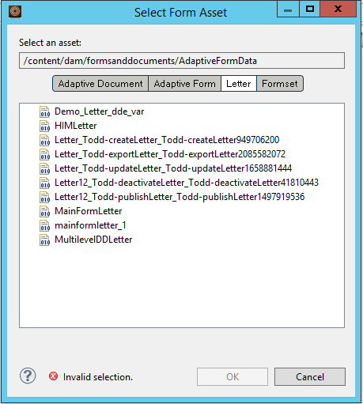

# Integrieren von Anwendungen von Drittanbietern in AEM Forms Workspace{#integrating-third-party-applications-in-aem-forms-workspace}

AEM Forms Workspace unterstützt die Verwaltung von Aufgabenzuweisungen und Abschlussaktivitäten für Formulare und Dokumente. Diese Formulare und Dokumente können XDP-Formulare, Flex®-Formulare oder Guides (nicht mehr unterstützt) sein, die im XDP-, PDF-, HTML- oder Flex-Format wiedergegeben werden.

Diese Funktionen werden weiter verbessert. AEM Forms unterstützt jetzt die Zusammenarbeit mit Drittanbieteranwendungen, die Funktionalität unterstützen, die dem AEM Forms Workspace ähnelt. Ein gängiger Aspekt dieser Funktion ist der Arbeitsablauf der Zuweisung und der nachfolgenden Genehmigung einer Aufgabe. AEM Forms ist eine einheitliche Plattform für AEM Forms-Unternehmensbenutzer. So können alle derartigen Aufgabenzuweisungen oder -genehmigungen für die unterstützten Anwendungen über den AEM Forms Workspace verwaltet werden.

Beispiel: die Integration von Correspondence Management in AEM Forms Workspace. Correspondence Management umfasst das Konzept „Brief“, der abgerufen werden kann und Aktionen zulässt.

## Correspondence Management-Elemente erstellen {#create-correspondence-management-assets}

Erstellen Sie zunächst eine Beispielvorlage für Correspondence Management, die in AEM Forms Workspace gerendert wird. Weitere Informationen finden Sie unter [Erstellen einer Briefvorlage](../../forms/using/create-letter.md).

Greifen Sie über die URL auf die Correspondence Management-Vorlage zu, um zu überprüfen, ob die Correspondence Management-Vorlage erfolgreich wiedergegeben werden kann. Die URL weist ein ähnliches Muster auf wie `https://'[server]:[port]'/lc/content/cm/createcorrespondence.html?cmLetterId=encodedLetterId&cmUseTestData=1&cmPreview=0;`

Dabei ist `encodedLetterId` die URL-kodierte Brief-ID. Verwenden Sie die gleiche Brief-ID, wenn Sie den Wiedergabeprozess für eine Workspace-Aufgabe in der Workbench definieren.

## Erstellen Sie eine Aufgabe, um einen Brief in AEM Workspace zu rendern {#create-a-task-to-render-and-submit-a-letter-in-aem-workspace}

Vergewissern Sie sich vor dem Ausführen dieser Schritte, dass Sie Mitglied der folgenden Gruppen sind:

* cm-agent-users
* Workspace-Benutzer

Weitere Informationen finden Sie unter [Benutzer hinzufügen und konfigurieren](/help/forms/using/admin-help/adding-configuring-users.md).

Verwenden Sie folgende Schritte, um eine Aufgabe zu erstellen, um einen Brief in AEM Workspace zu rendern und zu übermittlen:

1. Starten Sie die Workbench. Melden Sie sich beim localhost als Administrator an.
1. Klicken Sie auf „Datei > Neu > Anwendung“. Geben Sie in das Feld „Anwendungsname“ `CMDemoSample` ein und klicken Sie dann auf „Fertig stellen“.
1. Wählen Sie `CMDemoSample/1.0` und klicken Sie mit der rechten Maustaste auf `NewProcess`. Geben Sie in das Namensfeld `CMRenderer` ein und klicken Sie dann auf „Fertig stellen“.
1. Ziehen Sie die Startpunktaktivitätenauswahl und konfigurieren Sie sie:

   1. Wählen Sie in den Darstellungs-Daten „Ein CRX-Asset verwenden“.

      

   1. Browser für ein Asset. Im Dialogfeld „Formular-Asset auswählen“ werden auf der Registerkarte „Briefe“ alle Briefe auf dem Server angezeigt.

      

   1. Wählen Sie den entsprechende Brief und klicken Sie auf **OK**.

1. Klicken Sie auf „Aktionsprofile verwalten“. Das Dialogfeld „Aktionsprofile verwalten“ wird angezeigt. Stellen Sie sicher, dass „Prozess rendern“ und „Prozess übermitteln“ entsprechend ausgewählt werden.
1. Um den Brief mit einer XML-Datendatei zu öffnen, suchen Sie die entsprechende Datendatei und wählen Sie diese unter „Datenprozess vorbereiten“ aus.
1. Klicken Sie auf OK.
1. Definieren Sie die Variablen für Startpunkt-Ausgabe und Aufgabenanlagen. Die definierten Variablen enthalten Daten zur Startpunktausgabe und zu Aufgabenanlagen.
1. (Optional) Um einen weiteren Benutzer im Arbeitsablauf hinzuzufügen, ziehen Sie eine Aktivitätenauswahl, konfigurieren Sie sie ihn und weisen sie ihn Benutzern zu. Schreiben Sie einen benutzerdefinierten Wrapper (im Beispiel unten angezeigt) oder laden Sie das DSC herunter und installieren Sie es (unten angezeigt), um Briefvorlagen, Startpunktausgabe und Aufgabenanlagen zu extrahieren.

   Ein benutzerdefinierte Beispielwrapper Wrapper wird nachfolgend aufgeführt:

   ```javascript
   public LetterInstanceInfo getLetterInstanceInfo(Document dataXML) throws Exception {
   try {
   if(dataXML == null)
   throw new Exception("dataXML is missing");
   
   CoreService coreService = getRemoteCoreService();
   if (coreService == null)
   throw new Exception("Unable to retrive service. Please verify connection details.");
   Map<String, Object> result = coreService.getLetterInstanceInfo(IOUtils.toString(dataXML.getInputStream(), "UTF-8"));
   LetterInstanceInfo letterInstanceInfo = new LetterInstanceInfo();
   
   List<Document> attachmentDocs = new ArrayList<Document>();
   List<byte[]> attachments = (List<byte[]>)result.get(CoreService.ATTACHMENT_KEY);
   if (attachments != null){
   for (byte[] attachment : attachments)
   { attachmentDocs.add(new Document(attachment)); }
   
   }
   letterInstanceInfo.setLetterAttachments(attachmentDocs);
   
   byte[] updateLayout = (byte[])result.get(CoreService.LAYOUT_TEMPLATE_KEY);
   if (updateLayout != null)
   { letterInstanceInfo.setLetterTemplate(new Document(updateLayout)); }
   
   else
   { throw new Exception("template bytes missing while getting Letter instance Info."); }
   
   return letterInstanceInfo;
   } catch (Exception e)
   { throw new Exception(e); }
   
   }
   ```

   [Abrufen ](assets/dscsample.zip)
von FileDownload DSC: Ein Beispiel-DSC ist in der oben angehängten Datei DSCSample.zip verfügbar. Laden Sie die Datei DSCSample.zip herunter und dekomprimieren Sie sie. Bevor Sie den DSC-Service verwenden, müssen Sie ihn konfigurieren. Weitere Informationen finden Sie unter[ Konfigurieren des DSC-Service](../../forms/using/add-action-button-in-create-correspondence-ui.md#p-configure-the-dsc-service-p).

   Wählen Sie im Dialogfeld „Aktivität definieren“ die entsprechende Aktivität wie getLetterInstanceInfo aus und klicken Sie auf **OK**.

1. Stellen Sie die Anwendung bereit. Speichern Sie bei Aufforderung die Assets.
1. Melden Sie sich beim AEM forms Workspace unter https://&#39;[server]:[port]&#39;/lc/content/ws an.
1. Öffnen Sie die Aufgabe, die Sie in CMRenderer hinzugefügt haben. Der Correspondence Management-Brief wird angezeigt.

   

1. Geben Sie die erforderlichen Daten ein und senden Sie den Brief ab. Das Fenster schließt. In diesem Prozess wird die Aufgabe dem Benutzer zugewiesen, der im Arbeitsablauf in Schritt 9 angegeben wurde.

   >[!NOTE]
   >
   >Die Sendeschaltfläche wird erst aktiviert, nachdem alle erforderlichen Variablen im Brief ausgefüllt sind.
