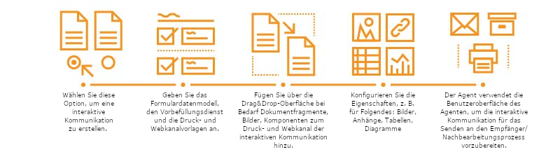

# Interaktive Kommunikation - Übersicht {#interactive-communications-overview}

Dieser Artikel enthält eine Übersicht, Beispiele für Anwendungsfälle, einen Erstellungs-Workflow und Unterschiede zwischen der interaktiven Kommunikation und dem Brief.

Interaktive Kommunikation zentralisiert und verwaltet die Erstellung, Zusammenstellung und Bereitstellung sicherer, personalisierter und interaktiver Schriftstücke, wie z. B. Geschäftskorrespondenz, Dokumente, Kontoauszüge, Hinweise zu Vorteilen, Marketing-E-Mails, Rechnungen und Willkommenskits.

## Schlüsselfunktionen {#key-capabilities}

Im Folgenden sind die wichtigsten Funktionen von interaktiver Kommunikation aufgeführt:

- OOTB-Integration mit dem Formulardatenmodell, um einen einfachen und rationalisierten Zugriff auf Backend-Datenbanken und andere CRM-Systeme wie MS® Dynamics zu ermöglichen
- Eine integrierte Autorbenutzeroberfläche für Druck- und Webkanal mit der Möglichkeit zum automatischen Erstellen von Druck- und Webkanälen
- Diagramme zur Darstellung von Informationen in leicht verständlichen visuellen Formaten in Druck und Web
- Dokumentfragmente unterstützen den Regeleditor und das Formulardatenmodell
- Benutzeroberfläche für Agenten zeigt Druck- und Webvorschau der interaktiven Kommunikation an
- Drag-and-Drop-Komponenten zum schnellen Erstellen von Druck- und Webkanälen

## Erstellung einer interaktiven Kommunikation {#interactive-communication-creation}

### Workflow {#workflow}

Um eine interaktive Kommunikation zu erstellen, lassen Sie die [Bausteine](#buildingblocks) für interaktive Kommunikation bereit und führen Sie dann die folgenden Schritte aus:

1. Wählen Sie [Erstellen Sie eine interaktive Kommunikation](/help/forms/using/create-interactive-communication.md).

1. Geben Sie das [Formulardatenmodell](/help/forms/using/data-integration.md), den Vorbefüllungs-Dienst und die [Druck- und Webkanal-Vorlagen](/help/forms/using/web-channel-print-channel.md) an. Sie können den Webkanal über den Druckkanal generieren.

1. Fügen Sie mit der [Drag &amp; Drop-Beutzeroberfläche](/help/forms/using/introduction-interactive-communication-authoring.md) je nach Bedarf Dokumentfragmente, Bilder, Komponenten zum Druck- und Webkanal der interaktiven Kommunikation hinzu.
1. Konfigurieren Sie die Eigenschaften für die eingefügten Komponenten wie folgt:

   1. [Bilder](/help/forms/using/create-interactive-communication.md#step2)
   1. [Tabellen](/help/forms/using/create-interactive-communication.md#tables)  (einschließlich Layout-Fragmente)
   1. [Diagramme](/help/forms/using/chart-component-interactive-communications.md)
   1. [Dokumentfragmente](/help/forms/using/create-interactive-communication.md#document-fragment-properties)

1. Zeigen Sie Druck- und Webkanäle in der Vorschau an und, falls erforderlich, bearbeiten Sie die interaktive Kommunikation.
1. Der Agent verwendet die Benutzeroberfläche für Agenten, um[ die interaktive Kommunikation vorzubereiten](/help/forms/using/prepare-send-interactive-communication.md) und sie an den Empfänger/Nachbearbeitungsprozess zu senden.

### Bausteine {#buildingblocks}

Im Folgenden sind die Bausteine &#x200B;&#x200B;aufgeführt, die für die Erstellung einer interaktiven Kommunikation benötigt werden:

- [Formulardatenmodell](/help/forms/using/data-integration.md)
- [Druck- und Webkanal-Vorlagen](/help/forms/using/web-channel-print-channel.md)
- [Dokumentfragmente](/help/forms/using/document-fragments.md)
- Bilder
-  Designs für den Webkanal

## Interaktive Kommunikation im Vergleich zu Correspondence Management {#interactive-communications-vs-correspondence-management}

Interaktive Kommunikation ist der standardmäßige und empfohlene Ansatz zur Erstellung von Kundenkommunikation. Um die Briefe, die in AEM 6.3 Forms und AEM 6.2 Forms erstellt wurden, weiterhin zu verwenden, müssen Sie ein [Kompatibilitätspaket installieren](/help/forms/using/compatibility-package.md). Im Folgenden finden Sie einen Vergleich zwischen den Funktionen der interaktiven Kommunikation und des Briefs.

<table>
 <tbody>
  <tr>
   <td><strong>Funktion</strong></td>
   <td><strong>Interaktive Kommunikation</strong></td>
   <td><strong>Brief</strong></td>
  </tr>
  <tr>
   <td>Ausgabe</td>
   <td>Druck und Web</td>
   <td>Druck</td>
  </tr>
  <tr>
   <td>Schema</td>
   <td>Formulardatenmodell </td>
   <td>Datenwörterbuch </td>
  </tr>
  <tr>
   <td>Lokalisierung</td>
   <td>Wird nicht im Formulardatenmodell unterstützt</td>
   <td>Wird im Datenwörterbuch unterstützt</td>
  </tr>
  <tr>
   <td>Regeleditor</td>
   <td>
    <ul>
     <li>Text- und Bedingung unterstützen den Regeleditor zum Erstellen von Inline-Bedingungen</li>
     <li>Der Editor für die interaktive Kommunikation unterstützt die Anwendung von Regeln für Komponenten des Webkanals</li>
    </ul> </td>
   <td>Keine Benutzeroberfläche für die Erstellung eines bedingten Ausdrucks</td>
  </tr>
  <tr>
   <td>Authoring –</td>
   <td>Drag-and-Drop-Benutzeroberfläche für Erstellung von Druck- und Webkanal</td>
   <td>Kein Drag-and-Drop-Mechanismus </td>
  </tr>
  <tr>
   <td>Diagramme</td>
   <td>Diagramme werden sowohl im Druck- als auch im Webkanal unterstützt</td>
   <td>Nicht unterstützt</td>
  </tr>
  <tr>
   <td>Designs</td>
   <td>Verwendet Designs, um den Webkanal zu gestalten</td>
   <td>Unterstützt keine Designs</td>
  </tr>
   <tr>
   <td>Entwürfe</td>
   <td>Unterstützt</td>
   <td>Unterstützt</td>
  </tr>
  <tr>
   <td>Prüfung</td>
   <td>Nicht unterstützt</td>
   <td>Unterstützt</td>
  </tr>
   <tr>
   <td>Versionierung</td>
   <td>Nicht unterstützt</td>
   <td>Unterstützt</td>
  </tr>
   <tr>
   <td>Entwürfe Verwalten von Instanzen</td>
   <td>Nicht unterstützt</td>
   <td>Unterstützt</td>
  </tr>
  <tr>
   <td>Stapelverarbeitung</td>
   <td>Unterstützt </td>
   <td>Unterstützt</td>
  </tr>
  <tr>
   <td>Agentsignatur</td>
   <td>Nicht unterstützt</td>
   <td>Unterstützt</td>
  </tr>
  <tr>
   <td>Remote-Funktionen</td>
   <td>Nicht unterstützt</td>
   <td>Unterstützt</td>
  </tr>
 </tbody>
</table>
