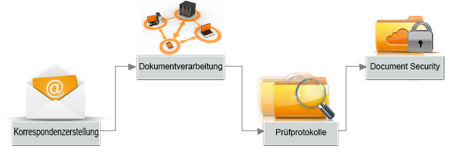

# Einführung in AEM Forms{#introduction-to-aem-forms}

Informationen zu neuesten Funktionen und Verbesserungen in AEM Forms finden Sie unter [Neue Funktionen in AEM Forms](../../forms/using/whats-new.md).

## Info zu AEM Forms {#about-aem-forms}

Adobe Experience Manager (AEM) ist eine benutzerfreundliche Lösung, mit der Sie komplexe digitale Formulare erstellen, verwalten, veröffentlichen und aktualisieren und dabei in Back-End-Prozesse, Geschäftsregeln und Daten integrieren können.

Mit AEM Forms lassen sich Funktionen zum Erstellen, Verwalten und Veröffentlichen von Formularen mit Korrespondenzverwaltung, Dokumentensicherheit und integrierter Analyse zu einer griffigen End-to-End-Lösung kombinieren. AEM Forms wurde für die Verwendung sowohl über Web- als auch über Mobilkanäle konzipiert und kann effizient in Ihre Geschäftsprozesse integriert werden, sodass Sie Papierprozesse und Fehler reduzieren können, während Sie die Effizienz verbessern.

Bei großen Unternehmen werden Formulare häufig nur einmal erstellt und dann wiederverwendet, indem sie in ein Content-Management-System kopiert werden. Eine umfangreiche Datenbank mit Formularen aktuell zu halten und diese für Erkennungsfunktionen zugänglich zu machen, kann eine erhebliche Herausforderung darstellen. AEM bietet ein anpassbares Forms Portal, das Kunden eine Suchfunktion und den Zugriff auf Formulare über eine Weboberfläche oder mobile Kanäle ermöglicht.

AEM Forms bietet Tools zur Formularverwaltung, mit denen sich neben adaptiven Formularen auch XFA-Formulare, PDF-Formulare und zugehörige Elemente verwalten lassen. Weitere Informationen finden Sie unter [Einführung in das Verwalten von Formularen](../../forms/using/introduction-managing-forms.md).

### Schlüsselfunktionen {#key-capabilities}

Zusammenfassend lässt sich sagen, dass AEM Forms leistungsstarke Formularverwaltungsfunktionen wie die folgenden bietet, die manuelle Prozesse reduzieren und die Kundenzufriedenheit erhöhen.

* Ein zentralisiertes Forms Portal zum Entwickeln und Bereitstellen von dynamischen Formularen, einschließlich PDF, HTML5 und adaptive Formulare
* Eine benutzerfreundliche grafische Benutzeroberfläche, mit der Benutzer Formulare mühelos importieren, verwalten, in der Vorschau anzeigen und veröffentlichen können
* Ein interaktives Formularverzeichnis mit leistungsstarken Suchfunktionen anhand von Schlüsselwörtern, Tags und Metadaten
* Dynamische Erkennung des Geräts und Standorts eines Benutzers, um das Formular korrekt über Web- und mobile Kanäle wiederzugeben
* Integration in Adobe Analytics, um Formularverwendungsmetriken effektiv zu messen
* Integration mit Adobe Document Cloud-eSign-Diensten oder Scribble zur elektronischen Verschlüsselung von Dokumenten mit vertraulichen Informationen
* Automatisierte Formularveröffentlichungsfunktionen und die Möglichkeit, zeitnahe, personalisierte und konsistente Kommunikation über mehrere Kanäle bereitzustellen

## AEM-Formulartypen  {#aem-form-types}

Mit AEM Forms können Sie neue und vorhandene Formulare erweitern, um Folgendes zu erstellen:

* pixelgenaue, paginierte HTML- und PDF-Formulare, die fast wie Papier aussehen, oder
* adaptive Formulare, die automatisch für das Gerät und den Browser eines Benutzers angezeigt werden.

**PDF-Formulare**

PDF-Formulare können offline ausgefüllt und lokal gespeichert werden. Sie können die Formulardaten dann senden, wenn Sie wieder online sind. Sie können 2D-Strichcodes verwenden, um Formulardaten zu erfassen, und digitale Signaturen verwenden, um die Authentizität für Benutzer zu validieren.

**HTML-Formulare**

Browserbasierte HTML5-Formulare können auf Mobilgeräten und Desktop-Browsern angezeigt werden. Sie können HTML-Formulare mithilfe von Scribble oder eSign-Dienste elektronisch signieren.

**Adaptive Formulare**

Adaptive Formulare können sich dynamisch an Benutzerantworten anpassen, indem sie Felder oder Abschnitte nach Bedarf hinzufügen oder entfernen. Mit AEM können Sie Adobe XML-Formularvorlagen verwenden, um adaptive Formulare zu erstellen.

### Unterstützte Funktionen {#supported-features}

Alle Formulartypen unterstützen die folgenden Funktionen:

* Dynamisches Layout
* Formularfeldvalidierung
* Kontextbezogene Hilfe
* Skripte und Verarbeitung von XML-Daten
* Barrierefreiheitsdesign und -prüfung
* Möglichkeit, Formulare auf Serverseite zu speichern
* Unterstützung für Dateianlagen
* Integration mit HTML Workspace zur Datenerfassung

## Offline-Datenerfassung {#offline-data-collection}

Wenn Formulardaten gesendet wurden, verbindet Adobe Experience Manager die Formulardaten mit vorhandenen Systemen, Geschäftsregeln und den gewünschten Personen.

AEM Forms umfasst Forms Workspace, eine mobile Anwendung, die Ihre digitalen Geschäftsprozesse auf Mobilgeräte erweitert. Mit Forms Workspace können Sie Daten auch dann erfassen und aufzeichnen, wenn Sie offline sind. Forms Workspace nutzt die Funktionen Ihres Mobilgeräts und ermöglicht es Ihnen, Fotos und Videos aufzunehmen und Daten wie Zeitstempel und andere Informationen zu erfassen. Wenn Sie das nächste Mal mit einem Netzwerk verbunden sind, können Sie die erfassten Daten synchronisieren.

Besonders für Mitarbeiter, die viel unterwegs sind, ist es nützlich, Daten offline zu erfassen und sie zu synchronisieren, wenn sie das nächste Mal online sind. Dies verbessert die Produktivität und reduziert Fehler.

**Vorteile der Verwendung von Forms Workspace für die Offline-Datenerfassung**

* Benutzerfreundliche HTML-Workspace-Anwendung für Aufgabenzuweisung und -verfolgung
* Workflow-Designumgebung mit Drag-&amp;-Drop-Funktion
* Enterprise Content Management-(ECM-)Connectors
* Unterstützung offener Standards, einschließlich XML und SOAP, um Formulardaten mit Unternehmenssystemen zu verbinden
* Standardmäßig verfügbare HTML-Berichte, um Arbeitsrückstände, Warteschlangen und wichtige Leistungsindikatoren (KPIs) zu überwachen
* Anpassbare Dashboards für Einblick in Geschäftsvorgänge in Echtzeit
* API für die Verbindung mit Berichtstools von Drittanbietern

## Personalisierte Kommunikation {#personalized-communication}

Eine wichtige Komponente für effizienten digitalen Self-Service ist die Kommunikation zeitnaher, personalisierter Informationen, auf die Benutzer von überall aus und mit jedem Gerät zugreifen können. Personalisierte und zeitnahe Kommunikation kann Konversionsraten und Benutzerzufriedenheit verbessern.

Mit AEM Forms können Benutzer interessante personalisierte Benutzererfahrungen schaffen, indem sie Dokumentvorlagen anpassen, Informationen aus Back-End-Prozessen integrieren und interaktive Komponenten aufnehmen. Eine intuitive Benutzeroberfläche hilft Benutzern ohne technische Fachkenntnisse dabei, Geschäftsregeln zu entwickeln, die bestimmen, ob eine Kommunikation basierend auf einer Anforderung erstellt oder eine benutzergenerierte Antwort initiiert werden soll.

Personalisierte Dokumente, wie Empfangsbestätigungen, Willkommens-Kits und Anweisungen, können einfach über mehrere Kanäle bereitgestellt werden. Unternehmen können Traffic zu personalisierten Internetportalen steuern, was zu Registrierungen oder Kauf von zusätzlichen Diensten führt.

**Wichtigste Funktionen**

* Korrespondenz-Authoring-Umgebung mit Unterstützung für Vorlagen, Inhaltsblöcke, Geschäftsregeln und mehr
* Dokumentkonvertierung und -assemblierung
* Unterstützung für bedarfsmäßige oder Batch-Dokumentzustellung über mehrere Kanäle, einschließlich Web, E-Mail und Papier
* Prüfprotokolle mit Änderungshistorie
* Unterstützung für digitale Signaturen zum Validieren der Inhaltsintegrität und der Identität des Unterzeichners
* Document Security-Add-On für AEM Forms mit Funktionen für Verschlüsselung, Nutzungsrichtlinien, Verfolgung und Prüfung

Optimierter Workflow für personalisierte Kommunikation
