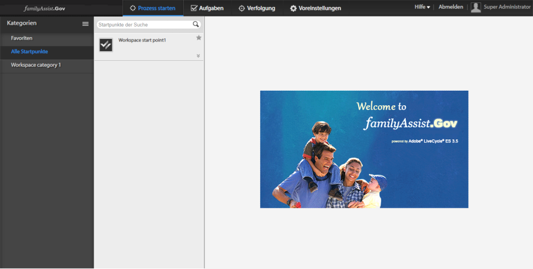

# Einführung zur Anpassung des AEM Forms Workspace{#introduction-to-customizing-aem-form-workspace}

AEM Formulararbeitsbereich bietet Funktionen zum Ändern der Darstellungssemantik und der Funktionalität der zugehörigen Benutzeroberfläche. Die Anpassungen zum Ändern des Stils, des Layouts, der Formatierung, des Branding und der Kernfunktion werden unten beschrieben.

Beispiel für einen benutzerdefinierten Workspace

## Arten der Anpassung {#types-of-customizations}

AEM Forms Workspace unterstützt viele Anpassungen, mit denen das Layout, die Darstellung, die Funktionalität und andere Aspekte der Benutzeroberfläche aktualisiert werden können. Bei den Anpassungen wird mindestens eins der folgenden Faktoren aktualisiert:

* Aussehen der Benutzeroberfläche
* Funktionen mithilfe der semantischen Anpassungen
* Wiederverwenden von HTML-Komponenten in anderen Anwendungen

### Änderungen der Benutzeroberfläche {#user-interface-changes}

Sie können das Aussehen, Layout und andere Darstellungsfaktoren von AEM Forms Workspace ändern. Ändern Sie den Workspace durch Anpassen der CSS- und HTML-Vorlagen und JavaScript™-Dateien. Alle Standarddateien werden in der Standardinstallation bereitgestellt.

Die am häufigsten anwendbaren Schritte werden unter [Allgemeine Schritte zur Anpassung von AEM Forms Workspace](../../forms/using/generic-steps-html-workspace-customization.md) beschrieben. Einzelne Beispiele für Anpassungen, einschließlich der ausführlichen Schritte, finden Sie in den jeweiligen Artikeln am Ende des Artikels.

#### Grundlagen des Stylesheet  {#understanding-the-style-sheet}

Bevor Sie Workspace anpassen, machen Sie sich mit dem Standard-Stylesheet vertraut, das mit AEM Forms unter /libs/ws/css/style.css bereitgestellt wird.

Zur Anpassung des Workspace wird empfohlen, dass Sie sich mit dem vorhandenen Stylesheet „style.css“ im Ordner /libs/ws/css vertraut machen. Einige wichtige Komponenten werden im Folgenden beschrieben.

<table>
 <tbody>
  <tr>
   <th>
CSS-Element
 </th>
   <th>
Geänderte Benutzeroberflächenkomponente
 </th>
  </tr>
  <tr>
   <td>
#header
 </td>
   <td>
Kopfzeile des AEM Forms-Arbeitsbereichs
 </td>
  </tr>
  <tr>
   <td>
.categoryList
 </td>
   <td>
Kategorienliste
 </td>
  </tr>
  <tr>
   <td>
.categoryList .header
 </td>
   <td>
Header der Kategorienliste
 </td>
  </tr>
  <tr>
   <td>
.categories, .filters
 </td>
   <td>
Platz unterhalb der Kategorienliste
 </td>
  </tr>
  <tr>
   <td>
.category, .filter
 </td>
   <td>
Kategorie
 </td>
  </tr>
  <tr>
   <td>
.category:hover, .category.selected, .filter:hover, .filter.selected
 </td>
   <td>
Ausgewählte Kategorie und Mouseover-Stil der Kategorie
 </td>
  </tr>
  <tr>
   <td>
categoryListBar .tool, categoryListBar .content
 </td>
   <td>
Seite für den Startprozess (geschlossene Kategorienliste)
 </td>
  </tr>
  <tr>
   <td>
filterListBar .tool, filterListBar .content
 </td>
   <td>
Aufgabenseite (geschlossene Filterliste)
 </td>
  </tr>
  <tr>
   <td>
processNameListBar .tool, processNameListBar .content
 </td>
   <td>
Seite „Verfolgung“ (geschlossene Prozessnamenliste)
 </td>
  </tr>
  <tr>
   <td>
.startPointList, .tasklist
 </td>
   <td>
Startpunktliste oder Aufgabenliste
 </td>
  </tr>
  <tr>
   <td>
.startPointList .header, .tasklist .header
 </td>
   <td>
Header einer Startpunktliste oder einer Aufgabenliste
 </td>
  </tr>
  <tr>
   <td>
.startpoint.selected, .task.selected
 </td>
   <td>
Ausgewählter Startpunkt oder ausgewählte Aufgabe
 </td>
  </tr>
  <tr>
   <td>
.startpoint.selected .description, .task.selected .description
 </td>
   <td>
Beschreibung des ausgewählten Startpunkts oder der Aufgabe
 </td>
  </tr>
  <tr>
   <td>
#taskarea
 </td>
   <td>
Aufgabenbereich
 </td>
  </tr>
  <tr>
   <td>
#header .dropdown
 </td>
   <td>
Benutzer-Dropdown-Komponente im Header
 </td>
  </tr>
  <tr>
   <td>
.sortDrop dd ul
 </td>
   <td>
Dropdown-Komponente für Sortieraufgabe
 </td>
  </tr>
 </tbody>
</table>

#### CSS {#css}

Das Erscheinungsbild von AEM Forms Workspace wird von einer CSS übernommen. Durch Anpassen der CSS können Sie die Darstellungseigenschaften des Workspace ändern, z. B. die Schriftarten, Farben, das Branding und Layout.

Die wesentlichen Schritte für die CSS-Anpassung sind:

* Erstellen Sie die eine CSS-Datei.
* Fügen Sie der CSS-Datei Stilelemente hinzu. Weiteren Informationen finden Sie im entsprechenden Artikel zum Thema CSS-Stile.
* Aktualisieren Sie die Verweise in `html.jsp`.

Die genauen Schritte für diese Anpassungen finden Sie unter [Allgemeine Schritte zur Anpassung von AEM Forms Workspace](../../forms/using/generic-steps-html-workspace-customization.md). Die mit AEM Forms Workspace bereitgestellte CSS-Datei befindet sich unter /libs/ws/css/. Verwenden Sie für diese CSS-Anpassungen das [Ship-Paket](../../forms/using/introduction-customizing-html-workspace.md#p-crx-package-p). Einzelne Beispiele für CSS-Anpassungen finden Sie in den jeweiligen Hilfethemen am Ende des Artikels.

#### Bild {#image}

Sie können den AEM Forms-Arbeitsbereich anpassen, um Avatare von Benutzern hinzuzufügen oder das Logo Ihres Unternehmens hinzuzufügen. Verwenden Sie für diese Anpassungen das [Ship-Paket](../../forms/using/introduction-customizing-html-workspace.md#p-crx-package-p).

Die wesentlichen Schritte für die Anpassungen der Bilder sind:

* Installieren und konfigurieren Sie WebDAV.
* Fügen Sie neue Bilder hinzu.
* Fügen Sie neue Stile entsprechend den hinzugefügten Bildern hinzu.
* Stellen Sie eine Verknüpfung zu der neuen CSS-Datei in der Datei `html.jsp` her.

Um mit dem Anpassen der Bilder in AEM Forms Workspace zu beginnen, führen Sie die [Generischen Schritte zur Anpassung von AEM Forms Workspace](../../forms/using/generic-steps-html-workspace-customization.md) aus. Einzelne Beispiele für Bildanpassungen finden Sie in den jeweiligen Hilfethemen am Ende des Artikels.

#### HTML-Vorlage {#html-template}

HTML-Vorlagen helfen dabei, das Erscheinungsbild und Layout der Workspace-Benutzeroberfläche zu definieren. Indem Sie die Standard-HTML-Vorlagen aktualisieren, können Sie das Layout der Standard-Benutzeroberfläche anpassen.

Die wesentlichen Schritte für die Anpassungen der HTML-Vorlagen sind:

* Erstellen Sie in einem benutzerdefinierten Ordner die Kopien von den erforderlichen Standarddateien.
* Fügen Sie dem benutzerdefinierten Ordner neue Vorlagen hinzu.
* Nehmen Sie an den kopierten Dateien die entsprechenden Aktualisierungen vor, z. B. die Aktualisierung des Pfads der neuen Vorlage.

Einzelne Beispiele für diese Anpassungen finden Sie in den jeweiligen Hilfethemen am Ende des Artikels. Wählen Sie je nach der anzupassenden Vorlage das [Ship-Paket](../../forms/using/introduction-customizing-html-workspace.md#p-crx-package-p) oder das [Dev-Paket](../../forms/using/introduction-customizing-html-workspace.md#p-crx-package-p).

### Änderung der Semantik  {#semantic-changes}

Um die AEM Forms Workspace-Funktion zu ändern, ändern Sie den JavaScript-Quellcode. Änderungen in der Kernfunktion werden als Semantikänderungen bezeichnet. Ändern Sie Modelle, Ansichten und Vorlagen, die als Teil des Quellcodes von AEM Forms Workspace bereitgestellt werden.

Die wichtigsten Schritte zum Durchführen semantischer Änderungen zur Änderung der Funktionalität von AEM Forms Workspace sind:

* Erstellen Sie in einem benutzerdefinierten Ordner die Kopien von den entsprechenden Standarddateien.
* Fügen Sie dem benutzerdefinierten Ordner neue Modelle und Ansichten hinzu.
* Nehmen Sie die erforderlichen Aktualisierungen vor, z. B. die Aktualisierung der Pfade der neu hinzugefügten Modelle und Ansichten in den Standard-JavaScript-Dateien.
* Minimieren Sie das Paket zum Optimieren der Leistung.

Weitere grundlegende Informationen zu den Komponenten, die Teil des Quellcodes sind, finden Sie unter [Beschreibung wiederverwendbarer Komponenten](/help/forms/using/description-reusable-components.md). Für diese Anpassungen verwenden Sie das Dev-Paket.

### Wiederverwendbare Komponenten {#reusable-components}

Da AEM Forms Workspace eine komponentenbasierte Software ist, kann es einfach angepasst und wiederverwendet werden. Integrieren Sie mühelos die Workspace-Komponenten in Ihre Webanwendungen.

Weitere grundlegende Informationen finden Sie unter [Beschreibung der wiederverwendbaren Komponenten](/help/forms/using/description-reusable-components.md) und Anweisungen zur Verwendung der Komponenten finden Sie unter [Integrieren von AEM Forms Workspace-Komponenten in Webanwendungen](/help/forms/using/description-reusable-components.md).

## Erstellen von AEM Forms Workspace-Code {#building-html-workspace-code}

### SDK-Paket {#sdk-package}

Das Paket enthält den Quellcode von AEM Forms Workspace. Das Paket ist unter `[LC root]\sdk\html-workspace\adobe-lc-workspace-src.zip` verfügbar.

Es dient vor allem für Anpassungen, denn es bietet Funktionen um Folgendes zu generieren:

* CRX-Pakete für Ship-, Debug- und Dev-Profile (siehe unten unter [CRX-Pakete](../../forms/using/introduction-customizing-html-workspace.md#p-crx-package-p)).
* Minimierte Version des benutzerspezifischen Codes (für Semantikänderungen).

#### WS-Inhalt  {#ws-content}

* client-pkg:

   * src – Enthält die Artefakte, die erforderlich sind, um CRX-Knotenpunkte zu erstellen.
   * pom.xml – Das Skript zum Erstellen von Bereitstellungspaketen für verschiedene Profile WS-Deploy Package

* client-html:

   * assembly - Enthält zip.xml , das vom Skript zum Erstellen des AEM Forms Workspace-SDK verwendet wird.
   * src/main/webapp -

      * css - Enthält Stylesheets für AEM Forms Workspace.
      * images - Enthält die Bilder, die in AEM Forms Workspace verwendet werden.
      * js:

         * libs – Enthält alle Drittanbieterbibliotheken, die in AEM Forms Workspace verwendet werden.
         * licenses – Enthält Lizenzen für HTML- und JS-Dateien sowie den Code, der als Präfix für diese Lizenzen dient und sie den entsprechenden Quelldateien zuordnet.
         * minifier - Wird für die Kombination, Minimierung und Verschleierung von benutzerdefiniertem JavaScript-Code verwendet.
         * resourcejs_optimizer - Wird für die Kombination, Minimierung und Verschleierung von JavaScript-Quellen verwendet.
         * resource_generator – Wird für die Generierung von register.js und modelcontrollerpath.js verwendet.
         * runtime:

            * initializer - Enthält initializer.js, das zum Initialisieren der Backbone-Ansichten und -Modelle in AEM Forms Workspace verwendet wird.
            * models - Enthält Backbone-Modelle aller Komponenten in AEM Forms Workspace.
            * routes - Enthält JavaScript-Dateien und HTML-Dateien, die den Startprozess, Aufgaben, Tracking und Voreinstellungen in AEM Forms Workspace laden.
            * services - Enthält in AEM Forms Workspace verwendete service.js. Alle Serveraufrufe erfolge über service.js.
            * templates - Enthält alle Vorlagen, d. h. HTML-Dateien aller Ansichten in AEM Forms Workspace.
            * util - Enthält alle in AEM Forms Workspace verwendeten Dienstprogrammdateien (javascript).
            * views - Enthält Backbone-Ansichten aller Komponenten in AEM Forms Workspace.
         * main.js
         * router.js
      * libs/ws: pdf.html und pluginPing.pdf werden zum Laden von PDF forms in AEM Forms Workspace verwendet und WSNextAdapter.swf wird zum Laden von SWF-Formularen und Guides in AEM Forms Workspace verwendet.
      * locales:

         * de-DE - Enthält translation.json für Deutsch.
         * en-US - Enthält translation.json für English.
         * fr-FR - Enthält translation.json für Französisch.
         * ja-JP - Enthält translation.json für Japanisch.
         * html.jsp - Enthält Code, um aktuelles Browser-Gebietsschema herauszufinden.
      * html.jsp
      * GET.jsp

### CRX-Paket  {#crx-package}

Das CRX-Paket kann auf dem CRX™-Repository bereitgestellt werden. Sie ist unter `[LC root]\crx-repository\install\adobe-lc-workspace-pkg.zip` verfügbar.

Dieses Paket kann mithilfe der drei folgenden Profile erstellt werden, die nachstehend beschrieben werden.

| **Profil** | **Beschreibung** | **Nutzung** |
|---|---|---|
| Ship-Profil | Dieses Profil erstellt ein CRX-Paket der kleinstmöglichen Größe mithilfe der Minimierung. Dieses Paket ist das effizienteste. Alle JavaScript™-Dateien werden zusammengefasst und zu einer JS-Datei minimiert. | Verwenden Sie dieses Profil, wenn keine weiteren Semantikänderungen in den JS-Dateien erforderlich sind. |
| Debug-Profil | Dieses Profil erstellt ein mitteleffizientes CRX-Paket. Die Größe des Pakets ist etwas größer als die Größe eines Pakets, das mit dem Ship-Profil erstellt wird. Dieses Paket fasst die meisten JavaScript-Dateien in einer JS-Datei zusammen. | Verwenden Sie dieses Profil für das Debuggen. |
| Dev-Profil | Dieses Profil erstellt ein CRX-Paket der größtmöglichen Größe. Alle JavaScript-Dateien sind separat verfügbar, wie im SDK-Paket. | Verwenden Sie dieses Profil, wenn Semantikänderungen notwendig sin. |

#### Ship-Profil  {#ship-profile}

#### Befehl {#command}

* mvn clean -P Ship install auf client-pkg von Source-Paket an Client gesendet.
* Die Befehlsausführung von Ship-Profilen funktioniert nur auf einer 64-Bit-JVM.

#### WS-Inhalt {#ws-content-1}

* css - Enthält style.css, ie.css und jqueri-ui.css.
* images - Enthält alle Bilder.
* js:

   * libs:

      * require - Enthält require.js.
      * jqueryui - Enthält jquery.ui.datepicker.ja.js.
   * runtime:

      * templates - Enthält alle Vorlagen, d. h. HTML-Dateien aller Komponenten in AEM Forms Workspace.
   * main.js (kombiniert, minimiert und verschleiert).
   * registry.js

* libs:

   * ws - Enthält pluginPing.pdf, pdf.html und WSNextAdapter.swf.

* Locale - Enthält .content.xml.
* locales:

   * de-DE - Enthält translation.json für Deutsch.
   * en-US - Enthält translation.json für English.
   * fr-FR - Enthält translation.json für Französisch.
   * ja-JP - Enthält translation.json für Japanisch.
   * html.jsp - Enthält Code, um aktuelles Browser-Gebietsschema herauszufinden.

* Index - Enthält .content.xml.
* profile - Enthält offline.jsp .
* GET.jsp
* html.jsp
* content.xml
* _rep_policy.xml

#### Debug-Profil {#debug-profile}

#### Befehl {#command-1}

* mvn clean -P Debug-Installation auf Client-Paket
* Befehlsausführung von Debug-Profil funktioniert nur auf 64-Bit-JVM.

#### WS-Inhalt {#ws-content-2}

* css - Enthält style.css, ie.css und jqueri-ui.css.
* images - Enthält alle Bilder.
* js:

   * libs:

      * require - Enthält require.js.
      * jqueryui - Enthält jquery.ui.datepicker.ja.js.
   * runtime:

      * templates - Enthält alle Vorlagen, d. h. HTML-Dateien aller Komponenten in AEM Forms Workspace.
   * main.js (kombiniert).
   * registry.js

* libs:

   * ws - Enthält pluginPing.pdf, pdf.html und WSNextAdapter.swf.

* Locale - Enthält .content.xml.
* locales:

   * de-DE - Enthält translation.json für Deutsch.
   * en-US - Enthält translation.json für English.
   * fr-FR - Enthält translation.json für Französisch.
   * ja-JP - Enthält translation.json für Japanisch.
   * html.jsp - Enthält Code, um aktuelles Browser-Gebietsschema herauszufinden.

* Index - Enthält .content.xml.
* profile - Enthält offline.jsp .
* GET.jsp
* html.jsp
* content.xml
* _rep_policy.xml

#### Dev-Profil {#dev-profile}

#### Befehl {#command-2}

mvn clean -P Dev-Installation auf Client-Paket

#### WS-Inhalt  {#ws-content-3}

* css - Enthält style.css, ie.css und jqueri-ui.css.
* images - Enthält alle Bilder.
* js:

   * libs - Enthält alle in AEM Forms Workspace verwendeten Bibliotheken.
   * require - Enthält require.js
   * jqueryui - Enthält jquery.ui.datepicker.ja.js
   * runtime:

      * initializer - Enthält initializer.js und modelcontrollerpath.js .
      * models - Enthält Modelle aller Komponenten in AEM Forms Workspace.
      * routes - Enthält JavaScript-Dateien und HTML-Dateien, die den Startprozess, Aufgaben, Tracking und Voreinstellungen in AEM Forms Workspace laden.
      * services - Enthält in AEM Forms Workspace verwendete service.js.
      * templates - Enthält alle Vorlagen, d. h. HTML-Dateien aller Komponenten in AEM Forms Workspace.
      * util - Enthält alle in AEM Forms Workspace verwendeten Dienstprogrammdateien (javascript).
      * views - Enthält Ansichten aller Komponenten in AEM Forms Workspace.
   * main.js
   * registry.js
   * router.js

* libs:

   * ws - Enthält pluginPing.pdf, pdf.html und WSNextAdapter.swf.

* Locale - Enthält .content.xml.
* locales:

   * de-DE - Enthält translation.json für Deutsch.
   * en-US - Enthält translation.json für English.
   * fr-FR - Enthält translation.json für Französisch.
   * ja-JP - Enthält translation.json für Japanisch.
   * html.jsp - Enthält Code, um aktuelles Browser-Gebietsschema herauszufinden.

* Index - Enthält .content.xml.
* profile - Enthält offline.jsp .
* GET.jsp
* html.jsp
* content.xml
* _rep_policy.xml
