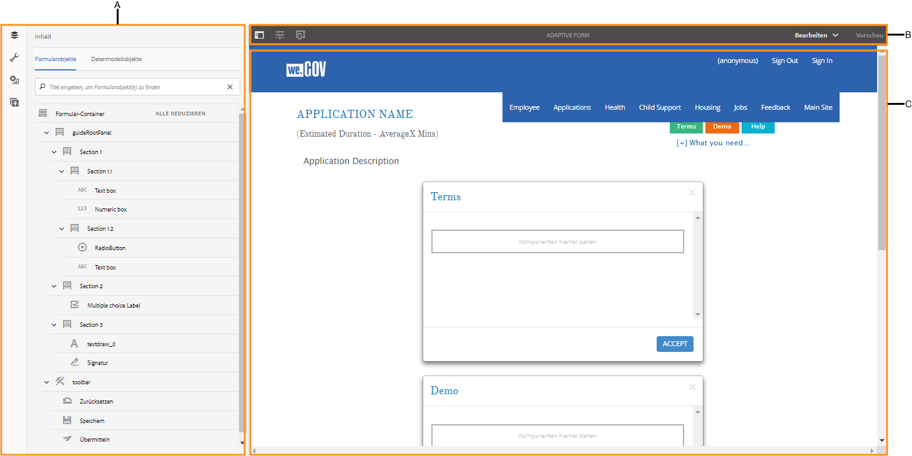
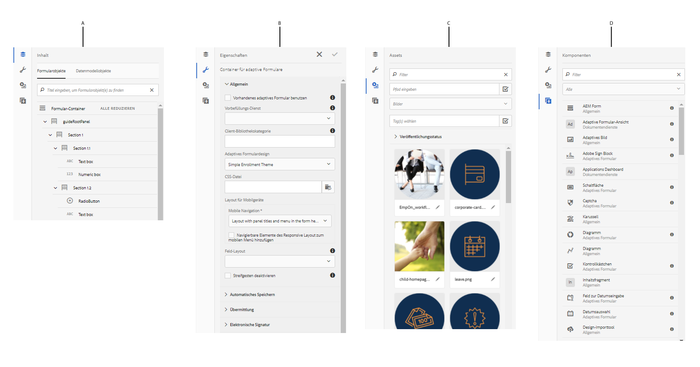
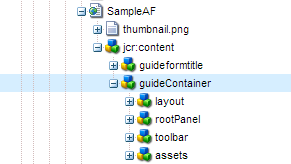

# Einführung in das Bearbeiten adaptiver Formulare {#introduction-to-authoring-adaptive-forms}

## Überblick {#overview}

Adaptive Formulare bieten Ihnen die Möglichkeit, ansprechende, interaktive, dynamische und adaptive Formulare zu erstellen. AEM Forms bietet eine intuitive Benutzeroberfläche sowie vordefinierte Komponenten zum Erstellen von adaptiven Formularen und für die Arbeit mit diesen. Sie können adaptive Formulare auf Basis eines Formularmodells oder Schemas oder ohne Formularmodell erstellen. Es ist wichtig, sorgfältig ein Formularmodell zu wählen, das nicht nur Ihren Verwendungszwecken entspricht, sondern auch Ihre bestehenden Infrastrukturinvestitionen und -Assets erweitert. Zum Erstellen eines adaptiven Formulars werden die folgenden Optionen bereitgestellt:

* **Formulardatenmodell verwenden**
   [Mithilfe der Datenintegration ](../../forms/using/data-integration.md) können Sie Entitäten und Dienste aus unterschiedlichen Datenquellen in ein Formulardatenmodell integrieren, das Sie zum Erstellen adaptiver Formulare verwenden können. Wählen Sie das Formulardatenmodell, wenn Sie ein adaptives Formular erstellen, für das Daten aus mehreren Datenquellen abgerufen und in diese geschrieben werden sollen.

* **Verwenden einer XDP-Form-Vorlage** Dieses Formularmodell ist ideal, wenn Investitionen in XFA- oder XDP-basierte Formulare vorhanden sind. Es bietet eine direkte Möglichkeit, Ihre XFA-basierten Formulare in adaptive Formulare zu konvertieren. Alle vorhandenen XFA-Regeln werden in den zugehörigen adaptiven Formularen beibehalten. Die resultierenden adaptiven Formulare unterstützen XFA-Konstrukte, z. B. Überprüfungen, Ereignisse, Eigenschaften und Muster.

* **Verwendung einer XML-Schemadefinition (XSD) oder eines JSON-Schema** XML- und JSON-Schemas stellen die Struktur dar, in der Daten vom Back-End-System in Ihrem Unternehmen produziert oder genutzt werden. Sie können das Schema mit einem adaptiven Formular verknüpfen und dem Formular mithilfe der Elemente aus dem Schema dynamische Inhalte hinzufügen. Die Elemente des Schemas sind für die Verwendung auf der Registerkarte „Datenmodellobjekte“ des Content Browser verfügbar, wenn sie adaptive Formulare erstellen.

* **Keines verwenden oder ohne Formularmodell** Bei dieser Option wird kein Formularmodell für die Erstellung der adaptiven Formulare verwendet. Die XML-Datendatei, die aus diesen Formularen generiert wurde, hat eine flache Struktur mit Feldern und entsprechenden Werten.

Weitere Informationen zur Erstellung eines adaptiven Formulars finden Sie unter [Erstellen eines adaptiven Formulars](../../forms/using/creating-adaptive-form.md).

## Benutzeroberfläche für Authoring adaptiver Formulare {#adaptive-form-authoring-ui}

Die Touch-optimierte Benutzeroberfläche für das Authoring adaptiver Formulare ist intuitiv erschließbar und bietet Folgendes:

* Drag-&amp;Drop-Funktion
* Standardmäßige Formularkomponenten
* Integriertes Repository für Assets

Wenn Sie ein neues adaptives Formular erstellen oder ein vorhandenes bearbeiten, verwenden Sie die folgenden UI-Elemente:

* [Randleiste](#sidebar)
* [Seitensymbolleiste](#page-toolbar)
* [Komponenten-Symbolleiste](#component-toolbar)
* [Seite mit adaptivem Formular](#af-page)

**A.** Seitenleiste  **B.** Seitensymbolleiste  **C.** Seite des adaptiven Formulars

### Randleiste {#sidebar}

Die Seitenleiste ermöglicht Ihnen Folgendes:

* Anzeigen von Formularinhalt wie Bereiche, Komponenten, Felder und Layout.
* Bearbeiten von Komponenteneigenschaften.
* Suchen, Anzeigen und Verwenden von Assets in Ihrem DAM-Repository (AEM Digital Asset Management).
* Hinzufügen von Komponenten im Formular.

**A.** Content browser  **B.** Eigenschaftenbrowser  **C.** Assets browser  **D.** Komponentenbrowser

<!--Click to enlarge

](assets/sidebar-comps-1.png) -->

Die Seitenleiste enthält folgende Browser:

* **Inhaltsbrowser** Im Inhaltsbrowser können Sie Folgendes anzeigen:

   * **Formularobjekte** Zeigt die Objekthierarchie des Formulars an. Der Autor kann zu bestimmten Formularkomponenten navigieren, indem er auf das entsprechende Element in der Formularobjektstruktur tippt. Der Autor kann in dieser Struktur Objekte suchen und neu anordnen.

   * **Datenmodellobjekte** Hiermit können Sie die Formularmodellhierarchie anzeigen.
Damit können Sie Formularmodellelemente per Drag &amp; Drop auf das adaptive Formular ziehen. Die hinzugefügten Elemente werden automatisch in Formularkomponenten konvertiert, während ihre ursprünglichen Eigenschaften beibehalten werden. Sie können Datenmodellobjekte anzeigen, wenn in Ihrem Formular eine XML-Schema-, JSON-Schema- oder XDP-basierte Vorlage verwendet wird.

* **Eigenschaftenbrowser**

   Hiermit können Sie die Eigenschaften einer Komponente bearbeiten. Die Eigenschaften sind je nach Komponente verschieden. So zeigen Sie die Eigenschaften des Containers für adaptive Formulare an:

   Wählen Sie eine Komponente aus, tippen Sie dann auf  > **[!UICONTROL Container des adaptiven Formulars]** und dann auf .

* **Assets-Browser**

   Trennt verschiedene Inhaltstypen wie Bilder, Dokumente, Seiten, Filme usw. voneinander.

* **Komponentenbrowser**

   Umfasst Komponenten, die Sie zum Erstellen eines adaptiven Formulars verwenden können. Sie können Komponenten in das adaptive Formular ziehen, um Formularelemente hinzuzufügen, und hinzugefügte Elemente gemäß den Anforderungen konfigurieren. In der folgenden Tabelle werden die im Komponentenbrowser aufgelisteten Komponenten beschrieben.

<table>
 <tbody>
  <tr>
   <th><strong>Komponente</strong></th>
   <th><strong>Funktion</strong></th>
  </tr>
  <tr>
   <td>Adobe Sign Block</td>
   <td>Fügt einen Textblock mit Platzhaltern für Felder hinzu, die beim Signieren mit Adobe Sign ausgefüllt werden sollen.</td>
  </tr>
  <tr>
   <td>Schaltfläche</td>
   <td>Fügt eine Schaltfläche hinzu, die Sie konfigurieren können, um Aktionen auszuführen, wie Speichern, Zurücksetzen, Weiter, Zurück usw.</td>
  </tr>
  <tr>
   <td>Captcha</td>
   <td>Fügt die CAPTCHA-Validierung mithilfe des Google reCAPTCHA-Dienstes hinzu. Weitere Informationen finden Sie unter <a href="../../forms/using/captcha-adaptive-forms.md" target="_blank">Verwenden von CAPTCHA in adaptiven Formularen</a>.</td>
  </tr>
  <tr>
   <td>Diagramm</td>
   <td>Fügt ein Diagramm hinzu, das Sie in adaptiven Formularen und Dokumenten für die visuelle Darstellung von zweidimensionalen Daten in wiederholbaren Bereichen und Tabellenzeilen verwenden können.</td>
  </tr>
  <tr>
   <td>Kontrollkästchen</td>
   <td>Fügt ein Kontrollkästchen hinzu.</td>
  </tr>
  <tr>
   <td>Feld zur Datumseingabe</td>
   <td>Verwenden Sie die Komponente „Feld zur Datumseingabe“ in Ihrem Formular, damit Kunden Tag, Monat und Jahr in drei separaten Feldern ausfüllen können. Sie können das Erscheinungsbild der Komponente anpassen und das Datumsformat ändern. Sie können beispielsweise Ihre Kunden Datumsangaben im Format MM/TT/JJJJ oder TT/MM/JJJJ eingeben lassen.</td>
  </tr>
  <tr>
   <td>Datumsauswahl</td>
   <td>Fügt ein Kalenderfeld hinzu, um ein Datum auszuwählen.</td>
  </tr>
  <tr>
   <td>Dokumentfragment</td>
   <td>Ermöglicht das Hinzufügen wiederverwendbarer Komponenten einer Korrespondenz.</td>
  </tr>
  <tr>
   <td>Dokumentfragmentgruppe</td>
   <td>Ermöglicht das Hinzufügen einer Gruppe verwandter Dokumentfragmente, die Sie in einer Briefvorlage als zusammenhängende Einheit verwenden können.</td>
  </tr>
  <tr>
   <td>Dropdownliste</td>
   <td>Fügt eine Dropdown-Liste für Einzel- oder Mehrfachauswahl hinzu.</td>
  </tr>
  <tr>
   <td>E-Mail</td>
   <td>
Fügt ein Feld zum Erfassen der E-Mail-Adresse hinzu. Die E-Mail-Komponente überprüft standardmäßig E-Mail-Adressen mit dem folgenden regulären Ausdruck.
 
<code>^[a-zA-Z0-9.!#$%&amp;’*+/=?^_`{|}~-]+@[a-zA-Z0-9-]+(?:.[a-zA-Z0-9-]+)*$</code>
 </td>
  </tr>
  <tr>
   <td>Dateianlage</td>
   <td>
Fügt eine Schaltfläche hinzu, mit der Benutzer ergänzende Dokumente suchen und an das Formular anhängen können. Sie können mehrere Dateien an eine Dateianlagenkomponente anhängen. Sie können auch die Dateigröße **[!UICONTROL Maximum File Size]** und **[!UICONTROL Unterstützte Dateitypen]** für die Anlagen im Eigenschaftenbrowser der Komponente angeben. 
 
<strong> Hinweis: </strong><ul> <li> Die Komponente unterstützt nicht das Anhängen von Dateien mit Dateinamen, beginnend mit Zeichen (.), die Zeichen \ / : * ? " &lt; &gt; | ; % $ oder spezielle Dateinamen enthalten, die für das Windows-Betriebssystem reserviert sind, wie nul, prn, con, lpt oder com. </li> <li> Um mehrere Dateien an eine Dateianlagenkomponente anzuhängen, die im Apple Safari-Browser geöffnet wird, wählen Sie die gewünschten Dateien aus und fügen Sie sie einzeln an. Es ist nicht möglich, mehrere Dateien gleichzeitig auszuwählen und anzuhängen.</li> <li>Die Dateianlagenkomponente unterstützt einen vordefinierten Satz von Dateiformaten in adaptiven Formularen, die für Adobe Sign aktiviert sind. Weitere Informationen finden Sie unter <a href="https://helpx.adobe.com/document-cloud/help/supported-file-formats-fill-sign.html#main-pars_text">Unterstützte Dateiformate</a>. </li></ul>
 </td>
  </tr>
  <tr>
   <td>Auflistung der Dateianhänge</td>
   <td>Fügt ein Feld hinzu, das alle mit der Dateianlagenkomponente hochgeladenen Anlagen auflistet.</td>
  </tr>
  <tr>
   <td>Kopfzeile  </td>
   <td>Fügt die Kopfzeile hinzu, die normalerweise das Logo eines Unternehmens, den Titel des Formulars und eine Zusammenfassung enthält.  </td>
  </tr>
  <tr>
   <td>den Namen Fußzeile zu)</td>
   <td>Fügt die Fußzeile hinzu, die normalerweise Copyright-Informationen und Links zu anderen Seiten enthält. </td>
  </tr>
  <tr>
   <td>Bild</td>
   <td>Ermöglicht es Ihnen, ein Bild einzufügen.</td>
  </tr>
  <tr>
   <td>Bildauswahl</td>
   <td>Ermöglicht Ihren Kunden, ein Bild auszuwählen, um Informationen bereitzustellen. Sie können die Informationen dazu verwenden, Ihren Kunden personalisierte Services bereitzustellen.</td>
  </tr>
  <tr>
   <td>Schaltfläche „Weiter“</td>
   <td>Fügt eine Schaltfläche hinzu, über die Sie zum nächsten Bereich in einem Formular navigieren.</td>
  </tr>
  <tr>
   <td>Numerisches Feld</td>
   <td>Fügt ein Feld zum Erfassen von numerischen Werten hinzu.</td>
  </tr>
  <tr>
   <td>Numerische Schritte</td>
   <td>Verwenden Sie „Numerische Schritte“ in Ihrem Formular, damit Ihre Kunden einen numerischen Wert eingeben können, den sie basierend auf einem vordefinierten numerischen Schritt erhöhen oder verringern können.</td>
  </tr>
  <tr>
   <td>Fenster</td>
   <td>
Fügt einen Bereich oder Unterbereich hinzu.
 
Sie können auch eine Bereichskomponente aus der übergeordneten Bereichssymbolleiste mit der Schaltfläche Untergeordnetes Bedienfeld hinzufügen</code> hinzufügen. Gleichermaßen können Sie eine panel-spezifische Symbolleiste mit der Schaltfläche Hinzufügen Bereichssymbolleiste</code> hinzufügen. Sie können die Position der Bereichssymbolleiste über das Dialogfeld "Bedienfeld bearbeiten"konfigurieren.</code></code>
 </td>
  </tr>
  <tr>
   <td>Kennwortfeld</td>
   <td>Fügt ein Feld zum Erfassen eines Kennworts hinzu.</td>
  </tr>
  <tr>
   <td>Schaltfläche „Zurück“</td>
   <td>Fügt eine Schaltfläche hinzu, die Benutzer benötigen, um zur vorherigen Seite oder zum vorherigen Bereich zurückzukehren.</td>
  </tr>
  <tr>
   <td>Optionsschaltfläche</td>
   <td>Fügt Optionsfelder hinzu.</td>
  </tr>
  <tr>
   <td>Zurücksetzen-Schaltfläche</td>
   <td>Fügt eine Schaltfläche zum Zurücksetzen von Formularfeldern hinzu.</td>
  </tr>
  <tr>
   <td>Schaltfläche „Speichern“</td>
   <td>Fügt eine Schaltfläche zum Speichern der Formulardaten hinzu.</td>
  </tr>
  <tr>
   <td>Scribble-Signatur</td>
   <td>Fügt ein Feld zum Erfassen von Freihandsignaturen hinzu.</td>
  </tr>
  <tr>
   <td>Trennzeichen</td>
   <td>Aktiviert die visuelle Trennung von Bereichen im Formular.</td>
  </tr>
  <tr>
   <td>Unterschriftsschritt</td>
   <td>Zeigt die im Formular angegeben Informationen und die Signaturfelder an, über die der Benutzer das Formular überprüfen und signieren kann.</td>
  </tr>
  <tr>
   <td>Text</td>
   <td>Ermöglicht es Ihnen, statischen Text anzugeben.</td>
  </tr>
  <tr>
   <td>Schaltfläche „Übermitteln“</td>
   <td>Fügt eine Sendeschaltfläche hinzu, um das Formular an die konfigurierte Sendeaktion zu senden.</td>
  </tr>
  <tr>
   <td>Zusammenfassung Schritt</td>
   <td>Sendet das Formular und zeigt von den Autoren angegebenen Zusammenfassungstext an, nachdem das Formular gesendet wurde. </td>
  </tr>
  <tr>
   <td>Schalter</td>
   <td>Fügt einen Schalter hinzu, mit dem eine Aktion des Typs Umschalten oder Aktivieren/Deaktivieren ausgeführt werden kann. Sie können nicht mehr als zwei Optionen in der Schalter-Komponente hinzufügen. Da ein Schalter nur zwei Werte haben kann: An und Aus, ist „Obligatorisch“ nicht verfügbar. Mindestens ein Wert wird unabhängig von der Benutzereingabe gespeichert.   </td>
  </tr>
  <tr>
   <td>Tabelle</td>
   <td>Fügt eine Tabelle hinzu, mit der Sie Daten in Zeilen und Spalten organisieren können. </td>
  </tr>
  <tr>
   <td>Telefonnummer</td>
   <td>
Fügt ein Feld zum Erfassen der Telefonnummer hinzu. Mit der Komponente „Telefonnummer“ können Autoren einen der folgenden Telefonnummerntypen konfigurieren. Jeder Typ ist mit einem standardmäßigen regulären Ausdruck für die Validierung verknüpft.

    <ul>
     <li>Type International wird durch <code>^[+][0-9]{0,14}$</code> validiert.</li>
     <li>Typ USPhoneNumber wird durch <code>{'+1 ('999') '999-9999}</code> validiert.</li>
     <li>Typ UKPhoneNumber wird durch <code>text{'+'99 999 999 9999}</code> validiert.</li>
     <li>Beim Typ „Benutzerdefiniert“ steht kein standardmäßiges Validierungsmuster zur Verfügung. Er nimmt den Wert des zuletzt ausgewählten Telefonnummerntyps an. Sie können auch ein eigenes benutzerdefiniertes Validierungsmuster angeben.</li>
    </ul> </td>
  </tr>
  <tr>
   <td>Geschäftsbedingungen  </td>
   <td>Fügt ein Feld hinzu, mit dem Autoren die allgemeinen Geschäftsbedingungen angeben können, damit Benutzer diese überprüfen, bevor sie das Formular ausfüllen.</td>
  </tr>
  <tr>
   <td>Textfeld </td>
   <td>
Fügt ein Textfeld hinzu, in dem ein Benutzer die erforderlichen Informationen angeben kann.. 
 
In der Textfeldkomponente kann standardmäßig nur einfacher Text angegeben werden. Sie können die Eingabe von Rich Text in einer Textfeldkomponente ermöglichen. In Textkomponenten mit Rich Text stehen Optionen zum Hinzufügen von Überschriften, zum Ändern des Schriftstils (Fett, Kursiv, Unterstrichen), zum Erstellen geordneter und ungeordneter Listen, zum Ändern des Texthintergrunds und der Textfarbe sowie zum Hinzufügen von Hyperlinks zur Verfügung. Um Rich-Text für ein Textfeld zu aktivieren, aktivieren Sie die Option <strong> Rich-Text</strong> zulassen in den Komponenteneigenschaften.
 </td>
  </tr>
  <tr>
   <td>Titel</td>
   <td>Geben Sie einen Titel für das adaptive Formular an.</td>
  </tr>
  <tr>
   <td>Überprüfungsschritt</td>
   <td>
Fügt einen Platzhalter hinzu, um das ausgefüllte Formular zur Überprüfung durch den Benutzer anzuzeigen.
 
<strong>Hinweis</strong>: Adaptive Formulare, die die Verify-Komponente enthalten, unterstützen keine anonymen Benutzer. Außerdem wird nicht empfohlen, die Verify-Komponente in einem adaptiven Formularfragment zu verwenden.
 </td>
  </tr>
 </tbody>
</table>

#### Optimale Verfahren für das Arbeiten mit Komponenten  {#best-practices}

Optimale Verfahren und wichtige Hinweise zum Arbeiten mit Komponenten von adaptiven Formularen:

* Jede Komponente verfügt über zugehörige Eigenschaften, die ihre Darstellung und Funktion steuern. Um die Eigenschaften einer Komponente zu konfigurieren, tippen Sie auf die Komponente und dann auf , um die Komponenteneigenschaften im Eigenschaftenbrowser zu öffnen.
* Eine Komponente wird mit ihrem Elementnamen gekennzeichnet. Wenn Sie auf  tippen, können Sie den Namen der Komponente ändern, indem Sie den Feldwert **[!UICONTROL Elementname]** im Eigenschaftenbrowser ändern. Das Feld „Elementname“ akzeptiert nur Buchstaben, Zahlen, Bindestriche (-) und Unterstriche (_). Andere Sonderzeichen sind nicht zulässig. Der Elementname muss mit einem Buchstaben beginnen.

* Sie können die title-Eigenschaft einer Komponente eines adaptiven Formulars inline im Formular-Editor ändern, ohne den Eigenschaftenbrowser zu öffnen, solange der Titel im Formular sichtbar ist. Gehen Sie dazu wie folgt vor:

   1. Wählen Sie auf eine Komponente, in der die Eigenschaft **[!UICONTROL Title]** vorhanden ist und deren Eigenschaft **[!UICONTROL Titel ausblenden]** deaktiviert ist, aus, indem Sie darauf tippen.

   1. Tippen Sie auf , um den Titel bearbeitbar zu machen.

   1. Ändern Sie den Titel und tippen Sie auf die Return-Taste oder tippen Sie auf eine beliebige Stelle außerhalb der Komponente, um die Änderungen zu speichern. Tippen Sie auf die Esc-Taste, um die Änderungen zu verwerfen.

* Bei einigen Komponenten für adaptive Formulare, z. B. E-Mail und Telefon, stehen vordefinierte Überprüfungsmuster zur Verfügung. Sie können jedoch eine benutzerdefinierte Validierung angeben, indem Sie das Feld **[!UICONTROL Überprüfungsmuster]** unter dem Akkordion „Muster“ in den Komponenteneigenschaften aktualisieren. Weitere Informationen zu Standardvalidierungen finden Sie in den Komponentenbeschreibungen in der Tabelle oben.

* Adaptive Formularfelder, z. B. numerische Felder und E-Mails, können so konfiguriert werden, dass spezifische HTML5-Eingabetypen einbezogen werden. Wenn diese Felder auf Mobilgeräten und Tablets im Fokus sind, enthält die Tastatur direkt spezifische Buchstaben, Ziffern und andere Zeichen, die für die Eingabe von Informationen in das betreffende Feld verwendet werden können. Damit können Benutzer schnell Informationen einzugeben, ohne zwischen Zeichensätzen auf der Tastatur zu wechseln. Um eine spezialisierte Eingabe für eine Komponente zuzulassen, aktivieren Sie das Kontrollkästchen **[!UICONTROL HTML-Typnummer verwenden]** in den Komponenteneigenschaften.

* Sie können die Eingabe von Rich Text in einer Textfeldkomponente ermöglichen. Aktivieren Sie zum Aktivieren von Rich-Text für ein Textfeld das Kontrollkästchen **[!UICONTROL Rich-Text zulassen]** in den Komponenteneigenschaften.

* Mithilfe von Textfeld-, E-Mail- und Telefonkomponenten können Sie in Feldern wie Name, Adresse, Kreditkarte, Telefon und E-Mail automatisch Werte aus den Daten übernehmen lassen, die in den Browsereinstellungen für das automatische Ausfüllen gespeichert sind. Um diese Funktion zu aktivieren, wählen Sie in den Komponenteneigenschaften **[!UICONTROL Automatisches Ausfüllen aktivieren]** und wählen Sie ein **[!UICONTROL Attribut automatisch ausfüllen]**. Wenn ein Benutzer ein adaptives Formular ausfüllt, werden die Werte aus dem AutoFill-Profil im Browser oder anhand der früher vom Benutzer eingegebenen Werte vorgeschlagen. Beachten Sie, dass das automatische Ausfüllen nur funktioniert, wenn die Einstellungen für automatisches Ausfüllen im Browser des Benutzers aktiviert sind.

* Geben Sie Werte für Optionsfeld- und Kontrollkästchen-Elemente im Format `{value}={text}` in den Komponenteneigenschaften an.
* In der Dateianhangskomponente kann der Benutzer standardmäßig nur eine Datei anhängen. Sie können jedoch die Komponenteneigenschaften konfigurieren, sodass mehrere Anhänge unterstützt werden. Darüber hinaus können Probleme auftreten, wenn ein Benutzer mehrere Dateien mit demselben Dateinamen anhängt. Daher wird empfohlen, bei der Übermittlung des Formulars jedem übermittelten Anhang eine eindeutige Kennung zuzuweisen. Gehen Sie dazu wie folgt vor:

   1. Navigieren Sie auf Ihrem AEM Forms-Server zu **[!UICONTROL Adobe Experience Manager]** > **[!UICONTROL Tools]** > **[!UICONTROL Vorgänge]** > **[!UICONTROL Webkonsole]**.
   1. Suchen und tippen Sie auf **[!UICONTROL Konfigurationsdienst für adaptive Forms]**.
   1. Aktivieren Sie im Dialogfeld &quot;Konfigurationsdienst für adaptive Forms&quot;die Option **[!UICONTROL Dateinamen individualisieren]**. Diese Option ist standardmäßig deaktiviert.

* Damit Benutzer eine PDF-Datei mit dem Safari-Browser anhängen können, müssen Sie sicherstellen, dass **application/pdf** der Eigenschaft „Unterstützte Dateitypen“ der Dateianhangskomponente hinzugefügt wird. Adaptive Formulare, die mit der vorherigen AEM Forms-Version erstellt wurden, enthalten möglicherweise **.pdf** anstelle von **application/pdf** in der Eigenschaft „Unterstützte Dateitypen“.

Weitere Best Practices für adaptive Formulare finden Sie unter [Bewährte Verfahren für die Arbeit mit adaptiven Formularen](/help/forms/using/adaptive-forms-best-practices.md).

>[!NOTE]
>
>Komponenten für adaptive Formulare unterstützen keine RTL-Sprachen (Right to Left). Zum Beispiel Hebräisch.

### Seitensymbolleiste {#page-toolbar}

Die Seitensymbolleiste oben bietet Optionen, mit denen Sie eine Vorschau des Formulars anzeigen, Formulareigenschaften ändern und das Formularlayout bearbeiten können. Sie können beim Authoring eine Vorschau des Formulars anzeigen und die gewünschten Änderungen vornehmen. In der Seitensymbolleiste wird Folgendes angezeigt:

* **Seitliches**  ein/aus: Hiermit können Sie die Seitenleiste ein- oder ausblenden.

* **Seiteninformationen** : Ermöglicht die Ansicht von Seiteneigenschaften, das Veröffentlichen/Rückgängigmachen der Veröffentlichung eines Formulars, den Beginn eines Formular-Workflows und das Öffnen des Formulars in der klassischen Benutzeroberfläche.

* **** : Hiermit können Sie das Aussehen des Formulars für verschiedene Displaygrößen wie Tablets und Smartphones emulieren.

* **Bearbeiten**: Hier können Sie andere Modi auswählen, z. B.:  **[!UICONTROL Bearbeiten]**,  **[!UICONTROL Stil]**,  **[!UICONTROL Entwickler]** und  **[!UICONTROL Design]**.

   * **Bearbeiten**: Hiermit können Sie die Eigenschaften des Formulars und seiner Komponenten bearbeiten. Dies tun Sie, indem Sie beispielsweise eine Komponente hinzufügen, ein Bild ablegen oder obligatorische Felder festlegen.
   * **Stil**: Hiermit können Sie das Erscheinungsbild von Komponenten im Formular stilistisch anpassen. Im Stilmodus können Sie beispielsweise einen Bereich auswählen und dessen Hintergrundfarbe festlegen.

   * **Entwickler**: Ermöglicht Entwicklern Folgendes:

      * Ermitteln der Bestandteile von Formularen.
      * Debugging der am Formular durchgeführten Aktionen zur Behebung von Fehlern.
   * **Design**. Hier können Sie benutzerdefinierte Komponenten oder auch nicht in der Seitenleiste aufgelistete vordefinierte Komponenten aktivieren oder deaktivieren.

* **Vorschau**: Hier können Sie das Aussehen des Formulars, wenn es veröffentlicht wird, in einer Vorschau anzeigen.

### Komponenten-Symbolleiste {#component-toolbar}

Wenn Sie eine Komponente auswählen, sehen Sie eine Symbolleiste, die folgende Funktionen bietet. Sie erhalten Optionen zum Ausschneiden, Einfügen, Verschieben und Festlegen von Eigenschaften der Komponenten. Ihre Optionen sind:

A.**Konfigurieren**: Wenn Sie auf **[!UICONTROL Konfigurieren]** tippen, werden in der Seitenleiste Komponenteneingenschaften sichtbar. Wenn Sie diese Eigenschaften konfigurieren, können Sie die Benutzererfahrung beim Erfassen von Daten anpassen. Sie können den Elementnamen der Komponente ändern und den Beschriftungstext im Titelfeld der Komponente angeben. Mit dem Elementnamen können Sie Werte erfassen, die Benutzer bei der Verwendung dieser Komponente eingeben. In den Komponenteneigenschaften geben Sie das Verhalten der Komponente an und verwalten die Benutzereingabe. Konfigurieren Sie die Eigenschaften in der Seitenleiste, um Benutzerdaten zu erfassen und diese für die weitere Verarbeitung zu verwenden. Mit den Eigenschaften für den adaptiven Formularcontainer können Sie Clientbibliotheken, Layouts, Designs, Datensatzdokument-, Speicher-, Sende- und Metadateneinstellungen festlegen.

B.**Kopieren**: Sie können die Kopieroption verwenden, um eine Komponente zu kopieren und an andere Positionen im Formular einzufügen. Wenn Sie eine Komponente einfügen, erhält die eingefügte Komponente einen neuen Elementnamen, behält jedoch die Eigenschaften der kopierten Komponente bei.

C.**Ausschneiden**: Sie können die Option zum Ausschneiden verwenden, um eine Komponente von einer Position im adaptiven Formular an eine andere Position zu verschieben.

D. **Löschen**: Hiermit können Sie die Komponente aus dem Formular löschen.

E. **Einfügen**: Hiermit können Sie eine Komponente oberhalb der ausgewählten Komponente einfügen.

F. **Einfügen**: Hiermit können Sie die mithilfe der oben genannten Optionen ausgeschnittene oder kopierte Komponente einfügen.

G. **Regeln bearbeiten**: Hiermit können Sie den Regel-Editor öffnen. Weitere Informationen finden Sie unter [Regel-Editor](../../forms/using/rule-editor.md).

H. **Gruppieren**: Mit dieser Funktion können Sie mehrere Komponenten auswählen, um sie zusammen auszuschneiden, zu kopieren oder einzufügen.

I. **Übergeordnet**: Hier können Sie das übergeordnete Element einer Komponente auswählen. Beispiel: Ein Textfeld innerhalb eines Unterabschnitts liegt, der seinerseits Teil eines Abschnitts ist. Der Abschnitt befindet sich im Stammbereich (guideRootPanel), und der adaptive Formularcontainer ist guideRootPanel übergeordnet. Bei einer Komponente können Sie alle Optionen sehen, wobei die Hierarchie von unten nach oben angeordnet ist.

Wenn Sie beispielsweise für ein Textfeld auf **[!UICONTROL Übergeordnetes]** tippen, sehen Sie Folgendes:

* Unterabschnitt
* Abschnitt
* guideRootPanel
* Adaptiver Formularcontainer

J. **Sonstige**: Bietet weitere Optionen zum Arbeiten mit der ausgewählten Komponente.

* SOM-Ausdruck anzeigen
* Bereich als Fragment speichern (nur für Bereiche)
* Untergeordneten Bereich hinzufügen (nur für Bereiche)
* Bereichssymbolleiste hinzufügen (nur für Bereiche)
* Ersetzen (nicht für Bereiche)

### Seite mit adaptivem Formular  {#af-page}

Die Seite mit dem adaptiven Formular enthält das eigentliche Formular. Sie wird wie jede andere WCM-Seite als WCM-`cq:Page`-Komponente modelliert. Die folgende Abbildung zeigt die Inhaltsstruktur eines typischen adaptiven Formulars an.

Die Inhaltsstruktur enthält in der Regel die folgenden Hauptkomponenten:

* **guideContainer**: Der Stamm eines adaptiven Formulars, der als **[!UICONTROL Beginn eines adaptiven Formulars]** in der Benutzeroberfläche des adaptiven Formulars markiert ist. In dieser Komponente können Sie Folgendes angeben:

   * *Mobile Layout of the adaptive form* (Mobiles Layout des adaptiven Formulars): Definiert die Darstellung des Formulars auf mobilen Geräten.
   * *Dankeseite*: Definiert die Seite, auf die der Benutzer umgeleitet wird, nachdem er das Formular gesendet hat.
   * *Übermittlungsaktion*: Definiert, wie das Formular auf dem Server verarbeitet wird, sobald der Benutzer das Formular sendet.
   * *Stile*: Gibt den Pfad zur CSS-Datei an, die verwendet wird, um das Erscheinungsbild des Formulars anzupassen.

* **rootPanel:** Der Stammbereich eines adaptiven Formulars. Er kann Unterbereiche unterhalb des Elementknotens enthalten. Jeder Bereich, einschließlich des Stammbereichs, kann mit einem Layout verknüpft sein. Das Layout des Bereichs legt fest, wie das Formular unterteilt wird. Im Akkordeonlayout beispielsweise werden die Elemente als Akkordeonschritte angeordnet.

* **Symbolleiste:** Ein Container für ein adaptives Formular verfügt über eine zugehörige globale Symbolleiste, die global für das Formular gilt. Diese Symbolleiste kann mithilfe der Aktion **[!UICONTROL Hinzufügen Symbolleiste]** in der Bearbeitungsleiste hinzugefügt werden, mit der Autoren Aktionen wie Senden, Speichern, Zurücksetzen usw. hinzufügen können.

* **assets:** Dieser Knoten enthält zusätzliche Informationen für das Formular-Authoring. Beispiele: Formularmodelldetails, Lokalisierungsdetails usw.

