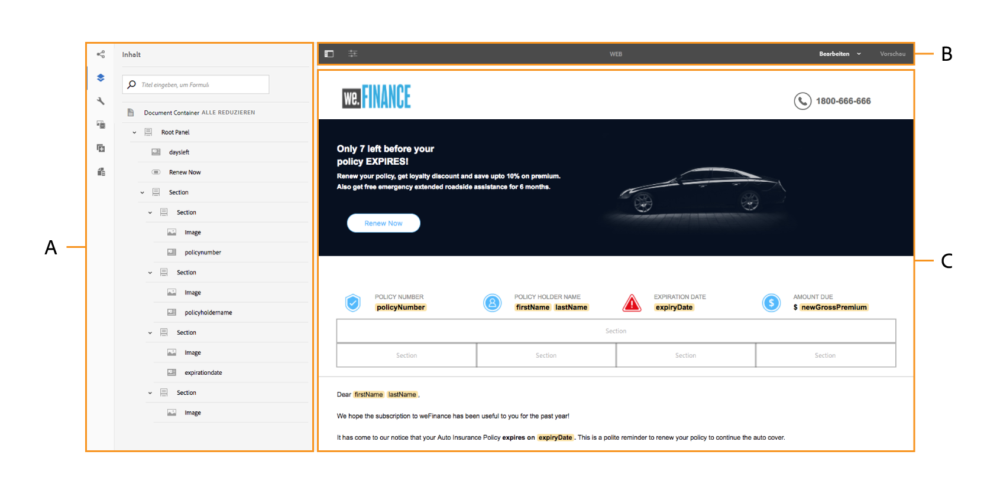
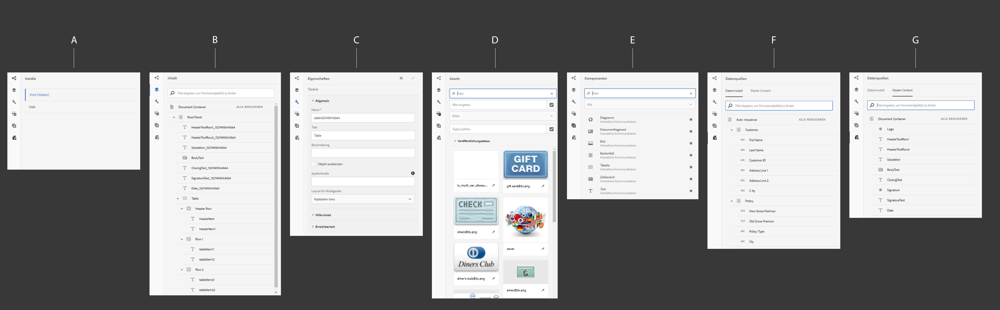

# Einführung in die Benutzeroberfläche für interaktive Kommunikationserstellung{#introduction-to-interactive-communication-authoring-ui}

Die Benutzeroberfläche für das Erstellen von [interaktiver Kommunikation](/help/forms/using/interactive-communications-overview.md) ist intuitiv und bietet Folgendes für die Erstellung des Druck- und Web-Kanals der interaktiven Kommunikation:

* WYSIWYG Drag-and-Drop-Dokumenteditor
* Integriertes Repository für Assets – die Assets, die auf den Server hochgeladen und dort erstellt wurden, sind im Asset-Browser der Authoring-Oberfläche der interaktiven Kommunikation verfügbar.

Wenn Sie eine [neue interaktive Kommunikation](../../forms/using/create-interactive-communication.md) erstellen oder eine vorhandene bearbeiten, verwenden Sie die folgenden Elemente der Benutzeroberfläche:

* [Randleiste](#sidebar)
* [Seitensymbolleiste](#page-toolbar)
* [Komponenten-Symbolleiste](#component-toolbar)
* Inhaltsbereich

**A.** Seitenleiste **B.** Seitensymbolleiste **C.** Inhaltsbereich

## Randleiste {#sidebar}

**A.** Kanal-Browser **B.** Inhalts-Browser **C.** Eigenschaften-Browser **D.** Asset-Browser **E.** Komponenten-Browser **F.** Datenquellen-Browser – Datenmodell **G.** Datenquellen-Browser – Übergeordnete Inhalte

<!-- Click to enlarge

-->

Die Seitenleiste beinhaltet Folgendes:

* **Kanalbrowser**

Mit dem Kanalbrowser können Sie zwischen den Druck- und Internetkanälen der interaktiven Kommunikation wechseln. Je nach dem Kanal, den Sie im Kanalbrowser ausgewählt haben, zeigen die Browser, z. B. Inhalts- und Komponentenbrowser, die Optionen an.

* **Inhalts-Browser**: Im Inhalts-Browser können Sie die Objekthierarchie des Dokuments für den ausgewählten Kanal sehen. Der Autor kann zu bestimmten Formularkomponenten navigieren, indem er auf das entsprechende Element in der Dokumentobjektstruktur tippt. Der Autor kann Objekte im Webkanal suchen und in dieser Struktur neu anordnen. 

* **Eigenschaften-Browser**

   Hier können Sie die Eigenschaften einer Komponente bearbeiten. Die Eigenschaften sind je nach Komponente verschieden. Um beispielsweise die Eigenschaften des Dokument-Containers anzuzeigen: 
Wählen Sie eine Komponente, tippen Sie auf  > **Dokument-Container** und dann auf .

* **Assets-Browser** Trennt verschiedene Arten von Inhalten wie Layout-Fragmente, Bilder, Dokumente, Seiten, Videos. Der Autor kann Assets in die interaktive Kommunikation ziehen und ablegen.

* **Komponentenbrowser** Enthält Komponenten, mit denen Sie die Druck- und Webkanäle eines Dokuments erstellen können. Sie können Komponenten per Drag-und-Drop in die interaktive Kommunikation ziehen, um Elemente hinzuzufügen, und hinzugefügte Elemente gemäß den Anforderungen konfigurieren. In der folgenden Tabelle werden die im Komponentenbrowser aufgelisteten Komponenten für Druck- und Webkanäle beschrieben. 

| **Komponente** | **Druckkanal** | **Webkanal** | **Funktion** |
|---|---|---|---|
| Diagramm | ✓ | ✓ | Fügt ein Diagramm hinzu, das Sie in interaktiver Kommunikation zur visuellen Darstellung von zweidimensionalen Daten verwenden können, die aus einem FDM-Sammlungselement abgerufen werden. |
| Dokumentfragment | ✓ | ✓ | Ermöglicht das Hinzufügen einer wiederverwendbaren Komponente, eines Textes, einer Liste oder einer Bedingung zu einer interaktiven Kommunikation. Die wiederverwendbare Komponente, die Sie einer interaktiven Kommunikation hinzufügen, kann entweder formulardatenmodellbasiert sein oder ohne ein Formulardatenmodell sein. |
| Bild | ✓ | ✓ | Ermöglicht es Ihnen, ein Bild einzufügen. |
| Bereich | - | ✓ | Die Bereichskomponente ist ein Platzhalter zum Gruppieren anderer Komponenten und steuert, wie eine Gruppe von Komponenten in einer interaktiven Kommunikation angeordnet wird. Mit einer Bereichskomponente können Sie auch eine Gruppe von Komponenten für den Endbenutzer wiederholbar machen, z. B. mehrere Einträge zum Ausfüllen von Bildungsnachweisen. Es ist sinnvoll, einen Bereich jeweils für eine Registerkarte einer interaktiven Kommunikation mit mehreren Registerkarten zu verwenden. |
| Tabelle | * | ✓ | Fügt eine Tabelle hinzu, mit der Sie Daten in Zeilen und Spalten organisieren können. |
| Zielbereich | ** | ✓ | Fügt einen Zielbereich in einen Webkanal ein, um die webkanalspezifischen Komponenten zu organisieren. |
| Text | - | ✓ | Fügt dem Webkanal einer interaktiven Kommunikation Text hinzu. Text kann Formulardatenmodellobjekte verwenden, um den Inhalt dynamisch zu gestalten. |

* Verwenden Sie Layout-Fragmente im Druckkanal, um Tabellen hinzuzufügen.

** Im Druckkanal sind Zielbereiche in der XDP/Druckvorlage vordefiniert. Sie können keine neuen Zielbereiche mithilfe der Autorenoberfläche für die interaktive Kommunikation hinzufügen.

* **Datenquellenbrowser** Datenquellenbrowser zeigt die verfügbaren Datenquellen in dem Formulardatenmodell an, das Sie beim Erstellen der interaktiven Kommunikation ausgewählt haben.

### Wichtige Punkte für das Arbeiten mit Komponenten {#key-points-for-working-with-components}

Die wichtigsten Punkte beim Arbeiten mit interaktiven Kommunikationskomponenten sind:

* Jede Komponente verfügt über zugehörige Eigenschaften, die ihre Darstellung und Funktion steuern. Tippen Sie zum Konfigurieren der Eigenschaften einer Komponente auf die Komponente und dann auf , um die Komponenteneigenschaften im Eigenschaften-Browser zu öffnen.
* Eine Komponente wird mit ihrem Elementnamen gekennzeichnet. Wenn Sie auf  tippen, können Sie den Namen der Komponente ändern, indem Sie den Wert des Felds „Elementname“ im Eigenschaften-Browser ändern. Das Feld „Elementname“ akzeptiert nur Buchstaben, Zahlen, Bindestriche (-) und Unterstriche (_). Andere Sonderzeichen sind nicht zulässig. Der Elementname muss mit einem Buchstaben beginnen.
* Sie können die Titel-Eigenschaft einer Komponente einer interaktiven Kommunikation inline im Editor ändern, ohne den Eigenschaften-Browser zu öffnen, solange der Titel in der interaktiven Kommunikation sichtbar ist. Gehen Sie dazu wie folgt vor:

   1. Wählen Sie eine Komponente aus, in der die Eigenschaft Titel vorhanden und deren Eigenschaft Titel ausblenden deaktiviert ist, indem Sie darauf tippen.
   1. Tippen Sie auf , damit der Titel bearbeitet werden kann.

   1. Ändern Sie den Titel und drücken Sie die Return-Taste oder tippen Sie auf eine beliebige Stelle außerhalb der Komponente, um die Änderungen zu speichern. Drücken Sie die Esc-Taste, um die Änderungen zu verwerfen.

## Komponenten-Symbolleiste {#component-toolbar}

Wenn Sie eine Komponente auswählen, sehen Sie eine Symbolleiste, die folgende Funktionen bietet. Sie erhalten Optionen zum Ausschneiden, Einfügen, Verschieben und Festlegen von Eigenschaften der Komponenten. Ihre Optionen sind:

A. **Konfigurieren**: Wenn Sie auf **Konfigurieren** tippen, werden in der Seitenleiste Komponenteneigenschaften sichtbar.

B. **Regeln bearbeiten**: Wenn Sie auf „Regeln bearbeiten“ tippen, wird der Regel-Editor angezeigt, in dem Sie Regeln für die ausgewählte Komponente bearbeiten und erstellen können. Im Regeleditor können Sie auch andere Formularobjekte (Komponenten) auswählen und Regeln für diese Formularobjekte bearbeiten/erstellen.

C. **Kopieren**: Sie können die Kopieroption verwenden, um eine Komponente zu kopieren und an andere Positionen im Formular einzufügen.

D. **Ausschneiden**: Sie können die Option zum Ausschneiden verwenden, um in der interaktiven Kommunikation eine Komponente von einer Position an eine andere zu verschieben.

E. **Löschen**: Hiermit können Sie die Komponente aus der interaktiven Kommunikation löschen.

F. **Komponente einfügen**: Hiermit können Sie eine Komponente oberhalb der ausgewählten Komponente einfügen.

G. **Einfügen**: Hiermit können Sie die mithilfe der oben genannten Optionen ausgeschnittenen oder kopierten Komponente einfügen.

H. **Gruppieren**: Mit dieser Funktion können Sie mehrere Komponenten auswählen, um sie zusammen auszuschneiden, zu kopieren oder einzufügen.

I. **Übergeordnet**: Hier können Sie das übergeordnete Element einer Komponente auswählen.

J. **SOM-Ausdruck anzeigen**: Damit können Sie den [SOM-Ausdruck](../../forms/using/using-som-expressions-adaptive-forms.md) für die Komponente anzeigen.

K: **Gruppieren von Objekten im Bereich**: Hiermit können Sie die Komponenten in einem Bedienfeld gruppieren, um Vorgänge für diese Komponenten gleichzeitig durchführen zu können. Weitere Informationen finden Sie unter [Gruppieren von Objekten im Bedienfeld](create-interactive-communication.md#groupobjectspanel).

L. **Untergeordnetes Bedienfeld hinzufügen** (nur für Bedienfelder): Hiermit können Sie dem Bedienfeld ein untergeordnetes Bedienfeld hinzufügen.

M: **Symbolleiste hinzufügen** (Nur für Bedienfelder): Hiermit können Sie die Symbolleisten-Komponente für Bedienfelder hinzufügen. Sie können dann weitere Aktionen in der Symbolleiste ausführen.

Außerdem können Sie mit der Option **Ersetzen** in der Symbolleiste die vorhandene Komponente durch eine andere Komponente ersetzen. Die Option ist für die Bedienfeldkomponente nicht verfügbar.

## Seitensymbolleiste {#page-toolbar}

Die Seitensymbolleiste oben bietet Optionen, mit denen Sie die interaktive Kommunikation in der Vorschau anzeigen und ihre Eigenschaften ändern können. Sie können beim Bearbeiten die interaktive Kommunikation in der Vorschau anzeigen und die gewünschten Änderungen vornehmen. In der Seitensymbolleiste wird Folgendes angezeigt:

* Seitliches Bedienfeld ein/aus: Hiermit können Sie die Seitenleiste ein- oder ausblenden.
* Seiteninformationen : Hiermit können Sie die Seiteneigenschaften anzeigen.
* Emulator : Hiermit können Sie die Darstellung des Formulars für verschiedene Display-Größen (z. B. für Tablets und Smartphones) emulieren.
* Bearbeiten: Hiermit können Sie andere Modi auswählen, wie etwa: Bearbeiten, Stil, Entwickler und Design.

   * Bearbeiten: Hiermit können Sie die Eigenschaften der interaktiven Kommunikation und ihre Komponenten bearbeiten. Dies tun Sie, indem Sie beispielsweise eine Komponente hinzufügen, ein Bild ablegen oder obligatorische Felder festlegen.
   * Stil: Hiermit können Sie das Erscheinungsbild von Komponenten der interaktiven Kommunikation stilistisch anpassen. Im Stilmodus können Sie beispielsweise einen Bereich auswählen und dessen Hintergrundfarbe festlegen.
   * Entwickler: Hier haben Entwickler folgende Möglichkeiten:

      * Entdecken Sie, woraus interaktive Kommunikation besteht.
      * Debugging der am Formular durchgeführten Aktionen zur Behebung von Fehlern.
   * Ziel: Hier können Sie benutzerdefinierte Komponenten oder auch vordefinierte, nicht in der Seitenleiste aufgelistete Komponenten aktivieren oder deaktivieren.

* Vorschau: Hier können Sie das Aussehen der interaktiven Kommunikation in der Vorschau anzeigen, wenn sie veröffentlicht wird.
