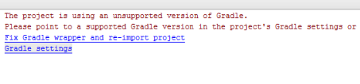

# Fehlerbehebung der AEM Forms-App {#troubleshoot-aem-forms-app}

In diesem Artikel werden die Fehlermeldungen, die beim Erstellen von AEM Forms App möglicherweise angezeigt werden und die Schritte zur Problembehebung.

Die Abschnitte in diesem Artikel behandeln Folgendes:

* [Verlust von Anhängen für iOS-Benutzer](/help/forms/using/issues-aem-forms-app.md#attachment-loss-for-ios-users)
* [Entwürfe von HTML5 -Formularen, die von Workspace-Benutzern eingesendet wurden, werden nicht auf dem Portal angezeigt](/help/forms/using/issues-aem-forms-app.md#html-form-drafts-submitted-by-workspace-users-are-not-visible-on-the-portal)
* [HTML5-Formulare (nicht zwischengespeichert) werden in AEM Forms App nicht geladen](/help/forms/using/issues-aem-forms-app.md#html-forms-not-cached-fail-to-load-in-aem-forms-app)
* [AEM Forms werden unter Windows nicht synchronisiert](/help/forms/using/issues-aem-forms-app.md#aem-forms-do-not-sync-on-windows)
* [Nicht unterstützte Version von Gradle](/help/forms/using/issues-aem-forms-app.md#unsupported-version-of-gradle)
* [Kompatibilitätsprobleme mit Gradle und Android Gradle Plug-In](/help/forms/using/issues-aem-forms-app.md#gradle-and-android-gradle-plug-in-compatibility-issues)

## Verlust von Anhängen für iOS-Benutzer {#attachment-loss-for-ios-users}

AEM Forms-App für iOS, die zur Synchronisierung mit AEM Forms unter OSGi konfiguriert ist, unterstützt nur Anlagen auf Feldebene. Alle Anlagen müssen eindeutige Namen haben. Wenn mehrere Anlagen denselben Namen haben, wird nur eine Anlage beibehalten und alle anderen mit identischem Namen gehen verloren. Führen Sie die folgenden Schritte aus, um Benutzer auf iOS-Geräten vor Datenverlust zu bewahren:

1. Navigieren Sie auf dem angeschlossenen Server zu **Adobe Experience Manager > Tools > Vorgänge > Web-Konsole**.
1. Suchen Sie nach und klicken Sie auf **[!UICONTROL Konfiguration des adaptiven Formulars und der interaktiven Kommunikation Web Kanal]**.
1. Aktivieren Sie im Dialogfeld [!UICONTROL Konfiguration des adaptiven Formulars und des interaktiven Kommunikations-Web-Kanals] **Dateinamen individualisieren**.

   Wenn die Einstellung **Dateinamen individualisieren** deaktiviert ist, gehen Daten verloren, wenn Benutzer versuchen, adaptive Formulare mit mehreren Anlagen zu senden.

1. Klicken Sie auf **Speichern**.

## Entwürfe von HTML5 -Formularen, die von Workspace-Benutzern eingesendet wurden, werden nicht auf dem Portal angezeigt {#html-form-drafts-submitted-by-workspace-users-are-not-visible-on-the-portal}

Bei HTML5-Formularen, die in der AEM Forms-App mit dem HTML-Render-Profil **Als Entwurf speichern** aktiviert sind, sind die gespeicherten Entwürfe für Workspace-Benutzer nicht sichtbar. So führen Sie die folgenden Schritte aus, um gespeicherte Entwürfe von HTML5-Formularen, die von Workspace-Benutzern im Portal übermittelt wurden, Ansicht:

1. Öffnen Sie CRXDE und melden Sie sich als Administrator an.

   URL: `https://<server>:<port>/lc/crx/de/index.jsp`

1. Im Stammpfad von CRXDE, in der Zugriffssteuerungsliste unter Zugriffssteuerung klicken Sie auf **+**.
1. Klicken Sie im Dialogfeld **Neuen Eintrag hinzufügen** auf die Gruppensuche-Schaltfläche im Feld „Prinzipal“.
1. Geben Sie im Dialogfeld &quot;Prinzipal auswählen&quot;im Feld &quot;Name&quot;`PERM_WORKSPACE_USER` ein und klicken Sie auf **Suche**.
1. Wählen Sie im Dialogfeld &quot;Prinzipal auswählen&quot;die Gruppe `PERM_WORKSPACE_USER` und klicken Sie auf **OK**.
1. Im Dialogfeld „Neuen Eintrag hinzufügen“ wird `PERM_WORKSPACE_USER`-Gruppe im Feld „Prinzipal“ ausgewählt.

   Aktivieren Sie `jcr:read`-Berechtigungen für die Benutzergruppe.

1. Klicken Sie auf **OK**.

## HTML5-Formulare (nicht zwischengespeichert) werden in AEM Forms App nicht geladen {#html-forms-not-cached-fail-to-load-in-aem-forms-app}

Wenn AEM Forms App mit einer älteren Version von AEM Forms-Server verbunden ist, können nicht zwischengespeicherte HTML5-Formulare nicht in AEM Forms App hochgeladen werden.

Führen Sie zur Behebung dieses Problems folgende Schritte durch:

1. Navigieren Sie in der Autoreninstanz zu **Adobe Experience Manager > Tools > Workspace-App-Offline-Dienst konfigurieren > Jetzt konfigurieren**.
1. Auf der Seite **Workspace-App Offline-Service** klicken Sie auf **Manueller Ressourcen-Cache**.

   URL: https://&lt;server>:&lt;port>/libs/fd/workspace-offline/content/config.html

1. Im **manuellen Ressourcen-Cache** klicken Sie auf die Schaltfläche **+**, um einen CRX-Pfad hinzuzufügen.
1. Geben Sie in das Feld **Hinzufügen eine neue Ressource** Folgendes ein: /etc.clientlibs/fd/xfaforms/I18N/en_US.js und klicken Sie auf **Hinzufügen**.
1. Klicken Sie auf **Speichern**.

## AEM Forms werden unter Windows nicht synchronisiert  {#aem-forms-do-not-sync-on-windows}

Ein Formular wird unter Windows nicht in der AEM Forms-App mit dem verbundenen Server synchronisiert, wenn der Pfad des Formulars oder seine Ressourcen länger als 256 Zeichen lang sind.

Modifizieren Sie den Pfad des Formulars und seine Ressourcen, um die Anzahl der Zeichen im Pfad auf 256 zu reduzieren.

## Nicht unterstützte Version von Gradle  {#unsupported-version-of-gradle}

**Fehlermeldung:** Das Projekt verwendet eine nicht unterstützte Version von &quot;Gradle&quot;.

Die Fehlermeldung wird angezeigt, wenn Sie die AEM Forms-App in Android Studio erstellen. Das Problem tritt aufgrund einer nicht unterstützten Version von Gradle auf, die vom System unterstützt wird.

**Lösung:** Klicken Sie auf  **Korrigieren Sie den Kugel-Wrapper und importieren Sie das** Projekt erneut, um das Problem zu beheben.

## Kompatibilitätsprobleme mit Gradle und Android Gradle Plug-In {#gradle-and-android-gradle-plug-in-compatibility-issues}

**Fehlermeldung:** Die Versionen des Android-Gradle-Plug-Ins und der Gradle-Funktion sind nicht kompatibel.

Die Fehlermeldung wird angezeigt, wenn Sie auf der Benutzeroberfläche von Android Studio im Menü **Build** die Option **Build APK** auswählen.

**Auflösung:** Öffnen Sie  **die Datei &quot;Gradle Scripts** &quot;> &quot; **gradle-wrapper.** properties&quot;und bearbeiten Sie die Eigenschaft &quot;distributionUrlproperty&quot; **** .

Beispielsweise empfiehlt die Android Studio-Konsole, die Gradle-Version auf 3.5 herabzustufen. Bearbeiten Sie die Version in der Datei **distributionUrl** von **gradle-wrapper.properties**.

Wählen Sie **Build** > **Build APK** erneut, um den Fehler zu beheben und die APK-Datei zu generieren.

