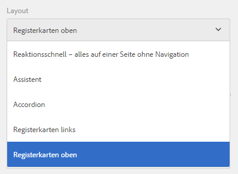
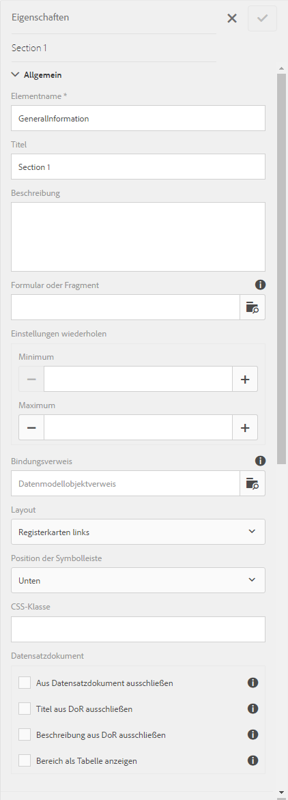
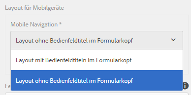
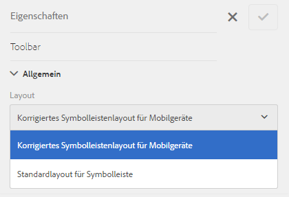

# Layout-Möglichkeiten für adaptive Formulare{#layout-capabilities-of-adaptive-forms}

<span class="preview"> Adobe empfiehlt, die modernen und erweiterbaren [Kernkomponenten](https://experienceleague.adobe.com/docs/experience-manager-core-components/using/adaptive-forms/introduction.html?lang=de) zur Datenerfassung zu verwenden, um [neue adaptive Formulare zu erstellen](/help/forms/using/create-an-adaptive-form-core-components.md) oder [adaptive Formulare zu AEM Sites-Seiten hinzuzufügen](/help/forms/using/create-or-add-an-adaptive-form-to-aem-sites-page.md). Diese Komponenten stellen einen bedeutenden Fortschritt bei der Erstellung adaptiver Formulare dar und sorgen für beeindruckende Anwendererlebnisse. In diesem Artikel wird der ältere Ansatz zum Erstellen adaptiver Formulare mithilfe von Foundation-Komponenten beschrieben. </span>

| Version | Artikel-Link |
| -------- | ---------------------------- |
| AEM as a Cloud Service | [Hier klicken](https://experienceleague.adobe.com/docs/experience-manager-cloud-service/content/forms/adaptive-forms-authoring/authoring-adaptive-forms-foundation-components/configure-layout-of-an-adaptive-form/layout-capabilities-adaptive-forms.html?lang=de) |
| AEM 6.5 | Dieser Artikel |


Mit Adobe Experience Manager (AEM) können Sie einfach verwendbare adaptive Formulare erstellen, die Endbenutzenden dynamische Erlebnisse bieten. Das Formular-Layout steuert, wie Elemente oder Komponenten in einem adaptiven Formular angezeigt werden.

## Vorausgesetzte Kenntnisse {#prerequisite-knowledge}

Bevor Sie die verschiedenen Layoutfunktionen adaptiver Formulare kennenlernen, lesen Sie die folgenden Artikel, um mehr über adaptive Formulare zu erfahren.

[Einführung in AEM Forms](../../forms/using/introduction-aem-forms.md)

[Einführung in die Erstellung von Formularen](../../forms/using/introduction-forms-authoring.md)

## Typen von Layouts {#types-of-layouts}

In einem adaptiven Formular stehen Ihnen die folgenden Typen von Layouts zur Verfügung:

**Bereichslayout** Steuert, wie in einem Bereich befindliche Elemente oder Komponenten auf einem Gerät angezeigt werden.

**Layout für Mobilgeräte** Steuert die Navigation eines Formulars auf einem mobilen Gerät. Wenn das Gerät eine Breite von mindestens 768 Pixel aufweist, wird das Layout als Layout für Mobilgeräte betrachtet und für Mobilgeräte optimiert.

**Symbolleisten-Layout** Steuert die Platzierung von Aktionsschaltflächen in der Symbolleiste bzw. in der Bereichssymbolleiste in einem Formular.

Alle diese Bedienfeldlayouts werden in den folgenden Verzeichnissen definiert:

`/libs/fd/af/layouts`.

>[!NOTE]
>
>Um das Layout eines adaptiven Formulars zu ändern, verwenden Sie den Bearbeitungsmodus in AEM.


## Bereichslayout {#panel-layout}

Formularerstellerinnen und -ersteller können jedem Bereich eines adaptiven Formulars ein Layout zuordnen, einschließlich des Stammbereichs.

Die Bereichslayouts stehen unter `/libs/fd/af/layouts/panel` zur Verfügung.



Liste der Bedienfeldlayouts in den adaptiven Formularen

### Responsiv – alles auf einer Seite ohne Navigation {#responsive-everything-on-one-page-without-navigation-br}

Verwenden Sie dieses Bereichslayout, um ein responsives Layout zu erstellen, das sich ohne spezielle Navigation an die Bildschirmgröße Ihres Geräts anpasst.

Mithilfe dieses Layouts können Sie in das Bedienfeld nacheinander mehrere Komponenten für **[!UICONTROL Bedienfelder für adaptive Formulare]** einfügen.


So sieht ein Formular mit einem responsiven Layout auf einem kleinen Bildschirm aus


Formular mit einem responsiven Layout auf einem großen Bildschirm

### Assistent: ein mehrstufiges Formular, das einen Schritt nach dem anderen anzeigt {#wizard-a-multi-step-form-showing-one-step-at-a-time}

Verwenden Sie dieses Bereichslayout, um innerhalb eines Formulars eine geführte Navigation anzubieten. Beispielsweise können Sie dieses Layout verwenden, wenn Sie in einem Formular obligatorische Informationen erfassen und dabei die Benutzer Schritt für Schritt anleiten möchten.

Verwenden Sie die `Panel adaptive form`-Komponente, um in einem Bedienfeld eine schrittweise Navigation zur Verfügung zu stellen. Wenn Sie dieses Layout verwenden, gehen Benutzer erst dann zum nächsten Schritt über, wenn der aktuelle Schritt abgeschlossen ist.

```javascript
window.guideBridge.validate([], this.panel.navigationContext.currentItem.somExpression)
```



Ausdruck für das Abschließen von Schritten im Assistentenlayout für ein Mehrstufenformular


Ein Formular, das den Assistenten verwendet

### Layout für Akkordeon-Design {#layout-for-accordion-design}

Mit diesem Layout können Sie die `Panel adaptive form`-Komponente in ein Bedienfeld mit Navigation im Akkordeonstil einfügen. Mit diesem Layout können Sie außerdem wiederholbare Bereiche erstellen. Wiederholbare Bereiche ermöglichen es Ihnen, Bereiche nach Bedarf hinzuzufügen oder zu entfernen. Sie können dabei festlegen, wie oft sich ein Bereich mindestens oder maximal wiederholen darf. Außerdem kann anhand der in den Bereichselementen angegebenen Informationen der Titel des Bereichs dynamisch festgelegt werden.

Ein Zusammenfassungsausdruck kann verwendet werden, um im Titel des minimierten Bereichs die vom Endbenutzer eingegebenen Werte anzuzeigen.


Mit dem Akkordeon-Layout erstellte wiederholbare Bedienfelder

### Layout mit Registerkarten – Registerkarten werden auf der linken Seite angezeigt {#tabbed-layout-tabs-appear-on-the-left}

Mithilfe dieses Layouts können Sie die `Panel adaptive form`-Komponente in ein Bedienfeld mit Registerkartennavigation einfügen. Die Registerkarten befinden sich auf der linken Seite der Bereichsinhalte.


Registerkarten auf der linken Seite eines Bereichs

### Layout mit Registerkarten – Registerkarten werden oben angezeigt {#tabbed-layout-tabs-appear-on-the-top}

Mithilfe dieses Layouts können Sie die `Panel adaptive form`-Komponente in ein Bedienfeld mit Registerkartennavigation einfügen. Die Registerkarten befinden sich oberhalb der Bereichsinhalte.


Am oberen Rand eines Bedienfelds erscheinende Registerkarten

## Layouts für Mobilgeräte {#mobile-layouts}

Layouts für Mobilgeräte ermöglichen eine benutzerfreundliche Navigation auf Mobilgeräten mit verhältnismäßig kleineren Bildschirmen. Layouts für Mobilgeräte verwenden für die Formularnavigation entweder Registerkarten- oder Assistentenstile. Das Anwenden eines Layouts für Mobilgeräte bietet ein einzelnes Layout für das gesamte Formular.

In diesem Layout wird die Navigation über eine Navigationsleiste und ein Navigationsmenü gesteuert. In der Navigationsleiste befinden sich die Symbole **&lt;** und **>**, um den **nächsten** und den **vorigen** Navigationsschritt im Formular anzuzeigen.

Die Layouts für Mobilgeräte sind unter `/libs/fd/af/layouts/mobile/` verfügbar. Die folgenden Layouts für Mobilgeräte stehen für adaptive Formulare standardmäßig zur Verfügung.



Liste der Layouts für Mobilgeräte in adaptiven Formularen

Bei einem Layout für Mobilgeräte ist das Formularmenü (über das auf verschiedene Formularbereiche zugegriffen werden kann) per Klick auf das Symbol  verfügbar.

### Layout mit Bereichstiteln in der Formularkopfzeile {#layout-with-panel-titles-in-the-form-header}

Wie der Name schon sagt, werden bei diesem Layout neben dem Navigationsmenü und der Navigationsleiste Bedienfeldtitel angezeigt. Dieses Layout enthält auch die Symbole „Weiter“ und „Zurück“ zur Navigation.


Layouts für Mobilgeräte mit Bereichstiteln in den Formularkopfzeilen

### Layout ohne Bereichstitel in der Formularkopfzeile {#layout-without-panel-titles-in-the-form-header}

Wie der Name schon sagt, werden bei diesem Layout nur das Navigationsmenü und die Navigationsleiste ohne Bedienfeldtitel angezeigt. Dieses Layout enthält auch die Symbole „Weiter“ und „Zurück“ zur Navigation.


Layouts für Mobilgeräte ohne Bereichstitel in den Formularkopfzeilen

## Symbolleisten-Layouts {#toolbar-layouts}

Mit einem Symbolleistenlayout werden Positionierung und Anzeige aller Aktionsschaltflächen gesteuert, die Sie Ihren adaptiven Formularen hinzufügen. Das Layout kann auf Formular- oder Bedienfeldebene hinzugefügt werden.



Liste der Symbolleistenlayouts in adaptiven Formularen

Die Symbolleistenlayouts befinden sich unter `/libs/fd/af/layouts/toolbar`. Adaptive Formulare stehen in den folgenden Symbolleistenlayouts standardmäßig zur Verfügung.

### Standard-Layout für Symbolleiste {#default-layout-for-toolbar}

Dieses Layout wird als Standard-Layout ausgewählt, wenn Sie Aktionsschaltflächen in einem adaptiven Formular hinzufügen. Bei Auswahl dieses Layouts wird für Desktop- und Mobilgeräte dasselbe Layout angezeigt.

Außerdem können Sie mehrere Symbolleisten mit Aktionsschaltflächen hinzufügen, die mit diesem Layout konfiguriert sind. Eine Aktionsschaltfläche ist mit einem Formularsteuerelement verknüpft. Sie können die Symbolleisten so konfigurieren, dass sie sich vor oder hinter einem Bedienfeld befinden.


Standardansicht für Symbolleiste

### Festes Layout für Mobilgeräte für Symbolleiste {#mobile-fixed-layout-for-toolbar}

Wählen Sie dieses Layout aus, um alternative Layouts für Desktop- und Mobilgeräte bereitzustellen.

Für das Desktop-Layout können Sie Aktionsschaltflächen mithilfe bestimmter Beschriftungen hinzufügen. Mit diesem Layout kann nur eine Symbolleiste konfiguriert werden. Wenn mehr als eine Symbolleiste mit diesem Layout konfiguriert ist, entsteht eine Überlappung bei Mobilgeräten und nur eine Symbolleiste ist sichtbar. Sie können beispielsweise eine Symbolleiste am unteren oder oberen Rand des Formulars oder hinter oder vor den Bedienfeldern im Formular einfügen.

Beim Layout für Mobilgeräte können Sie mithilfe von Symbolen Aktionsschaltflächen hinzufügen.


Festes Layout für Mobilgeräte für Symbolleiste
