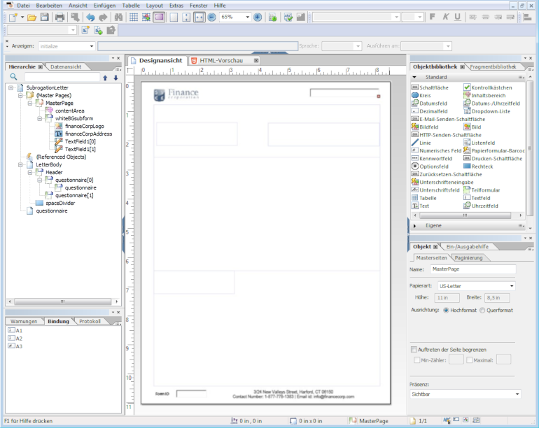
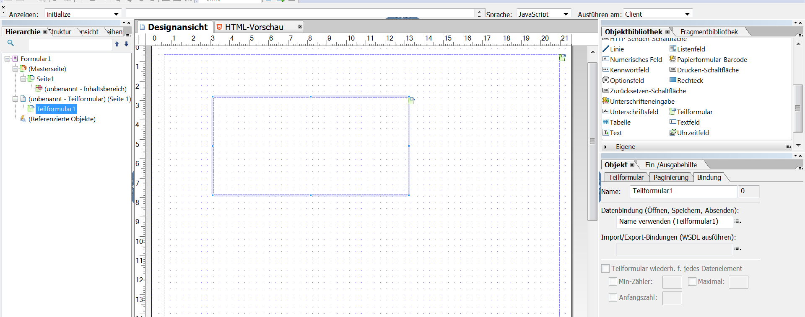
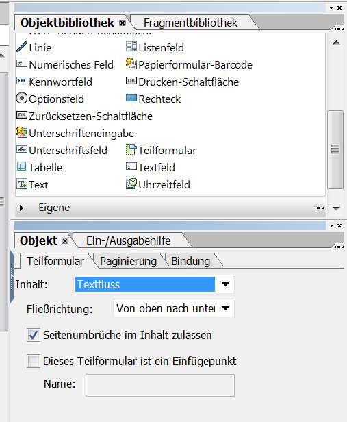
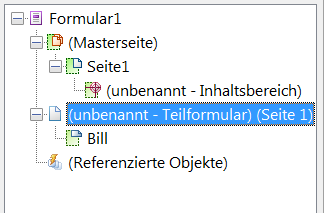
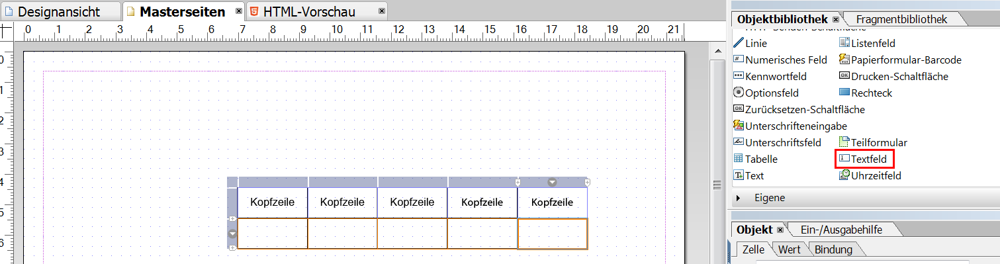

# Layout-Design{#layout-design}

XFA-Formularvorlagen oder XDPs sind die Vorlagen für:

* [Briefe](/help/forms/using/create-letter.md)
* [Druckkanal](/help/forms/using/web-channel-print-channel.md#printchannel) von [Interaktiver Kommunikation](/help/forms/using/interactive-communications-overview.md)

* Layout-Fragmente

Eine XDP wird mit Adobe Forms Designer entwickelt. In diesem Artikel finden Sie Details zum Entwerfen Ihrer XDPs für die Erstellung effektiver Korrespondenzen/interaktiver Kommunikation, z. B. wo Formularfelder oder Zielbereiche verwendet werden und wann Layout-Fragmente verwendet werden.

## Erstellen eines Layouts für Briefe oder für den Druckkanal von interaktiver Kommunikation {#creating-a-layout-for-letters-or-for-interactive-communications-print-channel}

Ein Layout bestimmt das grafische Layout eines Briefs/Druckkanals einer interaktiven Kommunikation. Das Layout kann typische Formularfelder wie „Adresse“ und „Referenz“ enthalten. Es enthält auch leere Unterformulare, die Zielbereiche darstellen. Erstellen Sie das Layout im Formulardesigner. Danach lädt es der Anwendungsspezialist auf den AEM-Server. Von dort können Sie das Layout bei der Erstellung einer Korrespondenzvorlage oder eines Druckkanals einer interaktiven Kommunikation auswählen.

Befolgen Sie diese Schritte, um Layouts für Briefe/Druckkanal einer interaktiven Kommunikation zu erstellen:

1. Analysieren Sie das Layout, und bestimmen Sie den Inhalt, der über alle Seiten wiederholt wird. Normalerweise fallen Seitenkopf- und -fußzeilen in diese Kategorie. Dieser Inhalt wird auf Mustervorlagenseiten des Layouts platziert. Der restliche Inhalt wird in den Hauptteilseiten des Layouts platziert. In einer Richtlinienhülle kann das Logo und die Unternehmensadresse zu den Kopf- und Fußzeilen der Mustervorlagenseite hinzugefügt werden. Beispiel: Abbruchsmitteilung dasselbe Layout.
1. Wenn Sie die Hauptteilseiten entwickeln, teilen Sie den Seiteninhalt in Abschnitte. Jeder Abschnitt wird als Unterformular entwickelt, das im Layout selbst oder als Fragment-Layout eingebettet wird. Wenn der Abschnitt eine Tabelle enthält, modellieren Sie ihn als Fragment-Layout.
1. Ein Layout kann folgendermaßen entwickelt werden:

   1. Machen Sie jeden Bereich zu einem separaten Unterformular mit allen Elementen des Abschnitts.
   1. Machen Sie jeden Abschnitt zu einem untergeordneten Unterformular des gleichen übergeordneten Unterformulars. Das Layout des übergeordneten Unterformulars ist auf Fluss eingestellt, um den Abschnitten das Wechseln zu ermöglichen, wenn große Datenmengen in vorherigen Abschnitten zusammengeführt werden.
   1. Der primäre Standortabschnitt kann auch in anderen Layouts wiederverwendet werden. Erstellen Sie ihn als Fragment-Layout.
   1. Die Details des zusätzlichen Abschnitts enthalten nur zwei Elemente, die untereinander platziert sind, können große Datenmengen enthalten und werden als Fluss entwickelt.
   1. Andere Abschnitte enthalten Elemente an bestimmten Positionen, sodass sie als positioniertes Layout entwickelt werden.
   1. Teilen Sie einen Abschnitt in Unterformulare, wenn der Abschnitt Elemente an bestimmten Positionen enthält und wenn diese Elemente große Datenmengen enthalten. Ordnen Sie dann die Unterformulare an, um das gewünschte Verhalten zu erzielen.
   1. Fügen Sie für den primären Standortabschnitt einen Platzhalter-Zielbereich hinzu. Der Platzhalter ist an den primären Fragmentstandort gebunden, wenn der Brief/die interaktive Kommunikation entwickelt wird.
   1. Laden Sie das Layout (und ggf. das Fragment, das das Layout verwendet) in den AEM Forms-Server hoch.

### Teilformular in einer XDP-Vorlage verwenden {#usesubformxdp}

Nachdem Sie das für die Erstellung der interaktiven Kommunikation erforderliche Layout analysiert haben, können Sie Teilformulare in der XDP-Vorlage mit Forms Designer erstellen. Leere Teilformularkomponenten, die in der XDP-Vorlage verwendet werden, führen zur Anzeige von Zielbereichen im Druckkanal der interaktiven Kommunikation.

>[!NOTE]
>
>Fügen Sie Inhalt zum Druckkanal der interaktiven Kommunikation hinzu, anstatt Inhalt zur Teilformularkomponente in der XDP-Vorlage hinzuzufügen. Fügen Sie den Zielbereichen im Druckkanal mithilfe von [Dokumentfragmenten, Diagrammen, Bildern](create-interactive-communication.md#step2) und Layout-Fragmenten Inhalt hinzu.

Führen Sie die folgenden Schritte aus, um das Teilformular in einer XDP-Vorlage zu verwenden:

1. Öffnen Sie den Forms Designer, wählen Sie **Datei** > **Neu** > **Leeres Formular verwenden**, tippen Sie auf **Weiter** und tippen Sie dann auf **Fertig stellen**, um das Formular zur Vorlagenerstellung zu öffnen.

   Stellen Sie sicher, dass die **Objektbibliothek** und die Option **Objekt** im Menü **Fenster** ausgewählt werden.

1. Ziehen Sie die Komponente **Teilformular** aus der **Objektbibliothek** in das Formular.

   

1. Wählen Sie das Teilformular aus, um die Optionen für das Teilformular im Fenster **Objekt** im rechten Bereich anzuzeigen.
1. Wählen Sie die Registerkarte **Teilformular** und wählen Sie **Textfluss** aus der Dropdownliste **Inhalt** aus. Ziehen Sie den linken Endpunkt des Teilformulars, um die Länge anzupassen.

   

1. Auf der Registerkarte **Bindung** :

   1. Geben Sie im Feld **Name** einen Namen für das Teilformular an.
   1. Wählen Sie **Keine Datenbindung** aus der Dropdown-Liste **Datenbindung**.

1. Wählen Sie auf ähnliche Weise das Stammteilformular aus dem linken Bereich aus.

   

1. Wählen Sie die Registerkarte **Teilformular** und wählen Sie **Textfluss** aus der Dropdownliste **Inhalt** aus. Führen Sie auf der Registerkarte **Bindungen** folgende Schritte aus:

   1. Geben Sie im Feld **Name** einen Namen für das Teilformular an.
   1. Wählen Sie **Keine Datenbindung** aus der Dropdown-Liste **Datenbindung**.

   Wiederholen Sie die Schritte 2 bis 5, um der XDP-Vorlage weitere Teilformulare hinzuzufügen. Fügen Sie den Zielbereichen [Text, Dokumentfragmente, Bilder und Diagramme](create-interactive-communication.md#step2) nur während der Erstellung der interaktiven Kommunikation hinzu.

1. Wählen Sie **Datei** > **Speichern unter**, um die Datei im lokalen Dateisystem zu speichern:

   1. Navigieren Sie zum Speicherort der Datei und geben Sie einen Namen für die XDP-Vorlage an.
   1. Wählen Sie **.xdp** aus der Dropdown-Liste **Dateityp**.

   1. Tippen Sie auf **Speichern**.

### Bildfeldkomponente in XDP-Vorlage verwenden {#use-image-field-component-in-an-xdp-template}

Verwenden Sie die Komponente Bildfeld oder Teilformular in der XDP-Vorlage und fügen Sie beim Erstellen der interaktiven Kommunikation ein Bild hinzu.

>[!NOTE]
>
>Fügen Sie dem Druckkanal der interaktiven Kommunikation ein Bild hinzu, anstatt in der XDP-Vorlage ein Bild zur Komponente Bildfeld oder Teilformular hinzuzufügen. Weitere Informationen finden Sie unter [Hinzufügen von Inhalten zur interaktiven Kommunikation](../../forms/using/create-interactive-communication.md#step2).

Führen Sie die folgenden Schritte aus, um die Bildfeldkomponente in einer XDP-Vorlage zu verwenden:

1. Ziehen Sie die Komponente **Bildfeld** aus der **Objektbibliothek** in das Formular.
1. Wählen Sie das Teilformular aus, um die Optionen für das Teilformular im Fenster **Objekt** im rechten Bereich anzuzeigen.
1. Auf der Registerkarte **Bindung** :

   1. Geben Sie im Feld **Name** einen Namen für das Bildfeld an.
   1. Wählen Sie **Keine Datenbindung** aus der Dropdown-Liste **Datenbindung**.

### XDP-Vorlage für Layoutfragmente erstellen {#xdplayoutfragments}

Verwenden Sie die Komponente &quot;Tabelle&quot;in Forms Designer, um Layout-Fragmente zu erstellen, und verwenden Sie sie dann zum Erstellen von Tabellen beim Erstellen des Druckkanals der interaktiven Kommunikation. Durch die Verwendung von Layout-Fragmenten zur Erstellung von Tabellen wird sichergestellt, dass der Tabelleninhalt die Struktur behält, wenn der Webkanal automatisch über den Druckkanal generiert wird.

>[!NOTE]
>
>Geben Sie Text in die Tabellenzellen ein oder erstellen Sie [nur beim Authoring der interaktiven Kommunikation eine Bindung mit den Formulardatenmodellobjekten](create-interactive-communication.md#step2).

Führen Sie die folgenden Schritte aus, um die Komponente Tabelle in der XDP-Vorlage mit Forms Designer zu verwenden:

1. Ziehen Sie die Komponente **Tabelle** aus der **Objektbibliothek** in das Formular.
1. Fügen Sie im Dialogfeld **Tabelle** ein:

   1. Geben Sie die Anzahl der Zeilen und Spalten für die Tabelle an.
   1. Aktivieren Sie das Kontrollkästchen **Kopfzeile in Tabelle** einschließen , um eine Zeile für die Tabellenüberschrift einzuschließen.
   1. Tippen Sie auf **OK**.

1. Tippen Sie im linken Bereich neben dem Namen der Tabelle auf **+**, klicken Sie mit der rechten Maustaste auf die Zellennamen in der Kopfzeile und anderen Zeilen und wählen Sie **Objekt umbenennen** aus, um die Tabellenzellen umzubenennen.
1. Klicken Sie auf die Textfelder für die Tabellenüberschrift in der **Designansicht** und benennen Sie sie um.
1. Ziehen Sie die Komponente **Textfeld** aus der **Objektbibliothek** in jede Tabellenzelle in der **Designansicht**. Führen Sie diesen Schritt aus, um Tabellenzellen bei der Erstellung der interaktiven Kommunikation mit den Formulardatenmodellobjekten zu binden.

   

1. Wählen Sie den Namen der Zeile im linken Bereich aus und wählen Sie **Objekt** > **Bindung** > **Zeile für jedes Datenelement wiederholen**. Führen Sie diesen Schritt aus, um sicherzustellen, dass die Tabellenzeile für jedes in der Datenbank verfügbare Datenelement automatisch wiederholt wird, wenn eine Bindung zwischen den Tabellenzellen dieser Zeile mit Formulardatenmodellobjekten des Erfassungstyps erstellt wird.

   Geben Sie Text in die Tabellenzellen ein oder erstellen Sie [nur beim Authoring der interaktiven Kommunikation eine Bindung mit den Formulardatenmodellobjekten](create-interactive-communication.md#step2).

1. Wählen Sie **Datei** > **Speichern unter**, um die Datei im lokalen Dateisystem zu speichern:

   1. Navigieren Sie zum Speicherort der Datei und geben Sie den Namen für die XDP-Vorlage an.
   1. Wählen Sie **.xdp** aus der Dropdown-Liste **Dateityp**.

   1. Tippen Sie auf **Speichern**.

### Laden Sie die XDP-Vorlagen auf den AEM Forms Server hoch {#uploadxdptemplate}

Nachdem Sie eine XDP-Vorlage mit dem Forms-Designer erstellt haben, müssen Sie sie auf den AEM Forms-Server hochladen, damit die Vorlage beim Erstellen der interaktiven Kommunikation verwendet werden kann.

1. Wählen Sie **Formulare** > **Formulare &amp; Dokumente**.
1. Tippen Sie auf **Erstellen** > **Datei hochladen**.
1. Navigieren Sie zum Speicherort der XDP-Vorlage im lokalen Dateisystem und tippen Sie auf **Öffnen** , um die XDP-Vorlage auf den AEM Forms-Server zu importieren.

## Schema verwenden {#using-schema}

Sie können ein Schema in einem Layout oder Fragment-Layout verwenden, was aber nicht erforderlich ist. Wenn Sie ein Schema verwenden, stellen Sie Folgendes sicher:

1. Das Layout und alle Fragment-Layouts, die in einem Brief verwendet werden, verwenden das gleiche Schema wie der Brief/die interaktive Kommunikation.
1. Alle Felder, die mit Daten gefüllt werden müssen, sind an das Schema gebunden.

## Verknüpfungsfähige Felder erstellen {#creating-relatable-fields}

Standardmäßig werden alle Felder als verknüpfungsfähig mit vielen anderen Datenquellen betrachtet. Wenn das Layout Felder enthält, die nicht mit einer Datenquelle verknüpfungsfähig sind, fügen Sie den Namen dieser Felder das Suffix „_int“ (intern) hinzu. Beispiel: pageCount_int.

Ein verknüpfungsfähiges Feld muss folgende Voraussetzungen erfüllen:

* ein XFA &lt;field> oder &lt;exclGroup> sein.
* Es muss einen XFA-Bindungsverweis haben.
* Wenn es sich um &lt;exclGroup> handelt, muss es über mindestens ein untergeordnetes Feld für ein Optionsfeld verfügen, andernfalls kann die Art des Wertes nicht ermittelt werden.

Ein verknüpfungsfähiges Feld muss folgende Voraussetzungen erfüllen:

* Es muss einen Namen haben.

Auf ein verknüpfungsfähiges Feld darf Folgendes NICHT zutreffen:

* An den Namen ist das Suffix „_int“ angehängt.
* Das Feld „binding“ ist auf „none“ eingestellt.
* ein untergeordnetes Element eines &lt;exclGroup> -Elements sein.

Solange ein verknüpfungsfähiges Feld die oben genannten Kriterien erfüllt, kann es sich im Layout an jeder beliebigen Position und in jeder Verschachtelungstiefe befinden. Verknüpfungsfähige Felder lassen sich auf Masterseiten verwenden.

Felder sind in Bezug auf ihre Layoutkonfiguration flexibler als Unterformulare, die als Zielfelder verwendet werden, allerdings sind Felder an eine einzige Wertart gebunden. Sie können ein Feld in die Breite ziehen oder es mit einer festen Breite oder Höhe einrichten usw. Das aufgelöste Modul- oder Regelergebnis wird in das Feld übernommen.

## Wann sollten Unterformulare, wann Felder verwendet werden  {#deciding-when-to-use-subforms-and-text-nbsp-fields}

Verwenden Sie ein Unterformular für Inhalte aus mehreren Modulen in einem von oben nach unten angeordneten Layout mit vertikalem Fluss (mehrere Absätze oder Bilder). Die Höhe eines Unterformulars nimmt zu, damit es den vorgesehenen Inhalt fassen kann: Achten Sie darauf, dass Ihr Layout diesen Umstand bewältigen kann. Wenn Sie nicht sicher sein können, dass der mit dem Unterformular/dem Zielbereich verknüpfte Inhalt niemals mehr Raum einnimmt als für das Unterformular vorgesehen ist, richten Sie das Unterformular als untergeordnetes Element eines fließenden Unterformular-Containers ein. Damit stellen Sie sicher, dass Layout-Objekte unterhalb des Unterformulars nach unten rücken, wenn die Höhe des Unterformulars zunimmt.

Verwenden Sie ein Feld, wenn Sie Moduldaten oder Daten aus einem Datenlexikonelement in das Schema Ihres Layouts aufnehmen möchten (da Felder mit Daten verknüpft sind) oder wenn Modulinhalte auf einer Masterseite angezeigt werden sollen. Beachten Sie, dass sich die Position von Inhalten auf einer Masterseite nicht an die Inhalte einer Hauptteilseite anpasst; stellen Sie also sicher, dass ein Bildfeld als Kopfzeilenlogo verwendet wird. Die folgende Tabelle enthält weitere Kriterien für die Entscheidung, wann ein Unterformular und wann ein Feld im Layout verwendet werden sollte.

<table>
 <tbody>
  <tr>
   <td>
<strong>Voraussetzungen zur Verwendung eines Unterformulars</strong>
 </td>
   <td>
<strong>Voraussetzungen zur Verwendung eines Textfeldes</strong>
 </td>
  </tr>
  <tr>
   <td>
Es enthält eine Kombination einzelner Elemente, z. B. Vorname und Nachname.
 </td>
   <td>
Es enthält ein einzelnes Element, z. B. eine Policennummer.
 </td>
  </tr>
  <tr>
   <td>
Es enthält mehrere Absätze.
 </td>
   <td>
Text wird umgebrochen und ausgerichtet.
 </td>
  </tr>
  <tr>
   <td>
Sich wiederholende, optionale und bedingte Datengruppen sind mit Unterformularen verknüpft, um das Risiko von Designfehlern zu verringern, wie sie auftreten könnten, wenn Sie zur Erzielung desselben Ergebnisses Skripte verwenden würden.
 </td>
   <td>
Elemente wie das Logo und die Adresse Ihres Unternehmens werden auf allen Seiten eines Brief/der interaktiven Kommunikation angezeigt. Erstellen Sie in einem solchen Fall Formularfelder für die betreffenden Elemente und ordnen Sie die Felder auf der Masterseite an. Wenn Sie das Feld „binding“ auf „Keine Datenbindung“ einstellen, werden im Editor „Kommunikation“ keine Felder als verknüpfungsfähige Felder angezeigt. Wenn Sie mit diesen Feldern jedoch bestimmte Inhaltstypen verknüpfen möchten, muss der Bindungstyp im Feld „binding“ entsprechend eingerichtet werden.
 
Wenn die Firmenadresse mehr als eine Datenzeile umfasst, verwenden Sie das Textfeld mit der Option „Mehrere Zeilen zulassen“, um die Adresse im Layout darzustellen.
 
Wenn der Datentyp eines Textfeldes auf Normaltext eingestellt ist, wird die Normaltextversion der Modulausgabe an Stelle der Rich-Text-Version verwendet (d. h. alle Formatierungen gehen verloren). Wenn die Formatierung erhalten bleiben soll, stellen Sie den Datentyp des Textfeldes auf Rich-Text ein.
 </td>
  </tr>
  <tr>
   <td>
Text wird fortlaufend eingefügt (Textfluss).
 </td>
   <td>
Textfelder und Bildfelder werden auf Masterseiten verwendet. Auf Masterseiten können Unterformulare nicht als Zielbereiche verwendet werden.
 </td>
  </tr>
  <tr>
   <td>
Objekte werden gruppiert und organisiert, ohne das Unterformular mit einem Datenelement zu verknüpfen.
 </td>
   <td>
 
 </td>
  </tr>
  <tr>
   <td>
Innerhalb des Unterformulars ist ein Textfeld vorhanden. Das Unterformular kann an Größe zunehmen, ohne darunter angeordnete Layout-Objekte zu überschreiben.
 </td>
   <td>
Sie benötigen einen einfachen Zugriff auf die Daten in der Nachbearbeitung.
 </td>
  </tr>
 </tbody>
</table>

## Sich wiederholende Elemente einrichten  {#setting-up-repetitive-elements}

Wenn Elemente wie das Logo und die Adresse Ihres Unternehmens auf allen Seiten eines Briefs/einer interaktiven Kommunikation angezeigt werden, erstellen Sie für diese Elemente Formularfelder und platzieren Sie diese auf der Masterseite. Nehmen Sie die Bindung für diese Felder über den Feldnamen vor.

## Geben Sie das Server-Renderformat {#specify-the-server-nbsp-render-format} an

Verwenden Sie das Server-Renderformat des Layouts für das dynamische XML-Formular, andernfalls können Briefe/interaktive Kommunikation, die auf diesem Layout basieren, nicht korrekt gerendert werden. Das Server-Renderformat ist in Forms Designer standardmäßig auf das dynamische XML-Formular eingestellt. Sicherstellen, dass Sie das richtige Format verwenden:

* Klicken Sie in Designer auf **Datei** > **Formulareigenschaften** > **Standard**, und vergewissern Sie sich, dass „PDF-Wiedergabeformat“ auf „Dynamisches XML-Formular“ eingestellt ist.
