# Dokumentfragmente{#document-fragments}

## Dokumentfragmente {#document-fragments-1}

Dokumentfragmente sind wiederverwendbare Teile/Komponenten einer Korrespondenz, mit der Sie Briefe/Korrespondenz erstellen können. Es gibt Dokumentfragmente der folgenden Typen:

* **Text**: Ein Textelement ist eine Inhaltskomponente, die aus einem oder mehreren Textabsätzen besteht. Ein Absatz kann statisch oder dynamisch sein.
* **Liste**: Eine Liste ist eine Gruppe von Dokumentfragmenten, einschließlich Text, Listen, Bedingungen und Bildern. Die Reihenfolge der Listenelemente kann festgelegt sein oder bearbeitet werden. Beim Erstellen eines Briefs können Sie einige oder alle Listenelemente verwenden, um ein wiederverwendbares Muster von Elementen zu replizieren.
* **Bedingung**: Mithilfe von Bedingungen können Sie festlegen, welche Inhalte zum Zeitpunkt der Dokumenterstellung je nach den bereitgestellten Daten in das Schriftstück einbezogen werden sollen. Die Beschreibung der Bedingung beruht auf Steuerungsvariablen. Die Steuerungsvariable kann entweder ein Datenwörterbuchelement oder ein Platzhalter sein.
* **Layout-Fragment**: Unter einem Layout-Fragment versteht man ein Layout, das mit einem oder mehreren Briefen verwendet werden kann. Mit einem Layout-Fragment werden wiederholbare Muster, insbesondere dynamische Tabellen erstellt. Das Layout kann typische Formularfelder wie „Adresse“ und „Referenz“ enthalten. Es enthält auch leere Unterformulare, die Zielbereiche kennzeichnen. Die Layouts (XDPs) werden in Designer erstellt und dann in AEM Forms hochgeladen.

## Text {#text}

Ein Text-Asset ist eine Inhaltskomponente, die aus einem oder mehreren Textabsätzen besteht. Ein Absatz kann statisch oder dynamisch sein. Ein dynamischer Absatz enthält Verweise auf Datenelemente, deren Werte zur Laufzeit bereitgestellt werden. So könnte beispielsweise der Kundenname in einer Grußformel ein dynamisches Datenelement sein, dessen Wert zur Laufzeit bereitgestellt wird. Durch Änderung dieser Werte können Sie dieselbe Briefvorlage zur Erstellung von Briefen für unterschiedliche Kunden verwenden.

Die Correspondence Management Solution unterstützt zwei Arten dynamischer Datenelemente (variable Daten):

* **Elemente eines Datenwörterbuchs**: Diese Elemente sind an das Datenwörterbuch gebunden und erhalten ihre Werte aus der bereitgestellten Datenquelle. Eine Datenwörterbuchvariable kann geschützt oder ungeschützt sein. Bei der Korrespondenzerstellung kann der Benutzer den Standardwert ungeschützter Datenwörterbuchvariablen ändern; bei geschützten Variablen ist dies nicht möglich.
* **Platzhalter**: Hierbei handelt es sich um Variablen, die nicht an eine Back-End-Datenquelle gebunden sind. Der Benutzer muss während der Korrespondenzerstellung einen Wert einsetzen. Die Platzhalter sind standardmäßig ungeschützt. 

>[!NOTE]
>
>Die Correspondence Management-Vorlagen zwingen Sie nicht, beim Erstellen von Platzhaltern eindeutige Namen zu erstellen. Wenn Sie zwei Platzhalter mit demselben Namen erstellen, zum Beispiel einen Text und eine Bedingung, und sie beide in einer Briefvorlage verwenden, werden die Werte des zuletzt eingefügten Platzhalters für beide Platzhalter verwendet. Wenn zwei Platzhalter denselben Namen haben, werden ihre Typen verglichen. Wenn die Typen unterschiedlich sind, wird deren Typ auf „String“ festgelegt. Innerhalb eines Moduls können Sie jedoch nicht mehrere Platzhalter mit demselben Namen erstellen.

### Text erstellen {#create-text}

1. Wählen Sie **Formulare** > **Dokumentfragmente**.
1. Tippen Sie auf **Erstellen** > **Text** Oder wählen Sie ein Textelement und tippen Sie auf **Bearbeiten**.
1. Geben Sie folgende Informationen für den Text an:

   * **Titel: (Optional)** Geben Sie den Titel für das Text-Asset ein. Titel müssen nicht eindeutig sein und dürfen Sonderzeichen und nichtenglische Zeichen enthalten. Texte werden durch ihren Titel (falls verfügbar) wie etwa in Miniaturen und Asset-Eigenschaften referenziert.
   * **Name**: Der eindeutige Name für das Textelement. Es ist nicht möglich, dass zwei Elemente (Text, Bedingung oder Liste) mit demselben Namen vorhanden sind, ungeachtet ihres jeweiligen Status. Im Feld „Name“ können Sie nur englische Sprachzeichen, Zahlen und Bindestriche eingeben. Das Feld „Name“ wird automatisch basierend auf dem Feld „Titel“ ausgefüllt. Die im Feld Titel eingegebenen Sonderzeichen, Leerzeichen, Zahlen und nicht englischen Zeichen werden im Feld Name durch Bindestriche ersetzt. Obwohl der Wert im Feld „Titel“ automatisch in das Feld „Name“ kopiert wird, können Sie den Wert bearbeiten.
   * **Beschreibungen**: Geben Sie eine Beschreibung des Elements ein.
   * **Datenwörterbuch**: Wählen Sie optional das Datenwörterbuch aus, dem das Element zugeordnet werden soll. Dank dieses Attributs können Sie den Datenlexikonelementen in dem Textelement Verweise hinzufügen.
   * **Tags**: Um optional einen benutzerdefinierten Tag zu erstellen, geben Sie einen Wert in das Textfeld ein und drücken Sie die Eingabetaste. Sie können den Tag unterhalb des Textfeldes der Tags sehen. Wenn Sie diesen Text speichern, werden die neu hinzugefügten Tags auch erstellt.

1. Tippen Sie auf **Weiter**. Correspondence Management zeigt die Editor-Seite an, auf der Sie Textabsätze und Datenelemente zum Text hinzufügen können.

   Die normale Rechtschreibprüfung Ihres Browsers überprüft die Rechtschreibung im Texteditor. Um die Rechtschreib- und Grammatikprüfung zu verwalten, können Sie die Einstellungen für die Rechtschreibprüfung in Ihrem Browser bearbeiten oder Browser-Plugins/-Addons für die Prüfung von Rechtschreibung und Grammatik installieren.

   Sie können auch die verschiedenen Tastaturbefehle im Texteditor verwenden, um Text zu verwalten, zu bearbeiten und zu formatieren. Weitere Informationen zu [Texteditor](/help/forms/using/keyboard-shortcuts.md#p-formatting-p) Tastaturbefehlen in Correspondence Management-Tastaturbefehlen.

1. Ein Texteditor wird geöffnet. Geben Sie hier den gewünschten Text ein. Verwenden Sie die Symbolleiste oben auf der Seite, um den Text zu formatieren, Bedingungen, Links und Seitenumbrüche einzufügen.

   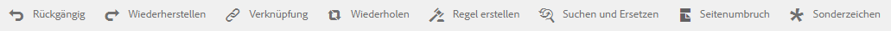

   * **Link**: Fügen Sie eine Hypertextverknüpfung in den Text ein.
   * **Wiederholen**: Mit diesem Befehl wird ein Collection-Element unter Verwendung eines Trennzeichens in ein Datenwörterbuch gedruckt.
   * **Bedingung**: Klicken Sie, um eine Bedingung einzufügen. Text wird auf der Grundlage einer Bedingung eingefügt. Nur wenn die Bedingung den Status „true“ hat, wird der Text im Brief sichtbar.
   * **Beschreibung hinzufügen**: Fügen Sie einem Textabschnitt eine Anmerkung hinzu. Es handelt sich hierbei um Metadaten, die nur für den Autor sichtbar und nicht Teil des erstellten Briefs sind.
   * **Seitenumbruch**: Wenn Sie das Seitenumbruch-Attribut eines Textmoduls auf „false“ setzen, wird das Textmodul nicht auf mehreren Seiten angezeigt.

   Ein Texteditor wird geöffnet. Geben Sie den Text ein. Die Symbolleiste ändert sich je nach dem Typ der Bearbeitung, die Sie vornehmen: Absatz, Ausrichtung oder Auflistung:

   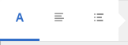

   Symbolleistentyp auswählen: Absatz, Ausrichtung oder Liste

   

   Absatz-Symbolleiste
   [ 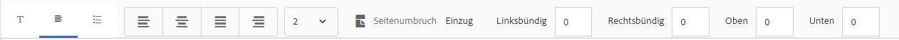](assets/paragrapheditingtoolbar-1.png)SymbolleisteAusrichtungs-Symbolleiste

   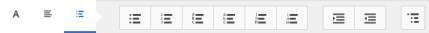

   Listing-Symbolleiste (Klicken Sie auf , um ein Bild in voller Größe zu öffnen)

1. Um einen anderen Textabsatz wiederzuverwenden, der in einer anderen Anwendung, z. B. auf MS Word- oder HTML-Seiten vorhanden ist, kopieren Sie den Text in den Texteditor. Die Formatierung des kopierten Textes wird im Texteditor beibehalten.

   Sie können einen Textabsatz in ein Textmodul kopieren. Beispielsweise haben Sie ein MS-Word-Dokument mit einer Liste mit Aufzählungszeichen mit Aufenthaltsnachweisen:

   

   Sie können den Text direkt aus dem MS Word-Dokument in ein bearbeitbares Textmodul kopieren. Die Formatierung wie die Liste mit Aufzählungszeichen, die Schriftart und Textfarbe wird im Textmodul beibehalten.

   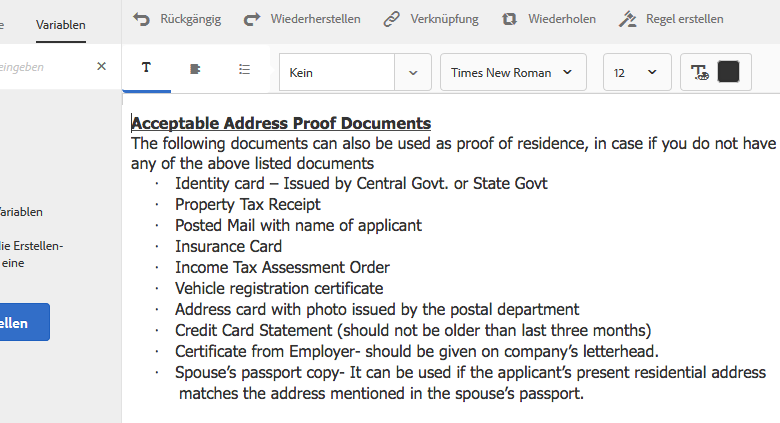

   >[!NOTE]
   >
   >Die Formatierung des eingefügten Textes hat jedoch einige[ Einschränkungen](https://helpx.adobe.com/aem-forms/kb/cm-copy-paste-text-limitations.html).

1. Fügen Sie ggf. Sonderzeichen in das Dokumentfragment ein. Beispielsweise können Sie über die Sonderzeichenpalette die folgenden Zeichen einfügen:

   * Währungssymbole wie €,¥ und £
   * Mathematische Symbole wie, Ö, % und ^
   * Satzzeichen wie ‟ und&quot;

   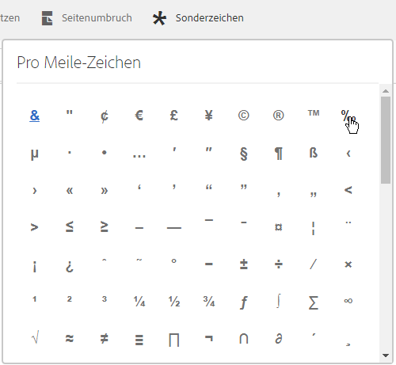

   Correspondence Management enthält integrierte Unterstützung für 210 Sonderzeichen. Der Administrator kann [Unterstützung für mehr/benutzerdefinierte Sonderzeichen durch Anpassung](/help/forms/using/custom-special-characters.md) hinzufügen.

1. Um Teile eines Textes in einem bearbeitbaren Inline-Modul hervorzuheben, wählen Sie den Text aus und tippen Sie auf „Hervorhebungsfarbe“.

   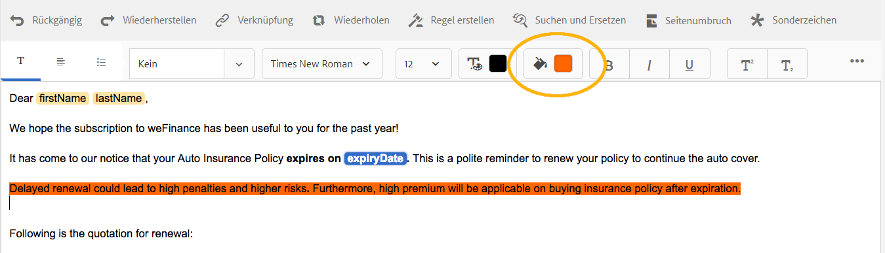

   Sie können entweder direkt auf eine Grundfarbe `**[A]**` tippen, die in der Palette &quot;Grundfarben&quot;vorhanden ist, oder auf **Auswählen** tippen, nachdem Sie den Schieberegler `**[B]**` verwendet haben, um die gewünschte Farbschattierung auszuwählen.

   Optional können Sie auch auf der Registerkarte &quot;Erweitert&quot;die gewünschte Farbe für Farbton, Helligkeit und Sättigung `**[C]**` auswählen, um die genaue Farbe zu erstellen. Tippen Sie dann auf Auswählen `**[D]**` , um die Farbe anzuwenden und den Text hervorzuheben.

   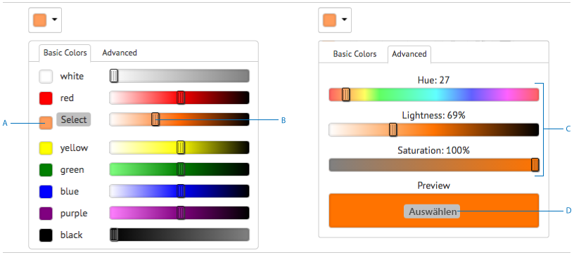

1. Ziehen Sie im Datenbereich Datenwörterbuchelemente und Platzhalterelemente in den Text.

   An:

   * Fügen Sie ein Datenwörterbuchelement in den Text ein, wählen Sie ein Datenelement aus der Liste aus und tippen Sie auf Einfügen ( ). Wenn Sie Geschützt auswählen, ist das Datenlexikonelement schreibgeschützt und wird im Briefeditor, aber nicht in der Benutzeroberfläche „Korrespondenz erstellen“ oder in der Korrespondenzerstellung angezeigt.
   * Um ein Platzhalterelement im Text einzufügen, klicken Sie im Bereich „Datenelemente“ auf „Neu erstellen“. geben Sie die Details des neuen Datenelements ein und klicken Sie auf „Erstellen“, um das neue Element der Liste hinzuzufügen. Der neue Platzhalter kann in den Text auf dieselbe Weise wie ein Datenlexikonelement eingefügt werden. Um einen Platzhalter zu bearbeiten, wählen Sie einen Platzhalter aus und tippen Sie auf „Bearbeiten“.

   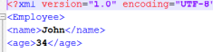

   Platzhalterelemente, wie in der von Ihnen erstellten Musterdatendatei eines Datenwörterbuchs angegeben

   

   Platzhalterelementwerte in der CCR-Ansicht wurden von den Datenwörterbuchvariablen aufgefüllt, wie in der von Ihnen erstellten Musterdatendatei angegeben

   Sie können auch das @-Symbol verwenden, um Datenwörterbuch- und Platzhalterelemente zu suchen und zum Texteditor hinzuzufügen. Platzieren Sie den Cursor an die Stelle, an der das Element eingefügt werden soll. Geben Sie @ ein, gefolgt von der Suchzeichenfolge. Der Texteditor führt den Suchvorgang für alle Datenwörterbuch- und Platzhalterelemente durch, die im Textdokumentfragment verfügbar sind. Der Suchvorgang ruft die Elemente, die die Suchzeichenfolge enthalten, ab und zeigt sie als Dropdown-Liste an. Navigieren Sie durch die Suchergebnisse und klicken Sie an der Cursorposition auf das Element, das Sie einfügen möchten. Drücken Sie Esc , um die Suchergebnisse auszublenden.

1. Sie können Inline-Bedingungen verwenden und wiederholen, um den Brief sehr kontextabhängig und gut strukturiert zu machen. Weitere Informationen zu Inline-Bedingungen und -Wiederholungen finden Sie unter [Inline-Bedingungen und Wiederholung in Buchstaben](/help/forms/using/cm-inline-condition.md).
1. Tippen Sie auf **Speichern**.

#### Hyperlink in Text einfügen {#insert-hyperlink}

Führen Sie die folgenden Schritte aus, um einen Hyperlink in einem Text-Asset zu erstellen:

1. Wählen Sie den Text oder das Datenmodellobjekt im Texteditor aus.

2. Tippen Sie auf **[!UICONTROL Link]**. Tippen Sie auf das Feld **[!UICONTROL ALT-Text]** , um den vorhandenen Objektnamen oder Text des Datenmodells zu entfernen.

3. Geben Sie die URL an und tippen Sie auf .

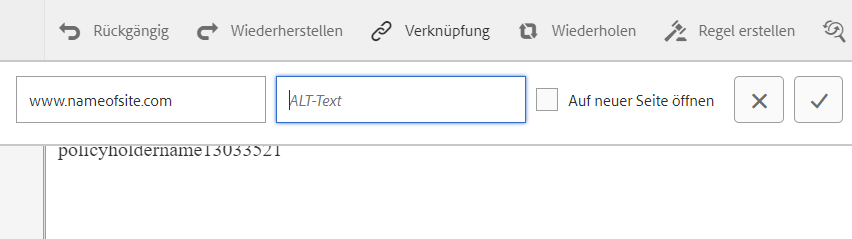

#### Text suchen und ersetzen {#searching-and-replacing-text}

Wenn Sie mit Textelementen arbeiten, die einen großen Textkörper enthalten, müssen Sie nach einer bestimmten Textzeichenfolge suchen. Möglicherweise müssen Sie auch eine bestimmte Textzeichenfolge durch eine alternative Zeichenfolge ersetzen.

Mithilfe der Funktion „Suchen und Ersetzen“ können Sie nach jeder beliebigen Zeichenfolge in einem Textelement suchen und diese ersetzen. Die Funktion umfasst außerdem eine leistungsstarke Suche nach regulären Ausdrücken.

#### Suchen nach Text in einem Textmodul {#to-search-text-in-a-text-module}

1. Öffnen Sie das Textmodul im Texteditor.

1. Tippen Sie auf „Suchen und Ersetzen“.
1. Geben Sie den zu suchenden Text in das Textfeld „Suchen“ ein und klicken Sie auf „Suchen“. Der gesuchte Text wird im Textmodul hervorgehoben.
1. Um nach der nächsten Instanz des Textes zu suchen, drücken Sie erneut die Taste Suchen .

   Wenn Sie weiter auf die Schaltfläche „Suchen“ klicken, wird die Suche nach unten fortgesetzt. Nachdem die letzte Instanz des Textes gefunden wurde, zeigt die Meldung **Das erreichte Ende des Moduls** an, dass keine weiteren Suchergebnisse gefunden wurden.

   Wenn allerdings keine Instanz des gesuchten Texts im Textmodul gefunden wird, lautet die angezeigte Meldung: **Übereinstimmung nicht gefunden**.

1. Wenn Sie erneut auf „Suchen“ klicken, wird die Suche am Anfang der Seite fortgesetzt.

#### Suchoptionen {#search-options}

**Groß-/Kleinschreibung berücksichtigen:** Die Suche gibt nur Ergebnisse mit derselben Groß-/Kleinschreibung zurück.

**Ganzes Wort:** Die Suche gibt nur ganze Wörter zurück.

>[!NOTE]
>
>Wenn Sie Sonderzeichen in das Textfeld &quot;Suchen&quot;eingeben, ist die Option &quot;Ganzes Wort&quot;deaktiviert.

**Reguläre Ausdrücke:** Suche mit regulären Ausdrücken. Beispielsweise kann mithilfe des folgenden regulären Ausdrucks nach E-Mail-Adressen in einem Textelement gesucht werden:

`[a-zA-Z0-9._%+-]+@[a-zA-Z0-9.-]+\.[a-zA-Z]{2,4}`

#### Suchen und Ersetzen von Text in einem Textmodul {#to-search-and-replace-text-in-a-text-module}

1. Öffnen Sie das Textmodul im Texteditor.
1. Tippen Sie auf „Suchen und Ersetzen“.
1. Geben Sie den zu suchenden Text in das Textfeld „Suchen“ ein und geben Sie den Text ein, der den gefundenen Text ersetzen soll. Klicken Sie auf „Ersetzen“.
1. Wenn der zu suchende Text gefunden wird, wird der Text durch den Ersetzungstext ersetzt.

   * Wenn eine andere Instanz des gesuchten Texts gefunden wird, wird diese Instanz im Textmodul hervorgehoben. Wenn Sie erneut auf „Ersetzen“ klicken, wird die hervorgehobene Instanz ersetzt und der Cursor bewegt sich weiter, falls eine dritte Instanz gefunden wird.
   * Wenn keine andere Instanz gefunden wird, hält der Cursor an der zuletzt ersetzten Instanz an.

1. Wenn Sie erneut auf „Suchen“ klicken, wird die Suche am Anfang der Seite fortgesetzt.

   Verwenden Sie die Option „Alle ersetzen“, um alle Instanzen des Texts im Textmodul zu ersetzen. Wenn Sie dies tun, wird die Anzahl der Ersetzungen als Meldung im Dialogfeld Suchen und Ersetzen angezeigt.

#### Bewährte Methoden/Tipps und Tricks für Textmodule{#best-practices-tips-and-tricks-for-text-modules} 

* Halten Sie konsequent eine Benennungskonvention ein, um Dopplungen zu vermeiden.
* Nutzen Sie in den Textmodulen die jeweils geeignete Verknüpfung mit dem Datenwörterbuch.
* Es gelten folgende Regeln, wenn Sie den Texteditor zur Änderung von Textelementen verwenden:

   * **Variablen hinzufügen:** Zulässig
   * **Variablen entfernen:** Zulässig
   * **Eigenschaften aktualisieren:** Zulässig
   * **Datenwörterbuch ändern:** Zulässig, solange das Datenwörterbuchelement nicht verwendet wird. Bei einer Aktualisierung kann das Datenwörterbuch nicht geändert werden.

## Liste {#list}

Eine Liste ist eine Gruppe von Dokumentfragmenten, einschließlich Text, (anderen) Listen, Bedingungen und Bildern. Die Reihenfolge der Listenelemente kann festgelegt sein oder bearbeitet werden. Beim Erstellen eines Briefs können Sie einige oder alle Listenelemente verwenden, um ein wiederverwendbares Muster von Elementen zu replizieren. Listen verhalten sich im Wesentlichen als Ziele, die in anderen Zielen verschachtelt werden können.

### Listen implementieren {#implementing-lists}

Das Implementieren von Listen besteht aus zwei Schritten:

1. Festlegen von Kerneigenschaften wie Name, Beschreibung oder Datenwörterbuch.
1. Auswählen des Inhalts, der Teil der Liste ist, und dann Festlegung der Eigenschaften wie Sperrungsreihenfolge und Bibliothekszugriff für die Liste.

### Eine Liste erstellen {#create-a-list}

Eine Liste ist eine Gruppe verwandter Inhalte, die in einer Briefvorlage als zusammenhängende Einheit verwendet werden kann. Einer Liste kann jede Art von Inhalt hinzugefügt werden. Listen können auch verschachtelt sein. Listenmodule können wie folgt angegeben werden:

* **SORTIERT**: Die Sortierreihenfolge kann zum Zeitpunkt der Korrespondenzerstellung nicht geändert werden.
* **Bibliothekszugriff**: Benutzer können der Liste Module hinzufügen. Dieses Flag gibt an, ob der Bibliothekszugriff aktiviert ist. Ist dieser aktiviert (geöffnet), kann der Benutzer der Liste Module hinzufügen, während er den Brief in der Vorschau anzeigt.
* Bei der Erstellung der Liste können Sie eine Art angeben, zum Beispiel:
* **Einfach**: Auf die Liste wird keine weitere Stilformatierung angewendet.
* **Mit Aufzählungszeichen**: Eine mit einfachen Aufzählungszeichen formatierte Liste.
* **Mit Zahlen**: Eine numerische Liste mit der Zahlenformatierung „Standard“ (1,2,...), „Groß-Römisch“ (I, II, ...) oder „Klein-Römisch“ (i, ii,...).
* **Mit Buchstaben**: Eine alphabetische Liste mit der Buchstabenformatierung Kleinbuchstaben (a, b,…) oder Großbuchstaben (A, B,…).
* **Benutzerdefiniert**: Sie können beliebige Zahlen-/Buchstabentypen sowie Präfix- und Suffixwerte Ihrer Wahl erstellen

1. Wählen Sie **Formulare** > **Dokumentfragmente**.

1. Wählen Sie **Erstellen** > **Liste**.

1. Geben Sie folgende Informationen für die Liste an:

   * **Titel (Optional):** Geben Sie den Titel für die Liste ein. Titel müssen nicht eindeutig sein und dürfen Sonderzeichen und nichtenglische Zeichen enthalten. Listen werden durch ihren Titel (sofern verfügbar) wie z. B. in Miniaturen und Asset-Eigenschaften referenziert.
   * **Name:** Der eindeutige Name der Liste. Es ist nicht möglich, dass zwei Elemente (Text, Bedingung oder Liste) mit demselben Namen vorhanden sind, ungeachtet ihres jeweiligen Status. Im Feld „Name“ können Sie nur englische Sprachzeichen, Zahlen und Bindestriche eingeben. Das Feld „Name“ wird automatisch mit dem Wert im Feld „Titel“ ausgefüllt. Die im Feld Titel eingegebenen Sonderzeichen, Leerzeichen, Zahlen und nicht englischen Zeichen werden im Feld Name durch Bindestriche ersetzt. Obwohl der Wert im Feld „Titel“ automatisch in das Feld „Name“ kopiert wird, können Sie den Wert bearbeiten.
   * **Beschreibung (Optional)**: Geben Sie eine Beschreibung des Assets ein.
   * **Datenwörterbuch (optional)**: Wählen Sie optional das Datenwörterbuch aus, mit dem eine Verbindung hergestellt werden soll. Es können nur Elemente der Liste hinzugefügt werden, die das gleiche Datenwörterbuch verwenden wie die Liste oder denen kein Datenwörterbuch zugewiesen ist. Einer Liste ein Datenwörterbuch zuzuweisen, erleichtert es dem Ersteller einer Briefvorlage, die passende Liste zu finden.
   * **Tags (optional)**: Wählen Sie die anzuwendenden Tags aus. Sie können auch den Namen eines neuen Tags eingeben und ihn erstellen. (Das neue Tag wird erstellt, wenn Sie auf **Speichern** tippen.)

1. Tippen Sie auf **Weiter**.
1. Tippen Sie auf **Asset** hinzufügen.
1. Um Assets zur Liste hinzuzufügen, wählen Sie sie auf der Seite &quot;Assets auswählen&quot;aus und tippen Sie auf **Fertig**.

   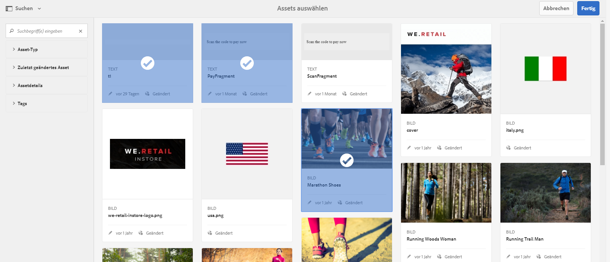

1. Die Assets werden der Seite „Listenelemente“ hinzugefügt.
Um die Reihenfolge der Assets in der Liste zu ändern, tippen Sie auf das Pfeilsymbol (  ) und ziehen Sie per Drag-and-Drop. Wenn der Benutzer auf der Benutzeroberfläche „Korrespondenz erstellen“ eine Briefvorlage öffnet, wird der Inhalt in der hier festgelegten Reihenfolge zusammengestellt.

   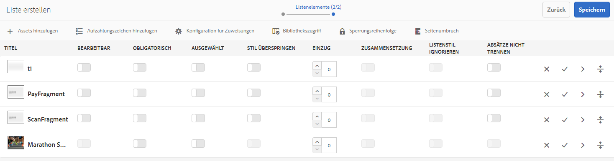

1. Sie können mit Hilfe der folgenden Optionen festlegen, wie sich die Liste in der CCR-Benutzeroberfläche verhält:

   * **Bibliothekszugriff**: Um den Bibliothekszugriffs zum Hinzufügen von Assets zu aktivieren, tippen Sie auf „Bibliothekszugriff“. Wenn der Bibliothekszugriff aktiviert ist, kann der Schadensregulierer der Liste weitere Inhalte hinzufügen. Andernfalls muss sich der Schadensregulierer auf die Inhalte beschränken, die Sie für die Liste definiert haben.
   * **Reihenfolgesperren**: Zum Sperren der Reihenfolge der Assets in der Liste, sodass der Schadensregulierer sie nicht ändern kann, tippen Sie auf „Reihenfolge sperren“. Wenn Sie diese Option nicht aktivieren, kann der Schadensregulierer die Reihenfolge der Listenelemente ändern.

   * **Aufzählungszeichen hinzufügen**: Verwenden Sie diese Option, um dem Modul einen Aufzählungs- oder Nummerierungsstil hinzuzufügen. Sie können entweder einen vorgefertigten oder einen benutzerdefinierten Listenstil verwenden. Sie können auch den vor und nach jedem der Listenelemente anzuzeigenden Text festlegen.
   * **Seitenumbruch**: Wählen Sie diese Option (  ) aus, um zwischen den Listeninhalten einen Seitenumbruch hinzuzufügen. Wenn diese Option nicht ausgewählt ist ( ) und der Listeninhalt über die nächste Seite hinausfließt, wird die gesamte Liste auf die nächste Seite verschoben, anstatt auf der Seite zwischen der Liste zu wechseln.

   * **Zuweisungskonfiguration**: Verwenden Sie diese Option, um die Mindest- und Höchstanzahl der zur Liste hinzufügbaren Assets festzulegen.

1. Sie können mit Hilfe der folgenden Optionen festlegen, wie sich jedes Element in der Liste zur Laufzeit verhält:

   * **Bearbeitbar:** Wenn diese Option aktiviert ist, kann der Inhalt in der Benutzeroberfläche „Korrespondenz erstellen“ bearbeitet werden. (Diese Option ist nicht für Listen- und Bildmodule verfügbar.)
   * **Obligatorisch:** Wenn diese Option aktiviert ist, ist der Inhalt in der Benutzeroberfläche „Korrespondenz erstellen“ erforderlich.
   * **Ausgewählt:** Wenn diese Option aktiviert ist, ist der Inhalt der Benutzeroberfläche „Korrespondenz erstellen“ vorab ausgewählt.
   * **Stil überspringen:** Wenn diese Option aktiviert ist, werden Aufzählungszeichen und Nummerierungen in der Benutzeroberfläche „Korrespondenz erstellen“ übersprungen. (Diese Option steht für Bildmodule nicht zur Verfügung. Außerdem kann von den Optionen „Stil überspringen“, „Zusammengesetzte Nummerierung“ und „Listenstil ignorieren“ immer nur eine auf ein Modul angewendet werden. Eine dieser Optionen kann für ein Modul verwendet werden, wenn Sie die Option „Aufzählungszeichen hinzufügen“ für ein Modul auswählen.)
   * **Einzug:** Sie können den Einzug von allen Modulen/Inhalten ändern, die als Teil der Liste ausgewählt wurden. Einzüge werden in Form von Ebenen angegeben (beginnend bei null), wobei jede Einzugsebene einer Auffüllung von 36 pt entspricht.
   * **Zusammengesetzte Nummerierung:** Wenn diese Option aktiviert ist, wird die zusammengesetzte Nummerierung als eine Kombination des Stils der äußeren (übergeordneten) Liste und des eigenen Stils verwendet. Die zusammengesetzte Nummerierung in dieser verschachtelten Liste beruht auf der Position, an der sich diese verschachtelte Liste in der Reihenfolge der äußeren Liste befindet.
   * **Listenstil ignorieren:** Wenn die Option „Zusammengesetzte Nummerierung“ nicht aktiviert ist, dann ist die Option „Listenstil ignorieren“ aktiviert. Durch die Aktivierung dieser Option wird der eigene Stil der verschachtelten Liste ignoriert und die Nummerierung der äußeren Liste wird fortgesetzt. Deshalb werden die Module der verschachtelten Liste als Teil der äußere Liste selbst behandelt, ungeachtet der Stile, die für die verschachtelte Liste angegeben sind. Wenn die Option Listenstil ignorieren für eine verschachtelte Liste deaktiviert ist, haben die Module, die Teil der verschachtelten Liste sind, ihren je eigenen Nummerierungsstil.
   * **Nächste beibehalten:** Legt den Seitenumbruch für die in einer Liste enthaltenen Assets fest. Wenn Sie die Eigenschaft „Nächste beibehalten“ eines Elements einer Liste auf **Ein** festlegen, werden dieses Element und das nächste auf derselben Seite angezeigt. Dies bedeutet, dass die Inhalte des ausgewählten Elements und des nächsten Elements nur auf einer Seite angezeigt werden.

1. Tippen Sie auf **Speichern**.

### Richtlinien/Tipps und Tricks {#best-practices-tips-and-tricks}

* Halten Sie konsequent eine Benennungskonvention ein, um Dopplungen zu vermeiden.
* Nutzen Sie die jeweils geeignete Verknüpfung mit dem Datenwörterbuch.
* Die folgenden Regeln gelten, wenn Sie zum Ändern einer Liste den Listeneditor verwenden:

   * Eigenschaften aktualisieren: Zulässig
   * **Ändern des Datenwörterbuchs:** Zulässig, solange kein Element, das das Datenwörterbuch verwendet, damit verknüpft ist. Bei einer Aktualisierung kann das Datenwörterbuch nicht geändert werden.

## Bedingungen {#conditions}

Mit Hilfe von Bedingungen können Sie festlegen, welche Inhalte zum Zeitpunkt der Dokumenterstellung je nach den bereitgestellten Daten in das Schriftstück bzw. den Brief einbezogen werden sollen. Die Beschreibung der Bedingung beruht auf Steuerungsvariablen. Beim Hinzufügen einer Bedingung haben Sie die Möglichkeit, ein Asset einzubeziehen, das auf dem Wert beruht, den die Steuerungsvariable hat.

Basierend auf den von Ihnen gewählten Optionen wird entweder nur der erste Ausdruck, der „true“ ergibt, basierend auf der aktuellen Bedingungsvariablen ausgewertet oder die gesamte Bedingung. Wenn sie den Brief in „Korrespondenz erstellen“ (CCR) füllen, verhalten sich Bedingungen wie „weiße Kästchen“. Wenn die Bedingung zu einer Liste führt, werden alle obligatorischen und vorab ausgewählten Elemente der Liste ausgegeben. Wenn eines dieser Elemente wiederum eine Bedingung oder eine Liste ist, wird der sich daraus ergebende Inhalt als einfache Liste von Text- und Bildinhalten ebenfalls ausgegeben, und zwar sortiert von oben nach unten, wobei untergeordnete Komponenten jeweils vorrangig ausgelesen werden. Die Resultate einer Bedingung können von beliebigem Typ sein (Text, Liste, Bedingung oder Bild).

### Bedingungen implementieren  {#implementing-conditions}

Der Bedingungseditor verfügt über eine [Expression Builder](/help/forms/using/expression-builder.md)-Benutzeroberfläche, die das Erstellen von Ausdrücken mithilfe mehrerer Platzhalter und Datenwörterbuchelemente unterstützt. Sie können allgemeine Operanden und die lokalen oder globalen Funktionen in diesen Ausdrücken verwenden. Jedem Ausdruck kann ein Inhalt zugeordnet werden, und optional kann es einen Standardabschnitt geben, wenn keiner der Ausdrücke „true“ ergibt. Alle Ausdrücke werden in der Reihenfolge ausgewertet, in der sie definiert werden, und der erste Ausdruck, der „true“ zurückgibt, wird ausgewählt, und sein zugeordneter Inhalt wird von diesem Bedingungsmodul zurückgegeben.

Beispiel: Wenn der Text für die allgemeinen Geschäftsbedingungen in einem Brief sich je nach dem Bundesstaat, in dem der Kunde ansässig ist, ändert und das Datenwörterbuch ein Element mit der Bezeichnung „state“ enthält, könnten Sie eine Bedingung wie die folgende hinzufügen: • state = NY, select T&amp;C_NY text paragraph • state = NC, select T&amp;C_NC text paragraph

Im Bedingungseditor haben Sie die Möglichkeit, eine Standardbedingung anzugeben. Wenn der Wert der Steuerungsvariablen mit keiner der Bedingungen übereinstimmt, wird der mit der Standardbedingung verknüpfte Inhalt verwendet. Im Rahmen des oben genannten Beispiel ließe sich folgende Bedingungszeile hinzufügen:
• Default, select T&amp;C_Rest

### Erstellen einer Bedingung {#create-a-condition}

1. Wählen Sie **Formulare** > **Dokumentfragmente**.
1. Wählen Sie **Erstellen > Bedingung**.
1. Geben Sie folgende Informationen für die Liste an:

   * **Titel (optional):** Geben Sie den Titel für die Bedingung ein. Titel müssen nicht eindeutig sein und dürfen Sonderzeichen und nichtenglische Zeichen enthalten. Bedingungen werden durch ihren Titel (falls verfügbar) wie etwa in Miniaturen und Asset-Eigenschaften referenziert.
   * **Name:** Der eindeutige Name der Bedingung. Es ist nicht möglich, dass zwei Elemente (Text, Bedingung oder Liste) mit demselben Namen vorhanden sind, ungeachtet ihres jeweiligen Status. Im Feld „Name“ können Sie nur englische Sprachzeichen, Zahlen und Bindestriche eingeben. Das Feld „Name“ wird automatisch basierend auf dem Feld „Titel“ ausgefüllt. Die im Feld Titel eingegebenen Sonderzeichen, Leerzeichen, Zahlen und nicht englischen Zeichen werden im Feld Name durch Bindestriche ersetzt. Obwohl der Wert im Feld „Titel“ automatisch in das Feld „Name“ kopiert wird, können Sie den Wert bearbeiten.
   * **Beschreibung (Optional)**  Geben Sie eine Beschreibung der Bedingung ein.
   * **Datenwörterbuch (optional)**: Wählen Sie optional das Datenwörterbuch aus, mit dem eine Verbindung hergestellt werden soll. Es können nur Elemente der Liste hinzugefügt werden, die das gleiche Datenwörterbuch verwenden wie die Bedingung oder denen kein Datenwörterbuch zugewiesen ist. Einer Liste ein Datenwörterbuch zuzuweisen, erleichtert es dem Ersteller einer Briefvorlage, die passende Bedingung zu finden.
   * **Tags (optional)**: Wählen Sie optional die Tags aus, die angewendet werden sollen. Sie können auch den Namen eines neuen Tags eingeben und ihn erstellen. (Das neue Tag wird erstellt, wenn Sie auf **Speichern** tippen.)

1. Tippen Sie auf **Weiter**.
1. Tippen Sie auf **Asset** hinzufügen.
1. Um der Bedingung ein Asset hinzuzufügen, wählen Sie es auf der Seite &quot;Assets auswählen&quot;aus und tippen Sie auf **Fertig**. Die Assets werden dem Bereich „Ausdruck“ hinzugefügt.
1. Sie können mithilfe der folgenden Optionen festlegen, wie sich die Bedingung zur Laufzeit verhält:

   * **Auswertung mehrerer Ergebnisse deaktivieren/Auswertung mehrerer Ergebnisse aktivieren**: Wenn diese Option aktiviert ist (angezeigt als „Auswertung…aktivieren”), werden alle Bedingungen ausgewertet und das Ergebnis ist die Summe aller Bedingungen, die den Status „true“ haben. Wenn diese Option deaktiviert ist (angezeigt als „Auswertung...deaktivieren“), wird nur die erste Bedingung, die „true“ ergibt, ausgewertet und wird zur Ausgabe der Bedingung.
   * **Seitenumbruch**: Wählen Sie diese Option (  ) aus, um zwischen den Modulen der Bedingungen einen Seitenumbruch hinzuzufügen. Wenn diese Option nicht ausgewählt ist ( ) und eine Bedingung über die nächste Seite hinausfließt, wird die gesamte Bedingung auf die nächste Seite verschoben, anstatt auf der Seite zwischen der Bedingung umzubrechen.

1. Um die Reihenfolge der Assets innerhalb der Bedingung zu ändern, tippen und halten Sie das Pfeilsymbol (  ) gedrückt und ziehen Sie per Drag-and-Drop. Wenn der Benutzer auf der Benutzeroberfläche „Korrespondenz erstellen“ eine Briefvorlage öffnet, wird der Inhalt in der hier festgelegten Reihenfolge zusammengestellt.
1. Tippen Sie auf **Löschen**, um die Zeile zu löschen. Wenn Sie für die Standardzeile auf „Löschen“ tippen, werden nur die Asset-Informationen gelöscht.
1. Tippen Sie auf **Kopieren** , um eine Zeile zu duplizieren.
1. Tippen Sie auf **Bearbeiten** , um das Asset zu ändern oder den Ausdruck zu bearbeiten.

   Weiter:

   * Um das Asset zu aktualisieren, tippen Sie unter der Spalte „Asset“ auf das Ordnersymbol.
   * Um den Expression Builder zum Einfügen eines Ausdrucks zu öffnen, tippen Sie unter der Spalte „Ausdruck“ auf das Ordnersymbol. Weitere Informationen zum Expression Builder finden Sie unter [Expression Builder](/help/forms/using/expression-builder.md).

### Richtlinien/Tipps und Tricks {#best-practices-tips-and-tricks-1}

* Halten Sie zur Vereinfachung der Suche und zur Vermeidung von Duplizierung konsequent eine Benennungskonvention ein.
* Bedingungen verhalten sich wie „case“-Anweisungen, daher ist die Reihenfolge der Bedingungen wichtig. Die erste Übereinstimmung wird zurückgegeben.
* Nutzen Sie die jeweils geeignete Verknüpfung mit dem Datenwörterbuch.
* Es gelten folgende Regeln, wenn Sie den Bedingungseditor zum Bearbeiten von Bedingungen verwenden:

   * **Variablen hinzufügen:** Zulässig
   * **Variablen entfernen:** Zulässig
   * **Eigenschaften aktualisieren:** Zulässig
   * **Datenwörterbuch ändern:** Zulässig, solange das Datenwörterbuchelement nicht verwendet wird.

## Layout-Fragmente {#layoutfragments}

Ein Layout-Fragment basiert auf der XDP-Datei, die in Designer erstellt wurde. Zum Erstellen von Layout-Fragmenten müssen Sie die XDPs erstellen und sie [auf Forms hochladen](/help/forms/using/import-export-forms-templates.md).

Ein oder mehrere Layout-Fragment(e) können Teil eines Briefs darstellen und das grafische Layout dieser Teile definieren. Ein Layout-Fragment kann typische Formularfelder wie „Adresse“ und „Referenz“ sowie leere Unterformulare, die Zielbereiche kennzeichnen, enthalten. Darüber hinaus können Sie mit Layout-Fragmenten Tabellen erstellen und sie in Briefe einfügen.

Ein gängiger Anwendungsfall besteht darin, wiederverwendbare Layout-Muster in Briefen zu suchen und Layout-Fragmente dafür zu erstellen. Beispiel: Anrede, Adresse und Betreff eines Briefs kommen in derselben Reihenfolge in mehreren Briefen vor. Ein weiteres Beispiel könnte eine Tabelle mit immer ähnlicher Anzahl von Zeilen und Spalten sein, die in mehreren Briefen verwendet wird.

Sie können ein Layout-Fragment basierend auf einer vorhandenen XDP erstellen. Ein Layout-Fragment kann entweder aus Feldern und Zielbereichen oder aus mindestens einer Tabelle bestehen. Die Tabellen in einem Layout können statisch oder dynamisch sein. Eine XDP wird in Designer erstellt und [auf AEM Forms hochgeladen](/help/forms/using/import-export-forms-templates.md). Eine XDP kann die Struktur eines Layout-Fragments oder die Struktur eines Briefs bilden. Weitere Informationen zu [Layout-Design](/help/forms/using/layout-design-details.md).

Wenn Sie Fragmente verwenden, die mit Zielbereichen verbunden sind, kann der Brief zum Zeitpunkt des Verfassens geändert werden. Es können Layout-Fragmente mit verschiedenen Abmessungen erstellt werden und das geeignete Fragment kann mit dem Zielbereich verbunden werden. Layout-Fragmente ermöglichen Ihnen außerdem, einige Tabelleneigenschaften anzupassen:

1. Sie können die Zeilen- und Spaltenanzahl erhöhen.
1. Sie können den Kopf- und Fußzeilentext für weitere Zeilen und Spalten angeben.
1. Sie können das Verhältnis der Tabellenspaltenbreite definieren. Zur Laufzeit wird die Größe der Tabellenspalten gemäß dem definierten Verhältnis und dem verfügbaren Platz angepasst. Das Breitenverhältnis muss in der Summe 100 betragen. Andernfalls ist es nicht gültig.
1. Falls eine Tabelle ein Platzhalter ist (enthält nur eine einzige leere Zelle), können Sie den Typ (Zielbereich/-feld) der neuen Spalten definieren.
1. Sie können Kopf- und Fußzeilen ausblenden.

Bevor Sie dieses Verfahren durchführen, erstellen Sie mit Hilfe von Designer ein. Das Fragment kann Tabellen zur Organisation von Feldern und Zielbereichen enthalten. Designer ermöglicht die Erstellung zweier Tabellentypen: statisch und dynamisch. Statische Tabellen enthalten eine feste Anzahl Zeilen. Statische Tabellen können Zielbereiche und -felder enthalten. Diese Zielbereiche und -felder können nicht an wiederholende DDEs gebunden werden. Eine dynamische Tabelle kann auch eine einzelne Zeile aufweisen. Die an Tabellenzellen gebundenen Daten bestimmen die Anzahl der Zeilen für dynamische Tabellen. Eine dynamische Tabelle kann ausschließlich Felder enthalten. DDEs können wiederholend oder nicht wiederholend sein.

Berücksichtigen Sie folgende Punkte beim Entwickeln von Tabellen:

1. Tabellen können zum Zeitpunkt der Layout-Fragmenterstellung angepasst werden. Die Option zum Anpassen ist allerdings nur verfügbar, wenn das übergeordnete Unterformular der Tabelle fließend ist.
1. Für dynamische Tabellen verwenden alle Felder, wiederholbaren Zeilen und Tabellen die Bindung „Name verwenden“ für die ordnungsgemäße Datenzusammenführung.
1. Für dynamische Tabellen sind alle wiederholenden DDEs, die an die Tabellenfelder gebunden sind, Teil der gleichen Hierarchie. Für nicht wiederholende DDEs gibt es keine solche Einschränkung.
1. Zum Zeitpunkt der Zusammenführung des Layout-Fragments und des übergeordneten Zielbereichs wird die Größe der Tabellen gemäß dem verfügbaren Platz angepasst. Die Größenänderung findet allerdings nur statt, wenn das Layout-Fragment keinen Zielbereich und kein Zielfeld direkt im Unterformular der obersten Ebene enthält. Zielbereiche und -felder innerhalb einer Tabelle sind nicht zulässig.
1. Sie können Platzhaltertabellen erstellen. Platzhaltertabellen enthalten nur eine einzige leere Zelle.

* Für Platzhaltertabellen können Sie folgende Eigenschaften zum Zeitpunkt der Fragmenterstellung anpassen.

   * Zeilenanzahl
   * Spaltenanzahl
   * Kopf- und Fußzeile für die einzelnen Spalten
   * Typ (Zielbereich/-feld) der einzelnen Spalten
   * Breitenverhältnis der einzelnen Spalten

* Für eine Nicht-Platzhaltertabelle können Sie folgende Eigenschaften anpassen:

   * Zeilenanzahl
   * Spaltenanzahl
   * Kopf- und Fußzeile für zusätzliche Spalte
   * Breitenverhältnis der einzelnen Spalten

Sie können Fragmente in einem Brief verschachteln. Dies bedeutet, dass Sie ein Fragment innerhalb eines Fragments hinzufügen können. Die Correspondence Management-Lösung unterstützt bis zu vier Verschachtelungsebenen in einem Brief: **Letter**->**Fragment**->**Fragment**->**Fragment**->**Fragment**

Ein detailliertes Beispiel für die Verwendung von statischen und dynamischen Tabellen in Layout-Fragmenten finden Sie unter [Beispiel mit Beispieldateien: Verwendung statischer und dynamischer Tabellen in einem Brief](#examplewithsamplefiles).

### Layout-Fragment erstellen {#creating-a-layout-fragment}

1. Wählen Sie **Erstellen** > **Layout-Fragment**.
1. Correspondence Management zeigt die verfügbaren XDP-Dateien an. Wählen Sie die XDP aus, auf der das Layout-Fragment basieren soll, und tippen Sie auf **Weiter**.
1. Geben Sie folgende Informationen für das Layout an:

   * **Titel (Optional):** Geben Sie den Titel für das Layout-Fragment ein. Titel müssen nicht eindeutig sein und dürfen Sonderzeichen und nichtenglische Zeichen enthalten. Layout-Fragmente werden durch ihren Titel (sofern verfügbar) wie z. B. in Miniaturen und Asset-Eigenschaften referenziert.
   * **Name:** Der eindeutige Name für das Layout-Fragment. Es ist nicht möglich, dass zwei Elemente (Text, Bedingung oder Liste) mit demselben Namen vorhanden sind, ungeachtet ihres jeweiligen Status. Im Feld „Name“ können Sie nur englische Sprachzeichen, Zahlen und Bindestriche eingeben. Das Feld „Name“ wird automatisch basierend auf dem Feld „Titel“ ausgefüllt. Die im Feld Titel eingegebenen Sonderzeichen, Leerzeichen, Zahlen und nicht englischen Zeichen werden im Feld Name durch Bindestriche ersetzt. Obwohl der Wert im Feld „Titel“ automatisch in das Feld „Name“ kopiert wird, können Sie den Wert bearbeiten. Dieser Name wird in der Liste in der Benutzeroberfläche &quot;Assets verwalten&quot;angezeigt.
   * **Beschreibung (Optional)**: Beschreibung, die in der Liste auf der Benutzeroberfläche &quot;Assets verwalten&quot;angezeigt wird.
   * **Tags (optional)**: Wählen Sie optional die Tags aus, die auf die Bedingung angewendet werden sollen. Sie können auch den Namen eines neuen Tags eingeben und ihn erstellen.

1. Tippen Sie auf die Registerkarte **Tabelle** und geben Sie die folgenden Informationen für das Layout an:

   * **Konfiguration für**: Wählen Sie die zu konfigurierende Tabelle aus. Als Suffix des Tabellennamens in der Dropdown-Liste ist (Statisch) , wenn die Tabelle statisch ist, oder (Dynamisch), wenn es sich bei der Tabelle um eine dynamische Tabelle handelt. Statische Tabellen enthalten eine feste Anzahl Zeilen. Statische Tabellen können Zielbereiche und -felder enthalten. Diese Zielbereiche und -felder können nicht an wiederholende DDEs gebunden werden. Die an Tabellenzellen gebundenen Daten bestimmen die Anzahl der Zeilen für dynamische Tabellen.

   * **Zeilen**: Wählen Sie die Anzahl der Zeilen für das Layout aus. Die konfigurierte Zeilenanzahl muss größer oder gleich der ursprünglichen Zeilenanzahl sein.
   * **Spalten**: Wählen Sie die Anzahl der Spalten für das Layout aus. Die konfigurierte Spaltenanzahl muss größer oder gleich der ursprünglichen Spaltenanzahl sein.

   Für jede Spalte sind folgende Details erforderlich:

   * **Kopfzeile**: für die Kopfzeile anzuzeigender Text
   * **Fußzeile**: für die Fußzeile anzuzeigender Text
   * **Typ**: Typ der zusätzlichen Spalte. Feld- oder Zielbereich Der Typ ist für statische Platzhaltertabellen aktiviert. Der Typ kann auf Spaltenebene definiert werden, nicht auf Zellenebene. Alle Zellen in einer erweiterten Spalte sind vom gleichen Typ. Für eine dynamische Tabelle haben alle Spalten den Typ „Feld“. Für Nicht-Platzhaltertabellen können Sie den Typ der zusätzlichen Spalten nicht definieren. In diesem Fall ist der Typ der zusätzlichen Zellen in einer erweiterten Spalte identisch mit dem Typ der letzten Spalte in dieser Zeile. Der Typ der Zelle in der zusätzlichen Zeile ist identisch mit dem Typ der letzten Zelle in dieser Spalte.
   * **Breitenverhältnis**: Verhältnis der Tabellenspaltenbreiten.

   Ein detailliertes Beispiel für die Verwendung von statischen und dynamischen Tabellen in Layout-Fragmenten finden Sie unter [Beispiel mit Beispieldateien: Verwendung statischer und dynamischer Tabellen in einem Brief](#examplewithsamplefiles).

1. Tippen Sie auf **Speichern**.

### Laden Sie die XDP auf Correspondence Management hoch{#upload-an-xdp-to-correspondence-management} 

Anweisungen zum Hochladen/Importieren einer XDP auf Correspondence Management finden Sie unter [Importieren und Exportieren von Assets in AEM Forms](/help/forms/using/import-export-forms-templates.md).

### Richtlinien/Tipps und Tricks  {#best-practices-tips-and-tricks-2}

#### Standardbindung für Unterformulare einrichten {#set-the-default-subform-binding}

Bei der Erstellung von Zielbereichen in Designer ist es hilfreich, die Standardbindung für alle neuen Unterformulare auf „Ohne“ einzustellen.

So legen Sie die Standardbindung fest:

1. Tippen Sie in Designer auf **Tools** > **Optionen** > **Datenbindungen** > **Teilformularbindung**.

1. Wählen Sie in der Liste „Standardbindung für neue Unterformulare“ die Option **Keine Datenbindung** aus.

Dadurch stellen Sie sicher, dass für Unterformulare, die Sie mit dem Befehl „Einfügen“ > „Unterformular“ oder per Drag &amp; Drop aus der Objektpalette einfügen, die Bindungsmethode standardmäßig auf „Ohne“ eingestellt ist. Dadurch ist ein neues Unterformular standardmäßig ein Zielbereich, außer Sie fügen Inhalte hinzu, ändern die Bindungseinstellung oder fügen das Suffix „_int“ an den Namen des Unterformulars an.

#### Konformität mit Abschnitt 508 {#section-compliance}

Wenn ein auf der Benutzeroberfläche „Korrespondenz erstellen“ erstellter Brief in einem späteren Workflow-Schritt mit Daten gefüllt wird, halten Sie sich bei der Erstellung des Layouts an folgende Empfehlungen in Bezug auf Abschnitt 508. Andernfalls dient die PDF-Datei des Briefes der Anzeige und Sie können diese Empfehlungen ignorieren:

* Alle als Zielbereich fungierenden Unterformulare und alle Felder in einem Layout haben eine Aktivierreihenfolge.
* Felder mit Beschriftungen sind standardmäßig mit Abschnitt 508 konform. Das Feldattribut /field/assist/speak@priority ist standardmäßig auf „custom“ gesetzt, d. h. sofern kein benutzerdefinierter Text für eine Bildschirmlesehilfe bereitgestellt wird, liest die Bildschirmlesehilfe die Beschriftung des Feldes.
* Legen Sie bei Feldern ohne Beschriftungen eine QuickInfo fest und weisen Sie Bildschirmlesehilfen an, die QuickInfo zu lesen, indem Sie

`/field/assist/speak@priority="toolTip"` und geben Sie QuickInfo-Text in  `/field/assist/toolTip`an.

#### Datumsformate in Designer und Asset Configuration Manager {#date-formats-in-designer-and-asset-configuration-manager}

Stellen Sie beim Entwerfen eines Layouts in Designer sicher, dass die Formate für Datumsfelder mit den Datumsanzeigeformaten in den [Correspondence Management-Konfigurationseigenschaften](/help/forms/using/cm-configuration-properties.md) übereinstimmen. Weitere Informationen finden Sie unter „Feldwerte formatieren und Muster verwenden“ in der Designer-Hilfe.

#### Datumsbereiche erfassen  {#capturing-date-ranges}

Wenn eine Datumskombination einzufügen ist, z. B. „startDate“ bis „endDate“, verwenden Sie ein einzelnes Unterformular, um eine korrekte Ausrichtung im endgültigen Brief sicherzustellen und die Anzahl der Felder möglichst gering zu halten.

#### Bindungen auf Formularebene festlegen  {#setting-form-level-binding}

Wenn ein Layout viele Felder und Zielbereiche enthält, die einzelnen XML-Elementen zugeordnet sind, verwenden Sie die Bindung auf Formularebene und erstellen Sie einen separaten Knoten für jedes Element. Auf Formularebene verknüpfte Felder werden bei der Zuordnung von Daten in Correspondence Management ignoriert.

#### Auf Masterseiten keine Unterformulare als Zielbereiche verwenden  {#do-not-use-subform-target-areas-in-a-master-page}

Unterformulare als Zielbereiche auf einer Masterseite sind auf der Benutzeroberfläche „Elemente verwalten“ nicht sichtbar, sodass ihnen keine Daten zugeordnet werden können.

#### Geeignete Positionen und Typen für Zielbereiche auswählen  {#choosing-appropriate-positions-and-types-for-target-areas}

Wählen Sie Unterformulare beim Entwerfen des Layouts sorgfältig aus. Wenn ein Layout ein einzelnes Unterformular enthält, kann es sich um eine Fließform handeln. Wenn Sie Felder in dem Unterformular platziert haben, können Sie es in ein anderes Unterformular einbetten, sodass das eingebettete Unterformular auch die Fließform annimmt und das Layout nicht beeinträchtigt wird.

#### Platzieren von Feldern auf Masterseiten {#placing-fields-on-master-pages}

Beachten Sie Folgendes, wenn Sie ein Feld auf eine Masterseite platzieren:

* Legen Sie die Bindung von Masterseitenfeldern auf Globale Daten verwenden fest.
* Platzieren Sie das Feld nicht direkt unter das Stamm-PageArea der Masterseite.
* Betten Sie das Feld in eine benannte Subform ein und stellen Sie sicher, dass die Bindung der benannten Subform auf „Name verwenden“ festgelegt ist.

## Tabellen mithilfe von Layout-Fragmenten erstellen  {#creating-tables-using-layout-fragments}

Viele Briefvorlagen enthalten Tabellen. Tabellen können statisch sein, z. B. eine Tabelle mit Nutzungsbedingungen, in der jede Zeile eine Bedingung darstellt und jeder Teil in einer separaten Spalte angezeigt wird. Tabellen können auch dynamisch sein, z. B. Kontoinformationen, die Informationen wie Kundenname, Kontonummer, Transaktionsnummer und Transaktionssumme enthalten.

* **Statische Tabellen**: Tabellen werden manchmal mit Zeilen erstellt, die eine andere Anzahl von Spalten aufweisen, wie etwa bei einer Tabelle mit Nutzungsbedingungen. Dort stellt jede Zeile eine Bedingung dar und jede Bedingung kann verschiedene Unterteile aufweisen. Jeder Teil wird in einer separaten Spalte angezeigt.
* **Dynamische Tabellen**: Layout-Fragmente stellen die Möglichkeit bereit, die Felder einer dynamischen Tabelle an Sammlungs-DDEs zu binden. Zum Zeitpunkt der Brieferstellung werden Tabellenzeilen entsprechend der Größe der Sammlungs-DDEs generiert.

Das DD hat ein Sammlungselement Nominee_details, das Composite-Element mit drei primitiven Elementen enthält: Nominee_name, Nominee_address und Nominee_gender.
Dynamische XDP verfügen außerdem über die gleichen Kopfzeilen. So können Sie die dynamischen XDP-Felder mit den oben genannten Felder von DD zuordnen.   

### Beispiel mit Beispieldateien: Verwendung von statischen und dynamischen Tabellen in einem Brief {#examplewithsamplefiles}

Dieses Beispiels zeigt, wie Sie eine dynamische und eine statische Tabelle erstellen, die dynamische Tabelle an DDEs binden und dann einen Brief erstellen, der diese beiden Tabellen enthält. Während Sie mit diesem Beispiel arbeiten, können Sie Dateien entweder neu erstellen oder die in den Schritten bereitgestellten Eingabedateien verwenden.

1. Erstellen Sie ein Datenwörterbuch (DD), das Sie im Beispiel verwenden möchten, wie in der Grafik gezeigt.

   Wählen Sie dann das Datenwörterbuch aus und exportieren Sie Beispieldaten. Die XML-Datei, die Sie erhalten, enthält Mitarbeiterdaten und drei Instanzen für „Nominee_details“ (standardmäßig werden 3 Instanzen heruntergeladen. Sie können Instanzen je nach Bedarf hinzufügen oder löschen. Aktualisieren Sie die Werte und importieren Sie dann Testdaten in das Datenwörterbuch. Die CMP-Datei ist das Paket und enthält das Datenwörterbuch. Importieren des Datenwörterbuchs in Correspondence Management. 

   Weitere Informationen zum Arbeiten mit Datenwörterbüchern und Testdaten finden Sie unter [Datenwörterbuch](/help/forms/using/data-dictionary.md#p-working-with-test-data-p).

   

[Datei laden](assets/exportpackage_1431709897770.cmp.zip)

1. Erstellen Sie in Designer zwei XDPs (Layout-Fragmente): eine dynamische Tabelle und eine statische Tabelle. Für beide Layouts:

   * Fügen Sie der Tabellenspalte ein Teilformular hinzu. Stellen Sie sicher, dass Sie das Layout des übergeordneten Unterformulars der Tabelle auf Fluss ändern, und entfernen Sie die Bindungen des Unterformulars in der Tabelle.
   * Fügen Sie der Tabellenzelle ein Teilformular hinzu. Stellen Sie sicher, dass Sie das Layout des übergeordneten Unterformulars der Tabelle auf Fluss ändern, und entfernen Sie die Bindungen des Unterformulars in der Tabelle.

   Oder verwenden Sie die hier angehängten statischen und dynamischen XDPs.

   Weitere Informationen zum Arbeiten mit Layout-Fragmenten finden Sie unter [Layout-Fragmente](#layoutfragments).
Weitere Informationen zum Entwerfen von Layouts finden Sie unter [Designer-Hilfe](https://help.adobe.com/en_US/AEMForms/6.1/DesignerHelp/).

[Datei laden](assets/static.xdp.zip)

[Datei laden](assets/dynamic.xdp.zip)

1. Laden Sie die XDP-Dateien auf AEM Forms hoch.
1. Erstellen Sie ein Layout-Fragment basierend auf der dynamischen XDP. Die Registerkarte „Tabelle“ der Eigenschaften zeigt an, dass die Tabelle dynamisch ist (Feld „Konfiguration für“). Die Anzahl der Zeilen (1) und Spalten (3) wird von der XDP bzw. dem Layout-Fragment abgeleitet.

   Die Felder des Layouts werden später an das importierte Datenwörterbuch gebunden, und im Brief wird die Anzahl der Zeilen basierend auf der Anzahl der Datensätze in der Testdatendatei (die an das Datenwörterbuch angehängte Datendatei) dynamisch erstellt. 

   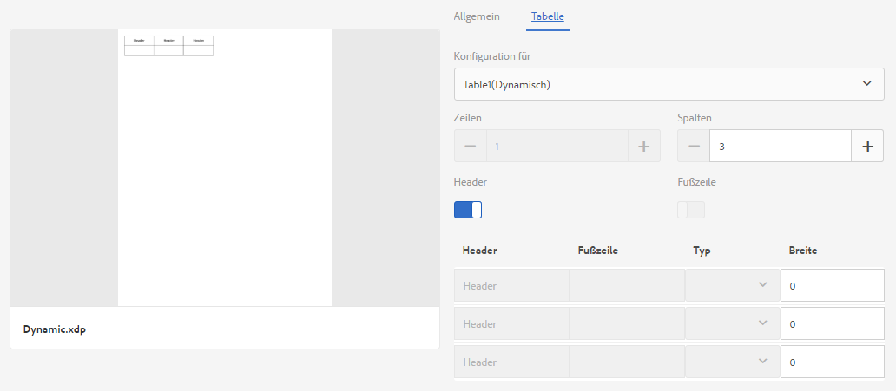

   Klicken Sie hier, um Bild in voller Größe zu öffnen

1. Erstellen Sie ein Layout-Fragment basierend auf der statischen XDP. Die Registerkarte „Tabelle“ der Eigenschaften zeigt an, dass die Tabelle statisch ist (Feld „Konfiguration für“). Die Anzahl der Zeilen (1) und Spalten (3) wird von der XDP bzw. dem Layout-Fragment abgeleitet.

   Sie können die Anzahl der Spalten und Zeilen hier ändern. Je nach Ihrer Auswahl auf diesem Bildschirm bleibt die Anzahl von Zeilen und Spalten einer statischen Tabelle in einem mit diesem Layout erstellten Brief unverändert.
   [ 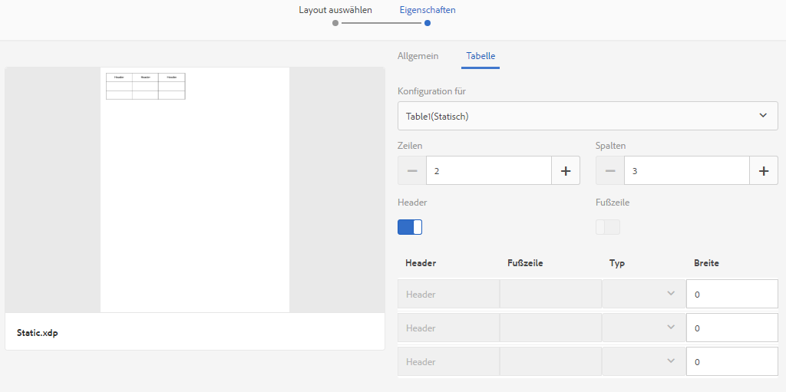](assets/statictableproperties-1.png)

1. Erstellen Sie einen Brief unter Verwendung beider Layout-Fragmente darin. Wenn Sie eine dynamische XDP in den Brief einfügen, legen Sie die Bindung seiner Felder auf die Collection-Elemente des Datenwörterbuchs fest.

   Weitere Informationen zum Erstellen von Briefen und Briefvorlagen finden Sie unter [Brief erstellen](/help/forms/using/create-letter.md).

1. Speichern Sie den Brief und zeigen Sie ihn in der Vorschau an. Wenn Sie den Brief in der Vorschau anzeigen, werden die Werte aus dem Datenwörterbuch im Brief angezeigt. Für die dynamische Tabelle sind drei Zeilen vorhanden. Dies liegt daran, dass die Testdaten drei Datensätze für diese Zeilen enthalten.

   Für die statische Tabelle sind so viele Zeilen und Spalten vorhanden, wie von Ihnen bei der Erstellung des Layout-Fragments festgelegt.

   

   Für die dynamische Tabelle werden die drei Zeilen entsprechend der Anzahl der Datensätze in der Testdatendatei angezeigt. Dies verhält sich so, weil Sie beim Hinzufügen des Layouts zum Brief eine Bindung zwischen den Feldern der dynamischen Tabelle und den Collection-Elementen des Datenwörterbuchs erstellt haben. Die Werte „Name“, „Adresse“ und „Geschlecht“ werden aus der von Ihnen verwendeten Testdatendatei gefüllt.

   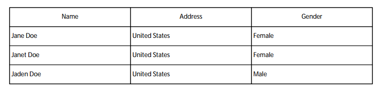

## Erstellen Sie eine Kopie eines Dokumentfragments {#create-a-copy-of-a-document-fragment}

Um ein Dokumentfragment mit den Eigenschaften und Elementen ähnlich wie einem vorhandenen Dokumentfragment schnell zu erstellen, können Sie es kopieren und einzufügen.

1. Wählen Sie in der Liste der Dokumentfragmente ein oder mehrere Dokumentfragmente aus. Auf der Benutzeroberfläche wird das Symbol „Kopieren“ angezeigt.
1. Tippen Sie auf Kopieren. Auf der Benutzeroberfläche wird das Symbol „Einfügen“ angezeigt. Sie haben auch die Möglichkeit, vor dem Einfügen in einen Ordner zu wechseln. Verschiedene Ordner können Assets mit demselben Namen enthalten. Weitere Informationen zu Ordnern finden Sie unter [Ordner und Organisieren von Assets](/help/forms/using/import-export-forms-templates.md#folders-and-organizing-assets).
1. Wählen Sie „Einfügen“. Das Dialogfeld „Einfügen“ wird angezeigt. Wenn Sie die Dokumentfragmente kopieren und an derselben Stelle einfügen, weist das System den neuen Kopien automatisch Namen und Titel zu, Sie können diese jedoch ändern.
1. Bearbeiten Sie gegebenenfalls den Titel und den Namen, mit denen Sie die Kopie des Dokumentfragmenten speichern möchten.
1. Wählen Sie „Einfügen“. Die Kopie des Dokumentfragments wird erstellt.
