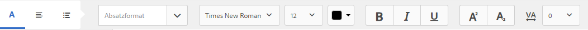

# Dokumentfragmente{#document-fragments}

## Dokumentfragmente {#document-fragments-1}

Dokumentfragmente sind wiederverwendbare Teile/Komponenten einer Korrespondenz, mit der Sie Briefe/Korrespondenz erstellen können. Es gibt Dokumentfragmente der folgenden Typen:

* **Text**: Ein Textelement ist eine Inhaltskomponente, die aus einem oder mehreren Textabsätzen besteht. Ein Absatz kann statisch oder dynamisch sein.
* **Liste**: Eine Liste ist eine Gruppe von Dokumentfragmenten, einschließlich Text, Listen, Bedingungen und Bildern. Die Reihenfolge der Listenelemente kann festgelegt sein oder bearbeitet werden. Beim Erstellen eines Briefs können Sie einige oder alle Listenelemente verwenden, um ein wiederverwendbares Muster von Elementen zu replizieren.
* **Bedingung**: Mithilfe von Bedingungen können Sie festlegen, welche Inhalte zum Zeitpunkt der Dokumenterstellung je nach den bereitgestellten Daten in das Schriftstück einbezogen werden sollen. Die Bedingung wird in Form von Kontrollvariablen beschrieben. Eine Steuerungsvariable kann entweder ein Datenwörterbuchelement oder ein Platzhalter sein.
* **Layout-Fragment**: Unter einem Layout-Fragment versteht man ein Layout, das mit einem oder mehreren Briefen verwendet werden kann. Ein Layout-Fragment wird verwendet, um wiederholbare Muster, insbesondere dynamische Tabellen, zu erstellen. Das Layout kann typische Formularfelder wie „Adresse“ und „Referenznummer“ enthalten. Es enthält auch leere Unterformulare, die Zielbereiche kennzeichnen. Die Layouts (XDPs) werden in Designer erstellt und dann in AEM Forms hochgeladen.

## Text {#text}

Ein Textelement ist eine Inhaltskomponente, die aus einem oder mehreren Textabsätzen besteht. Ein Absatz kann statisch oder dynamisch sein. Ein dynamischer Absatz enthält Verweise auf Datenelemente, deren Werte zur Laufzeit bereitgestellt werden. Beispielsweise könnte der Kundenname in einer Anrede für einen Brief ein dynamisches Datenelement sein, dessen Wert zur Laufzeit bereitgestellt wird. Durch Änderung dieser Werte kann dieselbe Briefvorlage verwendet werden, um Briefe für verschiedene Kunden zu generieren.

Die Correspondence Management Solution unterstützt zwei Arten von dynamischen Datenelementen (Variablendaten):

* **Elemente eines Datenwörterbuchs**: Diese Elemente sind an das Datenwörterbuch gebunden und erhalten ihre Werte aus der bereitgestellten Datenquelle. Eine Datenwörterbuchvariable kann geschützt oder ungeschützt sein. Bei der Korrespondenzerstellung kann der Benutzer den Standardwert ungeschützter Datenwörterbuchvariablen ändern, aber keine geschützten Variablen ändern.
* **Platzhalter**: Hierbei handelt es sich um Variablen, die nicht an eine Back-End-Datenquelle gebunden sind. Der Benutzer muss bei der Korrespondenzerstellung einen Wert eingeben. Die Platzhalter sind standardmäßig ungeschützt.

>[!NOTE]
>
>Die Correspondence Management-Vorlagen zwingen Sie nicht, beim Erstellen von Platzhaltern eindeutige Namen zu erstellen. Wenn Sie zwei Platzhalter mit demselben Namen wie einen Text und eine Bedingung erstellen und beide in einer Briefvorlage verwenden, werden die Werte des zuletzt eingefügten Platzhalters für beide Platzhalter verwendet. Wenn zwei Platzhalter denselben Namen haben, werden ihre Typen verglichen. Wenn die Typen unterschiedlich sind, wird deren Typ auf „String“ festgelegt. Innerhalb eines Moduls können Sie jedoch nicht mehrere Platzhalter mit demselben Namen erstellen.

### Text erstellen {#create-text}

1. Wählen Sie **Formulare** > **Dokumentfragmente**.
1. Tippen Sie auf **Erstellen** > **Text**, oder wählen Sie ein Textelement und tippen Sie auf **Bearbeiten**.
1. Geben Sie folgende Informationen für den Text an:

   * **Titel: (Optional)**: Geben Sie den Titel für das Textelement ein. Titel müssen nicht eindeutig sein und dürfen Sonderzeichen und nichtenglische Zeichen enthalten. Texte werden durch ihren Titel (falls verfügbar) wie etwa in Miniaturen und Asset-Eigenschaften referenziert.
   * **Name**: Der eindeutige Name für das Textelement. Es können nicht zwei Assets (Text, Bedingung oder Liste) mit demselben Namen vorhanden sein, die sich in einem beliebigen Status befinden. Im Feld Name können Sie nur englische Sprachzeichen, Zahlen und Bindestriche eingeben. Das Feld Name wird automatisch auf der Grundlage des Felds Titel ausgefüllt. Die Sonderzeichen, Leerzeichen, Zahlen und die nichtenglischen Zeichen im Feld „Titel“ werden im Feld „Name“ durch Bindestriche ersetzt. Obwohl der Wert im Feld „Titel“ automatisch in das Feld „Name“ kopiert wird, können Sie den Wert bearbeiten.
   * **Beschreibung**: Geben Sie eine Beschreibung des Assets ein.
   * **Datenwörterbuch**: Wählen Sie optional das Datenwörterbuch aus, dem das Element zugeordnet werden soll. Mit diesem Attribut können Sie Verweise auf Datenwörterbuchelemente im Text-Asset hinzufügen.
   * **Tags**: Um optional einen benutzerdefinierten Tag zu erstellen, geben Sie einen Wert in das Textfeld ein und drücken Sie die Eingabetaste. Sie können den Tag unterhalb des Textfeldes der Tags sehen. Wenn Sie diesen Text speichern, werden auch die neu hinzugefügten Tags erstellt.

1. Tippen Sie auf **Weiter**. Correspondence Management zeigt die Editor-Seite an, auf der Sie Textabsätze und Datenelemente zu dem Text hinzufügen können.

   Die Standard-Rechtschreibprüfung in Ihrem Browser überprüft die Rechtschreibung im Texteditor. Um die Rechtschreibprüfung und Grammatikprüfung zu verwalten, können Sie die Rechtschreibprüfungseinstellungen Ihres Browsers bearbeiten oder Browser-Plugins/-Addons installieren, um Rechtschreibung und Grammatik zu überprüfen.

   Sie können die verschiedenen Tastaturbefehle im Texteditor verwenden, um Text zu verwalten, zu bearbeiten und zu formatieren. Weitere Informationen zu Tastaturbefehlen des [Texteditors](/help/forms/using/keyboard-shortcuts.md#p-formatting-p) finden Sie unter „Correspondence Management-Tastaturbefehle“.

1. Ein Texteditor wird geöffnet. Geben Sie hier den gewünschten Text ein. Verwenden Sie die Symbolleiste oben auf der Seite, um den Text zu formatieren, Bedingungen, Links und Seitenumbrüche einzufügen.

   

   * **Link**: Fügen Sie eine [Hypertextverknüpfung](#insert-hyperlink) in den Text ein.
   * **Wiederholen**: Mit diesem Befehl wird ein Collection-Element unter Verwendung eines Trennzeichens in ein Datenwörterbuch gedruckt.
   * **Bedingung**: Tippen Sie auf , um eine Bedingung einzufügen. Text wird auf der Grundlage einer Bedingung eingefügt. Wenn die Bedingung wahr ist, ist Text im Brief sichtbar, andernfalls nicht.
   * **Beschreibung hinzufügen**: Hinzufügen einer Anmerkung zu einem Textabschnitt. Es handelt sich hierbei um Metadaten, die nur für den Autor sichtbar und nicht Teil des erstellten Briefs sind.
   * **Seitenumbruch**: Wenn Sie das Seitenumbruch-Attribut eines Textmoduls auf „false“ setzen, wird das Textmodul nicht auf mehreren Seiten angezeigt.

   Ein Texteditor wird geöffnet. Geben Sie den Text ein. Die Symbolleiste ändert sich je nach dem Typ der Bearbeitung, die Sie vornehmen: Absatz, Ausrichtung oder Auflistung:

   

   Wählen Sie den Typ der Symbolleiste aus: Absatz, Ausrichtung oder Auflistung

   

   Absatz-Symbolleiste
   Ausrichtungs-Symbolleiste

   

   Auflistungs-Symbolleiste (Klicken Sie hier, um Bild in voller Größe zu öffnen)

1. Um einen oder mehrere Textabsätze wiederzuverwenden, die in einer anderen Anwendung vorhanden sind, z. B. von Microsoft Word- oder HTML-Seiten, kopieren Sie den Text und fügen Sie ihn in den Texteditor ein. Die Formatierung des kopierten Texts wird im Texteditor beibehalten.

   Sie können einen oder mehrere Textabsätze in ein bearbeitbares Textmodul kopieren und einfügen. Sie können beispielsweise ein MS Word-Dokument mit einer Liste mit Aufzählungszeichen für zulässige Aufenthaltsnachweise wie folgt haben:

   

   Sie können den Text direkt aus dem MS Word-Dokument in ein bearbeitbares Textmodul kopieren. Die Formatierung wie Liste mit Aufzählungszeichen, Schriftart und Textfarbe wird im Textmodul beibehalten.

   

   >[!NOTE]
   >
   >Die Formatierung des eingefügten Textes hat jedoch einige[ Einschränkungen](https://helpx.adobe.com/de/aem-forms/kb/cm-copy-paste-text-limitations.html).

1. Fügen Sie ggf. Sonderzeichen in das Dokumentfragment ein. Beispielsweise können Sie über die Sonderzeichenpalette die folgenden Zeichen einfügen:

   * Währungssymbole wie €,￥ und £
   * Mathematische Symbole wie ∑, √, ∂ und ^
   * Satzzeichen wie „ und “

   

   Correspondence Management enthält integrierte Unterstützung für 210 Sonderzeichen. Der Administrator kann [Unterstützung für mehr/benutzerdefinierte Sonderzeichen durch Anpassung hinzufügen](/help/forms/using/custom-special-characters.md).

1. Um Teile eines Textes in einem bearbeitbaren Inline-Modul hervorzuheben, wählen Sie den Text aus und tippen Sie auf „Hervorhebungsfarbe“.

   

   Sie können entweder direkt auf eine Grundfarbe `**[A]**` in der Grundfarbenpalette tippen oder auf **Auswählen** tippen, nachdem Sie mit dem Schieberegler `**[B]**` die gewünschte Farbschattierung gewählt haben.

   Optional können Sie auch auf der Registerkarte „Erweitert“ die gewünschten Werte für Farbton, Helligkeit und Sättigung `**[C]**` wählen, um die Farbe präzise festzulegen, und dann auf „Auswählen“ `**[D]**` tippen, um die Farbe zum Hervorheben des Textes anzuwenden.

   

1. Ziehen Sie aus dem Datenbereich Datenwörterbuchelemente und Platzhalterelemente in den Text.

   An:

   * Um ein Datenwörterbuchelement im Text einzufügen, wählen Sie ein Datenelement in der Liste aus und klicken Sie auf „Einfügen“ (). Wenn Sie Geschützt auswählen, ist das Datenlexikonelement schreibgeschützt und wird im Briefeditor, aber nicht in der Benutzeroberfläche „Korrespondenz erstellen“ oder in der Korrespondenzerstellung angezeigt.
   * Um ein Platzhalterelement im Text einzufügen, klicken Sie im Bereich „Datenelemente“ auf „Neu erstellen“. geben Sie die Details des neuen Datenelements ein und klicken Sie auf „Erstellen“, um das neue Element der Liste hinzuzufügen. Der neue Platzhalter kann auf dieselbe Weise in den Text eingefügt werden wie das Datenwörterbuchelement. Um einen Platzhalter zu bearbeiten, wählen Sie einen Platzhalter aus und tippen Sie auf Bearbeiten.

   

   Platzhalterelemente, wie in der von Ihnen erstellten Musterdatendatei eines Datenwörterbuchs angegeben

   

   Platzhalterelementwerte in der CCR-Ansicht wurden von den Datenwörterbuchvariablen aufgefüllt, wie in der von Ihnen erstellten Musterdatendatei angegeben

   Sie können auch das @-Symbol verwenden, um Datenwörterbuch- und Platzhalterelemente zu suchen und zum Texteditor hinzuzufügen. Platzieren Sie den Cursor an die Stelle, an der das Element eingefügt werden soll. Geben Sie @ ein, gefolgt von der Suchzeichenfolge. Der Texteditor führt den Suchvorgang für alle Datenwörterbuch- und Platzhalterelemente durch, die im Textdokumentfragment verfügbar sind. Der Suchvorgang ruft die Elemente ab, die die Suchzeichenfolge enthalten, und zeigt sie als Dropdown-Liste an. Navigieren Sie durch die Suchergebnisse und klicken Sie auf das Element, das Sie an der Position des Mauszeigers einfügen möchten. Drücken Sie Esc, um die Suchergebnisse auszublenden.

1. Sie können Inline-Bedingungen verwenden und wiederholen, um den Brief sehr kontextabhängig und gut strukturiert zu machen. Weitere Informationen zu Inline-Bedingungen erhalte Sie unter [Inline-Bedingungen und Wiederholung in Briefen](/help/forms/using/cm-inline-condition.md).
1. Tippen Sie auf **Speichern**.

#### Einfügen eines Hyperlinks in einen Text {#insert-hyperlink}

Führen Sie die folgenden Schritte aus, um einen Hyperlink in einem Textelement zu erstellen:

1. Wählen Sie den Text oder das Datenmodellobjekt im Texteditor aus.

2. Tippen Sie auf **[!UICONTROL Link]**. Tippen Sie auf das Feld **[!UICONTROL Alt-Text]**, um den vorhandenen Datenmodellobjektnamen oder -text zu entfernen.

3. Geben Sie die URL an und tippen Sie auf .

#### Text suchen und ersetzen {#searching-and-replacing-text}

Bei der Arbeit mit Textelementen, die einen großen Textkörper enthalten, müssen Sie nach einer bestimmten Textzeichenfolge suchen. Möglicherweise müssen Sie auch eine bestimmte Textfolge durch eine alternative Zeichenfolge ersetzen.

Mit der Funktion &quot;Suchen und Ersetzen&quot;können Sie nach einer beliebigen Textzeichenfolge in einem Textelement suchen (und diese ersetzen). Die Funktion umfasst außerdem eine leistungsstarke Suche nach regulären Ausdrücken.

#### Suchen nach Text in einem Textmodul {#to-search-text-in-a-text-module}

1. Öffnen Sie das Textmodul im Texteditor.

1. Tippen Sie auf „Suchen und Ersetzen“.
1. Geben Sie den zu suchenden Text in das Textfeld „Suchen“ ein und klicken Sie auf „Suchen“. Der gesuchte Text wird im Textmodul hervorgehoben.
1. Um nach der nächsten Instanz des Texts zu suchen, klicken Sie erneut auf „Suchen“.

   Wenn Sie weiter auf die Schaltfläche „Suchen“ klicken, wird die Suche nach unten fortgesetzt. Nachdem die letzte Instanz des Textes gefunden wurde, gibt die Meldung **Ende des Moduls erreicht** an, dass keine weiteren Suchergebnisse gefunden wurden.

   Wenn allerdings keine Instanz des gesuchten Texts im Textmodul gefunden wird, lautet die angezeigte Meldung: **Übereinstimmung nicht gefunden**.

1. Wenn Sie erneut auf „Suchen“ klicken, wird die Suche am Anfang der Seite fortgesetzt.

#### Suchoptionen {#search-options}

**Groß-/Kleinschreibung berücksichtigen**: Die Suche gibt nur Ergebnisse mit derselben Groß- bzw. Kleinschreibung zurück.

**Ganzes Wort:** Die Suche gibt nur ganze Wörter zurück.

>[!NOTE]
>
>Wenn Sie Sonderzeichen in das Textfeld „Suchen“ eingeben, wird die Option „Ganzes Wort“ deaktiviert.

**Reguläre Ausdrücke:** Suche mithilfe regulärer Ausdrücke. Beispielsweise kann mithilfe des folgenden regulären Ausdrucks nach E-Mail-Adressen in einem Textelement gesucht werden:

`[a-zA-Z0-9._%+-]+@[a-zA-Z0-9.-]+\.[a-zA-Z]{2,4}`

#### Suchen und Ersetzen von Text in einem Textmodul {#to-search-and-replace-text-in-a-text-module}

1. Öffnen Sie das Textmodul im Texteditor.
1. Tippen Sie auf „Suchen und Ersetzen“.
1. Geben Sie den zu suchenden Text in das Textfeld Suchen ein und den Text, der den gesuchten Text ersetzen soll, und drücken Sie die Eingabetaste Ersetzen.
1. Wenn der Suchtext gefunden wird, wird der Text durch den Text Ersetzen ersetzt.

   * Wenn eine andere Instanz des Suchtextes gefunden wird, wird diese Instanz im Textmodul hervorgehoben. Wenn Sie erneut auf Ersetzen klicken, wird die hervorgehobene Instanz ersetzt und der Cursor bewegt sich weiter, wenn eine dritte Instanz gefunden wird.
   * Wenn keine andere Instanz gefunden wird, hält der Cursor an der zuletzt ersetzten Instanz an.

1. Wenn Sie erneut auf „Suchen“ klicken, wird die Suche am Anfang der Seite fortgesetzt.

   Verwenden Sie die Option Alle ersetzen , um alle Instanzen eines Texts im Textmodul zu ersetzen. Wenn Sie `` verwenden, wird die Anzahl der Ersetzungen als Meldung im Dialogfeld „Suchen und Ersetzen“ angezeigt.

#### Best Practices/Tipps und Tricks für Textmodule {#best-practices-tips-and-tricks-for-text-modules}

* Verwenden Sie eine konsistente Benennungskonvention, um Duplizierungen zu vermeiden.
* Verwenden Sie die entsprechende Datenwörterbuchbindung in Textmodulen.
* Die folgenden Regeln gelten für die Verwendung des Texteditors beim Ändern eines Text-Assets:

   * **Variablen hinzufügen:** Zulässig
   * **Variablen entfernen:** Zulässig
   * **Eigenschaften aktualisieren:** Zulässig
   * **Datenwörterbuch ändern:** Zulässig, solange das Datenwörterbuchelement nicht verwendet wird. Das Datenwörterbuch kann bei einer Aktualisierung nicht geändert werden.

## Liste {#list}

Eine Liste ist eine Gruppe von Dokumentfragmenten, einschließlich Text, (anderen) Listen, Bedingungen und Bildern. Die Reihenfolge der Listenelemente kann festgelegt sein oder bearbeitet werden. Beim Erstellen eines Briefs können Sie einige oder alle Listenelemente verwenden, um ein wiederverwendbares Muster von Elementen zu replizieren. Listen verhalten sich generell wie Ziele, die in anderen Ziele verschachtelt werden können.

### Listen implementieren {#implementing-lists}

Die Implementierung von Listen erfolgt in zwei Schritten:

1. Definieren von Kerneigenschaften wie Name, Beschreibung und Datenwörterbuch.
1. Abschnitt des Inhalts, der Teil der Liste ist, und anschließend Eigenschaften wie Sperrreihenfolge und Bibliothekszugriff für die Liste festlegen.

### Liste erstellen {#create-a-list}

Eine Liste ist eine Gruppe verwandter Inhalte, die in einer Briefvorlage als Einheit verwendet werden können. Jeder Inhalt kann einer Liste hinzugefügt werden. Listen können auch verschachtelt werden. Listenmodule können wie folgt angegeben werden:

* **BESTELLT**: Die Reihenfolge kann in der Laufzeit von &quot;Korrespondenz erstellen&quot;nicht geändert werden.
* **Bibliothekszugriff**: Benutzer können der Liste Module hinzufügen. Dieses Flag gibt an, ob der Bibliothekszugriff aktiviert ist. Wenn diese Option aktiviert (geöffnet) ist, kann der Benutzer der Liste Module hinzufügen, während er den Brief in der Vorschau anzeigt.
* Beim Erstellen einer Liste können Sie einen Typ angeben, z. B.:
* **Nur**: Auf die Liste wird keine zusätzliche Stilformatierung angewendet.
* **Aufzählungszeichen**: Eine mit einem einfachen Aufzählungszeichen formatierte Liste.
* **Nummerierung**: Eine numerische Liste mit den Zahlen Standard (1,2,...), Upper Roman (I, II, ...) und Lower Roman (i, ii,..).
* **Buchstabieren**: Eine alphabetische Liste mit Kleinbuchstaben (a, b,...) und Großbuchstaben (A, B,...).
* **Benutzerdefiniert**: Sie können beliebige Zahlen-/Buchstabentypen sowie Präfix- und Suffixwerte Ihrer Wahl erstellen.

1. Wählen Sie **Formulare** > **Dokumentfragmente**.

1. Wählen Sie **Erstellen** > **Liste**.

1. Geben Sie die folgenden Informationen für die Liste an:

   * **Titel (Optional):** Geben Sie den Titel für die Liste ein. Titel müssen nicht eindeutig sein und dürfen Sonderzeichen und nichtenglische Zeichen enthalten. Listen werden durch ihre Titel (falls verfügbar) referenziert, wie beispielsweise in Miniaturansichten und Asset-Eigenschaften.
   * **Name:** Der eindeutige Name der Liste. Es können nicht zwei Assets (Text, Bedingung oder Liste) mit demselben Namen vorhanden sein, die sich in einem beliebigen Status befinden. Im Feld Name können Sie nur englische Sprachzeichen, Zahlen und Bindestriche eingeben. Das Feld „Name“ wird automatisch mit dem Wert im Feld „Titel“ ausgefüllt. Die Sonderzeichen, Leerzeichen, Zahlen und die nichtenglischen Zeichen im Feld „Titel“ werden im Feld „Name“ durch Bindestriche ersetzt. Obwohl der Wert im Feld „Titel“ automatisch in das Feld „Name“ kopiert wird, können Sie den Wert bearbeiten.
   * **Beschreibung (Optional)**: Geben Sie eine Beschreibung des Assets ein.
   * **Datenelement (Optional)**: Wählen Sie optional das Datenelement aus, mit dem das Element verknüpft werden soll. Es können nur Elemente der Liste hinzugefügt werden, die das gleiche Datenwörterbuch verwenden wie die Liste oder denen kein Datenwörterbuch zugewiesen ist. Das Zuweisen eines Datenwörterbuchs zu einer Liste erleichtert es dem Ersteller einer Briefvorlage, die entsprechende Liste zu finden.
   * **Tags (Optional)**: Wählen Sie die Tags aus, die angewendet werden sollen. Sie können auch den Namen eines neuen Tags eingeben und erstellen. (Das neue Tag wird erstellt, wenn Sie auf **Speichern** tippen.)

1. Tippen Sie auf **Weiter**.
1. Tippen Sie auf **Asset hinzufügen**.
1. Um der Liste Assets hinzufügen, wählen Sie sie auf der Seite „Assets auswählen“ aus und tippen Sie auf **Fertig**.

   

1. Die Assets werden der Seite „Listenelemente“ hinzugefügt.
Um die Reihenfolge der Assets innerhalb der Liste zu ändern, tippen Sie auf das Pfeilsymbol (), halten Sie die Taste gedrückt und verwenden Sie die Drag-and-Drop-Funktion. Wenn der Benutzer auf der Benutzeroberfläche „Korrespondenz erstellen“ eine Briefvorlage öffnet, wird der Inhalt in der hier festgelegten Reihenfolge zusammengestellt.

   

1. Sie können die folgenden Optionen auswählen, um festzulegen, wie sich die Liste in der CCR-Benutzeroberfläche verhält:

   * **Bibliothekszugriff**: Um den Bibliothekszugriff für das Hinzufügen von Assets zu aktivieren, tippen Sie auf &quot;Bibliothekszugriff&quot;. Wenn der Bibliothekszugriff aktiviert ist, kann der Schadensregulierer der Liste weitere Inhalte hinzufügen. Andernfalls ist der Schadensregulierer auf den Inhalt beschränkt, den Sie für die Liste definiert haben.
   * **Reihenfolgesperren**: Zum Sperren der Reihenfolge der Assets in der Liste, sodass der Schadensregulierer sie nicht ändern kann, tippen Sie auf „Reihenfolge sperren“. Wenn Sie diese Option nicht aktivieren, kann der Schadensregulierer die Reihenfolge der Listenelemente ändern.

   * **Aufzählungszeichen hinzufügen**: Verwenden Sie diese Option, um dem Modul einen Aufzählungs- oder Nummerierungsstil hinzuzufügen. Sie können entweder einen vorgefertigten oder einen benutzerdefinierten Listenstil verwenden. Sie können auch den vor und nach jedem der Listenelemente anzuzeigenden Text festlegen.
   * **Seitenumbruch**: Wählen Sie diese Option (), um zwischen den Listeninhalten einen Seitenumbruch einzufügen. Wenn diese Option () nicht ausgewählt ist, wird, wenn der Inhalt der Liste auf die nächste Seite übergeht, die gesamte Liste auf die nächste Seite verschoben, anstatt auf der Seite inmitten der Liste umzubrechen.

   * **Zuweisungskonfiguration**: Verwenden Sie diese Option, um die Mindest- und Höchstanzahl der Assets anzugeben, die der Liste hinzugefügt werden können.

1. Sie können die folgenden Optionen auswählen, um festzulegen, wie sich jedes Asset in der Liste zur Laufzeit verhält:

   * **Bearbeitbar:** Wenn diese Option aktiviert ist, kann der Inhalt in der Benutzeroberfläche „Korrespondenz erstellen“ bearbeitet werden. (Diese Option steht für Listen- und Bildmodule nicht zur Verfügung.)
   * **Obligatorisch:** Wenn diese Option aktiviert ist, ist der Inhalt in der Benutzeroberfläche „Korrespondenz erstellen“ erforderlich.
   * **Ausgewählt:** Wenn diese Option aktiviert ist, ist der Inhalt der Benutzeroberfläche „Korrespondenz erstellen“ vorab ausgewählt.
   * **Stil überspringen:** Wenn diese Option aktiviert ist, werden Aufzählungszeichen und Nummerierungen in der Benutzeroberfläche „Korrespondenz erstellen“ übersprungen. (Diese Option steht für Bildmodule nicht zur Verfügung. Außerdem kann von den Optionen „Stil überspringen“, „Zusammengesetzte Nummerierung“ und „Listenstil ignorieren“ immer nur eine auf ein Modul angewendet werden. Eine dieser Optionen kann für ein Modul verwendet werden, wenn Sie für ein Modul die Option Aufzählungszeichen hinzufügen auswählen.)
   * **Einzug:** Sie können den Einzug von allen Modulen/Inhalten ändern, die als Teil der Liste ausgewählt wurden. Einzüge werden in Form von Ebenen angegeben (beginnend bei null), wobei jede Einzugsebene einer Auffüllung von 36 pt entspricht.
   * **Zusammengesetzte Nummerierung:** Wenn diese Option aktiviert ist, wird die zusammengesetzte Nummerierung als eine Kombination des Stils der äußeren (übergeordneten) Liste und des eigenen Stils verwendet. Die zusammengesetzte Nummerierung in dieser verschachtelten Liste beruht auf der Position, an der sich diese verschachtelte Liste in der Reihenfolge der äußeren Liste befindet.
   * **Listenstil ignorieren:** Wenn die Option „Zusammengesetzte Nummerierung“ nicht aktiviert ist, dann ist die Option „Listenstil ignorieren“ aktiviert. Bei dieser Auswahl wird der eigene Stil der verschachtelten Liste ignoriert und die Nummerierung wird von der äußeren Liste aus fortgesetzt. Daher werden die Module der verschachtelten Liste als Teil der äußeren Liste selbst behandelt, ungeachtet der Stile, die in der verschachtelten Liste angegeben sind. Wenn die Option Listenstil ignorieren für eine verschachtelte Liste deaktiviert ist, haben die Module, die Teil dieser verschachtelten Liste sind, einen eigenen Nummerierungsstil.
   * **Nächste beibehalten:** Legt den Seitenumbruch für die in einer Liste enthaltenen Assets fest. Wenn Sie die Eigenschaft „Nächste beibehalten“ eines Elements einer Liste auf **Ein** festlegen, werden dieses Element und das nächste auf derselben Seite angezeigt. Dies bedeutet, dass der Inhalt des ausgewählten Assets und des nächsten Assets nicht über mehrere Seiten verteilt ist.

1. Tippen Sie auf **Speichern**.

### Best Practices/Tipps und Tricks {#best-practices-tips-and-tricks}

* Verwenden Sie eine konsistente Benennungskonvention, um Duplizierungen zu vermeiden.
* Verwenden der entsprechenden Datenwörterbuchbindung
* Die folgenden Regeln gelten für die Verwendung des Listen-Editors zum Ändern einer Liste:

   * Eigenschaften aktualisieren: Zulässig
   * **Ändern des Datenwörterbuchs:** Zulässig, solange kein Element, das das Datenwörterbuch verwendet, damit verknüpft ist. Das Datenwörterbuch kann bei einer Aktualisierung nicht geändert werden.

## Bedingungen {#conditions}

Mit Hilfe von Bedingungen können Sie festlegen, welche Inhalte zum Zeitpunkt der Dokumenterstellung je nach den bereitgestellten Daten in das Schriftstück bzw. den Brief einbezogen werden sollen. Die Bedingung wird in Form von Kontrollvariablen beschrieben. Beim Hinzufügen einer Bedingung haben Sie die Möglichkeit, ein Asset einzubeziehen, das auf dem Wert beruht, den die Steuerungsvariable hat.

Basierend auf den von Ihnen gewählten Optionen wird entweder nur der erste Ausdruck, der „true“ ergibt, basierend auf der aktuellen Bedingungsvariablen ausgewertet oder die gesamte Bedingung. Wenn sie den Brief in „Korrespondenz erstellen“ (CCR) füllen, verhalten sich Bedingungen wie „weiße Kästchen“. Wenn die Bedingung zu einer Liste führt, werden alle obligatorischen und vorab ausgewählten Elemente der Liste ausgegeben. Wenn eines dieser Elemente Bedingungen oder Listen selbst sind, wird der resultierende Inhalt auch in der von oben nach unten sortierten, tieferen Reihenfolge als flache Liste von Text- und Bildinhalten ausgegeben. Die Ergebnisse von Bedingungen können einen beliebigen Typ aufweisen (Text, Liste, Bedingung oder Bild).

### Bedingungen implementieren {#implementing-conditions}

Der Bedingungseditor enthält eine [Expression Builder](/help/forms/using/expression-builder.md) -Benutzeroberfläche, die das Erstellen von Ausdrücken mit mehreren Platzhaltern und Datenwörterbuchelementen unterstützt. Sie können allgemeine Operanden und lokale/globale Funktionen in solchen Ausdrücken verwenden. Jeder Ausdruck kann mit bestimmten Inhalten verknüpft werden. Optional kann es einen Standardabschnitt geben, wenn keiner der Ausdrücke als &quot;true&quot;ausgewertet wird. Alle Ausdrücke werden in der Reihenfolge ausgewertet, in der sie definiert sind, und die ersten Ausdrücke, die &quot;true&quot;zurückgeben, werden ausgewählt und der zugehörige Inhalt wird von diesem Bedingungsmodul zurückgegeben.

Wenn beispielsweise der Text für die Geschäftsbedingungen in einem Brief je nach Status des Kunden unterschiedlich ist und das Datenwörterbuch ein Element namens &quot;state&quot;enthält, können Sie die Bedingung wie folgt hinzufügen:
* state = NY, select T&amp;C_NY text paragraph
* state = NC, wählen Sie T&amp;C_NC-Textabsatz

Mit dem Bedingungseditor können Sie eine Standardbedingung festlegen. Wenn der Wert der Steuerungsvariablen keiner der Bedingungen entspricht, wird der mit der Standardbedingung verknüpfte Inhalt verwendet. Im Rahmen des oben genannten Beispiel ließe sich folgende Bedingungszeile hinzufügen:

* Default, select T&amp;C_Rest

### Erstellen einer Bedingung {#create-a-condition}

1. Wählen Sie **Formulare** > **Dokumentfragmente**.
1. Wählen Sie **Erstellen > Bedingung**.
1. Geben Sie die folgenden Informationen für die Liste an:

   * **Titel (Optional):** Geben Sie den Titel für die Bedingung ein. Titel müssen nicht eindeutig sein und dürfen Sonderzeichen und nichtenglische Zeichen enthalten. Bedingungen werden durch ihren Titel (falls verfügbar) wie etwa in Miniaturen und Asset-Eigenschaften referenziert.
   * **Name:** Der eindeutige Name der Bedingung. Es können nicht zwei Assets (Text, Bedingung oder Liste) mit demselben Namen vorhanden sein, die sich in einem beliebigen Status befinden. Im Feld Name können Sie nur englische Sprachzeichen, Zahlen und Bindestriche eingeben. Das Feld Name wird automatisch auf der Grundlage des Felds Titel ausgefüllt. Die Sonderzeichen, Leerzeichen, Zahlen und die nichtenglischen Zeichen im Feld „Titel“ werden im Feld „Name“ durch Bindestriche ersetzt. Obwohl der Wert im Feld „Titel“ automatisch in das Feld „Name“ kopiert wird, können Sie den Wert bearbeiten.
   * **Beschreibung (Optional)**: Geben Sie eine Beschreibung der Bedingung ein.
   * **Datenelement (Optional)**: Wählen Sie optional das Datenelement aus, mit dem das Element verknüpft werden soll. Es können nur Elemente der Liste hinzugefügt werden, die das gleiche Datenwörterbuch verwenden wie die Bedingung oder denen kein Datenwörterbuch zugewiesen ist. Das Zuweisen eines Datenwörterbuchs zu einer Liste erleichtert es dem Ersteller einer Briefvorlage, die passende Bedingung zu finden.
   * **Tags (Optional)**: Wählen Sie optional die Tags aus, die angewendet werden sollen. Sie können auch den Namen eines neuen Tags eingeben und erstellen. (Das neue Tag wird erstellt, wenn Sie auf **Speichern** tippen.)

1. Tippen Sie auf **Weiter**.
1. Tippen Sie auf **Asset hinzufügen**.
1. Um ein Asset zur Bedingung hinzuzufügen, wählen Sie es auf der Seite „Assets auswählen“ aus und tippen Sie auf **Fertig**. Die Assets werden dem Bereich „Ausdruck“ hinzugefügt.
1. Sie können mithilfe der folgenden Optionen festlegen, wie sich die Bedingung zur Laufzeit verhält:

   * **Auswertung mehrerer Ergebnisse deaktivieren/Auswertung mehrerer Ergebnisse aktivieren**: Wenn diese Option aktiviert ist (angezeigt als „Auswertung...aktivieren”), werden alle Bedingungen ausgewertet, und das Ergebnis ist die Summe aller wahren Bedingungen. Wenn diese Option deaktiviert ist (angezeigt als „Auswertung...deaktivieren“), wird nur die erste Bedingung, die „true“ ergibt, ausgewertet und wird zur Ausgabe der Bedingung.
   * **Seitenumbruch**: Wählen Sie diese Option (), um zwischen den Modulen der Bedingungen einen Seitenumbruch hinzuzufügen. Wenn diese Option nicht ausgewählt ist () und die Bedingung über die aktuelle Seite hinausreichen würde, wird die ganze Bedingung auf die nächste Seite verschoben, anstatt innerhalb der Bedingung einen Seitenumbruch einzufügen.

1. Um die Reihenfolge der Assets innerhalb der Bedingung zu ändern, tippen Sie auf das Pfeilsymbol eines Assets (), halten Sie es gedrückt und verwenden Sie die Drag-and-Drop-Funktion. Wenn der Benutzer auf der Benutzeroberfläche „Korrespondenz erstellen“ eine Briefvorlage öffnet, wird der Inhalt in der hier festgelegten Reihenfolge zusammengestellt.
1. Tippen Sie auf **Löschen**, um die Zeile zu löschen. Wenn Sie für die Standardzeile auf „Löschen“ tippen, werden nur die Asset-Informationen gelöscht.
1. Klicken Sie auf **Kopieren**, um eine Zeile zu duplizieren.
1. Tippen Sie auf **Bearbeiten**, um das Asset zu ändern oder den Ausdruck zu bearbeiten.

   Weiter:

   * Um das Asset zu aktualisieren, tippen Sie unter der Spalte &quot;Asset&quot;auf das Ordnersymbol.
   * Um den Expression Builder zum Einfügen eines Ausdrucks zu öffnen, tippen Sie unter der Spalte „Ausdruck“ auf das Ordnersymbol. Weitere Informationen zum Expression Builder finden Sie unter [Expression Builder](/help/forms/using/expression-builder.md).

### Best Practices/Tipps und Tricks {#best-practices-tips-and-tricks-1}

* Verwenden Sie eine konsistente Benennungskonvention, um die Suche zu erleichtern und Duplizierungen zu vermeiden.
* Bedingungen verhalten sich wie Fallanweisungen, daher ist die Reihenfolge der Bedingung wichtig. Die erste Übereinstimmung wird zurückgegeben.
* Verwenden der entsprechenden Datenwörterbuchbindung
* Die folgenden Regeln gelten für die Verwendung des Bedingungseditors zum Bearbeiten einer Bedingung:

   * **Variablen hinzufügen:** Zulässig
   * **Variablen entfernen:** Zulässig
   * **Eigenschaften aktualisieren:** Zulässig
   * **Datenwörterbuch ändern:** Zulässig, solange das Datenwörterbuchelement nicht verwendet wird.

## Layout-Fragmente {#layoutfragments}

Ein Layout-Fragment basiert auf in Designer erstellten XDPs. Zum Erstellen von Layout-Fragmenten müssen Sie die XDPs erstellen und sie [auf AEM Forms hochladen](/help/forms/using/import-export-forms-templates.md).

Ein oder mehrere Layout-Fragmente können Teile eines Briefs bilden und das grafische Layout dieser Teile definieren. Ein Layout-Fragment kann typische Formularfelder wie „Adresse“ und „Referenz“ sowie leere Unterformulare, die Zielbereiche kennzeichnen, enthalten. Darüber hinaus können Sie mit Layout-Fragmenten Tabellen erstellen und sie in Briefe einfügen.

Ein gängiger Anwendungsfall besteht darin, wiederverwendbare Layout-Muster in Briefen zu suchen und Layout-Fragmente dafür zu erstellen. Beispiel: Anrede, Adresse und Betreff eines Briefs kommen in derselben Reihenfolge in mehreren Briefen vor. Ein weiteres Beispiel könnte eine Tabelle mit immer ähnlicher Anzahl von Zeilen und Spalten sein, die in mehreren Briefen verwendet wird.

Sie können ein Layout-Fragment basierend auf einer vorhandenen XDP erstellen. Ein Layout-Fragment kann entweder aus Feldern und Zielbereichen oder aus mindestens einer Tabelle bestehen. Die Tabellen in einem Layout können statisch oder dynamisch sein. Eine XDP wird in Designer erstellt und [in AEM Forms hochgeladen](/help/forms/using/import-export-forms-templates.md). Eine XDP kann die Struktur eines Layout-Fragments oder die Struktur eines Briefs bilden. Weitere Informationen finden Sie unter [Erstellung von Layouts](/help/forms/using/layout-design-details.md).

Wenn Sie Fragmente verwenden, die mit Zielbereichen verbunden sind, kann der Brief zum Zeitpunkt des Verfassens geändert werden. Es können Layout-Fragmente mit unterschiedlichen Dimensionen erstellt und das entsprechende Fragment kann an den Zielbereich gebunden werden. Mit Layout-Fragmenten können Sie auch einige Tabelleneigenschaften anpassen:

1. Sie können die Zeilen- und Spaltenanzahl erhöhen.
1. Sie können den Kopf- und Fußzeilentext für weitere Zeilen und Spalten angeben.
1. Sie können das Verhältnis der Tabellenspaltenbreite definieren. Zur Laufzeit wird die Größe der Tabellenspalten entsprechend dem definierten Verhältnis und dem verfügbaren Platz angepasst. Das Breitenverhältnis muss in der Summe 100 betragen. Andernfalls ist sie nicht anwendbar.
1. Wenn eine Tabelle ein Platzhalter ist (nur eine leere Zelle enthält), können Sie den Typ (Zielbereich/Feld) neuer Spalten definieren.
1. Sie können Kopf- und Fußzeilen ausblenden.

Bevor Sie dieses Verfahren durchführen, erstellen Sie ein XFA-Fragment mit Designer. Das Fragment kann Tabellen zum Organisieren von Feldern und Zielbereichen enthalten. Designer ermöglicht die Erstellung von zwei Tabellentypen: statisch und dynamisch. Statische Tabellen enthalten eine feste Anzahl von Zeilen. Statische Tabellen können Zielbereiche und -felder enthalten. Diese Zielbereiche und -felder können nicht an sich wiederholende DDEs gebunden werden. Eine dynamische Tabelle kann auch eine einzelne Zeile aufweisen. Die an Tabellenzellen gebundenen Daten bestimmen die Anzahl der Zeilen für dynamische Tabellen. Eine dynamische Tabelle kann ausschließlich Felder enthalten. DDEs können sich wiederholen oder nicht wiederholen.

Beachten Sie beim Entwerfen von Tabellen die folgenden Punkte:

1. Tabellen können zum Zeitpunkt der Layout-Fragmenterstellung angepasst werden. Die Option zum Anpassen ist jedoch nur aktiviert, wenn das übergeordnete Teilformular der Tabelle fließend ist.
1. Für dynamische Tabellen verwenden alle Felder, wiederholbaren Zeilen und Tabellen die Bindung &quot;Name verwenden&quot;, damit Daten ordnungsgemäß zusammengeführt werden.
1. Bei dynamischen Tabellen sind alle sich wiederholenden DDEs, die an die Tabellenfelder gebunden sind, Teil derselben Hierarchie. Für nicht wiederholende DDEs gibt es keine solche Einschränkung.
1. Zum Zeitpunkt der Zusammenführung des Layout-Fragments und des übergeordneten Zielbereichs wird die Größe der Tabellen gemäß dem verfügbaren Platz angepasst. Die Größenänderung findet allerdings nur statt, wenn das Layout-Fragment keinen Zielbereich und kein Zielfeld direkt im Unterformular der obersten Ebene enthält. Zielbereiche und Felder in Tabellen sind zulässig.
1. Sie können Platzhaltertabellen erstellen. Platzhaltertabellen enthalten nur eine einzige leere Zelle.

* Für Platzhaltertabellen können Sie folgende Eigenschaften zum Zeitpunkt der Fragmenterstellung anpassen.

   * Zeilenanzahl
   * Spaltenanzahl
   * Kopf- und Fußzeile für jede Spalte
   * Typ (Zielbereich/Feld) jeder Spalte
   * Breitenverhältnis der einzelnen Spalten

* Für eine Nicht-Platzhaltertabelle können Sie die folgenden Eigenschaften anpassen:

   * Zeilenanzahl
   * Spaltenanzahl
   * Kopf- und Fußzeile für zusätzliche Spalte
   * Breitenverhältnis der einzelnen Spalten

Sie können Fragmente in einem Brief verschachteln. Dies bedeutet, dass Sie ein Fragment in einem Fragment hinzufügen können. Die Correspondence Management-Lösung unterstützt bis zu vier Verschachtelungsebenen innerhalb eines Briefes: **Brief**->**Fragment**->**Fragment**->**Fragment**->**Fragment.**

Ein detailliertes Beispiel der Verwendung von statischen und dynamischen Tabellen in Layout-Fragmenten finden Sie unter [Beispiel mit Beispieldateien: Verwendung von statischen und dynamischen Tabellen in einem Brief](#examplewithsamplefiles).

### Layout-Fragment erstellen {#creating-a-layout-fragment}

1. Wählen Sie **Erstellen** > **Layout-Fragment**.
1. Correspondence Management zeigt die verfügbaren XDP-Dateien an. Wählen Sie die XDP-Datei aus, auf der Ihr Layout-Fragment basieren soll, und tippen Sie auf **Weiter**.
1. Geben Sie folgende Informationen für das Layout an:

   * **Titel (Optional):** Geben Sie den Titel für das Layout-Fragment ein. Titel müssen nicht eindeutig sein und dürfen Sonderzeichen und nichtenglische Zeichen enthalten. Layout-Fragmente werden durch ihre Titel (falls verfügbar), wie etwa in Miniaturansichten und Asset-Eigenschaften, referenziert.
   * **Name**: Der eindeutige Name des Layout-Fragments. Es können nicht zwei Assets (Text, Bedingung oder Liste) mit demselben Namen vorhanden sein, die sich in einem beliebigen Status befinden. Im Feld Name können Sie nur englische Sprachzeichen, Zahlen und Bindestriche eingeben. Das Feld Name wird automatisch auf der Grundlage des Felds Titel ausgefüllt. Die Sonderzeichen, Leerzeichen, Zahlen und die nichtenglischen Zeichen im Feld „Titel“ werden im Feld „Name“ durch Bindestriche ersetzt. Obwohl der Wert im Feld „Titel“ automatisch in das Feld „Name“ kopiert wird, können Sie den Wert bearbeiten. Dieser Name wird auf der Benutzeroberfläche „Elemente verwalten“ in der Liste angezeigt.
   * **Beschreibung (Optional)**: Beschreibung, die auf der Benutzeroberfläche „Elemente verwalten“ in der Liste angezeigt wird.
   * **Tags (Optional)**: Wählen Sie optional die Tags aus, die auf die Bedingung angewendet werden sollen. Sie können auch den Namen eines neuen Tags eingeben und erstellen.

1. Tippen Sie auf die Registerkarte **Tabelle** und geben Sie die folgenden Informationen für das Layout an:

   * **Konfiguration für**: Wählen Sie die zu konfigurierende Tabelle aus. Als Suffix des Tabellennamens wird in der Dropdown-Liste „(Statisch)“ angezeigt, wenn die Tabelle statisch ist, oder „(Dynamisch)“, wenn es sich um eine dynamische Tabelle handelt. Statische Tabellen enthalten eine feste Anzahl von Zeilen. Statische Tabellen können Zielbereiche und -felder enthalten. Diese Zielbereiche und -felder können nicht an sich wiederholende DDEs gebunden werden. Die an Tabellenzellen gebundenen Daten bestimmen die Anzahl der Zeilen für dynamische Tabellen.

   * **Zeilen**: Wählen Sie die Anzahl der Zeilen für das Layout aus. Die konfigurierte Zeilenanzahl muss größer oder gleich der ursprünglichen Zeilenanzahl sein.
   * **Spalten**: Wählen Sie die Anzahl der Spalten für das Layout aus. Die konfigurierte Spaltenanzahl muss größer oder gleich der ursprünglichen Spaltenanzahl sein.

   Für jede Spalte sind folgende Details erforderlich:

   * **Kopfzeile**: Text, der für die Kopfzeile angezeigt werden soll
   * **Fußzeile**: Für die Fußzeile anzuzeigender Text
   * **Typ**: Typ der zusätzlichen Spalte. Feld- oder Zielbereich. Der Typ ist für statische Platzhaltertabellen aktiviert. Der Typ kann auf Spaltenebene und nicht auf Zellenebene definiert werden. Alle Zellen in einer erweiterten Spalte weisen denselben Typ auf. Bei dynamischen Tabellen weisen alle Spalten den Typ Feld auf. Bei Nicht-Platzhaltertabellen können Sie den Typ der zusätzlichen Spalten nicht definieren. In diesem Fall entspricht der Typ der zusätzlichen Zellen in der erweiterten Spalte dem Typ der letzten Spalte in dieser Zeile. und der Zellentyp in der zusätzlichen Zeile entspricht dem Typ der letzten Zelle in dieser Spalte.
   * **Breitenverhältnis**: Verhältnis der Tabellenspaltenbreiten.

   Ein detailliertes Beispiel der Verwendung von statischen und dynamischen Tabellen in Layout-Fragmenten finden Sie unter [Beispiel mit Beispieldateien: Verwendung von statischen und dynamischen Tabellen in einem Brief](#examplewithsamplefiles).

1. Tippen Sie auf **Speichern**.

### Hochladen einer XDP-Datei in Correspondence Management {#upload-an-xdp-to-correspondence-management}

Anweisungen zum Hochladen/Importieren einer XDP in Correspondence Management finden Sie unter [Importieren und Exportieren von Assets in AEM Forms](/help/forms/using/import-export-forms-templates.md).

### Best Practices/Tipps und Tricks {#best-practices-tips-and-tricks-2}

#### Standardbindung für Teilformulare festlegen {#set-the-default-subform-binding}

Beim Erstellen von Zielbereichen in Designer ist es hilfreich, die Standardbindung für alle neuen Teilformulare auf &quot;Keine&quot;festzulegen.

So legen Sie die Standardbindung fest:

1. Tippen Sie in Designer auf **Tools** > **Optionen** > **Datenbindungen** > **Teilformularbindung**.

1. Wählen Sie in der Liste &quot;Standardbindung für neue Teilformulare&quot;die Option **Keine Datenbindung**.

Dadurch wird sichergestellt, dass Teilformulare, die mit dem Befehl &quot;Einfügen&quot;> &quot;Teilformular&quot;oder durch Ziehen und Ablegen aus der Palette &quot;Objekt&quot;eingefügt werden, standardmäßig mit &quot;Keine&quot;verknüpft werden. Das bedeutet, dass jedes neue Teilformular standardmäßig ein Zielbereich ist, es sei denn, Sie fügen Inhalte hinzu, ändern die Bindungseinstellung oder benennen das Teilformular mit dem Suffix &quot;_int&quot;.

#### Einhaltung von Abschnitt 508 {#section-compliance}

Wenn der fertige Brief, der in der Benutzeroberfläche &quot;Korrespondenz erstellen&quot;erstellt wurde, zum Ausfüllen eines späteren Workflows verwendet wird. Befolgen Sie bei der Erstellung des Layouts die Empfehlungen zu Abschnitt 508. Andernfalls wird die PDF des Briefs angezeigt und Sie können diese Empfehlungen ignorieren:

* Alle Zielbereich-Teilformulare und alle Felder in einem Layout haben eine Tab-Reihenfolge.
* Felder mit Beschriftungen sind standardmäßig mit 508 kompatibel. Das Attribut /field/assist/speak@priority des Felds ist standardmäßig auf &quot;custom&quot;gesetzt. Das bedeutet, dass die Bildschirmlesehilfe die Beschriftung des Felds liest, es sei denn, benutzerdefinierter Text für die Bildschirmlesehilfe ist vorhanden.
* Felder ohne Beschriftungen geben eine QuickInfo an und weisen Sie Bildschirmlesehilfen an, die QuickInfo zu lesen, indem Sie

`/field/assist/speak@priority="toolTip"` festlegen und in `/field/assist/toolTip` den QuickInfo-Text angeben.

#### Datumsformate in Designer und Asset Configuration Manager {#date-formats-in-designer-and-asset-configuration-manager}

Stellen Sie beim Entwerfen eines Layouts in Designer sicher, dass die Formate für Datumsfelder mit den Datumsanzeigeformaten in [Konfigurationseigenschaften von Correspondence Management](/help/forms/using/cm-configuration-properties.md). Weitere Informationen finden Sie unter „Formatieren von Feldwerten und Verwenden von Mustern“ in der Designer-Hilfe.

#### Datumsbereiche erfassen {#capturing-date-ranges}

Verwenden Sie bei einer Kombination von Datumsangaben wie startDate - endDate ein einzelnes Teilformular, um eine korrekte Ausrichtung im fertigen Brief sicherzustellen und die Anzahl der Felder zu minimieren.

#### Bindungen auf Formularebene festlegen {#setting-form-level-binding}

Wenn ein Layout viele Felder und Zielbereiche enthält, die einzelnen XML-Elementen zugeordnet sind, verwenden Sie die Bindung auf Formularebene und erstellen Sie für jedes Element einen separaten Knoten. Felder, die auf Formularebene gebunden sind, werden bei der Zuordnung von Daten in Correspondence Management ignoriert.

#### Verwenden Sie keine Teilformular-Zielbereiche auf einer Übergeordneten Seite {#do-not-use-subform-target-areas-in-a-master-page}

Teilformulare als Zielbereiche auf einer Übergeordneten Seite sind in der Benutzeroberfläche &quot;Assets verwalten&quot;nicht sichtbar und ihnen können keine Daten zugeordnet werden.

#### Auswählen der geeigneten Positionen und Typen für Zielbereiche {#choosing-appropriate-positions-and-types-for-target-areas}

Achten Sie beim Entwerfen des Layouts bei der Auswahl von Teilformularen darauf. Wenn das Layout ein einzelnes Teilformular enthält, kann es sich um einen Fließtext-Typ handeln. Nachdem Sie die Felder im Teilformular positioniert haben, können Sie es in ein anderes Teilformular aufnehmen, sodass das umschlossene Teilformular auch Fluss aufweist und das Layout nicht gestört wird.

#### Platzieren von Feldern auf Übergeordneten Seiten {#placing-fields-on-master-pages}

Beachten Sie Folgendes, wenn Sie ein Feld auf einer Übergeordneten Seite platzieren:

* Legen Sie die Bindung der Übergeordneten Seitenfelder auf Globale Daten verwenden fest.
* Platzieren Sie das Feld nicht direkt unter dem Stamm-PageArea der Übergeordneten Seite.
* Schließen Sie das Feld in ein benanntes Teilformular ein und stellen Sie sicher, dass für die Bindung des benannten Teilformulars &quot;Name verwenden&quot;festgelegt ist.

## Tabellen mithilfe von Layout-Fragmenten erstellen {#creating-tables-using-layout-fragments}

Viele Briefvorlagen enthalten Tabellen. Tabellen können statisch sein, z. B. eine Tabelle mit Nutzungsbedingungen, wobei jede Zeile eine Bedingung darstellt und jeder Teil in einer separaten Spalte angezeigt wird. Tabellen können auch dynamisch sein, z. B. Kontoinformationen, die Informationen wie Kundenname, Konto-ID, Transaktionsnummer und Transaktionsbetrag enthalten.

* **Statische Tabellen**: Tabellen werden manchmal mit Zeilen erstellt, die eine andere Anzahl von Spalten aufweisen, wie etwa bei einer Tabelle mit Nutzungsbedingungen. Dort stellt jede Zeile eine Bedingung dar und jede Bedingung kann verschiedene Unterteile aufweisen. Jeder Teil wird in einer separaten Spalte angezeigt.
* **Dynamische Tabellen**: Layout-Fragmente stellen die Möglichkeit bereit, die Felder einer dynamischen Tabelle an Sammlungs-DDEs zu binden. Zum Zeitpunkt der Brieferstellung werden Tabellenzeilen entsprechend der Größe der Sammlungs-DDEs generiert.

Das DD hat ein Sammlungselement Nominee_details, das Composite-Element mit drei primitiven Elementen enthält: Nominee_name, Nominee_address und Nominee_gender.
Dynamische XDP verfügen außerdem über die gleichen Kopfzeilen. So können Sie die dynamischen XDP-Felder mit den oben genannten Felder von DD zuordnen. 

### Beispiel mit Beispieldateien: Verwenden von statischen und dynamischen Tabellen in einem Brief {#examplewithsamplefiles}

Dieses Beispiels zeigt, wie Sie eine dynamische und eine statische Tabelle erstellen, die dynamische Tabelle an DDEs binden und dann einen Brief erstellen, der diese beiden Tabellen enthält. Bei der Arbeit mit diesem Beispiel können Sie Dateien entweder von Grund auf neu erstellen oder die in den Schritten angegebenen Eingabedateien verwenden.

1. Erstellen Sie ein Datenwörterbuch (DD), das Sie im Beispiel verwenden möchten, wie in der Grafik dargestellt.

   Wählen Sie dann das Datenwörterbuch aus und exportieren Sie Beispieldaten. Die XML-Datei, die Sie erhalten, enthält Mitarbeiterdaten und drei Instanzen für „Nominee_details“ (standardmäßig werden 3 Instanzen heruntergeladen. Sie können Instanzen je nach Bedarf hinzufügen oder löschen. Aktualisieren Sie die Werte und importieren Sie dann Testdaten in das Datenwörterbuch. Die CMP-Datei ist das Paket und enthält das Datenwörterbuch. Importieren Sie also das Datenwörterbuch in Correspondence Management.

   Weitere Informationen zum Arbeiten mit Datenwörterbüchern und Testdaten finden Sie unter [Datenwörterbuch](/help/forms/using/data-dictionary.md#p-working-with-test-data-p).

   

[Datei laden](assets/exportpackage_1431709897770.cmp.zip)

1. Erstellen Sie in Designer zwei XDPs (Layout-Fragmente): eine dynamische Tabelle und eine statische Tabelle. Für beide Layouts:

   * Fügen Sie der Tabellenspalte ein Teilformular hinzu. Stellen Sie sicher, dass Sie das Layout des übergeordneten Teilformulars der Tabelle in Textfluss ändern, und entfernen Sie die Bindungen des Teilformulars in der Tabelle.
   * Fügen Sie der Tabellenzelle ein Teilformular hinzu. Stellen Sie sicher, dass Sie das Layout des übergeordneten Teilformulars der Tabelle in Textfluss ändern, und entfernen Sie die Bindungen des Teilformulars in der Tabelle.

   Oder verwenden Sie die hier angehängten statischen und dynamischen XDPs.

   Weitere Informationen zum Arbeiten mit Layout-Fragmenten finden Sie unter [Layout-Fragmente](#layoutfragments).
Weitere Informationen zum Entwerfen von Layouts finden Sie unter [Designer-Hilfe](https://help.adobe.com/de_DE/AEMForms/6.1/DesignerHelp/).

[Datei abrufen](assets/static.xdp.zip)

[Datei abrufen](assets/dynamic.xdp.zip)

1. Laden Sie die XDP-Dateien auf AEM Forms hoch.
1. Erstellen Sie ein Layout-Fragment basierend auf der dynamischen XDP. Die Registerkarte „Tabelle“ der Eigenschaften zeigt an, dass die Tabelle dynamisch ist (Feld „Konfiguration für“). Die Anzahl der Zeilen (1) und Spalten (3) wird aus dem XDP-/Layout-Fragment abgeleitet.

   Die Felder des Layouts werden später an das importierte Datenwörterbuch gebunden, und im Brief wird die Anzahl der Zeilen basierend auf der Anzahl der Datensätze in der Testdatendatei (die an das Datenwörterbuch angehängte Datendatei) dynamisch erstellt. 

   

   Klicken, um Bild in voller Größe zu öffnen

1. Erstellen Sie ein Layout-Fragment basierend auf der statischen XDP. Die Registerkarte „Tabelle“ der Eigenschaften zeigt an, dass die Tabelle statisch ist (Feld „Konfiguration für“). Die Anzahl der Zeilen (1) und Spalten (3) wird aus dem XDP-/Layout-Fragment abgeleitet.

   Sie können die Anzahl der Spalten und Zeilen hier ändern. Je nach Auswahl auf diesem Bildschirm bleibt die Anzahl der Zeilen und Spalten einer statischen Tabelle in dem mit diesem Layout erstellten Brief fest.
   

1. Erstellen Sie einen Brief unter Verwendung beider Layout-Fragmente darin. Wenn Sie die dynamische XDP in den Brief einfügen, legen Sie die Bindung der Felder auf die Kollektionselemente des Datenwörterbuchs fest.

   Weitere Informationen zum Erstellen von Briefen und Briefvorlagen finden Sie unter [Brief erstellen](/help/forms/using/create-letter.md).

1. Speichern Sie den Brief und zeigen Sie ihn in der Vorschau an. Wenn Sie den Brief in der Vorschau anzeigen, werden die Werte aus dem Datenwörterbuch im Brief angezeigt. Für die dynamische Tabelle sind drei Zeilen vorhanden. Dies liegt daran, dass die Testdaten drei Datensätze für diese Zeilen aufweisen.

   Für die statische Tabelle sind so viele Zeilen und Spalten vorhanden, wie von Ihnen bei der Erstellung des Layout-Fragments festgelegt.

   

   Für die dynamische Tabelle werden die drei Zeilen entsprechend der Anzahl der Datensätze in der Testdatendatei angezeigt. Dies verhält sich so, weil Sie beim Hinzufügen des Layouts zum Brief eine Bindung zwischen den Feldern der dynamischen Tabelle und den Collection-Elementen des Datenwörterbuchs erstellt haben. Die Werte &quot;Name&quot;, &quot;Adresse&quot;und &quot;Geschlecht&quot;werden aus der von Ihnen verwendeten Testdatendatei gefüllt.

   

## Erstellen einer Kopie eines Dokumentfragments {#create-a-copy-of-a-document-fragment}

Um ein Dokumentfragment mit Eigenschaften und Inhalten zu erstellen, die einem vorhandenen Dokumentfragment ähnlich sind, können Sie es kopieren und einfügen.

1. Wählen Sie in der Liste der Dokumentfragmente ein oder mehrere Dokumentfragmente aus. Auf der Benutzeroberfläche wird das Symbol Kopieren angezeigt.
1. Tippen Sie auf Kopieren. Auf der Benutzeroberfläche wird das Symbol Einfügen angezeigt. Sie können vor dem Einfügen auch in einen Ordner wechseln. Verschiedene Ordner können Assets mit demselben Namen enthalten. Weitere Informationen zu Ordnern finden Sie unter [Ordner und Organisieren von Assets](/help/forms/using/import-export-forms-templates.md#folders-and-organizing-assets).
1. Tippen Sie auf Einfügen . Das Dialogfeld &quot;Einfügen&quot;wird angezeigt. Wenn Sie die Dokumentfragmente an derselben Stelle kopieren und einfügen, weist das System den neuen Kopien automatisch Namen und Titel zu, Sie können jedoch die Titel und Namen der Briefe bearbeiten.
1. Bearbeiten Sie bei Bedarf den Titel und den Namen, mit denen Sie die Kopie des Dokumentfragments speichern möchten.
1. Tippen Sie auf Einfügen . Die Kopie des Dokumentfragments wird erstellt.
