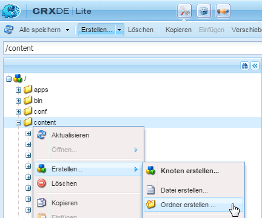
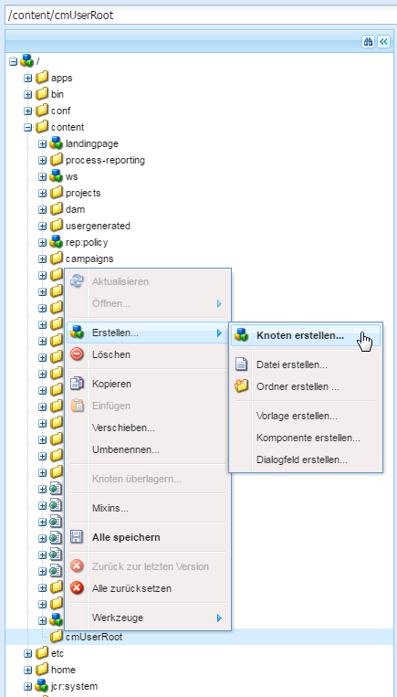
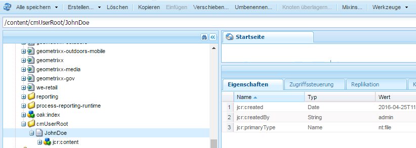
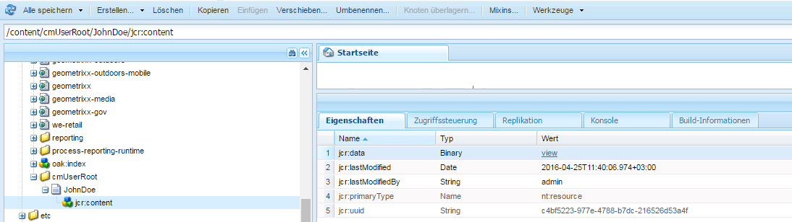
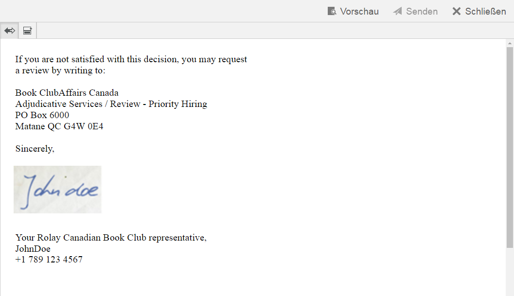

# Verwalten von Agentenunterschriftbildern{#manage-agent-signature-images}

## Überblick {#overview}

In der Correspondence Management können Sie ein Bild für die Agentunterzeichnung in Briefen verwenden. Nachdem Sie das Agentsignaturbild eingerichtet haben, können Sie beim Erstellen eines Briefs das Agentsignaturbild im Brief als Signatur des Absenderagenten rendern.

Das agentSignatureImage-DDE ist ein berechnetes DDE zur Darstellung des Signaturbilds des Agenten. Der Ausdruck für dieses berechnete DDE verwendet eine neue benutzerdefinierte Funktion, die vom Baustein „Expression Manager“ bereitgestellt wird. Diese benutzerdefinierte Funktion akzeptiert agentID und agentFolder als Eingabeparameter und ruft den Bildinhalt auf Basis dieser Parameter ab. Das SystemContext-Systemdatenwörterbuch gibt Briefen in Correspondence Management Zugriff auf Informationen im aktuellen Systemkontext. Der Systemkontext umfasst Informationen zum derzeit angemeldeten Benutzer und zu aktiven Konfigurationsparametern.

Sie können Bilder im cmuserroot-Ordner hinzufügen. In den [Eigenschaften der Correspondence Management-Konfiguration](/help/forms/using/cm-configuration-properties.md) können Sie mithilfe der Eigenschaft „URL für CM-Benutzerelemente“ den Ordner wechseln, aus dem das Agentsignaturbild abgerufen wird.

Der Wert des agentFolder-DDE wird aus dem CMUserRoot-Konfigurationsparameter für die Correspondence Management-Konfigurationseigenschaften übernommen. Standardmäßig verweist dieser Konfigurationsparameter auf/content/cmUserRoot im CRX-Repository. Sie können den Wert der CMUserRoot-Konfiguration in den Konfigurationseigenschaften ändern.
Sie können die Standardfunktion auch überschreiben, um eine eigene Logik zum Abrufen des Bilds der Benutzerunterschrift zu definieren.

## Agentsignaturbild hinzufügen {#adding-agent-signature-image}

1. Stellen Sie sicher, dass das Agentsignaturbild denselben Namen wie der AEM-Benutzername des Benutzers hat. (Eine Erweiterung wird den Namen der Bilddateien nicht benötigt.)
1. Erstellen Sie in CRX einen Ordner mit dem Namen `cmUserRoot` im aktuellen Ordner.

   1. Rufen Sie `https://'[server]:[port]'/crx/de` auf. Falls erforderlich, melden Sie sich als Administrator an.

   1. Klicken Sie mit der rechten Maustaste auf den Ordner **content** und wählen Sie **Erstellen** > **Ordner erstellen**.

      

   1. Geben Sie im Dialogfeld „Ordner erstellen“ den Namen des Ordners als `cmUserRoot` an. Klicken Sie auf **Alle speichern**.

      >[!NOTE]
      >
      >cmUserRoot ist der Standardspeicherort, unter dem AEM nach dem Agentsignaturbild sucht. Sie können sie jedoch ändern, indem Sie die Eigenschaft &quot;CM User Root&quot;in den Konfigurationseigenschaften [Correspondence Management](/help/forms/using/cm-configuration-properties.md) bearbeiten.

1. Navigieren Sie in Content Explorer zum cmUserRoot-Ordner und fügen Sie das Agentsignaturbild hinzu.

   1. Rufen Sie `https://'[server]:[port]'/crx/explorer/index.jsp` auf. Melden Sie sich nötigenfalls als Administrator an.
   1. Klicken Sie auf **Content Explorer**. Content Explorer wird in einem neuen Fenster geöffnet.
   1. Navigieren Sie in Content Explorer zum cmUserRoot-Ordner und wählen Sie ihn aus. Klicken Sie mit der rechten Maustaste auf den **cmUserRoot**-Ordner und wählen Sie **Neuer Knoten**.

      

      Nehmen Sie die folgenden Einträge in der Zeile für neue Knoten vor und klicken Sie dann auf das grüne Häkchen.

      **Name:** Max Mustermann (oder der Name Ihrer Agentsignaturdatei)

      **Typ:** nt:file

      Im Ordner `cmUserRoot` wird ein neuer Ordner mit dem Namen `JohnDoe` (oder dem Namen, den Sie im vorherigen Schritt angegeben haben) erstellt.

   1. Klicken Sie auf den neu erstellten Ordner (hier `JohnDoe`). Der Content Explorer zeigt den Inhalt des Ordners abgeblendet an.

   1. Doppelklicken Sie auf die Eigenschaft **jcr:content**, legen Sie den Typ auf **nt:resource** fest und klicken Sie dann auf das grüne Häkchen, um den Eintrag zu speichern.

      Wenn die Eigenschaft nicht vorhanden ist, erstellen Sie zuerst eine Eigenschaft mit dem Namen „jcr:content“. 

      

      Zu den Untereigenschaften von „jcr:content“ gehört die abgeblendet dargestellte Eigenschaft „jcr:data“. Doppelklicken Sie auf „jcr:data“. Die Eigenschaft kann bearbeitet werden und die Schaltfläche Datei auswählen wird im Eintrag angezeigt. Klicken Sie auf **Datei** auswählen und wählen Sie die Bilddatei aus, die Sie als Logo verwenden möchten. Für die Bilddatei wird keine Erweiterung benötigt.

      
   Klicken Sie auf **Alle speichern**.

1. Stellen Sie sicher, dass im für den Brief verwendeten XDP\Layout in der linken unteren Ecke (oder einer anderen geeigneten Stelle im Layout, an der die Signatur ausgegeben werden soll) ein Bildfeld für die Ausgabe des Signaturbilds zur Verfügung steht.
1. Wählen Sie beim Erstellen von Korrespondenz wie folgt auf der Registerkarte „Daten“ ein Bildfeld für das Signaturbild:

   1. Wählen Sie aus dem Popupmenü „Verbindungstyp“ im rechten Bereich die Option „System“.

   1. Wählen Sie das agentSignatureImage-DDE aus der Liste im Datenelementbereich für das SystemContext-DD.

   1. Speichern Sie den Brief.

1. Wenn der Brief gerendert wird, wird die Signatur ind er Briefvorschau im Bildfeld angezeigt, wie durch das Layout bestimmt.

   
