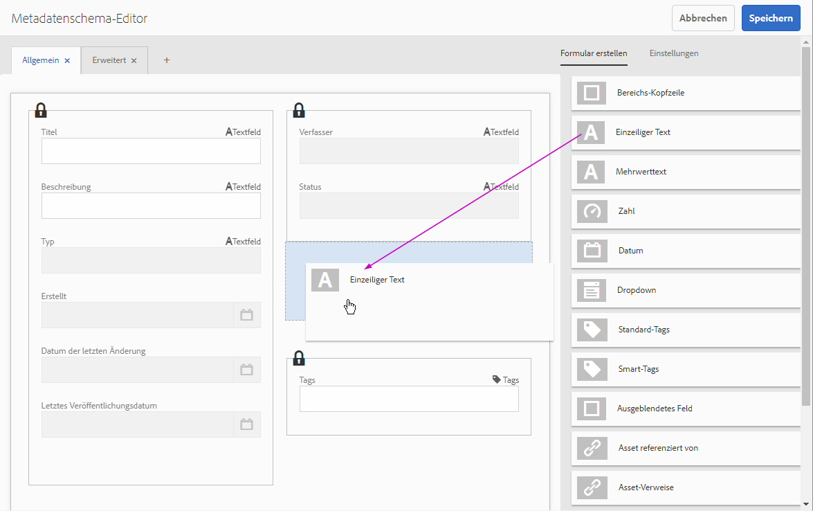

# Verwalten von Formularmetadaten{#manage-form-metadata}

## Überblick  {#overview-nbsp}

Metadaten ermöglichen eine einfachere Kategorisierung und Organisation der Assets und erleichtern Benutzern die Suche nach einem bestimmten Asset.

AEM Forms stellt standardmäßig einen definierten Metadatensatz für jeden Asset-Typ bereit. Neben den Standardmetadaten können Sie auch benutzerdefinierte Metadaten zu den einzelnen Asset-Typen hinzufügen. AEM Forms bietet Ihnen außerdem die richtigen Möglichkeiten zum effizienten Erstellen, Verwalten und Austauschen aller Metadaten für Ihre Formulare.

Wenn Sie Entwickler oder Site-Eigentümer sind, können Sie Forms Portal (die Endbenutzeroberfläche für AEM Forms) so anpassen, dass die in Ihrem Unternehmen verwendeten Metadaten widergespiegelt werden. Weitere Informationen zu Forms Portal finden Sie unter [Einführung in das Veröffentlichen von Formularen in einem Portal](../../forms/using/introduction-publishing-forms.md).

## Metadaten in AEM Forms {#metadata-in-aem-forms}

In AEM Forms ist die Liste der mit einem Asset verknüpften Metadateneigenschaften von dessen Typ abhängig. Wenn Sie außerdem eine benutzerdefinierte Metadateneigenschaft hinzufügen, wird diese für alle Assets des Typs hinzugefügt, für den die benutzerdefinierten Metadaten hinzugefügt wurden.

### Asset-Typen {#asset-types}

Die folgenden Asset-Typen werden in AEM Forms unterstützt:

* Formularvorlagen (XFA-Formulare)
* PDF-Formulare
* Dokument (Flat-PDFs)
* Adaptive Formulare
* Ressourcen
* XFS

#### Umfassende Liste der Metadaten {#extensive-list-of-metadata}

Im Folgenden sehen Sie eine umfassende Liste der Metadateneigenschaften, die in AEM Forms unterstützt werden:

<table>
 <tbody> 
  <tr> 
   <td><strong>Eigenschaftsname</strong></td> 
   <td><strong>Asset-Typ</strong></td> 
   <td><strong>Beschreibung</strong>  </td> 
  </tr> 
  <tr> 
   <td>Titel</td> 
   <td>Alle außer Ressource</td> 
   <td>Anzeigename des Formulars.  </td> 
  </tr> 
  <tr> 
   <td>Beschreibung</td> 
   <td>Alle außer Ressource</td> 
   <td>Beschreibung des Formulars. Der Benutzer kann diesen Wert angeben.  </td> 
  </tr> 
  <tr> 
   <td>Typ</td> 
   <td>Alle</td> 
   <td>
Ein schreibgeschützter Wert, der den Typ des Assets angibt. Er kann einen der folgenden Werte annehmen:
 
    <ul> 
     <li>Formularvorlage</li> 
     <li>PDF-Formular, PDF-Formular (Acroform) oder PDF-Formular (Signiert)</li> 
     <li>Dokument, Dokument (Signiert)</li> 
     <li>Adaptives Formular</li> 
     <li>Ressource</li> 
    </ul> </td> 
  </tr> 
  <tr> 
   <td>Erstellt</td> 
   <td>Alle</td> 
   <td>Ein schreibgeschützter Wert, der den Zeitpunkt der Asset-Erstellung angibt.</td> 
  </tr> 
  <tr> 
   <td>Datum der letzten Änderung</td> 
   <td>Alle</td> 
   <td>Ein schreibgeschützter Wert, der angibt, wann das Asset zuletzt geändert wurde.</td> 
  </tr> 
  <tr> 
   <td>Autor</td> 
   <td>Alle außer Ressource</td> 
   <td>
Ein schreibgeschützter Wert, der automatisch basierend auf dem Formulartyp berechnet wird.
 
    <ul> 
     <li>PDF/Formularvorlage/Dokument - aus der hochgeladenen Binärdatei abgerufen.</li> 
     <li>Adaptives Formular - Angemeldeter Benutzer zum Zeitpunkt der Formularerstellung.</li> 
    </ul> </td> 
  </tr> 
  <tr> 
   <td>Status</td> 
   <td>Alle außer Ressource</td> 
   <td>
 Ein schreibgeschützter Wert, der einen der folgenden Status eines Formulars definiert:
 
    <ul> 
     <li>Kein Wert: Wenn ein Formular noch nicht veröffentlicht wurde.</li> 
     <li>Veröffentlicht: Wenn ein Formular veröffentlicht wurde.</li> 
     <li>Geändert: Wenn ein Formular nach seiner Veröffentlichung geändert wurde.</li> 
    </ul> </td> 
  </tr> 
  <tr> 
   <td>Letztes Veröffentlichungsdatum</td> 
   <td>Alle außer Ressource</td> 
   <td>Ein schreibgeschützter Wert, der angibt, wann das Formular zuletzt veröffentlicht wurde.</td> 
  </tr> 
  <tr> 
   <td>Publish on/off time (Zeit für Veröffentlichung ein/aus)</td> 
   <td>Alle außer Ressource</td> 
   <td>
Zeitpunkt, an dem das Formular planmäßig automatisch veröffentlicht bzw. die Veröffentlichung rückgängig gemacht werden soll. Der Benutzer legt diesen Wert beim Bearbeiten der Metadaten fest.
 
    <ul> 
     <li>Die Werte für diese Einstellung müssen nach dem aktuellen Datum liegen. </li> 
     <li>Die Zeit für die Deaktivierung der Veröffentlichung muss nach der Aktivierungszeit liegen. </li> 
    </ul> </td> 
  </tr> 
  <tr> 
   <td>Submit URL (Sende-URL)</td> 
   <td>
Formularvorlage
 
PDF-Formular
 </td> 
   <td>
Zum Konfigurieren einer vom Benutzer angegebenen URL zum Senden von Formulardaten an ein Servlet.
 
Die Sende-URL kann mit einer der folgenden Methoden konfiguriert werden, die nach Priorität sortiert aufgeführt werden:
 
    <ul> 
     <li>Geben Sie beim Erstellen eines XFA-Formulars in AEM Forms Designer über die Schaltfläche zum Übermitteln von HTTP eine Sende-URL direkt in einer Formularvorlage an.</li> 
     <li>Wählen Sie in der AEM Forms-Benutzeroberfläche ein Formular aus und geben Sie eine Sende-URL bei der Bearbeitung der Metadateneigenschaften an.</li> 
     <li>Bearbeiten Sie im Forms Portal die Komponente „Search &amp; Lister“ und legen Sie eine Sende-URL auf der Registerkarte „Formular-Link“ fest.</li> 
    </ul> </td> 
  </tr> 
  <tr> 
   <td>HTML render profile (HTML-Renderprofil)</td> 
   <td>Formularvorlage</td> 
   <td>Das HTML-Renderprofil, das bei der Wiedergabe einer Formularvorlage im HTML-Format verwendet wird.</td> 
  </tr> 
  <tr> 
   <td>Render format (Renderformat)</td> 
   <td>
Formularvorlage
 
Adaptives Formular
 </td> 
   <td>
Diese Option ermöglicht es dem Benutzer, das Renderformat des Formulars anzugeben, wenn die Formulare veröffentlicht werden:
 
    <ul> 
     <li>HTML</li> 
     <li>PDF</li> 
     <li>Beide</li> 
    </ul> 
Diese Option wird zum Eingrenzen des Renderformats der Formulare nur im Forms Portal verwendet, wo sie für Endbenutzer sichtbar sind.
 </td> 
  </tr> 
  <tr> 
   <td>Tags</td> 
   <td>Alle außer Ressource</td> 
   <td>Mit dem Formular verknüpfte Beschriftungen, um schnelle und einfache Suche zu erleichtern.</td> 
  </tr> 
  <tr> 
   <td>Verweise</td> 
   <td>
Adaptives Formular
 
Formularvorlage
 
Ressource
 </td> 
   <td>
Liste der Assets (andere Formulare oder Ressourcen), mit denen dieses Formular verwandt ist. Diese Assets können zu den folgenden zwei Kategorien gehören:
 
    <ul> 
     <li>Refers (Verweist): Assets, auf die das aktuelle Formular verweist.</li> 
     <li>Referred by (Referenziert von): Assets, die auf das aktuelle Asset verweisen.</li> 
    </ul> 
Diese Assets werden als Links angezeigt, auf die Sie klicken können, um direkt auf ihre Metadaten zuzugreifen.  
 </td> 
  </tr> 
  <tr> 
   <td>Form model (XDP/XSD) selection (Formularmodellauswahl (XDP/XSD))</td> 
   <td>Adaptives Formular</td> 
   <td>
Gibt an, welches Formularmodell beim Authoring des adaptiven Formulars verwendet wird. Diese Eigenschaft kann folgende Werte haben:
 
    <ul> 
     <li>Formularvorlage: Eine Formularvorlage wird aus den im Repository vorhandenen ausgewählt. Dieser Wert kann aktualisiert werden.</li> 
     <li>XML-Schema: Eine XSD-Datei wird hochgeladen. Dieser Wert kann aktualisiert werden.</li> 
     <li>Kein</li> 
    </ul> 
    

      Ein ausgewähltes Formularmodell kann aktualisiert, aber nicht entfernt werden. 
    
 </td> 
  </tr> 
 </tbody> 
</table>

## Anzeigen von Formularmetadaten {#view-form-metadata}

Assets weisen vorhandene Eigenschaftswerte auf, die im schreibgeschützten Modus angezeigt werden können. Diese Metadaten entstehen zum Zeitpunkt des Formular-Uploads oder der Formularerstellung.

1. Navigieren Sie zum Speicherort des Assets, für das Sie Metadaten anzeigen möchten.

1. Öffnen Sie die Eigenschaftsseite mit einer der folgenden Methoden:

   1. Klicken Sie in den Schnellaktionen auf das Symbol für die Ansicht Eigenschaften .

      >[!NOTE]
      >
      >Schnellaktionen sind die Aktionselemente, die über eine Miniaturansicht angezeigt werden, wenn Sie den Mauszeiger über ein Element bewegen.

   1. Wählen Sie das Formular aus und klicken Sie auf das Symbol für die Ansicht Eigenschaften , das in der Symbolleiste angezeigt wird.
   1. Navigieren Sie zur Seite mit den Formulardetails, indem Sie auf die Formularminiaturansicht klicken, während Sie sich nicht im Auswahlmodus befinden. Klicken Sie nun oben rechts auf das Augensymbol  und klicken Sie dann in der darunter liegenden Liste auf Eigenschaften.

1. Auf der daraufhin geöffneten Eigenschaftsseite wird ein Schema angezeigt, das nur die Metadateneigenschaften enthält, die einen Wert enthalten.

   Die Eigenschaftsseite enthält eine Symbolleiste mit zwei Aktionssymbolen:

   * Bearbeiten:  Metadateneigenschaftswerte bearbeiten
   * Ansicht:  Navigieren Sie zur Seite mit den Formulardetails, auf der das Formular im Vorschau-Modus geöffnet wird.

   Der Inhaltsbereich ist in zwei Abschnitte unterteilt:

   * Der linke Bereich enthält die Miniaturansicht des Formulars
   * Der rechte Bereich enthält Metadateneigenschaften im schreibgeschützten Modus, die über verschiedene Registerkarten verteilt sind.

## Hinzufügen/Aktualisieren von Formularmetadatenwerten {#add-update-form-metadata-values}

Sie können den Wert von vorhandenen Metadateneigenschaften bearbeiten oder einem vorhandenen Metadateneigenschaftsfeld neue Werte hinzufügen (zum Beispiel wenn ein Metadatenfeld leer ist).

### Aktualisieren von Metadateneigenschaftswerten {#update-metadata-property-values}

1. Befolgen Sie die im vorherigen Abschnitt angegebenen Schritte, um die Eigenschaftsseite zu öffnen, auf der vorhandene Metadaten das ausgewählten Formulars angezeigt werden können.

1. Klicken Sie in der Symbolleiste auf das Bearbeitungssymbol , um den Modus der Seite von schreibgeschützt zu lesen/schreiben zu ändern.

1. Die daraufhin geöffnete Eigenschaftsseite enthält ein Schema, das aus einer Mischung aus bearbeitbaren Eingabefelder und statischem Text enthält.

1. Die im statischen Text angezeigten Eigenschaften sind diejenigen, die Sie nicht bearbeiten können.

1. Sie können zu anderen Registerkarten navigieren, um Eingabefelder für die Metadateneigenschaften zu suchen, die darunter platziert werden.

   Diese Seite enthält eine Symbolleiste mit zwei Aktionssymbolen, die sich von denen im Ansichtsmodus unterscheiden:

   * Abbrechen:  Änderungen an den Metadateneigenschaftswerten bis jetzt abbrechen
   * Fertig:  Speichern Sie alle bisher an den Metadateneigenschaftswerten vorgenommenen Änderungen

   Bei beiden Aktionen wird der Benutzer zurück zum schreibgeschützten Modus der Eigenschaftsseite mit den aktualisierten Werten geleitet.

### Aktualisieren der Formularminiaturansicht {#update-the-form-thumbnail}

Im linken Bereich der Eigenschaftsseite wird die Miniaturansicht des Formulars angezeigt. Standardmäßig wird die angezeigte Miniaturansicht zum Zeitpunkt der Formularerstellung (adaptives Formular) oder des Formular-Uploads generiert.

Bei allen Formulartypen können Sie ein Bild hochladen, indem Sie auf **[!UICONTROL Bild hochladen]** klicken und nach einer Bilddatei im lokalen Verzeichnis suchen. Das ausgewählte Bild wird anstelle des Standardbilds als Miniaturansicht verwendet.

Bei adaptiven Formularen werden zusätzliche Funktionen bereitgestellt, mit denen der Benutzer eine Miniaturansicht als Momentaufnahme der aktuellen Vorschau des adaptiven Formulars generieren kann. Da AEM Forms auch das Authoring adaptiver Formulare unterstützt, kann sich die Vorschau des adaptiven Formulars ändern, wenn Sie das adaptive Formular ändern. Mit dieser Funktion zum Generieren einer Miniaturansicht können Sie eine aktuelle Miniaturansicht für das adaptive Formular erhalten, die auf dem aktuellen Vorschaustatus basiert. Klicken Sie auf **[!UICONTROL Vorschau generieren]**, um diese Aktion durchzuführen.

>[!NOTE]
>
>* Verwenden Sie ein quadratisches Bild für die Miniatur. Wenn Sie ein nicht quadratisches Bild verwenden und die Miniaturansicht in der Listenansicht anzeigen, sieht die Miniaturansicht abgeschnitten aus.
>* Sobald ein neues Bild hochgeladen oder generiert wurde, wird die Miniaturansicht durch dieses Bild ersetzt und kann nicht auf das vorherige Bild zurückgesetzt werden.

>

## Hinzufügen benutzerdefinierter Metadaten {#add-custom-metadata}

Zusätzlich zu den standardmäßig bereitgestellten Metadaten unterstützt AEM Forms auch neue benutzerdefinierte Metadaten.

Es wird ein Tool (Metadaten-Schema-Editor) bereitgestellt, mit dem das Schema für das Metadatenlayout definiert wird. d. h. das Layout dessen, was auf der Seite **[!UICONTROL Eigenschaften]** eines Formulars angezeigt wird. Mit dem Metadatenschema-Editor können Sie ein benutzerdefiniertes Schema für Ihre Assets hinzufügen oder ändern.

AEM Forms stellt die Metadatenschemata der unterstützten Formulartypen in diesem Werkzeug dar. Auf diese Weise können Sie auf diese Schemata zugreifen und die Funktion des Metadatenschema-Editors verwenden, um benutzerdefinierte Eigenschaften hinzuzufügen.

### Navigieren im Metadatenschema-Editor {#navigate-the-metadata-schema-editor}

1. Navigieren Sie zu **[!UICONTROL Tools > Assets > Metadatenschemata]**.

1. Klicken Sie in den aufgeführten Schemaformularen auf **[!UICONTROL Formulare.]**

1. Klicken Sie in der Liste, die geöffnet wird, auf den Asset-Typ, für die Sie benutzerdefinierte Metadaten hinzufügen möchten.

   >[!NOTE]
   >
   >Diese Schemata enthalten Metadateneigenschaften, die standardmäßig bereitgestellt werden und nicht geändert/bearbeitet werden dürfen (Kontrollkästchen aktivieren und in der Symbolleiste auf „Bearbeiten“ klicken), um Funktionsprobleme zu vermeiden.

1. Wenn Sie auf einen Asset-Typ klicken, wird eine Liste mit der Option `extendedmetadata` geöffnet. Bearbeiten Sie dieses Schema.

1. Aktivieren Sie das Kontrollkästchen neben `extendedmetadata` und klicken Sie dann auf das Symbol , das in der Symbolleiste angezeigt wird.

1. AEM Forms öffnet den Metadatenschema-Editor/Formularersteller des ausgewählten Asset-Typs (in diesem Fall „adaptives Formular“).

   

   Metadateneditor

   1. Der linke Bereich enthält Registerkartenabschnitte mit den Feldern und im rechten Bereich werden alle verfügbaren UI-Komponenten und die Eigenschaften des im linken Bereich ausgewählten Feldes angezeigt.

   1. Der gesperrte Abschnitt kann nicht bearbeitet werden und enthält Felder für alle Metadateneigenschaften, die standardmäßig bereitgestellt werden.

   1. Sie können weitere Registerkarten hinzufügen, indem Sie auf + klicken.

   1. Sie können ein benutzerdefiniertes Feld des gewünschten Typs hinzufügen, indem Sie die Feldkomponente aus dem Abschnitt **[!UICONTROL Formular erstellen]** auf die Schemaseite ziehen.
   1. Die Spezifikationen für dieses Feld können unter dem Abschnitt **[!UICONTROL Einstellungen]** angegeben werden, nachdem Sie auf das Feld geklickt haben.

### Hinzufügen benutzerdefinierter Metadateneigenschaften im Schemaeditor {#add-custom-metadata-property-in-schema-editor}

1. Navigieren Sie zur Registerkarte (vorhanden oder neu), der Sie die benutzerdefinierte Eigenschaft hinzufügen möchten.

1. Ziehen Sie eine Komponente des gewünschten Typs aus dem Abschnitt **[!UICONTROL Formular erstellen]** in den linken Bereich und platzieren Sie sie an der gewünschten Stelle.

   >[!NOTE]
   >
   >Sie können gesperrte Abschnitte nicht verschieben, aber Sie können die Komponente in einem der leeren Bereiche platzieren.

1. Klicken Sie auf eine Komponente, die Sie gerade verschoben haben. Geben Sie in der Registerkarte „Einstellungen“, die im rechten Bereich geöffnet wird, die Informationen für die folgenden Felder ein:

   1. Geben Sie eine Feldbeschriftung an, die als Anzeigename über dem im Schema platzierten Feld verwendet wird (zum Beispiel: Abteilung).
   1. Unter dem Feld „Zu Eigenschaft zuordnen“ wird ein bereits ausgefüllter Wert angezeigt **„./jcr:content/metadata/default“**. Ändern Sie „**default**“ in einen gewünschten Eigenschaftsnamen, mit dem die Eigenschaft im crx-Repository gespeichert wird (zum Beispiel: „./jcr:content/metadata/department“) 

      >[!NOTE]
      >
      >Ändern Sie nicht das Präfix „./jcr:content/metadata/“, da es den Pfad definiert, unter dem die Eigenschaft gespeichert ist.
      >
      >Außerdem muss der Eigenschaftsname eindeutig sein, damit nicht Werte für zwei oder mehr Eigenschaften in dieselbe Position im Repository geschrieben werden. Daher wird empfohlen, den Wert „default“ zu ändern.

   1. Geben Sie je nach Bedarf weitere Einstellungen an. Beispiel: Wählen Sie die Option „Erforderlich“, um das Feld zu einem Pflichtfeld zu machen.
   1. Um ein hinzugefügtes Feld zu löschen, wählen Sie das Feld aus und klicken Sie dann auf das Symbol .

1. Bei Bedarf können Sie die Schritte 1-3, wiederholen um eine weitere Eigenschaft hinzuzufügen.
1. Klicken Sie auf **Fertig**, nachdem Sie alle Änderungen vorgenommen haben.

   Sie haben erfolgreich eine benutzerdefinierte Metadateneigenschaft hinzugefügt.

Alle adaptiven Formulare in AEM Forms enthalten jetzt diese zusätzliche Metadateneigenschaft. Sie können sie über die Eigenschaftsseite bearbeiten.
