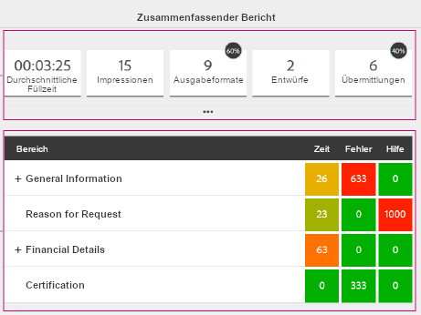
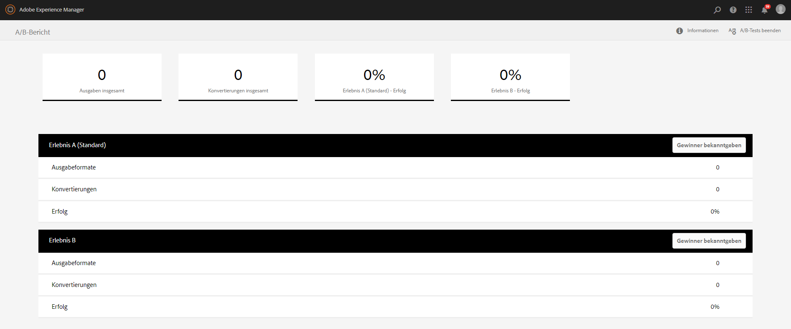

# Messen und Verbessern der Effektivität und Konvertierung von Formularen{#measure-and-improve-effectiveness-and-conversion-of-forms}

## Die Herausforderung {#the-challenge-br}

Unternehmen geben ihren Kunden zunehmend die Möglichkeit, ihre Transaktionen mithilfe digitaler Self Services über mehrere Kanäle auszuführen. In Ermangelung eines unmittelbaren Feedbacks wird es jedoch schwierig, den Erfolg zu messen und mit digitalen Formularen zu experimentieren, um das Kundenerlebnis zu verbessern und Konvertierungen zu erhöhen.

Um die ROI zu maximieren, müssen Unternehmen überwachen, wie ihre Kunden mit Diensten interagieren, und mit ihren digitalen Artefakten (Formulare) experimentieren, um die Benutzererlebnisse zu verbessern. Um Erfolg zu messen und eine Strategie zur Verbesserung zu definieren, müssen Unternehmen Antworten auf Fragen finden wie:

* Wie viele Kunden haben versucht, auf meine Formulare zuzugreifen oder damit Transaktionen abzuwickeln?
* Wie viele davon haben die Transaktion erfolgreich abgeschlossen?
* Wie viele davon haben das Formular abgebrochen?
* Mit welchen Problemen werden die Kunden konfrontiert?
* Welche Änderungen kann ich einführen und wie teste ich, wodurch sich die Konvertierung verbessert?

## Die Lösung {#the-solution}

AEM Forms ist mit [Adobe Marketing Cloud](https://www.adobe.com/marketing-cloud.html)-Lösungen - [Adobe Analytics](https://www.adobe.com/marketing-cloud/web-analytics.html) und [Adobe Target](https://www.adobe.com/marketing-cloud/testing-targeting.html) integriert, die Ihnen dabei helfen können, die Leistung Ihrer Formulare zu überwachen und zu analysieren und Ihnen das Experiment und die Identifizierung des Erlebnisses zu ermöglichen, das zu einer besseren Konversionsrate führt.

## Der Arbeitsablauf {#the-workflow}

Kommen wir zur genauen Vorgehensweise, wie Sie die Leistung messen und Konvertierungsraten für Formulare steigern können.

### Zielpublikum {#target-audience}

* Geschäftskunden und Analysten verantwortlich für Marketingstrategien und Erfolg
* IT-Teams, die für Einrichtung und Wartung von Infrastruktur und Lösungen verantwortlich sind

### Beteiligte AEM Forms-Komponenten und -Funktionen {#aem-forms-components-and-features-involved}

* Adaptive Formulare
* Integration in Adobe Analytics zum Erfassen, Organisieren und Berichten von Kundeninteraktionen mit Ihren adaptiven Formularen
* Integration in Adobe Target, um A/B-Tests für adaptive Formulare durchzuführen

### Annahmen {#assumptions}

* Sie haben bereits ein Adobe Marketing Cloud-Konto und sich für Analytics- und Target-Lösungen registriert.
* Sie haben ein veröffentlichtes adaptives Formular, auf das Kunden zugreifen können.

### Arbeitsablaufschritte {#workflow-steps}

#### Schritt 1: Konfigurieren von Analytics und Target in AEM Forms  {#step-configure-analytics-and-target-in-aem-forms-br}

**Konfigurieren Sie Analytics**

Um detaillierte Einblicke in die Interaktionen Ihrer Kunden mit Ihren Formularen zu erhalten, müssen Sie zunächst Analytics in AEM Forms konfigurieren. Führen Sie die folgenden Schritte durch:

1. Erstellen einer Report Suite in Adobe Analytics
1. Cloud Service-Konfiguration in AEM erstellen
1. Cloud Service-Framework in AEM erstellen
1. AEM Forms-Analytics-Konfigurationsdienst konfigurieren
1. Analytics im Formular in AEM aktivieren

Ausführliche Anweisungen finden Sie unter [Konfigurieren von Analyse und Berichten für adaptive Formulare](../../forms/using/configure-analytics-forms-documents.md).

**Target konfigurieren**

Um A/B-Tests für Ihre adaptiven Formulare zu erstellen und auszuführen, konfigurieren Sie Target in AEM Forms, wie unter [Einrichten und Integrieren von Target in AEM Forms](../../forms/using/ab-testing-adaptive-forms.md#p-set-up-and-integrate-target-in-aem-forms-p) beschrieben.

#### Schritt 2: Anzeigen des Analyseberichts {#step-view-analytics-report-br}

Wenn Ihre Kunden auf Formulare zugreifen und damit interagieren, für die Sie Analytics aktiviert haben, werden ihre Interaktionen in streng gesicherten Analytics-Datenbanken erfasst. Die Datenbanken werden von Kunden segmentiert und der Zugriff erfolgt über sichere Verbindungen.

Sie können einen Bericht aus AEM für Formulare mit aktivierter Analyse-Funktion anzeigen und Daten analysieren. Anzeigen des Berichts:

1. Navigieren Sie auf dem AEM-Server zu **Formulare > Formulare und Dokumente**.
1. Wählen Sie das Formular aus, für das Sie den Analytics-Bericht erstellen möchten.
1. Klicken Sie auf das Symbol für Analyseberichte. Der Bericht wird angezeigt.

Werfen wir einen Blick auf die Datenpunkte, die von Analytics für Formulare erfasst und gemeldet werden.

**Formularanalysebericht**

Der Analysebericht für adaptive Formulare erfasst die folgenden wichtigen Leistungsindikatoren (Key Performance Indicators) auf Formularebene:

* **Durchschnittliche Füllzeit**: Durchschnittliche Zeit für das Ausfüllen des Formulars
* **Impressionen**: Gibt an, wie oft das Formular in den Suchergebnissen angezeigt wurde

* **Ausgabeformate**: Gibt an, wie oft das Formular wiedergegeben oder geöffnet wurde
* **Entwürfe**: Gibt an, wie oft das Formular als Entwurf gespeichert wurde 

* **Übermittlungen**: Gibt an, wie oft das Formular gesendet wurde
* **Abbruch**: Gibt an, wie oft Benutzer das Formular verlassen haben, ohne es auszufüllen
* **Besuche/Übermittlungen**: Verhältnis von Besuchen pro Übermittlung

Darüber hinaus erhalten Sie die folgenden Details zu jedem Bedienfeld in folgender Form:

* **Uhrzeit**: Durchschnittliche Zeit (Sekunden), die im Bereich und den zugehörigen Feldern verbracht wurde

* **Fehler**: Anzahl der Fehler im Bereich und dessen Feldern pro 1000 Formularwiedergaben

* **Hilfe**: Gibt an, wie oft Benutzer auf die kontextbezogene Hilfe für den Bereich und dessen Felder pro 1000 Formularwiedergaben zugegriffen haben

Weitere Informationen zu Formularanalyseberichten finden Sie unter [Anzeigen und Verstehen der Analyseberichte in AEM Forms](../../forms/using/view-understand-aem-forms-analytics-reports.md).

>[!NOTE]
>
>Über Ihr Analytics-Konto auf Adobe Marketing Cloud können Sie ausführliche Berichte anzeigen und tiefere Einblicke über Ihre Kunden und ihre Interaktionen mit Ihren Formularen erhalten.

#### Schritt 3: Analysieren der Datenpunkte {#step-analyze-data-points}

In diesem Schritt analysieren Sie Datenpunkte im Analysebericht und schließen auf die Leistung des Formulars. Wenn sie nicht Ihre Erfolg-KPIs erfüllen, erstellen Sie Hypothesen basierend auf Daten und finden mögliche Lösungen, um die Probleme zu beheben. Beispiel:

* Wenn die durchschnittliche Füllzeit für das Formular höher als erwartet ist, könnte Ihr Formular für die Kunden zu schwer verständlich sein, keine Standardterminologie enthalten, zu lang sein und so weiter. In diesem Fall sollten Sie die Formularstruktur und -felder vereinfachen, den Formularentwurf überarbeiten, die Länge des Formulars verkürzen oder Hilfebeschreibungen und Beispiele für nicht standardmäßige Formularfelder hinzufügen.
* Wenn Daten anzeigen, dass die meisten Kunden auf die Hilfe für ein Formularfenster zugreifen, ist es offensichtlich, dass Kunden nicht wissen, welche Informationen sie eingeben sollen. Sie sollten alternative Terminologie verwenden oder einige Beispieleingaben und Hilfebeschreibung für dieses Bedienfeld hinzufügen.
* Wenn die Abbruchrate für ein Formular höher als erwartet ist, kann es daran liegen, dass die Wiedergabe des Formulars zu lange dauert, Kunden es versehentlich aufrufen oder es zu schwierig ist. In diesem Fall sollten Sie die Formularbeschreibung optimieren, die in den Suchergebnissen angezeigt wird, das Formular vereinfachen, es für schnellere Ladezeit optimieren und so weiter.

Nachdem Sie diese Datenpunkte analysiert und eine Hypothese ermittelt haben, nehmen Sie die erforderlichen Änderungen im Formular vor.

#### Schritt 4: Validieren Ihrer Analyse und Korrekturen  {#step-validate-your-analysis-and-fixes}

In diesem Schritt validieren Sie die Änderungen, die Sie im Formular vorgenommen haben, und überprüfen, ob sie Auswirkungen auf die Konversionsrate haben.

**Durchführen eines A/B-Tests**

Die Integration von AEM Forms in Target ermöglicht das Erstellen von A/B-Tests für adaptive Formulare. In A/B-Tests bieten Sie Ihren Kunden nach dem Zufallsprinzip verschiedene Versionen eines Formulars in Echtzeit, um zu erfahren, welche erfolgreicher ist oder mehr Konvertierungen verursacht. Sobald Ihnen aussagekräftige Daten vorliegen, dass eine Version bessere Konvertierung bietet als die andere, ist diese Version der „Gewinner“ und Sie können sie als Standarderlebnis für alle Kunden festlegen.

Weitere Informationen zum Erstellen eines A/B-Tests für ein adaptives Formular finden Sie unter [A/B-Tests für adaptive Formulare](../../forms/using/ab-testing-adaptive-forms.md).

## Best Practices {#best-practices}

Die wirklich empfohlenen Vorgehensweisen sind die, mit denen Sie sich bei der Ausführung dieses Arbeitsablaufs identifizieren. Sie sind individuell für Ihre Umgebung und Anforderungen. Erfassen Sie Ihre Lernvorschritte im Laufe des Arbeitsablaufs und dokumentieren Sie sie als Best Practices.

Einige Empfehlungen zum Entwerfen von Formularen und dem Durchführen von A/B-Tests:

**Formulardesign**

* Gestalten Sie das Formular einfach, kurz und mit benutzerfreundlicher Navigation. Verwenden Sie Richtungshinweise zur Navigation.
* Verwenden Sie Standard- oder allgemeine Terminologie für Formularfelder.
* Erklären Sie das Feld und die erforderliche Eingabe mit Beispielen oder Hilfe in Fällen, in denen der Benutzer durcheinanderkommen könnte.
* Validieren Sie Benutzereingaben nach Möglichkeit während des Tippens, um Fehler beim Senden des Formulars zu vermeiden.
* Optimieren Sie Layouts für Desktop-Computer und mobile Geräte.
* Lassen Sie Informationen für bekannte Benutzer automatisch ausfüllen.

**A/B-Tests**

* Erstellen Sie vor dem Durchführen des A/B-Tests eine Hypothese und identifizieren Sie Erfolgsmetriken.
* Führen Sie geringfügige Abweichungen (idealerweise eine zu einem Zeitpunkt) in die alternative Version ein, um zu ermitteln, wodurch die Konvertierungsrate beeinflusst wurde.
* Testen Sie regelmäßig, um Ineffizienz zu vermeiden.
