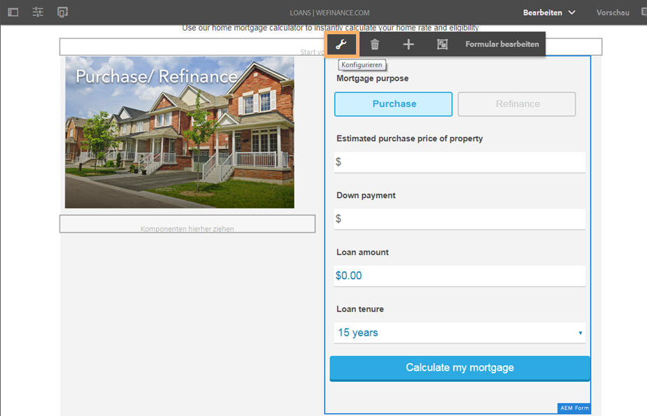

# Konfigurieren von Microsoft Dynamics 365 für den Hypotheken-Workflow der We.Finance-Referenz-Site {#configure-microsoft-dynamics-for-the-home-mortgage-workflow-of-the-we-finance-reference-site}

Erfahren Sie, wie Sie die Microsoft® Dynamics 365-Dienste über adaptive Formulare für den Hypotheken-Workflow der We.Finance-Referenz-Site verwenden.

## Übersicht {#overview}

Microsoft® Dynamics 365 ist eine Customer Relationship Management(CRM)- und Enterprise Resource Planning(ERP)-Software, die Enterprise-Lösungen zum Erstellen und Verwalten von Kundenkonten, Kontakten, Leads, Chancen und Fällen bereitstellt.

AEM Forms bietet einen Cloud-Service zur Integration von Dynamics 365 mit dem Modul [Datenintegration für AEM Forms](/help/forms/using/data-integration.md) an. Bevor Sie die schrittweise Anleitung zum Hypothekantrag mit Microsoft® Dynamics verwenden können, müssen Sie Microsoft® Dynamics 365 konfigurieren, damit es mit der We.Finance-Referenzwebsite verwendet werden kann.

## Voraussetzungen {#prerequisites}

Stellen Sie sicher, dass Sie über Folgendes verfügen, bevor Sie Dynamics 365 einrichten und konfigurieren:

* AEM Forms 6.3 Service Pack 1 und höher
* Microsoft® Dynamics 365-Konto
* Registrierte Anwendung für den Dynamics 365-Dienst mit Microsoft® Azure Active Directory
* Client-ID und Client-Geheimnis für die registrierte Anwendung

## Verknüpfen des Hypothekenrechners mit Ihrer Site-Homepage {#link-the-home-mortgage-calculator-with-your-site-home-page}

1. Navigieren Sie in der Autoreninstanz zu der folgenden Seite:

   `https://[server]:[port]/editor.html/content/we-finance/global/en/loan-landing-page.html`

1. Scrollen Sie nach unten zum Hypothekenrechner.
1. Markieren Sie das Bedienfeld der rechten Spalte (Rechner) und treffen Sie eine Auswahl, um das Popup-Menü anzuzeigen. Wählen Sie im Popup-Menü die Option „Konfigurieren“ aus. Das Dialogfeld „AEM Forms-Container bearbeiten“ wird angezeigt.

   

1. Navigieren Sie im Dialogfeld „AEM Forms-Container bearbeiten“ zum Asset-Pfad, wählen Sie den Hypothekenrechner unter dem folgenden Pfad und dann **Bestätigen** aus:

   formsanddocuments/We.Finance/MS Dynamics/

   

1. Wählen Sie **Fertig**.
1. Veröffentlichen Sie die bearbeitete Seite.

   >[!NOTE]
   >
   >Die Bindung der Rechnerfelder mit dem FDM ist über das We.Finance-Referenz-Site-Paket vorkonfiguriert. Um sich die Bindungen anzusehen, können Sie das Formular im Bearbeitungsmodus öffnen und die Feldbindungsverweise anzeigen.

1. Um eine benutzerdefinierte Entität zum Speichern des Antragsteller-Datensatzes für den Hypothekenantrag zu erstellen, importieren Sie das Lösungspaket „AEMFormsFSIRefsite_1_0.zip“ in Ihre Microsoft® Dynamics-Instanz:

   1. Laden Sie das Paket herunter von:

      `https://'[server]:[port]'/content/aemforms-refsite-collaterals/we-finance/home-mortgage/ms-dynamics/AEMFormsFSIRefsite_1_0.zip`

   1. Importieren Sie das Lösungspaket in Ihre Microsoft® Dynamics-Instanz. Navigieren Sie in Ihrer Microsoft® Dynamics-Instanz zu **Einstellungen** > **Lösungen** und wählen Sie **Importieren** aus.

1. Um die auf der Referenz-Site verwendeten Benutzerkontaktdaten einzurichten, importieren Sie das Paket „Sarah Rose Contact.CSV“ in Ihre Microsoft® Dynamics-Instanz:

   1. Laden Sie das Paket herunter von:

      `https://'[server]:[port]'/content/aemforms-refsite-collaterals/we-finance/home-mortgage/ms-dynamics/Sarah%20Rose%20Contact.csv`

   1. Importieren Sie das Paket in Ihre Microsoft® Dynamics-Instanz. Navigieren Sie in Ihrer Microsoft® Dynamics-Instanz zu **Verkauf** > **Kontakte** und wählen Sie dann **Daten importieren** aus.
