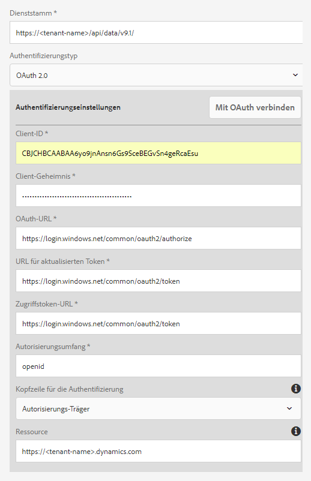

# Microsoft Dynamics OData-Konfiguration{#microsoft-dynamics-odata-configuration}


Microsoft Dynamics ist eine Customer Relationship Management(CRM)- und Enterprise Resource Planning(ERP)-Software, die Enterprise-Lösungen zum Erstellen und Verwalten von Kundenkonten, Kontakten, Leads, Chancen und Fällen bereitstellt. [AEM Forms Data Integration](../../forms/using/data-integration.md) bietet eine OData-Cloud-Service-Konfiguration für die Integration von Formularen mit Online- und lokalen Microsoft Dynamics-Servern. Mit dieser Funktion können Sie ein Formulardatenmodell basierend auf den im Microsoft Dynamics-Dienst definierten Entitäten, Attributen und Diensten erstellen. Das Formulardatenmodell kann verwendet werden, um adaptive Formulare zu erstellen, die mit Microsoft Dynamics Server interagieren, um Geschäfts-Workflows zu ermöglichen. Beispiel:

* Abfragen des Microsoft Dynamics-Servers nach Daten und Vorausfüllen der adaptiven Formulare
* Schreiben von Daten in Microsoft Dynamics bei der Sendung von adaptiven Formularen
* Schreiben von Daten in Microsoft Dynamics durch benutzerdefinierte Entitäten, die im Formulardatenmodell definiert sind und umgekehrt

AEM Forms beinhaltet auch ein Add-on-Paket für die OData-Referenzkonfiguration, mit der Sie Microsoft Dynamics schnell in AEM Forms integrieren können.

Wenn das Paket installiert ist, werden die folgenden Entitäten und Dienste in Ihrer AEM Forms-Instanz bereitgestellt:

* MS Dynamics OData Cloud-Dienst (OData Service)
* Formulardatenmodell mit vorkonfigurierten Microsoft Dynamics-Entitäten und -Services.

Vorkonfigurierte Microsoft Dynamics-Entitäten und -Services in einem Formulardatenmodell sind nur dann in Ihrer AEM Forms-Instanz verfügbar, wenn der Ausführungsmodus für die AEM-Instanz auf `samplecontent` (Standard) festgelegt ist. MS Dynamics OData Cloud Service (OData Service) ist auch für andere Ausführungsmodi verfügbar. Weitere Informationen zum Konfigurieren von Ausführungsmodi für eine AEM-Instanz finden Sie unter [Ausführungsmodi](/help/sites-deploying/configure-runmodes.md).

## Voraussetzungen {#prerequisites}

Bevor Sie mit dem Einrichten und Konfigurieren von Microsoft Dynamics beginnen, stellen Sie sicher, dass folgende Bedingungen erfüllt sind:

* [AEM Forms-Add-on-Paket](../../forms/using/installing-configuring-aem-forms-osgi.md) wurde installiert.
* Microsoft Dynamics 365 online wurde konfiguriert oder eine Instanz einer der folgenden Microsoft Dynamics-Versionen wurde installiert:

   * Microsoft Dynamics 365 lokal
   * Microsoft Dynamics 2016 lokal

* [Das Programm wurde für den Microsoft Dynamics-Online-Service bei Microsoft Azure Active Directory registriert](https://docs.microsoft.com/de-de/dynamics365/customer-engagement/developer/walkthrough-register-dynamics-365-app-azure-active-directory). Notieren Sie sich die Werte für die Client-ID (die auch als Anwendungs-ID bezeichnet wird) und den geheimen Clientschlüssel für den registrierten Service. Diese Werte werden während dem [Konfigurieren des Cloud-Diensts für Ihren Microsoft Dynamics-Dienst](../../forms/using/ms-dynamics-odata-configuration.md#configure-cloud-service-for-your-microsoft-dynamics-service) verwendet.

## Legen Sie die Antwort-URL für eine registrierte Microsoft Dynamics-Anwendung fest {#set-reply-url-for-registered-microsoft-dynamics-application}

Gehen Sie folgendermaßen vor, um die Antwort-URL für eine registrierte Microsoft Dynamics-Anwendung festzulegen:

>[!NOTE]
>
>Verwenden Sie dieses Verfahren nur, wenn Sie AEM Forms in einen Microsoft Dynamics-Online-Server integrieren.

1. Wechseln Sie zu einem Microsoft Azure Active Directory-Konto und fügen Sie in den Einstellungen für **Antwort-URLs** für Ihre registrierte Anwendung die folgende Cloud-Service-Konfigurations-URL hinzu:

   `https://'[server]:[port]'/libs/fd/fdm/gui/components/admin/fdmcloudservice/createcloudconfigwizard/cloudservices.html`

   

1. Speichern Sie die Konfiguration.

## Konfigurieren Sie Microsoft Dynamics für IFD {#configure-microsoft-dynamics-for-ifd}

Microsoft Dynamics verwendet die anspruchsbasierte Authentifizierung, um externen Benutzern den Zugriff auf Daten auf dem Microsoft Dynamics CRM-Server zu ermöglichen. Führen Sie die folgenden Schritte aus, um Microsoft Dynamics für Bereitstellung mit Internetzugriff (IFD) zu konfigurieren und Schadenseinstellungen zu konfigurieren.

>[!NOTE]
>
>Verwenden Sie dieses Verfahren nur, wenn Sie AEM Forms in einen Microsoft Dynamics-Server vor Ort integrieren.

1. Konfigurieren Sie die lokale Microsoft Dynamics-Instanz für IFD, wie in [Konfigurieren von IFD für Microsoft Dynamics](https://technet.microsoft.com/de-de/library/dn609803.aspx) beschrieben.
1. Führen Sie die folgenden Befehle mit Windows PowerShell aus, um die Anspruchseinstellungen für IFD-aktiviertes Microsoft Dynamics zu konfigurieren:

   ```shell
   Add-PSSnapin Microsoft.Crm.PowerShell
    $ClaimsSettings = Get-CrmSetting -SettingType OAuthClaimsSettings
    $ClaimsSettings.Enabled = $true
    Set-CrmSetting -Setting $ClaimsSettings
   ```

   Weitere Informationen finden Sie unter [App-Registrierung für CRM lokal (IFD)](https://msdn.microsoft.com/de-de/library/dn531010(v=crm.7).aspx#bkmk_ifd).

## Konfigurieren des OAuth-Clients auf einem AD FS-Computer {#configure-oauth-client-on-ad-fs-machine}

Führen Sie die folgenden Schritte aus, um einen OAuth-Client auf einem AD FS (Active Directory Federation Services)-Computer zu registrieren und Zugriff auf den AD FS-Computer zu erteilen:

>[!NOTE]
>
>Verwenden Sie dieses Verfahren nur, wenn Sie AEM Forms in einen Microsoft Dynamics-Server vor Ort integrieren.

1. Führen Sie den folgenden Befehl aus:

   `Add-AdfsClient -ClientId “<Client-ID>” -Name "<name>" -RedirectUri "<redirect-uri>" -GenerateClientSecret`

   Dabei ist:

   * `Client-ID` eine Client-ID, die Sie mit einem beliebigen GUID-Generator generieren können.
   * `redirect-uri` ist die URL zum Microsoft Dynamics OData Cloud-Dienst auf AEM Forms. Der mit dem AEM Forms-Paket installierte standardmäßige Cloud-Service wird unter der folgenden URL bereitgestellt:
      `https://'[server]:[port]'/libs/fd/fdm/gui/components/admin/fdmcloudservice/createcloudconfigwizard/cloudservices.html`

1. Führen Sie den folgenden Befehl aus, um Zugriff auf den AD FS-Computer zu gewähren:

   `Grant-AdfsApplicationPermission -ClientRoleIdentifier “<Client-ID>” -ServerRoleIdentifier <resource> -ScopeNames openid`

   Dabei ist:

   * `resource` ist die Microsoft Dynamics-Organisations-URL.

1. Microsoft Dynamics verwendet das HTTPS-Protokoll. Um AD FS-Endpunkte über den Forms-Server aufzurufen, installieren Sie das Microsoft Dynamics-Websitezertifikat mithilfe des Befehls `keytool` auf dem Computer, auf dem AEM Forms ausgeführt wird, im Java-Zertifikatspeicher.

## Konfigurieren Sie den Cloud-Dienst für Ihren Microsoft Dynamics-Dienst {#configure-cloud-service-for-your-microsoft-dynamics-service}

Die Konfiguration **MS Dynamics OData Cloud Service (OData Service)** wird mit der Standard-OData-Konfiguration geliefert. Gehen Sie wie folgt vor, um ihn für die Verbindung mit Ihrem Microsoft Dynamics -Dienst zu konfigurieren.

1. Navigieren Sie zu **[!UICONTROL Tools > Cloud-Services > Datenquellen]** und tippen Sie auf den Konfigurationsordner `global`.
1. Wählen Sie die **MS Dynamics OData Cloud-Dienst (OData Service)**-Konfiguration und tippen Sie auf **[!UICONTROL Eigenschaften]**. Das Dialogfeld „Eigenschaften der Cloud-Dienstkonfiguration“ wird geöffnet.

   Auf der Registerkarte **Authentifizierungseinstellungen**:

   1. Geben Sie den Wert für das Feld **Service-Stamm** ein. Wechseln Sie zur Dynamics-Instanz und navigieren Sie zu **Entwickler-Ressourcen**, um den Wert für das Feld „Service-Stamm“ anzuzeigen. Beispiel: https://&lt;tenant-name>/api/data/v9.1/

   1. Ersetzen Sie die Standardwerte in der **Client ID** (auch als **Application ID** bezeichnet), die Felder **Client Secret**, **OAuth URL**, **Refresh Token URL**, **Access Token URL** und **Resource** mit Werten aus Ihrer Microsoft Dynamics-Dienstkonfiguration. Sie müssen die Dynamics-Instanz-URL im Feld **Ressource** angeben, um Microsoft Dynamics mit einem Formulardatenmodell zu konfigurieren. Verwenden Sie die Service-Stamm-URL, um die URL der Dynamics-Instanz abzuleiten. Beispiel: [https://org.crm.dynamics.com](https://org.crm.dynamics.com/).

   1. Geben Sie die **openid** im Feld **Autorisierungsumfang** für den Autorisierungsprozess auf Microsoft Dynamics an.

   

1. Klicken Sie auf **[!UICONTROL Verbindung zu OAuth herstellen]**. Sie werden zur Anmeldungsseite von Microsoft Dynamics umgeleitet.
1. Melden Sie sich mit Ihren Microsoft Dynamics-Anmeldeinformationen an und lassen Sie zu, dass die Cloud-Service-Konfiguration eine Verbindung zum Microsoft Dynamics-Service herstellen kann. Es ist eine einmalige Aufgabe, die Verbindung zwischen dem Cloud-Dienst und dem Dienst herzustellen.

   Sie werden dann auf die Cloud-Dienstkonfigurationsseite weitergeleitet, auf der eine Meldung angezeigt wird, dass die OData-Konfiguration erfolgreich gespeichert wurde.

Der MS Dynamics OData-Cloud Service (OData Service) ist konfiguriert und mit Ihrem Dynamics-Service verbunden.

## Erstellen des Formulardatenmodells {#create-form-data-model}

Wenn Sie das AEM Forms-Paket installieren, wird ein Formulardatenmodell, **Microsoft Dynamics FDM**, in Ihrer AEM-Instanz bereitgestellt. Standardmäßig verwendet das Formulardatenmodell den Microsoft Dynamics-Service, der im MS Dynamics ODaten-Cloud-Service (ODaten-Service) konfiguriert ist, als Datenquelle.

Beim ersten Öffnen des Formulardatenmodells verbindet es sich mit dem konfigurierten Microsoft Dynamics-Dienst und ruft Entitäten von Ihrer Microsoft Dynamics-Instanz auf. Die Entitäten „contact“ und „lead“ von Microsoft Dynamics sind bereits im Datenmodell des Formulars enthalten.

Um das Formulardatenmodell zu überprüfen, navigieren Sie zu **[!UICONTROL Formulare > Datenintegrationen]**. Wählen Sie **MS Dynamics FDM** und klicken Sie auf **Bearbeiten**, um das Formulardatenmodell im Bearbeitungsmodus zu öffnen. Alternativ können Sie das Formulardatenmodell direkt über die folgende URL öffnen:

`https://'[server]:[port]'/aem/fdm/editor.html/content/dam/formsanddocuments-fdm/ms-dynamics-fdm`


Anschließend können Sie ein adaptives Formular auf der Grundlage des Formulardatenmodells erstellen und es in verschiedenen Anwendungsfällen für adaptive Formulare verwenden, wie z. B.:

* Adaptives Formulars durch Abfrage von Informationen aus Microsoft Dynamics-Entitäten und Dienste befüllen
* Aufrufen von Microsoft Dynamics-Server-Prozessen, die in einem Formulardatenmodell definiert sind, unter Verwendung adaptiver Formularregeln
* Gesendete Formulardaten in Microsoft Dynamics-Entitäten schreiben

Es wird empfohlen, eine Kopie des mit dem AEM Forms-Paket mitgelieferten Formulardatenmodells zu erstellen und Datenmodelle und Dienste entsprechend Ihren Anforderungen zu konfigurieren. Das stellt sicher, dass zukünftige Aktualisierungen des Pakets Ihr Formulardatenmodell nicht überschreiben.

Weitere Informationen zur Erstellung und Verwendung des Formulardatenmodells in Business Workflows finden Sie unter [Datenintegration](../../forms/using/data-integration.md).
