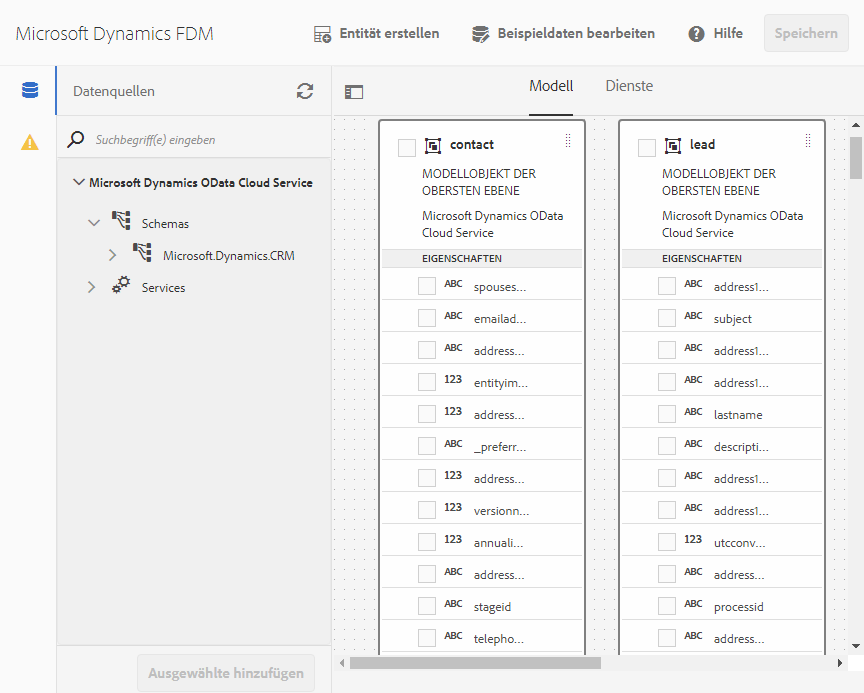

# Microsoft Dynamics OData-Konfiguration{#microsoft-dynamics-odata-configuration}


Microsoft Dynamics ist eine Customer Relationship Management(CRM)- und Enterprise Resource Planning(ERP)-Software, die Enterprise-Lösungen zum Erstellen und Verwalten von Kundenkonten, Kontakten, Leads, Chancen und Fällen bereitstellt. [AEM Forms Data Integration](../../forms/using/data-integration.md) bietet eine OData-Cloud-Service-Konfiguration für die Integration von Formularen mit Online- und lokalen Microsoft Dynamics-Servern. Mit dieser Funktion können Sie ein Formulardatenmodell basierend auf den im Microsoft Dynamics-Dienst definierten Entitäten, Attributen und Diensten erstellen. Das Formulardatenmodell kann verwendet werden, um adaptive Formulare zu erstellen, die mit dem Microsoft Dynamics-Server interagieren, um Workflows zu ermöglichen. Beispiel:

* Abfrage Microsoft Dynamics-Server für Daten und Vorausfüllen adaptiver Formulare
* Daten beim Senden adaptiver Formulare in Microsoft Dynamics schreiben
* Daten in Microsoft Dynamics durch benutzerdefinierte Entitäten im Formulardatenmodell schreiben und umgekehrt

Das Add-On-Paket für AEM Forms enthält außerdem eine Referenz-OData-Konfiguration, die Sie verwenden können, um Microsoft Dynamics schnell mit AEM Forms zu integrieren.

Wenn das Paket installiert ist, werden die folgenden Entitäten und Dienste in Ihrer AEM Forms-Instanz bereitgestellt:

* MS Dynamics OData Cloud-Dienst (OData Service)
* Formulardatenmodell mit vorkonfigurierten Microsoft Dynamics-Entitäten und -Diensten.

The OData Cloud Service and form data model with preconfigured Microsoft Dynamics entities and services are available on your AEM Forms instance only if the run mode for the AEM instance is set as `samplecontent`(default). Weitere Informationen zum Konfigurieren von Ausführungsmodi für eine AEM-Instanz finden Sie unter [Ausführungsmodi](/help/sites-deploying/configure-runmodes.md).

## Voraussetzungen {#prerequisites}

Bevor Sie mit dem Einrichten und Konfigurieren von Microsoft Dynamics beginnen, stellen Sie sicher, dass folgende Bedingungen erfüllt sind:

* Installed the [AEM Forms add-on package](../../forms/using/installing-configuring-aem-forms-osgi.md)
* Microsoft Dynamics 365 online wurde konfiguriert oder eine Instanz einer der folgenden Microsoft Dynamics-Versionen wurde installiert:

   * Microsoft Dynamics 365 lokal
   * Microsoft Dynamics 2016 lokal

* [Registrierte die Anwendung für Microsoft Dynamics Online-Dienst mit Microsoft Azurblase Active Directory](https://docs.microsoft.com/en-us/dynamics365/customer-engagement/developer/walkthrough-register-dynamics-365-app-azure-active-directory). Notieren Sie sich die Werte für die Client-ID (auch als Anwendungs-ID bezeichnet) und das Clientgeheimnis für den registrierten Dienst. Diese Werte werden während dem [Konfigurieren des Cloud-Diensts für Ihren Microsoft Dynamics-Dienst](../../forms/using/ms-dynamics-odata-configuration.md#configure-cloud-service-for-your-microsoft-dynamics-service) verwendet.

## Legen Sie die Antwort-URL für eine registrierte Microsoft Dynamics-Anwendung fest {#set-reply-url-for-registered-microsoft-dynamics-application}

Gehen Sie folgendermaßen vor, um die Antwort-URL für eine registrierte Microsoft Dynamics-Anwendung festzulegen:

>[!NOTE]
>
>Verwenden Sie dieses Verfahren nur, wenn Sie AEM Forms in einen Microsoft Dynamics-Online-Server integrieren.

1. Go to Microsoft Azure Active Directory account and add the following cloud service configuration URL in **Reply URLs** settings for your registered application:

   `https://'[server]:[port]'/libs/fd/fdm/gui/components/admin/fdmcloudservice/createcloudconfigwizard/cloudservices.html`

   

1. Speichern Sie die Konfiguration.

## Konfigurieren Sie Microsoft Dynamics für IFD {#configure-microsoft-dynamics-for-ifd}

Microsoft Dynamics verwendet die anspruchsbasierte Authentifizierung, um externen Benutzern den Zugriff auf Daten auf dem Microsoft Dynamics CRM-Server zu ermöglichen. Führen Sie die folgenden Schritte aus, um Microsoft Dynamics für Bereitstellung mit Internetzugriff (IFD) zu konfigurieren und Schadenseinstellungen zu konfigurieren.

>[!NOTE]
>
>Verwenden Sie dieses Verfahren nur, wenn Sie AEM Forms in einen Microsoft Dynamics-Server vor Ort integrieren.

1. Configure Microsoft Dynamics on-premises instance for IFD as described in [Configure IFD for Microsoft Dynamics](https://technet.microsoft.com/en-us/library/dn609803.aspx).
1. Führen Sie die folgenden Befehle mit Windows PowerShell aus, um die Anspruchseinstellungen für IFD-aktiviertes Microsoft Dynamics zu konfigurieren:

   ```
   Add-PSSnapin Microsoft.Crm.PowerShell
    $ClaimsSettings = Get-CrmSetting -SettingType OAuthClaimsSettings
    $ClaimsSettings.Enabled = $true
    Set-CrmSetting -Setting $ClaimsSettings
   ```

   See [App registration for CRM on-premises (IFD)](https://msdn.microsoft.com/sl-si/library/dn531010(v=crm.7).aspx#bkmk_ifd) for details.

## Konfigurieren des OAuth-Clients auf dem AD FS-Computer {#configure-oauth-client-on-ad-fs-machine}

Führen Sie die folgenden Schritte aus, um einen OAuth-Client auf einem Active Directory Federation Services(AD FS)-Computer zu registrieren und Zugriff auf den AD FS-Computer zu gewähren:

>[!NOTE]
>
>Verwenden Sie dieses Verfahren nur, wenn Sie AEM Forms in einen Microsoft Dynamics-Server vor Ort integrieren.

1. Führen Sie folgenden Befehl aus:

   `Add-AdfsClient -ClientId “<Client-ID>” -Name "<name>" -RedirectUri "<redirect-uri>" -GenerateClientSecret`

   wobei:

   * `Client-ID` ist eine Client-ID, die Sie mit einem beliebigen GUID-Generator generieren können.
   * `redirect-uri` ist die URL zum Microsoft Dynamics OData Cloud-Dienst auf AEM Forms. Der mit dem AEM Forms-Paket installierte Standard-Cloud-Dienst wird unter folgender URL bereitgestellt:
      `https://'[server]:[port]'/libs/fd/fdm/gui/components/admin/fdmcloudservice/createcloudconfigwizard/cloudservices.html`

1. Führen Sie den folgenden Befehl aus, um Zugriff auf den AD FS-Computer zu gewähren:

   `Grant-AdfsApplicationPermission -ClientRoleIdentifier “<Client-ID>” -ServerRoleIdentifier <resource> -ScopeNames openid`

   wobei:

   * `resource` ist die Microsoft Dynamics-Organisations-URL.

1. Microsoft Dynamics verwendet das HTTPS-Protokoll. Um AD FS-Endpunkte über den Forms-Server aufzurufen, installieren Sie das Microsoft Dynamics-Websitezertifikat mithilfe des Befehls `keytool` auf dem Computer, auf dem AEM Forms ausgeführt wird, im Java-Zertifikatspeicher.

## Konfigurieren Sie den Cloud-Dienst für Ihren Microsoft Dynamics-Dienst {#configure-cloud-service-for-your-microsoft-dynamics-service}

The **MS Dynamics OData Cloud Service (OData Service)** configuration comes with default OData configuration. Gehen Sie wie folgt vor, um ihn für die Verbindung mit Ihrem Microsoft Dynamics -Dienst zu konfigurieren.

1. Navigate to **[!UICONTROL Tools > Cloud Services > Data Sources]**, and tap the `global` configuration folder.
1. Wählen Sie die **MS Dynamics OData Cloud-Dienst (OData Service)**-Konfiguration und tippen Sie auf **[!UICONTROL Eigenschaften]**. Das Dialogfeld „Eigenschaften der Cloud-Dienstkonfiguration“ wird geöffnet.

   Auf der Registerkarte **Authentifizierungseinstellungen**:

   1. Geben Sie den Wert für das Feld **Dienststamm** ein. Go to the Dynamics instance and navigate to **Developer Resources** to view the value for the Service Root field. Beispiel: https://

   1. Ersetzen Sie die Standardwerte in der **Client ID** (auch als **Application ID** bezeichnet), die Felder **Client Secret**, **OAuth URL**, **Refresh Token URL**, **Access Token URL** und **Resource** mit Werten aus Ihrer Microsoft Dynamics-Dienstkonfiguration. It is mandatory to specify the dynamics instance URL in the **Resource** field to configure Microsoft Dynamics with a form data model. Verwenden Sie die Dienststamm-URL, um die URL der dynamischen Instanz abzuleiten. For example, [https://org.crm.dynamics.com](https://org.crm.dynamics.com/).

   1. Specify **openid** in the **Authorization Scope** field for authorization process on Microsoft Dynamics.
   

1. Klicken Sie auf **[!UICONTROL Verbindung zu OAuth herstellen]**. Sie werden zur Anmeldungsseite von Microsoft Dynamics umgeleitet.
1. Melden Sie sich mit Ihren Microsoft Dynamics-Anmeldedaten an und akzeptieren Sie, dass die Konfiguration des Cloud-Dienstes eine Verbindung zum Microsoft Dynamics-Dienst herstellen kann. Es ist eine einmalige Aufgabe, die Verbindung zwischen dem Cloud-Dienst und dem Dienst herzustellen.

   Sie werden dann auf die Cloud-Dienstkonfigurationsseite weitergeleitet, auf der eine Meldung angezeigt wird, dass die OData-Konfiguration erfolgreich gespeichert wurde.

Der MS Dynamics OData Cloud-Dienst (OData Service) ist konfiguriert und mit Ihrem Dynamics-Dienst verbunden.

## Formulardatenmodell erstellen {#create-form-data-model}

When you install the AEM Forms package, a form data model,**Microsoft Dynamics FDM**, is deployed on your AEM instance. Standardmäßig verwendet das Formulardatenmodell den Microsoft Dynamics-Dienst, der im MS Dynamics OData Cloud-Dienst (ODData Service) als Datenquelle konfiguriert ist.

Beim ersten Öffnen des Formulardatenmodells verbindet es sich mit dem konfigurierten Microsoft Dynamics-Dienst und ruft Entitäten von Ihrer Microsoft Dynamics-Instanz auf. Die Entitäten „contact“ und „lead“ von Microsoft Dynamics sind bereits im Datenmodell des Formulars enthalten.

Um das Formulardatenmodell zu überprüfen, navigieren Sie zu **[!UICONTROL Formulare > Datenintegrationen]**. Wählen Sie **MS Dynamics FDM** und klicken Sie auf **Bearbeiten**, um das Formulardatenmodell im Bearbeitungsmodus zu öffnen. Alternativ können Sie das Formulardatenmodell auch direkt über die folgende URL öffnen:

`https://'[server]:[port]'/aem/fdm/editor.html/content/dam/formsanddocuments-fdm/ms-dynamics-fdm`



Als Nächstes können Sie ein adaptives Formular basierend auf dem Formulardatenmodell erstellen und es in verschiedenen Anwendungsfällen für adaptive Formulare verwenden, z. B.:

* Adaptives Formulars durch Abfrage von Informationen aus Microsoft Dynamics-Entitäten und Dienste befüllen
* Aufrufen von Microsoft Dynamics-Servervorgängen, die in einem Formulardatenmodell mithilfe von Regeln für adaptive Formulare definiert wurden
* Gesendete Formulardaten in Microsoft Dynamics-Entitäten schreiben

Es wird empfohlen, eine Kopie des mit dem AEM Forms-Paket mitgelieferten Formulardatenmodells zu erstellen und Datenmodelle und Dienste entsprechend Ihren Anforderungen zu konfigurieren. Das stellt sicher, dass zukünftige Aktualisierungen des Pakets Ihr Formulardatenmodell nicht überschreiben.

Weitere Informationen zur Erstellung und Verwendung des Formulardatenmodells in Business Workflows finden Sie unter [ Datenintegration](../../forms/using/data-integration.md).
