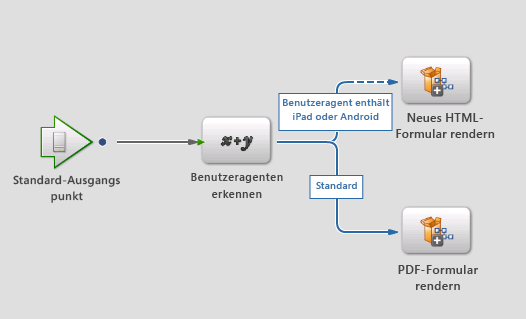
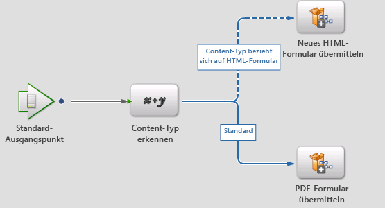

# Neuer Wiedergabe- und Sendedienst{#new-render-and-submit-service}

## Einführung {#introduction}

Wenn Sie in Workbench einen `AssignTask`--Vorgang definieren, geben Sie ein bestimmtes Formular (XDP- oder PDF-Formular) an. Geben Sie außerdem über ein Aktionsprofil einen Satz von Wiedergabe- und Sendediensten an.

XDP kann als PDF-Formular oder als HTML-Format wiedergegeben werden. Die neuen Funktionen enthalten folgende Möglichkeiten:

* Wiedergeben und Senden eines XDP-Formulars als HTML
* Wiedergeben und Senden eines XDP-Formulars als PDF auf dem Desktop und als HTML auf mobilen Geräten (beispielsweise auf einem iPad)

### Neuer HTML-Forms-Dienst {#new-html-forms-service}

Der neue HTML-Forms-Dienst nutzt die neue Funktion in Forms, um die Wiedergabe von XDP-Formularen als HTML zu unterstützen. Der neue HTML-Forms-Dienst macht die folgenden Methoden verfügbar:

```java
/*
 * Generates a URL (for the HTML Form) to be passed to client, given a TaskContext.
 * The output of this API is something like this - /lc/content/xfaforms/profiles/default.ws.html?ContentRoot=repository://Applications/MyApplication/MyFolder&template=MyForm.xdp
 * @param taskContext task context
 * @param profileName Forms servlet URL.
 * @return form URL string
 */
public String generateFormURL(TaskContext taskContext, String profileName);

/*
 * Render the XDP Form as HTML. Can be used directly for updating the runtimeMap in render.
 * It adds the following keys to the map -
 * hint:new html form = true
 * newHTMLFormURL = the URL returned after calling 'generateFormURL' API.
 * @param TaskContext taskContext
 * @param profileName Forms servlet URL.
 * @param runtimeMap runtime map<string,object> associated with form rendering.
 * return runtimeMap
 */
public Map<String, Object> renderHTMLForm (TaskContext taskContext, String profileName, Map<String,Object> runtimeMap);
```

Weitere Informationen über Mobile Form-Profile finden Sie unter [Erstellen eines benutzerdefinierten Profils](/help/forms/using/custom-profile.md).

## Neue Wiedergabe- und Sendedienste für HTML-Formulare {#new-html-form-render-amp-submit-processes}

Bei jedem „AssignTask“-Vorgang geben Sie einen Wiedergabe- und Sendeprozess für das Formular an. Diese Prozesse werden von den TaskManager-APIs `renderForm` und `submitForm` aufgerufen, um benutzerdefinierte Behandlung zu ermöglichen. Semantik dieser Prozesse für neue HTML-Formulare:

### Wiedergeben eines neuen HTML-Formulars  {#render-a-new-html-form}

Der neue Prozess zum Wiedergeben von HTML hat wie jeder Wiedergabeprozess die folgenden E/A-Parameter –

Eingabe - `taskContext`

Ausgabe - `runtimeMap`

Ausgabe - `outFormDoc`

Diese Methode simuliert das genaue Verhalten der `renderHTMLForm`-API des neuen HTML-Forms-Dienstes. Sie ruft die `generateFormURL`-API auf, um die URL für die HTML-Darstellung des Formulars zu erhalten. Dann wird die runtimeMap mit folgendem Schlüssel oder Werten aufgefüllt:

new html form = true

newHTMLFormURL = die URL, die nach dem Aufruf der `generateFormURL`-API zurückgegeben wurde.

### Senden eines neuen HTML-Formulars {#submit-a-new-html-form}

Dieser Prozess zum Senden eines neuen HTML-Formulars verwendet die folgenden E/A-Parameter –

Eingabe - `taskContext`

Ausgabe - `runtimeMap`

Ausgabe - `outputDocument`

Der Prozess setzt `outputDocument`auf den `inputDocument`aus `taskContext` abgerufenen Wert.

## Standardmäßige Wiedergabe- oder Sendeprozesse und Aktionsprofile {#default-render-or-submit-processes-and-action-profiles}

Die standardmäßigen Wiedergabe- und Sendeprozesse bieten Unterstützung für die Wiedergabe von PDF-Dateien auf einem Desktop und von HTML auf mobilen Geräten (iPad).

### Standardwiedergabeformular  {#default-render-form}

Dieser Prozess gibt ein XDP-Formular nahtlos auf mehreren Plattformen wieder. Der Prozess ruft den Benutzer-Agenten von `taskContext` ab und verwendet die Daten, um den Prozess zur Wiedergabe von entweder HTML oder PDF aufzurufen.



### Standardsendeformular {#default-submit-form}

Dieser Prozess sendet ein XDP-Formular nahtlos auf mehreren Plattformen. Er ruft den Benutzer-Agenten von `taskContext` ab und verwendet die Daten, um den Prozess zum Senden von HTML oder PDF aufzurufen.



## Ändern der Wiedergabe mobiler Formulare von PDF in HTML {#switch-the-rendering-of-mobile-forms-from-pdf-to-html}

Browser nehmen allmählich die Unterstützung für NPAPI-basierte Plug-ins zurück. Das betrifft auch Zusatzmodule für Adobe Acrobat und Adobe Reader. Sie können die Wiedergabe mobiler Formulare von PDF in HTML folgendermaßen ändern:

1. Melden Sie sich bei Workbench mit gültigen Benutzerdaten an.
1. Wählen Sie **File** > **Get Applications**.

   Das Dialogfeld „Anwendungen abrufen“ wird angezeigt.

1. Wählen Sie die Anwendungen aus, für die Sie die Wiedergabe des mobilen Formulars ändern möchten, und klicken Sie auf **OK**.
1. Öffnen Sie den Prozess, für den Sie die Wiedergabe ändern möchten.
1. Öffnen Sie den/die zielgerichtete/n Startpunkt/Aufgabe, navigieren Sie zum Abschnitt für Präsentation und Daten und klicken Sie auf **Aktionsprofile verwalten**.

   Das Dialogfeld &quot;Aktionsprofile verwalten&quot;wird angezeigt.
1. Ändern Sie die standardmäßigen Render-Profilkonfigurationen von PDF in HTML und klicken Sie auf **OK**.
1. Checken Sie den Prozess ein.
1. Wiederholen Sie diese Schritte, um die Wiedergabe für andere Prozesse zu ändern.
1. Stellen Sie die Anwendung für die geänderten Prozesse.

### Standardaktionsprofil  {#default-action-profile}

Das Standardaktionsprofil gab das XDP-Formular als PDF wieder. Dieses Verhalten wurde geändert, sodass jetzt die Prozesse Standardwiedergabeformular und Standardsendeformular verwendet werden.

Einige häufig gestellte Fragen zu Aktionsprofilen lauten wie folgt:

 **Welche Wiedergabe-/Sendeprozesse sind standardmäßig verfügbar?**

* Render Guide (Guides werden nicht mehr unterstützt)
* Render Form Guide
* Render PDF Form
* Render HTML Form
* Render New HTML Form (neu)
* Default Render Form (neu)

Sowie entsprechende Sendeprozesse.

 **Welche Aktionsprofile sind standardmäßig verfügbar?**

Für XDP-Formulare:

* Standard (Wiedergabe/Senden mithilfe der neuen &quot;Default Render/Submit&quot;-Prozesse)

 **Was muss der Prozessentwickler tun, damit das Formular auf einem Gerät in HTML und auf einem Desktop in PDF gerendert werden kann?**

Nichts. Das Standardaktionsprofil wird automatisch ausgewählt und der Renderingmodus wird ebenfalls automatisch berücksichtigt.

 **Was muss getan werden, um die Wiedergabe des Formulars in HTML auf einem Desktop zu ermöglichen?**

Der Benutzer muss das HTML-Optionsfeld für das Standardprofil auswählen.

 **Wird sich ein Upgrade auf die Änderung des Verhaltens des Standard-Aktionsprofils auswirken?**

Ja, da die vorherigen dem Standardaktionsprofil zugeordneten Wiedergabe- und Sendedienste unterschiedlich waren, werden sie als Anpassung der vorhandenen Formulare behandelt. Beim Klicken auf **Standardangaben wiederherstellen** werden stattdessen die standardmäßigen Wiedergabe- und Sendedienste festgelegt.

Wenn Sie die vorhandenen Wiedergabe- oder Sendedienste für PDF-Formulare geändert oder benutzerdefinierte Dienste (z. B. custom1) erstellt haben und nun dieselbe Funktion für die HTML-Wiedergabe verwenden möchten. Sie müssen den neuen Wiedergabe- oder Sendedienst (z. B. custom2) replizieren und ähnliche Anpassungen anwenden. Ändern Sie nun das Aktionsprofil für Ihre XDP, um custom2-Dienste anstelle von custom1-Diensten zum Wiedergeben oder Senden zu verwenden.

Was muss der Prozessentwickler tun, damit ein Formular auf einem Gerät in HTML und auf einem Desktop in PDF gerendert werden kann?
Was muss der Prozessentwickler tun, damit ein Formular auf einem Gerät in HTML und auf einem Desktop in PDF gerendert werden kann?
