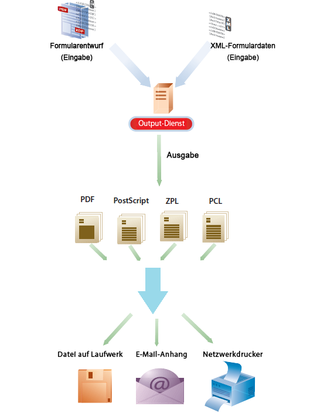

# Ausgabe-Service{#output-service}

## Übersicht {#overview}

Der Output-Dienst ist als OSGi-Dienst Teil der AEM-Dokumentendienste. Der Ausgabedienst unterstützt verschiedene Ausgabeformate und Ausgabedesignfunktionen von AEM Forms Designer. Mit dem Output-Dienst können Sie XFA-Vorlagen und XML-Daten in verschiedene Druckformate konvertieren.

Dabei können Sie mit dem Output-Service Programme mit folgenden Funktionen erstellen:

* Erzeugen fertiger Formulardokumente durch Füllen von Vorlagendateien mit XML-Daten
* Generieren von Ausgabeformularen in verschiedenen Formaten einschließlich nicht interaktiver PDF-, PostScript-, PCL- und ZPL-Druckdatenströme
* Generieren von druckbaren PDFs aus XFA-Formular-PDFs
* Generieren von PDF-, PostScript-, PCL- und ZPL-Dokumenten in großen Mengen durch Zusammenführen mehrerer Datensätze mit den bereitgestellten Vorlagen

>[!NOTE]
>
>Der Ausgabe-Service ist eine 32-Bit-Anwendung. Unter Microsoft Windows darf eine 32-Bit-Anwendung maximal 2 GB Speicher nutzen. Das Limit gilt auch für den Ausgabe-Service.

## Erstellen nicht interaktiver Formulardokumente {#creating-non-interactive-form-documents}

Normalerweise erstellen Sie Vorlagen mit AEM Forms Designer. Mit den APIs `generatePDFOutput` und `generatePrintedOutput` des Output-Dienstes können Sie diese Vorlagen direkt in verschiedene Formate wie PDF, PostScript, ZPL und PCL konvertieren.

Mit `generatePDFOutput` generieren Sie PDF-Dokumente, während `generatePrintedOutput` Dokumente in den Formaten PostScript, ZPL und PCL generiert. Der erste Parameter beider Vorgänge akzeptiert entweder den Namen der Vorlagendatei (z. B. `ExpenseClaim.xdp`) oder ein Dokumentobjekt, das die Vorlage enthält. Wenn Sie den Namen der Vorlagendatei angeben, vergessen Sie nicht, auch den Inhaltsstamm als Pfad zum Vorlagenordner anzugeben. Sie können den Inhaltsstamm entweder mit dem Parameter `PDFOutputOptions` oder dem Parameter `PrintedOutputOptions` angeben. In der Javadoc finden Sie Details zu weiteren Optionen, die Sie mit diesen Parametern angeben können.

Der zweite Parameter akzeptiert ein XML-Dokument, das bei der Generierung des Ausgabedokuments mit der Vorlage zusammengeführt wird.

Der Vorgang `generatePDFOutput` kann als Eingabe auch ein XFA-basiertes PDF-Formular akzeptieren und als Ausgabe eine nicht interaktive Version des PDF-Formulars zurückgeben.

## Generieren nicht interaktiver Formulardokumente {#generating-non-interactive-form-documents}

Angenommen, Sie haben eine oder mehrere Vorlagen und für jede Vorlage mehrere Datensätze mit XML-Daten.

In diesem Fall können Sie mit den Vorgängen `generatePDFOutputBatch` und `generatePrintedOutputBatch` des Output-Dienstes für jeden Datensatz ein Druckdokument erstellen.

Sie können die Datensätze auch in einem einzigen Dokument zusammenfassen. Beide Vorgänge erfordern vier Parameter.

Der erste Parameter ist eine Zuordnung, die eine beliebige Zeichenfolge als Schlüssel und den Namen der Vorlagendatei als Wert enthält.

Der zweite Parameter ist eine andere Zuordnung, deren Wert ein Dokumentenobjekt ist, das XML-Daten enthält. Der Schlüssel ist derselbe, den Sie für den ersten Parameter angegeben haben.

Der dritte Parameter für `generatePDFOutputBatch` oder `generatePrintedOutputBatch` ist vom Typ `PDFOutputOptions` bzw. `PrintedOutputOptions`.

Die Parametertypen sind die gleichen wie die Typen der Parameter für die Vorgänge `generatePDFOutput` und `generatePrintedOutput` und haben die gleiche Auswirkung.

Der vierte Parameter ist vom Typ `BatchOptions`, mit dem Sie angeben, ob für jeden Datensatz eine eigene Datei erzeugt werden kann. Der Standardwert dieses Parameters ist „false“.

Sowohl `generatePrintedOutputBatch` als auch `generatePDFOutputBatch` geben einen Wert vom Typ `BatchResult` zurück. Der Wert enthält eine Liste der generierten Dokumente. Er enthält außerdem ein Metadatendokument im XML-Format, das Informationen zu jedem generierten Dokument enthält.
