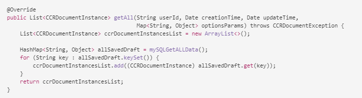

# Interaktive Kommunikation mithilfe der Benutzeroberfläche für Agenten vorbereiten und senden {#prepare-and-send-interactive-communication-using-the-agent-ui}

Über die Benutzeroberfläche der Agenten können die Agenten die interaktive Kommunikation vorbereiten und an den Nachbearbeitungsprozess senden. Der Agent nimmt die erforderlichen Änderungen vor und übergibt die interaktive Kommunikation an einen Nachbearbeitungsprozess, z. B. E-Mail oder Druck.

## Überblick {#overview}

Nachdem eine interaktive Kommunikation erstellt wurde, kann der Agent die interaktive Kommunikation in der Benutzeroberfläche für Agenten öffnen und eine empfängerspezifische Kopie vorbereiten, indem er Daten eingibt und Inhalte und Anlagen verwaltet. Schließlich kann der Agent die interaktive Kommunikation an einen Nachbearbeitungsprozess senden.

Beim Vorbereiten der interaktiven Kommunikation mithilfe der Benutzeroberfläche für Agenten verwaltet der Agent die folgenden Aspekte der interaktiven Kommunikation in der Benutzeroberfläche für Agenten, bevor er sie an einen Nachbearbeitungsprozess sendet:

* **Daten**: Die Registerkarte „Daten“ der Benutzeroberfläche für Agenten zeigt alle vom Agenten bearbeitbaren Variablen und entsperrten Datenmodelleigenschaften in der interaktiven Kommunikation an. Diese Variablen/Eigenschaften werden beim Bearbeiten oder Erstellen von Dokumentfragmenten in der interaktiven Kommunikation erstellt. Die Registerkarte „Daten“ enthält auch alle Felder, die in der XDP/Druckkanalvorlage erstellt wurden. Die Registerkarte &quot;Daten&quot;wird nur angezeigt, wenn Variablen, Formulardatenmodelleigenschaften oder Felder in der interaktiven Kommunikation vorhanden sind, die vom Agenten bearbeitet werden können.
* **Inhalt**: Auf der Registerkarte „Inhalt“ verwalten Sie den Inhalt, z. B. Dokumentfragmente und die Inhaltsvariablen in der interaktiven Kommunikation. Der Agent kann die Änderungen im Dokumentfragment so vornehmen, wie es beim Erstellen der interaktiven Kommunikation in den Eigenschaften dieser Dokumentfragmente zulässig ist. Der Agent kann auch ein Dokumentfragment neu anordnen, hinzufügen/entfernen und Seitenumbrüche hinzufügen, sofern dies zulässig ist.
* **Anhänge**: Die Registerkarte &quot;Anlagen&quot;wird nur dann in der Benutzeroberfläche für Agenten angezeigt, wenn die interaktive Kommunikation über Anlagen verfügt oder der Agent über Bibliothekszugriff verfügt. Der Agent darf die Anlagen ändern oder bearbeiten.

## Vorbereiten der interaktiven Kommunikation mithilfe der Benutzeroberfläche für Agenten {#prepare-interactive-communication-using-the-agent-ui}

1. Wählen Sie **[!UICONTROL Formulare]** > **[!UICONTROL Formulare &amp; Dokumente]**.
1. Wählen Sie die entsprechende interaktive Kommunikation aus und tippen Sie auf **[!UICONTROL Benutzeroberfläche für Agenten öffnen]**.

   >[!NOTE]
   >
   >Die Benutzeroberfläche für Agenten funktioniert nur, wenn die ausgewählte interaktive Kommunikation über einen Druckkanal verfügt.

   

   Basierend auf dem Inhalt und den Eigenschaften der interaktiven Kommunikation wird die Benutzeroberfläche für Agenten mit den folgenden drei Registerkarten angezeigt: Daten, Inhalt und Anlage.

   

   Fahren Sie mit der Dateneingabe, der Verwaltung des Inhalts und der Verwaltung der Anlagen fort.

### Daten eingeben {#enter-data}

1. Geben Sie auf der Registerkarte „Daten“ die erforderlichen Daten für Variablen, Formulardatenmodelleigenschaften und Druckvorlagenfelder (XDP) ein. Füllen Sie alle Pflichtfelder aus, die mit einem Sternchen (&amp;ast;) gekennzeichnet sind, um die Schaltfläche **Submit** zu aktivieren.

   Tippen Sie auf einen Datenfeldwert in der Vorschau der interaktiven Kommunikation, um das entsprechende Datenfeld auf der Registerkarte Daten zu markieren oder umgekehrt.

### Inhalt verwalten {#manage-content}

Verwalten Sie auf der Registerkarte „Inhalt“ den Inhalt, z. B. Dokumentfragmente und die Inhaltsvariablen in der interaktiven Kommunikation.

1. Wählen Sie **[!UICONTROL Inhalt]**. Die Registerkarte &quot;Inhalt&quot;der interaktiven Kommunikation wird angezeigt.

   

1. Bearbeiten Sie auf der Registerkarte „Inhalt“ ggf. die Dokumentfragmente. Um den Fokus auf das relevante Fragment in der Inhaltshierarchie zu lenken, können Sie entweder auf die entsprechende Zeile oder den entsprechenden Absatz in der Vorschau der interaktiven Kommunikation tippen oder direkt in der Inhaltshierarchie auf das Fragment tippen.

   Beispielsweise wird das Dokumentfragment mit der Zeile „Jetzt online bezahlen ...“ in der Vorschau in der untenstehenden Grafik ausgewählt und das gleiche Dokumentfragment wurde auf der Registerkarte „Inhalt“ ausgewählt.

   

   Auf der Registerkarte &quot;Inhalt&quot;oder &quot;Daten&quot;können Sie durch Tippen auf &quot;Markieren Sie ausgewählte Module im Inhalt&quot;( ) oben links in der Vorschau eine Funktion aktivieren oder deaktivieren, die bewirkt, dass beim Tippen auf den relevanten Text oder Absatz bzw. das Datenfeld in der Vorschau die gewünschten Module aufgerufen werden.

   Die Fragmente, die vom Agenten beim Erstellen der interaktiven Kommunikation bearbeitet werden dürfen, haben das Symbol Ausgewählten Inhalt bearbeiten ( ) . Tippen Sie auf das Symbol „Ausgewählten Inhalt bearbeiten“, um das Fragment im Bearbeitungsmodus zu starten und Änderungen daran vorzunehmen. Verwenden Sie die folgenden Optionen zum Formatieren und Verwalten von Text:

   * [Formatierungsoptionen](#formattingtext)

      * [Formatierten Text aus anderen Anwendungen kopieren/einfügen](#pasteformattedtext)
      * [Teile des Textes markieren](#highlightemphasize)
   * [Sonderzeichen](#specialcharacters)
   * [Tastaturbefehle](/help/forms/using/keyboard-shortcuts.md)

   Weitere Informationen zu den Aktionen, die für verschiedene Dokumentfragmente in der Benutzeroberfläche für Agenten verfügbar sind, finden Sie unter [Aktionen und Informationen, die in der Benutzeroberfläche für Agenten](#actionsagentui) verfügbar sind.

1. Um der Druckausgabe der interaktiven Kommunikation einen Seitenumbruch hinzuzufügen, platzieren Sie den Cursor an die Stelle, an der Sie einen Seitenumbruch einfügen möchten, und wählen Sie &quot;Seitenumbruch vor&quot;oder &quot;Seitenumbruch nach&quot;( ).

   Ein Platzhalter für einen expliziten Seitenumbruch wird in der interaktiven Kommunikation eingefügt. Sie können in der Druckvorschau anzeigen, wie sich ein expliziter Seitenumbruch auf die interaktive Kommunikation auswirkt.

   

   Fahren Sie mit der Verwaltung der Anlagen der interaktiven Kommunikation fort.

### Anlagen verwalten {#manage-attachments}

1. Wählen Sie **[!UICONTROL Attachment]** aus. Die Benutzeroberfläche für Agenten zeigt die verfügbaren Anlagen so an, wie sie beim Erstellen der interaktiven Kommunikation eingerichtet wurden.

   Sie können festlegen, dass keine Anlage zusammen mit der interaktiven Kommunikation gesendet werden soll, indem Sie auf das Ansichtssymbol tippen. Sie können dann auf das Kreuz in der Anlage tippen, um sie aus der interaktiven Kommunikation zu löschen (wenn der Agent die Anlage löschen oder ausblenden darf). Für die Anhänge, die beim Erstellen der interaktiven Kommunikation als obligatorisch festgelegt wurden, sind die Symbole „Anzeigen“ und „Löschen“ deaktiviert.

   

1. Tippen Sie auf das Symbol Bibliothekszugriff ( ), um auf die Inhaltsbibliothek zuzugreifen und DAM-Assets als Anhänge einzufügen.

   >[!NOTE]
   >
   >Das Symbol &quot;Bibliothekszugriff&quot;ist nur verfügbar, wenn der Bibliothekszugriff beim Erstellen der interaktiven Kommunikation aktiviert wurde (in den Eigenschaften des Dokumentcontainers des Druckkanals).

1. Wenn die Reihenfolge der Anhänge beim Erstellen der interaktiven Kommunikation nicht gesperrt war, können Sie die Reihenfolge der Anhänge neu anordnen, indem Sie einen Anhang auswählen und auf die Pfeile nach unten oder nach oben tippen.
1. Verwenden Sie Webvorschau und Druckvorschau, um zu sehen, ob die beiden Ausgaben Ihren Anforderungen entsprechen.

   Wenn die Vorschau Ihren Vorstellungen entspricht, tippen Sie auf **[!UICONTROL Senden]** , um die interaktive Kommunikation an einen Nachbearbeitungsprozess zu senden/zu senden. Oder um Änderungen vorzunehmen, beenden Sie die Vorschau, um zu den vorgenommenen Änderungen zurückzukehren.

## Text formatieren {#formattingtext}

Beim Bearbeiten eines Textfragments in der Benutzeroberfläche für Agenten ändert sich die Symbolleiste abhängig vom Typ der von Ihnen vorgenommenen Änderungen: Schriftart, Absatz oder Liste:

 

Schriftart-Symbolleiste


Absatz-Symbolleiste


Liste-Symbolleiste

### Teile des Textes markieren/hervorheben {#highlightemphasize}

Um Teile eines Textes in einem bearbeitbaren Fragment hervorzuheben, wählen Sie den Text aus und tippen Sie auf „Hervorhebungsfarbe“.


### Formatierten Text einfügen {#pasteformattedtext}


### Sonderzeichen in Text einfügen {#specialcharacters}

Die Benutzeroberfläche für Agenten enthält integrierte Unterstützung für 210 Sonderzeichen. Der Administrator kann [Unterstützung für mehr/benutzerdefinierte Sonderzeichen durch Anpassung](/help/forms/using/custom-special-characters.md) hinzufügen.

#### Anlagenübermittlung {#attachmentdelivery}

* Wenn die interaktive Kommunikation mit serverseitigen APIs als interaktive oder nicht interaktive PDF gerendert wird, enthält die gerenderte PDF-Datei Anlagen als PDF-Anlagen.
* Wenn ein mit einer interaktiven Kommunikation verknüpfter Nachbearbeitungsprozess als Teil des Sendevorgangs mit der Benutzeroberfläche für Agenten geladen wird, werden Anlagen als Parameter List&lt;com.adobe.idp.Document> inAttachmentDocs übergeben.
* Vordefinierte Übermittlungsmechanismen, wie z. B. E-Mail und Drucken, übermitteln auch Anlagen zusammen mit einer PDF-Datei der interaktiven Kommunikation.

## Aktionen und Informationen, die auf der Benutzeroberfläche für Agenten verfügbar sind {#actionsagentui}

### Dokumentfragmente {#document-fragments}


* **Pfeile nach oben bzw. nach unten**: Pfeile zum Verschieben von Dokumentenfragmenten nach unten oder oben in der interaktiven Kommunikation.
* **Löschen**: Wenn zulässig, löschen Sie das Dokumentfragment aus der interaktiven Kommunikation.
* **Seitenumbruch vor** (anwendbar für untergeordnete Fragmente des Zielbereichs): Fügt Seitenumbruch vor dem Dokumentfragment ein.
* **Einzug:** Einzug eines Dokumentenfragments vergrößern oder verkleinern.
* **Seitenumbruch nach**  (gilt für untergeordnete Fragmente des Zielbereichs): Fügt Seitenumbruch nach dem Dokumentfragment ein.


* Bearbeiten (nur Textfragmente): Öffnen Sie den Rich-Text-Editor zum Bearbeiten des Textdokumentfragments. Weitere Informationen finden Sie unter [Text formatieren](#formattingtext).

* Auswahl (Augensymbol): Schließt Dokumentfragmente in die interaktive Kommunikation ein/schließt sie daraus aus.
* Nicht ausgefüllte Werte (Info): Gibt die Anzahl der nicht ausgefüllten Variablen im Dokumentfragment an.

### Listendokumentfragmente  {#list-document-fragments}


* Leere Linie einfügen: Fügt eine neue leere Linie ein.
* Auswahl (Augensymbol): Schließt Dokumentfragmente in die interaktive Kommunikation ein/schließt sie daraus aus.
* Aufzählungszeichen/Nummerierungen überspringen: Aktivieren Sie „Aufzählungszeichen/Nummerierungen überspringen“ im Listendokumentfragment.
* Nicht ausgefüllte Werte (Info): Gibt die Anzahl der nicht ausgefüllten Variablen im Dokumentfragment an.

## Speichern interaktiver Kommunikation als Entwurf {#save-as-draft}

Sie können die Benutzeroberfläche für Agenten verwenden, um einen oder mehrere Entwürfe für jede interaktive Kommunikation zu speichern und den Entwurf später abzurufen, um mit der Bearbeitung fortzufahren. Sie können für jeden Entwurf einen anderen Namen angeben, um ihn zu identifizieren.

Adobe empfiehlt, diese Anweisungen nacheinander auszuführen, um eine interaktive Kommunikation erfolgreich als Entwurf zu speichern.

### Aktivieren Sie die Funktion &quot;Als Entwurf speichern&quot;{#before-save-as-draft}

Die Funktion &quot;Als Entwurf speichern&quot;ist standardmäßig nicht aktiviert. Führen Sie zum Aktivieren der Funktion folgende Schritte durch:

1. Implementieren Sie die [ccrDocumentInstance](https://helpx.adobe.com/experience-manager/6-5/forms/javadocs/com/adobe/fd/ccm/ccr/ccrDocumentInstance/api/services/CCRDocumentInstanceService.html) Service Provider-Schnittstelle (SPI).

   Mit dem SPI können Sie die Entwurfsversion der interaktiven Kommunikation mit einer Entwurfs-ID als eindeutige Kennung in der Datenbank speichern. Bei diesen Anweisungen wird davon ausgegangen, dass Sie über Vorkenntnisse zum Erstellen eines OSGi-Bundles mithilfe eines Maven-Projekts verfügen.

   Beispiele für SPI-Implementierungen finden Sie unter [Beispiel für ccrDocumentInstance SPI-Implementierung](#sample-ccrDocumentInstance-spi).
1. Öffnen Sie `http://<hostname>:<port>/ system/console/bundles` und tippen Sie auf **[!UICONTROL Installieren/Aktualisieren]** , um das OSGi-Bundle hochzuladen. Stellen Sie sicher, dass der Status des hochgeladenen Pakets als **Aktiv** angezeigt wird. Starten Sie den Server neu, wenn der Status des Pakets nicht als **Aktiv** angezeigt wird.
1. Rufen Sie `https://'[server]:[port]'/system/console/configMgr` auf.
1. Tippen Sie auf **[!UICONTROL Korrespondenzkonfiguration erstellen]**.
1. Wählen Sie **[!UICONTROL Speichern mit CCRDocumentInstanceService]** aktivieren und tippen Sie auf **[!UICONTROL Speichern]**.

### Speichern einer interaktiven Kommunikation als Entwurf {#save-as-draft-agent-ui}

Führen Sie die folgenden Schritte aus, um eine interaktive Kommunikation als Entwurf zu speichern:

1. Wählen Sie eine interaktive Kommunikation in Forms Manager aus und tippen Sie auf **[!UICONTROL Benutzeroberfläche für Agenten öffnen]**.

1. Nehmen Sie die entsprechenden Änderungen an der Benutzeroberfläche für Agenten vor und tippen Sie auf **[!UICONTROL Als Entwurf speichern]**.

1. Geben Sie den Namen des Entwurfs im Feld **[!UICONTROL Name]** an und tippen Sie auf **[!UICONTROL Fertig]**.

Nachdem Sie die interaktive Kommunikation als Entwurf gespeichert haben, tippen Sie auf **[!UICONTROL Änderungen speichern]**, um weitere Änderungen am Entwurf zu speichern.

### Abrufen des Entwurfs einer interaktiven Kommunikation {#retrieve-draft}

Nachdem Sie eine interaktive Kommunikation als Entwurf gespeichert haben, können Sie sie abrufen, um sie weiter zu bearbeiten. Rufen Sie die interaktive Kommunikation ab mit:

`https://server:port/aem/forms/createcorrespondence.hmtl?draftid=[draftid]`

[] draftidbezeichnet die eindeutige Kennung für die Entwurfsversion, die nach dem Speichern einer interaktiven Kommunikation als Entwurf generiert wird.

>[!NOTE]
>
>Wenn Sie Änderungen an der interaktiven Kommunikation vornehmen, nachdem Sie sie als Entwurf gespeichert haben, kann die Entwurfsversion nicht geöffnet werden.

### Beispielhafte ccrDocumentInstance-SPI-Implementierung {#sample-ccrDocumentInstance-spi}

Implementieren Sie die SPI `ccrDocumentInstance` , um eine interaktive Kommunikation als Entwurf zu speichern. Im Folgenden finden Sie eine Beispielimplementierung der `ccrDocumentInstance`-SPI.

```javascript
package Implementation;

import com.adobe.fd.ccm.ccr.ccrDocumentInstance.api.exception.CCRDocumentException;
import com.adobe.fd.ccm.ccr.ccrDocumentInstance.api.model.CCRDocumentInstance;
import com.adobe.fd.ccm.ccr.ccrDocumentInstance.api.services.CCRDocumentInstanceService;
import org.apache.commons.lang3.StringUtils;
import org.osgi.service.component.annotations.Component;
import org.slf4j.Logger;
import org.slf4j.LoggerFactory;

import java.util.*;


@Component(service = CCRDocumentInstanceService.class, immediate = true)
public class CCRDraftService implements CCRDocumentInstanceService {

    private static final Logger logger = LoggerFactory.getLogger(CCRDraftService.class);

    private HashMap<String, Object> draftDataMap = new HashMap<>();

    @Override
    public String save(CCRDocumentInstance ccrDocumentInstance) throws CCRDocumentException {
        String documentInstanceName = ccrDocumentInstance.getName();
        if (StringUtils.isNotEmpty(documentInstanceName)) {
            logger.info("Saving ccrData with name : {}", ccrDocumentInstance.getName());
            if (!CCRDocumentInstance.Status.SUBMIT.equals(ccrDocumentInstance.getStatus())) {
                ccrDocumentInstance = mySQLDataBaseServiceCRUD(ccrDocumentInstance,null, "SAVE");
            }
        } else {
            logger.error("Could not save data as draft name is empty");
        }
        return ccrDocumentInstance.getId();
    }

    @Override
    public void update(CCRDocumentInstance ccrDocumentInstance) throws CCRDocumentException {
        String documentInstanceName = ccrDocumentInstance.getName();
        if (StringUtils.isNotEmpty(documentInstanceName)) {
            logger.info("Saving ccrData with name : {}", documentInstanceName);
            mySQLDataBaseServiceCRUD(ccrDocumentInstance, ccrDocumentInstance.getId(), "UPDATE");
        } else {
            logger.error("Could not save data as draft Name is empty");
        }
    }

    @Override
    public CCRDocumentInstance get(String id) throws CCRDocumentException {
        CCRDocumentInstance cCRDocumentInstance;
        if (StringUtils.isEmpty(id)) {
            logger.error("Could not retrieve data as draftId is empty");
            cCRDocumentInstance = null;
        } else {
            cCRDocumentInstance = mySQLDataBaseServiceCRUD(null, id,"GET");
        }
        return cCRDocumentInstance;
    }

    @Override
    public List<CCRDocumentInstance> getAll(String userId, Date creationTime, Date updateTime,
                                            Map<String, Object> optionsParams) throws CCRDocumentException {
        List<CCRDocumentInstance> ccrDocumentInstancesList = new ArrayList<>();

        HashMap<String, Object> allSavedDraft = mySQLGetALLData();
        for (String key : allSavedDraft.keySet()) {
            ccrDocumentInstancesList.add((CCRDocumentInstance) allSavedDraft.get(key));
        }
        return ccrDocumentInstancesList;
    }

    //The APIs call the service in the database using the following section.
    private CCRDocumentInstance mySQLDataBaseServiceCRUD(CCRDocumentInstance ccrDocumentInstance,String draftId, String method){
        if(method.equals("SAVE")){

            String autoGenerateId = draftDataMap.size() + 1 +"";
            ccrDocumentInstance.setId(autoGenerateId);
            draftDataMap.put(autoGenerateId, ccrDocumentInstance);
            return ccrDocumentInstance;

        }else if (method.equals("UPDATE")){

            draftDataMap.put(ccrDocumentInstance.getId(), ccrDocumentInstance);
            return ccrDocumentInstance;

        }else if(method.equals("GET")){

            return (CCRDocumentInstance) draftDataMap.get(draftId);

        }
        return null;
    }

    private HashMap<String, Object> mySQLGetALLData(){
        return draftDataMap;
    }
}
```

Die Vorgänge `save`, `update`, `get` und `getAll` rufen den Datenbankdienst auf, um eine interaktive Kommunikation als Entwurf zu speichern, eine interaktive Kommunikation zu aktualisieren, Daten aus der Datenbank abzurufen und Daten für alle in der Datenbank verfügbaren interaktiven Kommunikation abzurufen. In diesem Beispiel wird `mySQLDataBaseServiceCRUD` als Name des Datenbankdienstes verwendet.

In der folgenden Tabelle wird die Beispielimplementierung der SPI `ccrDocumentInstance` erläutert. Sie zeigt, wie die Vorgänge `save`, `update`, `get` und `getAll` den Datenbankdienst in der Beispielimplementierung aufrufen.

<table> 
 <tbody>
 <tr>
  <td><p><strong>Vorgang</strong></p></td>
  <td><p><strong>Beispiele für Datenbankdienste</strong></p></td> 
   </tr>
  <tr>
   <td><p>Sie können entweder einen Entwurf für eine interaktive Kommunikation erstellen oder ihn direkt senden. Die API für den Speichervorgang prüft, ob die interaktive Kommunikation als Entwurf übermittelt wird, und sie enthält einen Entwurfsnamen. Die API ruft dann den Dienst mySQLDataBaseServiceCRUD mit Speichern als Eingabemethode auf.</p></br></br>[#$sd1_sf1_dp9]</td>
   <td><p>Der Dienst mySQLDataBaseServiceCRUD überprüft Save als Eingabemethode, generiert eine automatisch generierte Entwurfs-ID und gibt sie an AEM zurück. Die Logik zum Generieren einer Entwurfs-ID kann je nach Datenbank variieren.</p></br></br>[#$sd1_sf1_dp13]</td>
   </tr>
  <tr>
   <td><p>Die API für den Aktualisierungsvorgang ruft den Status des Entwurfs der interaktiven Kommunikation ab und prüft, ob die interaktive Kommunikation einen Entwurfsnamen enthält. Die API ruft den Dienst mySQLDataBaseServiceCRUD auf, um diesen Status in der Datenbank zu aktualisieren.</p></br></br>[#$sd1_sf1_dp17]</td>
   <td><p>Der Dienst mySQLDataBaseServiceCRUD überprüft Update als Eingabemethode und speichert den Status des Entwurfs der interaktiven Kommunikation in der Datenbank.</br></p></td>
   </tr>
   <tr>
   <td><p>Die API für den get -Vorgang prüft, ob die interaktive Kommunikation eine Entwurfs-ID enthält. Die API ruft dann den Dienst mySQLDataBaseServiceCRUD mit Get als Eingabemethode auf, um die Daten für die interaktive Kommunikation abzurufen.</br></p></td>
   <td><p>Der Dienst mySQLDataBaseServiceCRUD überprüft Get als Eingabemethode und ruft die Daten für die interaktive Kommunikation basierend auf der Entwurfs-ID ab.</p></br></br>[#$sd1_sf1_dp29]</td>
   </tr>
   <tr>
   <td><p>Die API für den getAll-Vorgang ruft den mySQLGetALLData-Dienst auf, um Daten für alle in der Datenbank gespeicherten interaktiven Kommunikationen abzurufen.</br></p></td>
   <td><p>Der mySQLGetALLData-Dienst ruft Daten für alle in der Datenbank gespeicherten interaktiven Kommunikationen ab.</p></br></br>[#$sd1_sf1_dp37]</td>
   </tr>
  </tbody>
</table>

Im Folgenden finden Sie ein Beispiel für die Datei `pom.xml`, die Teil der Implementierung ist:

```xml
<?xml version="1.0" encoding="UTF-8"?>
<project xmlns="http://maven.apache.org/POM/4.0.0"
         xmlns:xsi="http://www.w3.org/2001/XMLSchema-instance"
         xsi:schemaLocation="http://maven.apache.org/POM/4.0.0 http://maven.apache.org/xsd/maven-4.0.0.xsd">
    <modelVersion>4.0.0</modelVersion>

    <groupId>com.adobe.livecycle</groupId>
    <artifactId>draft-sample</artifactId>
    <version>2.0.0-SNAPSHOT</version>

    <name>Interact</name>
    <packaging>bundle</packaging>

    <dependencies>
        <dependency>
            <groupId>com.adobe.aemfd</groupId>
            <artifactId>aemfd-client-sdk</artifactId>
            <version>6.0.160</version>
        </dependency>
    </dependencies>


    <!-- ====================================================================== -->
    <!-- B U I L D D E F I N I T I O N -->
    <!-- ====================================================================== -->
    <build>
        <plugins>
            <plugin>
                <groupId>org.apache.felix</groupId>
                <artifactId>maven-bundle-plugin</artifactId>
                <version>3.3.0</version>
                <extensions>true</extensions>
                <executions>
                    <!--Configure extra execution of 'manifest' in process-classes phase to make sure SCR metadata is generated before unit test runs-->
                    <execution>
                        <id>scr-metadata</id>
                        <goals>
                            <goal>manifest</goal>
                        </goals>
                    </execution>
                </executions>
                <configuration>
                    <exportScr>true</exportScr>
                    <instructions>
                        <!-- Enable processing of OSGI DS component annotations -->
                        <_dsannotations>*</_dsannotations>
                        <!-- Enable processing of OSGI metatype annotations -->
                        <_metatypeannotations>*</_metatypeannotations>
                        <Bundle-SymbolicName>${project.groupId}-${project.artifactId}</Bundle-SymbolicName>
                    </instructions>
                </configuration>
            </plugin>
            <plugin>
                <groupId>org.apache.maven.plugins</groupId>
                <artifactId>maven-surefire-plugin</artifactId>
            </plugin>
            <plugin>
                <groupId>org.apache.maven.plugins</groupId>
                <artifactId>maven-compiler-plugin</artifactId>
                <configuration>
                    <source>8</source>
                    <target>8</target>
                </configuration>
            </plugin>
        </plugins>
    </build>
    <profiles>
        <profile>
            <id>autoInstall</id>
            <build>
                <plugins>
                    <plugin>
                        <groupId>org.apache.sling</groupId>
                        <artifactId>maven-sling-plugin</artifactId>
                        <executions>
                            <execution>
                                <id>install-bundle</id>
                                <phase>install</phase>
                                <goals>
                                    <goal>install</goal>
                                </goals>
                            </execution>
                        </executions>
                    </plugin>
                </plugins>
            </build>
        </profile>
    </profiles>

</project>
```

>[!NOTE]
>
>Stellen Sie sicher, dass Sie die `aemfd-client-sdk`-Abhängigkeit in der Datei `pom.xml` auf 6.0.160 aktualisieren.
