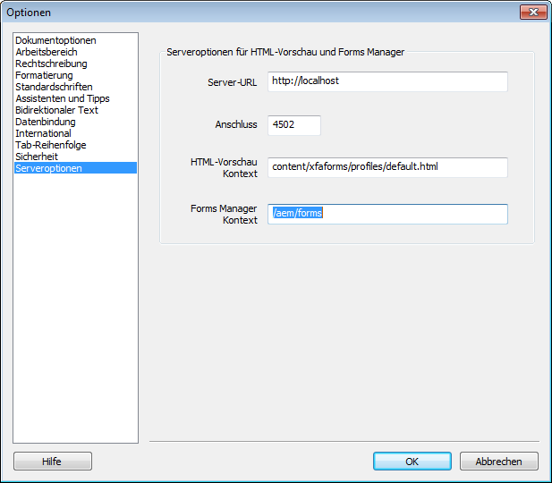

# HTML5-Vorschau eines XDP-Formulars generieren{#generate-html-preview-of-an-xdp-form}

Beim Erstellen eines Formulars in AEM Forms Designer können Sie nicht nur die PDF-Wiedergabe eines Formulars, sondern auch eine HTML5-Wiedergabe davon in der Vorschau anzeigen. Sie können die Registerkarte **HTML-Vorschau** verwenden, um ein Formular anzuzeigen, wie es im Browser angezeigt werden wird.

## Aktivieren Sie die HTML-Vorschau für XDP-Formulare in Designer {#html-preview-of-forms-in-forms-designer}

Um Designer für die Erstellung einer HTML-Vorschau für XDP-Formulare zu aktivieren, müssen Sie folgende Konfigurationen durchführen:

* Apache Sling Authentifizierungsdienst konfigurieren 
* Abgesicherten Modus deaktivieren
* Details zum AEM Forms-Server bereitstellen

### Apache Sling Authentifizierungsdienst konfigurieren{#configure-apache-sling-authentication-service} 

1. Gehen Sie zu `https://'[server]:[port]'/system/console/configMgr` unter AEM Forms, das auf OSGi ausgeführt wird, oder
   `https://'[server]:[port]'/lc/system/console/configMgr` auf AEM Forms, das auf JEE läuft.
1. Wählen Sie die Konfiguration **Apache Sling-Authentifizierungsdienst**, um ihn im Modus „Bearbeiten“ zu öffnen.

1. Je nachdem, ob Sie AEM Forms unter OSGi oder JEE ausführen, müssen Sie Folgendes im Feld **Authentifizierungsanforderungen** hinzufügen:   

   *  von AEM Forms für JEE

      * -/de/content/xfaforms
      * -/etc/clientlibs
   * AEM Forms unter OSGi

      * -/de/content/xfaforms
      * -/etc/clientlibs/fd/xfaforms

   >[!NOTE]
   >
   >Kopieren Sie nicht den angegebenen Wert in das Feld „Authentifizierungsanforderungen“, das es die Sonderzeichen im Wert beschädigen kann. Geben Sie die stattdessen den spezifizierten Wert in das Feld ein.

1. Geben Sie einen Benutzernamen und ein Kennwort für **[!UICONTROL Anonymer Benutzername]** und **[!UICONTROL Anonymes Benutzerkennwort]** ein. Die angegebenen Anmeldeinformationen werden verwendet, um anonyme Authentifizierung zu nutzen und Zugriff auf anonyme Benutzer zuzulassen.
1. Klicken Sie auf **Speichern**, um die Konfiguration zu speichern.

### Abgesicherten Modus deaktivieren  {#disable-protected-mode}

Der[ abgesicherte Modus](../../forms/using/get-xdp-pdf-documents-aem.md) ist standardmäßig aktiviert. Behalten Sie dies in Produktionsumgebungen bei. Sie können ihn in Entwicklungsumgebungen deaktivieren, um eine HTML5-Vorschau in Designer anzuzeigen. Gehen Sie wie folgt vor, um ihn zu deaktivieren:

1. Melden Sie sich bei der AEM-Web-Konsole als Administrator an.

   * URL für AEM Forms unter OSGi ist `https://'[server]:[port]'/system/console/configMgr`
   * URL für AEM Forms on JEE ist `https://'[server]:[port]'/lc/system/console/configMgr`

1. Öffnen Sie **[!UICONTROL Mobile Forms-Konfigurationen]** für die Bearbeitung.
1. Wählen Sie die Option **[!UICONTROL Abgesicherter Modus]** und klicken Sie auf **[!UICONTROL Speichern]**.

### Details zum AEM Forms-Server bereitstellen  {#provide-details-of-aem-forms-server}

1. Navigieren Sie in Designer zu **Werkzeuge**> **Optionen**.
1. Wählen Sie im Fenster &quot;Optionen&quot;die Seite **Serveroptionen** aus, geben Sie die folgenden Details ein und klicken Sie auf **OK**.

   * **Server URL**: AEM Forms-Server URL.

   * **HTTP-Portnummer**: AEM-Server-Port. Der Standardwert ist 4502. 
   * **HTML-Vorschauen-Kontext:** Pfad des Profils zum Rendern von XFA-Formularen. Zur Vorschau des Formulars in Designer werden die folgenden Standard-Profile verwendet. Sie können außerdem den Pfad zu einem benutzerdefinierten Profil angeben.

      * `/content/xfaforms/profiles/default.html` (AEM Forms on OSGi)

      * `/lc/content/xfaforms/profiles/default.html` (AEM Forms on JEE)
   * **Forms Manager Context:** Kontextpfad, an dem die Forms Manager-Benutzeroberfläche bereitgestellt wird. Die Standardwerte lauten:

      * `/aem/forms` (AEM Forms unter OSGi)
      * `/lc/forms` (AEM Forms zu JEE)

   >[!NOTE]
   >
   >Vergewissern Sie sich, dass der AEM Forms-Server betriebsbereit ist. Die HTML-Vorschau verbindet sich mit dem CRX-Server mit einer Vorschau von *generate*.

   

   AEM Forms Designer-Optionen

1. Um ein Formular in HTML Vorschau, klicken Sie auf die Registerkarte **Vorschau-HTML**.

   >[!NOTE]
   >
   >
   >
   >
   >    * Wenn die Registerkarte für die HTML-Vorschau geschlossen ist, drücken Sie F4, um sie zu öffnen. Sie können die HTML-Vorschau auch über das Menü „Ansicht“ wählen, um die betreffende Registerkarte zu öffnen.
   >    * Die HTML-Vorschau unterstützt keine PDF-Dokumente. Die HTML-Vorschau ist nur für XDP-Dokumente vorgesehen.

   >[!CAUTION]
   >
   >Um das echte Endbenutzererlebnis zu testen, können Sie Ihre Formulare auch in externen Browsern (Google Chrome, Microsoft Edge, Mozilla Firefox usw.) Vorschau haben. Jeder Browser verwendet eine separate Engine zum Rendern von HTML, sodass es einige Unterschiede bei der Vorschau von Formularen in Designer und externen Browsern geben kann.

## Anzeigen der Vorschau eines Formulars mit Musterdaten {#to-preview-a-form-using-sample-data}

Sie können Ihr Formular in Designer mit Hilfe von Muster-XML-Daten testen und in der Vorschau anzeigen. Es wird empfohlen, das Formular häufig mit Musterdaten zu testen, um sicherzustellen, dass es richtig wiedergegeben wird.

Falls Ihnen keine Musterdaten vorliegen, können Sie sie von Designer erstellen lassen oder auch selbst erstellen. (Siehe [So generieren Sie automatisch Musterdaten für die Vorschau eines Formulars](https://help.adobe.com/en_US/AEMForms/6.1/DesignerHelp/WS107c29ade9134a2c136ae6f212a1f379c94-8000.2.html#WS92d06802c76abadb-728f46ac129b395660c-7efe.2) und [So erstellen Sie Musterdaten für die Vorschau eines Formulars](https://help.adobe.com/en_US/AEMForms/6.1/DesignerHelp/WS107c29ade9134a2c136ae6f212a1f379c94-8000.2.html#WS92d06802c76abadb-728f46ac129b395660c-7eff.2).)

Durch Testen Ihres Formulars mit Hilfe von Musterdaten können Sie sicherstellen, dass die Daten und Felder zugeordnet werden und dass sich wiederholende Teilformulare erwartungsgemäß wiederholt werden. Sie können ein ausgeglichenes Formularlayout erstellen, das den jeweiligen Objekten genügend Platz zur Anzeige der zusammengeführten Daten bietet.

1. Wählen Sie **Datei > Formulareigenschaften**.

1. Klicken Sie auf die Registerkarte **Vorschau** und geben Sie im Feld „Datendatei“ den vollständigen Pfad zu einer Testdatendatei ein. Sie können auch auf die Schaltfläche „Durchsuchen“ klicken, um zur gewünschten Datei zu gelangen.

1. Klicken Sie auf **OK**. Wenn Sie das nächste Mal eine Vorschau des Formulars auf der Registerkarte **HTML-Vorschau** anzeigen, werden die Datenwerte der XML-Musterdatei in den entsprechenden Objekten dargestellt.

## Formulare in einem Repository in der Vorschau anzeigen {#html-preview-of-forms-in-forms-manager}

In AEM Forms können Sie die Formulare und Dokumente in einem Repository in der Vorschau anzeigen. Mithilfe der Vorschau können Sie genau sehen, wie die Formulare aussehen und wie sie von Endbenutzern verwendet werden.
