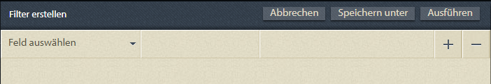
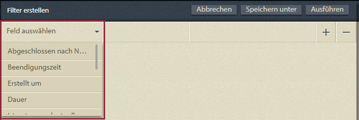
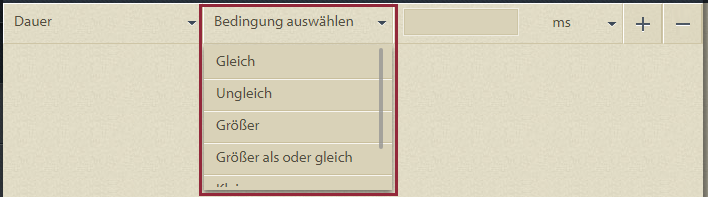
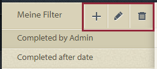
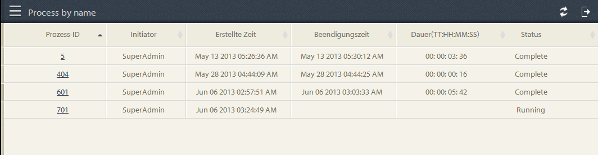
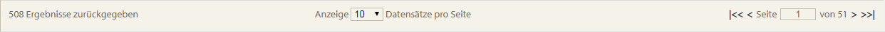
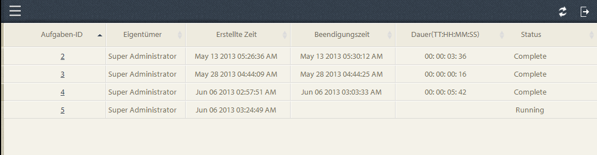
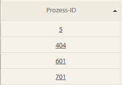
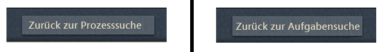
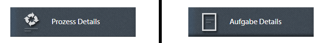

# Ad-hoc-Abfragen in Prozessberichten{#ad-hoc-queries-in-process-reporting}

## Ad-hoc-Abfragen in Prozessberichten {#ad-hoc-queries-in-process-reporting-1}

Mit Ad-hoc-Abfragen in Process Reporting können Sie benutzerdefinierte Abfragen erstellen, mit denen Sie nach Prozess- und Aufgabendetails der in Ihrer AEM Forms-Umgebung definierten AEM Forms-Prozessinstanzen suchen können.

Ad-hoc-Abfragen können auch mithilfe von Prozess- und Aufgabeneigenschaftsfiltern definiert werden. Diese Filter können dann gespeichert und zur späteren Ausführung der Berichte verwendet werden.

[**Prozesssuche**](/help/forms/using/process-reporting/adhoc-queries-in-process-reporting.md#p-process-task-search-p): Suchen Sie nach Prozessinstanzen mit einem benutzerdefinierten Suchfilter basierend auf Prozessattributen.

[**Prozessdetails**](/help/forms/using/process-reporting/adhoc-queries-in-process-reporting.md#p-process-task-details-p): Zeigen Sie Details einer Prozessinstanz an, indem Sie die Prozess-ID angeben.

**Aufgabensuche**: Suchen Sie anhand von Aufgabenattributen nach Aufgabeninstanzen mit einem benutzerdefinierten Suchfilter.

**Aufgabendetails**: Zeigen Sie Details einer Aufgabeninstanz an, indem Sie die Aufgaben-ID angeben.

### Prozesse und Aufgaben {#processes-and-tasks}

Die Schritte zum Erstellen von Filtern und Ausführen von Abfragen für Prozessdetails sind dieselben wie für Aufgaben.

Das bedeutet, dass sich die Benutzeroberflächen für die Prozesssuche und Aufgabensuche nur in den Feldern, nach denen Sie suchen können, und in den Suchergebnissen zurückgegebenen Feldern unterscheiden. Dies liegt einfach daran, dass zwar viele der Felder identisch sind, bestimmte Felder jedoch für Prozesse spezifisch sind und bestimmte Felder für Aufgaben spezifisch sind.

In diesem Artikel werden die Beschreibungen der Abschnitte Prozess-/Aufgabensuche und Prozess-/Aufgabendetails beschrieben. An geeigneten Orten werden alle spezifischen Unterschiede speziell ausgewiesen.

## Prozess-/Aufgabensuche {#process-task-search}

Sie verwenden die Prozess-/Aufgabensuche, um Filter zum Abfragen von Prozess-/Aufgabeninstanzen zu definieren.

### So erstellen Sie eine Prozess-/Aufgabensuchabfrage {#to-create-a-process-task-search-query}

1. Um die gespeicherten Prozess-/Aufgabensuchabfragen anzuzeigen oder eine Abfrage zu erstellen, klicken Sie auf **Adhoc-Abfragen** und dann auf **Prozess-/Aufgabensuche**.

   

   Das Bedienfeld **Meine Filter** wird rechts neben der Baumansicht angezeigt.

   Im Bedienfeld **Meine Filter** können Sie neue Ad-hoc-Abfragen erstellen und auf klicken, um zuvor gespeicherte Abfragen auszuführen.

   

1. Um eine vorhandene Abfrage auszuführen, klicken Sie einfach auf die Abfrage im Bedienfeld **Meine Filter** .
1. Um eine Abfrage zu erstellen, klicken Sie auf **Hinzufügen** (+).

   Das Bedienfeld **Filter erstellen** wird angezeigt.

   

   Eine Abfrage besteht aus einem oder mehreren Abfragefiltern. Um einen Filter zu erstellen, fügen Sie der Abfrage eine Filterzeile hinzu. Standardmäßig wird der Abfrage eine Filterzeile hinzugefügt.

   **So definieren Sie Filter**

   1. Wählen Sie ein Feld aus.

      

      >[!NOTE]
      >
      >Die Feldliste enthält die Felder, die für den AEM Forms-Prozess/die Aufgabe spezifisch sind.

   1. Wählen Sie eine Bedingung aus.

      

      >[!NOTE]
      >
      >Die aufgeführten Bedingungen hängen von dem Attribut ab, das zum Filtern ausgewählt wurde.

   1. Geben Sie einen Wert ein.

      

   1. Um der Abfrage einen weiteren Filter hinzuzufügen, klicken Sie auf **Hinzufügen (+)** rechts neben der Filterzeile.

      Um einen Filter aus der Abfrage zu entfernen, klicken Sie rechts neben der Filterzeile auf **Löschen (-)** .

      

Nachdem Sie eine Abfrage erstellt haben, verwenden Sie die Optionen in der oberen rechten Ecke des Bedienfelds **Filter erstellen** , um:

* **Abbrechen**: Abbrechen Sie die Änderungen und gehen Sie zurück zum  **Fenster Mein** Filter .
* **Ausführen**: Führen Sie die aktuelle Abfrage aus, um die Ergebnisse anzuzeigen bzw. zu überprüfen. In diesem Fall müssen Sie die Abfrage nicht speichern, bevor Sie die Abfrage ausführen. Sie können die Ergebnisse überprüfen, bei Bedarf Änderungen vornehmen und dann die Abfrage speichern, wenn Sie mit der Ausgabe zufrieden sind.
* **Speichern**: Speichern Sie den Filter. Der Filter kann dann über das Bedienfeld **Meine Filter** angezeigt und ausgeführt werden.

### Optionen im Bereich &quot;Meine Filter&quot;{#options-in-my-filters-panel}

Verwenden Sie die Optionen im Bedienfeld **Meine Filter** zu **Hinzufügen** , **Bearbeiten**  oder **Löschen** a12/>lc_pr_edit_filter](assets/lc_pr_edit_filter.png)eine Ad-hoc-Abfrage.![

### So führen Sie eine Suchabfrage aus {#to-execute-a-search-query}

1. Um eine Abfrage auszuführen, klicken Sie auf den Filter im Bedienfeld **Meine Filter** oder auf die Schaltfläche **Ausführen** , wenn Sie einen Filter erstellen oder bearbeiten.
1. Die Ergebnisse der Abfrage werden im Bereich **Bericht** des Fensters **Prozessberichte** angezeigt.

   

   Sie können die Suchergebnisse mithilfe des Paginierungs-Bedienfelds, das am unteren Rand des Berichts angezeigt wird, paginieren.

   

   Wählen Sie in der Dropdownliste **Anzeige** die Anzahl der Ergebnisse aus, die pro Seite angezeigt werden sollen.

   Geben Sie im Textfeld **Seite** eine Seitennummer ein, um direkt zu dieser Seite zu gelangen.

1. Die folgenden Felder werden in einem Prozesssuchergebnis angezeigt:

   * **Prozess-ID**: Die Kennung des Prozesses. Das Feld ist per Hyperlink gekennzeichnet. Wenn Sie in diesem Feld auf eine Prozess-ID klicken, werden Sie zum Bereich **[!UICONTROL Prozessdetails]** für den Prozess weitergeleitet.
   * **Initiator**: Der AEM Forms-Benutzer, der die Prozessinstanz gestartet hat
   * **Erstellungszeit**: Datum und Uhrzeit des Starts der Prozessinstanz
   * **Abgeschlossene Zeit**: Datum und Uhrzeit des Abschlusses der Prozessinstanz
   * **Dauer**: Die Dauer von Beginn bis Ende der Prozessinstanz
   * **Status**: Der aktuelle Status der Prozessinstanz.

   Standardmäßig wird das Ergebnis nach Prozess-ID sortiert. Um das Ergebnis jedoch nach einem der Felder zu sortieren, klicken Sie auf den Feldtitel.

   Da es sich bei der Sortierung um einen Umschalter handelt, klicken Sie auf eine Spaltenüberschrift, um das Ergebnis aufsteigend zu sortieren, und klicken Sie erneut auf die Spalte, um es in absteigender Reihenfolge zu sortieren.

   Gleichermaßen werden die folgenden Felder in einem Task Search-Ergebnis angezeigt:

   * **Aufgaben-ID**: Die ID der Aufgabe. Das Feld ist per Hyperlink gekennzeichnet. Wenn Sie in diesem Feld auf eine Aufgaben-ID klicken, werden Sie zum Bereich **[!UICONTROL Aufgabendetails]** für die Aufgabe weitergeleitet.
   * **Initiator**: Der AEM Forms-Benutzer, der die Prozessinstanz gestartet hat
   * **Erstellungszeit**: Datum und Uhrzeit des Starts der Prozessinstanz
   * **Abgeschlossene Zeit**: Datum und Uhrzeit des Abschlusses der Prozessinstanz
   * **Dauer**: Die Dauer von Beginn bis Ende der Prozessinstanz
   * **Status**: Der aktuelle Status der Prozessinstanz.

   Standardmäßig wird das Ergebnis nach Aufgabe-ID sortiert. Um das Ergebnis jedoch nach einem der Felder zu sortieren, klicken Sie auf den Feldtitel. Das Ergebnis wird nach der Spalte sortiert, die durch einen dunklen Pfeil neben der Spaltenüberschrift angezeigt wird.

   Da es sich bei der Sortierung um einen Umschalter handelt, klicken Sie auf eine Feldüberschrift, um das Ergebnis aufsteigend zu sortieren, und klicken Sie erneut auf diese Option, um es in absteigender Reihenfolge zu sortieren. Die aktuelle Sortierreihenfolge (aufsteigend/absteigend) wird durch die Richtung des dunklen Pfeils neben der Spaltenüberschrift angezeigt.

   

1. Klicken Sie oben links auf die Leiste  , um den Bereich **Meine Filter** zu reduzieren und den für das Bedienfeld **Bericht** verfügbaren Platz zu erweitern.
1. Verwenden Sie die Optionen in der oberen rechten Ecke des Bedienfelds &quot;Bericht&quot;, um Vorgänge am Abfrageergebnis durchzuführen.

   * **Aktualisieren**: Aktualisiert den Bericht mit den neuesten Daten im Speicher

   * **Exportieren in CSV**: Exportieren Sie die Berichtsdaten in eine kommagetrennte Datei.
   >[!NOTE]
   >
   >Wenn Sie einen Bericht exportieren, wird das gesamte Suchergebnis in eine CSV-Datei exportiert und nicht nur in die aktuelle Seite

## Prozess-/Aufgabendetails {#process-task-details}

Im Bedienfeld **Prozessdetails** können Sie die Details eines bestimmten Prozesses anzeigen.

Gleichermaßen verwenden Sie das Bedienfeld **Aufgabendetails**, um die Details einer bestimmten Aufgabe anzuzeigen.

### Anzeigen von Prozess-/Aufgabendetails {#to-view-process-task-details}

Sie können die Details eines bestimmten AEM Forms-Prozesses/einer bestimmten Aufgabe anzeigen:

* **Aus einem Prozess-/Aufgabensuchergebnis**
* **Durch Eingabe der Prozess-/Aufgaben-ID im Bereich &quot;Prozess-/Aufgabendetails&quot;**

#### Aus einem Prozess-/Aufgabensuchergebnis {#from-a-process-task-search-result}

1. Führen Sie eine Prozess-/Aufgabensuche aus. Weitere Informationen finden Sie unter [So führen Sie eine Prozesssuchabfrage](#to-execute-a-search-query) aus.

   Beachten Sie, dass die im Ergebnis zurückgegebenen Prozess-IDs per Hyperlink verknüpft sind.

   

1. Klicken Sie auf eine Prozess-ID in der Liste, um die Details dieses Prozesses im Bedienfeld **Prozessdetails** anzuzeigen.

   Das Abfrageergebnis **Prozess-/Aufgabendetails** zeigt Details zu den Aufgaben/Formularen an, die in dem Prozess/der Aufgabe enthalten sind.

   Standardmäßig wird das Ergebnis nach Aufgabe/Formular-ID sortiert. Um das Ergebnis jedoch nach einem der Felder zu sortieren, klicken Sie auf den Feldtitel. Die Spalte, nach der das Ergebnis sortiert wird, wird durch einen dunklen Pfeil neben der Spaltenüberschrift angezeigt.

   Da es sich bei der Sortierung um einen Umschalter handelt, klicken Sie auf eine Feldüberschrift, um das Ergebnis aufsteigend zu sortieren, und klicken Sie erneut auf diese Option, um es in absteigender Reihenfolge zu sortieren. Die aktuelle Sortierreihenfolge (aufsteigend/absteigend) wird durch die Richtung des dunklen Pfeils neben der Spaltenüberschrift angezeigt.

   **Ergebnis der Prozessdetails**

   

   **Linke Leiste:** Zeigt die folgenden Details des ausgewählten Prozesses an:

   * Name des Prozesses
   * Zeitpunkt der Prozesserstellung
   * Zeitpunkt des Prozessabschlusses
   * Prozessdauer
   * Prozessstatus
   * Prozessinitiator

   **Oben rechts:** Zeigt die folgenden Details zu den Aufgaben an, aus denen der ausgewählte Prozess besteht:

   * Aufgaben-ID
   * Aufgabenname
   * Aufgabenbesitzer
   * Zeitpunkt der Aufgabenerstellung
   * Zeitpunkt der Aufgabenaktualisierung
   * Zeitpunkt der Aufgabenfertigstellung
   * Aufgabendauer
   * Aufgabenstatus

   **Bereich unten rechts:** Zeigt die folgenden Details des Prozessverlaufs des ausgewählten Prozesses an:

   * Prozessname
   * Prozessinitiator
   * Datum der Prozessaktualisierung
   * Zeitpunkt des Prozessabschlusses
   * Prozessstatus

   **Ergebnis der Aufgabendetails**

   

   **Linker Bereich:** Zeigt die folgenden Details der ausgewählten Aufgabe an:

   * Aufgabenname
   * Kennung des Prozesses, zu dem diese Aufgabe gehört
   * Aufgabenbeschreibung
   * Zeitpunkt der Aufgabenerstellung
   * Zeitpunkt der Aufgabenfertigstellung
   * Aufgabendauer
   * Aufgabenstatus
   * Ausgewählter Aufgabenweg

   **Oben rechts:** Zeigt die folgenden Details zu den Formularen an, aus denen die ausgewählte Aufgabe besteht:

   * Farm-ID
   * Datum der Formularerstellung
   * Datum der Formularaktualisierung
   * Formularvorlagen-URL

   **Bereich unten rechts:** Zeigt die folgenden Details des Prozessverlaufs der ausgewählten Aufgabe an:

   * Aufgabenzuweisungstyp
   * Aufgabenbesitzer
   * Erstellungsdatum der Aufgabenzuweisung
   * Zeitpunkt der Aufgabenaktualisierung

1. Klicken Sie auf **Zurück zu Prozess/Aufgabensuche** , um zum Suchergebnis zurückzukehren, aus dem die Prozess-/Aufgabendetails heruntergefahren wurden.

   

   Wenn die Prozess-/Aufgabendetails jedoch durch Eingabe einer bestimmten Prozess-/Aufgabenkennung gefunden wurden, führt das Klicken auf Zurück zum Prozess/Aufgabensuche zurück zu **Prozess/Aufgabensuche**, ohne Suchergebnisse anzuzeigen.

#### Durch Eingabe der Prozess-/Aufgaben-ID in das Bedienfeld &quot;Prozess-/Aufgabendetails&quot; {#by-entering-the-process-task-id-in-the-process-task-details-panel-br}

1. Wechseln Sie zum Bereich **Prozess-/Aufgabendetails** .

   

1. Geben Sie im Textfeld Prozess-/Aufgaben-ID die Prozess-/Aufgaben-ID ein.

   

   Die Felder im Abfrageergebnis **Prozess-/Aufgabendetails** sind Felder, die für einen AEM Forms-Prozess/eine-Aufgabe spezifisch sind.

   Für einen Prozess zeigt das Abfrageergebnis die Details der im Prozess enthaltenen Aufgaben an.

   Für eine Aufgabe zeigt das Abfrageergebnis die Details der in der Aufgabe enthaltenen Formulare an.
