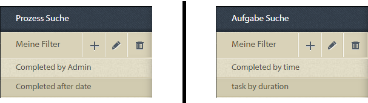

# Ad-hoc-Abfragen in der Prozessberichterstellung{#ad-hoc-queries-in-process-reporting}

## Ad-hoc-Abfragen in der Prozessberichterstellung {#ad-hoc-queries-in-process-reporting-1}

Mit Ad-hoc-Abfragen in der Prozessberichterstellung können Sie benutzerdefinierte Abfragen erstellen, mit denen Sie nach Prozess- und Aufgabendetails der in Ihrer AEM Forms-Umgebung definierten AEM Forms-Prozessinstanzen suchen können.

Ad-hoc-Abfragen können auch mit Prozess- und Aufgabeneigenschaftsfiltern definiert werden. Diese Filter können dann gespeichert und verwendet werden, um die Berichte später auszuführen.

[**Prozesssuche **](/help/forms/using/process-reporting/adhoc-queries-in-process-reporting.md#p-process-task-search-p): Suchen Sie nach Prozessinstanzen mit einem benutzerdefinierten Suchfilter, der auf Prozessattributen basiert.

[**Prozessdetails **](/help/forms/using/process-reporting/adhoc-queries-in-process-reporting.md#p-process-task-details-p): Zeigen Sie Details zu einer Prozessinstanz an, indem Sie die Prozess-ID angeben.

**Aufgabensuche**: Suchen Sie anhand von Aufgabenattributen nach Aufgabeninstanzen mit einem benutzerdefinierten Suchfilter.

**Aufgabendetails**: Zeigen Sie Details zu einer Aufgabeninstanz an, indem Sie die Aufgaben-ID angeben.

### Prozesse und Aufgaben {#processes-and-tasks}

Die Schritte zum Erstellen von Filtern und zum Ausführen von Abfragen für Prozessdetails sind dieselben wie bei Aufgaben.

Das bedeutet, dass die Benutzeroberflächen für die Prozesssuche und die Aufgabensuche nur in den Feldern, nach denen Sie suchen können, und in den in den Suchergebnissen zurückgegebenen Feldern unterschiedlich sind. Dies liegt einfach daran, dass, obwohl viele Felder identisch sind, bestimmte Felder für Prozesse spezifisch sind und bestimmte Felder für Aufgaben spezifisch sind.

In diesem Artikel werden die Beschreibungen der Abschnitte Prozess-/Aufgabensuche und Prozess-/Aufgabendetails beschrieben. An geeigneten Orten werden alle spezifischen Unterschiede gesondert ausgewiesen.

## Prozess-/Aufgabensuche {#process-task-search}

Mit der Prozess-/Aufgabensuche können Sie Filter für die Abfrage von Prozess-/Aufgabeninstanzen definieren.

### So erstellen Sie eine Prozess-/Aufgabensuchabfrage {#to-create-a-process-task-search-query}

1. Um die gespeicherten Prozess-/Aufgabensuchabfragen anzuzeigen oder eine Abfrage zu erstellen, klicken Sie auf **Ad-hoc-Abfragen** und dann auf **Prozess-/Aufgabensuche**.

   

   Das Bedienfeld &quot; **Meine Filter** &quot;wird rechts neben der Baumansicht angezeigt.

   Im Bedienfeld &quot; **Meine Filter** &quot;können Sie neue Ad-hoc-Abfragen erstellen und auf klicken, um zuvor gespeicherte Abfragen auszuführen.

   

1. Um eine vorhandene Abfrage auszuführen, klicken Sie einfach auf die Abfrage im Bereich **Meine Filter** .
1. Um eine Abfrage zu erstellen, klicken Sie auf **Hinzufügen** (+).

   Das Bedienfeld &quot;Filter **erstellen** &quot;wird angezeigt.

   

   Eine Abfrage besteht aus einem oder mehreren Abfragefiltern. Um einen Filter zu erstellen, fügen Sie der Abfrage eine Filterzeile hinzu. Standardmäßig wird der Abfrage eine Filterzeile hinzugefügt.

   **So definieren Sie einen Filter**

   1. Wählen Sie ein Feld aus.

      

      >[!NOTE]
      >
      >Die Feldliste enthält die Felder, die spezifisch für AEM Forms-Prozess/Aufgabe sind.

   1. Wählen Sie eine Bedingung aus.

      

      >[!NOTE]
      >
      >Die aufgelisteten Bedingungen hängen vom Attribut ab, das zum Filtern ausgewählt wurde.

   1. Geben Sie einen Wert ein.

      

   1. Um der Abfrage einen weiteren Filter hinzuzufügen, klicken Sie auf **Hinzufügen (+)** rechts neben der Filterzeile.

      Um einen Filter aus der Abfrage zu entfernen, klicken Sie rechts neben der Filterzeile auf **Löschen (-)** .

      

Nachdem Sie eine Abfrage erstellt haben, verwenden Sie die Optionen in der oberen rechten Ecke des Bedienfelds **Filter** erstellen, um:

* **Abbrechen**: Brechen Sie die Änderungen ab und gehen Sie zurück zum Bedienfeld &quot; **Meine Filter** &quot;.
* **Ausführen**: Führen Sie die aktuelle Abfrage aus, um die Ergebnisse anzuzeigen und/oder zu überprüfen. In diesem Fall müssen Sie die Abfrage nicht speichern, bevor Sie die Abfrage ausführen. Sie können die Ergebnisse überprüfen, bei Bedarf Änderungen vornehmen und die Abfrage dann speichern, wenn Sie mit der Ausgabe zufrieden sind.
* **Speichern**:Speichern Sie den Filter. Der Filter kann dann über das Bedienfeld &quot; **Meine Filter** &quot;angezeigt und ausgeführt werden.

### Optionen im Bedienfeld &quot;Meine Filter&quot; {#options-in-my-filters-panel}

Verwenden Sie die Optionen im Bedienfeld **Meine Filter** , um **lc_pr_add_filter**,  **lc_pr_delete_filter**, orDeletepr_edit_eine Ad-hoc-Abfrage  **** .

### So führen Sie eine Suchabfrage aus {#to-execute-a-search-query}

1. Um eine Abfrage auszuführen, klicken Sie im Bedienfeld &quot; **Meine Filter** &quot;auf den Filter oder klicken Sie auf die Schaltfläche &quot; **Ausführen** &quot;, wenn Sie einen Filter erstellen oder bearbeiten.
1. Die Ergebnisse der Abfrage werden im Bereich **Bericht** des Fensters **Prozessberichterstellung** angezeigt.

   

   Sie können die Suchergebnisse mithilfe des Seitenumbruchbedienfelds am unteren Rand des Berichts paginieren.

   

   Wählen Sie in der Dropdownliste **Anzeigen** die Anzahl der pro Seite anzuzeigenden Ergebnisse aus.

   Geben Sie im Textfeld &quot; **Seite** &quot;eine Seitenzahl ein, um direkt zu dieser Seite zu gelangen.

1. Die folgenden Felder werden in einem Prozesssuchergebnis angezeigt:

   * **Prozess-ID**: Die ID des Prozesses. Das Feld ist mit Hyperlinks verknüpft. Wenn Sie in diesem Feld auf eine Prozess-ID klicken, werden Sie zum Bereich **[!UICONTROL Prozessdetails]** weitergeleitet.
   * **Initiator**: Der AEM Forms-Benutzer, der die Prozessinstanz gestartet hat
   * **Erstellungszeit**: Datum und Uhrzeit des Starts der Prozessinstanz
   * **Abgeschlossene Zeit**: Datum und Uhrzeit des Abschlusses der Prozessinstanz
   * **Dauer**: Die Dauer vom Start bis zum Abschluss der Prozessinstanz
   * **Status**: Der aktuelle Status der Prozessinstanz.
   Standardmäßig wird das Ergebnis nach Prozess-ID sortiert. Um das Ergebnis jedoch nach einem der Felder zu sortieren, klicken Sie auf den Feldtitel.

   Da es sich bei der Sortierung um einen Umschalter handelt, klicken Sie auf eine Spaltenüberschrift, um das Ergebnis aufsteigend zu sortieren, und klicken Sie erneut darauf, um es absteigend zu sortieren.

   Gleichermaßen werden die folgenden Felder in einem Ergebnis der Aufgabensuche angezeigt:

   * **Aufgaben-ID**: Die ID der Aufgabe. Das Feld ist mit Hyperlinks verknüpft. Wenn Sie in diesem Feld auf eine Aufgaben-ID klicken, werden Sie zum Bereich **[!UICONTROL Aufgabendetails]** für die Aufgabe weitergeleitet.
   * **Initiator**: Der AEM Forms-Benutzer, der die Prozessinstanz gestartet hat
   * **Erstellungszeit**: Datum und Uhrzeit des Starts der Prozessinstanz
   * **Abgeschlossene Zeit**: Datum und Uhrzeit des Abschlusses der Prozessinstanz
   * **Dauer**: Die Dauer vom Start bis zum Abschluss der Prozessinstanz
   * **Status**: Der aktuelle Status der Prozessinstanz.
   Standardmäßig wird das Ergebnis nach Aufgaben-ID sortiert. Um das Ergebnis jedoch nach einem der Felder zu sortieren, klicken Sie auf den Feldtitel. Das Ergebnis wird nach der Spalte sortiert, die durch einen dunklen Pfeil neben der Spaltenüberschrift gekennzeichnet ist.

   Da es sich bei der Sortierung um einen Umschalter handelt, klicken Sie auf eine Feldüberschrift, um das Ergebnis aufsteigend zu sortieren, und klicken Sie erneut darauf, um es absteigend zu sortieren. Die aktuelle Sortierreihenfolge (aufsteigend/absteigend) wird durch die Richtung des dunklen Pfeils neben der Spaltenüberschrift angezeigt.

   

1. Klicken Sie oben links auf die Schaltfläche &quot;  &quot;, um den Bereich &quot; **Meine Filter** &quot;zu reduzieren und den für das **Berichtbedienfeld** verfügbaren Platz zu erweitern.
1. Verwenden Sie die Optionen in der oberen rechten Ecke des Bereichs **Bericht **zum Durchführen von Vorgängen am Abfrageergebnis.

   * **Aktualisieren**: Aktualisiert den Bericht mit den neuesten Daten im Speicher

   * **In CSV** exportieren: Exportieren Sie die Berichtsdaten in eine kommagetrennte Datei.
   >[!NOTE]
   >
   >Wenn Sie einen Bericht exportieren, wird das gesamte Suchergebnis in eine CSV-Datei exportiert und nicht nur in die aktuelle Seite

## Prozess-/Aufgabendetails {#process-task-details}

Im Bereich **Prozessdetails** können Sie die Details eines bestimmten Prozesses anzeigen.

Gleichermaßen verwenden Sie das Bedienfeld **Aufgabendetails** , um die Details einer bestimmten Aufgabe anzuzeigen.

### So zeigen Sie Prozess-/Aufgabendetails an {#to-view-process-task-details}

Sie können die Details eines bestimmten AEM Forms-Prozesses/einer bestimmten Aufgabe anzeigen:

* **Aus einem Prozess-/Aufgabensuchergebnis**
* **Durch Eingabe der Prozess-/Aufgaben-ID im Bereich &quot;Prozess-/Aufgabendetails&quot;**

#### Aus einem Prozess-/Aufgabensuchergebnis {#from-a-process-task-search-result}

1. Führen Sie eine Prozess-/Aufgabensuche aus. Weitere Informationen finden Sie unter [So führen Sie eine Prozesssuchabfrage](#to-execute-a-search-query)aus.

   Beachten Sie, dass die im Ergebnis zurückgegebenen Prozess-IDs Hyperlinks sind.

   

1. Klicken Sie auf eine Prozess-ID in der Liste, um die Details zu diesem Prozess im Bereich **Prozessdetails** anzuzeigen.

   Das Abfrageergebnis **Prozess-/Aufgabendetails** enthält Details zu den Aufgaben/Formularen, die im Prozess/der Aufgabe enthalten sind.

   Standardmäßig wird das Ergebnis nach Aufgaben-/Formular-ID sortiert. Um das Ergebnis jedoch nach einem der Felder zu sortieren, klicken Sie auf den Feldtitel. Die Spalte, nach der das Ergebnis sortiert wird, wird durch einen dunklen Pfeil neben der Spaltenüberschrift angezeigt.

   Da es sich bei der Sortierung um einen Umschalter handelt, klicken Sie auf eine Feldüberschrift, um das Ergebnis aufsteigend zu sortieren, und klicken Sie erneut darauf, um es absteigend zu sortieren. Die aktuelle Sortierreihenfolge (aufsteigend/absteigend) wird durch die Richtung des dunklen Pfeils neben der Spaltenüberschrift angezeigt.

   **Prozessdetails-Ergebnis**

   

   **** Linke Leiste: Zeigt die folgenden Details des ausgewählten Prozesses an:

   * Name des Prozesses
   * Zeitpunkt der Prozesserstellung
   * Abschlussdatum des Prozesses
   * Prozessdauer
   * Prozessstatus
   * Prozessinitiator
   **** Bedienfeld oben rechts: Zeigt die folgenden Details zu den Aufgaben an, aus denen der ausgewählte Prozess besteht:

   * Aufgaben-ID
   * Name der Aufgabe
   * Aufgabenbesitzer
   * Zeitpunkt der Aufgabenerstellung
   * Zeitpunkt der Aufgabenaktualisierung
   * Zeitpunkt der Aufgabenbeendigung
   * Aufgabendauer
   * Aufgabenstatus
   **** Bereich unten rechts: Zeigt die folgenden Details zum Prozessverlauf des ausgewählten Prozesses an:

   * Prozessname
   * Prozessinitiator
   * Aktualisierungsdatum
   * Abschlussdatum des Prozesses
   * Prozessstatus
   **Aufgabendetailergebnis**

   

   **** Linke Leiste: Zeigt die folgenden Details der ausgewählten Aufgabe an:

   * Aufgabenname
   * ID des Prozesses, zu dem diese Aufgabe gehört
   * Aufgabenbeschreibung
   * Zeitpunkt der Aufgabenerstellung
   * Zeitpunkt der Aufgabenbeendigung
   * Aufgabendauer
   * Aufgabenstatus
   * Ausgewählte Aufgabenroute
   **** Bedienfeld oben rechts: Zeigt die folgenden Details der Formulare an, aus denen die ausgewählte Aufgabe besteht:

   * Foprm-ID
   * Zeitpunkt der Formularerstellung
   * Datum der Formularaktualisierung
   * URL der Formularvorlage
   **** Bereich unten rechts: Zeigt die folgenden Details zum Prozessverlauf der ausgewählten Aufgabe an:

   * Aufgabenzuweisungstyp
   * Aufgabenbesitzer
   * Zeitpunkt der Erstellung der Aufgabenzuweisung
   * Zeitpunkt der Aufgabenaktualisierung

1. Klicken Sie auf **Zurück zu Prozess-/Aufgabensuche** , um zu dem Suchergebnis zurückzukehren, aus dem die Prozess-/Aufgabendetails Drilldown durchgeführt wurden.

   

   Wenn Sie jedoch die Prozess-/Aufgabendetails durch Eingabe einer bestimmten Prozess-/Aufgaben-ID gefunden haben, führen Sie durch Klicken auf Zurück zum Prozess/zur Aufgabensuche zurück zur **Prozess-/Aufgabensuche**, ohne dass Suchergebnisse angezeigt werden.

#### Durch Eingabe der Prozess-/Aufgaben-ID im Bereich &quot;Prozess-/Aufgabendetails&quot; {#by-entering-the-process-task-id-in-the-process-task-details-panel-br}

1. Wechseln Sie zum Bereich **Prozess-/Aufgabendetails** .

   

1. Geben Sie in das Textfeld &quot;Prozess-/Aufgaben-ID&quot;die Prozess-/Aufgaben-ID ein.

   

   Die Felder im Abfrageergebnis **Prozess-/Aufgabendetails** sind für einen AEM Forms-Prozess/eine Aufgabe spezifische Felder.

   Bei einem Prozess zeigt das Abfrageergebnis die Details der im Prozess enthaltenen Aufgaben an.

   Bei einer Aufgabe zeigt das Abfrageergebnis die Details der Formulare an, die in der Aufgabe enthalten sind.

[Support kontaktieren](https://www.adobe.com/account/sign-in.supportportal.html)
