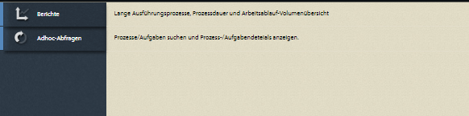

# Erste Schritte mit Process Berichte{#getting-started-with-process-reporting}

Process Berichte gibt AEM Forms-Benutzern die Möglichkeit, Informationen über AEM Forms-Prozesse Abfrage, die derzeit in der AEM Forms-Implementierung definiert sind. Process Berichte greift jedoch nicht direkt aus dem AEM Forms-Repository auf Daten zu. Die Daten werden zunächst im Process Berichte-Repository planmäßig (*vom ProcessDataPublisher &amp; ProcessDataStorage-Dienst* s) veröffentlicht. Die Berichte und Abfragen im Process Berichte werden dann aus den Process Berichte-Daten generiert, die im Repository veröffentlicht werden. Process Berichte wird als Teil des Forms Workflow-Moduls installiert.

In diesem Artikel werden die Schritte beschrieben, mit denen die Veröffentlichung von AEM Forms-Daten im Process Berichte-Repository aktiviert werden kann. Danach können Sie Process Berichte verwenden, um Berichte und Abfragen auszuführen. In diesem Artikel werden auch die Optionen behandelt, die zum Konfigurieren der Process Berichte-Dienste verfügbar sind.

## Voraussetzungen für Process Berichte {#process-reporting-pre-requisites}

### Nicht wesentliche Prozesse {#purge-non-essential-processes} bereinigen

Wenn Sie derzeit Forms Workflow verwenden, kann die AEM Forms-Datenbank möglicherweise eine große Datenmenge enthalten

Die Process Berichte Publishing Services veröffentlichen alle derzeit in der Datenbank verfügbaren AEM Forms-Daten. Dies bedeutet, dass alle Daten, die in der Datenbank vorhanden sind und für die Sie keine Berichte und Abfragen ausführen möchten, auch dann im Repository veröffentlicht werden, wenn dies für den Berichte nicht erforderlich ist. Es wird empfohlen, diese Daten zu bereinigen, bevor Sie die Dienste ausführen, um die Daten im Process Berichte-Repository zu veröffentlichen. Dadurch wird die Leistung sowohl des Herausgeberdiensts als auch des Dienstes, der die Daten für den Berichte Abfrage, verbessert.

Weitere Informationen zum Bereinigen von AEM Forms-Prozessdaten finden Sie unter [Bereinigen von Prozessdaten](https://help.adobe.com/en_US/livecycle/11.0/AdminHelp/WS92d06802c76abadb-5145d5d12905ce07e7-7cb2.2.html).

>[!NOTE]
>
>Die Tipps und Tricks des Dienstprogramms &quot;Bereinigen&quot;finden Sie im Adobe Developer Connection-Artikel zu [Bereinigen von Prozessen und Aufträgen](https://www.adobe.com/content/dam/Adobe/en/devnet/livecycle/pdfs/purging_processes_jobs.pdf).

## Konfigurieren von Process Berichte Services {#configuring-process-reporting-services}

### Planen der Prozessdatenveröffentlichung {#schedule-process-data-publishing}

Die Process Berichte-Dienste veröffentlichen Daten aus der AEM Forms-Datenbank planmäßig im Process Berichte-Repository.

Dieser Vorgang kann ressourcenintensiv sein und die Leistung der AEM Forms-Server beeinträchtigen. Es wird empfohlen, diese Zeitnischen außerhalb des AEM Forms-Servers zu planen.

Standardmäßig ist die Veröffentlichung von Daten planmäßig für jeden Tag um 2:00 Uhr geplant.

Führen Sie die folgenden Schritte aus, um den Veröffentlichungsplan zu ändern:

>[!NOTE]
>
>Wenn Sie Ihre AEM Forms-Implementierung auf einem Cluster ausführen, führen Sie die folgenden Schritte auf jedem Knoten des Clusters aus.

1. Beenden Sie die AEM Forms-Serverinstanz.
1. &#x200B;

   * (Für Windows) Öffnen Sie die Datei `[JBoss root]/bin/run.conf.bat` in einem Editor.
   * (Für Linux, AIX und Solaris) `[JBoss root]/bin/run.conf.sh`-Datei in einem Editor.

1. hinzufügen JVM-Argument `-Dreporting.publisher.cron = <expression>.`

   Beispiel: Der folgende Cron-Ausdruck verursacht, dass Process Berichte alle 5 Stunden AEM Forms-Daten im Process Berichte-Repository veröffentlicht:

   * `-Dreporting.publisher.cron = 0_0_0/5_*_*_?`

1. Speichern und schließen Sie die Datei `run.conf.bat`.

1. Starten Sie die AEM Forms-Serverinstanz neu.

1. Beenden Sie die AEM Forms-Serverinstanz.
1. Melden Sie sich bei WebSphere Administrative Console an. Klicken Sie in der Navigationsstruktur auf **Server** > **Anwendungsserver** und klicken Sie dann im rechten Bereich auf den Servernamen.

1. Klicken Sie unter „Server Infrastructure“ auf **Java and Process Management** > **Process Definition**.

1. Klicken Sie unter „Additional Properties“ auf **Java Virtual Machine**.

   Fügen Sie im Feld Generic JVM arguments das Argument `-Dreporting.publisher.cron = <expression>.` hinzu

   **Beispiel**: Der folgende Cron-Ausdruck verursacht, dass Process Berichte alle 5 Stunden AEM Forms-Daten im Process Berichte-Repository veröffentlicht:

   * `-Dreporting.publisher.cron = 0_0_0/5_*_*_?`

1. Klicken Sie auf **Apply**, klicken Sie auf OK und dann auf **Save directly to the Übergeordnet configuration**.
1. Starten Sie die AEM Forms-Serverinstanz neu.
1. Beenden Sie die AEM Forms-Serverinstanz.
1. Melden Sie sich bei WebLogic Administration Console an. Die Standardadresse von WebLogic Administration Console ist `https://[hostname]:[port]/console`.
1. Klicken Sie unter „Change Center“ auf **Lock &amp; Edit**.
1. Klicken Sie unter „Domain Structure“ auf **Environment**> **Servers** und anschließend im rechten Bereich auf den Namen des verwalteten Servers.
1. Klicken Sie im nächsten Bildschirm auf die Registerkarten **Configuration** > **Server Start**.
1. Fügen Sie im Feld Arguments das JVM-Argument `-Dreporting.publisher.cron = <expression>` hinzu.

   **Beispiel**: Der folgende Cron-Ausdruck verursacht, dass Process Berichte alle 5 Stunden AEM Forms-Daten im Process Berichte-Repository veröffentlicht:

   `-Dreporting.publisher.cron = 0_0_0/5_*_*_?`

1. Klicken Sie auf **Save** und dann auf **Activate Changes**.
1. Starten Sie die AEM Forms-Serverinstanz neu.

### ProcessDataStorage-Dienst {#processdatastorage-service}

Der ProcessDataStorageProvider-Dienst empfängt Prozessdaten vom ProcessDataPublisher-Dienst und speichert die Daten im Process Berichte-Repository.

Bei jedem Veröffentlichungszyklus werden die Daten in Unterordnern eines vordefinierten Stammordners gespeichert.

Sie können die Administrationskonsole verwenden, um den Stammordner (**default**: `/content/reporting/pm`) Speicherort und Unterordner (**default**: `/yyyy/mm/dd/hh/mi/ss`)-Hierarchieformat, in dem die Prozessdaten gespeichert werden.

#### So konfigurieren Sie die Repository-Speicherorte für Process Berichte {#to-configure-the-process-reporting-repository-locations}

1. Melden Sie sich bei **Administration Console** mit Administratorberechtigungen an. Die Standard-URL von Administration Console lautet `https://'[server]:[port]'/adminui`
1. Navigieren Sie zu **Home** > **Dienste** > **Anwendungen und Dienste** >**Dienstverwaltung** und öffnen Sie den **ProcessDataStorageProvider**-Dienst.

   

   **RootFolder**

   Der CRX-Speicherort, in dem die Prozessdaten zum Berichte gespeichert werden.

   `Default`: `/content/reporting/pm`

   **Ordnerhierarchie**

   Die Ordnerhierarchie, in der die Prozessdaten basierend auf der Prozesserstellungszeit gespeichert werden.

   `Default`:  `/yyyy/mm/dd/hh/mi/ss`

1. Klicken Sie auf **Speichern**.

### ReportConfiguration-Dienst {#reportconfiguration-service}

Der ReportConfiguration-Dienst wird von Process Berichte zum Konfigurieren des Process Berichte Abfrage-Dienstes verwendet.

#### So konfigurieren Sie den ReportingConfiguration-Dienst {#to-configure-the-reportingconfiguration-service}

1. Melden Sie sich bei **Configuration Manager** mit CRX-Administratorberechtigungen an. Die Standard-URL von Configuration Manager ist `https://'[server]:[port]'/lc/system/console/configMgr`
1. Öffnen Sie den Dienst **ReportingConfiguration**.
1. **Anzahl der Datensätze**

   Wenn eine Abfrage im Repository ausgeführt wird, kann das Ergebnis möglicherweise eine große Anzahl von Datensätzen enthalten. Wenn das Ergebnis groß ist, kann die Ausführung der Abfrage Serverressourcen beanspruchen.

   Zur Verarbeitung großer Ergebnisse teilt der ReportConfiguration-Dienst die Verarbeitung der Abfrage in Datensatzstapel auf. Dadurch wird die Systemlast verringert.

   `Default`:  `1000`

   **CRX-Datenspeicherung**

   Der CRX-Speicherort, in dem die Prozessdaten zum Berichte gespeichert werden sollen.

   `Default`:  `/content/reporting/pm`

   >[!NOTE]
   >
   >Dies ist der gleiche Speicherort, der in der Konfigurationsoption ProcessDataStorage **Stammordner** angegeben ist.
   >
   >
   >Wenn Sie die Option &quot;Stammordner&quot;in der ProcessDataStorage-Konfiguration aktualisieren, müssen Sie den Speicherort des CRX-Datenspeicherung-Pfads im ReportConfiguration-Dienst aktualisieren.

1. Klicken Sie auf **Speichern** und schließen Sie **CQ Configuration Manager**.

### ProcessDataPublisher-Dienst {#processdatapublisher-service}

Der ProcessDataPublisher-Dienst importiert Prozessdaten aus der AEM Forms-Datenbank und veröffentlicht die Daten zur Datenspeicherung an den ProcessDataStorageProvider-Dienst.

#### So konfigurieren Sie den ProcessDataPublisher-Dienst   {#to-configure-processdatapublisher-service-nbsp}

1. Melden Sie sich bei **Administration Console** mit Administratorberechtigungen an.

   Die Standardeinstellung ist `https://'server':port]/adminui/`.

1. Navigieren Sie zu **Home** > **Dienste** > **Anwendungen und Dienste** >**Dienstverwaltung** und öffnen Sie den Dienst **ProcessDataPublisher**.

**Daten veröffentlichen**

Aktivieren Sie diese Option, um Prozessdaten zum Veröffentlichen von Beginn anzuzeigen. Standardmäßig ist die Option deaktiviert.

Aktivieren Sie Process Berichte nur, wenn alle Konfigurationen, die mit Process Berichte-Komponenten zusammenhängen, ordnungsgemäß eingerichtet sind.

Alternativ können Sie diese Option verwenden, um die Prozessdatenveröffentlichung zu deaktivieren, wenn sie nicht mehr erforderlich ist.

`Default`:  `Off`

**Stapelintervall (s)**

Jedes Mal, wenn der ProcessDataPublisher-Dienst ausgeführt wird, teilt der Dienst die Zeit seit der letzten Ausführung des Dienstes durch das Stapelintervall auf. Der Dienst verarbeitet dann jedes Intervall der AEM Forms-Daten separat.

Dies hilft bei der Steuerung der Datengröße, die der Herausgeber während jeder Ausführung (Batch) innerhalb eines Zyklus verarbeitet.

Wenn der Herausgeber beispielsweise jeden Tag ausgeführt wird, wird die Verarbeitung standardmäßig nicht für einen Tag in einem einzigen Vorgang verarbeitet, sondern in 24 Stapel mit einer Stunde aufgeteilt.

`Default`:  `3600`

`Unit`:  `Seconds`

**Zeitlimit sperren (Sek.)**

Der Herausgeber-Dienst erwirbt eine Sperre, wenn er Beginn zur Verarbeitung von Daten abruft, sodass nicht mehrere Instanzen des Herausgebers gleichzeitig Daten ausführen und verarbeiten.

Wenn ein Herausgeberdienst, der eine Sperre erworben hat, für die durch den Wert &quot;Sperren-Timeout&quot;definierte Anzahl von Sekunden untätig ist, wird die Sperre freigegeben, damit andere Instanzen des Herausgeberdienstes die Verarbeitung fortsetzen können.

`Default`:  `3600`

`Unit`:  `Seconds`

**Daten veröffentlichen aus**

AEM Forms Umgebung enthält Daten aus dem Zeitpunkt, zu dem die Umgebung eingerichtet wurde.

Standardmäßig importiert der ProcessDataPublisher-Dienst alle Daten aus der AEM Forms-Datenbank.

Wenn Sie planen, nach einem bestimmten Berichte und einer bestimmten Uhrzeit Berichte und Abfragen zu Daten auszuführen, sollten Sie das Datum und die Uhrzeit angeben. Der Veröffentlichungsdienst veröffentlicht dann das Datum ab diesem Zeitpunkt.

`Default`:  `01-01-1970 00:00:00`

`Format`:  `dd-MM-yyyy HH:mm:ss`

## Zugriff auf die Process Berichte-Benutzeroberfläche {#accessing-the-process-reporting-user-interface}

Die Benutzeroberfläche für Process Berichte ist browserbasiert.

Nachdem Sie Process Berichte eingerichtet haben, können Sie Beginn mit Process Berichte an folgendem Speicherort in Ihrer AEM Forms-Installation ausführen:

`https://<server>:<port>/lc/pr`

### Bei Process Berichte {#log-in-to-process-reporting} anmelden

Wenn Sie zur Process Berichte-URL navigieren (https://&lt;server>:&lt;port>/lc/pr), wird der Anmeldebildschirm angezeigt.

Geben Sie Ihre Anmeldedaten für die Anmeldung beim Process Berichte-Modul an.

>[!NOTE]
>
>Um sich bei der Benutzeroberfläche von Process Berichte anzumelden, benötigen Sie die folgende AEM Forms-Berechtigung:
>
>`PERM_PROCESS_REPORTING_USER`

Wenn Sie sich bei Process Berichte anmelden, wird der Bildschirm **[!UICONTROL Home]** angezeigt.

### Process Berichte Home screen {#process-reporting-home-screen}

**Ansicht der Prozessstruktur:** Die Baum-Ansicht auf der linken Seite des Startbildschirms enthält die Elemente für die Process Berichte-Module.

Die Baumstruktur-Ansicht besteht aus den folgenden Elementen der obersten Ebene:

**Berichte:** Dieses Element enthält die standardmäßig verfügbaren Berichte, die im Lieferumfang von Process Berichte enthalten sind.

Weitere Informationen zu den vordefinierten Berichten finden Sie unter [Vordefinierte Berichte in Process Berichte](/help/forms/using/process-reporting/pre-defined-reports-in-process-reporting.md).

**Adhoc-Abfragen:** Dieses Element enthält Optionen zum Durchführen einer filterbasierten Suche nach Prozessen und Aufgaben.

Weitere Informationen zu Ad-hoc-Abfragen finden Sie unter [Ad-hoc-Abfragen im Process Berichte](/help/forms/using/process-reporting/adhoc-queries-in-process-reporting.md).

**Benutzerdefiniert:** Der Knoten Benutzerdefiniert zeigt benutzerdefinierte Berichte an, die Sie erstellen.

Eine Anleitung zum Erstellen und Anzeigen benutzerdefinierter Berichte finden Sie unter [Benutzerspezifische Berichte in Process Berichte](/help/forms/using/process-reporting/process-reporting-custom-reports.md).

**Prozesstitelleiste:** Die Titelleiste des Process Berichte enthält einige allgemeine Optionen, die Sie beim Arbeiten in der Benutzeroberfläche verwenden können.

**Berichte-Titel:** Der Berichte &quot;Prozess&quot;wird links in der Titelleiste angezeigt.

Klicken Sie jederzeit auf den Titel, um zum Startbildschirm zurückzukehren.

**Letzte Aktualisierungszeit:** Die Prozessdaten werden planmäßig aus der AEM Forms-Datenbank in das Process Berichte-Repository veröffentlicht.

Die letzte Aktualisierungszeit zeigt das Datum und die Uhrzeit an, zu der die Datenaktualisierungen an das Process Berichte-Repository gesendet wurden.

Weitere Informationen zum Datenveröffentlichungsdienst und zum Planen dieses Dienstes finden Sie unter [Prozessdatenveröffentlichung planen](/help/forms/using/process-reporting/install-start-process-reporting.md#p-schedule-process-data-publishing-p) im Artikel Erste Schritte mit Process Berichte.

**Berichte-Benutzer verarbeiten:** Der angemeldete Benutzername wird rechts neben der Uhrzeit der letzten Aktualisierung angezeigt.

**Dropdown-Liste für die ProzessTitelleiste:** Die Dropdown-Liste rechts in der Titelleiste des Prozessservers enthält die folgenden Optionen:

* **[!UICONTROL Synchronisieren]**: Synchronisieren Sie das eingebettete Process Berichte-Repository mit der AEM Forms-Datenbank.
* **[!UICONTROL Hilfe]**: Ansicht der Hilfedokumentation zu Process Berichte.
* **[!UICONTROL Abmelden]**: Abmelden von Process Berichte
