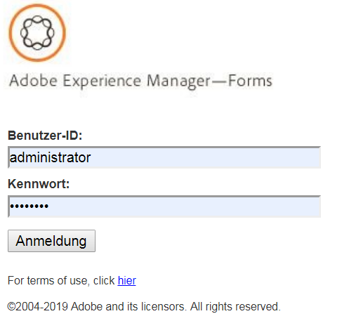

# Einführung in die Prozessberichterstellung{#introduction-to-process-reporting}

Process Reporting ist ein browserbasiertes Tool, mit dem Sie Berichte zu AEM Forms-Prozessen und -Aufgaben erstellen und anzeigen können.

Die Prozessberichterstellung bietet eine Reihe vordefinierter Berichte, mit denen Sie Informationen zu langwierigen Prozessen, Prozessdauer und Workflow-Volumen filtern und anzeigen können.

Darüber hinaus bietet Process Reporting eine Oberfläche zum Ausführen von Ad-hoc-Abfragen und zum Integrieren benutzerdefinierter Berichtsansichten in die Benutzeroberfläche für Process Reporting.

Eine Liste der unterstützten Browser finden Sie unter [Unterstützte Plattformen für AEM Forms](/help/forms/using/aem-forms-jee-supported-platforms.md).

Prozessberichte basieren auf Modulen, die:

* Prozessdaten aus der AEM Forms-Datenbank lesen
* Veröffentlichen von Prozessdaten in einem eingebetteten Process Reporting-Repository
* Bietet eine browserbasierte Benutzeroberfläche zum Anzeigen von Berichten

## Schlüsselfunktionen {#key-capabilities}

### Always-on Reporting {#always-on-reporting}

Zeigen Sie die Liste der Prozesse mit langer Laufzeit an, erstellen Sie Diagramme zur Prozessdauer und führen Sie benutzerdefinierte Abfragen mithilfe von Filtern aus.

Die Prozessberichterstellung bietet außerdem die Möglichkeit, die Berichts- und Abfragedaten im CSV-Format zu exportieren.

### Adhoc-Berichte {#adhoc-reports}

Verwenden Sie Filter, um eine bestimmte Ansicht Ihrer Daten zu erhalten.

Sie können Prozesse oder Aufgaben nach ID, Dauer, Start- und Enddatum, Prozessinitiator usw. suchen.

Sie können mehrere Filter kombinieren, um bestimmte Berichte zu erstellen.

Anschließend können Sie die Berichtsfilter speichern, um sie zu einem späteren Zeitpunkt auszuführen.

### Prozess-/Aufgabenverlauf {#process-task-history}

AEM Forms-Server führen zahlreiche Prozesse parallel aus. Diese Prozesse verändern sich weiter von einem Status zum nächsten. Durch die regelmäßige Veröffentlichung von Forms-Daten in das Process Reporting-Repository werden die Übergangsinformationen zu den in AEM Forms ausgeführten Prozessen in Process Reporting beibehalten.

### Zugriffssteuerung {#access-control-br}

Prozessberichte bieten berechtigungsbasierten Zugriff auf die Benutzeroberfläche.

Dies bedeutet, dass nur Benutzer mit Berichterstellungsberechtigungen Zugriff auf die Benutzeroberfläche &quot;Process Reporting&quot;haben.
