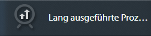
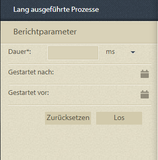
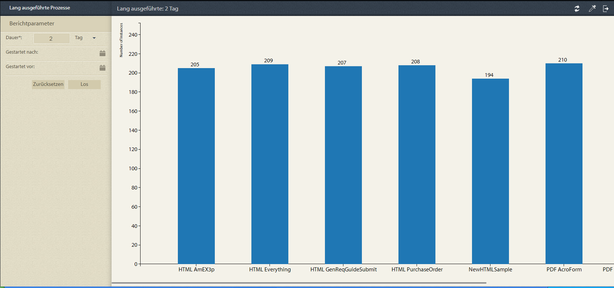
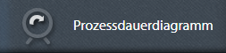
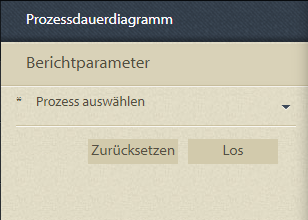
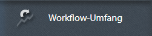
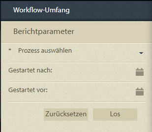

# Vordefinierte Berichte in Prozessberichten {#pre-defined-reports-in-process-reporting}

## Vordefinierte Berichte in Prozessberichten {#pre-defined-reports-in-process-reporting-1}

AEM Forms Process Reporting wird mit den folgenden *nativen* Berichten geliefert:

* **[Lange laufende Prozesse](#long-running-processes)**: Ein Bericht über alle AEM Forms-Prozesse, deren Abschluss länger als eine bestimmte Zeit dauerte
* **[Diagramm](#process-duration-report)** für die Prozessdauer: Ein Bericht eines bestimmten AEM Forms-Prozesses nach Dauer
* **[Workflow-Volumen](#workflow-volume-report)**: Ein Bericht der ausgeführten und abgeschlossenen Instanzen des angegebenen Prozesses nach Datum

## Lange laufende Prozesse {#long-running-processes}

Der Bericht &quot;Lange laufende Prozesse&quot;zeigt die AEM Forms-Prozesse an, deren Abschluss länger als eine bestimmte Zeit in Anspruch genommen hat.

### So führen Sie einen Bericht zum langwierigen Prozess aus {#to-execute-a-long-running-process-report}

1. Um die Liste der vordefinierten Berichte in der Prozessberichterstellung anzuzeigen, klicken Sie in der Baumstruktur **Prozessberichte** auf den Knoten **Berichte** .
1. Klicken Sie auf den Berichtknoten **Lange laufende Prozesse** .

   

   Wenn Sie einen Bericht auswählen, wird das Bedienfeld **Berichtsparameter** rechts neben der Baumansicht angezeigt.

   

   Parameter:

   * **Dauer**  (*erforderlich*): Geben Sie eine Dauer und eine Zeiteinheit an. Zeigt alle AEM Forms-Prozesse an, die länger als die angegebene Dauer ausgeführt wurden.
   * **Started After**  (*optional*): Wählen Sie ein Datum aus. Filtern Sie den Bericht, um Prozessinstanzen anzuzeigen, die nach dem angegebenen Datum gestartet wurden.
   * **Started Before**  (*optional*): Wählen Sie ein Datum aus. Filtern Sie den Bericht, um Prozessinstanzen anzuzeigen, die vor dem angegebenen Datum gestartet wurden.

1. Klicken Sie auf **Los** , um den Bericht auszuführen.

   Der Bericht wird im Bereich **Bericht** rechts neben dem Fenster **Prozessberichte** angezeigt.

   

   Verwenden Sie die Optionen in der oberen rechten Ecke des Bedienfelds **Bericht** , um die folgenden Vorgänge für den Bericht auszuführen.

   * **Aktualisieren**: Aktualisiert den Bericht mit den neuesten Daten im Speicher
   * **Ändern der Legendenfarbe**: Auswählen und Ändern der Farbe der Berichtslegende
   * **Exportieren in CSV**: Daten aus dem Bericht exportieren und in eine kommagetrennte Datei herunterladen

## Bericht zur Prozessdauer {#process-duration-report}

Der Bericht &quot;Prozessdauer&quot;zeigt die Anzahl der Instanzen eines Forms-Prozesses nach Anzahl der Tage an, die jede Instanz ausgeführt wurde.

### So führen Sie einen Bericht zur Prozessdauer aus {#to-execute-a-process-duration-report}

1. Um die vordefinierten Berichte in Process Reporting anzuzeigen, klicken Sie in der Baumstruktur **Process Reporting** auf den Knoten **Berichte** .
1. Klicken Sie auf den Berichtknoten **Verarbeitungsdauer** .

   

   Wenn Sie einen Bericht auswählen, wird das Bedienfeld **Berichtsparameter** rechts neben der Baumansicht angezeigt.

   

   Parameter:

   * **Wählen Sie Process**  (*mandatory*) aus: Wählen Sie einen AEM Forms-Prozess aus.

1. Klicken Sie auf **Los** , um den Bericht auszuführen.

   Der Bericht wird im Bereich **Bericht** rechts neben dem Fenster &quot;Process Reporting&quot;angezeigt.

   

   Verwenden Sie die Optionen in der oberen rechten Ecke des Bedienfelds **Bericht** , um die folgenden Vorgänge für den Bericht auszuführen.

   * **Aktualisieren**: Aktualisiert den Bericht mit den neuesten Daten im Speicher
   * **Ändern der Legendenfarbe**: Auswählen und Ändern der Farbe der Berichtslegende
   * **Exportieren in CSV**: Daten aus dem Bericht exportieren und in eine kommagetrennte Datei herunterladen

## Workflow-Volumenbericht {#workflow-volume-report}

Der Bericht Workflow-Volumen zeigt die Anzahl der derzeit ausgeführten und abgeschlossenen Instanzen eines AEM Forms-Prozesses nach Kalendertagen an.

### So führen Sie einen Workflow-Volumenbericht aus {#to-execute-a-workflow-volume-report}

1. Um die vordefinierten Berichte in Process Reporting anzuzeigen, klicken Sie in der Baumstruktur **Process Reporting** auf den Knoten **Berichte** .
1. Klicken Sie auf den Berichtknoten **Workflow-Volumen** .

   

   Wenn Sie einen Bericht auswählen, wird das Bedienfeld **Berichtsparameter** rechts neben der Baumansicht angezeigt.

   

   Parameter:

   * **Wählen Sie Process**  (*mandatory*) aus: Wählen Sie einen AEM Forms-Prozess aus.

   * **Started After**  (*optional*): Wählen Sie ein Datum aus. Filtert den Bericht, um Prozessinstanzen anzuzeigen, die nach dem angegebenen Datum gestartet wurden.

   * **Started Before**  (*optional*): Wählen Sie ein Datum aus. Filtert den Bericht, um Prozessinstanzen anzuzeigen, die vor dem angegebenen Datum gestartet wurden.

1. Klicken Sie auf **Los** , um den Bericht auszuführen.

   Der Bericht wird im Bereich **Bericht** rechts neben dem Fenster **Prozessberichte** angezeigt.

   

   Verwenden Sie die Optionen in der oberen rechten Ecke des Bedienfelds **Bericht** , um die folgenden Vorgänge für den Bericht auszuführen.

   * **Aktualisieren**: Aktualisiert den Bericht mit den neuesten Daten im Speicher
   * **Ändern der Legendenfarbe**: Auswählen und Ändern der Farbe der Berichtslegende
   * **Exportieren in CSV**: Daten aus dem Bericht exportieren und in eine kommagetrennte Datei herunterladen
