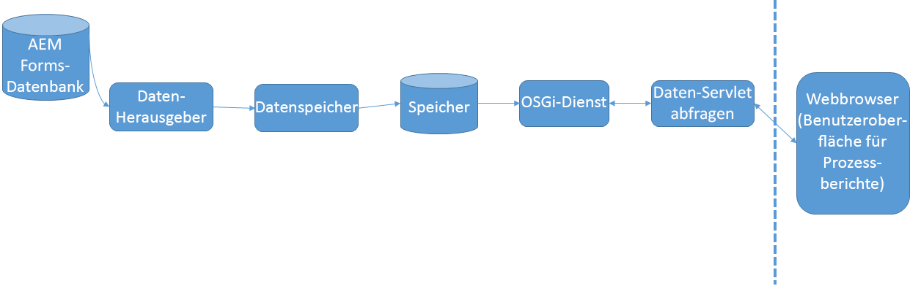

# Funktionsweise von Prozessberichten{#how-process-reporting-works}

Prozessberichte sind das Berichtsmodul von AEM Forms on JEE.

Mit der Prozessberichterstellung können Sie Berichte zu AEM Forms-Prozessen und -Aufgaben ausführen.

Process Reporting verwendet das eingebettete Process Reporting-Repository, um Forms-Daten zu veröffentlichen. Anschließend werden diese Daten zum Ausführen von Berichten verwendet.

Process Reporting besteht aus den folgenden Modulen:

* [ProcessDataPublisher-Dienst](#processdatapublisher-service-br-p)
* [ProcessDataStorage-Dienst](#processdatastorageprovider-service-br-p)
* [OSGi-Dienst](#osgi-service-br-p)
* [Query Data-Servlet](#querydataservlet-service-br-p)
* [Benutzeroberfläche für Prozessberichte](#process-reporting-user-interface-br-p)

## Architektur der Prozessberichterstellung {#process-reporting-architecture-br}

## Process Reporting-Module {#process-reporting-modules}

### ProcessDataPublisher-Dienst {#processdatapublisher-service-br}

Der ProcessDataPublisher-Server wird regelmäßig in der AEM Forms-Datenbank ausgeführt und extrahiert die Daten, die seit der letzten Ausführung des Dienstes geändert wurden. Anschließend werden die Daten im Process Data Storage-Dienst veröffentlicht.

Weitere Informationen zum Konfigurieren des Dienstes finden Sie unter [Konfigurieren des ProcessDataPublisher-Dienstes](/help/forms/using/process-reporting/install-start-process-reporting.md#p-reportconfiguration-service-p).

### ProcessDataStorageProvider-Dienst {#processdatastorageprovider-service-br}

Der ProcessDataStorageProvider-Dienst empfängt Prozessdaten vom ProcessDataPublisher-Dienst und speichert die Daten im Process Reporting-Repository.

Weitere Informationen zum Konfigurieren des Dienstes finden Sie unter [Konfigurieren des ProcessDataStorageProvider-Diensts](/help/forms/using/process-reporting/install-start-process-reporting.md#p-to-configure-the-process-reporting-repository-locations-p).

### OSGi-Dienst {#osgi-service-br}

Das QueryDataServlet verwendet diesen Dienst zum Abrufen der Berichtsdaten aus dem Process Reporting-Repository.

### QueryDataServlet-Dienst {#querydataservlet-service-br}

Der QueryDataServlet-Dienst akzeptiert Abfragen aus der Benutzeroberfläche &quot;Process Reporting&quot;.

Der Dienst verwendet dann OSGi-Dienste, um die relevanten Berichtsdaten abzurufen, die Daten zu verarbeiten und die Daten an die Benutzeroberfläche zurückzugeben.

### Benutzeroberfläche für Prozessberichte {#process-reporting-user-interface-br}

Die Benutzeroberfläche &quot;Process Reporting&quot;ist eine webbrowserbasierte Oberfläche. Sie verwenden diese Schnittstelle, um Prozess- und Aufgabeninformationen anzuzeigen, die aus der AEM Forms-Datenbank veröffentlicht werden.

Eine Einführung in die Benutzeroberfläche für die Prozessberichterstellung finden Sie unter [Benutzeroberfläche für die Prozessberichterstellung](/help/forms/using/process-reporting/introduction-process-reporting.md).

### QueryDataServlet-Dienst {#querydataservlet-service-br-1}

Der QueryDataServlet-Dienst akzeptiert Abfragen aus der Benutzeroberfläche &quot;Process Reporting&quot;.

Der Dienst verwendet dann OSGi-Dienste, um die relevanten Berichtsdaten abzurufen, die Daten zu verarbeiten und die Daten an die Benutzeroberfläche zurückzugeben.

### Benutzerspezifische Berichte {#custom-reports-br}

Sie können Ihre eigenen benutzerspezifischen Berichte erstellen und diese Berichte auf der Registerkarte Benutzerspezifische Berichte der Benutzeroberfläche &quot;Process Reporting&quot;anzeigen.

Die Schritte zum Erstellen eines benutzerspezifischen Berichts finden Sie unter So erstellen Sie einen benutzerspezifischen Bericht im Artikel [Benutzerspezifische Berichte in Prozessberichten](/help/forms/using/process-reporting/process-reporting-custom-reports.md).
