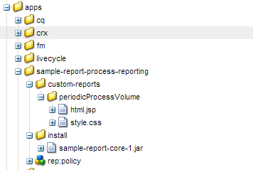
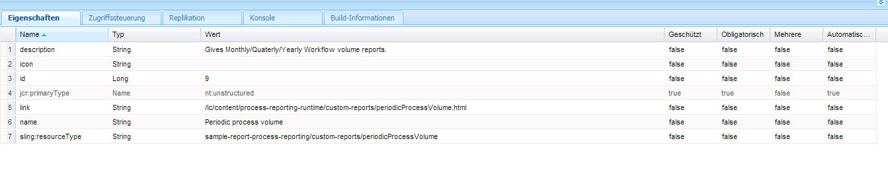

# Benutzerdefinierte Berichte im Prozess-Reporting{#custom-reports-in-process-reporting}

Sie können die REST-Schnittstelle von QueryBuilder verwenden oder einen OSGi-Service mithilfe der QueryBuilder API erstellen, um einen benutzerdefinierten Bericht zu erstellen.

## Allgemeine Schritte zum Erstellen eines benutzerspezifischen Berichts {#generic-steps-to-build-a-custom-report}

Führen Sie vor dem Hinzufügen eines benutzerdefinierten Berichts das folgende Verfahren für Vorlagen aus:

1. In benutzerdefinierten Berichten verwendete Daten müssen im Prozess-Reporting verfügbar sein. Um die Verfügbarkeit der Daten zu gewährleisten, planen Sie einen Cron-Job oder verwenden Sie die Option **[Sync](https://helpx.adobe.com/de/livecycle/help/process-reporting/install-start-process-reporting.html#Process%20Reporting%20Home%20screen)** der Prozess-Reporting-UI.
1. Die URL-Anfrage (die die gewünschte Anfrage einkapselt) muss ein entsprechendes Objekt mit dem Abfrageergebnis zurückgeben. Um eine Abfrage zu erstellen, können Sie die REST-Schnittstelle von [QueryBuilder](https://experienceleague.adobe.com/docs/experience-manager-cloud-service/content/implementing/developing/full-stack/search/query-builder-api.html?lang=de) verwenden, um einen OSGi-Dienst mit der QueryBuilder API zu erstellen. Sie können dynamische oder statische Anfragen erstellen.

1. Erstellen Sie eine benutzerdefinierte Benutzeroberfläche, um die Ergebnisse anzuzeigen. Sie können eine eigenständige Benutzeroberfläche erstellen oder Ergebnisse in die vorhandene Prozess-Reporting-UI integrieren.

## Verwenden der REST-Schnittstelle von QueryBuilder {#using-the-rest-interface-of-the-querybuilder}

Die CRX QueryBuilder REST-Schnittstelle stellt die Funktionalität des Query Builders für Asset-Freigaben über eine Java API und eine REST API bereit. Erfahren Sie, wie die [CRX QueryBuilder REST-Schnittstelle](https://experienceleague.adobe.com/docs/experience-manager-cloud-service/content/implementing/developing/full-stack/search/query-builder-api.html?lang=de) verwendet wird, bevor Sie die folgenden Schritte ausführen:

1. Navigieren Sie zur URL `https://'[server]:[port]'/lc/bin/querybuilder.json`
1. Erstellen Sie eine Abfrage basierend auf der Knotenstruktur und den Knoteneigenschaften des Speicherknotens Prozess-Reporting.

   Sie können optionale Parameter verwenden, um Versatz, Begrenzung, Treffer und Eigenschaften anzugeben. Sie können die Argumente für statische Berichte fest kodieren und die Parameter aus der UI für dynamische Berichte abrufen.

   Die Abfrage für den Abruf aller Prozessnamen lautet:

   `https://'[server]:[port]'/lc/bin/querybuilder.json?exact=false&p.hits=selective&p.properties=pmProcessTitle&path=%2fcontent%2freporting%2fpm&property=pmNodeType&property.operation=equals&property.value=ProcessType&type=sling%3aFolder`

   >[!NOTE]
   >
   >In jeder Abfrage verweist der Pfadparameter auf den crx-Speicherort und die Zeichen werden gemäß dem URL-Standard maskiert.

## Erstellen eines Service mit der Query Builder API  {#creating-a-service-using-query-builder-api-nbsp}

Voraussetzung für die Erstellung eines Service mit der Query Builder API sind die [Erstellung und Bereitstellung des CQ-OSGI-Pakets](https://experienceleague.adobe.com/docs/experience-manager-release-information/aem-release-updates/previous-updates/aem-previous-versions.html?lang=de) sowie die [Verwendung der Query Builder API](https://experienceleague.adobe.com/docs/experience-manager-cloud-service/content/implementing/developing/full-stack/search/query-builder-api.html?lang=de).

1. Erstellen Sie einen OSGi-Service mit entsprechenden Anmerkungen. Verwenden Sie für den Zugriff auf QueryBuilder Folgendes:

   ```java
   @Reference(referenceInterface = QueryBuilder.class)
    private QueryBuilder queryBuilder;
   ```

1. Erstellen Sie eine Gruppe für Eigenschaften. Der Code zum Erstellen einer Gruppe für Eigenschaften lautet:

   ```java
   PredicateGroup predicateGroup = new PredicateGroup();
    predicateGroup.setAllRequired(true);
   ```

1. Fügen Sie der neu erstellten predicateGroup Eigenschaften hinzu. Einige nützliche Prädikat-Konstrukte sind [JcrBoolPropertyPredicateEvaluator in 5.3](https://experienceleague.adobe.com/docs/experience-manager-release-information/aem-release-updates/previous-updates/aem-previous-versions.html?lang=de), [JcrPropertyPredicateEvaluator in 5.3](https://experienceleague.adobe.com/docs/experience-manager-release-information/aem-release-updates/previous-updates/aem-previous-versions.html?lang=de), [RangePropertyPredicateEvaluator in 5.3](https://experienceleague.adobe.com/docs/experience-manager-release-information/aem-release-updates/previous-updates/aem-previous-versions.html?lang=de), [DateRangePredicateEvaluator in 5.3](https://experienceleague.adobe.com/docs/experience-manager-release-information/aem-release-updates/previous-updates/aem-previous-versions.html?lang=de) und [TypePredicateEvaluator in 5.3](https://experienceleague.adobe.com/docs/experience-manager-release-information/aem-release-updates/previous-updates/aem-previous-versions.html?lang=de).

   Bei statischen Berichten werden die Eigenschaften fest kodiert, während bei dynamischen Berichten die Eigenschaften aus der Anfrage abgerufen werden.

   Beispielcode zum Abrufen aller Instanzen eines Prozesses:

   ```java
   Predicate predicate;
   
     //Add the path Constraint
     predicate = new Predicate(PathPredicateEvaluator.PATH);
     predicate.set(PathPredicateEvaluator.PATH, "/content/reporting/pm"); // should point to the crx path being used to store data
     predicate.set(PathPredicateEvaluator.EXACT, "false");
     predicateGroup.add(predicate);
   
     //type nt:unstructured
     predicate = new Predicate(TypePredicateEvaluator.TYPE);
     predicate.set(TypePredicateEvaluator.TYPE, "nt:unstructured");
     predicateGroup.add(predicate);
   
     //NodeType: Process Instance
     predicate = new Predicate(JcrPropertyPredicateEvaluator.PROPERTY);
     predicate.set(JcrPropertyPredicateEvaluator.PROPERTY, "pmNodeType");
     predicate.set(JcrPropertyPredicateEvaluator.OPERATION, JcrPropertyPredicateEvaluator.OP_EQUALS);
     predicate.set(JcrPropertyPredicateEvaluator.VALUE, "ProcessInstance");
     predicateGroup.add(predicate);
   
     //processName
     predicate = new Predicate(JcrPropertyPredicateEvaluator.PROPERTY);
     predicate.set(JcrPropertyPredicateEvaluator.PROPERTY, "pmProcessName");
     predicate.set(JcrPropertyPredicateEvaluator.OPERATION, JcrPropertyPredicateEvaluator.OP_EQUALS);
     predicate.set(JcrPropertyPredicateEvaluator.VALUE, processName); //processName variable stores the name of the process whose instances need to be searched
     predicateGroup.add(predicate);
   ```

1. Definieren Sie die Abfrage mithilfe der predicateGroup.

   `Query query = queryBuilder.createQuery(predicateGroup, session);`

1. Rufen Sie das Ergebnis der Abfrage ab.

   ```java
   query.setStart(offset); // hardcode or fetch from request
           if(hits == -1)         // hardcode or fetch from request
               hits = 0;
           query.setHitsPerPage(hits);
           SearchResult searchResult = query.getResult();
   ```

1. Iterieren Sie über das Ergebnis und wandeln Sie die Ergebnisse in das gewünschte Format um. Der Code zum Senden der Ergebnisse im CSV-Format lautet:

   ```java
   Iterator<Node> iter = searchResult.getNodes();
                   while(iter.hasNext()) {
                       Node node = iter.next();
                       row = new StringBuilder();
                       for (String property : includeProperties) { // the properties of the node which needs to be returned, or one can return all the properties too.
                           try {
                               row.append(node.getProperties(property).nextProperty().getString() + COMMA_SEPARATOR);
                           } catch (NoSuchElementException e) {
                               //Adding separator for no value
                               row.append(COMMA_SEPARATOR);
                           } catch (RepositoryException e) {
                               e.printStackTrace();
                           }
                       }
                       row.deleteCharAt(row.lastIndexOf(COMMA_SEPARATOR));
                       row.append(NEW_LINE);
                       out.write(row.toString().getBytes());
   ```

1. Verwenden Sie zum Erstellen eines OSGi-Bundles für das Servlet das `org.apache.felix maven-bundle-plugin`.

1. Stellen Sie das Bundle auf dem CRX-Server bereit.

### Service-Beispiel {#service-example}

Im folgenden Service-Beispiel werden am Ende jedes Monats, Quartals bzw. Jahres Instanzen eines Prozesses gezählt, der sich im Zustand **WIRD AUSGEFÜHRT** bzw. **ABGESCHLOSSEN** befindet.

```java
package custom.reporting.service;

import java.text.DateFormatSymbols;
import java.util.Calendar;
import java.util.HashMap;
import java.util.Iterator;
import java.util.LinkedHashMap;
import java.util.Map;
import java.util.SortedSet;
import java.util.TreeSet;

import javax.jcr.Node;
import javax.jcr.Session;

import org.apache.felix.scr.annotations.Component;
import org.apache.felix.scr.annotations.Reference;
import org.apache.felix.scr.annotations.Service;

import com.day.cq.search.Predicate;
import com.day.cq.search.PredicateGroup;
import com.day.cq.search.Query;
import com.day.cq.search.QueryBuilder;
import com.day.cq.search.eval.JcrPropertyPredicateEvaluator;
import com.day.cq.search.eval.PathPredicateEvaluator;
import com.day.cq.search.eval.TypePredicateEvaluator;
import com.day.cq.search.result.SearchResult;

@Component(metatype = true, immediate = true, label = "PeriodicProcessVolume", description = "Service for supporting cutom reports pluggable to Process Reporting.")
@Service(value = PeriodicProcessVolume.class)
public class PeriodicProcessVolume {

    private static String[] monthNameList = new DateFormatSymbols().getMonths();
    private static String[] quaterNameList = { "I", "II", "III", "IV" };

    private final Map<Integer, Map<Integer, Long[]>> monthly = new HashMap<Integer, Map<Integer, Long[]>>();
    private final Map<Integer, Map<Integer, Long[]>> quaterly = new HashMap<Integer, Map<Integer, Long[]>>();
    private final Map<Integer, Long[]> yearly = new HashMap<Integer, Long[]>();

    @Reference(referenceInterface = QueryBuilder.class)
    private QueryBuilder queryBuilder;

    private void addConstraints(PredicateGroup predicateGroup, String processName) {
        Predicate predicate;

        //Add the path Constraint
        predicate = new Predicate(PathPredicateEvaluator.PATH);
        predicate.set(PathPredicateEvaluator.PATH, "/content/reporting/pm");
        predicate.set(PathPredicateEvaluator.EXACT, "false");
        predicateGroup.add(predicate);

        //type nt:unstructured
        predicate = new Predicate(TypePredicateEvaluator.TYPE);
        predicate.set(TypePredicateEvaluator.TYPE, "nt:unstructured");
        predicateGroup.add(predicate);

        //NodeType: Process Instance
        predicate = new Predicate(JcrPropertyPredicateEvaluator.PROPERTY);
        predicate.set(JcrPropertyPredicateEvaluator.PROPERTY, "pmNodeType");
        predicate.set(JcrPropertyPredicateEvaluator.OPERATION, JcrPropertyPredicateEvaluator.OP_EQUALS);
        predicate.set(JcrPropertyPredicateEvaluator.VALUE, "ProcessInstance");
        predicateGroup.add(predicate);

        //processName
        if (processName != null) {
            predicate = new Predicate(JcrPropertyPredicateEvaluator.PROPERTY);
            predicate.set(JcrPropertyPredicateEvaluator.PROPERTY, "pmProcessName");
            predicate.set(JcrPropertyPredicateEvaluator.OPERATION, JcrPropertyPredicateEvaluator.OP_EQUALS);
            predicate.set(JcrPropertyPredicateEvaluator.VALUE, processName);
            predicateGroup.add(predicate);
        }
    }

    private Long[] setFrequency(Long[] frequency, int index) {
        if (frequency == null) {
            frequency = new Long[2];
            frequency[0] = 0L;
            frequency[1] = 0L;
        }
        frequency[index] = frequency[index] + 1L;
        return frequency;
    }

    public void populateValues(Session session, String processName) {
        PredicateGroup predicateGroup = new PredicateGroup();
        predicateGroup.setAllRequired(true);
        try {
            addConstraints(predicateGroup, processName);

            long batchSize = 10000L;
            long start = 0l;

            while (true) {
                Query query = queryBuilder.createQuery(predicateGroup, session);
                query.setStart(start);
                query.setHitsPerPage(batchSize);
                SearchResult searchResult = query.getResult();
                Iterator<Node> itr = searchResult.getNodes();
                long length = 0;
                while (itr.hasNext()) {
                    length++;
                    Node n = itr.next();
                    Calendar calender = n.getProperty("pmCreateTime").getDate();
                    String status = n.getProperty("pmStatus").getString();
                    int index = 0;
                    if ("COMPLETE".equals(status)) {
                        index = 1;
                    } else if ("RUNNING".equals(status)) {
                        index = 0;
                    } else {
                        continue;
                    }
                    int month = calender.get(Calendar.MONTH);
                    int year = calender.get(Calendar.YEAR);
                    int quater;
                    if (month < 3) {
                        quater = 1;
                    } else if (month < 6) {
                        quater = 2;
                    } else if (month < 9) {
                        quater = 3;
                    } else {
                        quater = 4;
                    }

                    Long frequency[];
                    Map<Integer, Long[]> yearMonthMap = this.monthly.get(year);
                    if (yearMonthMap == null) {
                        yearMonthMap = new HashMap<Integer, Long[]>();
                    }
                    frequency = yearMonthMap.get(month);
                    frequency = setFrequency(frequency, index);
                    yearMonthMap.put(month, frequency);
                    this.monthly.put(year, yearMonthMap);

                    Map<Integer, Long[]> yearQuaterMap = this.quaterly.get(year);
                    if (yearQuaterMap == null) {
                        yearQuaterMap = new HashMap<Integer, Long[]>();
                    }
                    frequency = yearQuaterMap.get(quater);
                    frequency = setFrequency(frequency, index);
                    yearQuaterMap.put(quater, frequency);
                    this.quaterly.put(year, yearQuaterMap);

                    frequency = this.yearly.get(year);
                    frequency = setFrequency(frequency, index);
                    this.yearly.put(year, frequency);
                }

                if (length < batchSize) {
                    break;
                } else {
                    start = start + batchSize;
                }
            }
        } catch (Exception e) {
            e.printStackTrace();
        }

    }

    public Map<String, Long[]> getMonthly() {
        Map<String, Long[]> result = new LinkedHashMap<String, Long[]>();
        SortedSet<Integer> years = new TreeSet<Integer>(monthly.keySet());
        for (Integer year : years) {
            Map<Integer, Long[]> yearMonthMap = monthly.get(year);
            SortedSet<Integer> months = new TreeSet<Integer>(yearMonthMap.keySet());
            for (Integer month : months) {
                String str = monthNameList[month] + " " + year;
                result.put(str, yearMonthMap.get(month));
            }
        }
        return result;
    }

    public Map<String, Long[]> getQuaterly() {
        Map<String, Long[]> result = new LinkedHashMap<String, Long[]>();
        SortedSet<Integer> years = new TreeSet<Integer>(quaterly.keySet());
        for (Integer year : years) {
            Map<Integer, Long[]> quaterMonthMap = quaterly.get(year);
            SortedSet<Integer> quaters = new TreeSet<Integer>(quaterMonthMap.keySet());
            for (Integer quater : quaters) {
                String str = quaterNameList[quater - 1] + " " + year;
                result.put(str, quaterMonthMap.get(quater));
            }
        }
        return result;
    }

    public Map<Integer, Long[]> getYearly() {
        return yearly;
    }

}
```

Beispiel für eine `pom.xml`-Datei, die über den Service erstellt werden soll:

```xml
<project xmlns="https://maven.apache.org/POM/4.0.0" xmlns:xsi="https://www.w3.org/2001/XMLSchema-instance" xsi:schemaLocation="https://maven.apache.org/POM/4.0.0 https://maven.apache.org/maven-v4_0_0.xsd">
    <modelVersion>4.0.0</modelVersion>

    <!-- ====================================================================== -->
    <!-- P R O J E C T  D E S C R I P T I O N                                   -->
    <!-- ====================================================================== -->
    <groupId>com.custom</groupId>
    <artifactId>sample-report-core</artifactId>
    <packaging>bundle</packaging>
    <name>PR Sample Report</name>
    <description>Bundle providing support for a custom report pluggable to process reporting.</description>
    <version>1</version>

    <!-- ====================================================================== -->
    <!-- B U I L D   D E F I N I T I O N                                        -->
    <!-- ====================================================================== -->
    <build>
        <plugins>
          <plugin>
              <groupId>org.apache.felix</groupId>
              <artifactId>maven-bundle-plugin</artifactId>
              <version>2.3.7</version>
              <extensions>true</extensions>
              <configuration>
                    <instructions>
                        <Bundle-Category>sample-report</Bundle-Category>
                        <Export-Package>
                            custom.reporting.service.*;
                        </Export-Package>
                     </instructions>
              </configuration>
          </plugin>
          <plugin>
                <groupId>org.apache.felix</groupId>
                <artifactId>maven-scr-plugin</artifactId>
                <version>1.11.0</version>
                <executions>
                    <execution>
                        <id>generate-scr-scrdescriptor</id>
                        <goals>
                            <goal>scr</goal>
                        </goals>
                        <configuration>
                            <!-- Private service properties for all services. -->
                            <properties>
                                <service.vendor>Sample Report</service.vendor>
                            </properties>
                        </configuration>
                    </execution>
                </executions>
            </plugin>
        </plugins>
    </build>

    <!-- ====================================================================== -->
    <!-- D E P E N D E N C I E S                                                -->
    <!-- ====================================================================== -->
    <dependencies>
        <dependency>
          <groupId>com.day.cq</groupId>
          <artifactId>cq-search</artifactId>
          <version>5.6.4</version>
        </dependency>

        <dependency>
          <groupId>javax.jcr</groupId>
          <artifactId>jcr</artifactId>
          <version>2.0</version>
        </dependency>

        <dependency>
          <groupId>org.apache.felix</groupId>
          <artifactId>org.apache.felix.scr.annotations</artifactId>
          <version>1.9.0</version>
        </dependency>
    </dependencies>
</project>
```

## Erstellen einer separaten Benutzeroberfläche  {#creating-a-separate-ui-nbsp}

Die Voraussetzungen für die Erstellung einer separaten Benutzeroberfläche für die Anzeige von Ergebnissen sind [Sling-Grundlagen in 5.6.1](https://experienceleague.adobe.com/docs/experience-manager-release-information/aem-release-updates/previous-updates/aem-previous-versions.html?lang=de), [Erstellen eines CRX-Knotens](https://experienceleague.adobe.com/docs/experience-manager-release-information/aem-release-updates/previous-updates/aem-previous-versions.html?lang=de) und die Bereitstellung entsprechender [Zugriffsberechtigungen](https://experienceleague.adobe.com/docs/experience-manager-release-information/aem-release-updates/previous-updates/aem-previous-versions.html?lang=de).

1. Erstellen Sie einen CRX-Knoten im `/apps`-Knoten und gewähren Sie geeignete Zugriffsberechtigungen. (PERM_PROCESS_REPORTING_USER)
1. Definieren Sie den Renderer im `/content`-Knoten.
1. Fügen Sie dem in Schritt 1 erstellten Knoten JSP- oder HTML-Dateien hinzu. Sie können auch CSS-Dateien hinzufügen.

   

   Beispielknoten mit JSP- und CSS-Dateien

1. Fügen Sie JavaScript-Code hinzu, um einen Ajax-Aufruf an die QueryBuilder REST-API oder Ihren Service zu starten. Fügen Sie außerdem geeignete Argumente hinzu.

1. Fügen Sie dem Ajax-Aufruf einen geeigneten Erfolgs-Handler hinzu, um das Ergebnis zu analysieren und anzuzeigen. Das Ergebnis lässt sich in mehreren Formaten (json/csv/benutzerdefiniert) analysieren und in einer Tabelle oder in anderen Formen anzeigen.

1. (Optional) Fügen Sie zu dem Ajax-Aufruf einen geeigneten Fehler-Handler hinzu.

Ein beispielhafter JSP-Code, der sowohl den OSGi-Service als auch die QueryBuilder-API verwendet, ist:

```html
<%@taglib prefix="sling" uri="https://sling.apache.org/taglibs/sling/1.0"%>
<%request.setAttribute("silentAuthor", new Boolean(true));%>
<%@include file="/libs/foundation/global.jsp"%>
<%@ page import="java.util.Map,
java.util.Set,
com.adobe.idp.dsc.registry.service.ServiceRegistry,
javax.jcr.Session,
org.apache.sling.api.resource.ResourceResolver,
custom.reporting.service.PeriodicProcessVolume"%>
<%
response.setContentType("text/html");
response.setCharacterEncoding("utf-8");
%><!DOCTYPE HTML>
<html>
    <head>
        <meta charset="UTF-8">

        <link rel="stylesheet" href="/lc/apps/sample-report-process-reporting/custom-reports/periodicProcessVolume/style.css">
        <title>REPORT Monthly / Qaterly / Yearly</title>
        <script type="text/javascript">

            <%
                slingResponse.setCharacterEncoding("utf-8");
                ResourceResolver resolver = slingRequest.getResourceResolver();
                String processName = slingRequest.getParameter("processName");
                Session session = resolver.adaptTo(Session.class);
                custom.reporting.service.PeriodicProcessVolume periodicProcessVolume = sling.getService(custom.reporting.service.PeriodicProcessVolume.class);
                periodicProcessVolume.populateValues(session, processName);
                if (processName == null) {
                    processName = "All";
                }
            %>
            var lineSeprator = "<td class='seprator'>----------------</td>";
            var tableEnder = "<tr>" + lineSeprator + lineSeprator + lineSeprator + "</tr>";

            var tableColHeader = "<td class='colHead colNum'>Running</td>";
            tableColHeader += "<td class='colHead  colNum'>Complete</td></tr>";
            tableColHeader += tableEnder;

            var monthly = "<table><tr><td class='colHead colStr'>Month</td>";
            monthly += tableColHeader;

            <%
                Map<String, Long[]> monthlyMap = periodicProcessVolume.getMonthly();
                Set<String> monthKeys = monthlyMap.keySet();
                for (String key: monthKeys) {
                    Long[] frequencies = monthlyMap.get(key);
            %>

            monthly += "<tr><td class='colStr'> <%= key %> </td>";
            monthly += "<td class='colNum'> <%= frequencies[0] %> </td>";
            monthly += "<td class='colNum'> <%= frequencies[1] %> </td></tr>";
            <%
                }
            %>

            monthly += tableEnder;

            var quaterly = "<table><tr><td class='colHead colStr'>Quater</td>";
            quaterly += tableColHeader;

            <%
                Map<String, Long[]> quaterMap = periodicProcessVolume.getQuaterly();
                Set<String> quaterKeys = quaterMap.keySet();
                for (String key: quaterKeys) {
                    Long[] frequencies = quaterMap.get(key);
            %>

            quaterly += "<tr><td class='colStr'> <%= key %> </td>";
            quaterly += "<td class='colNum'> <%= frequencies[0] %> </td>";
            quaterly += "<td class='colNum'> <%= frequencies[1] %> </td></tr>";
            <%
                }
            %>

            quaterly += tableEnder;

            var yearly = "<table><tr><td class='colHead colStr'>Year</td>";
            yearly += tableColHeader;

            <%
                Map<Integer, Long[]> yearMap = periodicProcessVolume.getYearly();
                Set<Integer> yearKeys = yearMap.keySet();
                for (Integer key: yearKeys) {
                    Long[] frequencies = yearMap.get(key);
            %>

            yearly += "<tr><td class='colStr'> <%= key %> </td>";
            yearly += "<td class='colNum'> <%= frequencies[0] %> </td>";
            yearly += "<td class='colNum'> <%= frequencies[1] %> </td></tr>";
            <%
                }
            %>

            yearly += tableEnder;

            function reloadFrame(value) {
                if (value === '-1') {
                    window.location = "/lc/content/process-reporting-runtime/custom-reports/periodicProcessVolume.html";
                } else {
                    window.location = "/lc/content/process-reporting-runtime/custom-reports/periodicProcessVolume.html?processName=" + value;
                }
            }

            function populateTable(selection) {
                if (selection === 0) {
                    document.getElementById('tableHeading').innerHTML = 'Monthly';
                    document.getElementById('volumeTable').innerHTML = monthly;
                } else if (selection === 1) {
                    document.getElementById('tableHeading').innerHTML = 'Quaterly';
                    document.getElementById('volumeTable').innerHTML = quaterly;
                } else {
                    document.getElementById('tableHeading').innerHTML = 'Yearly';
                    document.getElementById('volumeTable').innerHTML = yearly;
                }
            }

            function fetchProcesses() {
                var xmlhttp = new XMLHttpRequest(),
                    request = '';
                xmlhttp.onreadystatechange = function() {
                   if (xmlhttp.readyState === 4 && xmlhttp.status === 200) {
                       var responseText,
                           response,
                           items,
                           hits = [],
                           responseSize = 0,
                           processName,
                           selectedIndex = 0,
                           comboBox;
                       responseText = xmlhttp.responseText;
                       if (responseText !== undefined && responseText !== null) {
                           response = JSON.parse(responseText);
                           responseSize = response.results;
                           hits = response.hits;
                       }

                       items = "<option value='-1'>All</option>";

                       for(var i = 0; i < responseSize; i++) {
                           processName = hits[i].pmProcessTitle;
                           if (processName === '<%= processName %>') {
                               selectedIndex = i + 1;
                           }
                           items += "<option value='" + processName + "'>" + processName + "</option>"
                       }

                       comboBox = document.getElementById('processSelection');
                       comboBox.innerHTML = items;
                       comboBox.selectedIndex = selectedIndex;
                   }
               };
               request = "/lc/bin/querybuilder.json?";
               request += "exact=false&";
               request += "p.hits=selective&";
               request += "p.properties=pmProcessTitle&";
               request += "path=%2fcontent%2freporting%2fpm&";
               request += "property=pmNodeType&";
               request += "property.operation=equals&";
               request += "property.value=ProcessType&";
               request += "type=sling%3aFolder";

               xmlhttp.open("POST", request, true);
               xmlhttp.setRequestHeader("Content-type","application/json");
               xmlhttp.send();
            }

        </script>
    </head>
    <body onLoad="fetchProcesses();populateTable(0);">
        Process:
        <select id="processSelection" onchange="reloadFrame(this.value);"></select>
        &nbsp &nbsp Period Interval:
        <select name="periodSelection" onchange="populateTable(this.selectedIndex);">
            <option value="1">Monthly</option>
            <option value="2">Quaterly</option>
            <option value="3">Yearly</option>
        </select>
        <br> <br> <br> <br>
        <div class="inline"> Process: &nbsp <b><%= processName %></b> &nbsp &nbsp Period: &nbsp </div> <b> <div id="tableHeading" class="inline"> </div> </b>
        <br><br>
        <div id="volumeTable"> </div>

    </body>
</html>
```

## Integrieren der Berichtsbenutzeroberfläche in die vorhandene Benutzeroberfläche für die Prozessberichterstellung  {#integrating-report-ui-in-existing-process-reporting-ui-nbsp}

Grundvoraussetzungen für das Erstellen einer separaten Benutzeroberfläche zum Anzeigen von Ergebnissen sind: [Sling – Grundlagen](https://wem.help.adobe.com/enterprise/de_DE/10-0/wem/developing/the_basics.html), [Erstellen eines CRX-Knotens](/help/sites-developing/developing-with-crxde-lite.md#creating-a-node) und das Bereitstellen geeigneter [Zugriffsberechtigungen](/help/sites-developing/developing-with-crxde-lite.md#access-control).

1. Erstellen Sie eine separate Benutzeroberfläche.
1. Erstellen Sie für jeden Plug-In-fähigen Bericht im `/content/process-reporting-runtime/custom-reports`-Knoten einen untergeordneten `nt:unstructured`-Knoten.

   * **id**- Gibt die eindeutige Identifikationsnummer des Berichts an.
   * **name**- Gibt den Namen des Berichts an. Der Name wird in der Benutzeroberfläche angezeigt.
   * **link**- Gibt einen relativen Link zum Renderer der separaten Benutzeroberfläche an. Der Link wird in Schritt 1 erstellt.
   * **description**- Gibt die einzeilige Beschreibung des Berichts an. Das Beschreibungsfeld darf leer bleiben.
   * **icon**- Gibt die Grafik an, die den Bericht symbolisieren soll. Das Symbolfeld darf leer bleiben.

   

   Knoteneigenschaften

1. Die Berichtsbenutzeroberfläche ist in die Benutzeroberfläche für die Prozessberichterstellung integriert. Nach der Integration der Benutzeroberfläche sieht die aktualisierte Benutzeroberfläche den folgenden Bildern ähnlich:

   

   Benutzeroberfläche neu hinzugefügter benutzerdefinierter Berichte

   

   Ergebnisbildschirm der benutzerdefinierten Berichte

## Beispielpaket {#sample-package}

Um benutzerdefinierter Berichte und Benutzeroberflächen, wie in dem Artikel erörtert, zu integrieren, importieren Sie das `sample-report-pkg-1.zip`-Paket in die Benutzeroberfläche für die Prozessverwaltung.

[Datei laden](assets/sample-report-pkg-1.zip)
