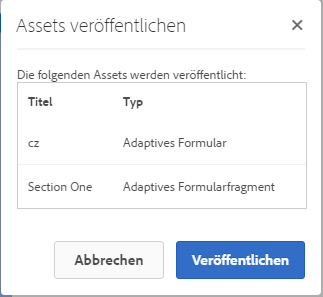
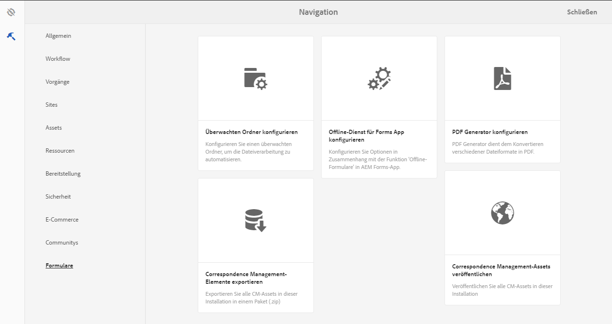
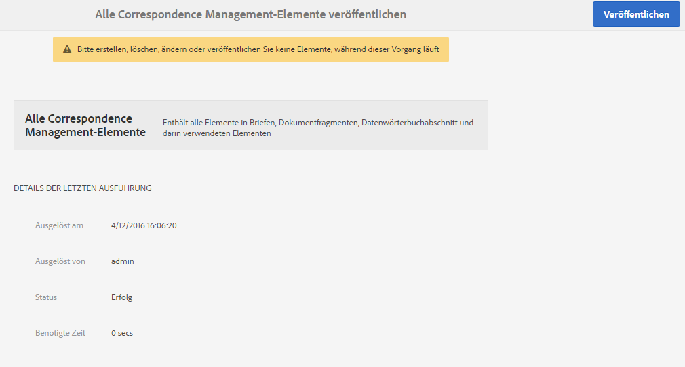

# Veröffentlichung von Formularen und Dokumenten und Veröffentlichungen rückgängig machen{#publishing-and-unpublishing-forms-and-documents}

Mit AEM Forms können Sie Formulare mühelos erstellen, veröffentlichen und die Veröffentlichung rückgängig machen. Weitere Informationen zu AEM Forms finden Sie in [Einführung zum Verwalten von Formularen](../../forms/using/introduction-managing-forms.md).

Der AEM Forms-Server umfasst zwei Instanzen: die Autoren- und die Veröffentlichungsinstanz. Der Autoreninstanz dient dem Erstellen und Verwalten von Formular-Assets und -Ressourcen. Die Veröffentlichungsinstanz dient zur Aufbewahrung von Assets und zugehörigen Ressourcen, die für Endbenutzer verfügbar sind. Sie können XDP- und PDF-Formulare im Author-Modus importieren. Detaillierte Informationen finden Sie unter [XDP- und PDF-Dokumente in AEM Forms aufrufen](../../forms/using/get-xdp-pdf-documents-aem.md).

## Unterstützte Asset   {#supported-assets-nbsp}

AEM Forms unterstützt die folgenden Assettypen:

* Adaptive Formulare
* Adaptive Dokumente
* Adaptive Formularfragmente
* Designs
* Formularvorlagen (XFA-Formulare)
* PDF-Formulare
* Dokumente (reduzierte PDF-Dokumente)
* Formularsätze
* Ressourcen (Bilder, Schemas und Stylesheets)

Zunächst sind alle Assets nur in der Autoreninstanz verfügbar. Ein Administrator oder Formularautor kann außer den Ressourcen alle Assets veröffentlichen.

Wenn Sie ein Formular auswählen und veröffentlichen, werden die zugehörigen Assets und Ressourcen ebenfalls veröffentlicht. Allerdings werden abhängige Assets nicht veröffentlicht. Mit zugehörigen Assets und Ressourcen sind in diesem Zusammenhang Assets gemeint, die von einem veröffentlichten Asset genutzt werden oder auf die dieses verweist. Abhängige Assets sind Assets, die auf ein veröffentlichtes Asset verweisen.

Ihre adaptiven Formulare können möglicherweise einige Konfigurationen, Einstellungen und Anpassungen verwenden, die nicht automatisch veröffentlicht werden. Es wird empfohlen, dass Sie diese Ressourcen veröffentlichen oder aktivieren, bevor Sie ein adaptives Formular veröffentlichen.

* Bearbeitbare adaptive Formularvorlagen
* Cloud-Dienstkonfigurationen für Adobe Sign, Typekit, reCAPTCHA und Form Data-Modelle
* Andere Cloud-Dienstkonfigationen sind nur aktiviert, wenn der Benutzer über Administratorberechtigungen verfügt.
* Anpassungen. Dazu zählen (jedoch nicht ausschließlich):

   * Benutzerdefinierte Layouts
   * Benutzerdefiniertes Erscheinungsbild
   * CSS-Datei - wird als Eingabe im Dialogfeld &quot;Eigenschaften des Containers für adaptive Formulare&quot;verwendet
   * Client-Bibliothekskategorie - wird als Eingabe im Dialogfeld Eigenschaften des Containers für adaptive Formulare verwendet
   * Andere Client-Bibliothek, die als Teil der adaptiven Formularvorlage enthalten sein kann.
   * Entwurfspfade

## Asset-Zustände {#asset-states}

Ein Asset kann über folgende Status verfügen:

* **Unveröffentlicht**: Ein Asset, das noch nie veröffentlicht wurde (dieser Status kann nur für Formular-Assets verwendet werden. Correspondence Management-Asset haben keine unveröffentlichten Status.)
* **Veröffentlicht**: Ein Asset, das veröffentlicht wurde und auf der Veröffentlichungsinstanz verfügbar ist
* **Geändert**: Ein Element, das nach seiner Veröffentlichung geändert wird

## Asset veröffentlichen {#publish-an-asset}

1. Melden Sie sich beim AEM Forms-Server an.
1. Verwenden Sie eines der folgenden Verfahren, um ein Asset auszuwählen und zu veröffentlichen.

   1. Bewegen Sie den Mauszeiger über ein Asset und tippen Sie auf **[!UICONTROL Veröffentlichen]** .
   1. Führen Sie einen der folgenden Schritte aus und tippen Sie dann auf „Veröffentlichen“:

      * Wenn Sie sich in der Kartenansicht befinden, tippen Sie auf **[!UICONTROL Auswahl eingeben]**  und tippen Sie auf das Asset. Das Asset wird ausgewählt.
      * Wenn Sie sich in der Listenansicht befinden, aktivieren Sie das Kontrollkästchen eines Assets. Das Asset wird ausgewählt.
      * Tippen Sie auf ein Asset, um dessen Details anzuzeigen.
      * Zeigen Sie die Eigenschaften eines Assets an, indem Sie auf Eigenschaften anzeigen  tippen.

      >[!NOTE]
      >
      >Wählen Sie nicht mehrere Assets aus. Das gleichzeitige Veröffentlichen mehrerer Assets wird nicht unterstützt.

1. Wenn der Veröffentlichungsprozess beginnt, wird ein Bestätigungsdialogfeld angezeigt, in dem alle zugehörigen Assets und Ressourcen aufgelistet sind. Tippen Sie im Dialogfeld mit den zugehörigen Assets auf **[!UICONTROL Veröffentlichen]**. Das Asset wird veröffentlicht und das Dialogfeld Asset-Erfolg veröffentlichen wird angezeigt.

   >[!NOTE]
   >
   >Bei adaptiven Formularen wird neben den zugehörigen Assets auch der Seitenname des adaptiven Formulars angezeigt.

   

   Ein Bestätigungsdialogfeld mit allen zugehörigen Elementen und Ressourcen

   >[!NOTE]
   >
   >Forms Manager: Wenn der Benutzer nicht berechtigt ist, die aufgelisteten Assets zu veröffentlichen, ist die Veröffentlichungsaktion deaktiviert. Ein Asset, für das zusätzliche Berechtigungen erforderlich sind, wird rot angezeigt.

   Nachdem ein Asset veröffentlicht wurde, werden die Metadateneigenschaften des Assets in die Veröffentlichungsinstanz kopiert und der Status des Assets wird in „Veröffentlicht“ geändert. Der Status der abhängigen Assets, die veröffentlicht wurden, wird ebenfalls in „Veröffentlicht“ geändert.

   Nach dem Veröffentlichen eines Assets können Sie Forms Portal nutzen, um alle Assets auf einer Webseite anzuzeigen. Weitere Informationen finden Sie unter [Einführung in das Veröffentlichen von Formularen in einem Portal](../../forms/using/introduction-publishing-forms.md).

## Alle Correspondence Management-Assets veröffentlichen {#publish-all-the-correspondence-management-assets}

Mit AEM Forms können Sie alle Correspondence Management-Assets auf einem Server in ein und demselben Vorgang veröffentlichen. Die veröffentlichten Assets umfassen sämtliche Correspondence Management-Assets und ihre zugehörigen Abhängigkeiten.

Führen Sie nun die folgenden Schritte aus, um sämtliche Correspondence Management-Assets auf dem Server zu veröffentlichen:

1. Melden Sie sich beim AEM Forms-Server an.
1. Tippen Sie auf **Adobe Experience Manager** in der Menüleiste für globale Navigation.
1. Tippen Sie auf  und dann auf **Forms**.
1. Tippen Sie auf **Correspondence Management-Assets veröffentlichen**.

   

   Die Seite &quot;Alle Correspondence Management-Assets veröffentlichen&quot;wird angezeigt und enthält Informationen zum letzten Versuch, Correspondence Management-Assets zu veröffentlichen.

   

1. Tippen Sie auf **Publish** und dann in der Bestätigungsmeldung auf **OK**.

   Nachdem ein Stapelvorgang abgeschlossen ist, können Sie die Details der letzten Ausführung anzeigen. Unter anderem werden Informationen zu Administrator-Anmeldedaten angezeigt und ob die Stapelausführung erfolgreich war.

   >[!NOTE]
   >
   >Nachdem der Veröffentlichungsvorgang ausgelöst wurde, kann er nicht abgebrochen werden. Außerdem sollten Sie während des Veröffentlichungsvorgangs keine Assets erstellen, löschen, ändern oder veröffentlichen oder den Vorgang &quot;Alle Correspondence Management-Assets exportieren&quot;starten.

## Formulare und Dokumente veröffentlichen und Veröffentlichung rückgängig machen {#automate-publishing-and-unpublishing-for-forms-amp-documents}

Mit AEM Forms können Sie die Veröffentlichung von Formularen und Dokumenten und die Rückgängigmachung dieses Vorgangs planen. Sie können den Zeitplan im Metadaten-Editor angeben. Weitere Informationen zum Verwalten von Formularmetadaten finden Sie unter [Verwalten von Formularmetadaten.](../../forms/using/manage-form-metadata.md)

Führen Sie folgende Schritte aus, um das Datum und die Uhrzeit für die Veröffentlichung bzw. das Rückgängigmachen der Veröffentlichung bei Formular- und Dokument-Assets zu planen:

1. Wählen Sie ein Asset aus und tippen Sie auf **[!UICONTROL Eigenschaften anzeigen]**. Die Seite mit den Metadateneigenschaften wird geöffnet.
1. Tippen Sie auf der Seite &quot;Metadateneigenschaften&quot;auf **[!UICONTROL Erweitert]** und dann auf **[!UICONTROL Bearbeiten]** .
1. Wählen Sie in den Feldern **[!UICONTROL Veröffentlichungszeit]** und **[!UICONTROL Zeit für Rückgängigmachen der Veröffentlichung]** das Datum und die Uhrzeit aus.\
   Tippen Sie auf **[!UICONTROL Fertig]** .

## Rückgängigmachen der Veröffentlichung eines Assets {#unpublish-an-asset}

1. Wählen Sie ein veröffentlichtes Asset aus und tippen Sie auf **[!UICONTROL Veröffentlichung rückgängig machen]** .
1. Verwenden Sie eines der folgenden Verfahren, um ein Asset auszuwählen und seine Veröffentlichung rückgängig zu machen.

   1. Bewegen Sie den Mauszeiger über ein Asset und tippen Sie auf **[!UICONTROL Veröffentlichung rückgängig machen]** .
   1. Führen Sie einen der folgenden Schritte aus und tippen Sie dann auf „Veröffentlichung aufheben“:

      * Wenn Sie sich in der Kartenansicht befinden, tippen Sie auf **[!UICONTROL Auswahl eingeben]**  und tippen Sie auf das Asset. Das Asset wird ausgewählt.

      * Wenn Sie sich in der Listenansicht befinden, bewegen Sie den Mauszeiger über ein Asset und tippen Sie auf  . Das Asset wird ausgewählt.

      * Tippen Sie auf ein Asset, um dessen Details anzuzeigen.
      * Zeigen Sie die Eigenschaften eines Assets an, indem Sie auf Eigenschaften anzeigen  tippen.

1. Wenn Sie der Prozess zum Rückgängigmachen der Veröffentlichung startet, wird ein Bestätigungsdialogfeld angezeigt. Tippen Sie auf **[!UICONTROL Veröffentlichung rückgängig machen]**.

   >[!NOTE]
   >
   >Es wird nur die Veröffentlichung des ausgewählten Assets rückgängig gemacht, Assets, die ihm untergeordnet sind oder auf dieses verweisen, bleiben veröffentlicht.

## Stellen Sie ein Asset oder einen Brief auf die zuvor veröffentlichte Version wieder her {#revert-an-asset-or-letter-to-the-previously-published-version}

Jedes Mal, wenn Sie ein Asset oder einen Brief veröffentlichen, nachdem Sie sie bearbeitet haben, wird eine Version des Assets oder Briefs erstellt. Sie können ein Asset oder einen Brief auf eine zuvor veröffentlichten Version wiederherstellen. Möglicherweise müssen Sie dies tun, wenn die aktuelle Version des Assets oder des Dokuments fehlschlägt.

>[!NOTE]
>
>Setzen Sie einen Brief nicht auf einen zuletzt veröffentlichten Status zurück, wenn ein abhängiges Asset, das in diesem veröffentlichten Brief verwendet wird, aus dem System gelöscht wird.

1. Wählen Sie ein Asset aus und tippen Sie auf **[!UICONTROL Zurück zur zuvor veröffentlichten Version]** .
1. Bevor das Asset wiederhergestellt wird, wird ein Bestätigungsdialogfeld angezeigt. Tippen Sie auf **[!UICONTROL Revert]**.

   Das Asset bzw. der Brief wird auf seine zuvor veröffentlichte Version zurückgesetzt.

## Löschwn eines Assets {#delete-an-asset}

>[!NOTE]
>
>Wenn Sie ein Asset löschen, wird es aus der Veröffentlichungsinstanz entfernt. Das Löschen von Elementen entfernt den Versionsverlauf mit Ausnahme der Basisversion.

1. Wählen Sie ein Asset aus und tippen Sie auf **[!UICONTROL Löschen]** .

   >[!NOTE]
   >
   >Die Option Löschen ist auch verfügbar, wenn Sie Asset-Details durch Tippen auf ein Asset anzeigen oder die Eigenschaften eines Assets durch Tippen auf Eigenschaften anzeigen  anzeigen.

1. Bevor das Asset gelöscht wird, wird ein Bestätigungsdialogfeld angezeigt. Tippen Sie auf **[!UICONTROL Löschen]**.

   >[!NOTE]
   >
   >Nur das ausgewählte Asset wird gelöscht, nicht jedoch die von ihm abhängigen Assets. Um die Verweise eines Assets zu überprüfen, tippen Sie auf  und wählen Sie dann ein Asset aus.
   >
   >
   >Wenn Sie versuchen, ein Asset zu löschen, das einem anderen Asset untergeordnet ist, kann es nicht gelöscht werden. Um ein solches Asset löschen, entfernen Sie seine Verweise aus anderen Asset und wiederholen Sie den Vorgang.

## Geschützte adaptive Formulare {#protected-adaptive-forms}

Sie können die Authentifizierung für den Zugriff auf Formulare aktivieren, für die Sie ausgewählten Benutzern Zugriff gewähren möchten. Wenn Sie die Authentifizierung für Ihre Formulare aktivieren, sehen Benutzer einen Anmeldebildschirm, bevor sie auf sie zugreifen können. Nur Benutzer, deren Anmeldeinformationen über die entsprechende Autorisierung verfügen, erhalten Zugriff auf die Formulare.

Authentifizierung für Ihre Formulare aktivieren

1. Öffnen Sie in Ihrem Browser configMgr in der Veröffentlichungsinstanz.\
   URL: `https://<hostname>:<PublishPort>/system/console/configMgr`

1. Klicken Sie auf der Seite „Adobe Experience Manager Web Console-Konfigurationen“ auf **Apache Sling-Authentifizierungsdienst**, um diesen zu konfigurieren.
1. Fügen Sie im daraufhin angezeigten Dialogfeld „Authentifizierungsdienst“ mithilfe der Schaltfläche **+** die gewünschten Pfade hinzu.\
   Wenn Sie einen Pfad hinzufügen, wird der Authentifizierungsdienst für Formulare unterdiesem Pfad aktiviert.
