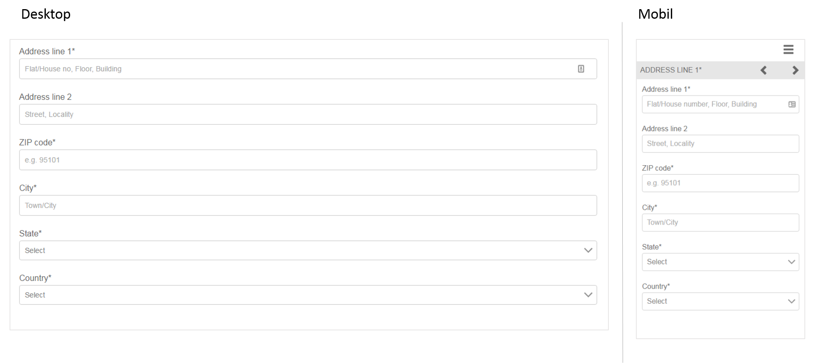

# Referenzieren Sie adaptive Formularfragmente{#reference-adaptive-form-fragments}

[Adaptives Formularfragment](../../forms/using/adaptive-form-fragments.md) ist eine Gruppe von Feldern oder ein Fenster, das eine Gruppe von Feldern beinhaltet, die Sie verwenden können, wenn Sie ein Formular erstellen. Damit lassen sich Formulare mühelos und schnell erstellen. Sie können ein adaptives Formularfragment per Drag &amp; Drop in ein Formular mit dem Asset-Browser in der Seitenleiste einfügen und Sie können es im Formulareditor bearbeiten.

Für Autoren adaptiver Formulare werden Referenzfragmente im Add-On-Paket [AEM Forms](https://experienceleague.adobe.com/docs/experience-manager-release-information/aem-release-updates/forms-updates/aem-forms-releases.html?lang=en) bereitgestellt. Es beinhaltet folgende Fragmente:

* Adresse
* Kontaktangaben
* Kreditkartenangaben
* Aktuelle Beschäftigung
* Informationen zu abhängigen Familienmitgliedern
* Beschäftigungshintergrund
* Umsatz und Ausgaben
* Name
* Nutzungsbedingungen
* Nutzungsbedingungen mit Scribble

Wenn Sie das Paket installieren, wird ein Referenzfragmentordner mit Referenzfragmenten unter „Formulare und Dokumente“ erstellt. Informationen zum Installieren eines Pakets finden Sie unter [Arbeiten mit Paketen](/help/sites-administering/package-manager.md).

## Adresse {#address}

Enthält Felder, um die Adresse anzugeben. Die verfügbaren Felder sind Straße, Postleitzahl, Stadt, Staat und Land. Dazu gehören auch ein vorkonfigurierter Webservice, der Stadt und Staat für eine bestimmte US-Postleitzahl ausfüllt.

<!--[Click to enlarge

](assets/address-1.png)-->

## Kontaktangaben {#contact-information}

Enthält Felder zum Erfassen von Telefonnummer und E-Mail-Adresse.

<!--[Click to enlarge

](assets/contact-info-1.png)-->

## Kreditkartenangaben {#credit-card-information}

Beinhaltet Felder zur Erfassung von Kreditkartenangaben, die zur Verarbeitung von Zahlungen verwendet werden können.

## Aktuelle Beschäftigung {#current-employment}

Enthält Felder zur Erfassung aktueller Beschäftigungsdetails wie Beschäftigungsstatus, Bereich der Beschäftigung, Bezeichnung, Organisation und Anfangsdatum.

<!--[Click to enlarge

](assets/current-emp-1.png)-->

## Informationen zu abhängigen Familienmitgliedern {#dependents-information}

Enthält Felder für Informationen über ein oder mehrere abhängige Familienmitglieder wie Name, Alter und Beziehung im Tabellenformat.

<!--[Click to enlarge

](assets/dependents-info-1.png)-->

## Beschäftigungshintergrund {#employment-history}

Enthält Felder zur Erfassung des Beschäftigungshintergrunds. Es können mehrere Organisationen hinzugefügt werden.

<!--[Click to enlarge

](assets/emp-history-1.png)-->

## Umsatz und Ausgaben {#income-expenditure}

Enthält Felder zur Erfassung von monatlichen Cashflows und Ausgaben. Formulare, in denen Benutzer finanzielle Details bereitstellen müssen, können dieses Fragment verwenden, um Einkommen und Ausgaben zu erfassen.

<!--[Click to enlarge

](assets/income-1.png)-->

## Name {#name}

Enthält Felder zum Angeben von Titel, Vorname, zweitem Vornamen und Nachname.

<!--[Click to enlarge

](assets/name-1.png)-->

## Nutzungsbedingungen {#terms-conditions}

Gibt Nutzungsbedingungen an, die vom Benutzer akzeptiert werden müssen, bevor ein Formular übermittelt wird.

<!--[Click to enlarge

](assets/tnc-1.png)-->

## Nutzungsbedingungen mit Scribble {#terms-conditions-with-scribble}

Gibt Nutzungsbedingungen an, die vom Benutzer akzeptiert und abgezeichnet werden müssen, bevor ein Formular übermittelt wird.

<!--[Click to enlarge

](assets/tnc-scribble-1.png)-->
