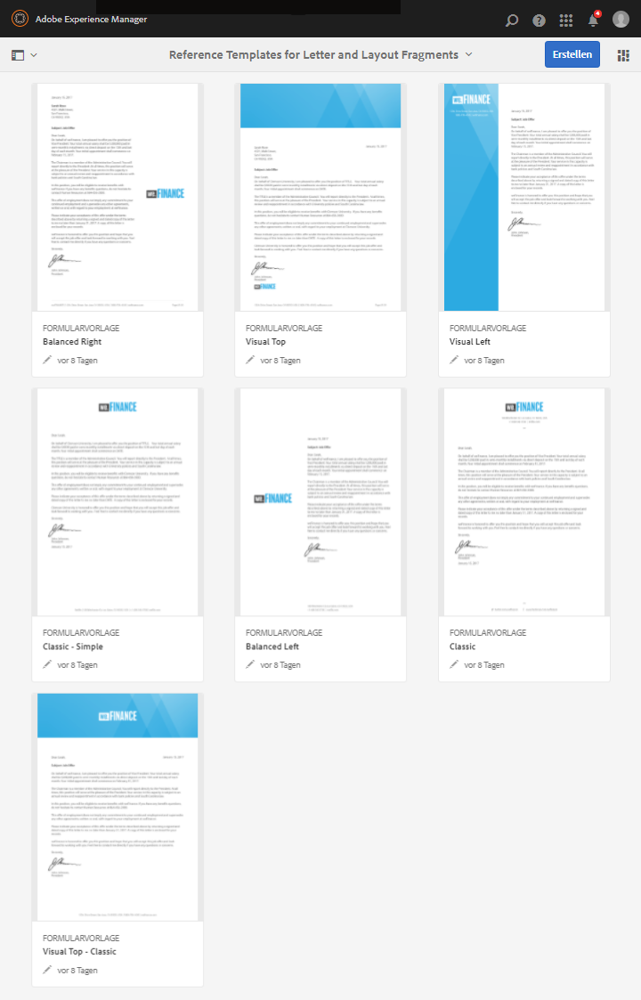

# Vorlagen für Empfehlungsschreiben {#reference-letter-templates}

In Correspondence Management enthält eine Briefvorlage typische typische Formularfelder, Layoutmerkmale wie Kopf- und Fußzeilen sowie leere „Zielbereiche“ zum Einfügen des Inhalts.

Correspondence Management stellt Briefvorlagen im AEM Forms-Paket [AEM-FORMS-REFERENCE-LAYOUT-TEMPLATES](https://www.adobeaemcloud.com/content/marketplace/marketplaceProxy.html?packagePath=/content/companies/public/adobe/packages/cq630/fd/AEM-FORMS-6.3-REFERENCE-LAYOUT-TEMPLATES) bereit. Informationen zum Installieren eines Pakets finden Sie unter [So arbeiten Sie mit Paketen](/help/sites-administering/package-manager.md). Sie können die Vorlagen in Designer an Ihre Branding- und Geschäftsanforderungen anpassen. Das Paket enthält die folgenden Vorlagen:

* Klassisch
* Klassisch einfach
* Symmetrisch links
* Symmetrisch rechts
* Sichtbar links
* Sichtbar oben
* Sichtbar oben - klassisch

Nach der Installation des Pakets werden die Layout-Vorlagen (XDPs) im Vorlagenordner an folgender Stelle aufgelistet:

`https://'[server]:[port]'/[context-root]/aem/forms.html/content/dam/formsanddocuments/templates-folder`

Im Folgenden werden die allgemeinen Datenfelder in allen Vorlagen in diesem Paket aufgeführt:

* Datum 
* Anrede
* Schließender Text
* Unterschriften-Text

Nach der Installation des Pakets AEM-FORMS-6.3-REFERENCE-LAYOUT-TEMPLATES werden die Vorlagen im Vorlagenordner aufgeführt

## Klassisch {#classic}

Mit einem Logo oben eignet sich die klassische Vorlage für einen einfachen professionellen Brief.

PDF-Vorschau eines Briefs erstellt mithilfe der klassischen Vorlage

## Klassisch einfach {#classic-simple}

Enthält Felder, zum Erfassen der Telefonnummer und E-Mail-Adresse. Eine klassische einfache Vorlage ähnelt der klassischen Vorlage mit dem Unterschied, dass sie keine Felder enthält, in denen Sie die Adresse des Empfängers eingeben können.

PDF-Vorschau eines Briefs erstellt mithilfe der klassischen einfachen Vorlage

## Symmetrisch links {#balanced-left}

Die Symmetrisch links-Vorlage beinhaltet das Logo links neben dem Brief.

PDF-Vorschau eines Briefs erstellt mithilfe der Symmetrisch links-Vorlage

## Symmetrisch rechts  {#balanced-right}

Eine Symmetrisch rechts-Vorlage hat das Firmenlogo auf der linken Seite und bietet Platz für die Eingabe der Empfängeradresse auf dem Brief selbst. Eine Symmetrisch rechts-Vorlage enthält auch eine Fußzeile, die bei einem Brief mit mehreren Seiten neu fließt.

PDF-Vorschau eines Briefs erstellt mithilfe der Symmetrisch rechts-Vorlage

## Sichtbar links  {#visual-left}

Die Sichtbar links-Vorlage hat einen Seitenkopf links auf der Seite mit dem Firmenlogo über dem Seitenkopf. Die Sichtbar links-Vorlage hat eine Betreffzeile, aber keine „Fußzeile“.

PDF-Vorschau eines Briefs erstellt mithilfe der Sichtbar links-Vorlage

## Sichtbar oben  {#visual-top}

Die Sichtbar oben-Vorlage hat einen sichtbaren Rand oben. Die Sichtbar oben-Vorlage verfügt über ein Feld für die Eingabe der Adresse des Empfängers auf der Seite selbst. Die Sichtbar oben-Vorlage hat die Betreffzeile und eine Fußzeile, die für Briefe, die sich über mehrere Seiten erstrecken, neu fließt.

PDF-Vorschau eines Briefs erstellt mithilfe der Sichtbar oben-Vorlage

## Sichtbar oben - klassisch  {#visual-top-classic}

Die Vorlage „Sichtbar oben - klassisch“ hat eine Kopfzeile oben auf der Seite mit dem Firmenlogo. Die Vorlage „Sichtbar oben - klassisch“ hat ein Feld, in dem ein Betreff eingegeben werden kann, aber keine Fußzeile.

PDF-Vorschau eines Briefs erstellt mithilfe der Vorlage „Sichtbar oben - klassisch“

