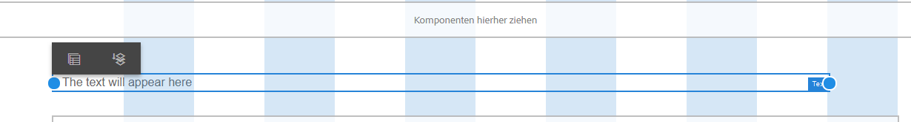

# Verwenden Sie den Layoutmodus, um die Größe von Komponenten {#use-layout-mode-to-resize-components} zu ändern

Die Authoring-Oberfläche für interaktive Kommunikation im Web Kanal ermöglicht es Ihnen, die Größe von Komponenten mithilfe des Layoutmodus zu ändern. Ziehen Sie blaue Punkte in Spalten, um den Beginn und den Endpunkt für die Positionierung der Komponenten zu definieren. Die blauen Punkte werden angezeigt, nachdem auf die Komponente im interaktiven Raster getippt wurde. Das reaktionsfähige Raster besteht aus 12 gleichen Spalten. Die weiße und blaue Farbschattierung in alternativen Spalten unterscheidet eine Spalte von der anderen.

Sie können den Layoutmodus verwenden, um die Größe von Komponenten für alle Gerätetypen wie Desktop, Tablet, Smartphone und andere kleinere Geräte zu ändern. Das Tablet leitet die Layoutkonfiguration automatisch von der Desktop-Version ab und die kleineren Geräte leiten die Layoutkonfiguration vom Smartphone ab. Sie können die automatisch abgeleiteten Konfigurationen jedoch überschreiben, um für jeden Gerätetyp eine andere Konfiguration zu definieren.

>[!NOTE]
>
>Wenn Sie den Web-Kanal mit [Print Kanal as Übergeordnet](../../forms/using/create-interactive-communication.md) für eine interaktive Kommunikation erstellen, umfassen die für die Größenanpassung verfügbaren Komponenten auch die Teilformulare und Felder, die in Web Kanal mit Print Kanal automatisch generiert werden. Der Web-Kanal behält das Layout für die Kanal &quot;Drucken&quot;im Layoutmodus bei.

## Layout-Modus aufrufen {#access-layout-mode}

Wählen Sie **Layout** aus der Dropdown-Liste, die oben auf der Authoring-Oberfläche für interaktive Kommunikation neben der Option **Vorschau** angezeigt wird. Das Formular wird im Layoutmodus angezeigt.

1. Melden Sie sich bei Ihrer AEM-Autoreninstanz an und navigieren Sie zu **Adobe Experience Manager** > **Formulare** > **Formulare und Dokumente**.
1. Erstellen Sie eine neue oder öffnen Sie eine vorhandene [Interaktive Kommunikation](../../forms/using/create-interactive-communication.md).
1. Wählen Sie **Layout** aus der Dropdown-Liste, die oben neben der Option **Vorschau** angezeigt wird. Das Formular wird im Layoutmodus angezeigt.

   

## Größe von Komponenten anpassen {#resize-components}

1. Tippen Sie im Layoutmodus auf die zu ändernde Komponente. Die blauen Punkte werden am Beginn und am Ende des reaktionsfähigen Rasters angezeigt.
1. Ziehen Sie die blauen Punkte per Drag &amp; Drop, um die Position der Komponente im interaktiven Raster zu definieren.

   

   Die Symbolleiste, die nach dem Tippen auf Komponenten angezeigt wird, besteht aus den folgenden Optionen:

   * **Übergeordnet:** Wählen Sie das übergeordnete Element einer Komponente aus.
   * **Zu neuer Zeile schwenken:** Verschiebt die Komponente zur nächsten Zeile, wenn sich mehrere Komponenten in derselben Zeile befinden.

   Mit der Option **[!UICONTROL Haltepunkt-Layout zurücksetzen]** ( ) können Sie alle Änderungen an der Größe rückgängig machen und das Standardlayout auf das Bedienfeld anwenden, das skalierte Komponenten enthält. Tippen Sie auf das übergeordnete Element der Größenanpassung, um die Option Ansicht.

   >[!NOTE]
   >
   >Die Größe von Tabellenspalten, Symbolleisten-, Symbolleisten- und Zielgruppen-Bereichskomponenten kann im Layoutmodus nicht geändert werden. Verwenden Sie den Stilmodus, um die Größe dieser Komponenten zu ändern.

### Beispiel {#example}

**Ziel:** Sie möchten eine Tabellenkomponente und eine Bildkomponente einfügen und sie in einer interaktiven Kommunikation parallel zueinander positionieren.

1. Fügen Sie die Tabellen- und Bildkomponenten im Bearbeitungsmodus im Web-Kanal einer interaktiven Kommunikation ein. Die Image-Komponente wird nach der Tabellenkomponente angezeigt.
1. Wechseln Sie zum Layoutmodus und tippen Sie auf die Komponente &quot;Tabelle&quot;. Die blauen Punkte zur Größenanpassung der Komponente werden in den Spalten 1 und 12 angezeigt.
1. Ziehen Sie den blauen Punkt in Spalte 12 in Spalte 6 des interaktiven Rasters.

   

1. Wählen Sie auf ähnliche Weise die Image-Komponente aus und ziehen Sie den blauen Punkt in Spalte 1 in Spalte 7 des interaktiven Rasters. Die Tabellen- und Bildkomponenten werden parallel zueinander angezeigt.

   

   Sie können die Image-Komponente auswählen und auf die Option **Zu neuer Zeile** tippen, die in der Symbolleiste verfügbar ist, um die Image-Komponente zur nächsten Zeile zu verschieben.

## Größe von Bedienfeldern ändern {#resize-panels-layout-mode}

Führen Sie die folgenden Schritte aus, wenn Sie die Größe des gesamten Bedienfelds anstelle einzelner Komponenten ändern möchten:

1. Tippen Sie auf eine der Komponenten im Bedienfeld, deren Größe Sie ändern möchten, wählen Sie  und wählen Sie die erste Option in der Dropdown-Liste aus, wenn das Bedienfeld direkt über der Komponente liegt.

   Die blauen Punkte werden am Beginn und am Ende des reaktionsfähigen Rasters angezeigt.

1. Ziehen Sie die blauen Punkte per Drag &amp; Drop, um die Position des Bereichs im interaktiven Raster zu definieren.
Sie können die Schritte 1 und 2 wiederholen und  auswählen, um den Bereich mit der Größenanpassung zur nächsten Zeile zu verschieben.

## Definieren des Layouts für mehrere Spalten für ein Bedienfeld

Führen Sie die folgenden Schritte aus, um die Anzahl der Spalten für ein Bedienfeld zu definieren:

1. Tippen Sie im Modus **[!UICONTROL Bearbeiten]** auf das Bedienfeld, wählen Sie  und wählen Sie **[!UICONTROL Responsive - alles auf der Seite ohne Navigation]** aus der Dropdown-Liste **[!UICONTROL Bedienfeldlayout]**.

1. Tippen Sie auf , um die Eigenschaften zu speichern.

1. Tippen Sie im Modus **[!UICONTROL Layout]** auf eine der Komponenten im Bedienfeld, wählen Sie  aus und wählen Sie das Bedienfeld aus.

1. Tippen Sie auf  und wählen Sie die Spaltenanzahl aus der Dropdown-Liste aus. Die Anzahl der Spalten kann zwischen 1 und 12 liegen. Das Bedienfeld wird in ein mehrspaltiges Layout unterteilt.

## Layout-Modus für Formulare mit altem reaktionsfähigem Layout {#disable-layout-mode-for-forms-with-old-responsive-layout} deaktivieren

Sie können den Layoutmodus für Formulare mit einem alten reaktionsfähigen Layout deaktivieren, indem Sie die Eigenschaften der im Formular verwendeten Vorlage bearbeiten.

Führen Sie die folgenden Schritte aus, um den Layoutmodus zu deaktivieren:

1. Wählen Sie **[!UICONTROL Tools]** > **[!UICONTROL Allgemein]** > **[!UICONTROL Vorlagen]** und öffnen Sie die Vorlage, die im Formular im Modus **[!UICONTROL Bearbeiten]** verwendet wird.
1. Wählen Sie den Container Dokument im linken Bereich aus und tippen Sie auf **[!UICONTROL Richtlinie.]**

   

1. Tippen Sie auf die Registerkarte **[!UICONTROL Layouteinstellungen]** und wählen Sie **[!UICONTROL Layout-Modus deaktivieren]**.
1. Tippen Sie auf , um die Vorlageneigenschaften zu speichern.

