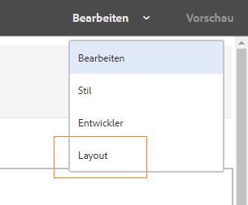
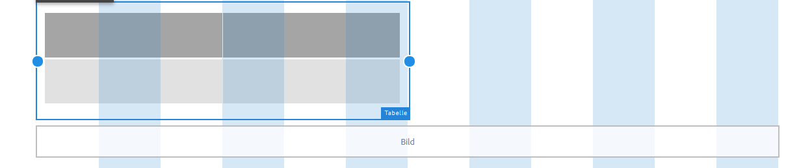

# Verwenden des Layout-Modus zum Ändern der Größe von Komponenten {#use-layout-mode-to-resize-components}

Mit der Authoring-Oberfläche des Web-Kanals für interaktive Kommunikation können Sie mithilfe des Layout-Modus die Größe von Komponenten ändern. Indem Sie blaue Punkte per Drag-und-Drop in Spalten ziehen, können Sie den Start- und Endpunkt zur Positionierung der Komponenten definieren. Die blauen Punkte werden nach dem Tippen auf die Komponente im responsiven Raster angezeigt. Das responsive Raster besteht aus 12 gleichen Spalten. Die weiße und blaue Farbschattierung in alternativen Spalten setzt die Spalten voneinander ab.

Sie können den Layout-Modus verwenden, um die Größe von Komponenten für alle Gerätetypen wie Desktopcomputer, Tablet, Smartphone und andere kleinere Geräte zu ändern. Das Tablet leitet die Layout-Konfiguration automatisch von der Desktopversion ab und die kleineren Geräte leiten die Layout-Konfiguration vom Smartphone ab. Sie können die automatisch abgeleiteten Konfigurationen jedoch überschreiben, um für jeden Gerätetyp eine andere Konfiguration zu definieren.

>[!NOTE]
>
>Wenn Sie den Web-Kanal mit [Druckkanal als Master](../../forms/using/create-interactive-communication.md) für eine interaktive Kommunikation erstellen, umfassen die für die Größenanpassung verfügbaren Komponenten auch die Teilformulare und Felder, die automatisch im Web-Kanal mithilfe des Druckkanals generiert werden. Der Web-Kanal behält im Layout-Modus das Layout für die Elemente des Druckkanals bei.

## Zugriff auf Layout-Modus {#access-layout-mode}

Wählen Sie **Layout** aus der Dropdown-Liste, die oben in der Authoring-Oberfläche für die interaktive Kommunikation neben der Option **Vorschau** angezeigt wird. Das Formular wird im Layout-Modus angezeigt.

1. Melden Sie sich bei Ihrer AEM-Autoreninstanz an und navigieren Sie zu **Adobe Experience Manager** > **Formulare** > **Formulare und Dokumente**.
1. Erstellen Sie eine [Interaktive Kommunikation](../../forms/using/create-interactive-communication.md) oder öffnen Sie eine bestehende.
1. Wählen Sie **Layout** aus der Dropdownliste, die oben neben der Option **Vorschau** angezeigt wird. Das Formular wird im Layout-Modus angezeigt.

   

## Anpassen der Größe von Komponenten {#resize-components}

1. Wählen Sie im Layout-Modus die Komponente, deren Größe geändert werden soll. Die blauen Punkte werden am Beginn und am Ende des responsiven Rasters angezeigt.
1. Ziehen Sie die blauen Punkte mit der Maus, um die Position der Komponente im responsiven Raster zu definieren.

   

   Die Symbolleiste, die nach dem Tippen auf Komponenten angezeigt wird, besteht aus folgenden Optionen:

   * **Übergeordnet**: Wählen Sie das übergeordnete Element einer Komponente aus.
   * **In neue Zeile verschieben**: Versetzt die Komponente in die nächste Zeile, wenn sich mehrere Komponenten in derselben Zeile befinden.

   Sie können alle Größenänderungen rückgängig machen und das Standard-Layout auf den Bereich anwenden, der skalierte Komponenten enthält, indem Sie die Option **[!UICONTROL Breakpoint-Layout zurücksetzen]** ( verwenden). Wählen Sie das übergeordnete Element der angepassten Komponente aus, um die Option anzuzeigen.

   >[!NOTE]
   >
   >Sie können die Größe von Tabellenspalten, Symbolleisten, Symbolleistenschaltflächen und Zielbereichskomponenten mit dem Layout-Modus nicht ändern. Verwenden Sie den Stilmodus, um die Größe dieser Komponenten zu ändern.

### Beispiel {#example}

**Ziel**: Sie möchten in einer interaktiven Kommunikation eine Tabellenkomponente und eine Bildkomponente einfügen und sie parallel zueinander positionieren.

1. Fügen Sie die Tabellen- und Bildkomponenten mithilfe des Bearbeitungsmodus im Web-Kanal einer interaktiven Kommunikation ein. Die Bildkomponente wird nach der Tabellenkomponente angezeigt.
1. Wechseln Sie in den Layout -Modus und wählen Sie die Komponente Tabelle aus. Die blauen Punkte zur Größenanpassung der Komponente werden in den Spalten 1 und 12 angezeigt.
1. Ziehen Sie per Drag-und-Drop den blauen Punkt von Spalte 12 in Spalte 6 des responsiven Rasters.

   

1. Wählen Sie analog dazu die Bildkomponente und ziehen Sie per Drag-und-Drop den blauen Punkt von Spalte 1 in Spalte 7 des responsiven Rasters. Die Tabellen- und Bildkomponenten werden parallel zueinander angezeigt.

   

   Sie können die Bildkomponente auswählen und die Option **In neue Zeile gleiten lassen** wählen, die in der Symbolleiste verfügbar ist, um die Bildkomponente zur nächsten Zeile zu verschieben.

## Ändern der Größe von Bereichen {#resize-panels-layout-mode}

Führen Sie folgende Schritte aus, wenn Sie die Größe des gesamten Bereichs statt der Größe einzelner Komponenten ändern möchten:

1. Wählen Sie eine der Komponenten im Bereich, dessen Größe Sie ändern möchten, und wählen Sie  aus und dann die erste Option in der Dropdown-Liste, wenn der Bereich der Komponente direkt übergeordnet ist.

   Die blauen Punkte werden am Beginn und am Ende des responsiven Rasters angezeigt.

1. Ziehen Sie die blauen Punkte mit der Maus, um die Position des Bereichs im responsiven Raster zu definieren.
Sie können die Schritte 1 und 2 wiederholen und mit  den Bereich mit der Größenanpassung zur nächsten Zeile verschieben.

## Definieren eines mehrspaltigen Layouts für einen Bereich

Führen Sie folgende Schritte aus, um die Anzahl der Spalten für einen Bereich zu definieren:

1. Wählen Sie im Modus **[!UICONTROL Bearbeiten]** den Bereich, wählen Sie  aus und dann **[!UICONTROL Responsiv – alles auf der Seite ohne Navigation]** aus der Dropdown-Liste **[!UICONTROL Bereichs-Layout]**.

1. Wählen Sie  aus, um die Änderungen zu speichern.

1. Wählen Sie im Modus **[!UICONTROL Layout]** eine der Komponenten im Bereich, wählen Sie  aus und dann den jeweiligen Bereich.

1. Wählen Sie  und wählen Sie die Spaltenanzahl aus der Dropdown-Liste aus. Die Anzahl der Spalten kann zwischen 1 und 12 liegen. Der Bereich wird in ein mehrspaltiges Layout unterteilt.

## Deaktivieren des Layout-Modus für Formulare mit altem responsivem Layout {#disable-layout-mode-for-forms-with-old-responsive-layout}

Sie können den Layout-Modus für Formulare mit altem responsivem Layout deaktivieren, indem Sie die Eigenschaften der im Formular verwendeten Vorlage bearbeiten.

Gehen Sie wie folgt vor, um den Layout-Modus zu deaktivieren:

1. Wählen Sie **[!UICONTROL Tools]** > **[!UICONTROL Allgemein]** > **[!UICONTROL Vorlagen]** und öffnen Sie die Vorlage, die im Formular im Modus **[!UICONTROL Bearbeiten]** verwendet wird.
1. Wählen Sie den Dokumentcontainer im linken Bereich aus und wählen Sie **[!UICONTROL Richtlinie.]**

   

1. Wählen Sie auf die Registerkarte **[!UICONTROL Layout-Einstellungen]** aus und wählen Sie dann **[!UICONTROL Layout-Modus deaktivieren]**.
1. Wählen Sie , um die Vorlageneigenschaften zu speichern.
