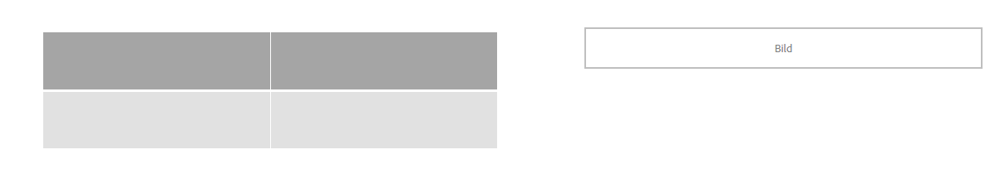

# Verwenden Sie den Layout-Modus, um die Größe von Komponenten {#use-layout-mode-to-resize-components} zu ändern.

Die Benutzeroberfläche zum Erstellen von Webkanälen für die interaktive Kommunikation ermöglicht es Ihnen, die Größe von Komponenten mithilfe des Layout -Modus zu ändern. Ziehen Sie blaue Punkte in die Spalten, um die Start- und Endpunkte zum Positionieren von Komponenten zu definieren. Die blauen Punkte werden angezeigt, nachdem auf die Komponente im responsiven Raster getippt wurde. Das responsive Raster besteht aus 12 gleichen Spalten. Die weiße und blaue Farbschattierung in alternativen Spalten unterscheidet eine Spalte von der anderen.

Sie können den Layout -Modus verwenden, um die Größe von Komponenten für alle Gerätetypen wie Desktop, Tablet, Telefon und andere kleinere Geräte zu ändern. Das Tablet leitet die Layoutkonfiguration automatisch von der Desktop-Version ab und die kleineren Geräte leiten die Layoutkonfiguration vom Telefon ab. Sie können jedoch die automatisch abgeleiteten Konfigurationen überschreiben, um für jeden Gerätetyp eine andere Konfiguration zu definieren.

>[!NOTE]
>
>Wenn Sie den Webkanal mit [Druckkanal als Übergeordnet](../../forms/using/create-interactive-communication.md) für eine interaktive Kommunikation erstellen, enthalten die für die Größenanpassung verfügbaren Komponenten auch die Teilformulare und Felder, die automatisch im Webkanal mithilfe des Druckkanals generiert werden. Der Webkanal behält das Layout für die Elemente des Druckkanals im Layout -Modus bei.

## Zugriff auf Layout-Modus {#access-layout-mode}

Wählen Sie **Layout** aus der Dropdown-Liste, die oben in der Authoring-Benutzeroberfläche für interaktive Kommunikation neben der Option **Vorschau** angezeigt wird. Das Formular wird im Layout -Modus angezeigt.

1. Melden Sie sich bei Ihrer AEM-Autoreninstanz an und navigieren Sie zu **Adobe Experience Manager** > **Formulare** > **Formulare und Dokumente**.
1. Erstellen Sie eine neue oder öffnen Sie eine vorhandene [Interaktive Kommunikation](../../forms/using/create-interactive-communication.md).
1. Wählen Sie **Layout** aus der Dropdownliste, die oben neben der Option **Vorschau** angezeigt wird. Das Formular wird im Layout -Modus angezeigt.

   

## Größe von Komponenten anpassen {#resize-components}

1. Tippen Sie im Layout -Modus auf die Komponente, um die Größe zu ändern. Die blauen Punkte werden am Anfang und Ende des responsiven Rasters angezeigt.
1. Ziehen Sie die blauen Punkte per Drag-and-Drop in das responsive Raster, um die Position der Komponente zu definieren.

   

   Die Symbolleiste, die nach dem Tippen auf Komponenten angezeigt wird, besteht aus den folgenden Optionen:

   * **Übergeordnetes Element:** Wählen Sie das übergeordnete Element einer Komponente aus.
   * **In neue Zeile verschieben:** Verschiebt die Komponente in die nächste Zeile, wenn mehrere Komponenten in derselben Zeile vorhanden sind.

   Sie können alle Größenänderungen rückgängig machen und das Standardlayout auf das Bedienfeld mit den angepassten Komponenten anwenden, indem Sie die Option **[!UICONTROL Breakpoint-Layout zurücksetzen]** ( ) verwenden. Tippen Sie auf das übergeordnete Element der angepassten Komponente, um die Option anzuzeigen.

   >[!NOTE]
   >
   >Sie können die Größe von Tabellenspalten, Symbolleiste, Symbolleisten-Schaltfläche und Zielbereichskomponenten nicht im Layout -Modus ändern. Verwenden Sie den Stilmodus, um die Größe dieser Komponenten zu ändern.

### Beispiel {#example}

**Zielsetzung:** Sie möchten eine Tabellenkomponente und eine Bildkomponente einfügen und sie in einer interaktiven Kommunikation parallel zueinander positionieren.

1. Fügen Sie die Tabellen- und Bildkomponenten im Bearbeitungsmodus im Webkanal einer interaktiven Kommunikation ein. Die Bildkomponente wird nach der Tabellenkomponente angezeigt.
1. Wechseln Sie in den Layout -Modus und tippen Sie auf die Komponente Tabelle . Die blauen Punkte zur Größenanpassung der Komponente werden in den Spalten 1 und 12 angezeigt.
1. Ziehen Sie den blauen Punkt in Spalte 12 in Spalte 6 des responsiven Rasters.

   

1. Wählen Sie auf ähnliche Weise die Bildkomponente aus und ziehen Sie den blauen Punkt in Spalte 1 in Spalte 7 des responsiven Rasters. Die Tabellen- und Bildkomponenten werden parallel zueinander angezeigt.

   

   Sie können die Bildkomponente auswählen und auf die Option **In neue Zeile verschieben** tippen, die in der Symbolleiste verfügbar ist, um die Bildkomponente in die nächste Zeile zu verschieben.

## Größe von Bereichen ändern {#resize-panels-layout-mode}

Führen Sie die folgenden Schritte aus, wenn Sie die Größe des gesamten Bedienfelds anstelle einzelner Komponenten ändern möchten:

1. Tippen Sie auf eine der Komponenten im Bedienfeld, deren Größe Sie ändern möchten, wählen Sie  und wählen Sie die erste Option in der Dropdown-Liste aus, wenn das Bedienfeld das unmittelbare übergeordnete Element der Komponente ist.

   Die blauen Punkte werden am Anfang und Ende des responsiven Rasters angezeigt.

1. Ziehen Sie die blauen Punkte per Drag-and-Drop in das responsive Raster, um die Position des Bedienfelds zu definieren.
Sie können die Schritte 1 und 2 wiederholen und  auswählen, um das Bedienfeld mit der Größenänderung zur nächsten Zeile zu verschieben.

## Mehrspaltiges Layout für einen Bereich definieren

Führen Sie die folgenden Schritte aus, um die Anzahl der Spalten für einen Bereich zu definieren:

1. Tippen Sie im Modus **[!UICONTROL Bearbeiten]** auf das Bedienfeld, wählen Sie  und wählen Sie **[!UICONTROL Responsiv - alles auf der Seite ohne Navigation]** aus der Dropdownliste **[!UICONTROL Bedienfeldlayout]** aus.

1. Tippen Sie auf , um die Eigenschaften zu speichern.

1. Tippen Sie im Modus **[!UICONTROL Layout]** auf eine der Komponenten im Bereich, wählen Sie  aus und wählen Sie das Bedienfeld aus.

1. Tippen Sie auf  und wählen Sie die Anzahl der Spalten aus der Dropdownliste aus. Die Anzahl der Spalten kann zwischen 1 und 12 liegen. Das Bedienfeld wird in ein mehrspaltiges Layout unterteilt.

## Layout-Modus für Formulare mit altem responsiven Layout deaktivieren {#disable-layout-mode-for-forms-with-old-responsive-layout}

Sie können den Layout -Modus für Formulare mit dem alten responsiven Layout deaktivieren, indem Sie Eigenschaften für die im Formular verwendete Vorlage bearbeiten.

Führen Sie die folgenden Schritte aus, um den Layout -Modus zu deaktivieren:

1. Wählen Sie **[!UICONTROL Tools]** > **[!UICONTROL Allgemein]** > **[!UICONTROL Vorlagen]** und öffnen Sie die im Formular verwendete Vorlage im Modus **[!UICONTROL Bearbeiten]** .
1. Wählen Sie den Dokumentcontainer im linken Bereich aus und tippen Sie auf **[!UICONTROL Richtlinie.]**

   

1. Tippen Sie auf die Registerkarte **[!UICONTROL Layout-Einstellungen]** und wählen Sie **[!UICONTROL Layout-Modus deaktivieren]** aus.
1. Tippen Sie auf , um die Vorlageneigenschaften zu speichern.
