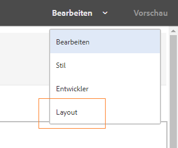
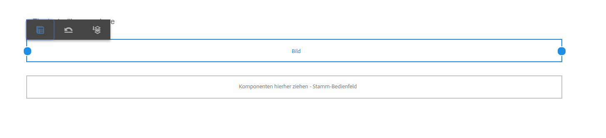
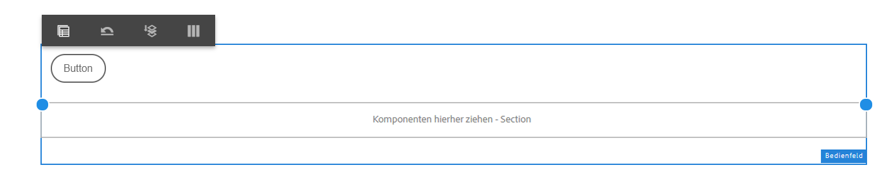
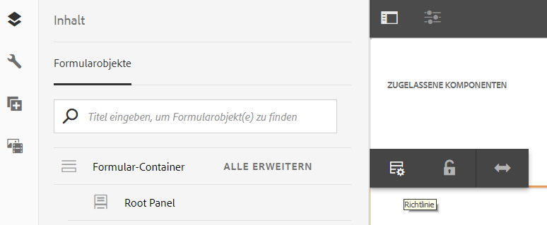

# Verwenden Sie den Layoutmodus, um die Größe von Komponenten {#use-layout-mode-to-resize-components} zu ändern

Die Authoring-Oberfläche für adaptive Formulare ermöglicht es Ihnen, die Größe von Komponenten mithilfe des Layoutmodus zu ändern. Ziehen Sie blaue Punkte in Spalten, um den Beginn und den Endpunkt für die Positionierung der Komponenten zu definieren. Die blauen Punkte werden angezeigt, nachdem auf die Komponente im interaktiven Raster getippt wurde. Das reaktionsfähige Raster besteht aus 12 gleichen Spalten. Die weiße und blaue Farbschattierung in alternativen Spalten unterscheidet eine Spalte von der anderen.

Sie können den Layoutmodus verwenden, um die Größe von Komponenten für alle Gerätetypen wie Desktop, Tablet, Smartphone und andere kleinere Geräte zu ändern. Das Tablet leitet die Layoutkonfiguration automatisch von der Desktop-Version ab und die kleineren Geräte leiten die Layoutkonfiguration vom Smartphone ab. Sie können die automatisch abgeleiteten Konfigurationen jedoch überschreiben, um für jeden Gerätetyp eine andere Konfiguration zu definieren.

## Layout-Modus aufrufen {#access-layout-mode}

Wählen Sie **Layout** aus der Dropdown-Liste, die oben in der Authoring-Oberfläche für adaptive Formulare neben der Option **Vorschau** angezeigt wird. Das Formular wird im Layoutmodus angezeigt.

1. Melden Sie sich bei Ihrer AEM-Autoreninstanz an und navigieren Sie zu **Adobe Experience Manager** > **Formulare** > **Formulare und Dokumente**.
1. Erstellen Sie ein neues oder öffnen Sie ein vorhandenes [adaptives Formular](../../forms/using/creating-adaptive-form.md).
1. Wählen Sie **Layout** aus der Dropdown-Liste, die oben neben der Option **Vorschau** angezeigt wird. Das Formular wird im Layoutmodus angezeigt.

   

## Größe von Komponenten anpassen {#resize-components}

1. Tippen Sie im Layoutmodus auf die zu ändernde Komponente. Die blauen Punkte werden am Beginn und am Ende des reaktionsfähigen Rasters angezeigt.
1. Ziehen Sie die blauen Punkte per Drag &amp; Drop, um die Position der Komponente im interaktiven Raster zu definieren.

   

   Die Symbolleiste, die nach dem Tippen auf Komponenten angezeigt wird, besteht aus den folgenden Optionen:

   * **[!UICONTROL Übergeordnet]**: Wählen Sie das übergeordnete Element einer Komponente aus.
   * **[!UICONTROL Haltepunktlayout]** zurücksetzen: Rückgängigmachen aller Änderungen der Größe und Anwenden des Standardlayouts auf die Komponente
   * **[!UICONTROL In neue Zeile]** schwebend: Versetzen Sie die Komponente in die nächste Zeile, wenn sich mehrere Komponenten in derselben Zeile befinden.

   Sie können auch die Option **[!UICONTROL Haltepunktlayout umkehren]** ( ) auf Bereichsebene verwenden, um alle Änderungen der Größe rückgängig zu machen.

   >[!NOTE]
   >
   >Die Größe von Tabellenspalten, Symbolleisten-, Symbolleisten- und Zielgruppen-Bereichskomponenten kann im Layoutmodus nicht geändert werden. Verwenden Sie den Stilmodus, um die Größe dieser Komponenten zu ändern.

### Beispiel {#example}

**Ziel:** Sie möchten eine Tabellenkomponente und eine Bildkomponente einfügen und sie in einem adaptiven Formular parallel zueinander positionieren.

1. Fügen Sie die Tabellen- und Bildkomponenten im Bearbeitungsmodus im adaptiven Formular ein. Die Image-Komponente wird nach der Tabellenkomponente angezeigt.
1. Wechseln Sie zum Layoutmodus und tippen Sie auf die Komponente &quot;Tabelle&quot;. Die blauen Punkte zur Größenanpassung der Komponente werden in den Spalten 1 und 12 angezeigt.
1. Ziehen Sie den blauen Punkt in Spalte 12 in Spalte 6 des interaktiven Rasters.

   

1. Wählen Sie auf ähnliche Weise die Image-Komponente aus und ziehen Sie den blauen Punkt in Spalte 1 in Spalte 7 des interaktiven Rasters. Die Tabellen- und Bildkomponenten werden parallel zueinander angezeigt.

   

   Sie können die Image-Komponente auswählen und auf die Option **Zu neuer Zeile** tippen, die in der Symbolleiste verfügbar ist, um die Image-Komponente zur nächsten Zeile zu verschieben.

## Größe von Bedienfeldern ändern {#resize-panels-layout-mode}

Führen Sie die folgenden Schritte aus, wenn Sie die Größe des gesamten Bedienfelds anstelle einzelner Komponenten ändern möchten:

1. Tippen Sie auf eine der Komponenten im Bedienfeld, deren Größe Sie ändern möchten, wählen Sie  und wählen Sie die erste Option in der Dropdown-Liste aus, wenn das Bedienfeld direkt über der Komponente liegt.

   Die blauen Punkte werden am Beginn und am Ende des reaktionsfähigen Rasters angezeigt.

1. Ziehen Sie die blauen Punkte per Drag &amp; Drop, um die Position des Bereichs im interaktiven Raster zu definieren.
Sie können die Schritte 1 und 2 wiederholen und  auswählen, um den Bereich mit der Größenanpassung zur nächsten Zeile zu verschieben.

## Definieren des Layouts für mehrere Spalten für ein Bedienfeld

Führen Sie die folgenden Schritte aus, um die Anzahl der Spalten für ein Bedienfeld zu definieren:

1. Tippen Sie im Modus **[!UICONTROL Bearbeiten]** auf das Bedienfeld, wählen Sie  und wählen Sie **[!UICONTROL Responsive - alles auf der Seite ohne Navigation]** aus der Dropdown-Liste **[!UICONTROL Bedienfeldlayout]**.

1. Tippen Sie auf , um die Eigenschaften zu speichern.

1. Tippen Sie im Modus **[!UICONTROL Layout]** auf eine der Komponenten im Bedienfeld, wählen Sie  aus und wählen Sie das Bedienfeld aus.

1. Tippen Sie auf  und wählen Sie die Spaltenanzahl aus der Dropdown-Liste aus. Die Anzahl der Spalten kann zwischen 1 und 12 liegen. Das Bedienfeld wird in ein mehrspaltiges Layout unterteilt.

## Aktivieren Sie das neue interaktive Raster für alte reaktionsfähige Layouts {#enableresponsivegrid}

Aktivieren Sie das neue interaktive Raster für Formulare, die Sie mit AEM Forms 6.4 oder einer niedrigeren Version erstellen, um die Größe von Komponenten zu ändern.

>[!NOTE]
>
>Beim Wechsel zum neuen interaktiven Raster werden die Layouteigenschaften verworfen, die bereits für im Formular verwendete Komponenten definiert wurden.

Führen Sie die folgenden Schritte aus, um das neue interaktive Raster zu aktivieren:

1. Wählen Sie **Layout** aus der Dropdown-Liste, die oben neben der Option **Vorschau** angezeigt wird. Eine Bestätigung zur Aktivierung des Layoutmodus wird angezeigt.
1. Tippen Sie auf **Ja**, um den Modus **Layout** für das Formular zu aktivieren.

### Einbetten eines alten Fragments in ein adaptives Formular mit einem neuen reaktionsfähigen Layout {#embed-an-old-fragment-in-an-adaptive-form-with-new-responsive-layout}

Mit dem neuen reaktionsfähigen Layout für adaptive Formulare können Sie ein adaptives Formularfragment mit dem alten reaktionsfähigen Layout zum Formular hinzufügen. Das neue Layout verwirft jedoch die Layouteigenschaften, die bereits für im Fragment verwendete Komponenten definiert wurden. Sie können zum Modus &quot;Layout&quot;wechseln, um die Layouteigenschaften für die im Fragment verwendeten Komponenten zu definieren.

### Einbetten eines Fragments mit einem neuen reaktionsfähigen Layout in ein altes adaptives Formular {#embed-a-fragment-with-new-responsive-layout-in-an-old-adaptive-form}

Wenn Sie ein Fragment mit dem neuen reaktionsfähigen Layout in ein adaptives Formular mit einem alten reaktionsfähigen Layout einbetten, fordert Sie das System auf, den Layoutmodus für das Formular zu aktivieren und das Fragment erneut einzubetten.

Um den Layoutmodus zu aktivieren, wählen Sie **Layout** aus der Dropdown-Liste, die oben neben der Option **Vorschau** angezeigt wird, und tippen Sie zur Bestätigung auf **Ja**. Wählen Sie **Bearbeiten**, um das Fragment erneut einzubetten.

## Layout-Modus für Formulare mit altem reaktionsfähigem Layout {#disable-layout-mode-for-forms-with-old-responsive-layout} deaktivieren

Sie können den Layoutmodus für Formulare mit einem alten reaktionsfähigen Layout deaktivieren, indem Sie die Eigenschaften der im Formular verwendeten Vorlage bearbeiten.

Führen Sie die folgenden Schritte aus, um den Layoutmodus zu deaktivieren:

1. Wählen Sie **[!UICONTROL Tools]** > **[!UICONTROL Allgemein]** > **[!UICONTROL Vorlagen]** und öffnen Sie die Vorlage, die im Formular im Modus **[!UICONTROL Bearbeiten]** verwendet wird.
1. Wählen Sie den Container Dokument im linken Bereich aus und tippen Sie auf **[!UICONTROL Richtlinie.]**

   

1. Tippen Sie auf die Registerkarte **[!UICONTROL Layouteinstellungen]** und wählen Sie **[!UICONTROL Layout-Modus deaktivieren]**.
1. Tippen Sie auf , um die Vorlageneigenschaften zu speichern.

