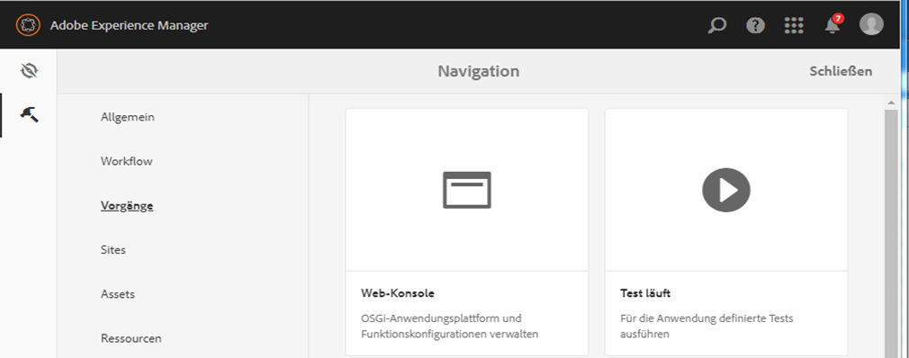

# Ausgewählten Benutzergruppen Zugriff auf den Regel-Editor gewähren{#grant-rule-editor-access-to-select-user-groups}

## Überblick {#overview}

Möglicherweise sind unterschiedliche Typen von Benutzern mit unterschiedlichen Fähigkeiten vorhanden, die mit adaptiven Formularen arbeiten. Während professionelle Benutzer möglicherweise über die nötigen Kenntnisse zum Arbeiten mit Skripten und komplexen Regeln verfügen, genügt es für Benutzer, die nur über Grundkenntnisse verfügen, mit dem Layout und einfachen Eigenschaften adaptiver Formulare zu arbeiten.

AEM Forms ermöglicht es Ihnen, den Zugriff auf den Regel-Editor anhand der Rolle oder Funktion der Benutzer einzuschränken. In den Einstellungen für den Adaptive Forms Configuration Service können Sie festlegen, welche [Benutzergruppen](/help/sites-administering/security.md) den Regel-Editor anzeigen und auf ihn zugreifen können.

## Benutzergruppen für Zugriff auf Regel-Editor angeben {#specify-user-groups-that-can-access-rule-editor}

1. Melden Sie sich bei AEM Forms als Administrator an.
1. Klicken Sie in der Autoreninstanz auf Adobe Experience Manager > Tools  > Vorgänge > Web-Konsole. Die Web-Konsole wird in einem neuen Fenster geöffnet.

   

1. Suchen Sie im Fenster Web-Konsole nach **[!UICONTROL Adaptives Formular und Interaktive Kommunikation Web Kanal Configuration]** und klicken Sie darauf. **[!UICONTROL Das]** Dialogfeld &quot;Konfiguration des adaptiven Formulars und der interaktiven Kommunikation im Web Kanal&quot;wird angezeigt. Behalten Sie die Werte bei und klicken Sie auf **Speichern**.

   Die Datei „/apps/system/config/com.adobe.aemds.guide.service.impl.AdaptiveFormConfigurationServiceImpl.config“ im CRX-Repository wird erstellt.

1. Melden Sie sich bei CRXDE als Administrator an. Öffnen Sie die Datei „/apps/system/config/com.adobe.aemds.guide.service.impl.AdaptiveFormConfigurationServiceImpl.config“ zum Bearbeiten.
1. Geben Sie mithilfe der folgenden Eigenschaft den Namen einer Gruppe an, die auf den Regel-Editor zugreifen kann (z. B. RuleEditorsUserGroup) und klicken Sie auf **Alle speichern**.

   `af.ruleeditor.custom.groups=["RuleEditorsUserGroup"]`

   Um den Zugriff für mehrere Gruppen zu ermöglichen, geben Sie eine Liste durch Komma getrennter Werte an:

   `af.ruleeditor.custom.groups=["RuleEditorsUserGroup", "PermittedUserGroup"]`

   

   Wenn nun ein Benutzer, der nicht Teil einer angegebenen Benutzergruppe ist (hier RuleEditorsUserGroup), auf ein Feld tippt, steht ihm das Symbol Regel bearbeiten ( ) in der Komponenten-Symbolleiste nicht zur Verfügung:

   

   Komponentensymbolleiste für Benutzer mit Zugriff auf Regel-Editor

   

   Komponentensymbolleiste für Benutzer ohne Zugriff auf Regel-Editor

   Anweisungen zum Hinzufügen von Benutzern zu Gruppen finden Sie unter [Benutzerverwaltung und Sicherheit](/help/sites-administering/security.md).

