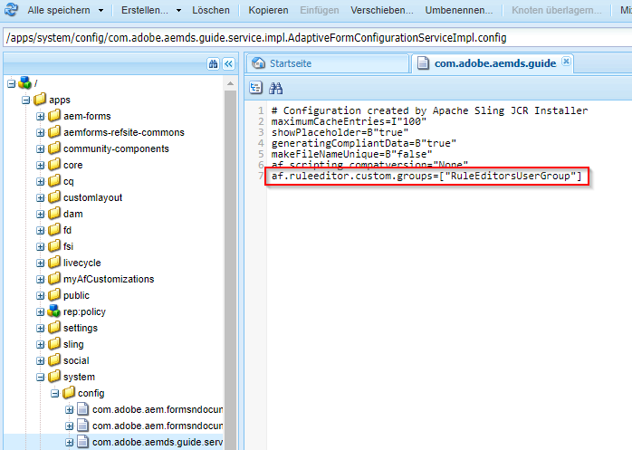

# Ausgewählten Benutzergruppen Zugriff auf den Regel-Editor gewähren{#grant-rule-editor-access-to-select-user-groups}

 Adobe empfiehlt die Verwendung der modernen und erweiterbaren Datenerfassung [Kernkomponenten](https://experienceleague.adobe.com/docs/experience-manager-core-components/using/adaptive-forms/introduction.html?lang=de) für [Erstellen neuer adaptiver Forms](/help/forms/using/create-an-adaptive-form-core-components.md) oder [Hinzufügen von Adaptive Forms zu AEM Sites-Seiten](/help/forms/using/create-or-add-an-adaptive-form-to-aem-sites-page.md). Diese Komponenten stellen einen bedeutenden Fortschritt bei der Erstellung adaptiver Forms dar und sorgen für beeindruckende Benutzererlebnisse. In diesem Artikel wird der ältere Ansatz zum Erstellen von Adaptive Forms mithilfe von Foundation-Komponenten beschrieben. 

## Übersicht {#overview}

Sie können verschiedene Arten von Benutzern mit unterschiedlichen Fähigkeiten haben, die mit Adaptive Forms arbeiten. Während professionelle Benutzer möglicherweise über die nötigen Kenntnisse zum Arbeiten mit Skripten und komplexen Regeln verfügen, genügt es für Benutzer, die nur über Grundkenntnisse verfügen, mit dem Layout und einfachen Eigenschaften adaptiver Formulare zu arbeiten.

AEM Forms ermöglicht es Ihnen, den Zugriff auf den Regel-Editor anhand der Rolle oder Funktion der Benutzer einzuschränken. In den Einstellungen für den Konfigurations-Service für adaptive Formular können Sie festlegen, welche [Benutzergruppen](/help/sites-administering/security.md) den Regeleditor anzeigen und auf ihn zugreifen können.

## Angeben von Benutzergruppen für Zugriff auf Regeleditor {#specify-user-groups-that-can-access-rule-editor}

1. Melden Sie sich bei AEM Forms als Admin an.
1. Klicken Sie in der Autoreninstanz auf „Adobe Experience Manager“ > „Tools“  > „Vorgänge“ > „Web-Konsole“. Die Webkonsole wird in einem neuen Fenster geöffnet.

   

1. Suchen Sie im Fenster „Web-Konsole“ nach **[!UICONTROL Konfiguration von adaptiven Formularen und Web-Kanälen für interaktive Kommunikation]** und klicken Sie darauf. Das Dialogfeld **[!UICONTROL Konfiguration von adaptiven Formularen und Web-Kanälen für interaktive Kommunikation]** wird angezeigt. Behalten Sie die Werte bei und klicken Sie auf **Speichern**.

   Es wird eine Datei /apps/system/config/com.adobe.aemds.guide.service.impl.AdaptiveFormConfigurationServiceImpl.config im CRX-Repository erstellt.

1. Melden Sie sich als Administrator bei CRXDE an. Öffnen Sie die Datei /apps/system/config/com.adobe.aemds.guide.service.impl.AdaptiveFormConfigurationServiceImpl.config zur Bearbeitung.
1. Geben Sie mithilfe folgender Eigenschaft den Namen einer Gruppe an, die auf den Regeleditor zugreifen kann (z. B. RuleEditorsUserGroup), und klicken Sie auf **Alle speichern**.

   `af.ruleeditor.custom.groups=["RuleEditorsUserGroup"]`

   Um den Zugriff für mehrere Gruppen zu ermöglichen, geben Sie eine Liste durch Komma getrennter Werte an:

   `af.ruleeditor.custom.groups=["RuleEditorsUserGroup", "PermittedUserGroup"]`

   

   Wenn jetzt ein Benutzer, der nicht zu einer angegebenen Benutzergruppe (hier: RuleEditorsUserGroup) gehört, auf ein Feld tippt, ist das Symbol „Regel bearbeiten“ () für ihn nicht in der Komponentensymbolleiste verfügbar:

   

   Komponentensymbolleiste für Benutzer mit Zugriff auf Regeleditor

   

   Komponentensymbolleiste für Benutzer ohne Zugriff auf Regeleditor:

   Anweisungen zum Hinzufügen von Benutzern zu Gruppen finden Sie unter [Benutzerverwaltung und Sicherheit](/help/sites-administering/security.md).
