# Hinzufügen von Regeln zu einer Kernkomponente für adaptive Formulare {#adaptive-forms-rule-editor}

Dieser Artikel enthält die neuesten Funktionen des Regeleditors für adaptive Forms-Kernkomponenten, die:
* Unterstützung für die Implementierung verschachtelter Bedingungen mit der Funktion &quot;When-then-else&quot;
* Überprüfen oder Zurücksetzen von Bedienfeldern und Formularen, einschließlich Feldern
* Unterstützung für moderne JavaScript-Funktionen wie Let- und Pfeilfunktionen (ES10-Unterstützung) innerhalb der benutzerdefinierten Funktionen.

Mit der Funktion &quot;Regeleditor&quot;können Benutzer und Entwickler von Formularen Regeln in adaptive Formularobjekte schreiben. Diese Regeln definieren Aktionen für den Trigger von Formularobjekten basierend auf den voreingestellten Bedingungen, Benutzereingaben und Benutzeraktionen im Formular. Dies ermöglicht noch größere Effizienz für ein schnelles und korrektes Ausfüllen der Formulare.

Der Regeleditor bietet eine intuitive und vereinfachte Benutzeroberfläche zum Schreiben von Regeln. Der Regeleditor bietet einen grafischen Editor für alle Benutzer.<!-- In addition, only for forms power users, rule editor provides a code editor to write rules and scripts. --> Einige der wichtigsten Aktionen, die Sie mithilfe von Regeln für Objekte im adaptiven Formular ausführen, sind:

* Ein Objekt ein- oder ausblenden
* Ein Objekt aktivieren oder deaktivieren
* Einen Wert für ein Objekt festlegen
* Den Wert eines Objekts validieren
* Funktionen zur Berechnung des Werts eines Objekts ausführen
* Einen Formulardatenmodelldienst aufrufen und einen Vorgang durchführen
* Eine Eigenschaft eines Objekts festlegen

<!-- Rule editor replaces the scripting capabilities in [!DNL Experience Manager 6.1 Forms] and earlier releases. However, your existing scripts are preserved in the new rule editor. For more information about working with existing scripts in the rule editor, see [Impact of rule editor on existing scripts](rule-editor.md#p-impact-of-rule-editor-on-existing-scripts-p). -->

Benutzer, die zu `forms-power-users` -Gruppe kann die Skripte erstellen und die vorhandenen bearbeiten. Benutzer im `forms-users group` kann die Skripte verwenden, aber keine Skripte erstellen oder bearbeiten.

## Grundlegendes zu Regeln {#understanding-a-rule}

Eine Regel ist eine Kombination aus Aktionen und Bedingungen. Im Regeleditor umfassen Aktionen Aktivitäten wie das Ausblenden, Anzeigen, Aktivieren, Deaktivieren oder Berechnen des Werts eines Objekts in einem Formular. Bedingungen sind boolesche Ausdrücke, die durch Prüfungen und Vorgänge für den Status, den Wert oder die Eigenschaft eines Formularobjekts ausgewertet werden. Aktionen werden basierend auf dem bei der Auswertung einer Bedingung zurückgegebenen Wert (`True` oder `False`) ausgeführt.

Der Regeleditor bietet eine Reihe vordefinierter Regeltypen, z. B. &quot;Wann&quot;, &quot;Anzeigen&quot;, &quot;Ausblenden&quot;, &quot;Aktivieren&quot;, &quot;Deaktivieren&quot;, &quot;Wert einstellen&quot;und &quot;Validieren&quot;, um Ihnen beim Schreiben von Regeln zu helfen. Mit jedem Regeltyp können Sie Bedingungen und Aktionen in einer Regel definieren. In diesem Dokument sind die einzelnen Regeltypen im Detail beschrieben.

Eine Regel folgt normalerweise einem der folgenden Konstrukte:

**Bedingung-Aktion** In diesem Konstrukt definiert die Regel zuerst eine Bedingung und dann die auszulösende Aktion. Das Konstrukt ist vergleichbar mit `if-then statement` in den Programmiersprachen.

Im Regeleditor wird das Bedingung-Aktion-Konstrukt durch den Regeltyp **Wenn** durchgesetzt.

**Aktion-Bedingung** In diesem Konstrukt definiert die Regel zuerst eine auszulösende Aktion und dann die auszuwertenden Bedingungen. Eine weitere Variante dieses Konstrukts ist Aktion-Bedingung-alternative Aktion, wobei auch dann eine alternative Aktion angegeben wird, die ausgelöst wird, wenn die Bedingung den Wert „False“ zurückgibt.

Die Regeltypen Anzeigen, Ausblenden, Aktivieren, Deaktivieren, Wert einstellen und Validieren im Regeleditor erzwingen, dass die `action-condition` Regelkonstrukt. Die alternative Aktion für „Anzeigen“ ist standardmäßig „Ausblenden“ und für „Aktivieren“ „Deaktivieren“ und umgekehrt. Sie können die standardmäßige alternative Aktion nicht ändern.

>[!NOTE]
>
>Die verfügbaren Regeltypen, einschließlich der Bedingungen und Aktionen, die Sie im Regeleditor definieren, hängen auch vom Typ des Formularobjekts ab, für das Sie eine Regel erstellen. Der Regeleditor zeigt nur gültige Regeltypen und Optionen zum Schreiben von Bedingungs- und Aktionsanweisungen für einen bestimmten Formularobjekttyp an. Beispielsweise sehen Sie für ein Bedienfeldobjekt keine Typen &quot;Validieren&quot;und &quot;Wert einstellen&quot;.

Weitere Informationen über die im Regeleditor verfügbaren Regeltypen finden Sie unter [Verfügbare Regeltypen im Regeleditor](rule-editor.md#p-available-rule-types-in-rule-editor-p).

### Richtlinien für die Auswahl eines Regelkonstrukts {#guidelines-for-choosing-a-rule-construct}

Für die meisten Anwendungsfälle können Sie ein beliebiges Regelkonstrukt verwenden. Nachfolgend finden Sie jedoch einige Richtlinien für die Wahl des am besten geeigneten Konstrukts für Ihre Zwecke. Weitere Informationen über die verfügbaren Regeln im Regeleditor finden Sie unter [Verfügbare Regeltypen im Regeleditor](rule-editor.md#p-available-rule-types-in-rule-editor-p).

* Eine typische Faustregel bei der Erstellung einer Regel ist, sie im Kontext des Objekts zu betrachten, für das Sie eine Regel schreiben. Angenommen, Sie möchten ein Feld B basierend auf dem Wert anzeigen, den ein Benutzer in Feld A angibt. In diesem Fall bewerten Sie eine Bedingung für Feld A und lösen basierend auf dem zurückgegebenen Wert eine Aktion für Feld B aus.

  Wenn Sie daher eine Regel für Feld B schreiben (das Objekt, für das Sie eine Bedingung auswerten), verwenden Sie die `condition-action` Konstrukt oder `When` Regeltyp. Verwenden Sie auf ähnliche Weise die `action-condition` Konstrukt oder `Show or Hide` Regeltyp für Feld A.

* In manchen Fällen müssen Sie für eine Bedingung mehrere Aktionen ausführen. In solchen Fällen wird empfohlen, die `condition-action` -Konstrukt. In diesem Konstrukt können Sie eine Bedingung einmal auswerten und mehrere Aktionsanweisungen angeben.

  Um beispielsweise die Felder B, C und D basierend auf einer Bedingung auszublenden, durch die der von einer Benutzerin oder einem Benutzer in Feld A angegebenen Wert geprüft wird, genügt eine Regel mit dem Konstrukt „Bedingung-Aktion“ oder dem Regeltyp „Wenn“ für Feld A, wobei Aktionen für die Sichtbarkeit der Felder B, C und D angegeben werden. Andernfalls benötigen Sie drei separate Regeln für die Felder B, C und D, wobei jede Regel die Bedingung prüft und das jeweilige Feld angezeigt oder ausgeblendet wird. In diesem Beispiel ist das Schreiben einer Wenn-Regel für ein Objekt effizienter als die Erstellung von Regeln zum Anzeigen und Ausblenden für drei Objekte.

* Um eine Aktion in Abhängigkeit von mehreren Bedingungen auszulösen, empfiehlt es sich, das Konstrukt „Aktion-Bedingung“ zu verwenden. Um beispielsweise Feld A nach Auswertung der Bedingungen für die Felder B, C und D anzuzeigen oder auszublenden, verwenden Sie Regeln des Typs „Anzeigen“ oder „Ausblenden“ für Feld A.
* Für Regeln, die genau eine Aktion für eine Bedingung enthalten, können Sie sowohl Bedingung-Aktion- als auch Aktion-Bedingung-Konstrukte verwenden.
* Für Regeln, bei denen auf eine Bedingung geprüft und sofort nach Eingabe eines Werts in ein Feld oder beim Verlassen des Felds eine Aktion ausgeführt wird, empfiehlt es sich, eine Regel mit dem Konstrukt „Bedingung-Aktion“ oder dem Regeltyp „Wenn“ für das Feld zu schreiben, für das die Bedingung ausgewertet wird.
* Die Bedingung in der Wenn-Regel wird ausgewertet, wenn ein Benutzer den Wert des Objekts ändert, auf das die Wenn-Regel angewendet wird. Soll die Aktion jedoch ausgelöst werden, wenn der Wert Server-seitig geändert wird (z. B. wenn der Wert vorab ausgefüllt wird), empfehlen wir, eine Wenn-Regel zu erstellen, die die Aktion beim Initialisieren des Felds auslöst.
* Beim Schreiben von Regeln für Dropdown-Elemente, Optionsfelder oder Kontrollkästchenobjekte werden die Optionen oder Werte dieser Formularobjekte im Formular im Regeleditor vorbefüllt.

## Verfügbare Typen von Operatoren und Ereignissen im Regeleditor {#available-operator-types-and-events-in-rule-editor}

Der Regeleditor bietet die folgenden logischen Operatoren und Ereignisse, mit deren Hilfe Sie Regeln erstellen können.

* **Ist gleich**
* **Ist nicht gleich**
* **Beginnt mit**
* **Endet mit**
* **Enthält**
* **Enthält nicht**
* **Ist leer**
* **Ist nicht leer**
* **Hat ausgewählt:** Gibt &quot;true&quot;zurück, wenn der Benutzer eine bestimmte Option für ein Kontrollkästchen, eine Dropdownliste oder ein Optionsfeld auswählt.
* **Ist initialisiert (Ereignis):** Gibt „true“ zurück, wenn ein Formularobjekt im Browser dargestellt wird.
* **Wird geändert (Ereignis):** Gibt „true“ zurück, wenn der Benutzer den eingegebenen Wert oder die ausgewählte Option für ein Formularobjekt ändert.

<!--
* **Navigation(event):** Returns true when the user clicks a navigation object. Navigation objects are used to move between panels. 
* **Step Completion(event):** Returns true when a step of a rule completes.
* **Successful Submission(event):** Returns true on successful submission of data to a form data model.
* **Error in Submission(event):**  Returns true on unsuccessful submission of data to a form data model. -->

## Verfügbare Typen von Regeln im Regeleditor {#available-rule-types-in-rule-editor}

Der Regeleditor bietet eine Reihe vordefinierter Regeltypen, mit denen Sie Regeln schreiben können. Im Folgenden werden die einzelnen Regeltypen detailliert dargestellt. Weitere Informationen zum Erstellen von Regeln im Regeleditor finden Sie unter [Regeln schreiben](rule-editor.md#p-write-rules-p).

### [!UICONTROL Wenn] {#whenruletype}

Der **[!UICONTROL Wenn]**-Regeltyp nutzt das Konstrukt **Bedingung-Aktion-Alternative Aktion**, in manchen Fällen auch nur das Konstrukt **Bedingung-Aktion**. Für diesen Regeltyp geben Sie zunächst eine auszuwertende Bedingung an und dann eine Aktion, die ausgelöst werden soll, wenn die Bedingung erfüllt ist (`True`). Bei Einsatz der Wenn-Regel können Sie mehrere UND- und ODER-Operatoren verwenden, um [verschachtelte Ausdrücke](#nestedexpressions) zu erstellen.

Mit dem Wenn-Regeltyp können Sie eine Bedingung für ein Formularobjekt auswerten und Aktionen für ein oder mehrere Objekte ausführen.

Einfach ausgedrückt: Eine typische Wenn-Regel ist wie folgt aufgebaut:

`When on Object A:`

`(Condition 1 AND Condition 2 OR Condition 3) is TRUE;`

`Then, do the following:`

`Action 2 on Object B;`
`AND`
`Action 3 on Object C`;

`Else, do the following:`

`Action 2 on Object C;`
_

Beim Erstellen einer Regel für Komponenten mit mehreren Werten (z. B. Optionsfelder oder Listen) werden die Optionen automatisch abgerufen und dem Regelersteller zur Verfügung gestellt. Sie müssen die Optionswerte nicht erneut eingeben.

Eine Liste hat beispielsweise vier Optionen: „Rot“, „Blau“, „Grün“ und „Gelb“. Beim Erstellen der Regel werden die Optionen (Optionsfelder) automatisch abgerufen und dem Regelerstellenden wie folgt zur Verfügung gestellt:


Beim Schreiben der Wenn-Regel können Sie die Aktion „Wert löschen von“ auslösen. `Clear Value Of` Aktion löscht den Wert des angegebenen Objekts. nach `Clear Value of` als Option in der Wenn -Anweisung können Sie komplexe Bedingungen mit mehreren Feldern erstellen. Sie können die Anweisung Else hinzufügen, um weitere Bedingungen hinzuzufügen.


>[!NOTE]
>
> Wenn der Regeltyp nur einstufige then-else-Anweisungen unterstützt.

#### Zulässige mehrere Felder in [!UICONTROL Wann] {#allowed-multiple-fields}

Im **Wann** -Bedingung, können Sie neben dem Feld, auf das die Regel angewendet wird, weitere Felder hinzufügen.

Beispielsweise können Sie mithilfe des Wenn-Regeltyps eine Bedingung für verschiedene Formularobjekte auswerten und die folgende Aktion durchführen:

`When:`

`(Object A Condition 1)`

`AND/OR`

`(Object B Condtion 2)`

`Then, do the following:`

`Action 1 on Object A`

_


##### Überlegungen zur Verwendung von zulässigen mehreren Feldern in der Funktion &quot;Wenn Bedingung&quot;

* Stellen Sie sicher, dass [Kernkomponente und Spezifikationsversion auf die neueste Version eingestellt](https://github.com/adobe/aem-core-forms-components/tree/release/650) , um diese Funktion im Regeleditor zu verwenden.
* Wenn Regeln auf verschiedene Felder in der Wenn-Bedingung angewendet werden, wird die Regel auch dann Trigger, wenn nur eines dieser Felder geändert wird.


<!--
* It is not possible to add multiple fields in the When condition while applying rules to a button.

##### To enable Allowed Multiple fields in When condition feature

Allowed Multiple fields in When condition feature is disabled by default. To enable this feature, add a custom property at the template policy:

1. Open the corresponding template associated with an Adaptive Form in the template editor.
1. Select the existing policy as **formcontainer-policy**.
1. Navigate to the **[!UICONTROL Structure]**  view and, from the **[!UICONTROL Allowed Components]** list, open the **[!UICONTROL Adaptive Forms Container]** policy.
1. Go to the **[!UICONTROL Custom Properties]** tab and to add a custom property, click **[!UICONTROL Add]**.
1. Specify the **Group Name** of your choice. For example, in our case, we added the group name as **allowedfeature**.
1. Add the **key** and **value** pair as follows:
   * key: fd:changeEventBehaviour
   * value: deps
1. Click **[!UICONTROL Done]**. -->

Wenn bei der Funktion Zulässige mehrere Felder in der Bedingung Wenn Probleme auftreten, führen Sie die Schritte zur Fehlerbehebung wie folgt aus:

1. Öffnen Sie das Formular im Bearbeitungsmodus.
1. Öffnen Sie den Inhaltsbrowser und wählen Sie die **[!UICONTROL Guide Container]** -Komponente Ihres adaptiven Formulars.
1. Klicken Sie auf das Symbol für die Guide-Container-Eigenschaften . Das Dialogfeld „Container für ein adaptives Formular“ wird geöffnet.
1. Klicken Sie auf Fertig und speichern Sie das Dialogfeld erneut.

**[!UICONTROL Ausblenden]**: Blendet das angegebene Objekt aus.

**[!UICONTROL Anzeigen]**: Blendet das angegebene Objekt ein.

**[!UICONTROL Aktivieren]**: Aktiviert das angegebene Objekt.

**[!UICONTROL Deaktivieren]**: Deaktiviert das angegebene Objekt.

**[!UICONTROL Dienst aufrufen]** Ruft einen Dienst auf, der in einem Formulardatenmodell (FDM) konfiguriert ist. Wenn Sie den Vorgang „Dienst aufrufen“ wählen, wird ein Feld angezeigt. Beim Antippen des Felds zeigt es sämtliche Dienste an, die in allen Formulardatenmodellen (FDM) in Ihrer [!DNL Experience Manager]-Instanz konfiguriert sind. Bei Auswahl eines Formulardatenmodell-Service werden weitere Felder eingeblendet, in denen Sie Formularobjekte mit Ein- und Ausgabeparametern für den angegebenen Service zuordnen können. Siehe Beispielregel zum Aufrufen von Formulardatenmodell (FDM)-Diensten.

Zusätzlich zum Formulardatenmodell-Service können Sie eine direkte WSDL-URL angeben, um einen Webservice aufzurufen. Ein Formulardatenmodell-Service hat jedoch viele Vorteile und stellt den empfohlenen Ansatz zum Aufrufen eines Service dar.

Weitere Informationen zum Konfigurieren von Diensten im Formulardatenmodell (FDM) finden Sie unter [[!DNL Experience Manager Forms] Datenintegration](data-integration.md).

**[!UICONTROL Wert festlegen]**: Berechnet den Wert des angegebenen Objekts und legt ihn fest. Als Objektwert können Sie eine Zeichenfolge, den Wert eines anderen Objekts, den mittels eines mathematischem Ausdrucks oder einer Funktion berechneten Wert, den Wert einer Eigenschaft eines Objekts oder den von einem konfigurierten Formulardatenmodell-Service ausgegebenen Wert festlegen. Wenn Sie die Option „Web-Dienst“ wählen, werden sämtliche Dienste angezeigt, die in allen Formulardatenmodellen (FDM) in Ihrer [!DNL Experience Manager]-Instanz konfiguriert sind. Bei Auswahl eines Formulardatenmodell-Dienstes werden weitere Felder eingeblendet, in denen Sie Formularobjekte mit Ein- und Ausgabeparametern für den angegebenen Dienst zuordnen können.

Weitere Informationen zum Konfigurieren von Diensten im Formulardatenmodell (FDM) finden Sie unter [[!DNL Experience Manager Forms] Datenintegration](data-integration.md).

Mit dem Regeltyp **[!UICONTROL Eigenschaft festlegen]** können Sie den Wert einer Eigenschaft des angegebenen Objekts basierend auf einer Bedingungsaktion festlegen. Sie können die Eigenschaft für eines der folgenden Elemente festlegen:
* visible (Boolescher Wert)
* label.value (String)
* label.visible (Boolesch)
* description (String)
* aktiviert (Boolescher Wert)
* readOnly (Boolesch)
* required (Boolesch)
* screenReaderText (String)
* valid (Boolescher Wert)
* errorMessage (Zeichenfolge)
* default (Zahl, Zeichenfolge, Datum)
* enumNames (String)[])
* chartType (Zeichenfolge)

So können Sie beispielsweise Regeln definieren, die das Textfeld anzeigen, wenn auf eine Schaltfläche geklickt wird. Sie können benutzerdefinierte Funktionen, ein Formularobjekt, eine Objekteigenschaft oder eine Dienstausgabe verwenden, um eine Regel zu definieren.

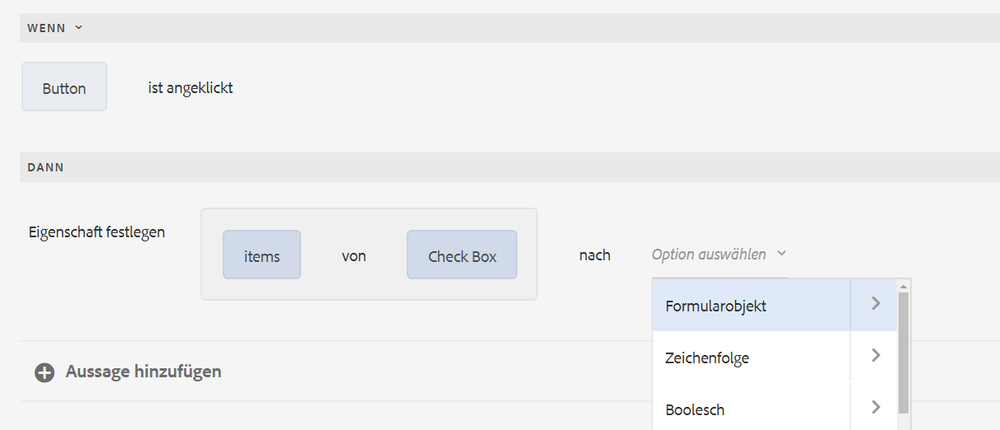

Um eine Regel basierend auf einer benutzerdefinierten Funktion zu definieren, wählen Sie **[!UICONTROL Funktionsausgabe]** in der Dropdown-Liste aus und ziehen Sie eine benutzerdefinierte Funktion mittels Drag-and-Drop aus der Registerkarte **[!UICONTROL Funktionen]**. Wenn die Bedingungsaktion erfüllt ist, wird das Texteingabefeld angezeigt.

Um eine auf einem Formularobjekt basierende Regel zu definieren, wählen Sie **[!UICONTROL Formularobjekt]** in der Dropdown-Liste aus und ziehen Sie ein Formularobjekt mittels Drag-and-Drop aus der Registerkarte **[!UICONTROL Formularobjekte]**. Wenn die Bedingungsaktion erfüllt ist, wird das Texteingabefeld im adaptiven Formular angezeigt.

Mit einer auf einer Objekteigenschaft basierenden Regel Eigenschaft festlegen können Sie das Texteingabefeld in einem adaptiven Formular basierend auf einer anderen Objekteigenschaft im adaptiven Formular sichtbar machen.

Die folgende Abbildung zeigt ein Beispiel für die dynamische Aktivierung des Kontrollkästchens basierend auf dem Ausblenden oder Anzeigen des Textfelds in einem adaptiven Formular:


**[!UICONTROL Wert löschen von]**: Löscht den Wert des angegebenen Objekts.

**[!UICONTROL Fokus festlegen]**: Legt den Fokus auf das angegebene Objekt.

**[!UICONTROL Formular senden]** Sendet das Formular.

**[!UICONTROL Zurücksetzen]** Setzt das Formular oder das angegebene Objekt zurück.

**[!UICONTROL Bestätigen]** Validiert das Formular oder das angegebene Objekt.

**[!UICONTROL Instanz hinzufügen]**: Fügt eine Instanz des angegebenen wiederholbaren Bereichs oder der Tabellenzeile hinzu.

**[!UICONTROL Instanz entfernen]**: Entfernt eine Instanz des angegebenen wiederholbaren Bereichs oder der Tabellenzeile.

**[!UICONTROL Funktionsausgabe]** Definiert eine Regel, die auf vordefinierten Funktionen oder benutzerdefinierten Funktionen basiert.

**[!UICONTROL Navigieren zu]**: Navigiert zu anderen <!--Interactive Communications,--> adaptiven Formularen, anderen Assets (wie Bildern oder Dokument-Fragmenten) oder zu einer externen URL. <!-- For more information, see [Add button to the Interactive Communication](create-interactive-communication.md#addbuttontothewebchannel). -->

**[!UICONTROL Dispatcher-Ereignis]** Trigger der spezifischen Aktionen oder Verhaltensweisen anhand vordefinierter Bedingungen oder Ereignisse.


### [!UICONTROL Wert festlegen] {#set-value-of}

Regeln vom Typ **[!UICONTROL Wert festlegen]** ermöglichen es, den Wert eines Formularobjekts abhängig davon festzulegen, ob die angegebene Bedingung erfüllt ist oder nicht. Der Wert kann auf den Wert eines anderen Objekts, eine Literal-Zeichenfolge, einen von einem mathematischen Ausdruck oder einer Funktion abgeleiteten Wert, den Wert einer Eigenschaft eines anderen Objekts oder die Ausgabe eines Formulardatenmodell-Service festgelegt werden. In ähnlicher Weise können Sie auf eine Bedingung bei Komponenten, Zeichenfolgen, Eigenschaften oder Werten, die von Funktionen oder mathematischen Ausdrücken abgeleitet wurden, prüfen.

Der Regeltyp **Wert festlegen** steht für manche Formularobjekte nicht zur Verfügung (z. B. nicht für Bereiche und Schaltflächen von Symbolleisten). Eine standardmäßige Regel vom Typ „Wert festlegen“ hat die folgende Struktur:

Wert von Objekt A festlegen auf:

(Zeichenfolge ABC) ODER (Objekteigenschaft X von Objekt C) ODER (Wert aus einer Funktion) ODER (Wert aus einem mathematischen Ausdruck) ODER (Ausgabewert eines Datenmodelldienstes);

When (optional):

(Condition 1 AND Condition 2 AND Condition 3) is TRUE;

Im folgenden Beispiel wird der Wert von `Question2` as `True` und legt den Wert von `Result` as `correct`.


Beispiel einer Regel zum Festlegen eines Werts mit dem Formulardatenmodelldienst.

### [!UICONTROL Anzeigen] {#show}

Mithilfe des Regeltyps **[!UICONTROL Anzeigen]** können Sie eine Regel schreiben, die ein Formularobjekt je nachdem, ob eine Bedingung erfüllt ist oder nicht, anzeigt oder ausblendet. Der Regeltyp „Anzeigen“ löst auch die Aktion „Ausblenden“ aus, falls die Bedingung nicht erfüllt ist oder `False` zurückgibt.

Eine typische Regel vom Typ „Anzeigen“ ist wie folgt strukturiert:

`Show Object A;`

`When:`

`(Condition 1 OR Condition 2 OR Condition 3) is TRUE;`

`Else:`

`Hide Object A;`

### [!UICONTROL Ausblenden] {#hide}

Regeln vom Typ **[!UICONTROL Ausblenden]** können ähnlich wie Regeln vom Typ „Anzeigen“ dazu verwendet werden, Formularobjekte je nachdem, ob eine Bedingung erfüllt ist oder nicht, anzuzeigen oder auszublenden. Der Regeltyp „Ausblenden“ löst auch die Aktion „Anzeigen“ aus, falls die Bedingung nicht erfüllt ist oder `False` zurückgibt.

Eine typische Regel vom Typ „Ausblenden“ ist wie folgt strukturiert:

`Hide Object A;`

`When:`

`(Condition 1 AND Condition 2 AND Condition 3) is TRUE;`

`Else:`

`Show Object A;`

### [!UICONTROL Aktivieren] {#enable}

Mithilfe des Regeltyps **[!UICONTROL Aktivieren]** können Sie ein Formularobjekt in Abhängigkeit davon aktivieren oder deaktivieren, ob eine Bedingung erfüllt ist oder nicht. Der Regeltyp „Aktivieren“ löst auch die Aktion „Deaktivieren“ aus, falls die Bedingung nicht erfüllt ist oder `False` zurückgibt.

Eine typische Regel vom Typ „Aktivieren“ ist wie folgt strukturiert:

`Enable Object A;`

`When:`

`(Condition 1 AND Condition 2 AND Condition 3) is TRUE;`

`Else:`

`Disable Object A;`

### [!UICONTROL Deaktivieren] {#disable}

Regeln vom Typ **[!UICONTROL Deaktivieren]** können ähnlich wie Regeln vom Typ „Aktivieren“ dazu verwendet werden, Formularobjekte in Abhängigkeit davon, ob eine Bedingung erfüllt ist oder nicht, zu aktivieren oder zu deaktivieren. Der Regeltyp „Deaktivieren“ löst auch die Aktion „Aktivieren“ aus, falls die Bedingung nicht erfüllt ist oder `False` zurückgibt.

Eine typische Regel vom Typ „Deaktivieren“ ist wie folgt strukturiert:

`Disable Object A;`

`When:`

`(Condition 1 OR Condition 2 OR Condition 3) is TRUE;`

`Else:`

`Enable Object A;`

### [!UICONTROL Validieren] {#validate}

Regeln vom Typ **[!UICONTROL Validieren]** überprüfen den Wert in einem Feld mithilfe eines Ausdrucks. So können Sie beispielsweise einen Ausdruck erstellen, der ein Textfeld zur Eingabe eines Namens daraufhin überprüft, dass dort keine Sonderzeichen oder Zahlen eingegeben wurden.

Eine typische Regel vom Typ „Validieren“ ist wie folgt strukturiert:

`Validate Object A;`

`Using:`

`(Expression 1 AND Expression 2 AND Expression 3) is TRUE;`

>[!NOTE]
>
>Wenn der angegebene Wert nicht der Validierungsregel entspricht, können Sie eine Validierungsmeldung für die Benutzenden anzeigen lassen. Sie können die Meldung im Feld **[!UICONTROL Skriptüberprüfungsmeldung]** in den Komponenteneigenschaften in der Seitenleiste angeben.


<!--
### [!UICONTROL Set Options Of] {#setoptionsof}

The **[!UICONTROL Set Options Of]** rule type enables you to define rules to add check boxes dynamically to the Adaptive Form. You can use a Form Data Model or a custom function to define the rule.

To define a rule based on a custom function, select **[!UICONTROL Function Output]** from the drop-down list, and drag-and-drop a custom function from the **[!UICONTROL Functions]** tab. The number of checkboxes defined in the custom function are added to the Adaptive Form.


To create a custom function, see [custom functions in rule editor](#custom-functions).

To define a rule based on a form data model:

1. Select **[!UICONTROL Service Output]** from the drop-down list.
1. Select the data model object.
1. Select a data model object property from the **[!UICONTROL Display Value]** drop-down list. The number of checkboxes in the Adaptive Form is derived from the number of instances defined for that property in the database.
1. Select a data model object property from the **[!UICONTROL Save Value]** drop-down list.

 -->

## Grundlegendes zur Benutzeroberfläche des Regeleditors {#understanding-the-rule-editor-user-interface}

Der Regeleditor bietet eine umfangreiche und dennoch einfache Benutzeroberfläche zum Erstellen und Verwalten von Regeln. Sie können die Benutzeroberfläche des Regeleditors im Autorenmodus von einem adaptiven Formular aus aufrufen.

So starten Sie die Benutzeroberfläche des Regeleditors:

1. Öffnen Sie ein adaptives Formular im Autorenmodus.
1. Wählen Sie das Formularobjekt aus, für das Sie eine Regel schreiben möchten, und wählen Sie in der Komponenten-Symbolleiste . Die Benutzeroberfläche des Regeleditors wird angezeigt.

   

   Alle vorhandenen Regeln für die ausgewählten Formularobjekte werden in dieser Ansicht aufgelistet. Weitere Informationen zum Verwalten vorhandener Regeln finden Sie unter [Verwalten von Regeln](rule-editor.md#p-manage-rules-p).

1. Wählen Sie **[!UICONTROL Erstellen]**, um eine neue Regel zu erstellen. Wenn Sie den Regeleditor zum ersten Mal starten, wird standardmäßig der Visual Editor der Regeleditor-Benutzeroberfläche geöffnet.

   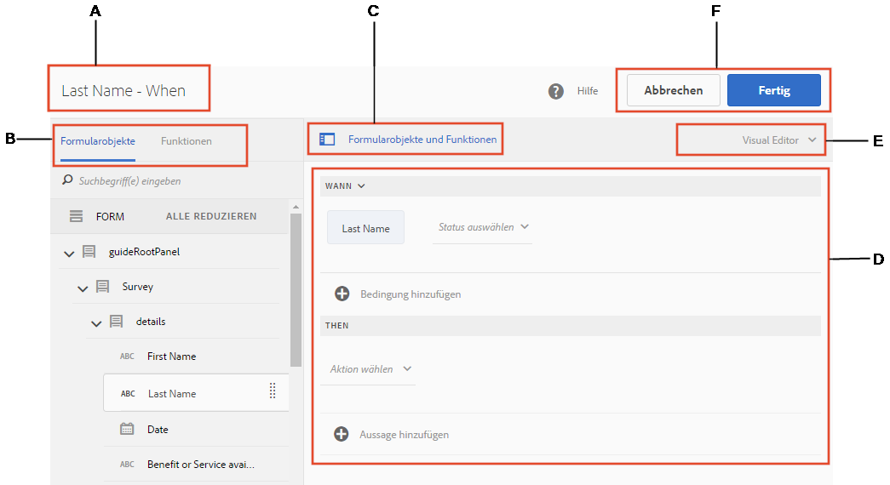

Nachfolgend werden die einzelnen Komponenten der Benutzeroberfläche des Regeleditors im Detail beschrieben.

### A. Ansicht „Komponente und Regel“ {#a-component-rule-display}

Zeigt den Titel des adaptiven Formularobjekts, über das Sie den Regeleditor aufgerufen haben, sowie den derzeit ausgewählten Regeltyp an. Im obigen Beispiel wird der Regeleditor von einem adaptiven Formularobjekt mit dem Namen Frage 1 gestartet und der Regeltyp ist Wann.

### B. Formularobjekte und Funktionen {#b-form-objects-and-functions-br}

Im linken Bereich der Benutzeroberfläche des Regeleditors stehen zwei Registerkarten zur Verfügung: **[!UICONTROL Formularobjekte]** und **[!UICONTROL Funktionen]**.

Die Registerkarte „Formularobjekte“ zeigt eine hierarchische Ansicht aller Objekte an, die in dem adaptiven Formular enthalten sind. Angezeigt werden Titel und Typ der Objekte. Wenn Sie eine Regel erstellen, können Sie Formularobjekte in den Regeleditor ziehen und dort ablegen. Wenn Sie beim Erstellen oder Bearbeiten einer Regel ein Objekt oder eine Funktion in einen Platzhalter ziehen, übernimmt dieser Platzhalter automatisch den entsprechenden Wertetyp.

Die Formularobjekte, auf die eine oder mehrere gültige Regeln angewendet wurden, sind mit einem grünen Punkt markiert. Ist eine der auf ein Formularobjekt angewendeten Regeln ungültig, wird das Formularobjekt mit einem gelben Punkt markiert.

Die Registerkarte „Funktionen“ enthält eine Reihe integrierter Funktionen (z. B. „Summe von“, „Minimum von“, „Maximum von“, „Durchschnitt von“, „Anzahl von“ und „Formular validieren“). Sie können diese Funktionen verwenden, um Werte in wiederholbaren Bereichen und Tabellenzeilen zu berechnen und sie beim Erstellen von Regeln in den Aktions- und Bedingungsanweisungen zu verwenden. Sie können jedoch auch benutzerdefinierte Funktionen erstellen.

Einige Funktionen werden in der Abbildung dargestellt:


>[!NOTE]
>
>Sie können auf den Registerkarten „Formularobjekte“ und „Funktionen“ eine Textsuche nach den Namen und Titeln von Objekten und Funktionen durchführen.

In der linken Baumstruktur der Formularobjekte können Sie die Formularobjekte auswählen, um die Regeln anzuzeigen, die auf die einzelnen Objekte angewendet werden. Sie können nicht nur durch die Regeln der verschiedenen Formularobjekte navigieren, sondern auch Regeln zwischen den Formularobjekten kopieren und einfügen. Weitere Informationen finden Sie unter [Kopieren und Einfügen von Regeln](rule-editor.md#p-copy-paste-rules-p).

### C. Umschalten zwischen Formularobjekten und Funktionen {#c-form-objects-and-functions-toggle-br}

Durch Tippen auf die Schaltfläche schalten Sie zwischen den Bereichen für Formularobjekte und Funktionen um.

### D. Visueller Regeleditor {#visual-rule-editor}

Der visuelle Regeleditor ist im visuellen Editormodus der Benutzeroberfläche des Regeleditors der Bereich, in dem Sie Regeln schreiben. Sie können hier einen Regeltyp auswählen und die entsprechenden Bedingungen und Aktionen definieren. Beim Definieren von Bedingungen und Aktionen in einer Regel können Sie Formularobjekte und Funktionen aus dem Bereich „Formularobjekte und Funktionen“ ziehen und ablegen.

Weitere Informationen zur Verwendung des visuellen Regeleditors finden Sie unter [Regeln schreiben](rule-editor.md#p-write-rules-p).
<!-- 
### E. Visual-code editors switcher {#e-visual-code-editors-switcher}

Users in the forms-power-users group can access code editor. For other users, code editor is not available. If you have the rights, you can switch from visual editor mode to code editor mode of the rule editor, and conversely, using the switcher right above the rule editor. When you launch rule editor the first time, it opens in the visual editor mode. You can write rules in the visual editor mode or switch to the code editor mode to write a rule script. However, note that if you modify a rule or write a rule in code editor, you cannot switch back to the visual editor for that rule unless you clear the code editor.

[!DNL Experience Manager Forms] tracks the rule editor mode you used last to write a rule. When you launch the rule editor next time, it opens in that mode. However, you can also configure a default mode to open the rule editor in the specified mode. To do so:

1. Go to [!DNL Experience Manager] web console at `https://[host]:[port]/system/console/configMgr`.
1. Click to edit **[!UICONTROL Adaptive Form Configuration Service]**.
1. choose **[!UICONTROL Visual Editor]** or **[!UICONTROL Code Editor]** from the **[!UICONTROL Default Mode for Rule Editor]** drop-down

1. Click **[!UICONTROL Save]**.
-->

### F. Schaltflächen „Fertig“ und „Abbrechen“ {#done-and-cancel-buttons}

Die Schaltfläche **[!UICONTROL Fertig]** wird verwendet, um eine Regel zu speichern. Sie können eine unvollständige Regel speichern. Unvollständige Regeln sind jedoch ungültig und werden nicht ausgeführt. Gespeicherte Regeln für ein Formularobjekt werden aufgelistet, wenn Sie den Regeleditor das nächste Mal von demselben Formularobjekt aus starten. In dieser Ansicht können Sie vorhandene Regeln verwalten. Weitere Informationen finden Sie unter [Verwalten von Regeln](rule-editor.md#p-manage-rules-p).

Über die Schaltfläche **[!UICONTROL Abbrechen]** verwerfen Sie alle Änderungen, die Sie an einer Regel vorgenommen haben, und der Regeleditor wird geschlossen.

## Regeln schreiben {#write-rules}

Sie können Regeln mit dem visuellen Regeleditor schreiben <!-- or the code editor. When you launch the rule editor the first time, it opens in the visual editor mode. You can switch to the code editor mode and write rules. However, if you write or modify a rule in code editor, you cannot switch to the visual editor for that rule unless you clear the code editor. When you launch the rule editor next time, it opens in the mode that you used last to create rule. -->

Im Folgenden wird zunächst das Schreiben von Regeln im Visual Editor beschrieben.

### Verwenden des Visual Editor {#using-visual-editor}

Anhand des folgenden Beispielformulars soll das Erstellen von Regeln im visuellen Editor verständlich gemacht werden.


Im Abschnitt für die Kreditvoraussetzungen in diesem Beispielformular für einen Kreditantrag müssen die Antragstellenden ihren Familienstand, ihr Gehalt und, falls verheiratet, das Gehalt der Partnerin bzw. des Partners angeben. Basierend auf den Benutzereingaben wird mithilfe der Regel der Kreditanspruchsbetrag berechnet und im Feld für den Kreditanspruch angegeben. Wenden Sie die folgenden Regeln an, um dieses Szenario zu implementieren:

* Das Feld für das Gehalt der Partnerin bzw. des Partners wird nur angezeigt, wenn als Familienstand „Verheiratet“ angegeben wurde.
* Der Kreditanspruchsbetrag beträgt 50 % des Gesamtgehalts.

Gehen Sie wie folgt vor, um Regeln zu erstellen:

1. Schreiben Sie zuerst die Regel, mit der die Sichtbarkeit des Felds „Gehalt des Partners“ entsprechend der vom Benutzer über das Optionsfeld „Familienstand“ gewählten Option gesteuert wird.

   Öffnen Sie das Kreditantragsformular im Autorenmodus. Wählen Sie die Komponente **[!UICONTROL Familienstand]** und  aus. Wählen Sie als Nächstes **[!UICONTROL Erstellen]** aus, um den Regeleditor zu starten.

   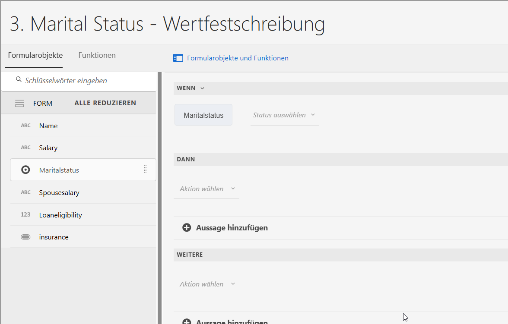

   Wenn Sie den Regeleditor starten, ist standardmäßig die Wenn-Regel ausgewählt. Darüber hinaus wird das Formularobjekt (in diesem Fall „Familienstand“), von dem aus Sie den Regeleditor gestartet haben, in der Wenn-Anweisung angegeben.

   Sie können zwar das ausgewählte Objekt nicht bearbeiten oder ändern, es ist jedoch möglich, über die Dropdown-Liste für Regeln einen anderen Regeltyp wählen (siehe unten). Wenn Sie eine Regel für ein anderes Objekt erstellen möchten, wählen Sie „Abbrechen“ aus, um den Regeleditor zu beenden, und starten Sie ihn erneut über das gewünschte Formularobjekt.

1. Wählen Sie die Dropdown-Liste **[!UICONTROL Status auswählen]** und **[!UICONTROL Ist gleich]** aus. Das Feld **[!UICONTROL Eine Zeichenfolge eingeben]** wird angezeigt.

   

<!--  In the Marital Status radio button, **[!UICONTROL Married]** and **[!UICONTROL Single]** options are assigned **0** and **1** values, respectively. You can verify assigned values in the Title tab of the Edit radio button dialog as shown below.

   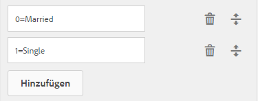-->

1. Im **[!UICONTROL String eingeben]** in der Regel ein, wählen Sie **Verheiratet** aus dem Dropdown-Menü.

   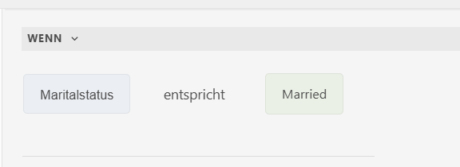

   Sie haben die Bedingung als `When Marital Status is equal to Married` definiert. Definieren Sie anschließend die Aktion, die ausgeführt werden soll, wenn diese Bedingung „True“ lautet.

1. Wählen Sie für die Dann-Anweisung die Option **[!UICONTROL Anzeigen]** aus der Dropdown-Liste **[!UICONTROL Aktion auswählen]**.

   

1. Ziehen Sie das Feld **[!UICONTROL Gehalt des Partners]** aus der Registerkarte „Formularobjekte“ in das Feld **[!UICONTROL Legen Sie das Objekt ab oder wählen Sie hier aus]**. Stattdessen können Sie auch das Feld **[!UICONTROL Objekt hier einfügen oder auswählen]** auswählen und das Feld **[!UICONTROL Gehalt des Partners]** aus dem Popup-Menü wählen, in dem sämtliche Formularobjekte im Formular aufgeführt sind.

   

   Definieren Sie als Nächstes die Aktion, die ausgeführt werden soll, wenn diese Bedingung False ist.
1. Klicks **[!UICONTROL Abschnitt &quot;Else hinzufügen&quot;]** , um eine weitere Bedingung für die **[!UICONTROL Gehalt des Partners]** eingeben, falls Sie Familienstand als Einzelperson auswählen.

   

1. Wählen Sie in der Anweisung Else die Option **[!UICONTROL Ausblenden]** aus dem **[!UICONTROL Aktion auswählen]** angezeigt.
   

1. Ziehen Sie das Feld **[!UICONTROL Gehalt des Partners]** aus der Registerkarte „Formularobjekte“ in das Feld **[!UICONTROL Legen Sie das Objekt ab oder wählen Sie hier aus]**. Stattdessen können Sie auch das Feld **[!UICONTROL Objekt hier einfügen oder auswählen]** auswählen und das Feld **[!UICONTROL Gehalt des Partners]** aus dem Popup-Menü wählen, in dem sämtliche Formularobjekte im Formular aufgeführt sind.
   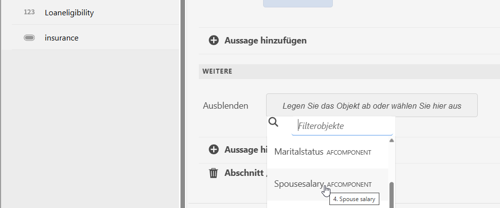

   Die Regel wird im Regeleditor wie folgt angezeigt.

   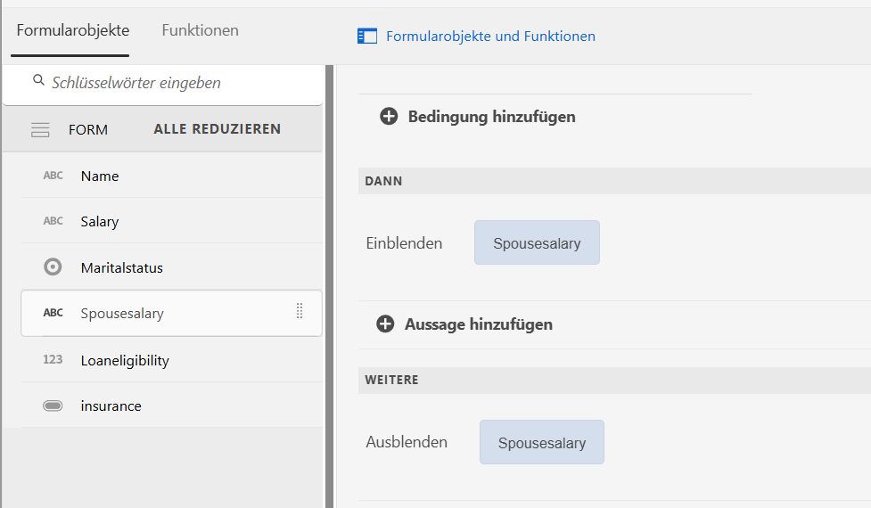


1. Wählen Sie **[!UICONTROL Fertig]** aus, um die Regel zu speichern.

<!--
1. Repeat steps 1 through 5 to define another rule to hide the Spouse Salary field if the marital Status is Single. The rule appears as follows in the rule editor.

    -->

>[!NOTE]
>
> Alternativ können Sie eine Regel Anzeigen für das Feld Gehalt des Partners anstelle einer Wenn-Regel für das Feld Familienstand schreiben, um dasselbe Verhalten zu implementieren.

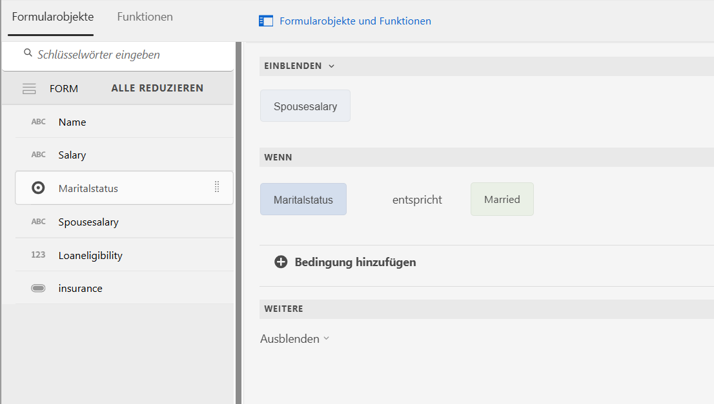

1. Als Nächstes erstellen Sie eine Regel für die Berechnung des Kreditanspruchsbetrags (50 % des Gesamtgehalts) und zur Anzeige des Betrags im Feld für den Kreditanspruch. Dies erreichen Sie, indem Sie für das Feld „Kreditanspruch“ Regeln vom Typ **[!UICONTROL Wert festlegen]** erstellen.

   Wählen Sie im Autorenmodus das Feld **[!UICONTROL Kreditanspruch]** und wählen Sie dann . Wählen Sie anschließend **[!UICONTROL Erstellen]** aus, um den Regeleditor zu starten.

1. Wählen Sie in der Dropdown-Liste „Regeln“ die Regel **[!UICONTROL Wert festlegen]** aus.

   

1. Wählen Sie **[!UICONTROL Option auswählen]** und dann **[!UICONTROL Mathematischer Ausdruck]** aus. Ein Feld, in dem Sie mathematische Ausdrücke schreiben können, wird geöffnet.

   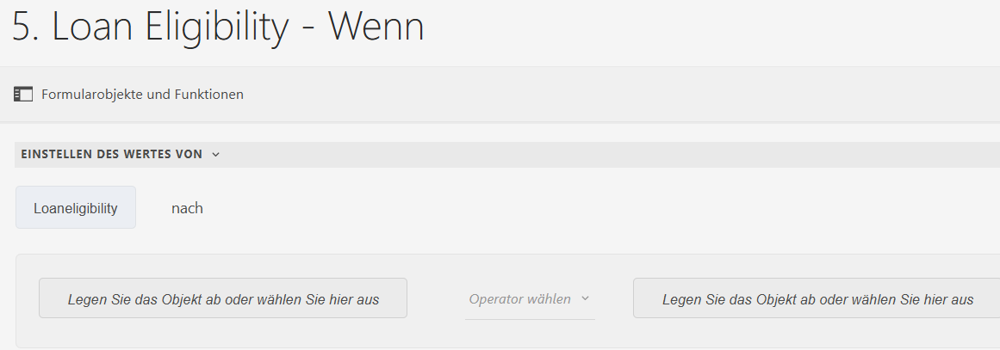

1. Gehen Sie in diesem Ausdrucksfeld wie folgt vor:

   * Wählen Sie das Feld **[!UICONTROL Gehalt]**   im ersten Feld **[!UICONTROL Legen Sie das Objekt ab oder wählen Sie hier aus]** aus oder ziehen Sie es von der Registerkarte „Formularobjekt“ hierhin.

   * Wählen Sie aus dem Feld **[!UICONTROL Operator auswählen]** die Option **[!UICONTROL plus]** aus.

   * Wählen Sie das Feld **[!UICONTROL Gehalt des Partners]** auf der Registerkarte „Formularobjekt“ aus oder ziehen Sie es in das zweite Feld **[!UICONTROL Legen Sie das Objekt ab oder wählen Sie hier aus]** und legen Sie es dort ab.

   

1. Wählen Sie als Nächstes etwas im hervorgehobenen Bereich um das Ausdrucksfeld und wählen Sie dann **[!UICONTROL Ausdruck erweitern]** aus.

   

   Wählen Sie im Feld für den erweiterten Ausdruck im Feld **[!UICONTROL Operator auswählen]** die Option **[!UICONTROL geteilt durch]** und im Feld **[!UICONTROL Option auswählen]** die Option **[!UICONTROL Zahl]** aus. Geben Sie **[!UICONTROL 2]** in das Zahlenfeld ein.

   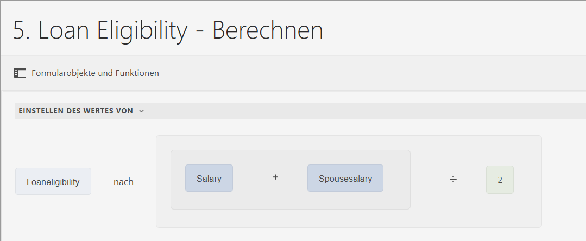

   >[!NOTE]
   >
   >Sie können mithilfe von Komponenten, Funktionen, mathematischen Ausdrücken und Eigenschaftswerten aus dem Feld „Option auswählen“ komplexe Ausdrücke erstellen.

   Erstellen Sie als Nächstes eine Bedingung, bei der bei Rückgabe von „True“ der Ausdruck ausgeführt wird.

1. Wählen Sie **[!UICONTROL Bedingung hinzufügen]** aus, um eine Wenn-Anweisung hinzuzufügen.

   

   Gehen Sie in der Wenn-Anweisung wie folgt vor:

   * Wählen Sie auf der Registerkarte „Formularobjekt“ das Feld **[!UICONTROL Familienstand]** im ersten Feld **[!UICONTROL Objekt hier einfügen oder auswählen]**.

   * Wählen Sie **[!UICONTROL Ist gleich]** im Feld **[!UICONTROL Operator wählen]** aus.

   * Wählen Sie in dem anderen Feld **[!UICONTROL Legen Sie das Objekt ab oder wählen Sie hier aus]** den Eintrag „String“ (Zeichenfolge) aus und geben Sie **[!UICONTROL Verheiratet]** in das Feld **[!UICONTROL Geben Sie eine Zeichenfolge ein]** ein.

   Die Regel wird schließlich wie folgt im Regeleditor angezeigt.  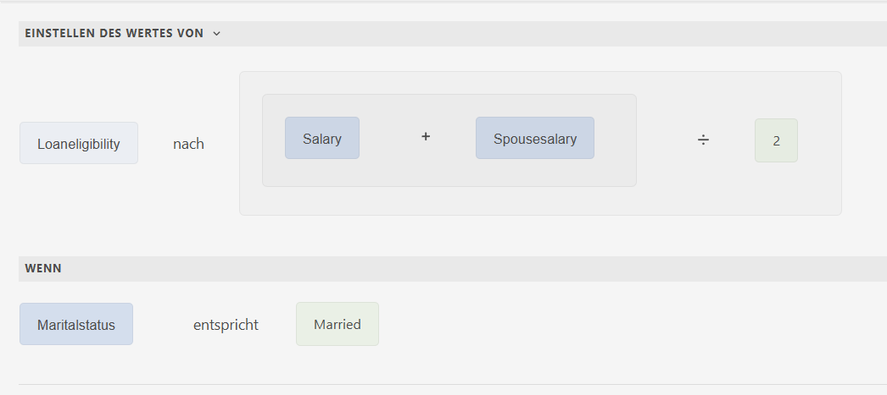

1. Klicken Sie auf **[!UICONTROL Fertig]**. Dadurch wird die Regel gespeichert.

1. Folgen Sie wiederum Schritt 7 bis 14, um eine andere Regel zu definieren, mit deren Hilfe der Kreditanspruch berechnet wird im Falle, dass der Familienstand „Ledig“ ist. Die Regel wird im Regeleditor wie folgt angezeigt.

   

Sie können auch die Regel „Wert einstellen von“ verwenden, um den Kreditanspruch über die Wenn-Regel zu berechnen, die Sie erstellt haben, um das Feld für das Gehalt der Partnerin bzw. des Partners ein- bzw. auszublenden. Die resultierende kombinierte Regel (für den Familienstand „Ledig“) wird wie folgt im Regeleditor angezeigt.


Sie können eine kombinierte Regel erstellen, um die Sichtbarkeit des Felds für das Gehalt des Partners oder der Partnerin zu steuern und die Kreditanspruchsberechtigung für den Familienstand &quot;Verheiratet&quot;unter Verwendung der Bedingung &quot;Else&quot;zu berechnen.

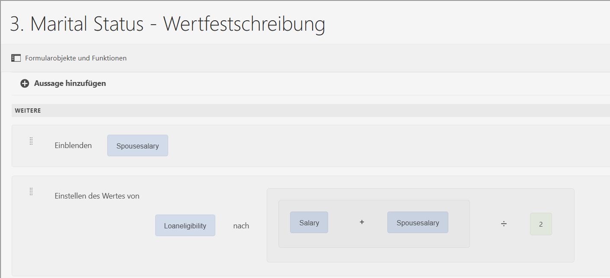


<!-- ### Using code editor {#using-code-editor}

Users added to the forms-power-users group can use code editor. The rule editor auto generates the JavaScript code for any rule you create using visual editor. You can switch from visual editor to the code editor to view the generated code. However, if you modify the rule code in the code editor, you cannot switch back to the visual editor. If you prefer writing rules in code editor rather than visual editor, you can write rules afresh in the code editor. The visual-code editors switcher helps you switch between the two modes.

The code editor JavaScript is the expression language of Adaptive Forms. All the expressions are valid JavaScript expressions and use Adaptive Forms scripting model APIs. These expressions return values of certain types. For the complete list of Adaptive Forms classes, events, objects, and public APIs, see [JavaScript Library API reference for Adaptive Forms](https://helpx.adobe.com/experience-manager/6-5/forms/javascript-api/index.html).

For more information about guidelines to write rules in the code editor, see [Adaptive Form Expressions](adaptive-form-expressions.md).

While writing JavaScript code in the rule editor, the following visual cues help you with the structure and syntax:

* Syntax highlights

* Auto Indentation

* Hints and suggestions for Form objects, functions, and their properties

* Auto completion of form component names and common JavaScript functions


-->

#### Benutzerdefinierte Funktionen im Regeleditor {#custom-functions}

Neben den vordefinierten Funktionen wie *Summe der* die unter **Funktionsausgabe** können Sie auch benutzerdefinierte Funktionen in Ihrem Regeleditor verwenden. Der Regeleditor unterstützt die JavaScript ECMAScript 2019-Syntax für Skripte und benutzerdefinierte Funktionen. Anweisungen zum Erstellen benutzerdefinierter Funktionen finden Sie im Artikel [Benutzerdefinierte Funktionen in Adaptive Forms](/help/forms/using/create-and-use-custom-functions-core-components.md)

<!--

Ensure that the function you write is accompanied by the `jsdoc` above it. Adaptive Form supports the various [JavaScript annotations for custom functions](/help/forms/create-and-use-custom-functions.md#js-annotations).

For more information, see [jsdoc.app](https://jsdoc.app/).

Accompanying `jsdoc` is required:

* If you want custom configuration and description
* Because there are multiple ways to declare a function in `JavaScript,` and comments let you keep a track of the functions.

Supported `jsdoc` tags:

* **Private**
  Syntax: `@private`
  A private function is not included as a custom function.

* **Name**
  Syntax: `@name funcName <Function Name>`
  Alternatively `,` you can use: `@function funcName <Function Name>` **or** `@func` `funcName <Function Name>`.
  `funcName` is the name of the function (no spaces allowed).
  `<Function Name>` is the display name of the function.

* **Parameter**
  Syntax: `@param {type} name <Parameter Description>`
  Alternatively, you can use: `@argument` `{type} name <Parameter Description>` **or** `@arg` `{type}` `name <Parameter Description>`.
  Shows parameters used by the function. A function can have multiple parameter tags, one tag for each parameter in the order of occurrence.
  `{type}` represents parameter type. Allowed parameter types are:

    1. string
    2. number
    3. boolean
    4. scope
    5. string[]
    6. number[]
    7. boolean[]
    8. date
    9. date[]
    10. array
    11. object

   `scope` refers to a special globals object which is provided by forms runtime. It must be the last parameter and is not be visible to the user in the rule editor. You can use scope to access readable form and field proxy object to read properties, event which triggered the rule and a set of functions to manipulate the form.

   `object` type is used to pass readable field object in parameter to a custom function instead of passing the value.

   All parameter types are categorized under one of the above. None is not supported. Ensure that you select one of the types above. Types are not case-sensitive. Spaces are not allowed in the parameter name.  Parameter description can have multiple words.

* **Optional Parameter**
Syntax: `@param {type=} name <Parameter Description>` 
Alternatively, you can use: `@param {type} [name] <Parameter Description>`
By default all parameters are mandatory. You can mark a parameter optional by adding `=` in type of the parameter or by putting param name in square brackets.
   
   For example, let us declare `Input1` as optional parameter:
    * `@param {type=} Input1`
    * `@param {type} [Input1]`

* **Return Type**
  Syntax: `@return {type}`
  Alternatively, you can use `@returns {type}`.
  Adds information about the function, such as its objective.
  {type} represents the return type of the function. Allowed return types are:

    1. string
    2. number
    3. boolean
    4. string[]
    5. number[]
    6. boolean[]
    7. date
    8. date[]
    9. array
    10. object

  All other return types are categorized under one of the above. None is not supported. Ensure that you select one of the types above. Return types are not case-sensitive.

**Adding a custom function**

For example, you want to add a custom function which calculates area of a square. Side length is the user input to the custom function, which is accepted using a numeric box in your form. The calculated output is displayed in another numeric box in your form. To add a custom function, you have to first create a client library, and then add it to the CRX repository.

To create a client library and add it in the CRX repository, perform the following steps:

1. Create a client library. For more information, see [Using Client-Side Libraries](https://experienceleague.adobe.com/docs/experience-manager-cloud-service/implementing/developing/full-stack/clientlibs.html#developing).
2. In CRXDE, add a property `categories`with string type value as `customfunction` to the `clientlib` folder.

   >[!NOTE]
   >
   >`customfunction`is an example category. You can choose any name for the category you create in the `clientlib`folder.

After you have added your client library in the CRX repository, use it in your Adaptive Form. It lets you use your custom function as a rule in your form. To add the client library in your Adaptive Form, perform the following steps:

1. Open your form in edit mode.
   To open a form in edit mode, select a form and select **[!UICONTROL Open]**.
1. In the edit mode, select a component, then select  &gt; **[!UICONTROL Adaptive Form Container]**, and then select .
1. In the sidebar, under Name of Client Library, add your client library. ( `customfunction` in the example.)

   

1. Select the input numeric box, and select  to open the rule editor.
1. Select **[!UICONTROL Create Rule]**. Using options shown below, create a rule to save the squared value of the input in the Output field of your form.

   [](assets/add-custom-rule.png)
  
1. Select **[!UICONTROL Done]**. Your custom function is added.

   >[!NOTE]
   >
   > To invoke a form data model from rule editor using custom functions, [see here](/help/forms/using-form-data-model.md#invoke-services-in-adaptive-forms-using-rules-invoke-services). 

#### Function declaration supported types {#function-declaration-supported-types}

**Function Statement**

```javascript
function area(len) {
    return len*len;
}
```

This function is included without `jsdoc` comments.

**Function Expression**

```javascript
var area;
//Some codes later
/** */
area = function(len) {
    return len*len;
};
```

**Function Expression and Statement**

```javascript
var b={};
/** */
b.area = function(len) {
    return len*len;
}
```

**Function Declaration as Variable**

```javascript
/** */
var x1,
    area = function(len) {
        return len*len;
    },
    x2 =5, x3 =true;
```

Limitation: custom function picks only the first function declaration from the variable list, if together. You can use function expression for every function declared.

**Function Declaration as Object**

```javascript
var c = {
    b : {
        /** */
        area : function(len) {
            return len*len;
        }
    }
};
```

>[!NOTE]
>
>Ensure that you use `jsdoc` for every custom function. Although `jsdoc`comments are encouraged, include an empty `jsdoc`comment to mark your function as custom function. It enables default handling of your custom function.

-->

## Verwalten von Regeln {#manage-rules}

Wenn Sie das Objekt und dann  auswählen, werden alle vorhandenen Regeln für ein Formularobjekt aufgelistet. Sie können den Titel und eine Vorschau der Regelzusammenfassung anzeigen. Darüber hinaus können Sie in der Benutzeroberfläche die vollständige Regelübersicht erweitern und anzeigen, die Reihenfolge der Regeln ändern, Regeln bearbeiten und Regeln löschen.


Sie können die folgenden Aktionen für Regeln ausführen:

* **Anzeigen/Reduzieren**: Die Inhaltsspalte in der Regelliste zeigt den Regelinhalt an. Wenn in der Standardansicht nicht der gesamte Regelinhalt sichtbar ist, wählen Sie  aus, um die Ansicht zu erweitern.

* **Anordnung ändern**: Jede neue Regel, die Sie erstellen, wird am unteren Rand der Regelliste gestapelt. Die Regeln werden von oben nach unten ausgeführt. Die Regel oben wird zuerst ausgeführt, gefolgt von anderen Regeln desselben Typs. Wenn beispielsweise eine Wenn-, Anzeigen-, Aktivieren- und eine weitere Wenn-Regel an den ersten vier Positionen der Liste stehen, werden zuerst die zuoberst stehende Wenn-Regel und dann die Wenn-Regel an der vierten Position ausgeführt. Danach werden die Anzeigen- und die Aktivieren-Regel ausgeführt.
Sie können die Position einer Regel in der Reihenfolge ändern, indem Sie auf  für die Regel tippen oder die Regel an die gewünschte Stelle in der Liste ziehen und dort ablegen.

* **Bearbeiten**: Zum Bearbeiten einer Regel aktivieren Sie das Kontrollkästchen neben ihrem Titel. Weitere Optionen zum Bearbeiten und Löschen der Regel werden angezeigt. Wählen Sie **[!UICONTROL Bearbeiten]**, um die ausgewählte Regel im Regeleditor <!-- in visual  or code editor mode depending on the mode used to create the rule --> zu öffnen.

* **Löschen**: Um eine Regel zu löschen, wählen Sie die Regel aus und dann **[!UICONTROL Löschen]**.

* **Aktivieren/Deaktivieren**: Wenn Sie die Verwendung einer Regel vorübergehend aussetzen müssen, können Sie eine oder mehrere Regeln auswählen und in der Aktionsleiste **[!UICONTROL Deaktivieren]** wählen, um sie zu deaktivieren. Wenn eine Regel deaktiviert ist, wird sie zur Laufzeit nicht ausgeführt. Um eine deaktivierte Regel zu aktivieren, können Sie sie auswählen und dann in der Aktionssymbolleiste „Aktivieren“ auswählen. Die Statusspalte der Regel zeigt an, ob die Regel aktiviert oder deaktiviert ist.


## Kopieren und Einfügen von Regeln {#copy-paste-rules}

Es ist möglich, Regeln aus einem Feld zu kopieren und in andere, ähnliche Felder einzufügen, um Zeit zu sparen.

Gehen Sie wie folgt vor, um Regeln zu kopieren und einzufügen:

1. Wählen Sie das Formularobjekt aus, von dem Sie eine Regel kopieren möchten, und wählen Sie in der Komponentensymbolleiste . Die Benutzeroberfläche des Regeleditors wird angezeigt, wobei das Formularobjekt ausgewählt ist und die vorhandenen Regeln angezeigt werden.

   

   Weitere Informationen zum Verwalten vorhandener Regeln finden Sie unter [Verwalten von Regeln](rule-editor.md#p-manage-rules-p).

1. Aktivieren Sie das Kontrollkästchen neben dem Titel der Regel. Es werden Optionen für das Verwalten der Regel angezeigt. Wählen Sie **[!UICONTROL Kopieren]**.

   

1. Wählen Sie ein anderes Formularobjekt aus, in das Sie die Regel einfügen möchten, und wählen Sie dann **[!UICONTROL Einfügen]** aus. Darüber hinaus können Sie die Regel bearbeiten, um Änderungen daran vorzunehmen.

   >[!NOTE]
   >
   >Sie können eine Regel nur dann in ein anderes Formularobjekt einfügen, wenn dieses Formularobjekt das Ereignis der kopierten Regel unterstützt. So unterstützt beispielsweise eine Schaltfläche das Klickereignis. Sie können eine Regel, die ein Klickereignis enthält, in eine Schaltfläche, nicht jedoch in ein Kontrollkästchen einfügen.

1. Wählen Sie **[!UICONTROL Fertig]** aus, um die Regel zu speichern.

## Verschachtelte Ausdrücke {#nestedexpressions}

Mit dem Regeleditor können Sie mehrere UND- und ODER-Operatoren verwenden, um verschachtelte Regeln zu erstellen. Sie können mehrere UND- und ODER-Operatoren in Regeln kombinieren.

Das folgende Beispiel zeigt eine verschachtelte Regel, die dem Benutzer eine Meldung über den Anspruch auf das Sorgerecht für ein Kind anzeigt, wenn die entsprechenden Bedingungen erfüllt sind.

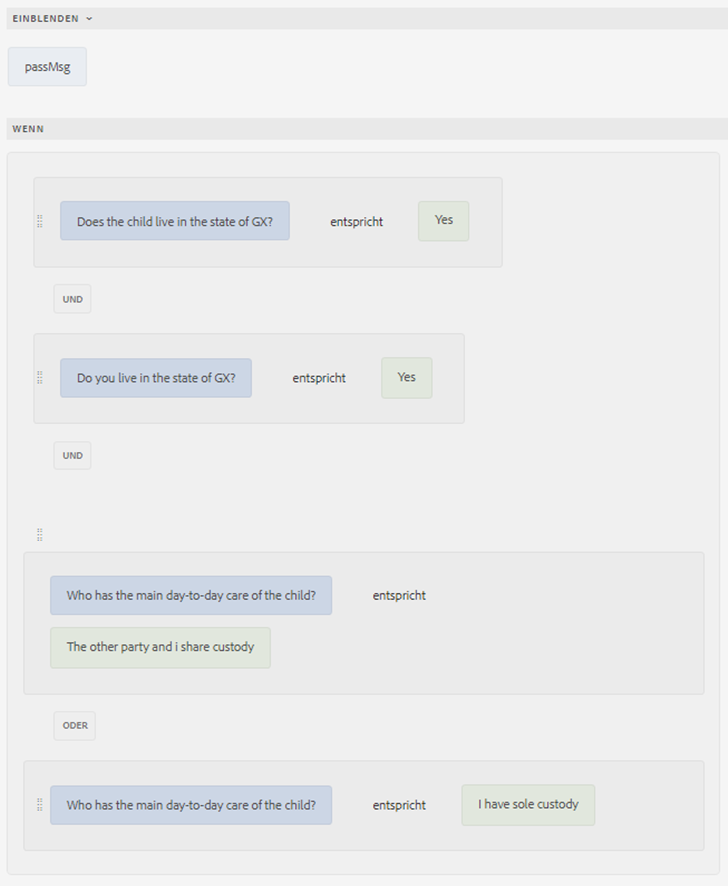

Sie können Bedingungen innerhalb einer Regel auch mittels Drag-and-Drop ziehen, um sie zu bearbeiten. Wählen Sie den Ziehgriff vor einer Bedingung aus und bewegen Sie den Mauszeiger über den Griff (). Sobald sich der Zeiger wie unten gezeigt in das Handsymbol verwandelt, ziehen Sie die Bedingung per Drag &amp; Drop an eine beliebige Stelle innerhalb der Regel. Die Regelstruktur ändert sich.


## Bedingungen für Datumsausdrücke {#dateexpression}

Im Regeleditor können Sie Datenvergleiche verwenden, um Bedingungen zu erstellen.

Nachfolgend ist eine Beispielbedingung dargestellt, die ein statisches Textobjekt anzeigt, wenn die Hypothek für das Haus bereits abgeschlossen ist, was der Benutzer durch Ausfüllen des Datumsfelds angibt.

Wenn das vom Benutzer eingetragene Datum der Hypothek in der Vergangenheit liegt, wird im adaptiven Formular ein Hinweis über die Einkommensberechnung angezeigt. Die folgende Regel vergleicht das Datum, das vom Benutzer eingetragen wurde, mit dem aktuellen Datum. Wenn dieses Datum vor dem aktuellen Datum liegt, zeigt das Formular die Textmeldung (mit der Bezeichnung „Einkommen“) an.

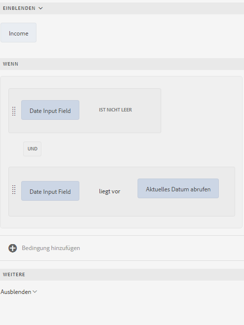

Wenn das eingetragene Datum vor dem aktuellen Datum liegt, zeigt das Formular die Textmeldung (Einkommen) an, wie hier dargestellt:


## Bedingungen für den Vergleich von Zahlen {#number-comparison-conditions}

Im Regeleditor können Sie Bedingungen erstellen, die zwei Zahlen vergleichen.

Nachfolgend ist eine Beispielbedingung dargestellt, die ein statisches Textobjekt anzeigt, wenn die Anzahl der Monate, die ein aktueller Benutzer schon an seiner gegenwärtigen Adresse wohnt, kleiner als 36 ist.


Wenn der Benutzer angibt, dass er seit weniger als 36 Monaten an seiner derzeitigen Adresse wohnt, wird im Formular ein Hinweis angezeigt, dass ein zusätzlicher Aufenthaltsnachweis erforderlich ist.


<!-- ## Impact of rule editor on existing scripts {#impact-of-rule-editor-on-existing-scripts}

In [!DNL Experience Manager Forms] versions prior to [!DNL Experience Manager 6.1 Forms] feature pack 1, form authors and developers used to write expressions in the Scripts tab of the Edit component dialog to add dynamic behavior to Adaptive Forms. The Scripts tab is now replaced by the rule editor.

Any scripts or expressions that you must have written in the Scripts tab are available in the rule editor. While you cannot view or edit them in visual editor, if you are a part of the forms-power-users group you can edit scripts in code editor. -->

## Beispielregeln {#example}

### Aufrufen des Formulardatenmodell-Service {#invoke}

Stellen Sie sich einen Webservice `GetInterestRates` vor, der den Darlehensbetrag, die Beschäftigungsdauer und die Kreditwürdigkeit des Antragstellers als Eingabe entgegennimmt und einen Darlehensplan einschließlich EMI-Betrag und Zinssatz zurückgibt. Sie erstellen ein Formulardatenmodell (FDM), indem Sie den Web-Dienst als Datenquelle verwenden. Sie fügen dem Formularmodell Datenmodellobjekte und einen `get`-Dienst hinzu. Der Dienst wird auf der Registerkarte „Dienste“ des Formulardatenmodells (FDM) angezeigt. Erstellen Sie dann ein adaptives Formular, das Felder aus Datenmodellobjekten enthält, um Benutzereingaben für Darlehensbetrag, Beschäftigungsdauer und Kreditwürdigkeit zu erfassen. Fügen Sie eine Schaltfläche hinzu, die den Webservice auslöst, um Plandetails abzurufen. Die Ausgabe wird in den entsprechenden Feldern befüllt.

Die folgende Regel zeigt, wie Sie die Aktion „Service aufrufen“ konfigurieren, um das Beispielszenario durchzuführen.


>[!NOTE]
>
>Wenn die Eingabe vom Typ „Array“ ist, sind die Felder, die Arrays unterstützen, im Dropdown-Abschnitt „Ausgabe“ sichtbar.

### Auslösen mehrerer Aktionen mithilfe einer Wenn-Regel {#triggering-multiple-actions-using-the-when-rule}

Sie möchten in einem Kreditantrag erfassen, ob dieser von einer Bestandskundin oder einem Bestandskunden gestellt wurde. Das Feld für die Kunden-ID soll basierend auf den von der Benutzerin bzw. dem Benutzer angegebenen Informationen angezeigt oder ausgeblendet werden. Darüber hinaus soll der Fokus auf das Feld für die Kunden-ID gelegt werden, wenn es sich um eine Bestandskundin oder einen Bestandskunden handelt. Der Kreditantrag umfasst die folgenden Komponenten:

* Ein Optionsfeld **[!UICONTROL Sind Sie bereits Geometrixx-Kunde?]**, das die Optionen [!UICONTROL Ja] und [!UICONTROL Nein] anbietet. Der Wert für „Ja“ ist **0**, und der Wert „Nein“ ist **1**.

* Das Textfeld **[!UICONTROL Geometrixx-Kunden-ID]** zur Angabe der Kunden-ID.

Wenn Sie eine Wenn-Regel für das Optionsfeld schreiben, um dieses Verhalten zu implementieren, wird die Regel wie folgt im visuellen Regeleditor angezeigt.


Regel im Visual Editor

In der Beispielregel ist die Anweisung im Abschnitt „Wenn“ die Bedingung. Wenn diese „True“ zurückgibt, werden die im Abschnitt „Dann“ angegebenen Aktionen ausgeführt.

<!-- The rule appears as follows in the code editor.

 

Rule in the code editor -->

### Verwenden einer Funktionsausgabe in einer Regel {#using-a-function-output-in-a-rule}

Ein Bestellformular enthält die folgende Tabelle, in der Benutzer ihre Bestellungen eingeben. In dieser Tabelle gilt:

* Die erste Zeile ist wiederholbar, sodass Benutzende mehrere Produkte bestellen und unterschiedliche Mengen angeben können. Ihr Elementname ist `Row1`.
* Der Titel der Zelle in der Spalte „Produktmenge“ der wiederholbaren Zeile lautet „Menge“. Der Elementname für diese Zelle lautet `productquantity`.
* Die zweite Zeile der Tabelle ist nicht wiederholbar, und der Titel der Zelle in der Spalte „Produktmenge“ in dieser Zeile lautet „Menge insgesamt“.


**A.** Zeile 1 **B.** Menge **C.** Menge insgesamt

Als Nächstes sollen die in der Spalte „Produktmenge“ angegebenen Mengen für alle Produkte addiert und die Summe in der Zelle „Menge insgesamt“ angezeigt werden. Dies erreichen Sie, indem Sie für die Zelle „Menge insgesamt“ wie nachfolgend gezeigt eine Regel vom Typ „Wert festlegen“ schreiben.


Regel im Visual Editor

<!-- he rule appears as follows in the code editor.


Rule in the code editor -->

### Validieren eines Feldwerts mithilfe eines Ausdrucks {#validating-a-field-value-using-expression}

Sie möchten verhindern, dass in dem Bestellformular aus dem vorigen Abschnitt Benutzer mehr als eine Einheit jedes beliebigen Produkts mit einem Preis über 10.000 bestellen. Um dies zu erreichen, können Sie wie unten gezeigt eine Validierungsregel schreiben.


Regel im Visual Editor

<!-- The rule appears as follows in the code editor.


Rule in the code editor -->
