# Regeleditor für adaptive Formulare{#adaptive-forms-rule-editor}

## Übersicht {#overview}

Die Regeleditorfunktion in Adobe Experience Manager Forms ermöglicht es Geschäftsbenutzern und Entwicklern, Regeln für adaptive Formularobjekte zu erstellen. Diese Regeln definieren Aktionen für Formularobjekte, die durch voreingestellte Bedingungen, Benutzereingaben und Benutzeraktionen im Formular ausgelöst werden. Dies ermöglicht noch größere Effizienz beim schnellen und korrekten Ausfüllen der Formulare.

Der Regeleditor bietet eine intuitive und einfache Oberfläche zum Entwickeln der Regeln. Der Regeleditor bietet einen visuellen Editor für alle Benutzer. Darüber hinaus bietet der Regeleditor einen Code-Editor, mit dem Regeln und Skripte geschrieben werden können. Zu den wichtigsten Aktionen, die Sie mithilfe von Regeln in adaptiven Formularobjekten ausführen können, gehören die folgenden:

* Ein Objekt ein- oder ausblenden
* Ein Objekt aktivieren oder deaktivieren
* Einen Wert für ein Objekt festlegen
* Den Wert eines Objekts validieren
* Funktionen zur Berechnung des Werts eines Objekts ausführen
* Rufen Sie einen Formular-Datenmodell-Service auf und führen Sie einen Vorgang aus
* Festlegen einer Eigenschaft eines Objekts

Der Regeleditor ersetzt die Skipterstellungs-Funktionen aus AEM 6.1 Forms und früheren Versionen. Ihre bereits vorhandenen Skripts werden allerdings im neuen Regeleditor beibehalten. Weitere Informationen zum Arbeiten mit vorhandenen Skripten im Regeleditor finden Sie unter [Auswirkungen des Regeleditors auf bereits vorhandene Skripte](../../forms/using/rule-editor.md#p-impact-of-rule-editor-on-existing-scripts-p).

Benutzer, die zur Gruppe der Formular-Hauptbenutzer hinzugefügt wurden, können neue Skripte erstellen und bestehende Skripte bearbeiten. Benutzer in der Gruppe der Formularbenutzer können die Skripte verwenden, aber keine Skripte erstellen oder bearbeiten.

## Grundlegendes zu Regeln {#understanding-a-rule}

Eine Regel ist eine Kombination von Aktionen und Bedingungen. Aktionen im Regeleditor sind Vorgänge wie Ausblenden, Anzeigen, Aktivieren, Deaktivieren oder Berechnen des Werts eines Objekts in einem Formular. Bedingungen sind boolesche Ausdrücke, die durch Prüfungen und Operationen für Status, Wert oder Eigenschaft eines Formularobjekts ausgewertet werden. Aktionen werden basierend auf dem bei der Auswertung einer Bedingung zurückgegebenen Wert (`True` oder `False`) ausgeführt.

Im Regeleditor steht eine Reihe vordefinierter Regeltypen zur Verfügung, z. B. Wenn, Anzeigen, Ausblenden, Aktivieren, Deaktivieren, Wert einstellen und Validieren, um Ihnen die Erstellung von Regeln zu erleichtern. Jeder Regeltyp ermöglicht es Ihnen, Bedingungen und Aktionen einer Regel zu definieren. In diesem Dokument sind die einzelnen Regeltypen im Detail beschrieben.

Eine Regel folgt normalerweise einem der folgenden Konstrukte:

**Bedingung-Aktion** In diesem Konstrukt definiert die Regel zuerst eine Bedingung und dann die auszulösende Aktion. Dieses Konstrukt ist mit einer if-then-Anweisung in Programmiersprachen vergleichbar.

Im Regeleditor wird das Bedingung-Aktion-Konstrukt durch den Regeltyp **Wenn** durchgesetzt.

**Aktion-Bedingung** In diesem Konstrukt definiert die Regel zuerst eine auszulösende Aktion und dann die auszuwertenden Bedingungen. Eine weitere Variante dieses Konstrukts ist Aktion-Bedingung-alternative Aktion, wobei auch dann eine alternative Aktion angegeben wird, die ausgelöst wird, wenn die Bedingung den Wert „False“ zurückgibt.

Die Regeltypen „Anzeigen“, „Ausblenden“, „Aktivieren“, „Deaktivieren“, „Wert festlegen“ und „Validieren“ im Regeleditor setzen das Aktion-Bedingung-Regelkonstrukt um. Die alternative Aktion für „Anzeigen“ ist standardmäßig „Ausblenden“, für „Aktivieren“ ist es „Deaktivieren“ und umgekehrt. Sie können die standardmäßige alternative Aktion nicht ändern.

>[!NOTE]
>
>Die verfügbaren Regeltypen, einschließlich der Bedingungen und Aktionen, die Sie im Regeleditor definieren, sind außerdem vom Typ des Formularobjekts abhängig, für das Sie die Regel erstellen. Im Regeleditor werden nur die zum Erstellen von Bedingungs- und Aktionsanweisungen für den jeweiligen Formularobjekttyp gültigen Regeltypen und Optionen angezeigt. So werden für ein Bereichsobjekt beispielsweise keine Regeln vom Typ „Validieren“, „Wert festlegen“ oder „Deaktivieren“ angezeigt.

Weitere Informationen über die im Regeleditor verfügbaren Regeltypen finden Sie unter [Verfügbare Regeltypen im Regeleditor](../../forms/using/rule-editor.md#p-available-rule-types-in-rule-editor-p).

### Richtlinien für die Auswahl eines Regelkonstrukts {#guidelines-for-choosing-a-rule-construct}

Für die meisten Anwendungsfälle können Sie ein beliebiges Regelkonstrukt verwenden. Nachfolgend finden Sie jedoch einige Richtlinien für die Wahl des am besten geeigneten Konstrukts für Ihre Zwecke. Weitere Informationen über die verfügbaren Regeln im Regeleditor finden Sie unter [Verfügbare Regeltypen im Regeleditor](../../forms/using/rule-editor.md#p-available-rule-types-in-rule-editor-p).

* Als Faustregel zum Erstellen von Regeln ist es typischerweise sinnvoll, sie im Kontext des Objekts zu betrachten, für das die Regel erstellt werden soll. Angenommen, das Feld B soll in Abhängigkeit von einem Wert, den der Benutzer in Feld A eingibt, ein- oder ausgeblendet werden. In diesem Fall wird eine Bedingung für Feld A ausgewertet und basierend auf dem zurückgegebenen Wert eine Aktion für Feld B ausgelöst.

   Daher gilt: Wenn Sie eine Regel für Feld B (das Objekt, für das eine Bedingung ausgewertet wird), verwenden Sie das Konstrukt „Bedingung-Aktion“ oder den Regeltyp „Wenn“. Für Feld A müssten Sie dementsprechend das Konstrukt „Aktion-Bedingung“ oder den Regeltyp „Anzeigen“ oder „Ausblenden“ verwenden.

* In manchen Fällen müssen Sie mehrere Aktionen für dieselbe Bedingung ausführen. In solchen Fällen empfiehlt es sich, das Konstrukt „Bedingung-Aktion“ zu verwenden. In diesem Konstrukt können Sie eine Bedingung einmal auswerten und mehrere Aktionsanweisungen angeben.

   Um beispielsweise die Felder B, C und D basierend auf einer Bedingung auszublenden, die den vom Benutzer im Feld A angegebenen Wert auswertet, genügt eine Regel mit dem Konstrukt „Bedingung-Aktion“ oder dem Regeltyp „Wenn“ für Feld A, wobei Aktionen für die Sichtbarkeit der Felder B, C und D angegeben werden. Andernfalls benötigen Sie drei separate Regeln für die Felder B, C und D, wobei jede Regel die Bedingung prüft und das jeweilige Feld anzeigt oder ausblendet. In diesem Beispiel ist die Erstellung einer Wenn-Regel für ein Objekt effizienter als die Erstellung von Regeln zum Anzeigen und Ausblenden für drei Objekte.

* Um eine Aktion in Abhängigkeit von mehreren Bedingungen auszulösen, empfiehlt es sich, das Konstrukt „Aktion-Bedingung“ zu verwenden. Um beispielsweise Feld A nach Auswertung der Bedingungen für die Felder B, C und D anzuzeigen oder auszublenden, verwenden Sie Regeln des Typs „Anzeigen“ oder „Ausblenden“ für Feld A.
* Für Regeln, die genau eine Aktion für eine Bedingung enthalten, können Sie sowohl Bedingung-Aktion- als auch Aktion-Bedingung-Konstrukte verwenden.
* Für Regeln, bei denen eine Bedingung geprüft und sofort nach Eingabe eines Werts in ein Feld oder beim Verlassen des Felds eine Aktion ausgeführt wird, empfehlen wir, das Konstrukt „Bedingung-Aktion“ oder den Wenn-Regeltyp für das Feld zu verwenden, für das die Bedingung geprüft wird.
* Die Bedingung in der Wenn-Regel wird ausgewertet, wenn ein Benutzer den Wert des Objekts ändert, auf das die Wenn-Regel angewendet wird. Soll die Aktion jedoch bei einer serverseitigen Änderung des Wert ausgelöst werden, etwa bei voreingestellten Werten, empfehlen wir, eine Wenn-Regel zu erstellen, die die Aktion beim Initialisieren des Felds auslöst.
* Beim Schreiben von Regeln für Dropdown-Elemente, Optionsfelder oder Kontrollkästchenobjekte werden die Optionen oder Werte dieser Formularobjekte im Formular im Regeleditor vorbefüllt.

## Verfügbare Typen von Operatoren und Ereignissen im Regeleditor {#available-operator-types-and-events-in-rule-editor}

Der Regeleditor bietet die folgenden logischen Operatoren und Ereignisse, mit deren Hilfe Sie Regeln erstellen können.

* **Ist gleich**
* **Ist nicht gleich**
* **Beginnt mit**
* **Endet mit**
* **Enthält**
* **Ist leer**
* **Ist nicht leer**
* **Hat ausgewählt:** Gibt „true“ zurück, wenn der Benutzer eine bestimmte Option für ein Kontrollkästchen, ein Dropdown-Element oder ein Optionsfeld auswählt.
* **Ist initialisiert (Ereignis):** Gibt „true“ zurück, wenn ein Formularobjekt im Browser dargestellt wird.
* **Wird geändert (Ereignis):** Gibt „true“ zurück, wenn der Benutzer den eingegebenen Wert oder die ausgewählte Option für ein Formularobjekt ändert.

## Verfügbare Typen von Regeln im Regeleditor {#available-rule-types-in-rule-editor}

Im Regeleditor steht eine Reihe vordefinierter Regeltypen zur Verfügung, die Sie verwenden können, um Regeln zu erstellen. Im Folgenden werden die einzelnen Regeltypen im Detail beschrieben. Weitere Informationen zum Erstellen von Regeln im Regeleditor finden Sie unter [Regeln schreiben](../../forms/using/rule-editor.md#p-write-rules-p).

### Wenn {#whenruletype}

Der **Wenn**-Regeltyp nutzt das Konstrukt **Bedingung-Aktion-Alternative Aktion**, in manchen Fällen auch nur das Konstrukt **Bedingung-Aktion**. Für diesen Regeltyp geben Sie zunächst eine auszuwertende Bedingung an und dann eine Aktion, die ausgelöst werden soll, wenn die Bedingung erfüllt ist (`True`). Bei Einsatz der Wenn-Regel können Sie mehrere UND- und ODER-Operatoren verwenden, um [verschachtelte Ausdrücke](#nestedexpressions) zu erstellen.

Mit dem Wenn-Regeltyp können Sie eine Bedingung für ein Formularobjekt auswerten und Aktionen für ein oder mehrere Objekte ausführen.

Einfach ausgedrückt: Eine typische Wenn-Regel ist wie folgt aufgebaut:

`When on Object A:`

`(Condition 1 AND Condition 2 OR Condition 3) is TRUE;`

`Then, do the following:`

Aktion 2 auf Objekt B anwenden;
UND
Aktion 3 auf Objekt C anwenden;

_

Beim Erstellen einer Regel für Komponenten mit mehreren Werten (z. B. Optionsfelder oder Listen) werden die Optionen automatisch abgerufen und dem Regelersteller zur Verfügung gestellt. Sie müssen die Optionswerte nicht erneut eingeben.

Eine Liste könnte beispielsweise vier Optionen enthalten: Rot, Blau, Grün und Gelb. Beim Erstellen der Regel werden die Optionen (Optionsfelder) automatisch abgerufen und dem Regelersteller wie folgt zur Verfügung gestellt:

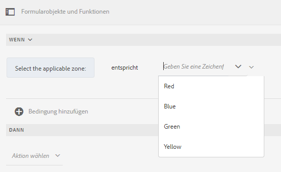

Beim Schreiben der Wenn-Regel können Sie die Aktion „Wert löschen von“ auslösen. Die Aktion „Wert löschen von“ löscht den Wert des angegebenen Objekts. Mit „Wert löschen von“ als Option in der Wenn-Anweisung können Sie komplexe Bedingungen mit mehreren Feldern erstellen.

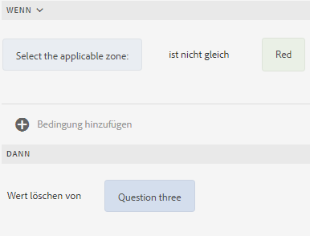

**Ausblenden**: Blendet das angegebene Objekt aus.

**Anzeigen**: Blendet das angegebene Objekt ein.

**Aktivieren**: Aktiviert das angegebene Objekt.

**Deaktivieren**: Deaktiviert das angegebene Objekt.

**Service aufrufen** Ruft einen Service auf, der in einem Formulardatenmodell konfiguriert ist. Wenn Sie den Vorgang „Service aufrufen“ wählen, wird ein Feld angezeigt. Beim Antippen des Feldes zeigt es alle in allen Formulardatenmodellen konfigurierten Dienste auf Ihrer AEM-Instanz an. Bei der Auswahl eines Formulardatenmodell-Diensts erscheinen zusätzliche Felder, in denen Sie Formularobjekte mit Ein- und Ausgabeparametern für den angegebenen dienst zuordnen können. Siehe Beispielregel für den Aufruf von Formulardatenmodell-Services.

Zusätzlich zum Formulardatenmodelldienst können Sie eine direkte WSDL-URL angeben, um einen Web-Dienst aufzurufen. Ein Formulardatenmodelldienst hat jedoch viele Vorteile und den empfohlenen Ansatz, einen Dienst aufzurufen.

Weitere Informationen zum Konfigurieren von Services im Formulardatenmodell finden Sie unter [Datenintegration für AEM Forms](/help/forms/using/data-integration.md).

**Wert festlegen**: Berechnet den Wert des angegebenen Objekts und legt ihn fest. Als Objektwert können Sie eine Zeichenfolge, den Wert eines anderen Objekts, den mithilfe eines mathematischem Ausdrucks oder einer Funktion berechneten Wert oder den Wert einer Eigenschaft eines Objekts oder den Ausgabewert von einem konfigurierten Formulardatenmodell-Service festlegen. Wenn Sie die Option „Webservice“ wählen, werden alle in allen Formulardatenmodellen konfigurierten Services auf Ihrer AEM-Instanz angezeigt. Bei der Auswahl eines Formulardatenmodell-Service erscheinen zusätzliche Felder, in denen Sie Formularobjekte mit Ein- und Ausgabeparametern für den angegebenen Service zuordnen können.

Weitere Informationen zum Konfigurieren von Services im Formulardatenmodell finden Sie unter [Datenintegration für AEM Forms](/help/forms/using/data-integration.md).

Mit dem Regeltyp **Eigenschaft festlegen** können Sie den Wert einer Eigenschaft des angegebenen Objekts basierend auf einer Bedingungsaktion festlegen.

Damit können Sie Regeln definieren, um Kontrollkästchen dynamisch zum adaptiven Formular hinzuzufügen. Sie können benutzerdefinierte Funktionen, Formularobjekte oder eine Objekteigenschaft verwenden, um eine Regel zu definieren.

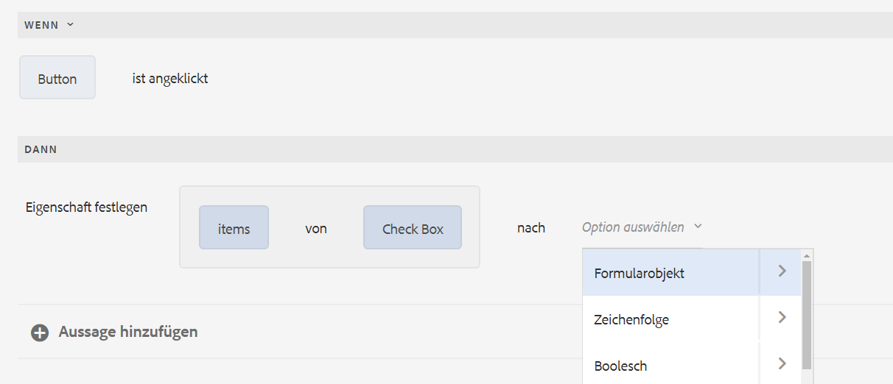

Um eine Regel basierend auf einer benutzerdefinierten Funktion zu definieren, wählen Sie **Funktionsausgabe** in der Dropdown-Liste aus und ziehen Sie eine benutzerdefinierte Funktion mittels Drag-and-Drop aus der Registerkarte **Funktionen**. Wenn die Bedingungsaktion erfüllt ist, wird die Anzahl der in der benutzerdefinierten Funktion definierten Kontrollkästchen dem adaptiven Formular hinzugefügt.

Um eine auf einem Formularobjekt basierende Regel zu definieren, wählen Sie **Formularobjekt** in der Dropdown-Liste aus und ziehen Sie ein Formularobjekt mittels Drag-and-Drop aus der Registerkarte **Formularobjekte**. Wenn die Bedingungsaktion erfüllt ist, wird die Anzahl der im Formularobjekt definierten Kontrollkästchen dem adaptiven Formular hinzugefügt.

Mit einer Regel vom Typ „Eigenschaft festlegen“, die auf einer Objekteigenschaft basiert, können Sie die Anzahl der Kontrollkästchen in einem adaptiven Formular auf der Grundlage einer anderen Objekteigenschaft hinzufügen, die im adaptiven Formular enthalten ist.

Die folgende Abbildung zeigt ein Beispiel für das dynamische Hinzufügen von Kontrollkästchen auf der Grundlage der Anzahl der Dropdown-Listen im adaptiven Formular:

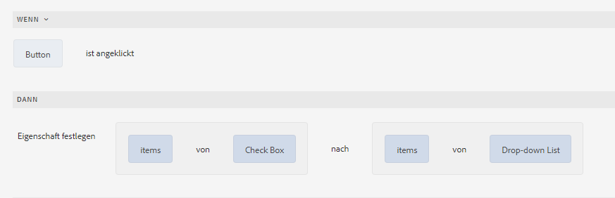

**Wert löschen von**: Löscht den Wert des angegebenen Objekts.

**Fokus festlegen**: Legt den Fokus auf das angegebene Objekt.

**Formular speichern**: Speichert das Formular.

**Formulare senden**: Sendet das Formular.

**Formular zurücksetzen**: Setzt das Formular zurück.

**Formular validieren**: Überprüft das Formular.

**Instanz hinzufügen**: Fügt eine Instanz des angegebenen wiederholbaren Bereichs oder der Tabellenzeile hinzu.

**Instanz entfernen**: Entfernt eine Instanz des angegebenen wiederholbaren Bereichs oder der Tabellenzeile.

**Navigieren zu**: Navigiert zu anderen adaptiven Formularen, anderen Assets (wie Bildern oder Dokument-Fragmenten) oder zu einer externen URL. Weitere Informationen finden Sie unter [Hinzufügen einer Schaltfläche zur interaktiven Kommunikation](../../forms/using/create-interactive-communication.md#addbuttontothewebchannel).

### Wert festlegen {#set-value-of}

Regeln vom Typ **[!UICONTROL Wert festlegen]** ermöglichen es, den Wert eines Formularobjekts abhängig davon festzulegen, ob die angegebene Bedingung erfüllt ist oder nicht. Als Wert kann der Wert eines anderen Objekts, ein Literal-String, ein aus einem mathematischen Ausdruck oder einer Funktion abgeleiteter Wert oder der Wert einer Eigenschaft eines anderen Objekts oder die Ausgabe eines Formulardatenmodelldiensts sein. In ähnlicher Weise können Sie auf eine Bedingung bei Komponenten, Zeichenfolgen, Eigenschaften oder Werten prüfen, die von Funktionen oder mathematischen Ausdrücken abgeleitet wurden.

Der Regeltyp „Wert einstellen“ steht für manche Formularobjekte nicht zur Verfügung, etwa für Bereiche und Schaltflächen der Symbolleiste. Eine standardmäßige Regel vom Typ „Wert festlegen“ hat die folgende Struktur:


Wert von Objekt A festlegen auf:

(Zeichenfolge ABC) ODER
(Objekteigenschaft X von Objekt C) ODER
(Wert aus einer Funktion) ODER
(Wert aus einem mathematischen Ausdruck) ODER
(Ausgabewert von einem Datenmodell-Service oder Webservice);

Wenn (optional):

(Bedingung 1 UND Bedingung 2 UND Bedingung 3) TRUE zurückgibt;


Im folgenden Beispiel wird der Wert im Feld `dependentid` als Eingabe genommen und der Wert des Feldes `Relation` auf die Ausgabe des Arguments `Relation` des Formulardatenmodell-Service `getDependent` festgelegt.

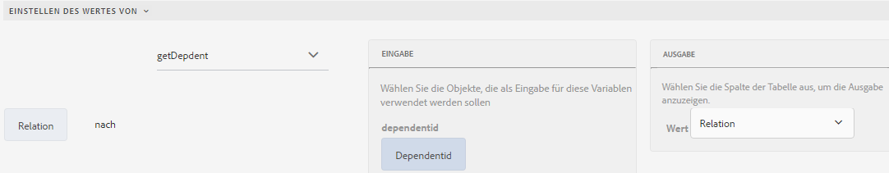

Beispiel, wie die Regel „Wert festlegen“ den Formulardatenmodelldienst verwendet

>[!NOTE]
>
>Darüber hinaus können Sie mit „Wert festlegen von“ alle Werte in einer Dropdown-Listenkomponente aus der Ausgabe eines Formulardatenmodelldienstes oder eines Web-Dienstes befüllen. Stellen Sie jedoch sicher, dass das von Ihnen gewählte Ausgabeargument vom Typ „Array“ ist. Alle Werte, die in einem Array zurückgegeben werden, stehen in der angegebenen Dropdown-Liste zur Verfügung.

### Anzeigen {#show}

Mithilfe des Regeltyps **Anzeigen** können Sie eine Regel schreiben, die ein Formularobjekt je nachdem, ob eine Bedingung erfüllt ist oder nicht, anzeigt oder ausblendet. Der Regeltyp „Anzeigen“ löst auch die Aktion „Ausblenden“ aus, falls die Bedingung nicht erfüllt ist oder `False` zurückgibt.

Eine typische Regel vom Typ „Anzeigen“ ist wie folgt strukturiert:


`Show Object A;`

`When:`

`(Condition 1 OR Condition 2 OR Condition 3) is TRUE;`

`Else:`

`Hide Object A;`


### Ausblenden {#hide}

Regeln vom Typ **Ausblenden** können ähnlich wie Regeln vom Typ „Anzeigen“ dazu verwendet werden, Formularobjekte je nachdem, ob eine Bedingung erfüllt ist oder nicht, anzuzeigen oder auszublenden. Der Regeltyp „Ausblenden“ löst auch die Aktion „Anzeigen“ aus, falls die Bedingung nicht erfüllt ist oder `False` zurückgibt.

Eine typische Regel vom Typ „Ausblenden“ ist wie folgt strukturiert:


`Hide Object A;`

`When:`

`(Condition 1 AND Condition 2 AND Condition 3) is TRUE;`

`Else:`

`Show Object A;`


### Aktivieren {#enable}

Mithilfe des Regeltyps **Aktivieren** können Sie ein Formularobjekt in Abhängigkeit davon aktivieren oder deaktivieren, ob eine Bedingung erfüllt ist oder nicht. Der Regeltyp „Aktivieren“ löst auch die Aktion „Deaktivieren“ aus, falls die Bedingung nicht erfüllt ist oder `False` zurückgibt.

Eine typische Regel vom Typ „Aktivieren“ ist wie folgt strukturiert:


`Enable Object A;`

`When:`

`(Condition 1 AND Condition 2 AND Condition 3) is TRUE;`

`Else:`

`Disable Object A;`


### Deaktivieren {#disable}

Regeln vom Typ **Deaktivieren** können ähnlich wie Regeln vom Typ „Aktivieren“ dazu verwendet werden, Formularobjekte in Abhängigkeit davon, ob eine Bedingung erfüllt ist oder nicht, zu aktivieren oder zu deaktivieren. Der Regeltyp „Deaktivieren“ löst auch die Aktion „Aktivieren“ aus, falls die Bedingung nicht erfüllt ist oder `False` zurückgibt.

Eine typische Regel vom Typ „Deaktivieren“ ist wie folgt strukturiert:


`Disable Object A;`

`When:`

`(Condition 1 OR Condition 2 OR Condition 3) is TRUE;`

`Else:`

`Enable Object A;`

### Validieren {#validate}

Regeln vom Typ **Validieren** überprüfen den Wert in einem Feld mithilfe eines Ausdrucks. So können Sie beispielsweise einen Ausdruck erstellen, der ein Textfeld zur Eingabe eines Namens daraufhin überprüft, dass dort keine Sonderzeichen oder Zahlen eingegeben wurden.

Eine typische Regel vom Typ „Validieren“ ist wie folgt strukturiert:

`Validate Object A;`

`Using:`

`(Expression 1 AND Expression 2 AND Expression 3) is TRUE;`

>[!NOTE]
>
>Wenn der angegebene Wert nicht der Validierungsregel entspricht, können Sie eine Validierungsmeldung für den Benutzer anzeigen lassen. Sie können die Meldung im Feld **[!UICONTROL Skriptüberprüfungsmeldung]** in den Komponenteneigenschaften in der Seitenleiste angeben.

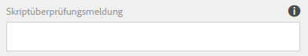

### Optionen festlegen {#setoptionsof}

Mit dem Regeltyp **Optionen festlegen von** können Sie Regeln definieren, um Kontrollkästchen dynamisch zum adaptiven Formular hinzuzufügen. Sie können ein Formulardatenmodell oder eine benutzerdefinierte Funktion verwenden, um die Regel zu definieren.

Um eine Regel basierend auf einer benutzerdefinierten Funktion zu definieren, wählen Sie **Funktionsausgabe** in der Dropdown-Liste aus und ziehen Sie eine benutzerdefinierte Funktion mittels Drag-and-Drop aus der Registerkarte **Funktionen**. Die in der benutzerdefinierten Funktion definierte Anzahl von Kontrollkästchen wird dem adaptiven Formular hinzugefügt.

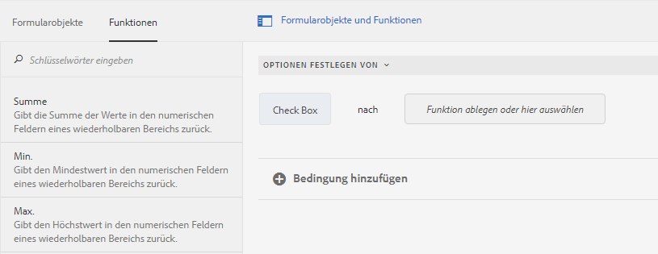

Informationen über das Erstellen einer benutzerdefinierten Funktion finden Sie unter [Benutzerdefinierte Funktionen im Regeleditor](#custom-functions).

So definieren Sie eine auf einem Formulardatenmodell basierende Regel:

1. Wählen Sie **Service-Ausgabe** in der Dropdown-Liste aus.
1. Wählen Sie das Datenmodellobjekt aus.
1. Wählen Sie in der Dropdown-Liste **Wert anzeigen** eine Datenmodell-Objekteigenschaft aus. Die Anzahl der Kontrollkästchen im adaptiven Formular wird von der Anzahl der Instanzen abgeleitet, die für diese Eigenschaft in der Datenbank definiert wurden.
1. Wählen Sie in der Dropdown-Liste **Wert speichern** eine Datenmodell-Objekteigenschaft.

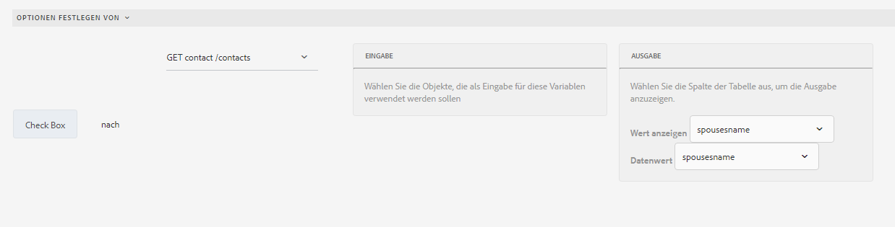

## Grundlegendes zur Benutzeroberfläche des Regeleditors {#understanding-the-rule-editor-user-interface}

Der Regeleditor bietet eine umfangreiche und dennoch einfache Benutzeroberfläche zum Erstellen und Verwalten von Regeln. Sie können die Benutzeroberfläche des Regeleditors im Autorenmodus von einem adaptiven Formular aus aufrufen.

So starten Sie die Benutzeroberfläche des Regeleditors:

1. Öffnen Sie ein adaptives Formular im Autorenmodus.
1. Tippen Sie auf das Formularobjekt, für das Sie eine Regel erstellen möchten, und tippen Sie in der Symbolleiste „Komponente“ auf . Die Benutzeroberfläche des Regeleditors wird angezeigt.

   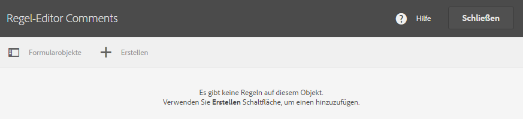

   Alle vorhandenen Regeln für die ausgewählten Formularobjekte sind in dieser Ansicht aufgelistet. Weitere Informationen zum Verwalten vorhandener Regeln finden Sie unter [Verwalten von Regeln](../../forms/using/rule-editor.md#p-manage-rules-p).

1. Tippen Sie auf **[!UICONTROL Erstellen]**, um eine neue Regel zu erstellen. Wenn Sie den Regeleditor zum ersten Mal starten, wird standardmäßig der Visual Editor der Regeleditor-Benutzeroberfläche geöffnet.

   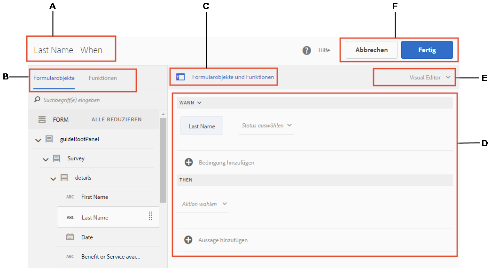

Nachfolgend werden die einzelnen Komponenten der Benutzeroberfläche des Regeleditors im Detail beschrieben.

### A. Ansicht „Komponente und Regel“ {#a-component-rule-display}

Zeigt den Titel des adaptiven Formularobjekts, über das Sie den Regeleditor aufgerufen haben, sowie den momentan ausgewählten Regeltyp an. Im oben gezeigten Beispiel wurde der Regeleditor über ein adaptives Formularobjekt namens „Salary“ gestartet und der Wenn-Regeltyp ist ausgewählt.

### B. Formularobjekte und Funktionen {#b-form-objects-and-functions-br}

Im linken Bereich der Benutzeroberfläche des Regeleditors stehen zwei Registerkarten zur Verfügung: **[!UICONTROL Formularobjekte]** und **[!UICONTROL Funktionen]**.

Die Registerkarte „Formularobjekte“ zeigt eine hierarchische Ansicht aller Objekte, die im adaptiven Formular enthalten sind. Angezeigt werden Titel und Typ der Objekte. Wenn Sie eine Regel erstellen, können Sie Formularobjekte in den Regeleditor ziehen und dort ablegen. Wenn Sie beim Erstellen oder Bearbeiten einer Regel ein Objekt oder eine Funktion in einen Platzhalter ziehen, übernimmt dieser Platzhalter automatisch den entsprechenden Wertetyp.

Die Formularobjekte, auf die eine oder mehrere gültige Regeln angewendet wurden, sind mit einem grünen Punkt markiert. Wenn eine der auf ein Formularobjekt angewendeten Regeln ungültig ist, ist das Formularobjekt mit einem gelben Punkt markiert.

Die Registerkarte „Funktionen“ enthält eine Reihe integrierter Funktionen (z. B. „Summe von“, „Minimum von“, „Maximum von“, „Durchschnitt von“, „Anzahl von“ und „Formular validieren“). Sie können diese Funktionen verwenden, um Werte in wiederholbaren Bereichen und Tabellenzeilen zu berechnen und sie beim Erstellen von Regeln in den Aktions- und Bedingungsanweisungen zu verwenden. Sie können jedoch auch [benutzerdefinierte Funktionen](#custom-functions) erstellen.

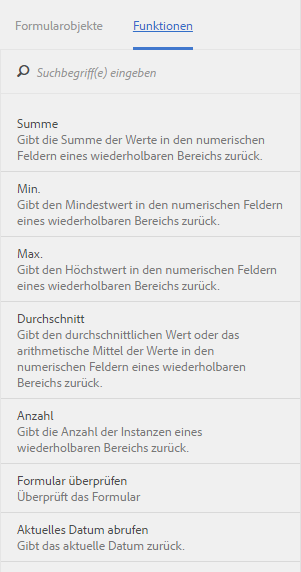

>[!NOTE]
>
>Sie können auf den Registerkarten „Formularobjekte“ und „Funktionen“ eine Textsuche nach den Namen und Titeln von Objekten und Funktionen durchführen.

In der Strukturansicht auf der linken Seite können Sie durch Tippen auf die darin enthaltenen Formularobjekte die Regeln anzeigen, die auf das jeweilige Objekt angewendet wurden. Sie können durch die Regeln der verschiedenen Formularobjekte navigieren und darüber hinaus Regeln zwischen Formularobjekten kopieren und einfügen. Weitere Informationen finden Sie unter [Regeln kopieren und einfügen](../../forms/using/rule-editor.md#p-copy-paste-rules-p).

### C. Umschalten zwischen Formularobjekten und Funktionen {#c-form-objects-and-functions-toggle-br}

Durch Tippen auf die Schaltfläche schalten Sie zwischen den Bereichen für Formularobjekte und Funktionen um.

### D. Visueller Regeleditor {#d-visual-rule-editor}

Der visuelle Regeleditor ist im visuellen Editormodus der Regeleditor-Benutzeroberfläche der Bereich, in dem Sie Regeln erstellen. Sie können hier einen Regeltyp wählen und die entsprechenden Bedingungen und Aktionen definieren. Beim Definieren von Bedingungen und Aktionen in einer Regel können Sie Formularobjekte und Funktionen aus dem Bereich „Formularobjekte und Funktionen“ ziehen und ablegen.

Weitere Informationen zur Verwendung des visuellen Regeleditors finden Sie unter [Regeln schreiben](../../forms/using/rule-editor.md#p-write-rules-p).

### E. Umschalter zwischen Visual Editor und Codeeditor {#e-visual-code-editors-switcher}

Benutzer können in der Gruppe der Formular-Hauptbenutzer auf den Code-Editor zugreifen. Bei anderen Benutzern ist der Code-Editor nicht verfügbar. Mithilfe des Umschalters rechts oberhalb des Regeleditors können Sie zwischen Visual Editor- und Codeeditormodus für den Regeleditor wechseln, wenn Sie dazu berechtigt sind. Wenn Sie den Regeleditor zum ersten Mal starten, wird er im Visual Editor-Modus geöffnet. Sie können Regeln im Visual Editor-Modus erstellen oder in den Codeeditormodus wechseln, um ein Regelskript zu schreiben. Wenn Sie eine Regel im Codeeditor ändern oder schreiben, ist es jedoch nicht möglich, für diese Regel zum Visual Editor zurückzuschalten, es sei denn, Sie löschen den Inhalt des Codeeditors.

AEM Forms zeichnet den zuletzt von Ihnen zum Erstellen einer Regel verwendeten Modus des Regeleditors auf. Wenn Sie den Regeleditor das nächste Mal starten, wird er in diesem Modus geöffnet. Sie können jedoch auch einen Standardmodus konfigurieren, sodass der Regeleditor immer in diesem Modus geöffnet wird. Gehen Sie dazu wie folgt vor:

1. Wechseln Sie zur AEM-Web-Konsole unter `https://[host]:[port]/system/console/configMgr`.
1. Zum Bearbeiten klicken Sie auf **[!UICONTROL Konfiguration von adaptiven Formularen und Web-Kanälen für interaktive Kommunikation]**.
1. Wählen Sie **[!UICONTROL Visual Editor]** oder **[!UICONTROL Codeeditor]** aus der Dropdownliste für den **[!UICONTROL Standardmodus für den Regeleditor]**.

1. Klicken Sie auf **[!UICONTROL Speichern]**.

### F. Schaltflächen „Fertig“ und „Abbrechen“ {#f-done-and-cancel-buttons}

Die Schaltfläche **[!UICONTROL Fertig]** wird verwendet, um eine Regel zu speichern. Sie können eine unvollständige Regel speichern. Unvollständige Regeln sind allerdings ungültig und werden nicht ausgeführt. Eine Liste mit gespeicherten Regeln für ein Formularobjekt wird angezeigt, wenn Sie den Regeleditor das nächste Mal aus demselben Formularobjekt starten. Sie können bestehende Regeln in dieser Ansicht verwalten. Weitere Informationen hierzu finden Sie unter[ Regeln verwalten](../../forms/using/rule-editor.md#p-manage-rules-p).

Über die Schaltfläche **[!UICONTROL Abbrechen]** verwerfen Sie alle Änderungen, die Sie an einer Regel vorgenommen haben, und der Regeleditor wird geschlossen.

## Regeln schreiben {#write-rules}

Zum Schreiben von Regeln können Sie den visuellen Regeleditor oder den Codeeditor verwenden. Wenn Sie den Regeleditor zum ersten Mal starten, wird er im Visual Editor-Modus geöffnet. Sie können zum Code-Editormodus wechseln und Regeln schreiben. Wenn Sie eine Regel im Codeeditor schreiben oder ändern, ist es jedoch nicht möglich, für diese Regel zum Visual Editor zu wechseln, es sei denn, Sie löschen den Inhalt des Codeeditors. Wenn Sie den Regeleditor das nächste Mal starten, wird er im zuletzt zum Erstellen von Regeln verwendeten Modus geöffnet.

Im Folgenden wird zunächst das Schreiben von Regeln im Visual Editor beschrieben.

### Verwenden des Visual Editor {#using-visual-editor}

Anhand des folgenden Beispielformulars soll das Erstellen von Regeln im visuellen Editor verständlich gemacht werden.


Im Abschnitt für die Kreditvoraussetzungen in diesem Beispielformular für einen Kreditantrag müssen die Antragsteller ihren Familienstand, ihr Gehalt und, falls verheiratet, das Gehalt des Partners/der Partnerin angeben. Die Regel berechnet basierend auf den Eingaben der Benutzer den Kreditanspruchsbetrag und zeigt das Feld für den Kreditanspruch an. Wenden Sie die folgenden Regeln an, um dieses Szenario zu implementieren:

* Das Gehaltsfeld des Partners/der Partnerin wird nur angezeigt, wenn als Familienstand „Verheiratet“ angegeben wurde.
* Der Kreditanspruchsbetrag ist 50 % des Gesamtgehalts.

Führen Sie die folgenden Schritte aus, um die Regeln zu schreiben:

1. Schreiben Sie zuerst die Regel, mit der die Sichtbarkeit des Felds „Gehalt des Partners“ entsprechend der vom Benutzer über das Optionsfeld „Familienstand“ gewählten Option gesteuert wird.

   Öffnen Sie das Kreditantragsformular im Autorenmodus. Tippen Sie auf die Komponente **Familienstand** und dann auf . Tippen Sie als Nächstes auf **[!UICONTROL Erstellen]**, um den Regeleditor zu starten.

   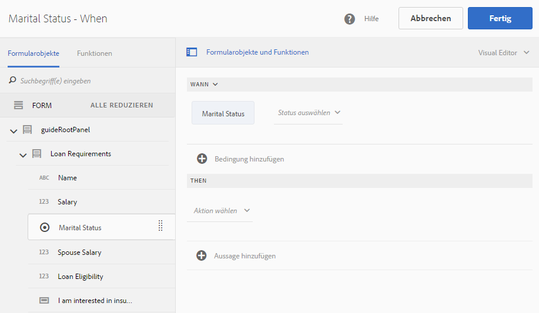

   Wenn Sie den Regeleditor starten, ist standardmäßig die Wenn-Regel ausgewählt. Darüber hinaus wird das Formularobjekt (in diesem Fall „Familienstand“), von dem aus Sie den Regeleditor gestartet haben, in der Wenn-Anweisung angegeben.

   Sie können zwar das ausgewählte Objekt nicht bearbeiten oder ändern, es ist jedoch möglich, über die Dropdown-Liste für Regeln einen anderen Regeltyp wählen (siehe unten). Wenn Sie eine Regel für ein anderes Objekt erstellen möchten, tippen Sie auf „Abbrechen“, um den Regeleditor zu beenden, und starten Sie ihn erneut über das gewünschte Formularobjekt.

1. Tippen Sie auf die Dropdown-Liste **[!UICONTROL Status auswählen]** und wählen Sie **[!UICONTROL Ist gleich]** aus. Das Feld **[!UICONTROL Eine Zeichenfolge eingeben]** wird angezeigt.

   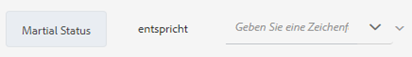

   In dem Optionsfeld „Familienstand“ werden den Optionen **Verheiratet** und **Ledig** die Werte **0** bzw. **1** zugewiesen. Sie können die zugewiesenen Werte auf der Registerkarte „Titel“ des Dialogfelds zum Bearbeiten des Optionsfelds überprüfen, wie unten gezeigt.

   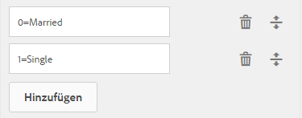

1. Geben Sie in der Regel im Feld **Eine Zeichenfolge eingeben** den Wert **0** an.

   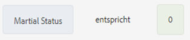

   Sie haben die Bedingung als `When Marital Status is equal to Married` definiert. Definieren Sie anschließend die Aktion, die ausgeführt werden soll, wenn diese Bedingung erfüllt ist.

1. Wählen Sie für die Dann-Anweisung die Option **[!UICONTROL Anzeigen]** aus der Dropdown-Liste **[!UICONTROL Aktion auswählen]**.

   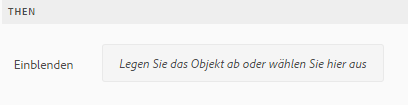

1. Ziehen Sie das Feld **Gehalt des Partners** aus der Registerkarte „Formularobjekte“ in das Feld **Legen Sie das Objekt ab oder wählen Sie hier aus**. Stattdessen können Sie auch auf das Feld **Legen Sie das Objekt ab oder wählen Sie hier aus** tippen und das Feld **Gehalt des Partners** aus dem Popupmenü wählen, in dem sämtliche Formularobjekte im Formular aufgeführt sind.

   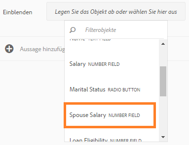

   Die Regel wird im Regeleditor wie folgt angezeigt.

   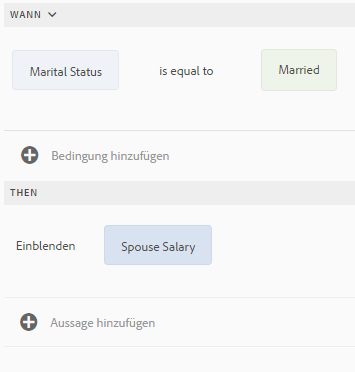

   Tippen Sie auf **Fertig**, um die Regel zu speichern.

1. Wiederholen Sie die Schritte 1 bis 5, um eine weitere Regel zu definieren, mit der das Feld für das Gehalt des Partners ausgeblendet wird, wenn als Familienstand „Ledig“ angegeben wird. Die Regel wird im Regeleditor wie folgt angezeigt.

   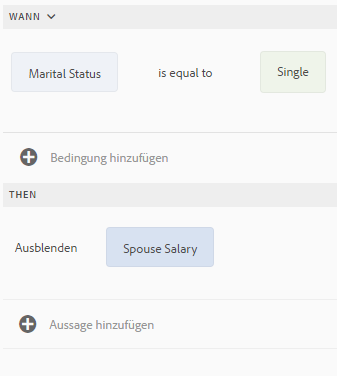

   >[!NOTE]
   >
   >Alternativ zu diesem Verfahren können Sie dieses Verhalten auch implementieren, indem Sie für das Feld „Gehalt des Partners“ lediglich eine Regel vom Typ „Anzeigen“ anstelle zweier Wenn-Regeln für das Feld „Familienstand“ erstellen.

   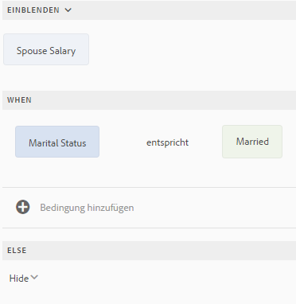

1. Als Nächstes erstellen Sie eine Regel für die Berechnung des Kreditanspruchsbetrags (50 % des Gesamtgehalts) und zur Anzeige des Betrags im Feld für den Kreditanspruch. Dies erreichen Sie, indem Sie Regeln des Typs **Wert einstellen** für das Kreditanspruchsfeld erstellen.

   Klicken Sie im Autorenmodus auf das Feld **[!UICONTROL Kreditanspruch]** und dann auf . Tippen Sie als Nächstes auf **[!UICONTROL Erstellen]**, um den Regeleditor zu starten.

1. Wählen Sie in der Dropdown-Liste „Regeln“ die Regel **[!UICONTROL Wert festlegen]** aus.

   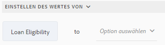

1. Tippen Sie auf **[!UICONTROL Option auswählen]** und wählen Sie **[!UICONTROL Mathematischer Ausdruck]** aus. Ein Feld, in dem Sie mathematische Ausdrücke schreiben können, wird geöffnet.

   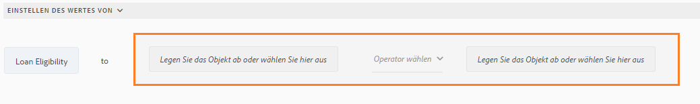

1. Führen Sie in diesem Ausdrucksfeld Folgendes aus:

   * Wählen Sie das Feld **Gehalt** auf der Registerkarte „Formularobjekt“ aus oder ziehen Sie es in das erste Feld **Legen Sie das Objekt ab oder wählen Sie hier aus** und legen Sie es dort ab.

   * Wählen Sie **Plus** aus dem Feld **Operator wählen**.

   * Wählen Sie das Feld **Gehalt des Partners** auf der Registerkarte „Formularobjekt“ aus oder ziehen Sie es in das zweite Feld **Legen Sie das Objekt ab oder wählen Sie hier aus** und legen Sie es dort ab.

   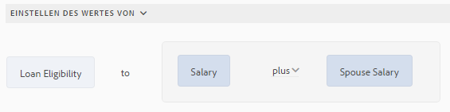

1. Tippen Sie als Nächstes in den hervorgehobenen Bereich um das Ausdrucksfeld und tippen Sie dann auf **Ausdruck erweitern**.

   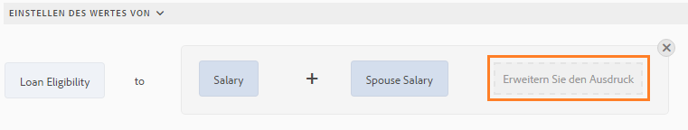

   Wählen Sie im erweiterten Ausdrucksfeld **geteilt durch** aus dem Feld **Operator wählen** und **Zahl** aus dem Feld **Option auswählen**. Geben Sie **2** in das Zahlenfeld ein.

   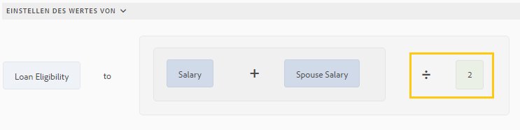

   >[!NOTE]
   >
   >Sie können mithilfe von Komponenten, Funktionen, mathematischen Ausdrücken und Eigenschaftswerten aus dem Feld „Option auswählen“ komplexe Ausdrücke erstellen.

   Als Nächstes erstellen Sie eine Bedingung. Wenn diese „true“ zurückgibt, wird der Ausdruck ausgeführt.

1. Tippen Sie auf **Bedingung hinzufügen**, um eine Wenn-Anweisung hinzuzufügen.

   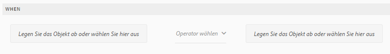

   Geben Sie in der Wenn-Anweisung Folgendes ein:

   * Wählen Sie das Feld **Familienstand** auf der Registerkarte „Formularobjekt“ aus oder ziehen Sie es in das erste Feld **Legen Sie das Objekt ab oder wählen Sie hier aus** und legen Sie es dort ab.

   * Wählen Sie **Ist gleich** aus dem Feld **Operator wählen**.

   * Wählen Sie in dem anderen Feld **Legen Sie das Objekt ab oder wählen Sie hier aus** den Eintrag „String“ (Zeichenfolge) aus und geben Sie **Verheiratet** in das Feld **Geben Sie eine Zeichenfolge ein** ein.

   Die Regel wird schließlich wie folgt im Regeleditor angezeigt.  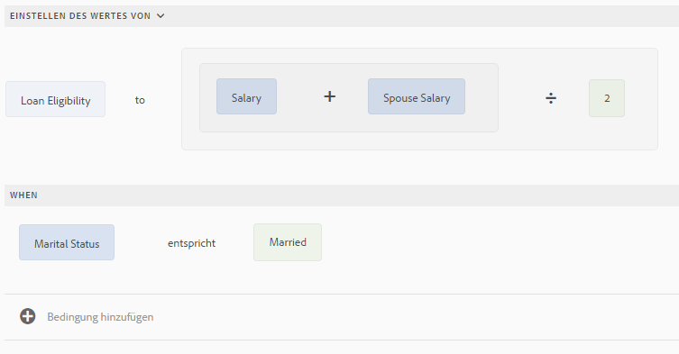

   Tippen Sie auf **Fertig**, um die Regel zu speichern.

1. Folgen Sie wiederum Schritt 7 bis 12, um eine andere Regel zu definieren, mit deren Hilfe der Kreditanspruch berechnet wird, sofern der Familienstand „Ledig“ ist. Die Regel wird im Regeleditor wie folgt angezeigt.

   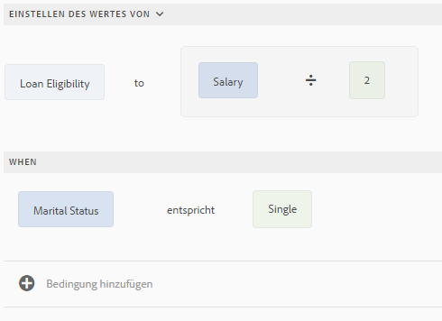

>[!NOTE]
>
>Alternativ dazu können Sie den Kreditanspruch mithilfe der Regel „Werte festlegen von“ in der Wenn-Regel berechnen, die Sie zum Anzeigen oder Ausblenden des Felds für das Gehalt des Partners oder der Partnerin erstellt haben. Die resultierende kombinierte Regel (für den Familienstand „Ledig“) wird wie folgt im Regeleditor angezeigt.
>
>Auf ähnliche Weise können Sie eine kombinierte Regel erstellen, die die Sichtbarkeit des Felds für das Gehalt des Partners oder der Partnerin steuert und den Kreditanspruch für den Familienstand „Verheiratet“ berechnet.

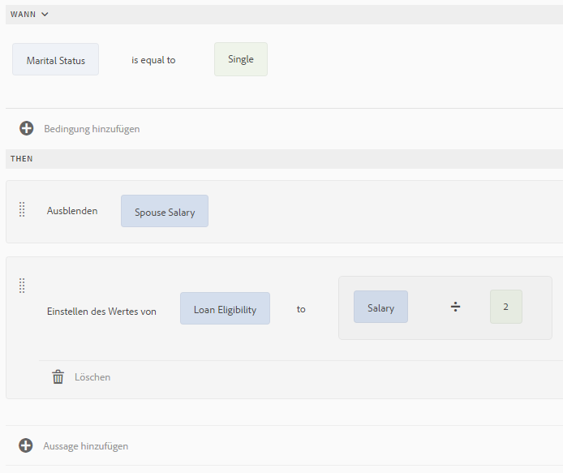

### Verwenden des Codeeditors {#using-code-editor}

Benutzer, die zur Gruppe der Formular-Hauptbenutzer hinzugefügt wurden, können den Code-Editor verwenden. Der Regeleditor generiert automatisch den JavaScript-Code für jede Regel, die Sie mithilfe des Visual Editor erstellen. Indem Sie vom Visual Editor zum Codeeditor wechseln, können Sie den generierten Code anzeigen. Wenn Sie jedoch den Code einer Regel im Codeeditor ändern, können Sie nicht mehr zurück zum Visual Editor wechseln. Sie können neue Regeln auch von Anfang an im Codeeditor schreiben, wenn Sie diesen dem Visual Editor vorziehen. Mithilfe des Schalters zwischen dem Visual Editor und dem Codeeditor können Sie zwischen den beiden Modi wechseln.

Das im Code-Editor verwendete JavaScript ist die Ausdruckssprache für adaptive Formulare. Alle Ausdrücke sind gültige JavaScript-Ausdrücke und verwenden Skriptmodell-APIs für adaptive Formulare. Diese Ausdrücke geben Werte bestimmter Typen zurück. Eine vollständige Liste der Klassen, Ereignisse, Objekte und öffentlichen APIs für adaptive Formulare finden Sie unter [JavaScript Library API-Referenz für adaptive Formulare](https://helpx.adobe.com/de/experience-manager/6-5/forms/javascript-api/index.html).

Weitere Informationen zu Richtlinien für das Schreiben von Regeln im Codeeditor finden Sie unter [Adaptive Formularausdrücke](/help/forms/using/adaptive-form-expressions.md).

Beim Schreiben von JavaScript-Code in den Regeleditor helfen Ihnen die visuellen Hinweise bei der Strukturierung und Syntax:

* Syntaxmarkierungen
* Automatische Einrückung
* Hinweise und Vorschläge für Formularobjekte, Funktionen und deren Eigenschaften
* Automatisches Ausfüllen von Formularkomponentennamen und gängigen JavaScript-Funktionen

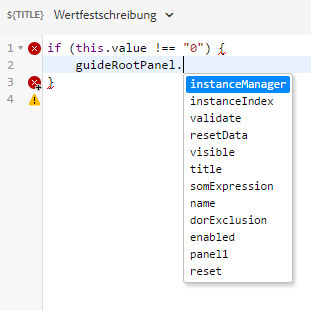

#### Benutzerdefinierte Funktionen im Regeleditor {#custom-functions}

Zusätzlich zu den vorkonfigurierten Funktionen wie beispielsweise *Summe von*, die unter „Funktionenausgabe“ aufgeführt sind, können Sie auch benutzerdefinierte Funktionen erstellen, die Sie häufig benötigen. Stellen Sie sicher, dass für die Funktion, die Sie schreiben, ein `jsdoc` vorhanden ist.

Dieses dazugehörige `jsdoc` ist aus den folgenden Gründen erforderlich:

* Wenn Sie benutzerdefinierte Konfigurationen und Beschreibungen verwenden möchten.
* Da Funktionen in `JavaScript,` auf unterschiedliche Weise deklariert werden können und Sie mithilfe der Kommentare den Überblick über die Funktionen behalten.

Weitere Informationen finden Sie unter [usejsdoc.org](https://jsdoc.app/).

Unterstützte `jsdoc`-Tags:

* **Private** (Privat)
Syntax: 
Eine private Funktion ist nicht als benutzerdefinierte Funktion enthalten.`@private`
Eine private Funktion ist nicht als benutzerdefinierte Funktion enthalten.

* **Name**
Syntax: `@name funcName <Function Name>`
Eine Alternative dazu ist`,` `@function funcName <Function Name>` **oder** `@func` `funcName <Function Name>` zu verwenden.
   `funcName` ist der Name der Funktion (Leerzeichen sind nicht zulässig).
   `<Function Name>` ist der Anzeigename der Funktion.

* **Member** (Mitglied)
Syntax:`@memberof namespace`
Fügt der Funktion einen Namespace an.

* **Parameter**
Syntax: `@param {type} name <Parameter Description>` 
Alternativ dazu können Sie auch `@argument` `{type} name <Parameter Description>` **oder** `@arg` `{type}` `name <Parameter Description>` verwenden.
Zeigt die von der Funktion verwendeten Parameter an. In einer Funktion können mehrere Parameter-Tags vorhanden sein (je ein Tag für jeden Parameter in der Reihenfolge ihres Auftretens).
   `{type}` gibt den Parametertyp an. Zulässige Parametertypen sind:

   1. String (Zeichenfolge)
   1. Number (Zahl)
   1. Boolean (Boolesch)

   Alle anderen Parametertypen fallen in eine der oben genannten Kategorien.  „None“ wird nicht unterstützt. Achten Sie darauf, einen der oben genannten Typen zu wählen. Für die Typen wird nicht zwischen Groß- und Kleinschreibung unterschieden. Leerzeichen sind im Parameter `name` unzulässig. `<Parameter Descrption>` `<parameter>  can have multiple words. </parameter>`

* **Return Type** (Rückgabetyp)
Syntax: `@return {type}` 
Alternativ dazu können Sie auch `@returns {type}` verwenden.
Fügt Informationen über die Funktion hinzu (z. B. ihren Zweck).
Die Zeichenfolge „{type}“ gibt den Rückgabetyp der Funktion an. Zulässige Rückgabetypen sind:

   1. String (Zeichenfolge)
   1. Number (Zahl)
   1. Boolean (Boolesch)

   Alle anderen Rückgabetypen fallen in eine der oben genannten Kategorien.  „None“ wird nicht unterstützt. Achten Sie darauf, einen der oben genannten Typen zu wählen. Für Rückgabetypen wird nicht zwischen Groß- und Kleinschreibung unterschieden.

>[!NOTE]
>
>Kommentare vor benutzerdefinierten Funktionen werden für die Zusammenfassung verwendet. Die Zusammenfassung kann sich über mehrere Zeilen bis zum nächsten Tag erstrecken. Beschränken Sie ihre Länge auf eine einzelne Zeile, um eine knappe Beschreibung im Regel-Builder zu erhalten.

**Hinzufügen einer benutzerdefinierten Funktion**

Angenommen, Sie möchten eine benutzerdefinierte Funktion zur Berechnung der Fläche eines Quadrats hinzufügen. Die Seitenlänge ist der vom Benutzer eingegebene Wert für die benutzerdefinierte Funktion. Dieser Wert wird in ein Zahlenfeld im Formular eingegeben. Die berechnete Ausgabe wird in einem anderen Zahlenfeld im Formular angezeigt. Um eine benutzerdefinierte Funktionen hinzuzufügen, müssen Sie zuerst eine Client-Bibliothek erstellen und diese anschließend dem CRX-Repository hinzufügen.

Führen Sie die folgenden Schritte aus, um eine Client-Bibliothek zu erstellen und sie dem CRX-Repository hinzuzufügen:

1. Erstellen Sie eine Client-Bibliothek. Weitere Informationen finden Sie unter [Verwenden Client-seitiger Bibliotheken](/help/sites-developing/clientlibs.md).
1. Fügen Sie in CRXDE die Eigenschaft `categories` mit dem Wert `customfunction` (vom Typ „String“ (Zeichenfolge)) zum Ordner `clientlib` hinzu.

   >[!NOTE]
   >
   >`customfunction` ist eine Beispielkategorie. Sie können einen beliebigen Namen für die Kategorie wählen, die Sie im Ordner `clientlib` erstellen.

Nachdem Sie die Client-Bibliothek im CRX-Repository hinzugefügt haben, verwenden Sie sie in Ihrem adaptiven Formular. Sie ermöglicht die Verwendung der benutzerdefinierten Funktion als Regel im Formular. Führen Sie die folgenden Schritte durch, um die Client-Bibliothek dem adaptiven Formular hinzuzufügen:

1. Öffnen Sie das Formular im Bearbeitungsmodus.
Um ein Formular im Bearbeitungsmodus zu öffnen, wählen Sie das Formular aus und klicken Sie auf **Öffnen**.
1. Wählen Sie im Bearbeitungsmodus eine Komponente aus und tippen Sie anschließend auf  > **Container für ein adaptives Formular** und dann auf .
1. Fügen Sie in der Seitenleiste unter „Name der Client-Bibliothek“ Ihre Client-Bibliothek hinzu. (In diesem Beispiel wäre das `customfunction`.)

   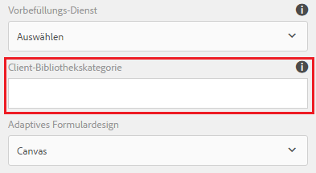

1. Wählen Sie das numerische Eingabefeld aus und tippen Sie auf , um den Regeleditor zu öffnen.
1. Tippen Sie auf **Regel erstellen**. Erstellen Sie mithilfe der unten gezeigten Optionen eine Regel zum Speichern des Quadratwerts der Eingabe im Ausgabefeld des Formulars.
   [ 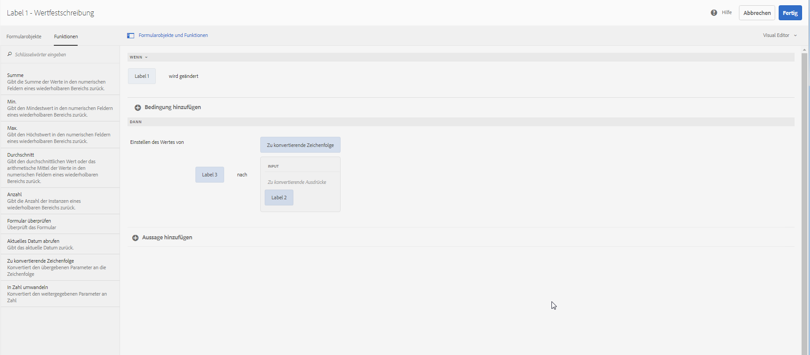](assets/add-custom-rule.png)Tippen Sie auf **Fertig**. Ihre benutzerdefinierte Funktion wird hinzugefügt.

#### Unterstützte Typen von Funktionsdeklarationen {#function-declaration-supported-types}

**Funktionsanweisung**

```javascript
function area(len) {
    return len*len;
}
```

Diese Funktion wird ohne `jsdoc`-Kommentare eingefügt.

**Funktionsausdruck**

```javascript
var area;
//Some codes later
/** */
area = function(len) {
    return len*len;
};
```

**Funktionsausdruck und -anweisung**

```javascript
var b={};
/** */
b.area = function(len) {
    return len*len;
}
```

**Funktionsdeklaration als Variable**

```javascript
/** */
var x1,
    area = function(len) {
        return len*len;
    },
    x2 =5, x3 =true;
```

Einschränkung: Die benutzerdefinierte Funktion wählt nur die erste Funktionsdeklaration aus der Variablenliste, wenn zusammen verwendet. Der Funktionsausdruck kann für jede deklarierte Funktion verwendet werden.

**Funktionsdeklaration als Objekt**

```javascript
var c = {
    b : {
        /** */
        area : function(len) {
            return len*len;
        }
    }
};
```

>[!NOTE]
>
>Stellen Sie sicher, dass Sie `jsdoc` für jede benutzerdefinierte Funktion verwenden. Obwohl `jsdoc`-Kommentare empfohlen werden, sollten Sie einen leeren `jsdoc`-Kommentar einfügen, um eine Funktion als benutzerdefinierte Funktion zu kennzeichnen. Dies ermöglicht eine standardmäßige Behandlung Ihrer benutzerdefinierten Funktion.

## Verwalten von Regeln {#manage-rules}

Wenn Sie auf das Objekt und dann auf  tippen, werden alle vorhandenen Regeln für ein Formularobjekt aufgelistet. Sie können den Titel und eine Vorschau der Regelübersicht anzeigen. Darüber hinaus können Sie in der Benutzeroberfläche die vollständige Regelübersicht erweitern und anzeigen, die Reihenfolge der Regeln ändern, Regeln bearbeiten und Regeln löschen.

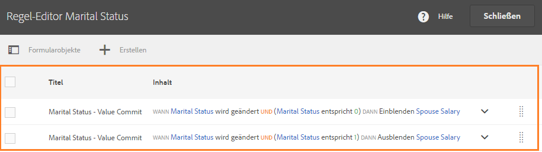

Sie können die folgenden Aktionen für Regeln durchführen:

* **Anzeigen/Reduzieren**: Die Inhaltsspalte in der Regelliste zeigt den Regelinhalt an. Wenn in der Standardansicht nicht der gesamte Regelinhalt sichtbar ist, tippen Sie auf , um die Ansicht zu erweitern.

* **Neuanordnung**: Jede neue Regel, die Sie erstellen, wird am unteren Ende der Regelliste eingefügt. Die Regeln werden in der Reihenfolge von oben nach unten ausgeführt. Dabei wird zuerst die Regel ganz oben in der Liste ausgeführt, darauf folgen andere Regeln desselben Typs. Wenn beispielsweise eine Wenn-, Anzeigen-, Aktivieren- und eine weitere Wenn-Regel an den ersten vier Positionen der Liste stehen, werden zuerst die zuoberst stehende Wenn-Regel und dann die Wenn-Regel an vierter Stelle ausgeführt. Danach werden die Regeln „Anzeigen“ und „Aktivieren“ ausgeführt.
Sie können die Position einer Regel in der Reihenfolge ändern, indem Sie auf  für die Regel tippen oder die Regel an die gewünschte Stelle in der Liste ziehen und dort ablegen.

* **Bearbeiten**: Zum Bearbeiten einer Regel aktivieren Sie das Kontrollkästchen neben ihrem Titel. Weitere Optionen zum Bearbeiten und Löschen der Regel werden angezeigt. Tippen Sie auf **Bearbeiten**, um die ausgewählte Regel im Regeleditor im Visual Editor- oder im Code-Editormodus zu öffnen. Dies ist davon abhängig, welcher Modus zum Erstellen der Regel verwendet wurde.

* **Löschen**: Zum Löschen einer Regel wählen Sie die Regel aus und tippen Sie dann auf **Löschen**.

* **Aktivieren/Deaktivieren:** Möglicherweise müssen Sie eine Regel vorübergehend aussetzen. Sie können eine oder mehrere Regeln auswählen und in der Aktionssymbolleiste auf „Deaktivieren“ tippen, um sie zu deaktivieren. Wenn eine Regel deaktiviert ist, wird sie zur Laufzeit nicht ausgeführt. Um eine Regel zu aktivieren, die deaktiviert ist, können Sie sie auswählen und auf „Aktivieren“ in der Symbolleiste „Aktionen“ tippen. Die Statusspalte für die Regel zeigt an, ob diese aktiviert oder deaktiviert ist.

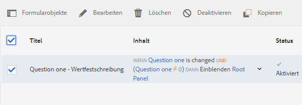

## Kopieren und Einfügen von Regeln {#copy-paste-rules}

Es ist möglich, Regeln aus einem Feld zu kopieren und in andere, ähnliche Felder einzufügen, um Zeit zu sparen.

Gehen Sie zum Kopieren und Einfügen von Regeln wie folgt vor:

1. Tippen Sie auf das Formularobjekt, von dem Sie eine Regel kopieren möchten, und tippen Sie in der Komponenten-Symbolleiste auf . Die Benutzeroberfläche des Regeleditors wird angezeigt, wobei das Formularobjekt ausgewählt ist und die vorhandenen Regeln angezeigt werden.

   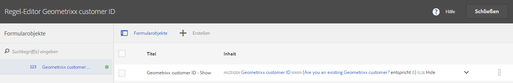

   Weitere Informationen zum Verwalten vorhandener Regeln finden Sie unter [Verwalten von Regeln](../../forms/using/rule-editor.md#p-manage-rules-p).

1. Aktivieren Sie das Kontrollkästchen neben dem Titel der Regel. Weitere Optionen zum Verwalten der Regel werden angezeigt. Tippen Sie auf **Kopieren**.

   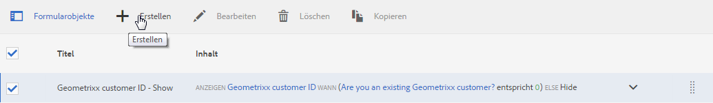

1. Wählen Sie ein anderes Formularobjekt aus, in das Sie die Regel einfügen möchten, und tippen Sie auf **Einfügen**. Sie können die Regel darüber hinaus bearbeiten, um Änderungen daran vorzunehmen.

   >[!NOTE]
   >
   >Sie können Regeln nur dann in ein anderes Formularobjekt einfügen, wenn das Zielobjekt das Ereignis der kopierten Regel unterstützt. So unterstützt beispielsweise eine Schaltfläche das Klickereignis. Sie können eine Regel, die ein Klickereignis enthält, in eine Schaltfläche, nicht jedoch in ein Kontrollkästchen einfügen.

1. Tippen Sie auf **Fertig**, um die Regel zu speichern.

## Verschachtelte Ausdrücke {#nestedexpressions}

Im Regeleditor können Sie mehrere UND- und ODER-Operatoren verwenden, um eingebettete Regeln zu erstellen. Sie können mehrere UND- und ODER-Operatoren in Regeln kombinieren.

Das folgende Beispiel zeigt eine verschachtelte Regel, die dem Benutzer eine Meldung über den Anspruch auf das Sorgerecht für ein Kind anzeigt, wenn die entsprechenden Bedingungen erfüllt sind.

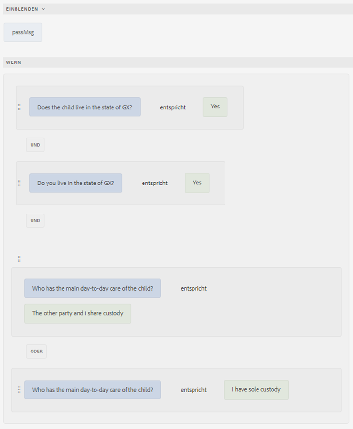

Sie können Bedingungen innerhalb einer Regel auch mittels Drag-and-Drop ziehen, um sie zu bearbeiten. Tippen Sie auf den Ziehgriff und halten Sie den Mauszeiger auf den Griff () vor einer Bedingung. Nachdem der Cursor in ein Handsymbol konvertiert wird, wie unten gezeigt, ziehen Sie die Bedingung an eine beliebige Stelle in der Regel. Die Regelstruktur ändert sich.


## Bedingungen für Datumsausdrücke {#dateexpression}

Im Regeleditor können Sie Vergleiche von Datumsangaben verwenden, um Bedingungen zu erstellen.

Nachfolgend ist eine Beispielbedingung dargestellt, die ein statisches Textobjekt anzeigt, wenn die Hypothek für das Haus bereits abgeschlossen ist, was der Benutzer durch Ausfüllen des Datumsfelds angibt.

Wenn das Datum der Hypothek, das vom Benutzer ausgefüllt wurde, in der Vergangenheit liegt, wird im adaptiven Formular ein Hinweis über die Einkommensberechnung angezeigt. Die folgende Regel vergleicht das Datum, das vom Benutzer eingetragen wurde, mit dem aktuellen Datum. Wenn dieses Datum vor dem aktuellen Datum liegt, zeigt das Formular die Textmeldung (mit der Bezeichnung „Einkommen“) an.

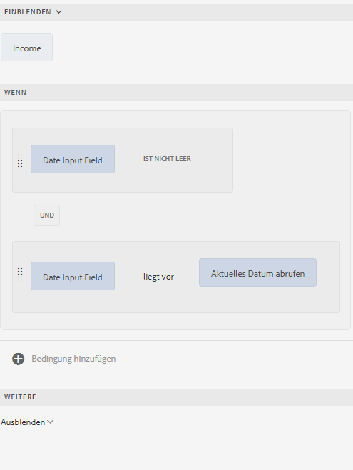

Wenn das eingetragene Datum vor dem aktuellen Datum liegt, zeigt das Formular die Textmeldung (Einkommen) an, wie hier dargestellt:


## Bedingungen für den Vergleich von Zahlen {#number-comparison-conditions}

Im Regeleditor können Sie Bedingungen erstellen, die zwei Zahlen vergleichen.

Im Folgenden wird eine Beispielbedingung angezeigt, die ein statisches Textobjekt anzeigt, wenn die Anzahl von Monaten, die ein aktueller Benutzer an seiner gegenwärtigen Adresse gewohnt hat, weniger als 36 ist.

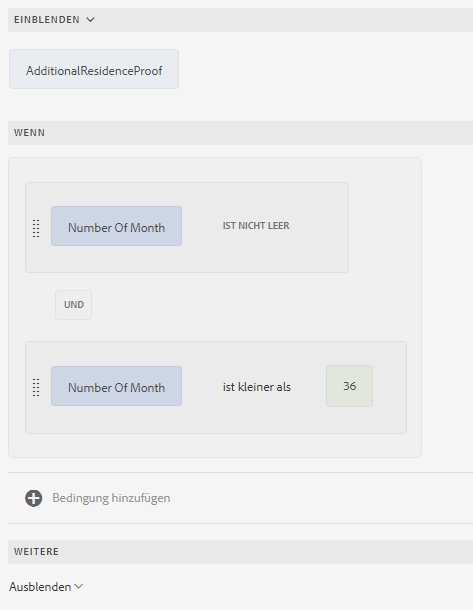

Wenn der Benutzer angibt, dass er unter seiner derzeitigen Adresse weniger als 36 Monate gewohnt hat, wird im Formular ein Hinweis angezeigt, dass ein zusätzlicher Aufenthaltsnachweis erforderlich ist.


## Einfluss des Regeleditors auf vorhandene Skripte {#impact-of-rule-editor-on-existing-scripts}

In Versionen von AEM Forms vor Version AEM 6.1 Forms Feature Pack 1 schrieben Formularverfasser und Entwickler Ausdrücke auf der Registerkarte „Skripte“ im Dialogfeld „Komponente bearbeiten“, um adaptiven Formularen dynamisches Verhalten hinzuzufügen. Die Registerkarte „Skripte“ wird nun durch den Regeleditor ersetzt.

Alle Skripts oder Ausdrücke, die Sie in die Registerkarte „Skripte“ geschrieben haben, sind im Regeleditor verfügbar. Sie können sie zwar nicht im Visual Editor anzeigen oder bearbeiten, aber wenn Sie Teil der Gruppe der Formular-Hauptbenutzer sind, können Sie Skripte im Code-Editor bearbeiten.

## Beispielregeln {#example}

### Formulardatenmodelldienst aufrufen {#invoke}

Stellen Sie sich einen Webservice `GetInterestRates` vor, der den Darlehensbetrag, die Beschäftigungsdauer und die Kreditwürdigkeit des Antragstellers als Eingabe entgegennimmt und einen Darlehensplan einschließlich EMI-Betrag und Zinssatz zurückgibt. Sie erstellen ein Formulardatenmodell, indem Sie den Web-Service als Datenquelle verwenden. Sie fügen dem Formularmodell Datenmodellobjekte und einen `get`-Service hinzu. Der Service wird auf der Registerkarte „Services“ des Formulardatenmodells angezeigt. Anschließend erstellen Sie ein adaptives Formular, das Felder aus Datenmodellobjekten enthält, um Benutzereingaben für Darlehensbetrag, Amtsdauer und Kreditwürdigkeit zu erfassen. Fügen Sie eine Schaltfläche hinzu, die den Webservice auslöst, um Plandetails abzurufen. Die Ausgabe wird in die entsprechenden Felder befüllt.

Die folgende Regel zeigt, wie Sie die Aktion „Dienst aufrufen“ konfigurieren, um das Beispielszenario durchzuführen.

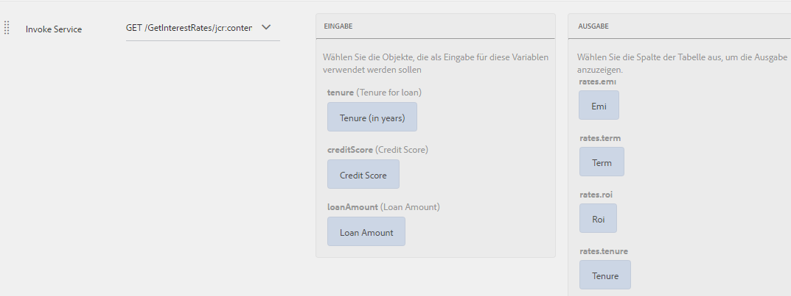

Formulardatenmodelldienst mit Regel für adaptives Formular aufrufen

### Auslösen mehrerer Aktionen mithilfe einer Wenn-Regel {#triggering-multiple-actions-using-the-when-rule}

Angenommen, in einem Kreditantragsformular soll angegeben werden, ob der Antragsteller ein bestehender Kunde ist oder nicht. Das Feld für die Kunden-ID soll basierend auf den vom Benutzer angegebenen Informationen angezeigt oder ausgeblendet werden. Darüber hinaus soll der Fokus auf das Kunden-ID-Feld gelegt werden, wenn der Benutzer ein bestehender Kunde ist. Das Antragsformular umfasst die folgenden Komponenten:

* Ein Optionsfeld **Sind Sie bereits Geometrixx-Kunde?**, das die Optionen „Ja“ und „Nein“ anbietet. Der Wert für „Ja“ ist **0**, und der Wert „Nein“ ist **1**.

* Das Textfeld **Geometrixx-Kunde-ID** zur Angabe der Kunden-ID.

Wenn Sie eine Wenn-Regel für das Optionsfeld schreiben, um dieses Verhalten zu implementieren, wird die Regel wie folgt im visuellen Regeleditor angezeigt.  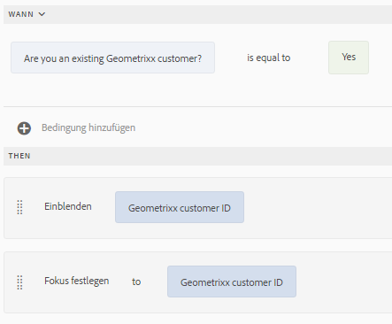

Regel im Visual Editor

In der Beispielregel ist die Anweisung im Wenn-Abschnitt die Bedingung. Wenn diese „True“ zurückgibt, werden die im Dann-Abschnitt angegebenen Aktionen ausgeführt.

Die Regel wird wie folgt im Codeeditor angezeigt.

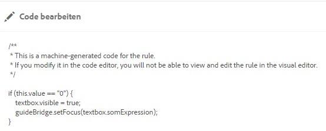

Regel im Codeeditor

### Verwenden einer Funktionsausgabe in einer Regel {#using-a-function-output-in-a-rule}

Ein Bestellformular enthält die folgende Tabelle, in der die Benutzer ihre Bestellungen eingeben. In dieser Tabelle gilt:

* Die erste Zeile ist wiederholbar, sodass die Benutzer mehrere Produkte bestellen und unterschiedliche Mengen angeben können. Ihr Elementname ist `Row1`.
* Der Titel der Zelle in der Spalte „Produktmenge“ der wiederholbaren Zeile lautet „Menge“. Der Elementname für diese Zelle lautet `productquantity`.
* Die zweite Zeile der Tabelle ist nicht wiederholbar, und der Titel der Zelle in der Spalte „Produktmenge“ in dieser Zeile lautet „Menge insgesamt“.

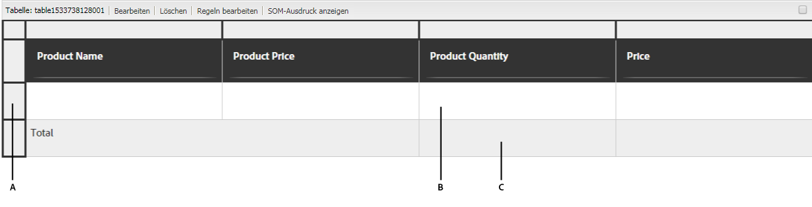

**A.** Zeile 1 **B.** Menge **C.** Menge insgesamt

Als Nächstes sollen die in der Spalte „Produktmenge“ angegebenen Mengen für alle Produkte addiert und die Summe in der Zelle „Menge insgesamt“ angezeigt werden. Dies erreichen Sie, indem Sie wie unten gezeigt eine Regel des Typs „Wert einstellen“ für die Zelle „Menge insgesamt“ schreiben.

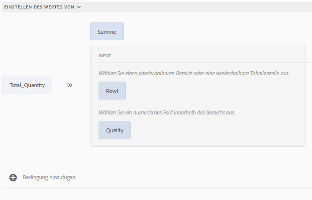

Regel im visuellen Editor

Die Regel wird wie folgt im Codeeditor angezeigt.

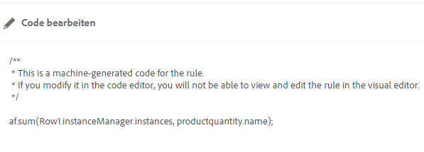

Regel im Codeeditor

### Validieren eines Feldwerts mithilfe eines Ausdrucks {#validating-a-field-value-using-expression}

Sie möchten verhindern, dass in dem Bestellformular aus dem vorigen Abschnitt Benutzer mehr als eine Einheit jedes beliebigen Produkts mit einem Preis über 10.000 bestellen. Um dies zu erreichen, können Sie wie unten gezeigt eine Validierungsregel schreiben.

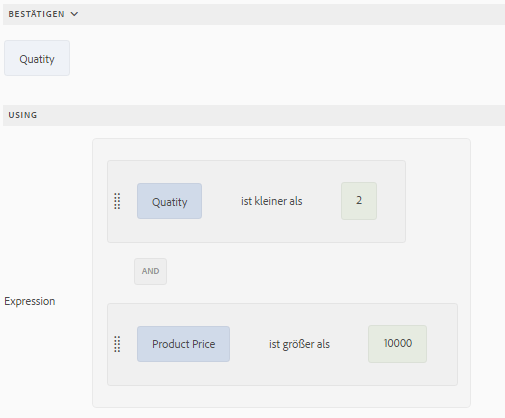

Regel im visuellen Editor

Die Regel wird wie folgt im Codeeditor angezeigt.

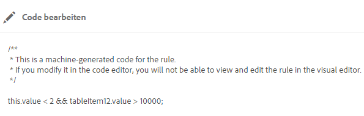

Regel im Code-Editor
