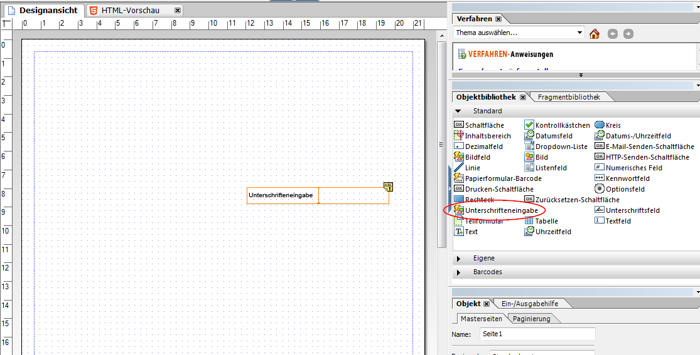
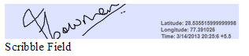

# Verwenden der Scribble-Signatur in HTML5-Formularen{#using-scribble-signature-in-html-forms}

HTML5-Formulare werden zunehmend auf Touch-Geräten verwendet. Sie sind eine allgemeine Voraussetzung zur Unterstützung von Signaturen. Die Scribble-Signatur (Schreiben mit dem Eingabestift oder mit dem Finger) ist eine immer gängigere Form der Unterzeichnung von Formularen auf mobilen Geräten. HTML5 Forms und Designer bieten jetzt auf dem Formular ein Feld für die Scribble-Signatur. Wenn das Formular im Browser angezeigt wird, können Benutzer mit einem Eingabestifts, einer Maus oder mit einer Berührung in diesem Feld unterzeichnen.

## Entwerfen eines Formulars mit einem Feld für Scribble-Signaturen {#how-to-design-a-form-using-scribble-signature-field}

1. Öffnen Sie ein Formular in Forms Designer.
1. Ziehen das Scribble-Signatur-Feld auf die Seite.

   

   >[!NOTE]
   >
   >Dimensionen des in Forms Designer ausgewählten Felds werden bei der Wiedergabe des Felds angezeigt. Allerdings wird die Größe des angezeigten Unterschriftenfeldes basierend auf dem Seitenverhältnis des Felds und nicht anhand der in Forms Designer festgelegten Größe berechnet.

1. Konfigurieren Sie das Scribble-Signatur-Feld.

   Beim Unterschreiben auf einem iPad werden am Scribble-Signatur-Feld standardmäßig die geografischen Informationen als Pflichtangabe markiert. (Diese Angabe ist auf anderen Geräten optional.) Dieses Standardverhalten kann außer Kraft gesetzt werden, indem der Wert der Eigenschaft `geoLocMandatoryOnIpad`   geändert wird. Diese Eigenschaft wird auf dem Scribble-Signatur-Feld als Extras-Option bereitgestellt. Die Schritte zum Ändern dieser Einstellung:

   1. Wählen Sie im Formular das Scribble-Signatur-Feld.
   1. Wählen Sie die Registerkarte **XML-Quelle.**

      >[!NOTE]
      >
      >Um die Registerkarte &quot;XML-Quelle&quot;zu öffnen, klicken Sie auf **Ansicht** > **XML-Quelle**.

   1. Suchen Sie das Tag `<ui>` im Tag `<field>` und ändern Sie den Quellcode wie folgt:

      ```xml
      <extras name="x-scribble-add-on">
      <boolean name="geoLocMandatoryOnIpad">0</boolean>
      </extras>
      ```

   1. Wählen Sie die Registerkarte **Designansicht**. Klicken Sie im Bestätigungsfeld auf **Ja**.
   1. Speichern Sie das Formular.

1. Geben Sie das Formular in einem Browser auf einem unterstützten Gerät/Desktop wieder.

## Benutzeroberfläche für Scribble-Signaturen {#interfacing-with-the-scribble-signatures}

### Signing {#signing}

Nachdem ein Scribble-Signatur-Feld dem Formular hinzugefügt wurde und das Formular angezeigt wird, wird beim Klicken oder Tippen auf das Feld ein Dialogfeld geöffnet. Der Benutzer kann mit einer Maus, mit dem Finger oder einem Eingabestift im gepunkteten Rechteck unterschreiben.


**A.** Pinsel  **B.** Radiergummi  **C.** Geolocation  **D.** Geolocation-Informationen

### Geotagging {#geo-tagging}

Wenn Sie beim Einfügen der Signatur auf das Geotargeting-Symbol klicken, werden geografische Informationen und die Uhrzeit in das Feld eingebettet.

>[!NOTE]
Das Einbetten der geografischen Informationen ist auf einem iPad obligatorisch.

Auf einem iPad wird das Geotargeting-Symbol standardmäßig nicht angezeigt. Die geografischen Informationen werden automatisch eingebettet, wenn Sie auf **OK** klicken.

Diese Einstellung kann auf iPads geändert werden, indem in den init-Parametern des Feldes der Wert des Parameters `geoLocManadatoryOnIpad` auf `0` gesetzt wird.

* Wenn die Angabe geografischer Informationen obligatorisch ist, wird dem Benutzer ein kleinerer Bereich zum Zeichnen angezeigt. Der Geotagging-Text wird hinzugefügt, wenn der Benutzer auf dem anderen Bereich auf das Symbol **OK** klickt.
* In anderen Fällen wird dem Benutzer der komplette Bereich angezeigt. Wenn der Benutzer sich dazu entscheidet, geografische Informationen hinzuzufügen, wird die Größe des Bereichs angepasst, um den Geotagging-Text einzufügen.

### Löschen einer Signatur  {#clearing-a-signature}

Bei Verwendung dieser Funktion kann ein Benutzer auf das Symbol **Radiergummi** klicken, um das Feld zu löschen und neu zu beginnen. Wenn zuvor geografische Informationen hinzugefügt wurden, werden diese ebenfalls gelöscht.

### Speichern einer Signatur  {#saving-a-signature}

Durch Klicken auf das Symbol **OK** wird die Unterschrift als ein Bild im Feld gespeichert. Das Bild und die Werte können zur weiteren Bearbeitung an den Server gesendet werden. Sobald der Benutzer auf **OK** geklickt hat, wird das Unterschriftsfeld gesperrt. Die Unterschrift kann nicht mehr mithilfe des Scribble-Widgets bearbeitet werden.

Durch Tippen oder Klicken auf das Unterschriftsfeld wird das Dialogfeld im schreibgeschützten Modus geöffnet.



### Auswählen der Schriftgröße {#selecting-pen-size}

Klicken Sie auf das Symbol **Pinsel**, um eine Liste der verfügbaren Stiftgrößen anzuzeigen. Klicken oder Tippen Sie auf eine Schriftgröße, die verwendet werden soll.

### Löschen von Unterschriften aus dem Formular  {#delete-signatures-from-the-form}

Löschen der Unterschriften aus dem Formular

* (Auf mobilen Geräten) Drücken Sie lang auf das Unterschriftsfeld und tippen Sie im Bestätigungsdialogfeld auf **Ja**.
* (Desktop) Bewegen Sie die Maus über das Unterschriftsfeld, klicken Sie auf das Symbol **Abbrechen** und klicken Sie im Bestätigungsdialogfeld auf **Ja**.
