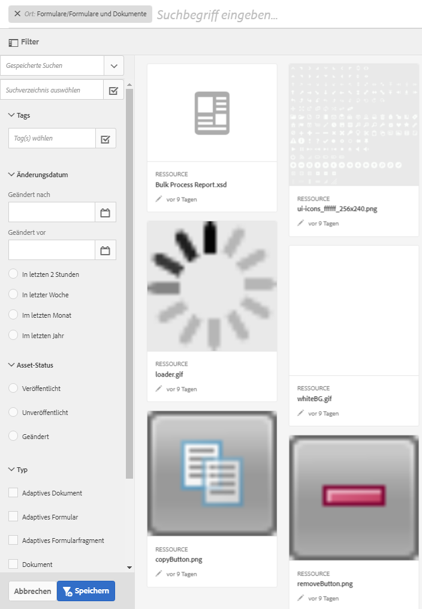

# Suchen nach Formularen und Assets{#searching-for-forms-and-assets}

Sie können mithilfe einer Textzeichenfolge mit oder ohne Platzhalter nach Formularen oder Formular-Assets suchen. Sie können Ihre Suche auch mithilfe der Kriterien einschränken, die in verschiedenen Kategorien im Suchbereich verfügbar sind.

Wenn Sie eines oder mehrere Kriterien auswählen und eine Textzeichenfolge angeben, wird die Schnittmenge von Text und Kriterien als Suchergebnis zurückgegeben. Die Suchergebnisse sind so gut wie die zur Verfügung gestellten Formular- und Asset-Metadaten.

Klicken Sie auf , um das Suchfeld ein- oder auszublenden.

## Einfache Suche {#basic-search}

Bei einer einfachen Suche handelt es sich um die Standardsuche, die ohne Angabe von Filtern ausgeführt wird. Eine Volltextsuche in Metadateneigenschaften wird von AEM Forms durchgeführt.

Um eine einfache Suche durchzuführen, geben Sie in das Textfeld die Suchanfrage ein und drücken Sie die Enter-Taste. Sie können auch das Platzhalterzeichen (&#42;) eingeben, um eine beliebige Anzahl von Zeichen zu ersetzen.

Adobe Experience Manager sucht in den Metadateneigenschaften nach dem eingegebenen Text und gibt die entsprechenden Ergebnisse wieder. Wenn Sie mehr als ein Wort eingeben, wird beim Suchvorgang für den gesamten Text nach Übereinstimmungen gesucht.

Beachten Sie bei der einfachen Suche die folgenden Punkte:

* Die Suche wird mithilfe der Formular- und Asset-Metadateneigenschaften durchgeführt.
* Wenn Sie mehr als ein Wort eingeben, wird beim Suchvorgang für den gesamten Text nach Übereinstimmungen gesucht.
* Bei der Suche wird die Groß-/Kleinschreibung nicht beachtet. Wenn Sie z. B. `geometrixx` eingeben, werden Assets mit den Titeln `Geometrixx`, `GEOMETRIXX` und `GeoMetRixx` in den Suchergebnissen angezeigt.

* Unvollständige Übereinstimmungen mit einem Wort werden nicht unterstützt. Um mit unvollständigen Zeichenfolgen zu suchen, verwenden Sie den Platzhalter &#42;. Wenn bei der Suchanfrage jedoch eine Übereinstimmung mit einem vollständigen Wort vorliegt, wird das entsprechende Formular bzw. Asset angezeigt.
* Zusätzliche Leerzeichen werden berücksichtigt und während der Suche nicht entfernt. Zum Beispiel ist `My form` nicht die gleiche Suchanfrage wie `My form`.

* Wenn sich die Daten von den Anzeigewerten der Felder in den Metadateneigenschaften abweichen, können Sie Anzeigewerte als Suchparameter nicht verwenden. Beispielsweise können Sie keine Suche auf Basis eines Status, z. B. „geändert“ oder „veröffentlicht“, durchführen, da diese Eigenschaften in einem anderen Format gespeichert werden.

## Erweiterte Suche {#advanced-search}

In den Suchkriterien können Sie neben der Suchanfrage einige Suchparameter angeben, um die einfache Suche effizienter und fokussierter zu gestalten.

Suchfeld und Parameter bzw. Filter für die Suche nach AEM-Formularen und -Assets

### Asset-Pfad {#asset-path}

Mit einem Asset-Pfad-Filter können Sie die Suchergebnisse auf das aktuelle Verzeichnis beschränken. Wenn die Option „Suche im aktuellen Verzeichnis“ nicht ausgewählt ist, enthalten die Suchergebnisse Assets aus dem Basisverzeichnis. Wenn es sich bei der aktuellen Seite um kein Verzeichnis handelt und die Option „Suche im aktuellen Verzeichnis“ ausgewählt ist, werden bei der Suche die Assets wiedergegeben, die im übergeordneten Verzeichnis vorhanden sind.

### Asset-Änderung {#asset-modification}

Wählen Sie eine der folgenden Optionen aus, um alle Assets zu durchsuchen, die innerhalb eines bestimmten Zeitraums geändert wurden.

| **Option** | **Beschreibung** |
|---|---|
| Vor zwei Stunden | Durchsuchen aller Assets, die in den letzten zwei Stunden geändert wurden. |
| Vor einer Woche | Durchsuchen aller Assets, die in der letzten Woche geändert wurden. |
| Vor einem Monat | Durchsuchen aller Assets, die im letzten Monat geändert wurden. |
| Vor einem Jahr | Durchsuchen aller Assets, die im letzten Jahr geändert wurden. |

### Asset-Status {#asset-status}

Sie können mit einem der folgenden Status nach Assets suchen:

* **Veröffentlicht**: Suchen Sie alle veröffentlichten Assets, die nach der Veröffentlichung nicht geändert wurden.

* **Veröffentlichung rückgängig gemacht**: Suchen Sie alle Assets, die nie veröffentlicht werden.

* **Geändert**: Suchen aller Assets, die nach der Veröffentlichung geändert wurden oder deren Veröffentlichung zurückgezogen wurde.

### Asset-Typ {#asset-type}

Sie können beliebig viele Asset-Typen auswählen. Bei der Suche werden alle ausgewählten Assets gemeinsam zurückgegeben.

<table>
 <tbody>
  <tr>
   <th>Option</th> 
   <th>Beschreibung</th> 
  </tr>
  <tr>
   <td>Formularvorlage  </td> 
   <td>Durchsuchen aller Formularvorlagen.  </td> 
  </tr>
  <tr>
   <td>PDF-Formular</td> 
   <td>Durchsuchen aller PDF-Dokumente.</td> 
  </tr>
  <tr>
   <td>Dokument</td> 
   <td>Durchsuchen aller Dokumente.</td> 
  </tr>
  <tr>
   <td>Adaptives Formular  </td> 
   <td>Durchsuchen aller adaptiven Formulare.</td> 
  </tr>
  <tr>
   <td>Ressource</td> 
   <td>Durchsuchen aller Ressourcen.  </td> 
  </tr>
 </tbody>
</table>

### Tags {#tags}

Tags sind Beschriftungen, die an Assets zur Identifikation angehängt werden. Wählen Sie bei der Suche aus der Dropdown-Liste eine beliebige Anzahl an Tags aus oder fügen Sie ggf. benutzerdefinierte Tags hinzu. Ein Suchergebnis enthält die Schnittmenge der ausgewählten Tags.
