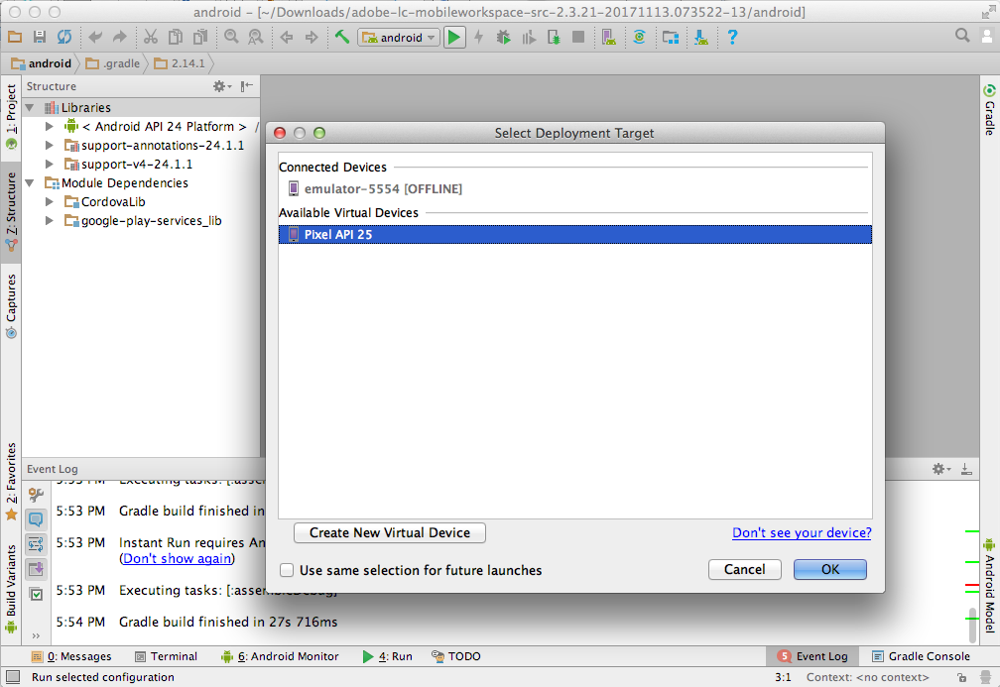

# Richten Sie das Android™-Studio-Projekt ein und erstellen Sie die Android™-App {#set-up-the-android-studio-project-and-build-the-android-app}

Dieser Artikel gilt für das Erstellen der AEM Forms App 6.3.1.1 und höheren Versionen. Informationen zum Erstellen einer App aus dem Quellcode der AEM Forms App 6.3 finden Sie unter [Einrichten des Eclipse-Projekts und Erstellen der Android™-App](/help/forms/using/setup-eclipse-project-build-installer.md).

AEM Forms stellt den vollständigen Quellcode der AEM Forms-App bereit. Die Quelle enthält alle Komponenten, die für eine benutzerdefinierte AEM Forms-App erforderlich sind. Das Quell-Code-Archiv `adobe-lc-mobileworkspace-src-<version>.zip` ist Bestandteil des Pakets `adobe-aemfd-forms-app-src-pkg-<version>.zip` in Software Distribution.

Um die AEM Forms App-Quelle zu erhalten, führen Sie die folgenden Schritte aus:

1. Öffnen Sie [Software Distribution](https://experience.adobe.com/downloads). Zum Anmelden bei Software Distribution benötigen Sie eine Adobe ID.
1. Auswählen **[!UICONTROL Adobe Experience Manager]** im Kopfzeilenmenü verfügbar.
1. Im Abschnitt **[!UICONTROL Filter]**:
   1. Wählen Sie **[!UICONTROL Formulare]** aus der Dropdown-Liste **[!UICONTROL Lösung]** aus.
   2. Wählen Sie die Version aus und geben Sie sie für das Paket ein. Sie können auch die Option **[!UICONTROL Downloads durchsuchen]** verwenden, um die Ergebnisse zu filtern.
1. Wählen Sie den für Ihr Betriebssystem zutreffenden Paketnamen aus und wählen Sie **[!UICONTROL EULA-Bedingungen akzeptieren]** und wählen Sie **[!UICONTROL Herunterladen]**.
1. Öffnen Sie [Package Manager](https://experienceleague.adobe.com/docs/experience-manager-65/administering/contentmanagement/package-manager.html?lang=de) und klicken Sie auf **[!UICONTROL Paket hochladen]**, um das Paket hochzuladen.
1. Wählen Sie das Paket aus und klicken Sie auf **[!UICONTROL Installieren]**.

Die folgende Abbildung zeigt den extrahierten Inhalt von `adobe-lc-mobileworkspace-src-<version>.zip`.

Die folgende Abbildung zeigt die Verzeichnisstruktur des Ordners `android` im Ordner `src` an.

## Standardmäßige AEM Forms-App erstellen {#set-up-the-xcode-project}

1. Führen Sie die folgenden Schritte aus, um ein Projekt in Android™ Studio einzurichten und eine signierende Identität anzugeben:

   Melden Sie sich bei einem Computer an, auf dem Android™ Studio installiert und konfiguriert ist.

1. Kopieren Sie das heruntergeladene Archiv `adobe-lc-mobileworkspace-src-<version>.zip` zu:

   **Für Mac-Benutzer**: `[User_Home]/Projects`

   **Für Windows®-Benutzer**: `%HOMEPATH%\Projects`

   >[!NOTE]
   >
   >Für Windows® wird empfohlen, das Android™-Projekt auf dem Systemlaufwerk zu belassen.

1. Extrahieren Sie das Archiv im folgenden Verzeichnis:

   **Für Mac-Benutzer**: `[User_Home]/Projects/[your-project]`

   **Für Windows®-Benutzer**: `%HOMEPATH%\Projects\[your-project]`

   >[!NOTE]
   >
   >Es wird empfohlen, das extrahierte Android-Projekt auf dem Systemlaufwerk zu belassen, bevor Sie das Projekt in Android™ Studio importieren.

1. Starten Sie Android™ Studio.

   **Für Mac-Benutzer**: Aktualisieren Sie die `local.properties` -Datei im `[User_Home]/Projects/[your-project]/android` und zeigen Sie auf `sdk.dir` zu `SDK` auf Ihrem Desktop.

   **Für Windows®-Benutzer**: Aktualisieren Sie die Datei `local.properties` im Ordner `%HOMEPATH%\Projects\[your-project]\android` und lassen Sie die Variable `sdk.dir` auf den Speicherort `SDK` auf Ihrem Desktop verweisen.

1. Klicken Sie auf **[!UICONTROL Fertig stellen]**, um das Projekt zu erstellen.

   Das Projekt ist im ADT Project Explorer verfügbar.

   

1. Wählen Sie in Android™ Studio **[!UICONTROL Projekt importieren (Eclipse ADT, Gradle, etc.)]**.
1. Wählen Sie im Project Explorer den Stammordner des zu erstellenden Projekts im Textfeld **Stammordner** aus:

   **Für Mac-Benutzer:** [Benutzer_Home]/Projects/MobileWorkspace/src/android

   **Für Windows®-Benutzer:** %HOMEPATH%\Projects\MobileWorkspace\src\android

1. Nachdem das Projekt importiert wurde, wird ein Popup mit der Option zum Aktualisieren des Android™-Plug-ins Gradle angezeigt. Klicken Sie je nach Bedarf auf die entsprechende Schaltfläche.

   

1. Nach dem erfolgreichen Erstellen des Gradle erscheint der folgende Bildschirm. Verbinden Sie das entsprechende Gerät oder den entsprechenden Emulator mit dem System und klicken Sie auf **[!UICONTROL Android™ ausführen]**.

   

1. Android™ Studio zeigt die verbundenen Geräte und verfügbaren Emulatoren an. Wählen Sie das Gerät, auf dem Sie die Anwendung ausführen wollen, und klicken Sie dann auf **OK**.

   

Nachdem Sie das Projekt erstellt haben, haben Sie folgende Möglichkeiten zum Installieren der App mit Android™ Debug Bridge oder Android™ Studio:

### Mit Android™ Debug Bridge {#andriod-debug-bridge}

Sie können die Anwendung über das [Android™ Debug Bridge](https://developer.android.com/tools/adb) mit dem folgenden Befehl:

**Für Mac-Benutzer**: `adb install [User_Home]/Projects/[your-project]/adobe-lc-mobileworkspace-src-[version]/android/build/outputs/apk/android-debug.apk`

**Für Windows®-Benutzer**: `adb install %HOMEPATH%\Projects\[your-project]\adobe-lc-mobileworkspace-src-[version]\android\build\outputs\apk\android-debug.apk`
