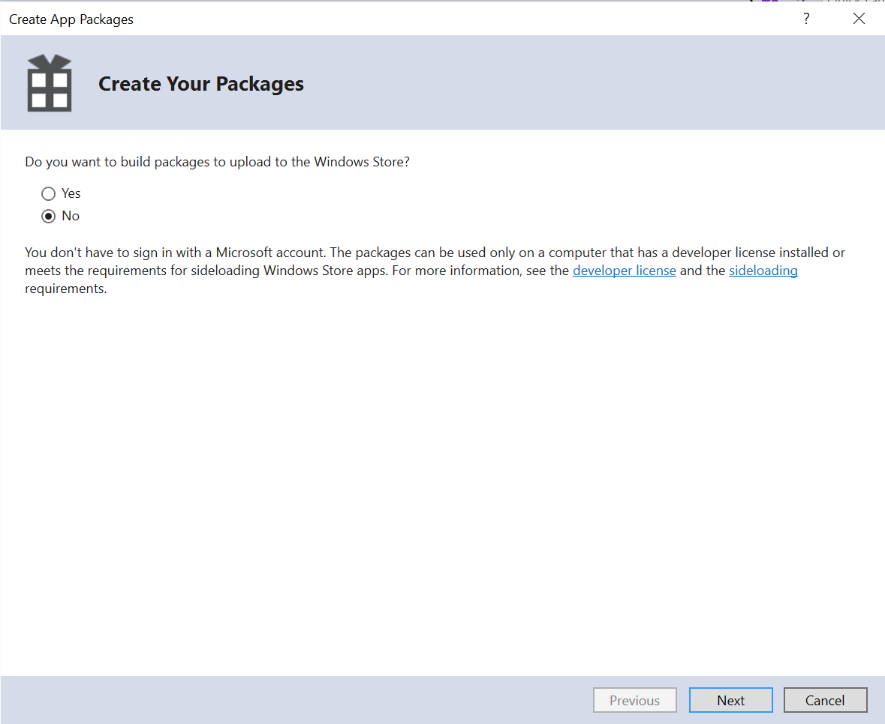

# Einrichten des Visual Studio-Projekts und Erstellen der Windows-App{#set-up-the-visual-studio-project-and-build-the-windows-app}

In AEM Forms wird der vollständige Quellcode der AEM Forms-App bereitgestellt. Die Quelle enthält alle Komponenten, die für eine benutzerdefinierte Workspace-Anwendung erforderlich sind. Das Quellcode-Archiv `adobe-lc-mobileworkspace-src-<version>.zip`ist Teil des `adobe-aemfd-forms-app-src-pkg-<version>.zip`-Pakets auf Softwareverteilung.

Um die AEM Forms App-Quelle zu erhalten, führen Sie die folgenden Schritte aus:

1. Öffnen Sie [Software Distribution](https://experience.adobe.com/downloads). Zum Anmelden bei Software Distribution benötigen Sie eine Adobe ID.
1. Tippen Sie im Kopfzeilenmenü auf **[!UICONTROL Adobe Experience Manager]**.
1. Im Abschnitt **[!UICONTROL Filter]**:
   1. Wählen Sie **[!UICONTROL Formulare]** aus der Dropdown-Liste **[!UICONTROL Lösung]**.
   2. Wählen Sie die Version und den Typ für das Paket aus. Sie können auch die Option **[!UICONTROL Downloads suchen]** verwenden, um die Ergebnisse zu filtern.
1. Tippen Sie auf den Paketnamen für Ihr Betriebssystem, wählen Sie **[!UICONTROL Endbenutzer-Lizenzbedingungen akzeptieren]** und tippen Sie auf **[!UICONTROL Download]**.
1. Öffnen Sie [Package Manager](https://docs.adobe.com/content/help/en/experience-manager-65/administering/contentmanagement/package-manager.html) und klicken Sie auf **[!UICONTROL Paket hochladen]**, um das Paket hochzuladen.
1. Wählen Sie das Paket aus und klicken Sie auf **[!UICONTROL Installieren]**.

1. Um das Quellcode-Archiv herunterzuladen, öffnen Sie `https://<server>:<port>/crx/de/content/forms/mobileapps/src/adobe-lc-mobileworkspace-src-<version>.zip` in Ihrem Browser.\
   Das Quellpaket wird auf Ihr Gerät heruntergeladen.

Die folgende Abbildung zeigt den extrahierten Inhalt von `adobe-lc-mobileworkspace-src-<version>.zip`.

Die folgende Abbildung zeigt die Verzeichnisstruktur des Ordners `windows` im Ordner `src` .

## Einrichten der Umgebung {#setting-up-the-environment}

Für Windows-Geräte benötigen Sie Folgendes:

* Microsoft Windows 8.1 oder Windows 10
* Microsoft Visual Studio 2015
* Microsoft Visual Studio-Tools für Apache Cordova

## Einrichten des Visual Studio-Projekts für die AEM Forms-App {#setting-up-visual-studio-project-for-aem-forms-app}

Führen Sie folgende Schritte durch, um das AEM Forms-App-Projekt in Visual Studio einzurichten:

1. Kopieren Sie das Archiv `adobe-lc-mobileworkspace-src-<version>.zip` in den Ordner `%HOMEPATH%\Projects` auf dem Windows 8.1- oder Windows 10-Gerät, auf dem Visual Studio 2015 installiert und konfiguriert ist.
1. Extrahieren Sie das Archiv im Verzeichnis `%HOMEPATH%\Projects\MobileWorkspace` .
1. Navigieren Sie zum Verzeichnis `%HOMEPATH%\Projects\MobileWorkspace\adobe-lc-mobileworkspace-src-[versionsrc]\windows` .
1. Öffnen Sie die Datei `CordovaApp.sln` in Visual Studio 2015 und erstellen Sie die AEM Forms-App.

## Erstellen der AEM Forms-App {#build-aem-forms-app}

Führen Sie die folgenden Schritte zum Erstellen und Bereitstellen der AEM Forms-App durch:

>[!NOTE]
>
>Im Windows-Dateisystem für die AEM Forms-App gespeicherte Daten werden nicht verschlüsselt. Es wird empfohlen, zur Verschlüsselung von Festplattendaten ein Tool eines Drittanbieters wie die BitLocker Drive-Verschlüsselung von Windows zu verwenden.

1. Wählen Sie in der Visual Studio Standard-Symbolleiste **Release** aus der Dropdown-Liste für den Build-Modus.

1. Wählen Sie je nach Ihrer Plattform Windows-AnyCPU, Windows-x64 oder Windows-x86. Empfohlen wird Windows-AnyCPU.
1. Klicken Sie im Visual Studio Solution Explorer mit der rechten Maustaste auf das Projekt **CordovaApp.Windows** und wählen Sie **Store > AppPackages erstellen**.

   

   Der Assistent zum Erstellen der App-Pakete wird angezeigt.

   Die Installationsprogrammdatei CordovaApp.Windows_3.0.2.0_anycpu.appx wird im Ordner platforms\windows\AppPackages\CordovaApp.Windows_3.0.2.0_anycpu_Test erstellt.

   Wenn der Fehler `Retarget to windows 8.1 required` auftritt, klicken Sie mit der rechten Maustaste auf den Fehler und wählen Sie im Popup-Menü **Retarget To Windows 8.1** aus.

   

1. Wählen Sie im Assistenten zum Erstellen von App-Paketen, ob Sie Ihre App in den Windows Store hochladen möchten, und klicken Sie dann auf **Weiter**.

   

1. Nehmen Sie Änderungen an den Parameter wie der Version und dem Ausgabespeicherort des App-Builds vor wie benötigt.

   

1. Nach Erstellung des Projekts können Sie die App mit folgenden Programmen installieren:

   * Windows PowerShell
   * Visual Studio

   Für das `.appx`-Paket müssen die folgenden Elemente erfolgreich installiert werden:

   1. WinJS-Bibliothek
   1. Stellen Sie sicher, dass das Paket mit einem selbstsignierten Zertifikat oder einem von einer vertrauenswürdigen Stelle signierten öffentlichen Zertifikat, wie etwa VeriSign, geliefert wird.
   1. Entwicklerlizenz

   Das Verzeichnis Platforms\windows\AppPackages\CordovaApp.Windows_3.0.2.0_anycpu_Test enthält die vier Hauptkomponenten:

   1. `.appx` file
   1. Zertifikat (derzeit ein selbstsigniertes Zertifikat von Apache Cordova)
   1. Abhängigkeitsordner
   1. PowerShell-Datei (.ps1-Erweiterung)

## Bereitstellen einer App mit Windows PowerShell  {#deploying-an-app-using-windows-powershell}

Es gibt zwei Möglichkeiten zum Installieren der Anwendung auf einem Windows-Gerät.

### Erwerb der Entwicklerlizenz {#by-acquiring-the-developer-license}

1. Klicken Sie mit der rechten Maustaste auf die PowerShell-Datei ( `Add-AppDevPackage.ps1)`) und wählen Sie **Ausführen mit PowerShell**.

1. Bei der Einrichtung werden Sie dazu aufgefordert, eine Entwicklerlizenz zu erwerben. Verwenden Sie die Microsoft-Kontoanmeldeinformationen zum Erwerben der Entwicklerlizenz.\
   Diese Lizenz ist für 30 Tage gültig, und Sie können Sie kostenlos verlängern.
1. Wenn Sie die Entwicklerlizenz erwerben, installiert das Setupprogramm das selbstsignierte Zertifikat auf dem System und die Anwendung wird erfolgreich installiert.

### Verwenden von unternehmenseigenen Geräten  {#by-using-enterprise-owned-devices}

Für unternehmenseigene Geräte, die in die Unternehmensdomäne eingebunden sind, ist der Erwerb einer Entwicklerlizenz nicht erforderlich.

Unternehmenseigene Geräte verwenden die Professional und Enterprise Edition von Windows.

Microsoft empfiehlt das Installieren eines von einer vertrauenswürdigen Stelle ausgestellten öffentlichen Zertifikats, wie etwa VeriSign.

So stellen Sei die App bereit:

* Stellen Sie sicher, dass das Gerät in die Unternehmensdomäne eingebunden ist.
* Aktivieren Sie die Gruppenrichtlinien-Einstellung.

**So aktivieren Sie die Gruppenrichtlinien-Einstellung:**

1. Führen Sie auf Ihrem Gerät `gpedit.msc` aus.
1. Navigieren Sie zu **Computerkonfiguration > Administrative Vorlagen > Windows-Komponente > Bereitstellung von App-Paketen**.
1. Klicken Sie mit der rechten Maustaste auf **Installation aller vertrauenswürdigen Apps zulassen**.
1. Klicken Sie auf **Bearbeiten** und wählen Sie **Aktiviert**.

1. Klicken Sie auf **OK**.

Bearbeiten Sie das von Visual Studio generierte PowerShell-Skript, um zu verhindern, dass eine Entwicklerlizenz erworben wird.

Legen Sie im PowerShell-Skript die Variable fest: `$NeedDeveloperLicense = $false`.

Für Geräte, die nicht in die Domäne eingebunden sind, ist ein Querladen des Produktaktivierungsschlüssels erforderlich. Diesen können Sie von einem Windows-Händler erwerben.

Für die Windows 8.1 Home Edition gibt es keine Gruppenrichtlinie, ein Querladen innerhalb des Unternehmens ist nicht zulässig und Sie können sie nicht in die Unternehmensdomäne einbinden. Stellen Sie die App mithilfe der Entwicklerlizenz auf einem Gerät mit Windows 8.1 Home Edition bereit.

Klicken Sie [hier](https://blogs.msdn.com/b/mvpawardprogram/archive/2014/03/24/side-loading-deployment-of-windows-store-apps-in-enterprises-step-by-step.aspx), um weitere Informationen zu erhalten.

## Bereitstellen einer App mit Visual Studio  {#deploying-an-app-using-visual-studio}

So installieren Sie die App mit Visual Studio unter Windows:

1. Verbinden Sie das Gerät mithilfe von Remotedebugger.\
   Weitere Informationen finden Sie unter [Ausführen von Windows Store-Apps auf einem Remotecomputer](https://docs.microsoft.com/en-us/visualstudio/debugger/run-windows-store-apps-on-a-remote-machine).

1. Wählen Sie, während Sie die App in Visual Studio geöffnet haben, in der Liste der Lösungsplattformen Windows-x64, Windows-x86 oder Windows-AnyCPU und wählen Sie anschließend **Remotecomputer**.
1. Ihre App wird auf dem Remotecomputer bereitgestellt.
