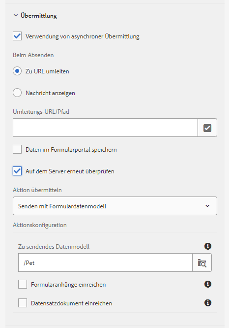

# Standardmäßige Prüffehlermeldungen für adaptive Formulare {#standard-validation-error-messages}

Adaptive Formulare validieren die Eingaben, die Sie in Feldern bereitstellen, basierend auf einem voreingestellten Validierungskriterium. Die Validierungskriterien beziehen sich auf die zulässigen Eingabewerte für Felder in einem adaptiven Formular. Sie können die Überprüfungskriterien auf Grundlage der Datenquelle festlegen, die Sie mit dem adaptiven Formular verwenden. Wenn Sie beispielsweise RESTful-Webdienste als Datenquelle verwenden, können Sie die Überprüfungskriterien in einer Swagger-Definitionsdatei definieren.

Wenn die Eingabewerte die Überprüfungskriterien erfüllen, werden die Werte an die Datenquelle gesendet. Andernfalls wird im adaptiven Formular eine Fehlermeldung angezeigt.

Ähnlich wie bei diesem Ansatz können adaptive Formulare jetzt in benutzerdefinierte Dienste integriert werden, um Datenvalidierungen durchzuführen. Wenn die eingegebenen Werte die Überprüfungskriterien nicht erfüllen und die vom Server zurückgegebene Prüffehlermeldung im Standardmeldungsformat vorliegt, werden die Fehlermeldungen auf Feldebene im Formular angezeigt.

Wenn die Eingabewerte die Überprüfungskriterien nicht erfüllen und die Fehlermeldung zur Servervalidierung nicht im Standardmeldungsformat vorliegt, stellen die adaptiven Formulare einen Mechanismus bereit, mit dem die Prüffehlermeldungen in ein Standardformat umgewandelt werden können, sodass sie auf Feldebene im Formular angezeigt werden. Sie können die Fehlermeldung mit zwei der folgenden Methoden in das Standardformat transformieren:

* hinzufügen benutzerdefinierter Fehlerhandler bei der Übermittlung adaptiver Formulare
* hinzufügen benutzerdefinierter Handler zum Aufrufen einer Dienstaktion mit dem Regeleditor

In diesem Artikel werden das Standardformat für die Prüffehlermeldungen und die Anweisungen zur Konvertierung der Fehlermeldungen von einem benutzerdefinierten in das Standardformat beschrieben.

## Standard-Validierungsfehlerformat {#standard-validation-message-format}

Die adaptiven Formulare zeigen die Fehler auf Feldebene an, wenn die Fehlermeldungen zur Servervalidierung im folgenden Standardformat vorliegen:

```javascript
   {
    errorCausedBy : "SERVER_SIDE_VALIDATION/SERVICE_INVOCATION_FAILURE"
    errors : [
        {
             somExpression  : <somexpr>
             errorMessage / errorMessages : <validationMsg> / [<validationMsg>, <validationMsg>]

        }
    ]
    originCode : <target error Code>
    originMessage : <unstructured error message returned by service>
}
```

wobei:

* `errorCausedBy` beschreibt den Fehlergrund
* `errors` Erwähnung des SOM-Ausdrucks der Felder, bei denen die Validierungskriterien zusammen mit der Prüffehlermeldung fehlgeschlagen sind
* `originCode` enthält den vom externen Dienst zurückgegebenen Fehlercode
* `originMessage` enthält die vom externen Dienst zurückgegebenen Rohfehlerdaten

## Konfigurieren Sie die Übermittlung adaptiver Formulare, um benutzerdefinierte Handler {#configure-adaptive-form-submission} hinzuzufügen.

Wenn die Fehlermeldung zur Servervalidierung nicht im Standardformat angezeigt wird, können Sie die asynchrone Übermittlung aktivieren und einen benutzerdefinierten Fehlerhandler für die Übermittlung des adaptiven Formulars hinzufügen, um die Nachricht in ein Standardformat zu konvertieren.

### Konfigurieren der Übermittlung eines asynchronen adaptiven Formulars {#configure-asynchronous-adaptive-form-submission}

Bevor Sie einen benutzerdefinierten Handler hinzufügen, müssen Sie das adaptive Formular für die asynchrone Übermittlung konfigurieren. Führen Sie die folgenden Schritte aus:

1. Wählen Sie im Authoring-Modus für adaptive Formulare das Objekt &quot;Form Container&quot;aus und tippen Sie auf , um die Eigenschaften zu öffnen.
1. Aktivieren Sie im Abschnitt **[!UICONTROL Submission]** properties **[!UICONTROL Asynchronous submission]**.
1. Wählen Sie **[!UICONTROL Auf Server]** erneut überprüfen, um die Eingabefeldwerte vor dem Senden auf dem Server zu überprüfen.
1. Wählen Sie die Übermittlungsaktion aus:

   * Wählen Sie **[!UICONTROL Mit Formulardatenmodell senden]** und wählen Sie das entsprechende Datenmodell, wenn Sie RESTful-Webdienst-basiertes [Formulardatenmodell](work-with-form-data-model.md) als Datenquelle verwenden.
   * Wählen Sie **[!UICONTROL An REST-Endpunkt senden]** und geben Sie **[!UICONTROL Umleitungs-URL/Pfad]** an, wenn Sie RESTful-Webdienste als Datenquelle verwenden.

   

1. Tippen Sie auf , um die Eigenschaften zu speichern.

### hinzufügen benutzerdefinierter Fehler-Handler bei der Übermittlung des adaptiven Formulars {#add-custom-error-handler-af-submission}

AEM Forms bietet standardmäßig Handler zur Verarbeitung von erfolgreichen und fehlgeschlagenen Formularübermittlungen an. Handler sind clientseitige Funktionen, die anhand der Serverantwort ausgeführt werden. Wenn ein Formular übermittelt wird, werden die Daten zur Validierung an den Server gesendet, der eine Antwort mit Informationen über den Erfolg oder das Fehlschlagen der Übermittlung an den Client zurücksendet. Die Informationen werden als Parameter an den relevanten Handler übergeben, um die Funktion auszuführen.

Führen Sie die folgenden Schritte aus, um beim Senden des adaptiven Formulars einen benutzerdefinierten Fehlerhandler hinzuzufügen:

1. Öffnen Sie das adaptive Formular im Bearbeitungsmodus, wählen Sie ein beliebiges Formularobjekt aus und tippen Sie auf <!---->, um den Regeleditor zu öffnen.
1. Wählen Sie **[!UICONTROL Formular]** in der Struktur „Formularobjekte“ und tippen Sie auf **[!UICONTROL Erstellen]**.
1. Wählen Sie **[!UICONTROL Fehler bei Übermittlung]** aus der Dropdown-Liste Ereignis.
1. Schreiben Sie eine Regel, um die benutzerdefinierte Fehlerstruktur in die Standardfehlerstruktur zu konvertieren, und tippen Sie auf **[!UICONTROL Fertig]**, um die Regel zu speichern.

Im Folgenden finden Sie einen Beispielcode zum Konvertieren einer benutzerdefinierten Fehlerstruktur in die standardmäßige Fehlerstruktur:

```javascript
var data = $event.data;
var som_map = {
    "id": "guide[0].guide1[0].guideRootPanel[0].Pet[0].id_1[0]",
    "name": "guide[0].guide1[0].guideRootPanel[0].Pet[0].name_2[0]",
    "status": "guide[0].guide1[0].guideRootPanel[0].Pet[0].status[0]"
};

var errorJson = {};
errorJson.errors = [];

if (data) {
    if (data.originMessage) {
        var errorData;
        try {
            errorData = JSON.parse(data.originMessage);
        } catch (err) {
            // not in json format
        }

        if (errorData) {
            Object.keys(errorData).forEach(function(key) {
                var som_key = som_map[key];
                if (som_key) {
                    var error = {};
                    error.somExpression = som_key;
                    error.errorMessage = errorData[key];
                    errorJson.errors.push(error);
                }
            });
        }
        window.guideBridge.handleServerValidationError(errorJson);
    } else {
        window.guideBridge.handleServerValidationError(data);
    }
}
```

Die Liste `var som_map` des SOM-Ausdrucks der adaptiven Formularfelder, die Sie in das Standardformat umwandeln möchten. Sie können den SOM-Ausdruck eines beliebigen Felds in einem adaptiven Formular durch Tippen auf das Feld und Auswahl von **[!UICONTROL Ansicht SOM-Ausdruck]** Ansicht haben.

Mit diesem benutzerdefinierten Fehlerhandler konvertiert das adaptive Formular die unter `var som_map` aufgelisteten Felder in das Standardfehlermeldungsformat. Die Prüffehlermeldungen werden daher auf Feldebene im adaptiven Formular angezeigt.

## hinzufügen benutzerdefinierter Handler mit der Aktion &quot;Dienst aufrufen&quot;

Führen Sie die folgenden Schritte aus, um einen Fehlerhandler hinzuzufügen, um eine benutzerdefinierte Fehlerstruktur mithilfe der Aktion [Regel-Editor](rule-editor.md) Dienst aufrufen in die Standardfehlerstruktur zu konvertieren:

1. Öffnen Sie das adaptive Formular im Bearbeitungsmodus, wählen Sie ein beliebiges Formularobjekt aus und tippen Sie auf , um den Regeleditor zu öffnen.
1. Tippen Sie auf **[!UICONTROL Erstellen]**.
1. Erstellen Sie eine Bedingung im Abschnitt **[!UICONTROL Wenn]** der Regel. Beispiel: Wenn[Name des Felds] geändert wird. Wählen Sie **[!UICONTROL aus der Dropdown-Liste**[!UICONTROL  Status ]**auswählen, um diese Bedingung zu erreichen.]**
1. Im Abschnitt **[!UICONTROL Dann]** wählen Sie **[!UICONTROL Dienst aufrufen]** aus der Dropdown-Liste **[!UICONTROL Aktion auswählen.]**
1. Wählen Sie im Abschnitt **[!UICONTROL Eingabe]** einen Post-Dienst und die zugehörigen Datenbindungen aus. Wenn Sie beispielsweise die Felder **Name**, **ID** und **Status** im adaptiven Formular validieren möchten, wählen Sie einen Post-Dienst (Begleiter) aus und wählen Sie im Abschnitt **[!UICONTROL Eingabe]** die Optionen &quot;pet.name&quot;, &quot;pet.id&quot;und &quot;pet.status&quot;aus.

Aufgrund dieser Regel werden die Werte, die Sie für die Felder **Name**, **ID** und **Status** eingeben, validiert, sobald das in Schritt 2 definierte Feld geändert wird und Sie die Tabulatortaste aus dem Feld im Formular verlassen.

1. Wählen Sie **[!UICONTROL Code-Editor]** aus der Dropdown-Liste &quot;Modusauswahl&quot;.
1. Tippen Sie auf **[!UICONTROL Code bearbeiten]**.
1. Löschen Sie die folgende Zeile aus dem vorhandenen Code:

   ```javascript
   guidelib.dataIntegrationUtils.executeOperation(operationInfo, inputs, outputs);
   ```

1. Schreiben Sie eine Regel, um die benutzerdefinierte Fehlerstruktur in die Standardfehlerstruktur zu konvertieren, und tippen Sie auf **[!UICONTROL Fertig]**, um die Regel zu speichern.
Fügen Sie beispielsweise am Ende den folgenden Beispielcode hinzu, um eine benutzerdefinierte Fehlerstruktur in die Standardfehlerstruktur zu konvertieren:

   ```javascript
   var errorHandler = function(jqXHR, data) {
   var som_map = {
       "id": "guide[0].guide1[0].guideRootPanel[0].Pet[0].id_1[0]",
       "name": "guide[0].guide1[0].guideRootPanel[0].Pet[0].name_2[0]",
       "status": "guide[0].guide1[0].guideRootPanel[0].Pet[0].status[0]"
   };
   
   
   var errorJson = {};
   errorJson.errors = [];
   
   if (data) {
       if (data.originMessage) {
           var errorData;
           try {
               errorData = JSON.parse(data.originMessage);
           } catch (err) {
               // not in json format
           }
   
           if (errorData) {
               Object.keys(errorData).forEach(function(key) {
                   var som_key = som_map[key];
                   if (som_key) {
                       var error = {};
                       error.somExpression = som_key;
                       error.errorMessage = errorData[key];
                       errorJson.errors.push(error);
                   }
               });
           }
           window.guideBridge.handleServerValidationError(errorJson);
       } else {
           window.guideBridge.handleServerValidationError(data);
       }
     }
   };
   
   guidelib.dataIntegrationUtils.executeOperation(operationInfo, inputs, outputs, null, errorHandler);
   ```

   Die Liste `var som_map` des SOM-Ausdrucks der adaptiven Formularfelder, die Sie in das Standardformat umwandeln möchten. Sie können den SOM-Ausdruck eines beliebigen Felds in einem adaptiven Formular durch Tippen auf das Feld und Auswahl von **[!UICONTROL Ansicht SOM-Ausdruck]** aus dem Menü **[!UICONTROL Mehr Optionen]** (...) Ansicht.

   Stellen Sie sicher, dass Sie die folgende Zeile des Beispielcodes in den benutzerdefinierten Fehlerhandler kopieren:

   ```javascript
   guidelib.dataIntegrationUtils.executeOperation(operationInfo, inputs, outputs, null, errorHandler);
   ```

   Die executeOperation-API enthält die Parameter `null` und `errorHandler`, basierend auf dem neuen benutzerdefinierten Fehlerhandler.

   Mit diesem benutzerdefinierten Fehlerhandler konvertiert das adaptive Formular die unter `var som_map` aufgelisteten Felder in das Standardfehlermeldungsformat. Die Prüffehlermeldungen werden daher auf Feldebene im adaptiven Formular angezeigt.