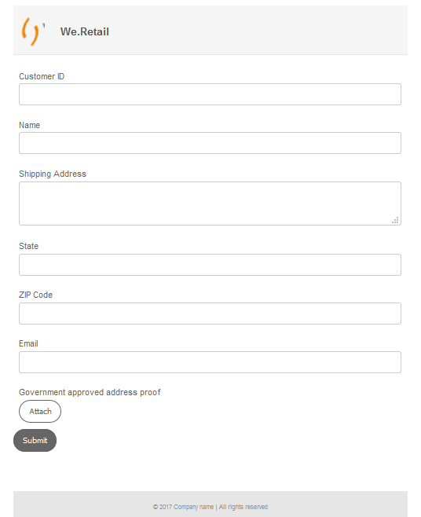

# Gestalten eines adaptiven Formulars {#do-not-publish-style-your-adaptive-form}

Erfahren Sie, wie Sie ein benutzerdefiniertes Design erstellen, individuelle Komponenten gestalten und Web Fonts in einem Design verwenden.

Dieses Tutorial ist ein Teil der Serie [Erstellen Ihres ersten adaptives Formulars](https://helpx.adobe.com/de/experience-manager/6-3/forms/using/create-your-first-adaptive-form.html). Adobe empfiehlt, der Reihe chronologisch zu folgen, um den gesamten Anwendungsfall des Tutorials zu verstehen, auszuführen und praktisch zu erleben.

## Über das Tutorial  {#about-the-tutorial}

Mithilfe von Designs können Sie ein adaptives Formular mit einem unverwechselbaren Erscheinungsbild und Stil versehen. Sie haben die Möglichkeit, im adaptiven Formulareditor vorkonfigurierte Designs anzuwenden oder eigene benutzerdefinierte Designs zu erstellen. AEM [!DNL Forms] bietet einen [Design-Editor](https://helpx.adobe.com/de/experience-manager/6-3/forms/using/themes.html) zum Erstellen benutzerdefinierter Designs. Über ein einziges Design kann ein und dasselbe adaptive Formular verschiedene Erscheinungsbilder erhalten, je nachdem, ob es auf einem Mobilgerät, Tablet oder Desktop geöffnet wird. CSS- oder LESS-Vorkenntnisse sind für die Nutzung des Design-Editors zwar nicht erforderlich, aber wünschenswert.

Am Ende des Tutorials sollten Sie zu Folgendem in der Lage sein:

* Anwenden eines vorkonfigurierten Designs auf ein adaptives Formular
* Erstellen eines Designs für ein adaptives Formular mit dem Design-Editor
* Gestalten einzelner Komponenten
* Bonusabschnitt: Verwenden von Web Fonts in einem benutzerdefinierten Design

Ihr Formular sollte nach Abschluss des Tutorials etwa wie folgt aussehen:

## Bevor Sie beginnen {#before-you-start}

Laden Sie die unten bereitgestellten Header-Stile und Logobilder auf Ihren lokalen Computer herunter. Die Kopfzeile des adaptiven Formulars `shipping-address-add-update-form` verwendet die kopfzeilenartigen und Logo-Bilder. Das kopfzeilenartige Bild erscheint auf der rechten Seite der Kopfzeile.

[Datei abrufen](assets/header-style.png)

[Datei abrufen](assets/logo-1.png)

## Schritt 1: Anwenden eines Designs auf Ihr adaptives Formular {#step-apply-a-theme-to-your-adaptive-form}

Der Editor für adaptive Formulare bietet mehrere vorkonfigurierte Designs. Wenn Sie keinen benutzerdefinierten Stil für Ihr adaptives Formular verwenden möchten, können Sie Ihre adaptiven Formulare auch mit einem der vorkonfigurierten Designs veröffentlichen. Designs sind unabhängig von adaptiven Formularen. Sie können dasselbe Design auf mehrere adaptive Formulare anwenden.

**So wenden Sie ein Design auf Ihr adaptives Formular an:**

1. Öffnen Sie das adaptive Formular zum Bearbeiten.

   [http://localhost:4502/editor.html/content/forms/af/shipping-address-add-update-form.html](http://localhost:4502/editor.html/content/forms/af/shipping-address-add-update-form.html)

1. Öffnen Sie die Eigenschaften des **[!UICONTROL Containers für adaptive Formulare]**. Navigieren Sie im Eigenschaften-Browser zu **[!UICONTROL Allgemein]** > **[!UICONTROL Adaptives Formulardesign]**. Das Feld **[!UICONTROL Adaptives Formulardesign]** listet alle vordefinierten und benutzerdefinierten Designs auf. Standardmäßig wird das Canvas-Design angewendet.
1. Wählen Sie ein Design aus dem Feld **[!UICONTROL Adaptives Formulardesign]** aus, z. B. für **Umfragen**. Wählen Sie  aus, damit Sie das ausgewählte Design anwenden können.

   

   **Abbildung:** *Adaptives Formular mit dem Standard-Design*

   

   **Abbildung:** *Adaptives Formular mit dem Umfragedesign*

## Schritt 2: Aktualisieren Ihres adaptiven Formulars {#step-update-your-adaptive-form}

Das oben angezeigte Design erfordert Änderungen am Platzhaltertext und Logo des vorhandenen adaptiven Formulars.

**So aktualisieren Sie Ihr adaptives Formular:**

1. Ändern Sie das vorhandene Logo und den Text in der Kopfzeile. So entfernen Sie das Logo:

   1. Öffnen Sie das Formular im Formulareditor.

      [http://localhost:4502/editor.html/content/forms/af/shipping-address-add-update-form.html](http://localhost:4502/editor.html/content/forms/af/shipping-address-add-update-form.html)

   1. Wählen Sie das Logo-Bild in der Komponente [!UICONTROL Kopfzeile] und anschließend  **[!UICONTROL Eigenschaften]** aus. Wählen Sie in der Eigenschaft [!UICONTROL Bild] das X aus, um das vorhandene Logo-Bild zu entfernen.
   1. Wählen Sie **[!UICONTROL Hochladen]**, „logo.png“ und dann  aus, um die Änderungen zu speichern. Das Bild wurde im Abschnitt [Bevor Sie beginnen](/help/forms/using/style-your-adaptive-form.md#before-you-start) heruntergeladen.
   1. Wählen Sie den Kopfzeilentext, `We.Retail` und anschließend  **[!UICONTROL Bearbeiten]** aus. Ändern des Kopfzeilentextes in `we retail`. Anwenden der Fettformatierung nur auf `we`in `we retail`.

      

1. Entfernen Sie Titel und fügen Sie Platzhaltertext hinzu:

   1. Wählen Sie das Feld „Kunden-ID“ und anschließend  „Eigenschaften“ aus.
   1. Kopieren Sie den Inhalt des Felds **[!UICONTROL Titel]** in das Feld **[!UICONTROL Platzhaltertext]**.
   1. Löschen Sie den Inhalt des Felds **[!UICONTROL Titel]** und wählen Sie  aus.
   1. Wiederholen Sie die vorherigen drei Schritte für alle Textfelder, das numerische Feld und das E-Mail-Feld im Formular.

      

## Schritt 3: Erstellen eines benutzerdefinierten Designs für Ihr adaptives Formular {#step-create-a-custom-theme-for-your-adaptive-form}

Sie können den [Design-Editor](/help/forms/using/themes.md) verwenden, um benutzerdefinierte Designs zu erstellen. Der Design-Editor ist ein leistungsstarker WYSIWYG-Editor. Er bietet eine visuelle Methode, um CSS auf verschiedene Komponenten eines adaptiven Formulars anzuwenden. Der Editor stellt genauere Steuerelemente zum Gestalten von Komponenten und Panels eines adaptiven Formulars bereit.

Ein Design ist eine separate Entität, so wie adaptive Formulare. Es enthält Stile (CSS) für die Komponenten und Panels eines adaptiven Formulars. Die Stile umfassen Eigenschaften wie Hintergrundfarben, Statusfarben, Transparenz, Ausrichtung und Größe. Wenn Sie ein Design anwenden, wird der angegebene Stil auf die entsprechenden Komponenten eines adaptiven Formulars angewendet.

Im Rahmen dieses Tutorials gestalten Sie Kopf- und Fußzeilen, Text- und numerische Komponenten, Anhangskomponenten sowie Schaltflächen. Erstellen wir zunächst ein Design.

### Erstellen von Designs {#create-a-theme}

1. Melden Sie sich bei der AEM-Autoreninstanz an und navigieren Sie zu **[!UICONTROL Adobe Experience Manager]** > **[!UICONTROL Formulare]** > **[!UICONTROL Designs]**. Die Standard-URL lautet [http://localhost:4502/aem/forms.html/content/dam/formsanddocuments-themes](http://localhost:4502/aem/forms.html/content/dam/formsanddocuments-themes).
1. Wählen Sie **[!UICONTROL Erstellen]** und dann **[!UICONTROL Design]** aus. Die Seite [!UICONTROL Design erstellen] mit den Feldern zum Erstellen eines Designs wird angezeigt. Die Felder **[!UICONTROL Titel]** und **[!UICONTROL Name]** sind obligatorisch.

   * **Titel:** Geben Sie einen Titel für das Design an. Zum Beispiel: **Globales Design.** Der Titel hilft Ihnen, das Design in der Liste der Designs zu identifizieren.
   * **Name**: Geben Sie den Namen des Designs an. Beispiel: **Globales-Design.** Im Repository wird ein Knoten mit dem angegebenen Namen erstellt. Wenn Sie mit der Eingabe des Titels beginnen, wird automatisch ein Wert für das Feld „Name“ vorgeschlagen. Sie können den vorgeschlagenen Wert gegebenenfalls ändern. Im Feld „Name“ dürfen nur alphanumerische Zeichen, Bindestriche und Unterstriche eingegeben werden. Alle ungültigen Eingaben werden durch Bindestriche ersetzt.

1. Wählen Sie **[!UICONTROL Erstellen]** aus. Ein Design wird erstellt und es wird ein Dialogfeld zum Öffnen des Formulars zur Bearbeitung angezeigt. Wählen Sie **[!UICONTROL Öffnen]** aus, um das neu erstellte Design in einer neuen Registerkarte zu öffnen. Das Design wird im Design-Editor geöffnet. Zum Festlegen des Designs verwendet der Design-Editor ein sofort einsatzbereites adaptives Formular, das mit AEM [!DNL Forms] mitgeliefert wird.

   Informationen zur Verwendung der Benutzeroberfläche des Design-Editors finden Sie unter [Informationen zum Design-Editor](/help/forms/using/themes.md#aboutthethemeeditor).

1. Wählen Sie **[!UICONTROL Design-Optionen]**  > **[!UICONTROL Konfigurieren]** aus. Wählen Sie im Feld **[!UICONTROL Vorschauformular]** das adaptive Formular **shipping-address-add-update-form**,  und dann **[!UICONTROL Speichern]** aus. Jetzt ist der Design-Editor konfiguriert, sodass Sie Ihr eigenes adaptives Formular anstelle des adaptiven Standardformulars benutzen können. Wählen Sie **[!UICONTROL Abbrechen]** aus, um zum Design-Editor zurückzukehren.

   

   **Abbildung:** *Design-Editor mit dem adaptiven Formular „shipping-address-add-update-form“*

   

   **Abbildung:** *Adaptives Formular mit dem Standardformular*

### Gestalten einer Kopf- und Fußzeile {#style-header-and-footer}

Kopf- und Fußzeile bieten ein konsistentes und unverwechselbares Erscheinungsbild für ein adaptives Formular. Im Allgemeinen enthält die Kopfzeile das Logo und den Namen der Organisation, während die Fußzeile Copyright-Informationen enthält. Diese Angaben bleiben in unterschiedlichen Formularen einer Organisation identisch. So gestalten Sie die Kopf- und Fußzeile des adaptiven Formulars „shipping-address-add-update-form“:

1. Navigieren Sie zur Option **[!UICONTROL Kopfzeile]** > **[!UICONTROL Text]** im Bedienfeld „Selektoren“. Das Bedienfeld „Selektoren“ befindet sich auf der linken Seite des Design-Editors. Wenn das Bedienfeld nicht sichtbar ist, wählen Sie  – „Seitliches Bedienfeld ein/aus“ aus.

1. Legen Sie die folgenden Eigenschaften im Akkordeon **[!UICONTROL Text]** fest und wählen Sie  aus.

   | Eigenschaft | Wert |
   |---|---|
   | Schriftfamilie | Arial® |
   | Schriftfarbe | FFFFFF |
   | Schriftgrad | 54 px |

1. Wählen Sie das Widget [!UICONTROL Kopfzeile] und dann **[!UICONTROL Kopfzeile]** aus. Die Optionen zum Formatieren des Kopfzeilen-Widgets werden auf der linken Seite angezeigt. Erweitern Sie das Akkordeon **[!UICONTROL Abmessungen und Position]**, legen Sie für die **[!UICONTROL Höhe]** die Option `120px` fest und wählen Sie  aus.
1. Erweitern Sie das Akkordeon **[!UICONTROL Hintergrund]** des Kopfzeilen-Widgets und legen Sie für die **[!UICONTROL Hintergrundfarbe]** die Option `F6921E.` fest.

   Bewegen Sie den Mauszeiger über **[!UICONTROL Bild und Verlauf]** > **[!UICONTROL + Hinzufügen]** und wählen Sie **[!UICONTROL Bild]** aus. Legen Sie die folgenden Eigenschaften fest und wählen Sie  aus.

   | Eigenschaft | Wert |
   |---|---|
   | image | Laden Sie die Datei „header-style.png“ hoch. Das Bild wurde im Abschnitt [Bevor Sie beginnen](/help/forms/using/style-your-adaptive-form.md#before-you-start) heruntergeladen. |
   | Position | Rechts unten |
   | Kachelung | Keine Wiederholung |

1. Wählen Sie im Design-Editor das Logo in der Kopfzeile und **[!UICONTROL Kopfzeilen-Logo]** aus. Erweitern Sie das Akkordeon „Abmessungen und Position“, legen Sie die folgenden Eigenschaften fest und wählen Sie  aus.

   <table> 
    <tbody> 
     <tr> 
      <td><b>Rand</b></td> 
      <td><b>Wert</b></td> 
     </tr> 
     <tr> 
      <td>Rand</td> 
      <td> 
       <ul> 
        <li>Oben: 1,5 rem</li> 
        <li>Unten: -35 px</li> 
        <li>Links: 1rem<strong>  </strong></li> 
       </ul> 
<strong>Tipp:</strong> Wählen Sie das Link-Symbol , um einen anderen Wert für jedes Feld anzugeben.  
 </td> 
     </tr> 
     <tr> 
      <td>Höhe</td> 
      <td>4.75 rem</td> 
     </tr> 
    </tbody> 
   </table>

1. Wählen Sie das Fußzeilen-Widget und dann **[!UICONTROL Fußzeile]** aus. Erweitern Sie das Akkordeon für den **[!UICONTROL Hintergrund]**, legen Sie für die **[!UICONTROL Hintergrundfarbe]** `F6921E` fest und wählen Sie .

### Gestalten der Datenerfassungskomponente und Anwenden eines Hintergrunds auf das adaptive Formular {#style-the-data-capture-component-and-apply-a-background-to-the-adaptive-form}

Sie können mehrere Komponenten in einem adaptiven Formular verwenden, um Daten zu erfassen,  zum Beispiel ein Textfeld und ein numerisches Feld. Sie können für alle Datenerfassungskomponenten einen identischen Stil bereitstellen oder jeder Komponente einen eigenen Stil zuweisen.  In diesem Lernprogramm wird ein identischer Stil auf numerische Felder (Kunden-ID, Postleitzahl) und Textfelder (Kunden-ID, Name, Lieferadresse, Status, E-Mail) angewendet. So gestalten Sie die Datenerfassungskomponenten:

1. Wählen Sie das Feld **[!UICONTROL Kunden-ID]** und dann die Option **[!UICONTROL Feld-Widget]**. Legen Sie die folgenden Eigenschaften fest und wählen Sie .

   <table> 
    <tbody> 
     <tr> 
      <td><b>Akkordeon</b></td> 
      <td><b>Eigenschaft</b></td> 
      <td><b>Wert</b></td> 
     </tr> 
     <tr> 
      <td>Rahmen</td> 
      <td>Rahmenfarbe</td> 
      <td>A7A9AC</td> 
     </tr> 
     <tr> 
      <td>Rahmen</td> 
      <td>Rahmenradius </td> 
      <td> 
       <ul> 
        <li>Oben: 7 px  </li> 
        <li>Rechts: 7 px  </li> 
        <li>Unten: 7 px  </li> 
        <li>Links: 7 px  </li> 
       </ul> </td> 
     </tr> 
     <tr> 
      <td>Text</td> 
      <td>Schriftfamilie</td> 
      <td>Arial®</td> 
     </tr> 
     <tr> 
      <td>Text</td> 
      <td>Schriftfarbe</td> 
      <td>939598  </td> 
     </tr> 
     <tr> 
      <td>Text</td> 
      <td>Schriftgrad</td> 
      <td>18 px</td> 
     </tr> 
     <tr> 
      <td>Dimensionen und Position</td> 
      <td>Breite</td> 
      <td>60%</td> 
     </tr> 
     <tr> 
      <td>Dimensionen und Position</td> 
      <td>Rand</td> 
      <td> 
       <ul> 
        <li>Links: 10 rem</li> 
       </ul> </td> 
     </tr> 
    </tbody> 
    </table>

1. Wählen Sie zunächst den leeren Bereich über dem Feld **[!UICONTROL Kunden-ID]** und dann **[!UICONTROL Container für responsives Panel]**. Legen Sie den **[!UICONTROL Hintergrund]** > **[!UICONTROL Hintergrundfarbe]** auf F1F2F2 fest. Wählen Sie  aus.

   

### Gestalten Sie die Schaltflächen {#style-the-buttons}

Sie können ein benutzerdefiniertes Design verwenden, um allen Schaltflächen des adaptiven Formulars einen identischen Stil zuzuweisen, bzw. einen [Inline-Stil](/help/forms/using/inline-style-adaptive-forms.md), um einen Stil einer bestimmten Schaltfläche zuzuweisen. So gestalten Sie die Schaltflächen:

1. Wählen Sie die Schaltfläche **[!UICONTROL Senden]** und dann **[!UICONTROL Option]** aus. Legen Sie die folgenden Eigenschaften fest und wählen Sie  aus.

   <table> 
    <tbody> 
     <tr> 
      <td><b>Akkordeon</b></td> 
      <td><b>Eigenschaft</b></td> 
      <td><b>Wert</b></td> 
     </tr> 
     <tr> 
      <td>Hintergrund</td> 
      <td>Hintergrundfarbe</td> 
      <td>F6921E</td> 
     </tr> 
     <tr> 
      <td>Rahmen  </td> 
      <td>Rahmenfarbe</td> 
      <td>F6921E</td> 
     </tr> 
     <tr> 
      <td>Rahmen</td> 
      <td>Rahmenradius </td> 
      <td> 
       <ul> 
        <li>Oben: 7 px  </li> 
        <li>Rechts: 7 px  </li> 
        <li>Unten: 7 px  </li> 
        <li>Links: 7 px</li> 
       </ul> </td> 
     </tr> 
     <tr> 
      <td>Text  </td> 
      <td>Schriftfamilie</td> 
      <td>Arial®</td> 
     </tr> 
     <tr> 
      <td>Text</td> 
      <td>Schriftfarbe</td> 
      <td>FFFFFF</td> 
     </tr> 
     <tr> 
      <td>Text</td> 
      <td>Schriftgrad</td> 
      <td>18 px</td> 
     </tr> 
    </tbody> 
   </table>

1. [Wenden Sie das benutzerdefinierte Design](/help/forms/using/style-your-adaptive-form.md#step-apply-a-theme-to-your-adaptive-form) „Globales Design“ auf Ihr adaptives Formular an. Wenn der Stil das adaptive Formular nicht widerspiegelt, bereinigen Sie den Browser-Cache und versuchen Sie es erneut. 

   

## Schritt 4: Gestalten einzelner Komponenten {#step-style-individual-components}

Einige Stile gelten nur für eine bestimmte Komponente. Diese Komponenten werden im Editor für adaptive Formulare formatiert.

1. Öffnen Sie Ihr adaptives Formular zum Bearbeiten. [http://localhost:4502/editor.html/content/forms/af/shipping-address-add-update-form.html](http://localhost:4502/editor.html/content/forms/af/change-billing-shipping-address.html)
1. Wählen Sie in der oberen Leiste die Option **[!UICONTROL Stil]**.

   

1. Wählen Sie die Schaltfläche **[!UICONTROL Anhängen]** und dann das Symbol  aus. Stellen Sie die folgenden Eigenschaften im Akkordeon **[!UICONTROL Abmessungen und Position]** ein:

   | Eigenschaft | Wert |
   |---|---|
   | Fließkommazahl | Linksbündig |
   | Breite | 10% |

1. Wählen Sie die Option **[!UICONTROL Von Behörden anerkannter Adressnachweis]** und dann das Symbol  aus. Legen Sie die folgenden Eigenschaften fest:

   <table> 
    <tbody> 
     <tr> 
      <td><b>Akkordeon</b></td> 
      <td><b>Eigenschaft</b></td> 
      <td><b>Wert</b></td> 
     </tr> 
     <tr> 
      <td>Abmessungen und Position</td> 
      <td>Gleitkomma</td> 
      <td>Linksbündig</td> 
     </tr> 
     <tr> 
      <td>Abmessungen und Position</td> 
      <td>Breite</td> 
      <td>73%</td> 
     </tr> 
     <tr> 
      <td>Abmessungen und Position</td> 
      <td>Padding</td> 
      <td> 
       <ul> 
        <li>Links: 10 px</li> 
       </ul> </td> 
     </tr> 
     <tr> 
      <td>Abmessungen und Position</td> 
      <td>Höhe</td> 
      <td>40 px</td> 
     </tr> 
     <tr> 
      <td>Abmessungen und Position  </td> 
      <td>Rand</td> 
      <td>  
       <ul> 
        <li>Rechts: 2 rem</li> 
        <li>Links: 10 rem </li> 
       </ul> </td> 
     </tr> 
     <tr> 
      <td>Hintergrund</td> 
      <td>Hintergrundfarbe</td> 
      <td>FFFFFF</td> 
     </tr> 
     <tr> 
      <td>Rahmen</td> 
      <td>Rahmenbreite</td> 
      <td>1 px</td> 
     </tr> 
     <tr> 
      <td>Rahmen</td> 
      <td>Rahmenstil</td> 
      <td>Durchgehend</td> 
     </tr> 
     <tr> 
      <td>Rahmen</td> 
      <td>Rahmenfarbe</td> 
      <td>A7A9AC</td> 
     </tr> 
     <tr> 
      <td>Rahmen</td> 
      <td>Rahmenradius</td> 
      <td>7 px</td> 
     </tr> 
     <tr> 
      <td>Text</td> 
      <td>Schriftfamilie</td> 
      <td>Arial®</td> 
     </tr> 
     <tr> 
      <td>Text</td> 
      <td>Schriftfarbe</td> 
      <td>BCBEC0</td> 
     </tr> 
     <tr> 
      <td>Text</td> 
      <td>Schriftgrad</td> 
      <td>18 px</td> 
     </tr> 
     <tr> 
      <td>Text</td> 
      <td>Zeilenhöhe</td> 
      <td>2</td> 
     </tr> 
     </tr> 
    </tbody> 
   </table>

1. Wählen Sie die Schaltfläche **[!UICONTROL Senden]** und dann das Symbol  aus. Legen Sie die folgenden Eigenschaften fest:

   <table> 
    <tbody> 
     <tr> 
      <td><b>Akkordeon</b></td> 
      <td><b>Eigenschaft</b></td> 
      <td><b>Wert</b></td> 
     </tr> 
     <tr> 
      <td>Dimensionen und Position</td> 
      <td>Fließkommazahl</td> 
      <td>Rechtsbündig</td> 
     </tr> 
     <tr> 
      <td>Dimensionen und Position</td> 
      <td>Rand</td> 
      <td> 
       <ul> 
        <li>Oben: 5 rem</li> 
        <li>Rechts: 14 rem</li> 
        <li>Unten: 20 px</li> 
        <li>Links: 20 px  </li> 
       </ul> </td> 
     </tr> 
     <tr> 
      <td>Hintergrund</td> 
      <td>Hintergrundfarbe</td> 
      <td>F6921E</td> 
     </tr> 
     <tr> 
      <td>Rahmen</td> 
      <td>Rahmenfarbe</td> 
      <td>F6921E</td> 
     </tr> 
    </tbody> 
   </table>

   

## Schritt 5: Bonusabschnitt: Verwenden von Web Fonts in einem benutzerdefinierten Design {#step-bonus-section-using-web-fonts-in-a-custom-theme}

Sie können verschiedene Schriftarten verwenden, um ein adaptives Formular zu entwerfen. Möglicherweise sind die Schriftarten, die zum Entwerfen des adaptiven Formulars verwendet werden, nicht auf allen Geräten vorhanden, auf denen das adaptive Formular angezeigt wird. Sie können einen Webfont-Dienst verwenden, um die benötigten Schriftarten auf dem Zielgerät bereitzustellen.

[!DNL Adobe Fonts] ist solch ein Webfont-Dienst. Sie können den Dienst mit adaptiven Formularen konfigurieren und verwenden. So verwenden Sie [!DNL Adobe Fonts] in einem adaptiven Formular:
1. Durchsuchen Sie die [Bibliothek mit Adobe-Schriftarten](https://fonts.adobe.com/) und wählen Sie die Schriftart, um Ihr Formular zu gestalten.
<!--
>[!NOTE]
>
> [!DNL Typekit] is now called Adobe Fonts and is included with Creative Cloud and other subscriptions. [Learn more](https://fonts.adobe.com/).-->

>[!NOTE]
>
> Sie können Tags oder Filter hinzufügen, um die Liste der Schriftarten zu verfeinern.

1. Klicken Sie auf die Schaltfläche &lt;/>, um die Familie zu einem Webprojekt hinzuzufügen, falls Sie eine Schriftart finden.

   

   Der Bildschirm &quot;Schriftarten zu einem Webprojekt hinzufügen&quot;wird angezeigt.

   >[!NOTE]
   >
   > Sie können Ihrem Webprojekt nur Schriftarten hinzufügen, wenn die Schaltfläche &lt;/> verfügbar ist.

2. Benennen Sie Ihr Webprojekt.
3. Aktivieren Sie die Kontrollkästchen, um die Schriftgewichtung und -stile auszuwählen, die Sie einbeziehen möchten.

   

4. Auswählen **Klicks** , um das Projekt zu erstellen.
5. Kopieren Sie den Einbettungscode und die URL aus dem Bildschirm.
   

6. Klicks **Fertig** , um das Webprojektfenster zu schließen.
7. Melden Sie sich bei Ihrer AEM-Instanz an und navigieren Sie zur URL `http://server:port/crx/de/index.jsp#`
8. Erstellen Sie eine Ordnerstruktur in CRXDE, beispielsweise `/apps/[fontslibrary]/[customlibrary(clientlibrary)]`.
9. Navigieren Sie zur neu erstellten `clientlibs` und fügen Sie den `allowProxy` und `categories` Eigenschaften.
10. Navigieren Sie zu `/apps/[fontslibrary]/[customlibrary(clientlibrary)]` und erstellen Sie einen css-Ordner.
11. Gehen Sie zum erstellten CSS-Ordner und erstellen Sie eine Datei. Erstellen Sie beispielsweise eine Datei als `fonts.css` und fügen Sie den Einbettungscode zusammen mit der URL ein.
   
12. Speichern Sie die Änderungen.

>[!NOTE]
>
> Um die hinzugefügten benutzerdefinierten Schriftarten in einem adaptiven Formular zu verwenden, stellen Sie sicher, dass der Client-Bibliotheksname in der **[!UICONTROL Client-Bibliothekskategorie]** entspricht dem in der Kategorieoption des Ordners clientlib angegebenen Namen.

Die eingeschlossenen Schriftarten sind jetzt für das adaptive Formular über die folgende benutzerdefinierte Schriftarten-Client-Bibliothek verfügbar.

<!--
Create Adobe Fonts Configuration

1. To create a API Token, go to **login** > **API Token** > **Make me a new API token**.

   

2. Once, you click **Make me a new API token**, a new token is generated. 
3. Copy the generated token for future use.
4. Now login to your AEM  author instance. On the author instance, go to **[!UICONTROL Tools]**>**[!UICONTROL Cloud Services]**> **[!UICONTROL Adobe Fonts]**.
5. Select the configuration container and click **Create**. **[UICONTROL Create Adobe Fonts Configuration]** screen appears.
    

6. Spceify the name and paste the API token in the **[!UICONTROL Kit ID]** textbox.
7. Click **Create**.

The fonts added to the **[!UICONTROL Adobe Fonts]** are available for selection in the **[!UICONTROL Text]** accordion of all the components.
1. In the theme editor, navigate to **[!UICONTROL Theme Options]**  > **[!UICONTROL Configure]**. 
2. In the **[!UICONTROL Adobe Fonts Configuration]** field, select the kit, and click **[!UICONTROL Save]**.

1. Create an [Adobe Fonts](https://fonts.adobe.com/?ref=tk.com) account, create a kit, add font Myriad Pro to the kit, publish the kit, and obtain the Kit ID. It is required to use [!DNL Adobe Fonts] (Web Fonts) in an adaptive form. 
1. In the AEM [!DNL Forms] Server, navigate to  **[!UICONTROL Adobe Experience Manager]** > **[!UICONTROL Tools]**  > **[!UICONTROL Adobe Fonts]**. Now, open a configuration folder. If a configuration is already available, click the **[!UICONTROL Create]** button to create an instance.

   On the Create Configuration dialog, specify a **Title** for the configuration, and click **[!UICONTROL Create]**. You are redirected to the configuration page. In the [!UICONTROL Edit Component] dialog that appears, provide your **Kit ID** and click **[!UICONTROL OK]**. -->

