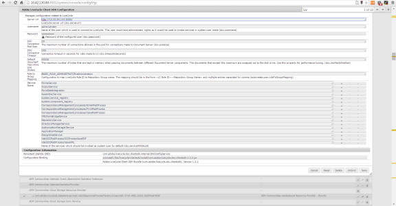

# Nachbearbeitung von Briefen und interaktiver Kommunikation{#post-processing-of-letters-and-interactive-communications}

## Nachbearbeitung {#post-processing}

Agenten können Arbeitsabläufe für Nachbearbeitungsprozesse in Briefen und interaktiver Kommunikation verknüpfen und ausführen. Der auszuführende Nachbearbeitungsprozess kann in der Ansicht &quot;Eigenschaften&quot;der Briefvorlage ausgewählt werden. Sie können Nachbearbeitungsprozesse einrichten, um Ihre endgültigen Briefe per E-Mail zu versenden, zu drucken, zu faxen oder zu archivieren.

Sie müssen die Nachbearbeitungsprozesse zuerst einrichten, bevor Sie sie mit Briefen oder interaktiver Kommunikation verknüpfen. Für abgesendete Briefe können zwei Typen von Arbeitsabläufen ausgeführt werden:

1. **Forms Workflow:** Dies sind die Workflows für AEM Forms in JEE-Prozessverwaltung. Anweisungen zum Einrichten des [Forms Workflows](#formsworkflow).

1. **AEM-Workflow: ** AEM-Workflows können auch als Nachbearbeitungsprozesss für gesendete Briefe verwendet werden. Anweisungen zum Einrichten von [AEM-Workflows](../../forms/using/aem-forms-workflow.md).

## Formular-Workflow {#formsworkflow}

1. Öffnen Sie in AEM die Web-Konsolen-Konfiguration für Adobe Experience Manager für Ihren Server mithilfe der folgenden URL: `https://<server>:<port>/<contextpath>/system/console/configMgr`

   

1. Suchen Sie auf dieser Seite AEM Forms Client SDK-Konfiguration und erweitern Sie sie, indem Sie darauf klicken.
1. Geben Sie unter der Server-URL den Namen Ihres AEM Forms-JEE-Servers und die Anmeldedaten ein und klicken Sie dann auf **Speichern**.

   

1. Geben Sie den Benutzernamen und das Kennwort ein.
1. Stellen Sie sicher, dass „sun.util.calendar“ zur Deserialisierungs-Firewallkonfiguration hinzugefügt wird.

   Navigieren Sie zur Deserialisierungs-Firewallkonfiguration und fügen Sie „sun.util.calendar“ unter „Klassen in der Zulassungsliste von Paketpräfixen“ hinzu.

1. Jetzt sind Ihre Server zugeordnet und die Nachbearbeitungsprozesse in AEM Forms auf JEE sind auf der AEM-Benutzeroberfläche beim Erstellen von Briefen verfügbar.

   

1. Kopieren Sie zum Authentifizieren eines Prozesses/Dienstes den Namen des Prozesses und gehen Sie zurück zur Seite „Adobe Experience Manager Web Console Configurations“ > „Adobe AEM Forms Client SDK-Konfiguration“ und fügen Sie den Prozess als neuen Dienst hinzu. 

   Beispiel: Wenn die Dropdown-Liste auf der Seite „Eigenschaften“ des Briefes den Namen des Prozesses als Forms Workflow -> ValidCCPostProcess/SaveXML anzeigt, fügen Sie einen Service-Namen als `ValidCCPostProcess/SaveXML` hinzu.

1. Richten Sie die erforderlichen Parameter und Ausgaben ein, um die AEM Forms on JEE-Arbeitsabläufe für die Nachbearbeitung zu verwenden. Die Standardwerte der Parameter werden nachfolgend angezeigt.

   Gehen Sie zur Seite „Konfiguration der Adobe Experience Manager Web Console“ > **[!UICONTROL Correspondence Management-Konfigurationen]** und richten Sie die folgenden Parameter ein:

   1. **inPDFDoc (PDF-Dokumentparameter): ** Ein PDF-Dokument als Eingabe. Diese Eingabe enthält den gerenderten Brief als Eingabe. Die angegebenen Parameternamen können konfiguriert werden. Sie können über die Correspondence Management-Konfigurationen in „Konfiguration“ konfiguriert werden.
   1. **inXMLDoc (XML-Datenparameter):** Ein XML-Dokument als Eingabe. Diese Eingabe enthält Daten, die vom Benutzer im XML-Formular eingegeben wurden.
   1. **inXDPDoc (XDP-Dokumentparameter):** Ein XML-Dokument als Eingabe. Diese Eingabe enthält das zugrunde liegende Layout (XDP).
   1. **inAttachmentDocs (Parameter für Anlagendokumente):** Ein Listeneingabenparameter. Diese Eingabe enthält alle Anlagen als Eingabe.
   1. **redirectURL (Ausgabe einer Redirect-URL):** Ein Ausgabentyp, der die URL angibt, auf die umgeleitet wird.

   Ihr Formular-Workflow muss entweder einen PDF-Dokumentparameter oder einen XML-Datenparameter als Eingabe mit demselben Namen enthalten, der in den **[!UICONTROL Correspondence Management-Konfigurationen]** angegeben ist. Das ist erforderlich, damit der Prozess in der Dropdown-Liste „Nachbearbeitung“ aufgelistet wird.

## Einstellungen für die Veröffentlichungsinstanz {#settings-on-the-publish-instance}

1. Anmelden bei `https://localhost:publishport/aem/forms`.
1. Navigieren Sie zu **[!UICONTROL Briefe]** um den veröffentlichten Brief anzuzeigen, der in der Veröffentlichungsinstanz verfügbar ist.
1. Konfigurieren Sie die AEM DS-Einstellungen. Siehe [AEM DS-Einstellungen konfigurieren](../../forms/using/configuring-the-processing-server-url-.md).

>[!NOTE]
>
>Bei Verwendung von Forms- oder AEM-Workflows ist es vor der Übermittlung durch den Veröffentlichungsserver erforderlich, den DS-Einstellungsdienst zu konfigurieren. Andernfalls schlägt die Übermittlung des Formulars fehl.

## Abrufen von Briefinstanzen {#letter-instances-retrieval}

Gespeicherte Briefinstanzen können weiter bearbeitet werden, z. B. das Abrufen von Briefinstanzen und Löschen von Briefinstanzen, indem die folgenden in LetterInstanceService definierten APIs verwendet werden.

<table>
 <tbody>
  <tr>
   <td><strong>Serverseitige API</strong></td>
   <td><strong>Vorgangsname</strong></td>
   <td><strong>Beschreibung</strong></td>
  </tr>
  <tr>
   <td>
Public LetterInstanceVO
 
getLetterInstance(String letterInstanceId)
 
Gibt ICCException zurück; 
 </td>
   <td>getLetterInstance</td>
   <td>Abrufen der angegebenen Briefinstanz </td>
  </tr>
  <tr>
   <td>Public void deleteLetterInstance(String letterInstanceId) throws ICCException; </td>
   <td>deleteLetterInstance </td>
   <td>Löschen der angegebenen Briefinstanz </td>
  </tr>
  <tr>
   <td>List getAllLetterInstances(Query) throws ICCException; </td>
   <td>getAllLetterInstances </td>
   <td>Diese API ruft Briefinstanzen anhand des Eingabeabfrageparameters ab. Um alle Briefinstanzen abzurufen, können Abfrageparameter als Null weitergeleitet werden.  </td>
  </tr>
  <tr>
   <td>Public Boolean letterInstanceExists(String letterInstanceName) throws ICCException; </td>
   <td>letterInstanceExists </td>
   <td>Prüfen Sie anhand des angegebenen Namens, ob eine Briefinstanz vorhanden ist </td>
  </tr>
 </tbody>
</table>

## Zuordnen eines Nachbearbeitungsprozesses zu einem Brief {#associating-a-post-process-with-a-letter}

Führen Sie in der CCR-Benutzeroberfläche die folgenden Schritte aus, um einen Nachbearbeitungsprozess mit einem Brief zu verknüpfen:

1. Bewegen Sie den Mauszeiger über einen Brief und wählen Sie **Eigenschaften anzeigen**.
1. Wählen Sie **Bearbeiten** aus.
1. Wählen Sie in den grundlegenden Eigenschaften mithilfe der Dropdown-Liste Nachbearbeitung den Nachbearbeitungsprozess aus, der mit dem Brief verknüpft werden soll. Sowohl die AEM- als auch die Forms-bezogenen Nachbearbeitungsprozesse werden in der Dropdown-Liste aufgelistet.
1. Wählen Sie **Speichern** aus.
1. Nachdem Sie den Brief mit dem Nachbearbeitungsprozess konfiguriert haben, veröffentlichen Sie ihn und geben Sie optional in der Veröffentlichungsinstanz die Verarbeitungs-URL im AEM DS-Einstellungsdienst an. Dadurch wird sichergestellt, dass der Nachbearbeitungsprozess in der Verarbeitungsinstanz ausgeführt wird. 

## Neu laden einer Entwurfsbriefinstanz  {#reloaddraft}

Eine Entwurfsbriefinstanz kann in der Benutzeroberfläche mithilfe der folgenden URL neu geladen werden:

`https://<server>:<port>/aem/forms/`

`createcorrespondence.html?/random=$&cmLetterInstanceId=$<LetterInstanceId>`

LetterInstanceID: Die eindeutige ID der gesendeten Briefinstanz.

Weitere Informationen zum Speichern eines Briefentwurfs finden Sie unter [Speichern von Entwürfen und Senden von Briefinstanzen](../../forms/using/create-correspondence.md#savingdrafts).
