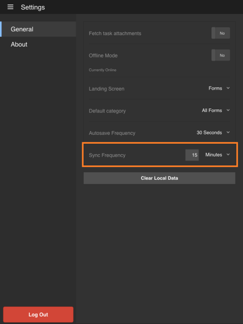

# Synchronisieren der App{#synchronizing-the-app}

## Synchronisieren der App {#synchronizing-the-app-1}

Die Formulare in Ihrer App werden vom AEM Forms-Server heruntergeladen. Die Formulare werden auf den Registerkarten Aufgaben und Forms heruntergeladen. Entwürfe, die aus Formularen erstellt wurden, werden auf die Registerkarte Entwürfe heruntergeladen und Entwürfe, die aus Aufgaben erstellt wurden, werden auf die Registerkarte Aufgaben heruntergeladen. Für ein eigenständiges Formular auf dem OSGi-Server werden Formulare und Entwürfe auf den Registerkarten &quot;Forms&quot;bzw. &quot;Entwurf&quot;heruntergeladen.

Wenn Sie ein Formular ausfüllen und senden, wird das Formular sofort auf den AEM Forms-Server hochgeladen, wenn die App online ist. Die Formulare werden beim Synchronisieren der App vom Server abgerufen. Die Entwürfe werden jedoch sofort mit dem Server synchronisiert, wenn die App online ist.

Wenn Sie mit dem AEM Forms-Server online sind, wird Ihre App standardmäßig alle 15 Minuten synchronisiert. Sie haben jedoch die Möglichkeit, die Synchronisierungshäufigkeit zu ändern. Alternativ können Sie die App jederzeit manuell synchronisieren.

**Manuelles Synchronisieren der App**

Wählen Sie die Schaltfläche Synchronisieren aus  in der rechten unteren Ecke des Startbildschirms.

**Ändern der Synchronisierungshäufigkeit**

1. Um zum Einstellungsbildschirm zu gelangen, wählen Sie die Menüschaltfläche in der linken oberen Ecke des Startbildschirms und dann die Option **Einstellungen**.
1. Wählen Sie im Bildschirm &quot;Einstellungen&quot;die Registerkarte Allgemein aus.

   

1. Wählen Sie in der Option Sync frequency den Wert rechts neben Sync frequency aus.
1. Wählen Sie in der Dropdownliste die neue Synchronisierungshäufigkeit aus.

### Technische Spezifikationen {#technical-specifications}

* Die Hauptlogik zum Senden der Offline-App-Daten an den AEM Forms-Server ist in runtime/offline/util/offline.js enthalten.
* In der .js sendet der Aufruf der Funktion &quot;processOfflineSubmittedSavedTasks(...)&quot;die gespeicherten/gesendeten Aufgaben an den Server. Außerdem werden alle Fehler oder Konflikte im Synchronisierungsprozess behandelt. Wenn die Übermittlung einer Aufgabe fehlschlägt, wird die Aufgabe auf der App als fehlgeschlagen markiert. Darüber hinaus bleibt die Aufgabe in Ihrem Postausgang.
* Die Funktionen syncSubmittedTask() und syncSavedTask() führen Vorgänge für einzelne Aufgaben durch.
* Der Aufruf der Funktion &quot;processOfflineSubmittedSavedTasks()&quot;wird von der Aufgabenlistenkomponente initiiert, nachdem ein Benutzer die Synchronisierung des Offline-Status mit dem Server oder eine automatische Synchronisierung durch den Hintergrund-Thread ausgewählt hat.
