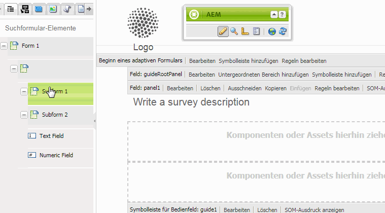
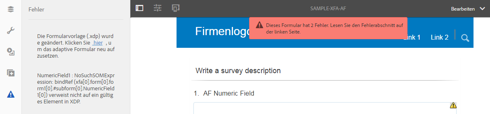
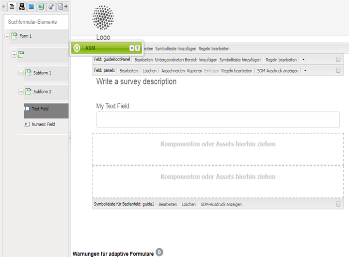
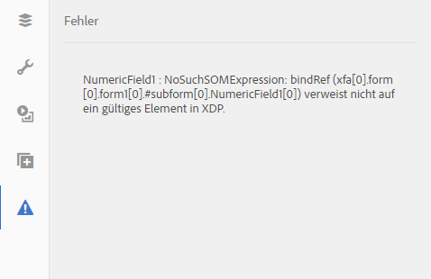

# Synchronisieren von adaptiven Formularen mit XFA-Formularvorlagen{#synchronizing-adaptive-forms-with-xfa-form-templates}

## Einführung {#introduction}

Sie können ein adaptives Formular basierend auf einer XFA-Formularvorlage ( `*.XDP`-Datei) erstellen. Diese Wiederverwendung ermöglicht es Ihnen, Ihre Investition in vorhandene XFA-Formulare beizubehalten. Informationen zum Verwenden einer XFA-Formularvorlage zum Erstellen eines adaptiven Formulars finden Sie unter [Erstellen eines adaptiven Formulars basierend auf einer Vorlage](../../forms/using/creating-adaptive-form.md#p-create-an-adaptive-form-based-on-an-xfa-form-template-p).

Sie können Felder aus der XDP-Datei in Ihrem adaptiven Formular wiederverwenden. Diese Felder werden auch als gebundene Felder bezeichnet. Die Eigenschaften der gebundenen Felder (wie Skripte, Beschriftungen und Anzeigeformat) werden aus der XDP-Datei kopiert. Sie können auch die Werte einiger dieser Eigenschaften überschreiben.

AEM Forms bietet die Möglichkeit, die Felder der adaptiven Formulare mit allen Änderungen zu synchronisieren, die später an den entsprechenden Feldern in der XDP-Datei vorgenommen werden. In diesem Artikel wird beschrieben, wie Sie diese Synchronisierung aktivieren können.

In der Authoring-Umgebung von AEM Forms können Sie Felder aus einem XFA-Formular (links) in ein adaptives Formular (rechts) ziehen.

## Voraussetzungen {#prerequisites}

Um die Informationen in diesem Artikel zu verwenden, sollten Sie mit den folgenden Themen vertraut sein:

* [Erstellen eines adaptiven Formulars](../../forms/using/creating-adaptive-form.md)

* XFA (XML Forms Architecture)

Um die Assets für das Beispiel im Artikel zu verwenden, laden Sie das Beispielpaket wie im nächsten Abschnitt [Beispielpaket](../../forms/using/synchronizing-adaptive-forms-xfa.md#p-sample-package-p) beschrieben herunter.

## Beispielpaket {#sample-package}

Der Artikel verwendet ein Beispiel, um zu veranschaulichen, wie Sie das adaptive Formular mit einer aktualisierten XFA-Formularvorlage synchronisieren. Die im Beispiel verwendeten Assets sind in einem Paket verfügbar, das aus dem Abschnitt [Downloads](../../forms/using/synchronizing-adaptive-forms-xfa.md#p-downloads-p) in diesem Artikel heruntergeladen werden kann.

Nachdem Sie das Paket hochgeladen haben, können Sie diese Assets in der AEM Forms-UI anzeigen.

Installieren Sie das Paket mit dem Package Manager: `https://<server>:<port>/crx/packmgr/index.jsp`

Das Paket enthält die folgenden Assets:

1. `sample-form.xdp`: Die als Beispiel verwendete XFA-Formularvorlage

1. `sample-xfa-af`: Das adaptive Formular, das auf der Datei sample-form.xdp basiert. Dieses adaptive Formular enthält jedoch keine Felder. Im nächsten Schritt fügen wir diesem adaptiven Formular Inhalt hinzu.

### Hinzufügen von Inhalt zu einem adaptiven Formular {#add-content-to-adaptive-form-br}

1. Navigieren Sie zu https://&lt;server>:&lt;port>/aem/forms.html. Geben Sie Ihre Anmeldeinformationen ein, wenn Sie danach gefragt werden.
1. Öffnen Sie sample-af-xfa zur Bearbeitung im Authoring-Modus.
1. Wählen Sie im Inhalt-Browser in der Seitenleiste die Registerkarte „Datenmodellobjekte“. Ziehen Sie NumericField1 und TextField1 auf das adaptive Formular.
1. Ändern Sie den Titel von NumericField1 von **Numeric Field** in **AF Numeric Field.**

>[!NOTE]
>
>In den vorangegangenen Schritten haben wir eine Eigenschaft eines Feldes in der XDP-Datei überschrieben. Diese Eigenschaft wird daher nicht synchronisiert, wenn die entsprechende Eigenschaft in der XDP-Datei später geändert wird.

## Erkennen von Änderungen in der XDP-Datei {#detecting-changes-in-xdp-file}

Sobald es Änderungen in einer XDP-Datei oder einem Fragment gibt, kennzeichnet die AEM Forms-UI alle adaptiven Formulare, die auf der XDP-Datei oder dem Fragment basieren.

Nachdem Sie eine XDP-Datei aktualisiert haben, müssen Sie sie erneut in die AEM Forms-Benutzeroberfläche hochladen, damit die Änderungen gekennzeichnet werden.

Als Beispiel aktualisieren wir die Datei `sample-form.xdp` anhand der folgenden Schritte:

1. Navigieren Sie zu `https://<server>:<port>/projects.html.` Geben Sie bei Aufforderung Ihre Anmeldedaten ein.
1. Klicken Sie links auf die Registerkarte „Formulare“.
1. Laden Sie die Datei `sample-form.xdp` auf Ihren lokalen Computer herunter. Die XDP-Datei wird als `.zip`-Datei heruntergeladen, die mit einem beliebigen Dienstprogramm zur Dateidekomprimierung extrahiert werden kann.

1. Öffnen Sie die Datei `sample-form.xdp` und ändern Sie den Titel des Feldes „TextField1“ von **Textfeld** in **Mein Textfeld**.

1. Laden Sie die Datei `sample-form.xdp` wieder in die AEM Forms-Benutzeroberfläche hoch.

Wenn eine XDP-Datei aktualisiert wird, wird ein Symbol im Editor angezeigt, wenn Sie die adaptiven Formulare, die auf der XDP-Datei basieren, bearbeiten. Dieses Symbol gibt an, dass das adaptive Formular nicht mehr mit der XDP-Datei synchron ist. Im folgenden Bild finden Sie das Symbol daneben in der Randleiste.

## Synchronisieren von adaptiven Formularen mit der neuesten XDP-Datei {#synchronizing-adaptive-forms-with-the-latest-xdp-file}

Wenn ein adaptives Formular, das nicht mehr mit der XDP-Datei synchron ist, zum nächsten Mal für das Authoring geöffnet wird, wird die folgende Meldung angezeigt: **Schema/Form Template for the Adaptive Form has been updated. `Click Here` , um es mit der neuen Version neu zu erstellen.**

Durch Klicken auf die Meldung werden die Felder im adaptiven Formular mit den entsprechenden Feldern in der XDP-Datei synchronisiert.

Öffnen Sie für das in diesem Artikel verwendete Beispiel `sample-xfa-af` im Authoring-Modus. Die Meldung wird am unteren Rand des adaptiven Formulars angezeigt.

### Aktualisieren der Eigenschaften {#updating-the-properties}

Alle Eigenschaften, die aus der XDP-Datei in das adaptive Formular kopiert wurden, werden aktualisiert, mit Ausnahme der Eigenschaften, die explizit im adaptiven Formular (aus dem Komponentendialogfeld) vom Autor überschrieben wurden. Die Liste der Eigenschaften, die aktualisiert wurden, ist in den Serverprotokollen verfügbar.

Um die Eigenschaften im adaptiven Beispielformular zu aktualisieren, klicken Sie in der Meldung auf den Link (mit der Bezeichnung `"Click Here"`). Der Titel von TextField1 ändert sich von **Textfeld** in **Mein Textfeld**.

>[!NOTE]
>
>Die Beschriftung AF Numeric Field wurde nicht geändert, da Sie diese Eigenschaft im Dialogfeld Komponenteneigenschaften überschrieben haben, wie unter [Hinzufügen Inhalt in adaptive Formulare](../../forms/using/synchronizing-adaptive-forms-xfa.md#p-add-content-to-adaptive-form-br-p) beschrieben.

### Hinzufügen neuer Felder aus einer XDP-Datei in ein adaptives Formular   {#adding-new-fields-from-xdp-file-to-adaptive-form-nbsp}

Felder, die später zur Original-XDP-Datei hinzugefügt werden, werden in der Registerkarte „Form Hierarchy“ (Formularhierarchie) angezeigt. Sie können diese neuen Felder in das adaptive Formular ziehen.

Sie müssen nicht auf den Link in der Fehlermeldung klicken, um die Felder in der Registerkarte „Form Hierarchy“ (Formularhierarchie) zu aktualisieren.

### Gelöschte Felder in der XDP-Datei {#deleted-fields-in-xdp-file}

Wenn ein Feld, das zuvor in ein adaptives Formular kopiert wurde, aus einer XDP-Datei gelöscht wird, wird eine Fehlermeldung im Authoring-Modus angezeigt, die angibt, dass das Feld nicht in der XDP-Datei vorhanden ist. In diesem Fall müssen Sie das Feld manuell aus dem adaptiven Formular löschen oder die Eigenschaft `bindRef` im Komponentendialogfeld löschen.

Die folgenden Schritte veranschaulichen diesen Gebrauchsfluss für die Assets in dem in diesem Artikel verwendeten Beispiel:

1. Aktualisieren Sie die Datei `sample-form.xdp` und löschen Sie NumericField1.
1. Laden Sie die Datei `sample-form.xdp` in die AEM Forms-Benutzeroberfläche hoch.
1. Öffnen Sie das adaptive Formular `sample-xfa-af` zum Authoring. Die folgende Fehlermeldung wird angezeigt: Schema-/Formularvorlage für das adaptive Formular wurde aktualisiert. `Click Here` , um es mit der neuen Version neu zu erstellen.

1. Klicken Sie in der Nachricht auf den Link (mit der Bezeichnung &quot; `Click Here`&quot;). Eine Fehlermeldung wird angezeigt, dass das Feld nicht mehr in der XDP-Datei vorhanden ist.

Das gelöschte Feld wird ebenfalls mit einem Symbol gekennzeichnet, um einen Fehler im Feld anzuzeigen.

>[!NOTE]
>
>Die Felder im adaptiven Formular, die eine inkorrekte Bindung aufweisen (einen ungültigen `bindRef`-Wert im Bearbeitungsdialogfeld) werden ebenfalls als gelöschte Felder betrachtet. Wenn der Autor diese Fehler nicht behebt und das adaptive Formular veröffentlicht, wird das Feld als normales ungebundenes adaptives Formularfeld behandelt und in den unbinded-Abschnitt der Ausgabe-XML-Datei aufgenommen.

## Downloads {#downloads}

Inhaltspaket für das Beispiel in diesem Artikel

[Datei laden](assets/sample-xfa-af-sync-1.0.zip)
