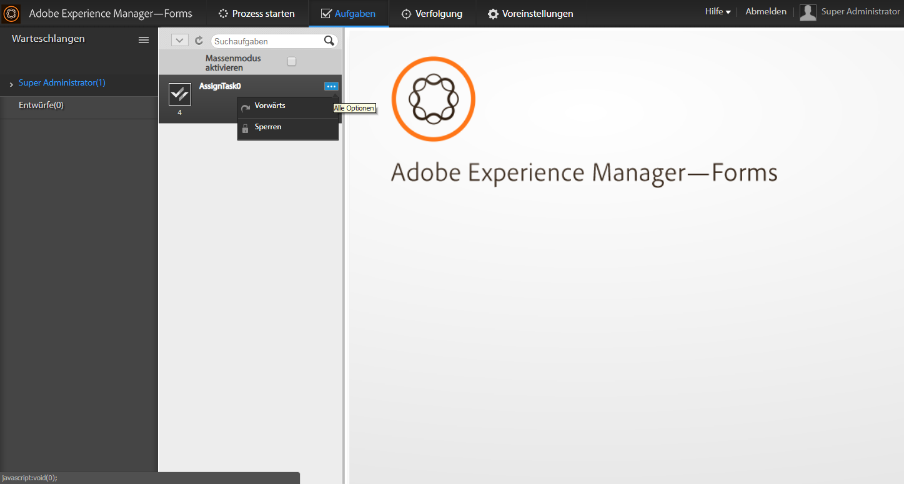

# Verwalten von Aufgaben in einer hierarchischen Struktur mithilfe der Manager-Ansicht{#managing-tasks-in-an-organizational-hierarchy-using-manager-view}

In AEM Forms Workspace können Manager jetzt auf die Aufgaben zugreifen, die Benutzern in ihren Hierarchien – direkt oder indirekt unterstellten Mitarbeitern – zugewiesen sind, und dafür verschiedene Aktionen ausführen. Die Aufgaben sind in AEM Forms Workspace auf der Registerkarte „Aufgaben“ verfügbar. Folgende Aktionen werden für die Aufgaben von Direktberichten unterstützt:

**Weiterleiten** - Leitet eine Aufgabe aus einem direkten Bericht an einen beliebigen Benutzer weiter.

**Anspruch** - Fordert eine Aufgabe eines direkt unterstellten Mitarbeiters an.

**Anfordern und Öffnen** - Fordert eine Aufgabe eines direkt unterstellten Mitarbeiters an und öffnet sie automatisch in der Aufgabenliste des Managers.

**Ablehnen** - Lehnen Sie eine Aufgabe ab, die von einem anderen Benutzer an einen direkt unterstellten Mitarbeiter weitergeleitet wurde. Diese Option ist für die Aufgaben verfügbar, die von anderen Benutzern an einen direkt unterstellten Mitarbeiter weitergeleitet wurden.

AEM Forms beschränkt den Zugriff eines Benutzers auf die Aufgaben, für die der Benutzer die Zugriffskontrolle (ACL) hat. Mit einer solchen Prüfung wird sichergestellt, dass ein Benutzer nur die Aufgaben abrufen kann, für die er Zugriffsberechtigungen hat. Mit Webdiensten von Drittanbietern und Implementierungen zur Definition der Hierarchie kann ein Unternehmen die Definition von Manager- und Direktberichten an seine Anforderungen anpassen.

1. Erstellen Sie einen DSC. Weitere Informationen erhalten Sie unter „Entwickeln von Komponenten für AEM Forms“ im Handbuch [Programmieren mit AEM Forms](https://www.adobe.com/go/learn_aemforms_programming_63_de).
1. Definieren Sie in dem DSC eine neue SPI für das Hierarchiemanagement, um direkt unterstellte Mitarbeiter und Hierarchie unter den AEM Forms-Benutzern zu definieren. Im Folgenden finden Sie ein Beispiel für ein Java™-Codefragment.

   ```java
   public class MyHierarchyMgmtService
   {
        /*
       Input : Principal Oid for a livecycle user
       Output : Returns true when the user is either the service invoker OR his direct/indirect report.
       */
       boolean isInHierarchy(String principalOid) {
   
       }
   
       /*
       Input : Principal Oid for a livecycle user
       Output : List of principal Oids for direct reports of the livecycle user
       A user may get direct reports only for himself OR his direct/indirect reports.
       So the API is functionally equivalent to -
       isInHierarchy(principalOid) ? <return direct reports> : <return empty list>
       */
       List<String> getDirectReports(String principalOid) {
   
       }
   
       /*
       Returns whether a livecycle user has direct reports or not.
       It is functionally equivalent to -
       getDirectReports(principalOid).size()>0
       */
       boolean isManager(String principalOid) {
   
       }
   }
   ```

1. Erstellen Sie eine Datei &quot;component.xml&quot;. Stellen Sie sicher, dass spec-id mit dem unten im Codefragment gezeigten übereinstimmt. Im Folgenden finden Sie ein Beispielcode-Snippet, das Sie wiederverwenden können.

   ```xml
   <component xmlns="https://adobe.com/idp/dsc/component/document">
       <component-id>com.adobe.sample.SampleDSC</component-id>
       <version>1.1</version>
       <supports-export>false</supports-export>
         <descriptor-class>com.adobe.idp.dsc.component.impl.DefaultPOJODescriptorImpl</descriptor-class>
         <services>
           <service name="MyHierarchyMgmtService" title="My hierarchy management service" orchestrateable="false">
           <auto-deploy service-id="MyHierarchyMgmtService" category-id="Sample DSC" major-version="1" minor-version="0" />
           <description>Service for resolving hierarchy management.</description>
            <specifications>
            <specification spec-id="com.adobe.idp.taskmanager.dsc.enterprise.HierarchyManagementProvider"/>
            </specifications>
           <specification-version>1.0</specification-version>
           <implementation-class>com.adobe.sample.hierarchymanagement.MyHierarchyMgmtService</implementation-class>
           <request-processing-strategy>single_instance</request-processing-strategy>
           <supported-connectors>default</supported-connectors>
           <operation-config>
               <operation-name>*</operation-name>
               <transaction-type>Container</transaction-type>
               <transaction-propagation>supports</transaction-propagation>
               <!--transaction-timeout>3000</transaction-timeout-->
           </operation-config>
           <operations>
               <operation anonymous-access="true" name="isInHierarchy" method="isInHierarchy">
                   <input-parameter name="principalOid" type="java.lang.String" />
                   <output-parameter name="result" type="java.lang.Boolean"/>
               </operation>
               <operation anonymous-access="true" name="getDirectReports" method="getDirectReports">
                   <input-parameter name="principalOid" type="java.lang.String" />
                   <output-parameter name="result" type="java.util.List"/>
               </operation>
               <operation anonymous-access="true" name="isManager" method="isManager">
                   <input-parameter name="principalOid" type="java.lang.String" />
                   <output-parameter name="result" type="java.lang.Boolean"/>
               </operation>
               </operations>
               </service>
         </services>
   </component>
   ```

1. Stellen Sie DSC über Workbench bereit. Starten Sie den Service `ProcessManagementTeamTasksService` neu.
1. Möglicherweise müssen Sie den Browser aktualisieren oder sich für den Benutzer erneut abmelden/anmelden.

Der folgende Bildschirm veranschaulicht den Zugriff auf die Aufgaben direkter Berichte und die verfügbaren Aktionen.



Zugreifen auf Aufgaben direkt unterstellter Mitarbeiter und Ausführen von Aktionen für die Aufgaben
