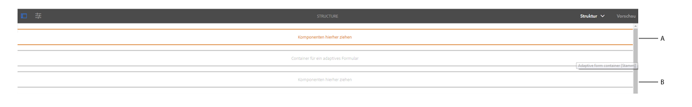
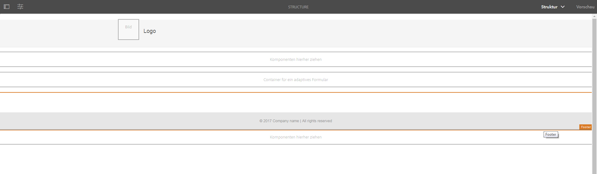
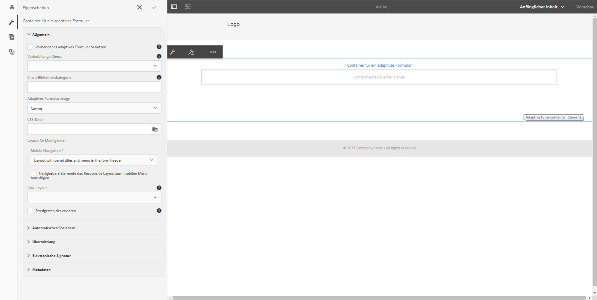
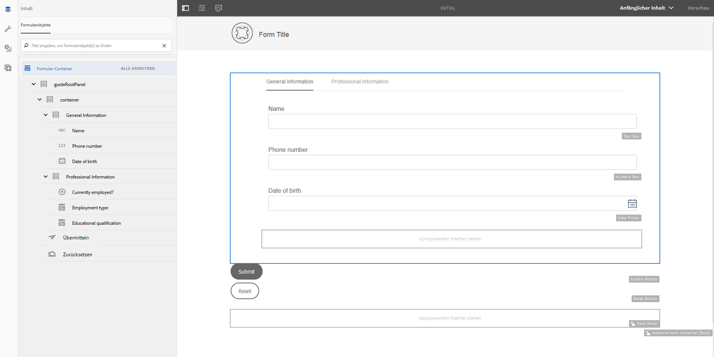

# Adaptive Formularvorlagen{#adaptive-form-templates}

Wenn Sie ein Formular erstellen, fügen Sie Felder und Komponenten hinzu, um Formularstruktur, Inhalt und Aktionen im Editor zu definieren. Sie können Felder und Komponenten im`guideRootPanel`   des Formularcontainers hinzufügen. Mit dem Vorlageneditor können Sie eine Vorlage erstellen, die eine Grundstruktur und anfänglichen Inhalt enthält, die Autoren zum Erstellen von Formularen verwenden können.

Beispiel: Sie möchten, dass alle Autoren in einem Registrierungsformular bestimmte Textfelder, Navigationsschaltflächen und eine Schaltfläche zum Senden verwenden. Sie können eine Vorlage mit den Komponenten erstellen, die Autoren verwenden können, damit ihr Formular konsistent mit anderen Registrierungsformularen ist. Wenn Autoren die Vorlage verwenden, um ein adaptives Formular zu erstellen, erbt das neue Formular die Struktur und die Komponenten, die Sie in der Vorlage festgelegt haben. Mit dem Vorlageneditor können Sie:

* Kopf- und Fußzeilenkomponenten eines Formulars in der Strukturebene hinzufügen.
* Den anfänglichen Inhalt für das Formular angeben.
* Ein Design und Übermittlungsaktionen festlegen.

## Arbeiten mit Vorlagen {#working-with-templates}

Sie können über das Menü „Werkzeuge“ auf den Vorlagen-Editor zugreifen: Navigieren Sie zu **Adobe Experience Manager > Werkzeuge > Vorlagen**. Hier befinden sich die Vorlagen in Ordnern für bearbeitbare Vorlagen. In AEM steht ein globaler Ordner zum Organisieren von Vorlagen zur Verfügung. Diese ist jedoch nicht standardmäßig aktiviert. Sie können Ihren Administrator bitten, den globalen Ordner zu aktivieren oder einen neuen Ordner für Vorlagen zu erstellen. Weitere Informationen zum Erstellen von Ordnern finden Sie unter [Vorlagenordner](/help/sites-developing/page-templates-editable.md).

Wenn Sie auf tippen, um einen Ordner zu öffnen, finden Sie die Schaltfläche &quot;Erstellen&quot;, mit der Sie eine neue Vorlage für adaptive Formulare erstellen können.

### Erstellen einer Vorlage {#create-template}

Nachdem Sie einen Ordner erstellt haben, öffnen Sie den Ordner und führen die folgenden Schritte aus, um eine Vorlage zu erstellen:

1. In der Vorlagenkonsole tippen Sie im erstellten Ordner auf **Erstellen**.
1. Wählen Sie im Abschnitt „Vorlagentyp wählen“ **Adaptive Formularvorlage** und tippen Sie auf **Weiter**.

1. Geben Sie im Abschnitt „Vorlagendetails“ einen Namen für die Vorlage an und tippen Sie auf **Erstellen**.
Sie können eine Beschreibung und eine Miniaturansicht hinzufügen, die angezeigt wird, wenn Sie die erstellte Vorlage beim Formular-Authoring auswählen.

1. Tippen Sie auf **Fertig**, um zur Konsole zurückzukehren oder auf **Öffnen**, um die Vorlage im Editor zu öffnen.

### Benutzeroberfläche des Vorlageneditors {#template-editor-ui}

Wenn Sie eine Vorlage zum Bearbeiten öffnen, können Sie die folgenden AEM-Editor-Komponenten sehen:

* **Seitensymbolleiste** Enthält die folgenden Optionen:

   * **Seitliches Bedienfeld ein/aus**: Hier können Sie die Seitenleiste ein- oder ausblenden.
   * **Seiteninformationen**: Ermöglicht Ihnen die Angabe von Informationen wie dem Zeitpunkt der Veröffentlichung oder der Zurücknahme der Veröffentlichung, Miniaturen, clientseitigen Bibliotheken, einer Seitenrichtlinie und dem Seitendesign einer clientseitigen Bibliothek.
   * **Emulator**: Hier können Sie das Erscheinungsbild für verschiedene Geräte simulieren und anpassen.
   * **Ebenenauswahl:** Hiermit können Sie die Ebene ändern.
Sie können die Ebene **Struktur** oder die Ebene **Anfänglicher Inhalt** auswählen. Auf der Strukturebene können Sie die Kopf- und Fußzeile hinzufügen und anpassen. Auf der Ebene &quot;Anfänglicher Inhalt&quot;können Sie den Formularinhalt anpassen.

   * **Vorschau:** Hier können Sie Vorschauen dazu erstellen, wie die Vorlage aussieht, wenn Sie sie veröffentlichen. Sie können den Ebenenselektor und die Vorschau verwenden, um zwischen Bearbeitungs- und Vorschau-Modus zu wechseln.

* **Seitenleiste:** Enthält die Inhalts-, Eigenschaften-, Elemente- und Komponenten-Browser.
* **Komponenten-Symbolleiste:** Wenn Sie eine Komponente auswählen, wird eine Symbolleiste angezeigt, mit der Sie die Komponente anpassen können.
* **Seite**: Der Bereich, in dem Sie Inhalt hinzufügen, um die Vorlage zu erstellen.

Weitere Informationen zum Touch UI-Editor finden Sie unter [Einführung in das Authoring adaptiver Formulare.](../../forms/using/introduction-forms-authoring.md)

### Bearbeiten einer Vorlage {#editing-a-template}

Eine adaptive Formularvorlage wird mit zwei Ebenen erstellt:

* Struktur
* Anfänglicher Inhalt

Der Ebenenselektor ist neben der Option „Vorschau“ in der oberen rechten Ecke des Bildschirms verfügbar.

### Struktur {#structure}

Wenn Sie die Strukturebene im Vorlageneditor auswählen, werden die Layout-Container über und unter dem Container für adaptive Formulare angezeigt. Autoren können diese Layout-Container für Kopf- und Fußzeile verwenden. Sie können die Kopf- und Fußzeile hinzufügen, bearbeiten oder anpassen. Ziehen Sie die Kopfzeilenkomponente des adaptiven Formulars in den Layout-Container über dem Container des adaptiven Formulars, um die Vorlagenkopfzeile anzupassen. Ziehen Sie die Fußzeilenkomponente des adaptiven Formulars in den Layout-Container unter dem Container des adaptiven Formulars, um die Vorlagenfußzeile anzupassen.

Layout-Container in der Strukturebene

**A.** Layout-Container für die Kopfzeilenkomponente  **B.** Layout-Container für Fußzeilenkomponente

Ziehen Sie die Kopfzeilenkomponente des adaptiven Formulars in den Layout-Container über dem Container des adaptiven Formulars. Nachdem Sie die Komponente hinzugefügt haben, können Sie seine Eigenschaften festlegen, mit denen Sie ein Logo hinzufügen und den Titel angeben können.

Wenn Sie die Fußzeilenkomponente in den Layout-Container unter dem Container des adaptiven Formulars ziehen, können Sie ebenso Urheberrechtsinformationen und Unternehmensdetails angeben.

Kopf- und Fußzeile in der Strukturebene hinzugefügt

#### Sperren/Entsperren von Komponenten in der Strukturebene  {#locking-unlocking-components-in-the-structure-layer}

Wenn Sie die Vorlage bearbeiten, wenn die Strukturebene ausgewählt ist, können Sie die Kopf- und Fußzeile der Vorlage entsperren. Wenn eine Komponente in der Vorlage entsperrt wurde, können Formularautoren die Komponente im adaptiven Formular bearbeiten, das die Vorlage verwendet. Das Sperren einer Komponente verhindert, dass Formularautoren diese in dem adaptiven Formular bearbeitren. Die Sperroption ist in der Komponenten-Symbolleiste verfügbar.

Beispiel: Sie fügen die Fußzeilenkomponente der Vorlage hinzu. Wenn Sie die Komponente wählen, können Sie die Sperroption in der Komponenten-Symbolleiste sehen. In der Regel enthält die Kopfzeile Firmennamen und Logo, und Sie möchten nicht, dass Formularautoren das Logo und die Kopfzeile in einer Vorlage ändern. In einem adaptiven Formular, das mit der Vorlage erstellt wurde, bei der die gesperrt ist, können Formularautoren das Logo und den Firmennamennicht ändern.

>[!NOTE]
>
>Das einzelne Sperren oder Entsperren von Bild oder Logo in der Kopfzeilenkomponente wird nicht empfohlen. Sie können die Kopfzeilenkomponente entsperren.

### Anfänglicher Inhalt {#initial-content}

Wenn die Option „Anfänglicher Inhalt“ ausgewählt ist, wird der Container des adaptiven Formulars der Vorlage wie ein adaptives Formular zur Bearbeitung geöffnet. Wie beim Authoring eines adaptiven Formulars können Sie anfängliche Einstellungen festlegen, z. B. ein Design und Übermittlungsaktionen.

Autoren können sie als Grundlage verwenden, um ein Formular zu erstellen. Die Struktur des Inhaltsflusses wird in der Ebene „Anfänglicher Inhalt“ der Vorlage festgelegt. Um zum Bearbeiten des anfänglichen Inhalts der Formularvorlage zu wechseln, bevor die Vorschau in der Seitensymbolleiste erfolgt, tippen Sie auf  **> Anfänglicher Inhalt**.

In der Ebene „Anfänglicher Inhalt“ im Vorlageneditor ist der Container des adaptiven Formulars zum Festlegen von Eigenschaften ausgewählt.

In der Ebene „Anfänglicher Inhalt“ erstellen Sie die Vorlage für ein adaptives Formular, das Ihre Autoren als Grundlage verwenden. Beim Erstellen einer Vorlage verwenden Sie, ähnlich wie beim Erstellen eines Formulars, Optionen aus der Seitenleiste. Die Seitenleiste enthält die Inhalts-, Eigenschaften-, Elemente- und Komponenten-Browser.

Weitere Informationen finden Sie unter [Randleiste](../../forms/using/introduction-forms-authoring.md#sidebar).

>[!NOTE]
>
>Wenn Sie &quot;Inhalt speichern&quot;oder &quot;PDF speichern&quot;als Übermittlungsaktion auswählen, erhalten Sie eine Option zum Festlegen des Pfads für die Datenspeicherung. Wenn Sie einen Pfad in der Vorlage angeben, haben alle daraus erstellten Formulare denselben Pfad. Sie können den korrekten Speicherpfad angeben oder den Formularautoren die Angabe eines anderen Pfads überlassen, damit die Daten von jedem Formular nicht im gleichen Verzeichnis gespeichert werden.

#### Erstellen einer Vorlage für ein adaptives Formular mit Registerkarten und Bedienfeldern   {#creating-an-adaptive-form-template-with-tabs-and-panels-nbsp}

Beispiel: Sie erstellen eine Vorlage mit den folgenden Registerkarten:

* Allgemeine Informationen
* Berufliche Informationen

Sie haben ein Logo hinzugefügt, einen Titel angegeben und eine Fußzeile in der Strukturebene hinzugefügt. Sperren Sie die Kopf- und Fußzeile, damit Autoren sie nicht bearbeiten, wenn sie die Vorlage zum Erstellen von Formularen verwenden.

Ändern Sie die Ebene von „Struktur“ zu „Anfänglicher Inhalt“ und beginnen Sie mit dem Hinzufügen von Inhalten zum Formular. Um eine Struktur mit Registerkarten zu erstellen, fügen Sie ein untergeordnetes Bedienfeld im guideRootPanel des Containers für das adaptive Formular hinzu. Hinzufügen eines Bedienfelds:

* Sie können ein Bedienfeld hinzufügen, indem Sie auf die Schaltfläche **+** tippen, wenn Sie die Option **Komponenten hierher ziehen** auswählen.

* Sie können die Bedienfeldkomponente aus dem Komponenten-Browser in der Seitenleiste ziehen.
* Sie können ein untergeordnete Bedienfeld von `guideRootPanel` aus der Symbolleiste hinzufügen.

Um die Registerkarten „Allgemeine Informationen“ und „Berufliche Informationen“ zu erstellen, fügen Sie zwei Bedienfelder im untergeordneten Bedienfeld von `guideRootPanel` hinzu. Wählen Sie die Bedienfelder aus und tippen Sie auf , um die Eigenschaften in der Seitenleiste zu öffnen. Ändern Sie die Elementnamen in `general-info` und `professional-info` und die Titel in „Allgemeine Informationen“ bzw. „Berufliche Informationen“. Klicken Sie in der Randleiste auf „Inhalt“, um den Inhalts-Browser zu öffnen. Wählen Sie in der Registerkarte „Formularobjekte“ `guideRootPanel` aus. Im Editor ist „guideRootPanel“ ausgewählt. Tippen Sie in der Komponenten-Symbolleiste auf , um die Eigenschaften zu öffnen. Wählen Sie im Feld „Bedienfeldlayout“ **Registerkarten oben** und tippen Sie dann auf **Fertig**. Die Vorlagenstruktur mit Registerkarten wird angewendet.

#### Hinzufügen von Inhalten in Registerkarten {#adding-content-in-tabs}

Nachdem Sie Bedienfelder hinzugefügt und sie als Registerkarten strukturiert haben, können Sie Felder innerhalb der Registerkarten hinzufügen. Wenn Sie eine Registerkarte im Editor auswählen, sehen Sie die Option **Komponenten hierher ziehen**. Sie können Komponenten wie Textboxen, Listenelemente und Schaltflächen per Drag&amp;Drop verschieben. Sie können Komponenten aus dem Komponenten-Browser in der Seitenleiste ziehen.

Jede Komponente verfügt über Eigenschaften, die die Datenerfassung und -bearbeitung verbessern. Beispielsweise können Sie die Eigenschaft **Erforderliches Feld** einer Komponente aktivieren. Die Autoren können die Meldung festlegen, die Ihre Kunden sehen, wenn sie das Ausfüllen eines erforderlichen Felds überspringen. Geben Sie die Meldung in der Eigenschaft **Erforderliche Feldmeldung** an.

In der Beispielvorlage werden die Felder „Name“, „Telefonnummer“ und „Geburtstag“ in der Registerkarte „Allgemeine Informationen“ hinzugefügt. In der Registerkarte „Berufliche Informationen“ werden die Felder „Derzeit beschäftigt“, „Beschäftigungsverhältnis“ und „Bildungsabschluss“ hinzugefügt.

Nachdem Sie Felder hinzugefügt haben, können Sie Schaltflächen wie „Senden“ und „Zurücksetzen“ hinzufügen.

### Aktivieren der Vorlage  {#enabling-the-template}

Wenn Sie eine Vorlage erstellen, wird sie als Entwurf hinzugefügt. Aktivieren Sie die Vorlage, um sie zum Erstellen von adaptiven Formularen zu verwenden. Aktivieren einer Vorlage:

1. Navigieren Sie zu **Adobe Experience Manager > Extras > Vorlagen** und öffnen Sie den Ordner, in dem Sie die Vorlage erstellt haben.

1. Die Vorlage, die Sie erstellt haben, ist als Entwurf gekennzeichnet.
1. Wählen Sie die Vorlage aus und tippen Sie auf **Aktivieren** in der Symbolleiste.
Wenn Sie ein adaptives Formular erstellen, wird die Vorlage aufgeführt, wenn Sie aufgefordert werden, eine Vorlage auszuwählen.

## Importieren oder Exportieren einer Vorlage {#importing-or-exporting-a-template}

Ein Formular funktioniert mit seiner Vorlage. Wenn Sie ein adaptives Formular herunterladen, das mit einer benutzerdefinierten Vorlage erstellt wird, wird die Vorlage nicht heruntergeladen. Wenn Sie das Formular in eine andere AEM Forms-Instanz importieren, wird es ohne die Vorlage importiert. Wenn ein Formular importiert wird, aber die Vorlage nicht verfügbar ist, wird das Formular nicht gerendert. Sie können die benutzerdefinierte Vorlage vom Knoten `/conf` in `https://<server>:<port>/crx/packmgr` verpacken und in die AEM Forms-Instanz, in die Sie das Formular hochladen möchten, importieren.

## Erstellen eines adaptiven Formulars mithilfe der Vorlage {#creating-an-adaptive-form-using-the-template}

Nachdem Sie eine Vorlage erstellt und aktiviert haben, wird sie im Forms Manager verfügbar, wenn Sie ein adaptives Formular erstellen. Um eine Vorlage zu verwenden und ein adaptives Formular zu erstellen, finden Sie weitere Informationen unter[ Erstellen eines adaptiven Formulars](../../forms/using/creating-adaptive-form.md).

## Ändern von Anzeigeoptionen von Standardvorlagen  {#change-display-option-of-out-of-the-box-templates}

Sie können benutzerdefinierte Vorlagen für adaptive Formulare erstellen, um die grundlegende Struktur und Anfangsinhalte zu definieren. AEM Forms bietet außerdem eine Reihe von Standardvorlagen für adaptive Formulare. Sie können wählen, ob Sie die Vorlagen anzeigen oder ausblenden möchten.

Führen Sie die folgenden Schritte aus, um Vorlagen anzuzeigen bzw. auszublenden:

1. Melden Sie sich bei der Autor-Instanz von AEM Forms an und navigieren Sie zu **Tools** >**Vorgänge** >**Web-Konsole**.

   >[!NOTE]
   >
   >Die URL AEM Webkonsole lautet https://&#39;[server]:[port]&#39;/system/console/configMgr

1. Suchen und öffnen Sie die **FormsManager-Konfigurations** einstellungen:

   * Um die adaptiven Formularvorlage ein- oder auszublenden, aktivieren oder deaktivieren Sie die Option **Einbeziehen der standardmäßigen AF- und AD-Vorlagen**.
   * Um die adaptiven Formularvorlage, die in AEM 6.0 Forms oder AEM 6.1 Forms hinzugefügt wurden, jetzt aber veraltet sind, ein- oder auszublenden, aktivieren oder deaktivieren Sie die Option **Einbeziehen der AEM 6.0 AF-Vorlagen**. Wenn diese Option aktiviert ist, müssen Sie die Konfiguration **Einbeziehen der standardmäßigen AF- und AD-Vorlagen** aktivieren, damit sie aktiviert wird.

1. Klicken Sie auf **Speichern**. Die Anzeigeoptionen für die Standardvorlagen beendet werden geändert.

## Empfehlungen {#recommendations}

* Wenn Sie Eigenschaften des Formulars im Vorlageneditor ändern, verwenden Sie nicht die Eigenschaft „BindReference“.
* Wenn Sie einen Haltepunkt hinzufügen möchten, erstellen Sie ihn, wenn Sie eine Vorlage für ein adaptives Formular bearbeiten.
Weitere Informationen zu Haltepunkten finden Sie unter [Responsive Layout](/help/sites-authoring/responsive-layout.md).

